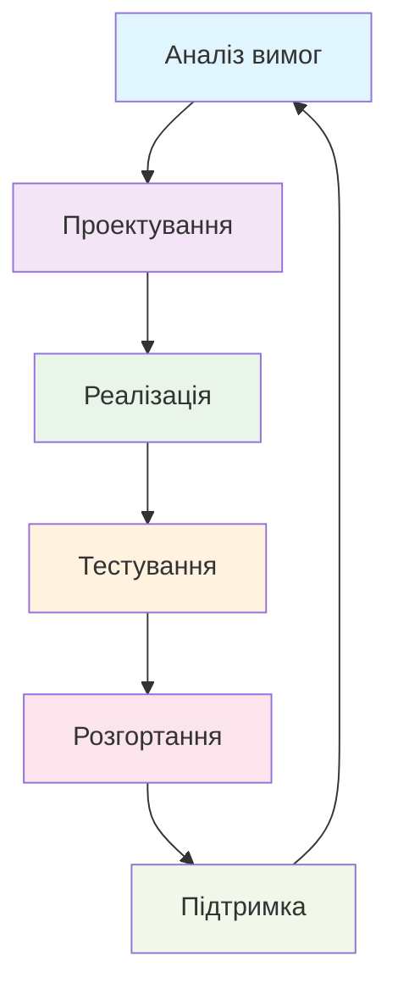

# Курс з основ програмної інженерії

Ласкаво просимо на курс з основ програмної інженерії! Цей курс призначений для студентів, які хочуть вивчити фундаментальні принципи та практики розробки програмного забезпечення.

## Про курс

Програмна інженерія — це дисципліна, що займається систематичним підходом до розробки, експлуатації та підтримки програмного забезпечення. У цьому курсі ви дізнаєтеся про:

- Життєвий цикл розробки програмного забезпечення
- Методології розробки (Waterfall, Agile, Scrum)
- Архітектурні підходи та шаблони проектування
- Принципи тестування та забезпечення якості
- Інструменти та технології сучасної розробки

## Структура курсу

### 📚 Лекції
Теоретичний матеріал, що покриває основні концепції програмної інженерії.

### 🧪 Лабораторні роботи
Практичні завдання для закріплення теоретичного матеріалу.

### 📊 Презентації
Слайди до лекцій для кращого засвоєння матеріалу.

## Цілі курсу

Після завершення курсу студенти зможуть:

- Розуміти основні принципи програмної інженерії
- Застосовувати методології розробки ПЗ
- Проектувати архітектуру програмних систем
- Використовувати сучасні інструменти розробки
- Створювати якісне та підтримуване програмне забезпечення

## Передумови

- Базові знання програмування (будь-якою мовою)
- Розуміння основ комп'ютерних наук
- Бажання вивчати сучасні практики розробки ПЗ

## Приклад Mermaid діаграми

## Як використовувати цей курс

1. Починайте з читання лекцій по порядку
2. Переглядайте відповідні презентації
3. Виконуйте лабораторні роботи для практики
4. Використовуйте пошук для знаходження конкретних тем

---

*Курс створено з ♥️ для студентів, які прагнуть стати кращими розробниками*
