# Лекції

Цей розділ містить теоретичний матеріал курсу з програмної інженерії. Лекції побудовані у логічній послідовності від основ до складніших тем.

## Огляд лекцій

| № | Тема | Опис |
|---|------|------|
| 1 | [Вступ до програмної інженерії](lecture-01.md) | Основні поняття та історія розвитку |
| 2 | [Життєвий цикл розробки ПЗ](lecture-02.md) | Фази та моделі розробки |
| 3 | [Вимоги до програмного забезпечення](lecture-03.md) | Збір, аналіз та специфікація вимог |
| 4 | [Архітектура програмних систем](lecture-04.md) | Архітектурні стилі та шаблони |
| 5 | [Проектування ПЗ](lecture-05.md) | Принципи та методи проектування |
| 6 | [Тестування ПЗ](lecture-06.md) | Види тестування та стратегії |
| 7 | [Управління версіями](lecture-07.md) | Git та робота в команді |
| 8 | [Agile методології](lecture-08.md) | Scrum, Kanban та сучасні підходи |

## Як працювати з лекціями

!!! tip "Рекомендації"
    - Читайте лекції послідовно
    - Робіть нотатки з ключових понять
    - Переглядайте відповідні презентації
    - Виконуйте практичні завдання з лабораторних

!!! info "Зворотний зв'язок"
    Якщо у вас є питання або пропозиції щодо покращення матеріалу, створіть issue в репозиторії курсу.

## Прогрес курсу

```mermaid
gantt
    title План проходження лекцій
    dateFormat  X
    axisFormat %s

    section Основи
    Лекція 1 :done, lec1, 0, 1
    Лекція 2 :done, lec2, 1, 2

    section Аналіз та проектування
    Лекція 3 :active, lec3, 2, 3
    Лекція 4 :       lec4, 3, 4
    Лекція 5 :       lec5, 4, 5

    section Реалізація
    Лекція 6 :       lec6, 5, 6
    Лекція 7 :       lec7, 6, 7
    Лекція 8 :       lec8, 7, 8
```

