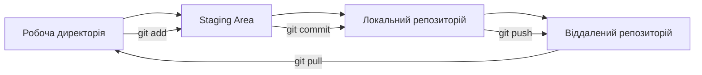
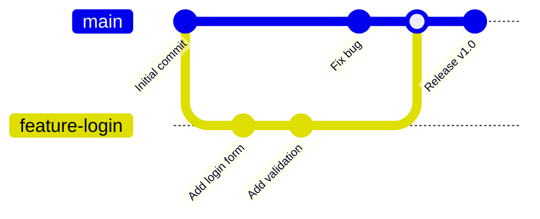

# Лабораторна робота 2 Налаштування середовища розробки та Git workflow

## 🎯 Мета роботи

Створення професійного робочого середовища для командної розробки програмного забезпечення, оволодіння основними принципами роботи з системою контролю версій Git та впровадження ефективного workflow для групової роботи над програмними проєктами.

## ✅ Завдання

### Рівень 1

Налаштування індивідуального робочого середовища та освоєння основ Git:

- встановити та сконфігурувати Git на локальному комп'ютері;
- створити акаунт на GitHub;
- створити локальний репозиторій та виконати базові операції (init, add, commit, push);
- склонувати існуючий репозиторій та синхронізувати зміни;
- вивчити структуру Git репозиторію та основні команди;
- створити файл README.md з описом проєкту.

### Рівень 2

Організація командної роботи з використанням Git workflow:

- виконати всі завдання з рівня 1;
- створити та працювати з гілками (branch, checkout, merge);
- налаштувати спільний репозиторій для команди;
- використовувати Pull Request/Merge Request для code review;
- вирішувати конфлікти при злитті гілок.

### Рівень 3

Впровадження професійних практик розробки:

- виконати всі завдання з рівня 2;
- інтегрувати з IDE (VS Code) для ефективної роботи з Git;
- створити .gitignore файл для проєкту.


## 🖥️ Програмне забезпечення

- Git [git-scm.com](https://git-scm.com) - розподілена система контролю версій;
- GitHub [github.com](https://github.com) - хмарна платформа для хостингу Git репозиторіїв;
- Visual Studio Code [code.visualstudio.com](https://code.visualstudio.com) - редактор коду з підтримкою Git;
- GitHub Desktop [desktop.github.com](https://desktop.github.com) - графічний клієнт Git (опціонально).

## 👥 Форма виконання роботи

Форма виконання роботи **групова** (3-4 особи в команді). Кожна команда створює спільний репозиторій та демонструє навички командної розробки.

## 📝 Критерії оцінювання

- середній рівень (оцінка "задовільно", 4-6) - виконано завдання рівня 1. Налаштовано індивідуальне робоче середовище, продемонстровано базові навички роботи з Git. Під час захисту здобувач освіти демонструє розуміння основних концепцій системи контролю версій;
- достатній рівень (оцінка "добре", 7-9) - виконано всі вимоги рівня 2. Організовано ефективну командну роботу з використанням Git workflow, продемонстровано навички вирішення конфліктів та code review. Під час захисту допускаються невеликі неточності у розумінні процесів командної розробки;
- високий рівень (оцінка "відмінно", 10-12) - виконано завдання рівня 3. Впроваджено професійні практики розробки та автоматизацію процесів. Під час захисту продемонстровано глибоке розуміння принципів командної роботи та здатність налаштовувати складні workflow, проявлено системний підхід до організації процесів розробки.


## ⏰ Політика щодо дедлайнів

При порушенні встановленого терміну здачі лабораторної роботи максимальна можлива оцінка становить 9 балів ("добре"), незалежно від якості виконаної роботи. Винятки можливі лише за поважних причин, підтверджених документально.

## 📚 Теоретичні відомості

### Система контролю версій Git

**Git** — це розподілена система контролю версій, розроблена Лінусом Торвальдсом для управління розробкою ядра Linux. На відміну від централізованих систем, Git дозволяє кожному розробнику мати повну копію історії проєкту, що забезпечує високу надійність та можливість роботи в офлайн режимі.

Основні переваги Git:

- **розподіленість** — кожен розробник має повну копію репозиторію;
- **швидкість** — більшість операцій виконуються локально;
- **цілісність** — всі об'єкти Git мають контрольні суми;
- **гілкування** — легке створення та злиття гілок;
- **відкритість** — open source рішення з великою спільнотою.

### Основні концепції Git

**Репозиторій (Repository)** — це сховище, яке містить всі файли проєкту та їх історію змін. Репозиторій може бути локальним (на вашому комп'ютері) або віддаленим (на сервері).

**Коміт (Commit)** — це знімок стану проєкту в конкретний момент часу. Кожен коміт має унікальний ідентифікатор (hash), автора, дату та повідомлення, що описує внесені зміни.

**Гілка (Branch)** — це незалежна лінія розробки. Основна гілка зазвичай називається `main` або `master`. Гілки дозволяють працювати над різними функціями паралельно, не впливаючи на основний код.

**Індекс (Staging Area)** — це проміжна область між робочою директорією та репозиторієм, де підготовлюються файли для коміту.

### Робочий процес Git



Типовий цикл роботи з Git включає наступні кроки:

1. **Модифікація файлів** у робочій директорії;
2. **Додавання змін** до індексу командою `git add`;
3. **Створення коміту** командою `git commit`;
4. **Відправлення змін** на віддалений сервер командою `git push`.

### Git Workflow моделі

**Централізований Workflow** — найпростіша модель, де всі розробники працюють з однією гілкою `main`. Підходить для невеликих команд та простих проєктів.

**Feature Branch Workflow** — кожна нова функція розробляється в окремій гілці. Після завершення роботи гілка зливається з основною через Pull Request.



**Gitflow Workflow** — складніша модель з чітким розділенням гілок на типи: `main`, `develop`, `feature`, `release`, `hotfix`. Підходить для проєктів з регулярними релізами.

### GitHub та колаборація

**GitHub** — це хмарна платформа для хостингу Git репозиторіїв, яка надає додаткові інструменти для командної роботи:

- **Pull Request** — механізм для пропозиції змін та їх обговорення;
- **Issues** — система відстеження помилок та завдань;
- **Projects** — інструменти для управління проєктами;
- **Actions** — платформа для автоматизації CI/CD.

**Pull Request (PR)** — це запит на злиття змін з однієї гілки в іншу. PR дозволяє:

- переглядати код перед інтеграцією;
- обговорювати зміни в команді;
- запускати автоматичні тести;
- підтримувати якість коду.

### Conventional Commits

**Conventional Commits** — це конвенція для написання повідомлень комітів, яка покращує читабельність історії та дозволяє автоматизувати генерацію changelog.

Формат повідомлення:
```
<тип>[область]: <опис>

[необов'язкове тіло]

[необов'язковий footer]
```

Типи комітів:
- `feat` — нова функціональність;
- `fix` — виправлення помилки;
- `docs` — зміни в документації;
- `style` — зміни в форматуванні коду;
- `refactor` — рефакторинг коду;
- `test` — додавання або зміна тестів;
- `chore` — технічні зміни.

## ▶️ Хід роботи

!!! tip "Перед виконанням лабораторної"
    Рекомендується попрактикуватись з git в онлайн симуляторах та переглянути документацію:

    - [Git Simulator Online](https://webutility.io/git-simulator-online)
    - [Learn Git Branching](https://learngitbranching.js.org/?locale=uk)
    - [Pro Git book](https://git-scm.com/book/uk/v2)


1. Формування команди та планування:
    1. Створення команди:
        1. сформувати команду з 3-4 осіб;
        2. обрати тему спільного проєкту;
        3. визначити ролі учасників команди (team lead, developer, QA).
  2. Планування проєкту:
      1. створити список основних функцій додатка;
      2. розподілити завдання між учасниками команди;
      3. визначити технологічний стек проєкту.
2. Індивідуальне налаштування Git
    1. завантажити та встановити Git з офіційного сайту;
    2. перевірити встановлення командою `git --version`;
    3. налаштувати користувача:
    ```bash
    git config --global user.name "Ваше Ім'я"
    git config --global user.email "your.email@example.com"
    ```
    4. зареєструватися на [github.com](https://github.com);
3. Створення спільного репозиторію/
    1. створити новий репозиторій на GitHub (виконує team lead);
    2. налаштувати базову структуру проєкту;
    3. створити файл README.md з описом проєкту;
    4. створити початковий коміт та відправити на GitHub;
    5. додати всіх учасників команди як collaborators.

4. Організація командної роботи
    1. Робота з гілками:
        ```bash
        # Клонування репозиторію
        git clone git@github.com:username/repository.git

        # Створення нової гілки для функції
        git checkout -b feature/user-authentication

        # Робота з файлами та створення комітів
        git add .
        git commit -m "feat: add user login form"

        # Відправлення гілки на сервер
        git push origin feature/user-authentication
        ```
    2. Pull Request процес:
        1. створити Pull Request для кожної завершеної функції;
        2. призначити reviewers з команди;
        3. обговорити зміни та внести правки при необхідності;
        4. злити PR після схвалення команди.
5. Вирішення конфліктів
    1. Типові сценарії конфліктів:
        1. одночасне редагування одного файлу;
        2. видалення файлу одним розробником та редагування іншим;
        3. конфлікти при злитті довготривалих гілок.
    2. Процес вирішення конфлікту:
        ```bash
        # Оновлення локальної гілки
        git pull origin main

        # Вирішення конфліктів в IDE
        # Вручну об'єднати зміни у файлах

        # Додавання вирішених файлів
        git add .
        git commit -m "resolve: merge conflict in user-service.js"

        # Відправлення на сервер
        git push origin feature-branch
        ```
6. Документування та презентація
    1. оновити README.md з детальним описом проєкту;
    2. додати інструкції з встановлення та запуску;
    3. додати CHANGELOG.md з історією змін;
    4. створити і додати `lab02-report.md` для кожного учасника команди відповідно до шаблону звіту ([:fontawesome-solid-download: завантажити шаблон](assets/lab02-report-template.download){: download="lab02-report.md" });
    5. як відповідь на завдання в LMS Moodle дати посилання на репозиторій з проєктом;
    6. захистити лабораторну перед викладачем.

[:fontawesome-solid-cloud-upload: Здати лабораторну роботу](http://194.187.154.85/moodle/course/view.php?id=1426#section-2){ .md-button .md-button--primary }

## ❓ Контрольні запитання

1. Які переваги має розподілена система контролю версій Git порівняно з централізованими системами?
2. Як організувати ефективний Git workflow для команди розробників?
3. Які кроки необхідно виконати для вирішення конфлікту при злитті гілок?
4. Як Pull Request допомагає підтримувати якість коду в командній розробці?
5. Які стратегії допомагають запобігти конфліктам у командній розробці?
6. Як правильно вирішувати merge конфлікти та які інструменти для цього використовувати?
