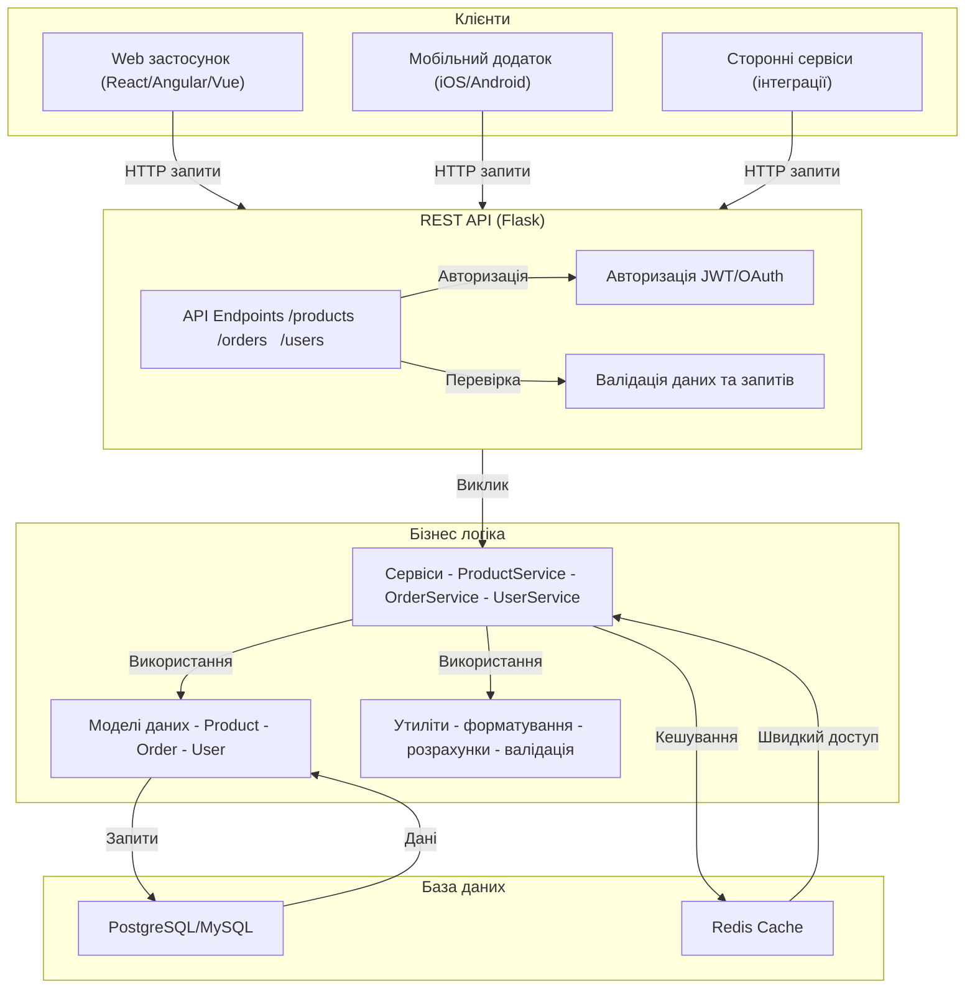

# Лабораторна робота 5 Розробка RESTful API з документацією

## 🎯 Мета роботи

Набути практичних навичок у проектуванні та реалізації бази даних для веб-додатку, навчитися створювати та керувати таблицями бази даних, реалізовувати CRUD операції та зв'язки між таблицями.

## ✅ Завдання

### Рівень 1

1. Розробити базовий REST API для існуючого проєкту:
    - Мінімум 6 endpoints
    - Базова обробка помилок
    - JSON формат даних
2. Протестувати розроблений API в Postman:
    - Створити колекцію тестів
    - Підготувати тестові сценарії
    - Задокументувати результати тестування
    - Шаблон звіту по тестуванню

### Рівень 2

1. Виконати основне завдання.
2. Розробити документацію (рекомендовано використати бібліотеку `flasgger`):
    - Опис всіх endpoints
    - Схеми запитів і відповідей
    - Приклади використання
    - Шаблон для документації

### Рівень 3

1. Виконати додаткове завдання
2. Реалізувати повне API зі всіма потрібними endpoints та з додатковими функціями:
    - Валідація вхідних даних
    - Декілька версій API
    - Обробка помилок з кодами статусу

## 🖥️ Програмне забезпечення

- Git [git-scm.com](https://git-scm.com) - розподілена система контролю версій;
- GitHub [github.com](https://github.com) - хмарна платформа для хостингу Git репозиторіїв;
- Visual Studio Code [code.visualstudio.com](https://code.visualstudio.com) - редактор коду з підтримкою Git;
- реляційна СКБД SQLite [sqlite.org](https://sqlite.org/)
- GitHub Desktop [desktop.github.com](https://desktop.github.com) - графічний клієнт Git (опціонально);
- мова програмування Python [https://www.python.org/](https://www.python.org/);
- система тестування API Postman [Postman](https://www.postman.com/)
- вебфреймворк Flask [https://flask.palletsprojects.com](https://flask.palletsprojects.com).

## 👥 Форма виконання роботи

Форма виконання роботи **групова** (3-4 особи в команді).

## 📝 Критерії оцінювання

- середній рівень (оцінка “задовільно”, 4-6) - виконано основне завдання. Допускаються незначні помилки у коді або оформленні. Під час захисту здобувач освіти демонструє базове розуміння технологій та здатніть вирішувати стандартні завдання.
- достатній рівень (оцінка “добре”, 7-9) - виконано всі вимоги достатнього рівня та виконано додаткове завдання. Під час захисту допускаються невеликі помилки та неповне розуміння деяких аспектів роботи.
- високий рівень (оцінка “відмінно”, 10-12) - виконано всі вимоги достатнього рівня та виконано творче завдання, під час захисту продемонстровано глибоке розуміння принципів роботи технологій вебзастосунку, код чистий, добре структурований та прокоментований, здобувач освіти може пояснити кожен аспект роботи та обґрунтувати прийняті рішення, проявлено творчий підхід до виконання завдання


## ⏰ Політика щодо дедлайнів

При порушенні встановленого терміну здачі лабораторної роботи максимальна можлива оцінка становить 9 балів ("добре"), незалежно від якості виконаної роботи. Винятки можливі лише за поважних причин, підтверджених документально.

## 📚 Теоретичні відомості

## Поняття API

API (Application Programming Interface) представляє собою набір правил та протоколів, які дозволяють різним програмним компонентам взаємодіяти між собою. Це своєрідний міст між різними частинами програмного забезпечення, який визначає, яким чином вони можуть обмінюватися даними та функціональністю.

Уявіть собі ресторан. Коли ви замовляєте їжу, ви не йдете безпосередньо на кухню - ви спілкуєтесь з офіціантом. Офіціант у цьому випадку виступає як API - він приймає ваше замовлення у зрозумілому форматі, передає його на кухню, а потім повертає вам готову страву. API працює схожим чином - він приймає запити від клієнтської програми, обробляє їх та повертає результат.

У контексті веб-розробки API дозволяє клієнтським додаткам (наприклад, веб-сайтам або мобільним додаткам) взаємодіяти з серверною частиною програми. Наприклад, коли ви відкриваєте стрічку новин у Facebook, клієнтський додаток використовує API для отримання актуальних постів з серверу.

## REST та його принципи

REST (Representational State Transfer) - це архітектурний стиль для створення веб-сервісів, який був представлений Роєм Філдінгом у 2000 році. REST визначає набір принципів та обмежень для створення масштабованих та надійних веб-сервісів.

REST базується на кількох ключових принципах:

**Stateless (не зберігає стан)**
У REST кожен запит від клієнта до сервера повинен містити всю необхідну інформацію для розуміння та обробки запиту. Сервер не зберігає жодної інформації про стан клієнта між запитами. Це схоже на похід у магазин - кожного разу, коли ви приходите за покупками, ви повинні показати свою платіжну картку, навіть якщо ви постійний клієнт.

**Уніфікований інтерфейс**
REST використовує стандартні HTTP методи для різних операцій:

- GET для отримання даних (як перегляд товарів у магазині)
- POST для створення нових ресурсів (як додавання нового товару)
- PUT/PATCH для оновлення існуючих ресурсів (як зміна ціни товару)
- DELETE для видалення ресурсів (як вилучення товару з асортименту)

**Ресурсна орієнтованість**
У REST все розглядається як ресурс, який має свій унікальний ідентифікатор (URI). Наприклад, у нашому інтернет-магазині:

- `/products` - всі товари
- `/products/123` - конкретний товар з ID 123
- `/orders/456` - замовлення з ID 456

**Можливість кешування**
Відповіді сервера можуть бути позначені як такі, що можна кешувати або не можна кешувати. Це дозволяє клієнту зберігати відповіді локально та використовувати їх повторно без необхідності звертатися до сервера.



## Практичне застосування

У контексті інтернет-магазину на Flask, REST API може виглядати наступним чином:

```python
# Отримання списку всіх товарів
GET /api/products
Відповідь: {"products": [{id: 1, name: "Телефон", price: 10000}, ...]}

# Отримання конкретного товару
GET /api/products/1
Відповідь: {"id": 1, "name": "Телефон", "price": 10000}

# Створення нового замовлення
POST /api/orders
Тіло запиту: {"products": [1, 2], "address": "вул. Шевченка, 1"}
Відповідь: {"order_id": 123, "status": "created"}

```

Кожен такий запит є незалежним та самодостатнім, що відповідає принципу безстатевості REST. Відповіді зазвичай повертаються у форматі JSON, який є легким для читання як людьми, так і машинами.

REST API особливо корисний для створення масштабованих додатків, оскільки дозволяє розділити клієнтську та серверну частини. Це означає, що один і той же API може обслуговувати різні клієнти - веб-сайт, мобільний додаток, або навіть сторонні сервіси, при цьому забезпечуючи узгоджений спосіб доступу до даних та функціональності.

## HTTP методи та їх застосування в REST API

### Загальний огляд HTTP методів

HTTP методи визначають тип операції, яку клієнт хоче виконати з ресурсом на сервері. Кожен метод має своє призначення та характеристики, що робить його придатним для певних типів операцій.

### GET

GET використовується для отримання даних і є одним з найбільш поширених HTTP методів. Цей метод повинен бути безпечним та ідемпотентним, тобто не змінювати стан сервера незалежно від кількості викликів.

Приклад використання GET:

```bash
GET /api/products/123 HTTP/1.1
Host: shop.example.com
Accept: application/json
```

Відповідь сервера:

```
HTTP/1.1 200 OK
Content-Type: application/json

{
    "id": 123,
    "name": "Смартфон XYZ",
    "price": 15999,
    "description": "Новий смартфон з потужною камерою"
}
```

GET запити можуть включати параметри в URL для фільтрації, сортування або пагінації:

```
GET /api/products?category=electronics&sort=price&page=1
```

### POST

POST використовується для створення нових ресурсів на сервері. Цей метод не є ідемпотентним, тобто кожен новий виклик створює новий ресурс.

Приклад POST запиту:

```
POST /api/orders HTTP/1.1
Host: shop.example.com
Content-Type: application/json

{
    "customer_id": 456,
    "products": [
        {"id": 123, "quantity": 2},
        {"id": 124, "quantity": 1}
    ],
    "shipping_address": {
        "street": "Вулиця Шевченка, 1",
        "city": "Київ",
        "postal_code": "01001"
    }
}
```

Відповідь сервера:

```

HTTP/1.1 201 Created
Content-Type: application/json
Location: /api/orders/789

{
    "order_id": 789,
    "status": "created",
    "estimated_delivery": "2024-11-03"
}
```

### PUT

PUT використовується для повного оновлення існуючого ресурсу. Цей метод є ідемпотентним - multiple PUT запити з однаковими даними призведуть до того самого результату.

Приклад PUT запиту:

```
PUT /api/products/123 HTTP/1.1
Host: shop.example.com
Content-Type: application/json

{
    "name": "Смартфон XYZ Pro",
    "price": 16999,
    "description": "Оновлена версія смартфону з покращеною камерою",
    "stock": 50
}
```

### PATCH

PATCH використовується для часткового оновлення ресурсу. На відміну від PUT, дозволяє оновити лише конкретні поля, не зачіпаючи інші.

Приклад PATCH запиту:

```
PATCH /api/products/123 HTTP/1.1
Host: shop.example.com
Content-Type: application/json

{
    "price": 14999,
    "stock": 45
}
```

### DELETE

DELETE використовується для видалення ресурсу. Цей метод є ідемпотентним - повторні запити на видалення того самого ресурсу не повинні змінювати стан сервера.

Приклад DELETE запиту:

```
DELETE /api/products/123 HTTP/1.1
Host: shop.example.com
```

### HEAD

HEAD працює аналогічно GET, але повертає тільки заголовки без тіла відповіді. Корисний для перевірки існування ресурсу або отримання метаданих.

Приклад HEAD запиту:

```
HEAD /api/products/123 HTTP/1.1
Host: shop.example.com
```

### OPTIONS

OPTIONS використовується для отримання інформації про доступні методи та можливості для конкретного ресурсу.

Приклад OPTIONS запиту:

```
OPTIONS /api/products HTTP/1.1
Host: shop.example.com
```

Відповідь сервера:

```
HTTP/1.1 200 OK
Allow: GET, POST, PUT, DELETE, HEAD, OPTIONS
Access-Control-Allow-Methods: GET, POST, PUT, DELETE
Access-Control-Allow-Headers: Content-Type
```

### Коди відповідей HTTP

При роботі з HTTP методами важливо правильно використовувати коди відповідей:

- 2xx - Успішне виконання
    - 200 OK - запит успішно оброблений
    - 201 Created - ресурс успішно створений
    - 204 No Content - запит успішний, але немає даних для повернення
- 4xx - Помилки клієнта
    - 400 Bad Request - неправильний запит
    - 401 Unauthorized - потрібна автентифікація
    - 403 Forbidden - доступ заборонено
    - 404 Not Found - ресурс не знайдено
    - 405 Method Not Allowed - метод не дозволений для даного ресурсу
- 5xx - Помилки сервера
    - 500 Internal Server Error - внутрішня помилка сервера
    - 503 Service Unavailable - сервіс тимчасово недоступний

### Практичне застосування в REST API

У контексті REST API для інтернет-магазину типова структура ендпоінтів може виглядати так:

```python
from flask import Flask, request, jsonify

app = Flask(__name__)

@app.route('/api/products', methods=['GET'])
def get_products():
# Отримання списку всіх товарів
    return jsonify(products), 200

@app.route('/api/products', methods=['POST'])
def create_product():
    data = request.get_json()
# Створення нового товару
    return jsonify(new_product), 201

@app.route('/api/products/<int:product_id>', methods=['PUT'])
def update_product(product_id):
    data = request.get_json()
# Оновлення товару
    return jsonify(updated_product), 200

@app.route('/api/products/<int:product_id>', methods=['DELETE'])
def delete_product(product_id):
# Видалення товару
    return '', 204
```

Ця структура дозволяє створити повноцінний RESTful API, де кожен ендпоінт відповідає за конкретну операцію з ресурсами, використовуючи відповідні HTTP методи та коди відповідей.


## 🟣 Ресурси

- [Що таке rest api: основні принципи та практики застосування](https://foxminded.ua/shcho-take-rest-api/)
- [Вступ до REST API — RESTful вебсервіси](https://robotdreams.cc/uk/blog/466-vstup-do-rest-api-restful-vebservisi)
- [Postman](https://www.youtube.com/playlist?list=PLg5KTW75a-xN-q9_vFmpeichZESnFQSDz)

## ▶️ Хід роботи

Приклад виконання лабораторної роботи ([:fontawesome-solid-archive: навчальний додаток](assets/lab05-flaskProject2API.zip){: download="lab05-flaskProject2API.zip" })

1. **Підготувати середовище розробки**
    1. Встановити необхідні пакети (Flask, Postman)
    2. Налаштувати віртуальне середовище Python
    3. Підготувати структуру проєкту
    4. Налаштувати базу даних SQLite

2. **Розробити API**
    1. Створити базові endpoints (мінімум 6)
    2. Реалізувати обробку запитів і відповідей в форматі JSON
    3. Додати базову обробку помилок

3. **Протестувати API в Postman**
    1. Створити колекцію тестів
    2. Підготувати тестові сценарії для кожного endpoint
    3. Виконати тестування та зафіксувати результати

4. **Виконати за бажанням завдання рівня 2 і 3**
    - Рівень 2: додати документацію API (flasgger)
    - Рівень 3: реалізувати валідацію, версіонування API, розширену обробку помилок

5. **Підготувати звіт у форматі README.md**
    1. Створити файл `README.md` в **корені проєкту**
    2. Оформити звіт згідно з шаблоном нижче
    3. Додати скріншоти з Postman (або Swagger)
    4. Задокументувати всі розроблені endpoints

6. **Здати роботу**
    1. Завантажити проєкт на GitHub
    2. Надати посилання на репозиторій як відповідь на завдання в LMS Moodle
    3. Захистити лабораторну роботу перед викладачем

---

### 📋 Шаблон README.md для звіту

Створіть у корені проєкту файл `README.md` з наступною структурою:

````markdown
# Лабораторна робота №5: Розробка RESTful API

## Інформація про проєкт
- **Назва проєкту:** [назва вашого додатку]
- **Автори:** [ПІБ членів команди]


## Опис проєкту
[Короткий опис того, що робить ваш API]

## Технології
- Python 3.x
- Flask
- SQLite
- [інші використані бібліотеки]

## Endpoints API

### 1. [Назва endpoint]
- **URL:** `/api/...`
- **Метод:** `GET/POST/PUT/DELETE`
- **Опис:** [що робить цей endpoint]
- **Приклад запиту:**
```json
{
  "key": "value"
}
```
- **Приклад відповіді:**
```json
{
  "status": "success",
  "data": {}
}
```
- **Скріншот з Postman (або Swagger):**


[Повторити для всіх endpoints]

## Результати тестування в Postman (або Swagger)

### Тестовий сценарій 1: [Назва]
- **Мета:** [опис тесту]
- **Результат:** ✅ Успішно / ❌ Помилка
- **Скріншот:**


[Повторити для всіх тестових сценаріїв]

## Обробка помилок
Список реалізованих кодів помилок:
- `400 Bad Request` - [коли виникає]
- `404 Not Found` - [коли виникає]
- `500 Internal Server Error` - [коли виникає]
````

[:fontawesome-solid-cloud-upload: Здати лабораторну роботу](http://194.187.154.85/moodle/course/view.php?id=1426#section-2){ .md-button .md-button--primary }
