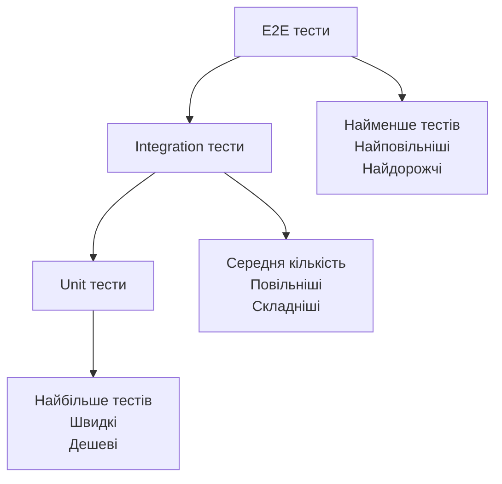

# Лабораторна робота 7. Написання unit та integration тестів

## 🎯 Мета роботи

Набуття практичних навичок написання автоматизованих тестів для програмного забезпечення, оволодіння методами тестування окремих компонентів та їх взаємодії, розвиток здатності забезпечувати якість коду через систематичне тестування.

## ✅ Завдання

Написати unit та integration тести для вебзастосунку, розробленого в попередніх лабораторних роботах.

Обов'язкові вимоги:

- написати unit тести для окремих функцій та методів (мінімум 5 тестів);
- написати integration тести для API ендпоінтів (мінімум 3 тести);
- забезпечити покриття тестами критичних частин коду;
- використати фреймворк для тестування відповідно до обраної мови програмування;
- додати автоматизований запуск тестів;
- документувати тестові сценарії.

!!! info
    Фреймворки для тестування залежать від мови програмування проєкту. Для Python рекомендується pytest або unittest, для JavaScript — Jest або Mocha, для Java — JUnit.

## 🖥️ Програмне забезпечення

- Фреймворк для тестування відповідно до мови програмування проєкту (pytest, Jest, JUnit тощо);
- середовище розробки (Visual Studio Code, PyCharm, IntelliJ IDEA);
- Git для контролю версій.

## 👥 Форма виконання роботи

Форма виконання роботи **індивідуальна**.

## 📝 Критерії оцінювання

Оцінювання лабораторної роботи здійснюється за національною шкалою та враховує повноту виконання завдання, якість написаних тестів, покриття коду та рівень розуміння принципів тестування.

**Середній рівень (оцінка "задовільно", 4-6 балів):**

- написано мінімум 5 unit тестів для базових функцій;
- написано мінімум 3 integration тести для API ендпоінтів;
- тести успішно виконуються, але можуть бути неповними;
- базове використання assertion методів;
- присутня документація тестових сценаріїв;
- покриття коду тестами становить 30-50%;
- під час захисту здобувач освіти демонструє базове розуміння різниці між unit та integration тестами, може пояснити призначення написаних тестів.

**Достатній рівень (оцінка "добре", 7-9 балів):**

- написано 8-10 unit тестів, які покривають різні сценарії роботи функцій;
- написано 5-6 integration тестів для різних API операцій;
- тести включають перевірку як позитивних, так і негативних сценаріїв;
- використано різноманітні assertion методи;
- тести організовані у логічні групи або класи;
- додано автоматизований запуск тестів через скрипт або конфігураційний файл;
- покриття коду тестами становить 50-70%;
- детальна документація тестових сценаріїв з описом очікуваних результатів;
- під час захисту здобувач освіти демонструє розуміння структури тестів, може пояснити вибір тестових даних та очікуваних результатів.

**Високий рівень (оцінка "відмінно", 10-12 балів):**

- написано понад 12 якісних unit тестів з покриттям edge cases;
- написано понад 7 integration тестів, що перевіряють складну взаємодію компонентів;
- використано mock об'єкти та fixtures для ізоляції тестів;
- тести покривають позитивні сценарії, негативні сценарії, граничні випадки та обробку помилок;
- реалізовано setup та teardown методи для підготовки тестового середовища;
- тести організовані за принципом AAA (Arrange, Act, Assert);
- покриття коду тестами становить понад 70%;
- додано звіт про покриття коду тестами;
- налаштовано інтеграцію з CI/CD для автоматичного запуску тестів;
- вичерпна документація тестів з поясненням складних сценаріїв;
- під час захисту здобувач освіти демонструє глибоке розуміння принципів тестування, може обґрунтувати архітектуру тестів, пояснити використання mock об'єктів та fixtures, проявлено творчий підхід до тестування.

## ⏰ Політика щодо дедлайнів

При порушенні встановленого терміну здачі лабораторної роботи максимальна можлива оцінка становить 9 балів ("добре"), незалежно від якості виконаної роботи. Винятки можливі лише за поважних причин, підтверджених документально.

## 📚 Теоретичні відомості

### Типи тестування програмного забезпечення

Тестування є критично важливою частиною розробки якісного програмного забезпечення. Існує кілька рівнів тестування, кожен з яких виконує свою специфічну роль у забезпеченні якості продукту.

**Unit тестування** перевіряє роботу окремих функцій, методів або класів в ізоляції від решти системи. Метою unit тестів є переконатися, що кожна окрема одиниця коду виконує свою роботу правильно. Unit тести мають бути швидкими, незалежними один від одного та легкими в підтримці. Вони складають основу піраміди тестування і їх має бути найбільше.

**Integration тестування** перевіряє взаємодію між різними компонентами системи. Ці тести переконуються, що модулі правильно працюють разом, що API коректно обробляє запити, що дані правильно передаються між шарами застосунку. Integration тести виконуються повільніше за unit тести, оскільки задіюють більше компонентів.

### Піраміда тестування



Піраміда тестування показує оптимальний розподіл зусиль між різними типами тестів. Основу піраміди складають unit тести, яких має бути найбільше. Вони швидкі, дешеві у створенні та підтримці. Integration тестів має бути менше, вони перевіряють критичні інтеграційні точки. На вершині піраміди знаходяться end-to-end тести, яких має бути найменше через їх складність та повільність виконання.

### Структура тесту AAA

Ефективні тести зазвичай слідують патерну AAA (Arrange-Act-Assert), який робить їх зрозумілими та легкими в підтримці.

**Arrange** (підготовка) — на цьому етапі ми створюємо тестові дані, ініціалізуємо об'єкти, налаштовуємо mock об'єкти та готуємо все необхідне для виконання тесту.

**Act** (виконання) — викликаємо функцію або метод, який тестуємо, з підготовленими даними.

**Assert** (перевірка) — перевіряємо, що результат виконання відповідає очікуванням. Використовуємо assertion методи для порівняння фактичного результату з очікуваним.

### Mock об'єкти та Fixtures

**Mock об'єкти** дозволяють імітувати поведінку реальних об'єктів для ізоляції тестованого коду. Наприклад, якщо функція викликає зовнішній API, ми можемо створити mock об'єкт, який імітує відповідь API без реального мережевого запиту. Це робить тести швидшими та надійнішими.

**Fixtures** — це фіксовані стани або набори даних, які використовуються як базова лінія для тестів. Fixtures забезпечують передбачувані та повторювані умови для тестування. Багато фреймворків надають механізми для створення та використання fixtures.

### Покриття коду тестами

Покриття коду (code coverage) показує, яка частина коду виконується під час тестування. Високе покриття не гарантує відсутність помилок, але низьке покриття точно вказує на ненадійні ділянки коду. Інструменти для вимірювання покриття коду показують, які рядки, функції та гілки коду були виконані під час тестів.

## ▶️ Хід роботи

### 1. Підготовка середовища для тестування

Встановити необхідний фреймворк для тестування відповідно до мови програмування вашого проєкту.

Для Python з використанням pytest:

```bash
pip install pytest pytest-cov --break-system-packages
```

Для JavaScript з використанням Jest:

```bash
npm install --save-dev jest
```

Для Java з використанням JUnit (додати до pom.xml або build.gradle залежність):

```xml
<dependency>
    <groupId>junit</groupId>
    <artifactId>junit</artifactId>
    <version>4.13.2</version>
    <scope>test</scope>
</dependency>
```

### 2. Написання unit тестів

Створити директорію для тестів у структурі проєкту. Зазвичай це `tests/` або `test/` в корені проєкту.

Написати unit тести для основних функцій вашого застосунку. Кожна функція має бути протестована окремо.

Приклад unit тесту для Python (pytest):

```python
# test_calculator.py
import pytest
from app.calculator import add, divide

def test_add_positive_numbers():
    # Arrange
    a = 5
    b = 3
    expected = 8

    # Act
    result = add(a, b)

    # Assert
    assert result == expected

def test_add_negative_numbers():
    assert add(-5, -3) == -8

def test_divide_by_zero():
    with pytest.raises(ZeroDivisionError):
        divide(10, 0)
```

Приклад unit тесту для JavaScript (Jest):

```javascript
// calculator.test.js
const { add, divide } = require('./calculator');

describe('Calculator functions', () => {
    test('add should sum two positive numbers', () => {
        // Arrange
        const a = 5;
        const b = 3;
        const expected = 8;

        // Act
        const result = add(a, b);

        // Assert
        expect(result).toBe(expected);
    });

    test('divide should throw error when dividing by zero', () => {
        expect(() => divide(10, 0)).toThrow('Division by zero');
    });
});
```

### 3. Написання integration тестів

Integration тести перевіряють взаємодію API ендпоінтів з базою даних та іншими компонентами системи.

Приклад integration тесту для Flask API (Python):

```python
# test_api.py
import pytest
from app import create_app, db
from app.models import User

@pytest.fixture
def client():
    app = create_app('testing')

    with app.test_client() as client:
        with app.app_context():
            db.create_all()
            yield client
            db.session.remove()
            db.drop_all()

def test_get_users_empty(client):
    # Act
    response = client.get('/api/users')

    # Assert
    assert response.status_code == 200
    assert response.json == []

def test_create_user(client):
    # Arrange
    user_data = {
        'name': 'Іван Петренко',
        'email': 'ivan@example.com'
    }

    # Act
    response = client.post('/api/users', json=user_data)

    # Assert
    assert response.status_code == 201
    assert response.json['name'] == user_data['name']
    assert 'id' in response.json
```

Приклад integration тесту для Express API (JavaScript):

```javascript
// api.test.js
const request = require('supertest');
const app = require('./app');

describe('User API', () => {
    test('GET /api/users returns empty array initially', async () => {
        const response = await request(app)
            .get('/api/users')
            .expect(200);

        expect(response.body).toEqual([]);
    });

    test('POST /api/users creates new user', async () => {
        const userData = {
            name: 'Іван Петренко',
            email: 'ivan@example.com'
        };

        const response = await request(app)
            .post('/api/users')
            .send(userData)
            .expect(201);

        expect(response.body).toHaveProperty('id');
        expect(response.body.name).toBe(userData.name);
    });
});
```

### 4. Організація тестів

Створити логічну структуру тестів, групуючи їх за функціональністю. Використовувати describe блоки в Jest або класи в pytest для організації тестів.

Приклад організації тестів:

```
tests/
├── unit/
│   ├── test_models.py
│   ├── test_utils.py
│   └── test_validators.py
├── integration/
│   ├── test_api_users.py
│   ├── test_api_products.py
│   └── test_database.py
└── conftest.py  # Загальні fixtures для pytest
```

### 5. Налаштування автоматизованого запуску

Створити конфігураційний файл або скрипт для автоматизованого запуску всіх тестів.

Для pytest створити `pytest.ini`:

```ini
[pytest]
testpaths = tests
python_files = test_*.py
python_classes = Test*
python_functions = test_*
```

Для Jest додати до `package.json`:

```json
{
  "scripts": {
    "test": "jest",
    "test:coverage": "jest --coverage"
  },
  "jest": {
    "testEnvironment": "node",
    "coverageDirectory": "coverage"
  }
}
```

### 6. Вимірювання покриття коду

Запустити тести з вимірюванням покриття коду.

Для Python:

```bash
pytest --cov=app --cov-report=html
```

Для JavaScript:

```bash
npm run test:coverage
```

Переглянути звіт про покриття та визначити ділянки коду, які потребують додаткових тестів.

### 7. Документування тестових сценаріїв

Створити файл `TESTING.md` з описом тестових сценаріїв:

```markdown
    # Документація тестування

    ## Запуск тестів

    ### Всі тести
    pytest

    ### З покриттям коду
    pytest --cov=app --cov-report=html

    ## Опис тестових сценаріїв

    ### Unit тести

    #### test_add_positive_numbers
    Перевіряє додавання двох додатних чисел.
    Очікуваний результат: сума чисел.

    #### test_divide_by_zero
    Перевіряє обробку ділення на нуль.
    Очікуваний результат: виняток ZeroDivisionError.

    ### Integration тести

    #### test_create_user
    Перевіряє створення нового користувача через API.
    Очікуваний результат: статус 201, об'єкт користувача з ID.
```

### 8. Підготовка, здача та захист лабораторної

Переконатись, що всі тести успішно виконуються. Підготувати звіт за запропонованим шаблоном, включивши скріншоти виконання тестів та звіту про покриття коду. Завантажити звіт та посилання на репозиторій у LMS Moodle. Захистити лабораторну перед викладачем, продемонструвавши розуміння написаних тестів.

[:fontawesome-solid-cloud-upload: Здати лабораторну роботу](http://194.187.154.85/moodle/course/view.php?id=1426#section-2){ .md-button .md-button--primary }

## ❓ Контрольні запитання

1. У чому полягає різниця між unit та integration тестами? Наведіть приклади ситуацій, коли варто використовувати кожен тип.
2. Що таке патерн AAA (Arrange-Act-Assert) та чому він важливий для структурування тестів?
3. Навіщо потрібні mock об'єкти в тестуванні? У яких випадках їх варто використовувати?
4. Що показує метрика покриття коду тестами? Чи означає 100% покриття відсутність помилок у коді?
5. Які переваги дає автоматизоване тестування порівняно з ручним тестуванням?
6. Що таке fixtures в контексті тестування та як вони допомагають організувати тести?
7. Чому unit тестів має бути більше ніж integration тестів згідно з пірамідою тестування?
