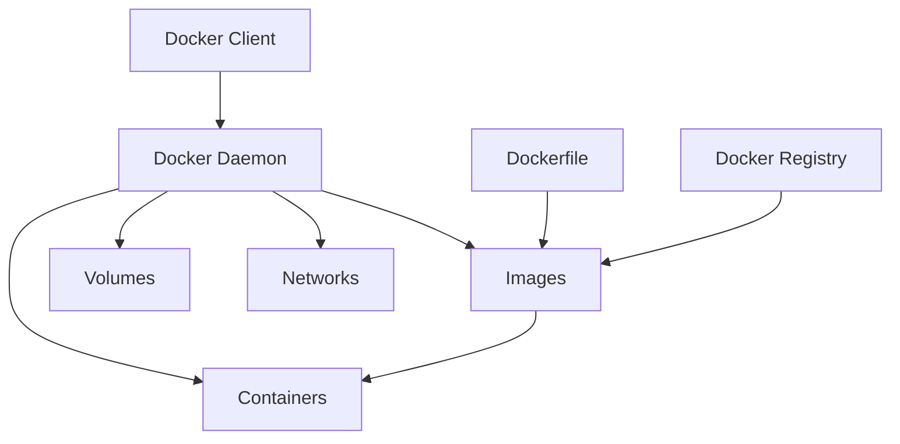

# Лабораторна робота 8. Контейнеризація проєкту

## 🎯 Мета роботи

Набуття практичних навичок контейнеризації вебзастосунків за допомогою Docker, розуміння принципів роботи контейнерів та оркестрації багатоконтейнерних додатків, а також підготовка проєкту до розгортання в production середовищі.

## ✅ Завдання

Виконати контейнеризацію раніше розробленого Flask вебпроєкту з SQLite базою даних, створивши повне контейнерне середовище для його розгортання.

### Основні вимоги

1. Створити Dockerfile для Flask застосунку з оптимізацією розміру образу.
2. Налаштувати docker-compose.yml для оркестрації застосунку.
3. Організувати збереження SQLite бази даних через volumes.
4. Додати змінні середовища для конфігурації застосунку.
5. Налаштувати health check для перевірки працездатності застосунку.
6. Підготувати документацію для запуску проєкту в контейнерах.

## 🖥️ Програмне забезпечення

- Docker Desktop [docker.com](https://www.docker.com/products/docker-desktop) - платформа для контейнеризації додатків.
- Git - система контролю версій для збереження конфігураційних файлів.
- Текстовий редактор або IDE для редагування Dockerfile та docker-compose.yml.

## 👥 Форма виконання роботи

Форма виконання роботи **групова** (3-4 особи в команді).

## 📝 Критерії оцінювання

### Середній рівень (оцінка "задовільно", 4-6 бали)

Виконано базову контейнеризацію застосунку:

- створено простий Dockerfile для Flask застосунку;
- застосунок успішно запускається в контейнері;
- налаштовано docker-compose.yml для запуску сервісу;
- SQLite база даних зберігається у volume;
- проєкт запускається командою `docker-compose up`;
- підготовлено базову документацію із командами запуску.

Під час захисту здобувач освіти демонструє базове розуміння концепції контейнеризації, може пояснити призначення основних директив у Dockerfile та структуру docker-compose.yml. Допускаються помилки у налаштуванні volumes, які не перешкоджають базовій роботі застосунку.

### Достатній рівень (оцінка "добре", 7-9 балів)

Виконано якісну контейнеризацію з оптимізацією:

- всі вимоги середнього рівня;
- використано багатоетапну збірку (multi-stage build) для зменшення розміру образу;
- правильно налаштовано volume для збереження SQLite бази даних з коректними правами доступу;
- додано файл .dockerignore для виключення непотрібних файлів;
- налаштовано змінні середовища через .env файл;
- додано health check для контейнера;
- документація містить опис конфігурації та змінних середовища.

Під час захисту здобувач освіти демонструє розуміння переваг багатоетапної збірки, може пояснити особливості роботи з SQLite у контейнерах, розуміє принципи збереження даних через volumes. Допускаються незначні неоптимальні рішення, які не впливають на функціональність.

### Високий рівень (оцінка "відмінно", 10-12 балів)

Виконано професійну контейнеризацію з додатковими можливостями:

- всі вимоги достатнього рівня;
- оптимізовано Dockerfile із використанням кешування шарів та Alpine образу;
- налаштовано restart policies для автоматичного перезапуску сервісу;
- створено окремі конфігурації для development та production середовищ;
- додано додаткові сервіси (наприклад, Nginx як reverse proxy);
- реалізовано логування контейнера;
- налаштовано backup стратегію для бази даних;
- документація включає troubleshooting секцію та опис архітектури.

Під час захисту здобувач освіти демонструє глибоке розуміння архітектури Docker, може обґрунтувати прийняті рішення щодо оптимізації, пояснити особливості роботи з файловою базою даних у контейнерах. Проявлено творчий підхід до організації контейнерного середовища.

## ⏰ Політика щодо дедлайнів

При порушенні встановленого терміну здачі лабораторної роботи максимальна можлива оцінка становить 9 балів ("добре"), незалежно від якості виконаної роботи. Винятки можливі лише за поважних причин, підтверджених документально.

## 📚 Теоретичні відомості

### Контейнеризація та Docker

Контейнеризація — це метод віртуалізації на рівні операційної системи, який дозволяє запускати додатки в ізольованих середовищах, які називаються контейнерами. На відміну від віртуальних машин, контейнери використовують спільне ядро операційної системи, що робить їх легшими та швидшими.

Docker — це платформа для розробки, доставки та запуску додатків у контейнерах. Docker автоматизує розгортання застосунків всередині контейнерів, забезпечуючи додаткову абстракцію та автоматизацію віртуалізації на рівні операційної системи.

### Основні переваги контейнеризації

Контейнери забезпечують консистентність середовища на всіх етапах розробки. Застосунок, який працює на машині розробника, гарантовано працюватиме однаково в тестовому та production середовищах. Це усуває класичну проблему "works on my machine".

Портативність контейнерів дозволяє легко переміщувати додатки між різними платформами та хмарними провайдерами. Контейнер з усіма залежностями може працювати на будь-якій системі, де встановлено Docker.

Ефективність використання ресурсів є важливою перевагою контейнерів порівняно з віртуальними машинами. Контейнери споживають менше пам'яті та CPU, оскільки не потребують повної операційної системи для кожного екземпляра.

Швидкість розгортання контейнерів вимірюється секундами, тоді як віртуальні машини можуть запускатися хвилинами. Це значно прискорює процес розробки та тестування.

### Архітектура Docker



Docker Client — це інтерфейс командного рядка, через який користувачі взаємодіють з Docker. Команди, які ви вводите, надсилаються до Docker Daemon.

Docker Daemon — це фоновий процес, який управляє контейнерами, образами, мережами та volumes. Daemon слухає API запити та виконує відповідні операції.

Docker Image — це шаблон лише для читання, який містить інструкції для створення контейнера. Образи будуються з Dockerfile та можуть базуватися на інших образах.

Docker Container — це запущений екземпляр образу. Контейнер є ізольованим процесом з власною файловою системою, мережею та ресурсами.

### Dockerfile: структура та директиви

Dockerfile — це текстовий файл, який містить інструкції для автоматичної збірки Docker образу. Кожна інструкція у Dockerfile створює новий шар в образі.

Базовий образ визначається директивою FROM та є основою для вашого застосунку:

```dockerfile
FROM python:3.11-slim
```

Робоча директорія встановлюється через WORKDIR. Всі наступні команди виконуватимуться відносно цієї директорії:

```dockerfile
WORKDIR /app
```

Копіювання файлів здійснюється командами COPY або ADD. COPY просто копіює файли, тоді як ADD може також розпаковувати архіви:

```dockerfile
COPY requirements.txt .
COPY . .
```

Виконання команд під час збірки образу виконується через RUN. Це можуть бути встановлення пакетів, створення директорій або інші операції:

```dockerfile
RUN pip install --no-cache-dir -r requirements.txt
```

Змінні середовища встановлюються через ENV та будуть доступні в контейнері:

```dockerfile
ENV FLASK_APP=app.py
ENV FLASK_ENV=production
```

Відкриття портів декларується через EXPOSE. Це документує, які порти використовує застосунок:

```dockerfile
EXPOSE 5000
```

Команда запуску визначається через CMD або ENTRYPOINT. CMD задає команду за замовчуванням, яка може бути перевизначена, а ENTRYPOINT задає незмінну команду:

```dockerfile
CMD ["python", "app.py"]
```

### Багатоетапна збірка

Багатоетапна збірка дозволяє використовувати кілька FROM інструкцій в одному Dockerfile. Це допомагає значно зменшити розмір фінального образу, залишивши в ньому лише необхідні для запуску файли:

```dockerfile
# Етап встановлення залежностей
FROM python:3.11-slim AS builder
WORKDIR /app
COPY requirements.txt .
RUN pip install --no-cache-dir --user -r requirements.txt

# Етап production
FROM python:3.11-alpine
WORKDIR /app
COPY --from=builder /root/.local /root/.local
COPY . .
ENV PATH=/root/.local/bin:$PATH
CMD ["python", "app.py"]
```

У цьому прикладі перший етап встановлює Python пакети, а другий етап копіює лише встановлені пакети у легкий Alpine образ. Весь кеш pip та тимчасові файли залишаються в першому етапі та не потрапляють у фінальний образ.

### Docker Compose

Docker Compose — це інструмент для визначення та запуску багатоконтейнерних додатків. За допомогою YAML файлу ви описуєте всі сервіси вашого застосунку, а потім запускаєте їх однією командою.

Основна структура docker-compose.yml включає версію специфікації, опис сервісів та volumes:

```yaml
version: '3.8'

services:
  web:
    build: .
    ports:
      - "5000:5000"
    environment:
      - FLASK_APP=app.py
      - DATABASE_PATH=/app/data/database.db
    volumes:
      - sqlite_data:/app/data

volumes:
  sqlite_data:
```

Директива services визначає контейнери, які складають ваш застосунок. Кожен сервіс може бути побудований з Dockerfile або використовувати готовий образ.

### Volumes та збереження даних

Volumes — це механізм Docker для збереження даних, які генеруються та використовуються контейнерами. Дані в volumes зберігаються навіть після видалення контейнера.

Для SQLite бази даних це особливо важливо, оскільки база даних зберігається у файлі. Без volume всі дані будуть втрачені при перезапуску або видаленні контейнера.

Named volumes керуються Docker і зберігаються в спеціальній директорії на хост-системі:

```yaml
volumes:
  - sqlite_data:/app/data
```

Це означає, що директорія `/app/data` всередині контейнера буде збережена у volume з назвою `sqlite_data`, і дані не зникнуть при перезапуску.

Bind mounts прив'язують директорію з хост-системи до контейнера. Це зручно для розробки, коли потрібен доступ до бази даних з хост-системи:

```yaml
volumes:
  - ./data:/app/data
```

### Особливості роботи з SQLite у контейнерах

SQLite зберігає всю базу даних в одному файлі, що спрощує роботу з контейнерами порівняно з клієнт-серверними базами даних. Проте є кілька важливих моментів.

Права доступу до файлу бази даних мають бути правильно налаштовані. Flask застосунок повинен мати можливість читати та писати у файл бази даних. Зазвичай це вирішується створенням директорії для даних під час збірки образу:

```dockerfile
RUN mkdir -p /app/data && chmod 755 /app/data
```

Ініціалізація бази даних при першому запуску може бути автоматизована через скрипт або Flask команду. Якщо файл бази даних не існує, застосунок має створити його та виконати необхідні міграції.

Backup бази даних спрощується тим, що потрібно скопіювати лише один файл. Це можна автоматизувати через cron завдання або окремий контейнер.

### Health Checks

Health checks дозволяють Docker перевіряти, чи працює контейнер коректно. Це особливо важливо для production середовищ:

```dockerfile
HEALTHCHECK --interval=30s --timeout=3s --start-period=5s --retries=3 \
  CMD python -c "import requests; requests.get('http://localhost:5000/')" || exit 1
```

У docker-compose.yml:

```yaml
healthcheck:
  test: ["CMD", "curl", "-f", "http://localhost:5000/"]
  interval: 30s
  timeout: 3s
  retries: 3
  start_period: 5s
```

Для Flask застосунку можна створити спеціальний endpoint `/health`, який повертає статус сервісу та перевіряє доступність бази даних.

### Змінні середовища та безпека

Змінні середовища зберігаються в .env файлі, який не повинен потрапляти в систему контролю версій:

```env
FLASK_APP=app.py
FLASK_ENV=production
SECRET_KEY=your-secret-key-here
DATABASE_PATH=/app/data/database.db
```

У docker-compose.yml вони використовуються так:

```yaml
services:
  web:
    env_file:
      - .env
```

Важливо додати .env до .gitignore, щоб чутливі дані не потрапили в репозиторій.

### Оптимізація Docker образів

Зменшення розміру образу покращує швидкість розгортання та економить дисковий простір. Використовуйте Alpine або slim варіанти базових образів:

```dockerfile
FROM python:3.11-alpine
```

Об'єднання команд RUN зменшує кількість шарів:

```dockerfile
RUN apk add --no-cache gcc musl-dev && \
    pip install --no-cache-dir -r requirements.txt && \
    apk del gcc musl-dev
```

Використання .dockerignore файлу виключає непотрібні файли з контексту збірки:

```
__pycache__
*.pyc
*.pyo
*.pyd
.pytest_cache
.git
.gitignore
.env
*.md
.vscode
venv
```

Кешування залежностей прискорює збірку. Копіюйте файли залежностей окремо та встановлюйте їх перед копіюванням решти коду:

```dockerfile
COPY requirements.txt .
RUN pip install --no-cache-dir -r requirements.txt
COPY . .
```

## ▶️ Хід роботи

### 1. Підготовка проєкту

Переконайтеся, що ваш Flask проєкт знаходиться в Git репозиторії та має чітку структуру. Типова структура проєкту:

```
    myproject/
    ├── app.py
    ├── models.py
    ├── templates/
    ├── static/
    ├── requirements.txt
    └── data/
        └── database.db
```

Встановіть Docker Desktop на вашу систему та переконайтеся, що Docker працює коректно, виконавши команду:

```bash
docker --version
docker-compose --version
```

### 2. Створення requirements.txt

Якщо у вас ще немає файлу requirements.txt, створіть його зі списком всіх залежностей:

```
Flask==3.0.0
Werkzeug==3.0.1
```

Можна автоматично згенерувати список залежностей:

```bash
pip freeze > requirements.txt
```

### 3. Створення Dockerfile

Створіть файл з назвою `Dockerfile` (без розширення) в кореневій директорії проєкту:

```dockerfile
    # Багатоетапна збірка для оптимізації розміру
    FROM python:3.11-slim AS builder

    WORKDIR /app

    # Копіюємо файли залежностей
    COPY requirements.txt .

    # Встановлюємо залежності у користувацьку директорію
    RUN pip install --no-cache-dir --user -r requirements.txt

    # Фінальний етап з легким образом
    FROM python:3.11-alpine

    WORKDIR /app

    # Копіюємо встановлені пакети з етапу збірки
    COPY --from=builder /root/.local /root/.local

    # Додаємо встановлені пакети до PATH
    ENV PATH=/root/.local/bin:$PATH

    # Створюємо директорію для бази даних
    RUN mkdir -p /app/data && chmod 755 /app/data

    # Копіюємо код застосунку
    COPY . .

    # Налаштування змінних середовища
    ENV FLASK_APP=app.py
    ENV FLASK_ENV=production
    ENV DATABASE_PATH=/app/data/database.db

    # Відкриваємо порт
    EXPOSE 5000

    # Health check
    HEALTHCHECK --interval=30s --timeout=3s --start-period=10s --retries=3 \
      CMD wget --no-verbose --tries=1 --spider http://localhost:5000/ || exit 1

    # Команда запуску
    CMD ["python", "app.py"]
```

Якщо ваш застосунок потребує компіляції деяких пакетів, використайте інший варіант:

```dockerfile
    FROM python:3.11-alpine

    WORKDIR /app

    # Встановлюємо системні залежності для компіляції
    RUN apk add --no-cache gcc musl-dev

    # Копіюємо та встановлюємо залежності
    COPY requirements.txt .
    RUN pip install --no-cache-dir -r requirements.txt

    # Видаляємо інструменти збірки
    RUN apk del gcc musl-dev

    # Створюємо директорію для бази даних
    RUN mkdir -p /app/data && chmod 755 /app/data

    # Копіюємо код
    COPY . .

    ENV FLASK_APP=app.py
    ENV FLASK_ENV=production
    ENV DATABASE_PATH=/app/data/database.db

    EXPOSE 5000

    HEALTHCHECK --interval=30s --timeout=3s CMD wget --no-verbose --tries=1 --spider http://localhost:5000/ || exit 1

    CMD ["python", "app.py"]
```

### 4. Створення .dockerignore

Створіть файл `.dockerignore` для виключення непотрібних файлів з контексту збірки:

```
    __pycache__
    *.pyc
    *.pyo
    *.pyd
    .pytest_cache
    .coverage
    htmlcov
    .git
    .gitignore
    .env
    .env.example
    *.md
    README.md
    .vscode
    .idea
    venv
    env
    *.log
    .DS_Store
    Dockerfile
    docker-compose.yml
    .dockerignore
    data/database.db
```

### 5. Оновлення Flask застосунку

Переконайтеся, що шлях до бази даних береться зі змінних середовища. Оновіть ваш `app.py`:

```python
import os
from flask import Flask

app = Flask(__name__)

# Отримуємо шлях до бази даних зі змінної середовища
DATABASE_PATH = os.environ.get('DATABASE_PATH', 'data/database.db')

# Налаштування Flask
app.config['SQLALCHEMY_DATABASE_URI'] = f'sqlite:///{DATABASE_PATH}'
app.config['SECRET_KEY'] = os.environ.get('SECRET_KEY', 'dev-secret-key')

# Решта коду...

if __name__ == '__main__':
    # Створюємо директорію для бази даних, якщо її немає
    os.makedirs(os.path.dirname(DATABASE_PATH), exist_ok=True)

    # Ініціалізуємо базу даних при першому запуску
    with app.app_context():
        db.create_all()

    # Запускаємо сервер
    app.run(host='0.0.0.0', port=5000)
```

Якщо ви не використовуєте SQLAlchemy, адаптуйте код для вашої конфігурації бази даних.

### 6. Додавання health endpoint (опціонально)

Створіть endpoint для health check, який перевіряє доступність бази даних:

```python
@app.route('/health')
def health():
    try:
        # Перевіряємо підключення до бази даних
        db.session.execute('SELECT 1')
        return {'status': 'healthy', 'database': 'connected'}, 200
    except Exception as e:
        return {'status': 'unhealthy', 'error': str(e)}, 500
```

### 7. Створення docker-compose.yml

Створіть файл `docker-compose.yml` для зручного запуску проєкту:

```yaml
version: '3.8'

services:
  web:
    build:
      context: .
      dockerfile: Dockerfile
    container_name: flask_app
    ports:
      - "5000:5000"
    environment:
      - FLASK_APP=app.py
      - FLASK_ENV=production
      - DATABASE_PATH=/app/data/database.db
      - SECRET_KEY=${SECRET_KEY:-default-secret-key}
    volumes:
      - sqlite_data:/app/data
    restart: unless-stopped
    healthcheck:
      test: ["CMD", "wget", "--no-verbose", "--tries=1", "--spider", "http://localhost:5000/"]
      interval: 30s
      timeout: 3s
      retries: 3
      start_period: 10s

volumes:
  sqlite_data:
    driver: local
```

Для development середовища з live reload:

```yaml
version: '3.8'

services:
  web:
    build:
      context: .
      dockerfile: Dockerfile
    container_name: flask_app_dev
    ports:
      - "5000:5000"
    environment:
      - FLASK_APP=app.py
      - FLASK_ENV=development
      - DATABASE_PATH=/app/data/database.db
      - SECRET_KEY=dev-secret-key
    volumes:
      - .:/app
      - sqlite_data:/app/data
    command: python -m flask run --host=0.0.0.0 --port=5000 --reload

volumes:
  sqlite_data:
```

### 8. Створення .env файлу

Створіть файл `.env` для зберігання змінних середовища (додайте його до .gitignore):

```env
# Flask configuration
FLASK_APP=app.py
FLASK_ENV=production
SECRET_KEY=your-random-secret-key-here

# Database
DATABASE_PATH=/app/data/database.db
```

Створіть також файл `.env.example` з шаблоном (його можна додати в репозиторій):

```env
# Flask configuration
FLASK_APP=app.py
FLASK_ENV=production
SECRET_KEY=change-this-to-random-string

# Database
DATABASE_PATH=/app/data/database.db
```

Оновіть .gitignore:

```
.env
data/database.db
```

### 9. Збірка та запуск контейнерів

Виконайте збірку образу:

```bash
docker-compose build
```

Перегляньте розмір створеного образу:

```bash
docker images
```

Запустіть застосунок:

```bash
docker-compose up -d
```

Перегляньте стан контейнера:

```bash
docker-compose ps
```

Перегляньте логи:

```bash
docker-compose logs -f web
```

### 10. Тестування застосунку

Відкрийте браузер та перейдіть на `http://localhost:5000`. Перевірте, чи всі функції застосунку працюють коректно.

Додайте кілька записів до бази даних через інтерфейс застосунку. Потім зупиніть контейнер та запустіть знову:

```bash
docker-compose down
docker-compose up -d
```

Переконайтеся, що дані збереглися та не втратилися після перезапуску.

### 11. Перевірка health check

Перегляньте статус health check:

```bash
docker ps
```

У колонці STATUS ви побачите `healthy` або `unhealthy`.

Детальніша інформація:

```bash
docker inspect flask_app | grep -A 10 Health
```

### 12. Робота з базою даних

Якщо потрібно створити backup бази даних:

```bash
docker-compose exec web cp /app/data/database.db /app/data/backup.db
```

Або скопіювати на хост-систему:

```bash
docker cp flask_app:/app/data/database.db ./backup.db
```

Відновлення з backup:

```bash
docker cp ./backup.db flask_app:/app/data/database.db
docker-compose restart web
```

### 13. Корисні команди Docker

Зупинка застосунку:

```bash
docker-compose down
```

Зупинка з видаленням volumes (база даних буде видалена):

```bash
docker-compose down -v
```

Перегляд логів у реальному часі:

```bash
docker-compose logs -f
```

Виконання команди в контейнері:

```bash
docker-compose exec web sh
```

Перегляд використання ресурсів:

```bash
docker stats flask_app
```

Очищення невикористовуваних ресурсів:

```bash
docker system prune -a
```

Перегляд інформації про volume:

```bash
docker volume inspect myproject_sqlite_data
```

### 14. Налагодження проблем

Якщо контейнер не запускається, перегляньте логи:

```bash
docker-compose logs web
```

Якщо виникають проблеми з правами доступу до бази даних, перевірте права директорії:

```bash
docker-compose exec web ls -la /app/data
```

Якщо база даних не ініціалізується, виконайте ініціалізацію вручну:

```bash
docker-compose exec web python -c "from app import db; db.create_all()"
```

Для перевірки змінних середовища:

```bash
docker-compose exec web env
```

### 15. Додавання Nginx (для високого рівня)

Створіть файл `nginx.conf`:

```nginx
server {
    listen 80;
    server_name localhost;

    location / {
        proxy_pass http://web:5000;
        proxy_set_header Host $host;
        proxy_set_header X-Real-IP $remote_addr;
        proxy_set_header X-Forwarded-For $proxy_add_x_forwarded_for;
    }

    location /static {
        alias /app/static;
    }
}
```

Оновіть docker-compose.yml:

```yaml
version: '3.8'

services:
  web:
    build:
      context: .
      dockerfile: Dockerfile
    container_name: flask_app
    expose:
      - "5000"
    environment:
      - FLASK_APP=app.py
      - FLASK_ENV=production
      - DATABASE_PATH=/app/data/database.db
      - SECRET_KEY=${SECRET_KEY:-default-secret-key}
    volumes:
      - sqlite_data:/app/data
      - static_files:/app/static
    restart: unless-stopped

  nginx:
    image: nginx:alpine
    container_name: nginx_proxy
    ports:
      - "80:80"
    volumes:
      - ./nginx.conf:/etc/nginx/conf.d/default.conf
      - static_files:/app/static
    depends_on:
      - web
    restart: unless-stopped

volumes:
  sqlite_data:
  static_files:
```

### 16. Підготовка документації

Створіть файл `README.md` з описом виконаної роботи та інструкціями щодо запуску проєкту:

```markdown
    # Звіт з контейнеризації проєкту

    ## Огляд проєкту

    [Опишіть ваш Flask застосунок та його функціональність]

    ## Архітектура контейнерного рішення

    ### Docker образ

    - Базовий образ: python:3.11-alpine
    - Розмір фінального образу: [вкажіть розмір]
    - Використання багатоетапної збірки: [так/ні]

    ### Docker Compose

    - Кількість сервісів: [вкажіть]
    - Використовувані volumes: [перелічіть]

    ## Прийняті рішення та обґрунтування

    ### Вибір базового образу

    [Поясніть, чому обрали саме цей образ]

    ### Організація збереження даних

    [Опишіть, як організовано збереження SQLite бази]

    ### Оптимізації

    [Перелічіть застосовані оптимізації]

    ## Інструкції з розгортання

    [Покрокові інструкції]

    ## Можливі покращення

    [Що можна було б додати або покращити]

    ## Висновки

    [Ваші висновки про контейнеризацію]
```

Переконайтеся, що проєкт запускається з нуля на чистій системі. Видаліть всі контейнери та volumes, потім виконайте повний цикл збірки та запуску.

### 18. Здача роботи

Завантажте до системи LMS Moodle:

- посилання на Git репозиторій з усіма файлами (Dockerfile, docker-compose.yml, .dockerignore, README.md).

[:fontawesome-solid-cloud-upload: Здати лабораторну роботу](#){ .md-button .md-button--primary }

## ❓ Контрольні запитання

1. У чому полягають основні відмінності між контейнерами та віртуальними машинами? Які переваги та недоліки кожного підходу?
2. Поясніть призначення основних директив Dockerfile (FROM, RUN, COPY, CMD, ENTRYPOINT). Коли використовувати CMD, а коли ENTRYPOINT?
3. Що таке багатоетапна збірка (multi-stage build) і як вона допомагає оптимізувати розмір образу?
4. Яка різниця між named volumes та bind mounts? Коли доцільно використовувати кожен тип для SQLite бази даних?
5. Чому важливо виносити SQLite базу даних у volume? Що станеться з даними без використання volume?
6. Навіщо потрібні health checks і як вони впливають на надійність застосунку?
7. Які особливості роботи з файловою базою даних (SQLite) у контейнерах порівняно з клієнт-серверними БД?
