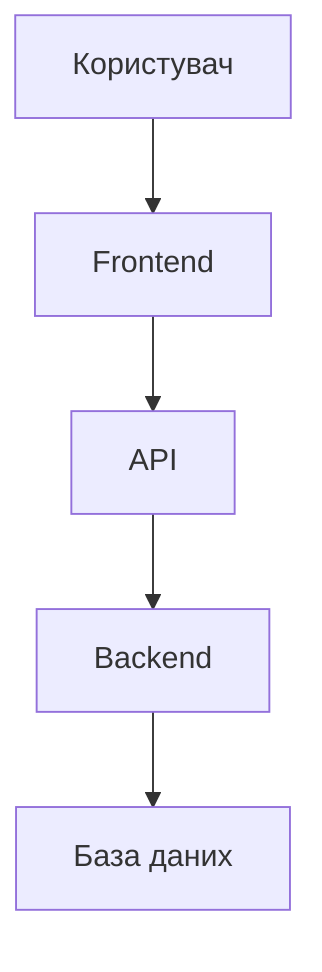
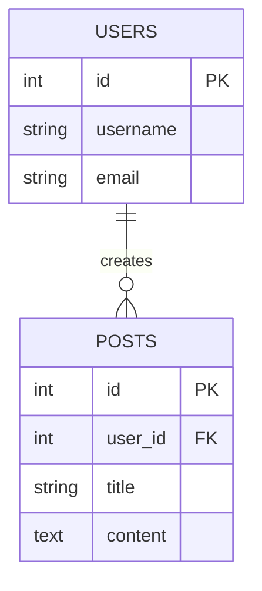

# Лабораторна робота 9. Завершення розробки та презентація проєкту

## 🎯 Мета роботи

Завершити розробку повнофункціонального вебзастосунку, підготувати його до production-розгортання, створити комплексну документацію та презентувати результати роботи з демонстрацією всіх реалізованих функціональних можливостей та технічних рішень.

## ✅ Завдання

Завершити розробку вебпроєкту, який розроблявся протягом виконання попередніх лабораторних робіт, підготувати його до фінального розгортання та публічної презентації:

1. Розширити функціональні можливості застосунку додатковими корисними функціями.
2. Виявити та виправити помилки у роботі застосунку.
3. Покращити користувацький інтерфейс та загальний досвід використання.
4. Створити комплексну документацію проєкту, включаючи технічну документацію та інструкції користувача.
5. Підготувати проєкт до розгортання у production-середовищі.
6. Створити презентаційні матеріали для демонстрації проєкту.
7. Провести публічну презентацію застосунку з демонстрацією функціоналу та обґрунтуванням прийнятих технічних рішень.

**Опціонально** (для вищої оцінки):

- провести комплексне тестування застосунку з покриттям різних сценаріїв використання;
- оптимізувати продуктивність застосунку на backend та frontend рівнях;
- впровадити додаткові механізми безпеки та валідації даних.

## 🖥️ Програмне забезпечення

- Git та GitHub для контролю версій та зберігання коду.
- Docker для контейнеризації застосунку.
- Середовище розробки Visual Studio Code або аналоги.
- Хмарна платформа для розгортання (Render, Heroku, Railway, Vercel, Netlify або інші).
- Інструменти для створення презентацій (PowerPoint, Google Slides, Canva).

## 👥 Форма виконання роботи

Форма виконання роботи **групова** (3-4 особи в команді).

## 📝 Критерії оцінювання

Оцінювання лабораторної роботи здійснюється за диференційованими критеріями для кожного рівня, при цьому завдання є спільним для всіх здобувачів освіти.

**Середній рівень (оцінка "задовільно", 4-6 балів):**

- виправлено основні помилки у роботі застосунку, базовий функціонал працює стабільно;
- додано мінімум 1-2 нові корисні функції, що розширюють можливості застосунку;
- покращено користувацький інтерфейс у ключових місцях застосунку;
- створено базову документацію, яка містить опис основних функцій та інструкції з встановлення;
- проєкт розгорнуто у публічному доступі, застосунок доступний за посиланням;
- підготовлено базову презентацію з описом функціоналу;
- під час захисту здобувач освіти демонструє базове розуміння реалізованих функцій, може пояснити основні технічні рішення, але відчуває труднощі з поясненням складніших аспектів.

**Достатній рівень (оцінка "добре", 7-9 балів):**

- виправлено більшість виявлених помилок, застосунок функціонує стабільно у типових сценаріях використання;
- додано 3-4 нові функції, що суттєво покращують функціональність застосунку;
- значно покращено користувацький інтерфейс, зроблено його більш інтуїтивним та привабливим;
- створено детальну технічну документацію з описом архітектури, API endpoints, структури бази даних;
- застосунок має поліпшений UX з урахуванням зручності користувача;
- підготовлено структуровану презентацію з візуалізацією архітектури та демонстрацією ключових функцій;
- опціонально: проведено базове тестування ключових сценаріїв використання;
- під час захисту здобувач освіти впевнено пояснює технічні рішення, демонструє розуміння використаних технологій та нового функціоналу.

**Високий рівень (оцінка "відмінно", 10-12 балів):**

- виправлено всі виявлені помилки, застосунок демонструє високу стабільність роботи навіть у нестандартних ситуаціях;
- додано 5 і більше нових функцій, що виводять застосунок на якісно новий рівень функціональності;
- реалізовано полірований, адаптивний та естетично привабливий користувацький інтерфейс з увагою до деталей;
- створено вичерпну документацію, яка включає технічний опис, архітектурні діаграми, API документацію, інструкції користувача та розробника;
- опціонально: проведено комплексне тестування з покриттям граничних випадків та різних сценаріїв;
- опціонально: застосунок оптимізовано для продуктивності з використанням кешування, lazy loading або інших технік;
- опціонально: впроваджено додаткові механізми безпеки та валідації даних;
- підготовлено професійну презентацію з детальною візуалізацією архітектури, демонстрацією технічних рішень та обґрунтуванням вибору технологій;
- під час захисту здобувач освіти демонструє глибоке розуміння всіх аспектів проєкту, може обґрунтувати прийняті рішення, порівняти альтернативні підходи, пояснити переваги та недоліки нових функцій, проявляє творчий підхід до розширення функціоналу.

## 📊 Орієнтовна структура презентації

Презентація проєкту повинна бути логічною, структурованою та займати 10-15 хвилин. Нижче наведено рекомендовану структуру:

### Слайд 1. Титульний слайд

- Назва проєкту
- Автор та група
- Дата презентації

### Слайд 2. Огляд проблеми

- Яку проблему вирішує застосунок?
- Хто цільова аудиторія?
- Чому це актуально?

### Слайд 3. Рішення

- Стислий опис застосунку
- Ключова цінність для користувачів
- Унікальні особливості

### Слайд 4. Технологічний стек

- Frontend технології (HTML, CSS, JavaScript, фреймворки)
- Backend технології (мова програмування, фреймворк)
- База даних
- Інші інструменти (Git, Docker, платформа розгортання)

### Слайд 5. Архітектура системи



- Діаграма архітектури застосунку
- Опис основних компонентів
- Взаємодія між компонентами

### Слайд 6-7. Основний функціонал

- Перелік ключових функцій
- Скриншоти інтерфейсу
- Короткий опис кожної функції

### Слайд 8. Нові функції

- Які функції додані в рамках цієї лабораторної?
- Чому саме ці функції?
- Як вони покращують застосунок?

### Слайд 9. Структура бази даних



- Схема основних таблиць
- Зв'язки між таблицями
- Ключові поля

### Слайд 10. API Endpoints

Приклади основних endpoints:

- `GET /api/users` - отримати список користувачів
- `POST /api/users` - створити нового користувача
- `GET /api/posts/:id` - отримати пост за ID
- `PUT /api/posts/:id` - оновити пост
- `DELETE /api/posts/:id` - видалити пост

### Слайд 11. Технічні виклики

- З якими складнощами зіткнулися під час розробки?
- Як вирішували проблеми?
- Які альтернативні підходи розглядалися?

### Слайд 12. Цікаві технічні рішення

Приклад коду з поясненням:

```python
@app.route('/api/users', methods=['POST'])
def create_user():
    # Валідація даних
    # Створення користувача
    # Повернення відповіді
```

- 1-2 приклади цікавих фрагментів коду
- Пояснення прийнятих рішень

### Слайд 13. Демонстрація

**На цьому слайді відбувається live демонстрація:**

- Показати головну сторінку
- Продемонструвати основні функції
- Показати нові додані можливості
- Продемонструвати обробку помилок

### Слайд 14. Можливості розвитку

- Які функції можна додати в майбутньому?
- Як можна покращити продуктивність?
- Які інтеграції планується реалізувати?

### Слайд 15. Висновки

- Що було реалізовано?
- Які навички здобуті?
- Ключові результати проєкту
- Подяка за увагу

### Додаткові рекомендації:

- Використовуйте візуальні елементи (діаграми, скриншоти, схеми)
- Уникайте перевантаження слайдів текстом
- Готуйтеся до запитань про технічні деталі
- Тренуйте презентацію заздалегідь
- Майте запасний план на випадок технічних проблем з демонстрацією

## ⏰ Політика щодо дедлайнів

При порушенні встановленого терміну здачі лабораторної роботи максимальна можлива оцінка становить 9 балів ("добре"), незалежно від якості виконаної роботи. Винятки можливі лише за поважних причин, підтверджених документально.

## 📚 Теоретичні відомості

### Фінальна підготовка проєкту

Завершальний етап розробки програмного забезпечення є критично важливим для успішного випуску продукту. Цей етап включає не лише технічні аспекти, а й підготовку документації, проведення тестування та створення презентаційних матеріалів.

Основні аспекти фінальної підготовки включають перевірку повноти реалізації функціональних вимог, виправлення виявлених помилок та недоліків, оптимізацію продуктивності застосунку. Важливим є також забезпечення якості коду через рефакторинг проблемних ділянок та дотримання стандартів кодування.

### Документація програмного проєкту

Якісна документація є невід'ємною частиною професійного програмного проєкту. Документація поділяється на кілька типів залежно від цільової аудиторії.

Технічна документація призначена для розробників та включає опис архітектури системи, структури бази даних, API endpoints з прикладами запитів та відповідей. Архітектурні діаграми допомагають візуалізувати взаємодію компонентів системи. Документація має містити інформацію про залежності проєкту, процес встановлення та налаштування середовища розробки.

Користувацька документація фокусується на поясненні функціональних можливостей застосунку з точки зору кінцевого користувача. Вона включає інструкції з використання основних функцій, пояснення інтерфейсу та вирішення типових проблем.

Документація розгортання містить покрокові інструкції з розгортання застосунку в production-середовищі, опис необхідних налаштувань серверу, змінних оточення та процесу оновлення застосунку.

### Тестування перед випуском

Фінальне тестування має бути комплексним та охоплювати всі аспекти роботи застосунку. Функціональне тестування перевіряє відповідність реалізації заявленим вимогам, коректність роботи всіх функцій системи.

Тестування граничних випадків включає перевірку поведінки системи при некоректних вхідних даних, максимальних навантаженнях та нестандартних сценаріях використання. Такі тести допомагають виявити приховані помилки та покращити стабільність системи.

Тестування користувацького досвіду оцінює зручність інтерфейсу, інтуїтивність навігації та загальну якість взаємодії користувача з системою. Важливо отримати зворотний зв'язок від реальних користувачів або колег.

### Оптимізація продуктивності

Продуктивність застосунку безпосередньо впливає на користувацький досвід. Backend оптимізація включає покращення швидкості виконання запитів до бази даних через індексування, оптимізацію запитів та використання кешування для часто запитуваних даних.

Frontend оптимізація фокусується на зменшенні часу завантаження сторінок через мінімізацію розміру ресурсів, використання lazy loading для зображень та компонентів, оптимізацію JavaScript коду. Асинхронне завантаження ресурсів покращує сприйняту швидкість роботи застосунку.

### Підготовка до розгортання

Production-середовище має суттєві відмінності від середовища розробки. Важливо переконатися, що всі налаштування правильно сконфігуровані для production використання.

Змінні оточення повинні містити конфіденційну інформацію як паролі бази даних, API ключі та секретні токени. Ці дані ніколи не повинні зберігатися безпосередньо в коді або репозиторії.

Логування та моніторинг допомагають відстежувати роботу застосунку в production та швидко виявляти проблеми. Система повинна логувати важливі події, помилки та метрики продуктивності.

Механізми обробки помилок мають бути налаштовані так, щоб не розкривати технічні деталі реалізації кінцевим користувачам, але при цьому надавати достатньо інформації для діагностики проблем розробникам.

### Створення ефективної презентації

Презентація проєкту є важливою навичкою для програмних інженерів. Презентація має бути структурованою та зрозумілою для аудиторії.

Вступна частина містить опис проблеми, яку вирішує застосунок, та цільової аудиторії продукту. Важливо чітко сформулювати цінність, яку надає застосунок користувачам.

Технічна частина описує використані технології та обґрунтування їх вибору, архітектуру системи з візуальними діаграмами, ключові технічні рішення та виклики, з якими довелося зіткнутися під час розробки.

Демонстрація функціоналу має показати основні можливості застосунку через сценарії реального використання. Варто підготувати демонстраційні дані та протестувати демонстрацію заздалегідь.

Висновки підсумовують досягнуті результати, обговорюють можливі напрямки розвитку проєкту та рефлексію щодо отриманого досвіду та набутих навичок.

### Контроль версій та фінальний реліз

Підготовка фінального релізу включає створення окремої гілки для production версії, встановлення version tag у Git репозиторії, підготовку release notes з описом змін та нових функцій.

Важливо переконатися, що в репозиторії відсутня конфіденційна інформація, код відповідає прийнятим стандартам, всі тести проходять успішно. Файл README має містити вичерпну інформацію про проєкт, інструкції з встановлення та використання.

## ▶️ Хід роботи

### 1. Аналіз поточного стану проєкту

1. Переглянути наявний функціонал:
    - протестувати всі реалізовані функції;
    - виявити помилки та недоліки в роботі;
    - визначити слабкі місця у користувацькому досвіді.
2. Скласти список необхідних покращень:
    - критичні помилки для виправлення;
    - ідеї нових корисних функцій;
    - покращення інтерфейсу та UX.
3. Визначити пріоритети:
    - що потрібно зробити обов'язково;
    - що бажано додати;
    - що буде бонусом.

### 2. Виправлення помилок

1. Виявити та задокументувати баги:
    - протестувати застосунок у різних сценаріях;
    - записати кроки відтворення кожної помилки;
    - оцінити критичність кожного бага.
2. Виправити критичні помилки:
    - проблеми з основним функціоналом;
    - помилки, що призводять до збоїв;
    - проблеми з безпекою.
3. Виправити менш критичні недоліки:
    - некоректне відображення даних;
    - проблеми з валідацією;
    - помилки в обробці граничних випадків.
4. Перевірити результати:
    - переконатися, що помилки виправлено;
    - протестувати суміжний функціонал.

### 3. Розширення функціоналу

1. Визначити нові функції для реалізації:
    - які функції будуть корисні користувачам;
    - які функції логічно доповнюють існуючий функціонал;
    - які функції технічно реалізовані в рамках часу.
2. Приклади нових функцій (залежно від типу застосунку):
    - пошук та фільтрація даних;
    - сортування за різними критеріями;
    - пагінація для великих списків;
    - можливість експорту даних (CSV, JSON);
    - статистика та візуалізація даних;
    - додаткові налаштування користувача;
    - notification система;
    - можливість коментування або оцінювання;
    - інтеграція з зовнішніми API.
3. Реалізувати обрані функції:
    - почати з найпростіших функцій;
    - тестувати кожну нову функцію окремо;
    - інтегрувати з існуючим функціоналом.
4. Задокументувати нові можливості:
    - описати як працюють нові функції;
    - додати приклади використання.

### 4. Покращення користувацького інтерфейсу

1. Проаналізувати поточний інтерфейс:
    - чи зручна навігація;
    - чи зрозумілі елементи управління;
    - чи привабливий візуальний дизайн.
2. Покращити UX:
    - додати повідомлення про успішні операції;
    - покращити повідомлення про помилки;
    - додати індикатори завантаження;
    - зробити форми більш зручними;
    - покращити навігацію.
3. Покращити UI:
    - використати консистентну кольорову схему;
    - покращити типографіку;
    - додати іконки до кнопок та пунктів меню;
    - зробити інтерфейс адаптивним для мобільних пристроїв;
    - додати анімації та переходи.
4. Переконатися в доступності:
    - перевірити контрастність тексту;
    - додати alt-текст до зображень;
    - забезпечити навігацію з клавіатури.

### 5. Створення документації

1. Підготувати технічну документацію:
    - описати архітектуру системи з діаграмами;
    - задокументувати структуру бази даних зі схемами таблиць;
    - створити документацію API з описом всіх endpoints;
    - додати приклади запитів та відповідей для кожного endpoint.
2. Створити користувацьку документацію:
    - написати інструкції з використання основних функцій;
    - додати скриншоти інтерфейсу з поясненнями;
    - описати нові додані функції;
    - підготувати розділ з вирішення типових проблем.
3. Підготувати документацію розгортання:
    - описати процес встановлення та налаштування;
    - перелічити необхідні залежності та їх версії;
    - створити інструкції з розгортання на обраній платформі;
    - документувати необхідні змінні оточення.
4. Оновити файл README:
    - додати опис проєкту та його призначення;
    - включити інструкції з встановлення та запуску;
    - додати інформацію про використані технології;
    - перелічити всі реалізовані функції;
    - вказати автора та ліцензію проєкту.

### 6. Підготовка до розгортання

1. Налаштувати змінні оточення:
    - створити файл `.env.example` з переліком необхідних змінних;
    - переконатися, що конфіденційна інформація не потрапляє в репозиторій;
    - додати `.env` до `.gitignore`;
    - підготувати production конфігурацію.
2. Очистити код:
    - видалити закоментований код;
    - видалити непотрібні console.log;
    - видалити невикористані файли;
    - перевірити та виправити попередження linter.
3. Підготувати Docker конфігурацію (опціонально):
    - створити оптимізований Dockerfile;
    - налаштувати docker-compose для локального розгортання;
    - протестувати запуск застосунку в контейнері.

### 7. Розгортання застосунку

1. Обрати платформу для розгортання:
    - порівняти доступні безкоштовні платформи (Render, Railway, Vercel, Netlify);
    - врахувати технічні вимоги проєкту;
    - обрати найбільш відповідну платформу.
2. Підготувати проєкт до розгортання:
    - переконатися, що всі налаштування правильно сконфігуровані;
    - встановити production залежності;
    - створити production збірку застосунку.
3. Розгорнути застосунок:
    - створити обліковий запис на обраній платформі;
    - підключити Git репозиторій;
    - налаштувати змінні оточення на платформі;
    - розгорнути застосунок.
4. Перевірити роботу застосунку:
    - протестувати всі основні функції в production середовищі;
    - перевірити коректність налаштувань;
    - переконатися в доступності застосунку за публічним посиланням;
    - протестувати нові додані функції.

### 8. Створення презентації

1. Підготувати структуру презентації (див. розділ "Орієнтовна структура презентації"):
    - вступ з описом проблеми та рішення;
    - огляд використаних технологій;
    - демонстрація архітектури системи;
    - опис функціоналу та нових функцій;
    - технічні виклики та їх вирішення;
    - висновки та можливості розвитку.
2. Створити візуальні матеріали:
    - підготувати архітектурні діаграми в Mermaid;
    - створити схему бази даних;
    - зробити скриншоти інтерфейсу;
    - підготувати приклади коду для ключових рішень;
    - виділити візуально нові додані функції.
3. Підготувати демонстрацію:
    - визначити сценарії для демонстрації функціоналу;
    - підготувати демонстраційні дані;
    - протестувати демонстрацію заздалегідь;
    - підготувати запасний план на випадок технічних проблем;
    - обов'язково продемонструвати нові функції.
4. Підготуватися до запитань:
    - передбачити можливі питання аудиторії;
    - підготувати відповіді на технічні питання;
    - бути готовим обґрунтувати прийняті рішення;
    - бути готовим пояснити вибір нових функцій.

### 9. Опціональні завдання (для вищої оцінки)

1. Тестування застосунку:
    - написати unit тести для критичних функцій;
    - протестувати API endpoints;
    - протестувати граничні випадки;
    - задокументувати результати тестування.
2. Оптимізація продуктивності:
    - проаналізувати продуктивність застосунку;
    - оптимізувати запити до бази даних;
    - додати індекси до часто запитуваних полів;
    - оптимізувати завантаження frontend ресурсів;
    - впровадити кешування.
3. Додаткові механізми безпеки:
    - впровадити додаткову валідацію даних;
    - додати rate limiting для API;
    - покращити обробку помилок;
    - впровадити HTTPS.

### 10. Здача та захист роботи

1. Підготувати `README.md` звіт за структурою:
    - опис проєкту та його призначення;
    - огляд використаних технологій та обґрунтування вибору;
    - опис архітектури системи;
    - опис всього реалізованого функціоналу;
    - детальний опис нових доданих функцій;
    - опис виправлених помилок;
    - технічні виклики та способи їх вирішення;
    - опис покращень інтерфейсу;
    - опціонально: результати тестування та оптимізації;
    - посилання на розгорнутий застосунок та репозиторій;
    - висновки та рефлексія.
2. Як відповідь на завдання в LMS Moodle завантажити:
    - посилання на публічний репозиторій GitHub;
    - посилання на розгорнутий застосунок.
3. Провести презентацію проєкту перед викладачем:
    - презентувати основні аспекти проєкту;
    - продемонструвати функціонал застосунку;
    - обов'язково показати нові функції;
    - показати покращення інтерфейсу;
    - відповісти на запитання викладача;
    - обґрунтувати прийняті технічні рішення.

Як відповідь на завдання в LMS Moodle дати посилання на репозиторій з проєктом.

[:fontawesome-solid-cloud-upload: Здати лабораторну роботу](http://194.187.154.85/moodle/course/view.php?id=1426#section-2){ .md-button .md-button--primary }


## ❓ Контрольні запитання

1. Які етапи включає процес фінальної підготовки програмного проєкту до випуску?
2. Які типи документації необхідні для професійного програмного проєкту та яка їх цільова аудиторія?
3. Чому важливе тестування граничних випадків та які сценарії воно включає?
4. Які методи оптимізації продуктивності можна застосувати на backend та frontend рівнях?
5. Що таке змінні оточення та чому їх не можна зберігати безпосередньо в репозиторії?
6. Які основні розділи має містити ефективна презентація технічного проєкту?
7. Що таке release notes та яку інформацію вони повинні містити?
8. Які переваги надає використання Docker для розгортання застосунків?
9. Як забезпечити безпеку застосунку при розгортанні в production середовищі?
10. Які метрики можна використовувати для оцінки успішності проєкту?
