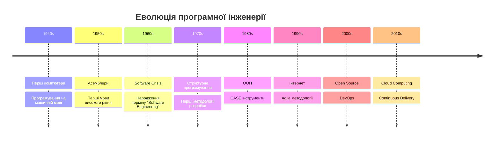
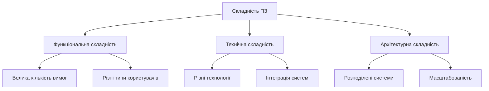
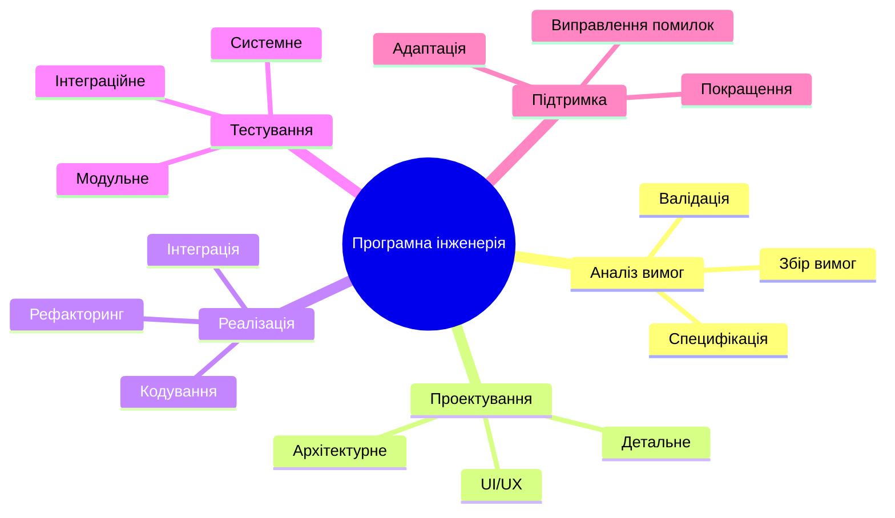

# Лекція 1: Вступ до програмної інженерії

## Цілі лекції

Після вивчення цієї лекції студенти зможуть:

- Визначити поняття "програмна інженерія"
- Пояснити відмінності між програмуванням та програмною інженерією
- Описати основні виклики розробки ПЗ
- Назвати ключові принципи програмної інженерії

## Що таке програмна інженерія?

!!! info "Визначення"
    **Програмна інженерія** - це дисципліна, що займається застосуванням систематичного, дисциплінованого та кількісно вимірного підходу до розробки, експлуатації та підтримки програмного забезпечення.

### Історичний контекст

## Програмування vs Програмна інженерія

| Аспект | Програмування | Програмна інженерія |
|--------|---------------|-------------------|
| **Масштаб** | Окремі програми | Великі системи |
| **Команда** | 1-2 розробники | Команди розробників |
| **Час життя** | Короткостроковий | Довгостроковий |
| **Підтримка** | Мінімальна | Критична |
| **Процес** | Неформальний | Структурований |

## Основні виклики

### 1. Складність

### 2. Зміни вимог

!!! warning "Проблема"
    Статистика показує, що до 40% проєктів зазнають значних змін вимог під час розробки.

### 3. Якість та надійність

Забезпечення якості ПЗ включає:

- Функціональну правильність
- Продуктивність
- Безпеку
- Зручність використання
- Підтримуваність

## Принципи програмної інженерії

### 1. Модульність

Розбиття системи на менші, керовані компоненти.

### 2. Абстракція

Приховування деталей реалізації та фокус на суттєвому.

### 3. Інкапсуляція

Об'єднання даних та методів роботи з ними.

### 4. Ієрархія

Організація системи у вигляді ієрархічної структури.

## Області програмної інженерії

## Життєвий цикл ПЗ (огляд)

1. **Планування** - визначення цілей та ресурсів
2. **Аналіз** - збір та аналіз вимог
3. **Проектування** - архітектура та дизайн
4. **Реалізація** - написання коду
5. **Тестування** - перевірка якості
6. **Розгортання** - впровадження в експлуатацію
7. **Підтримка** - супровід та розвиток

## Ролі в програмній інженерії

- **Software Engineer/Developer** - розробка коду
- **Software Architect** - архітектурні рішення
- **Business Analyst** - аналіз вимог
- **QA Engineer** - забезпечення якості
- **DevOps Engineer** - автоматизація процесів
- **Project Manager** - управління проєктом
- **Product Owner** - визначення продукту

## Сучасні тренди

!!! tip "Актуальні напрямки"
    - **Cloud Computing** - хмарні технології
    - **Microservices** - мікросервісна архітектура
    - **AI/ML Integration** - інтеграція ШІ
    - **Low-Code/No-Code** - візуальна розробка
    - **DevSecOps** - безпека в процесі розробки

## Висновки

Програмна інженерія є критично важливою дисципліною для створення якісного ПЗ. Вона поєднує технічні навички з інженерним мисленням для вирішення складних проблем.

## Питання для самоперевірки

1. Чим програмна інженерія відрізняється від програмування?
2. Які основні виклики стоять перед розробниками ПЗ?
3. Назвіть принципи програмної інженерії та поясніть їх важливість
4. Які ролі існують у команді розробки ПЗ?

## Література

- Sommerville I. Software Engineering, 10th Edition
- Pressman R. Software Engineering: A Practitioner's Approach
- McConnell S. Code Complete

---

**Наступна лекція**: [Життєвий цикл розробки ПЗ](lecture-02.md)
