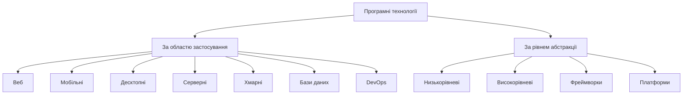
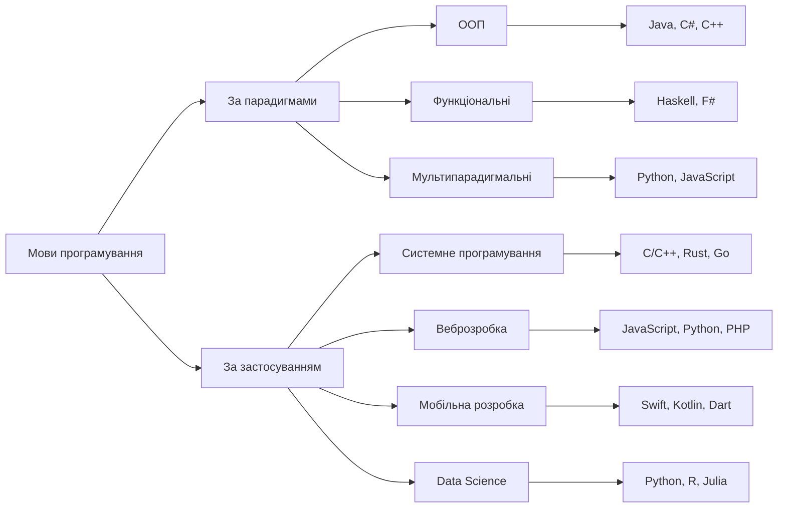
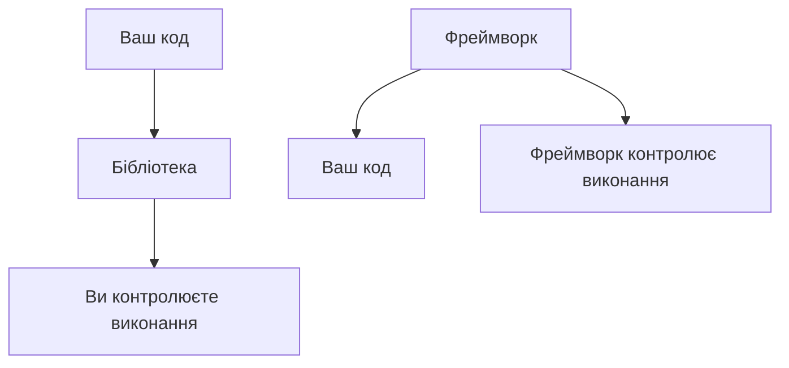
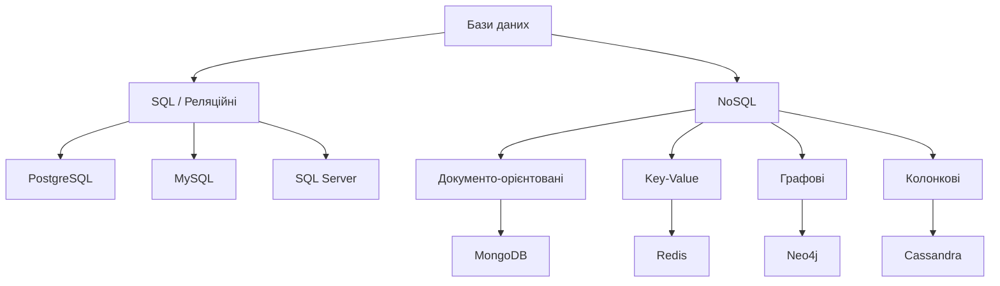
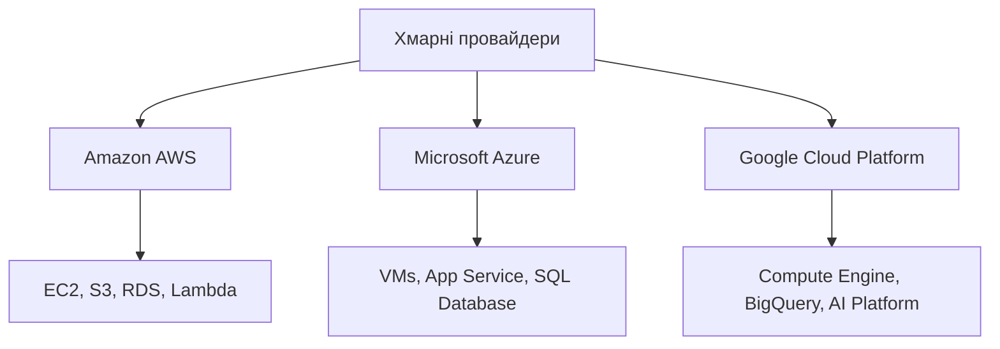
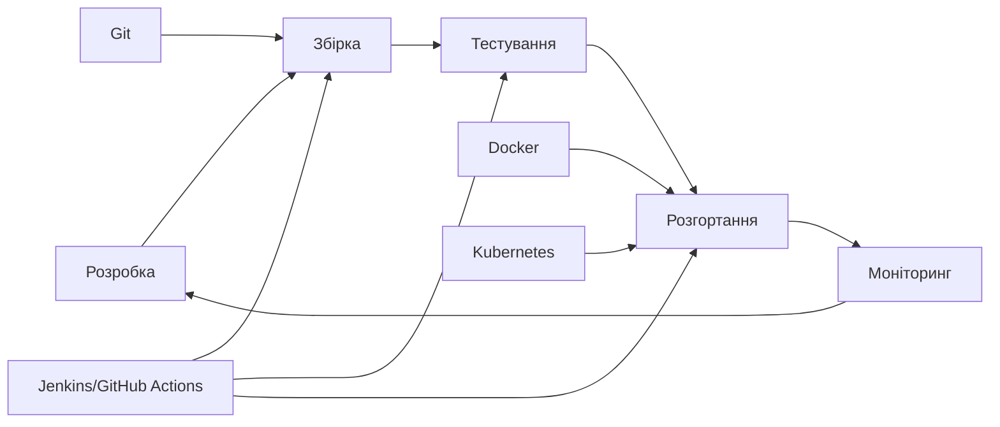
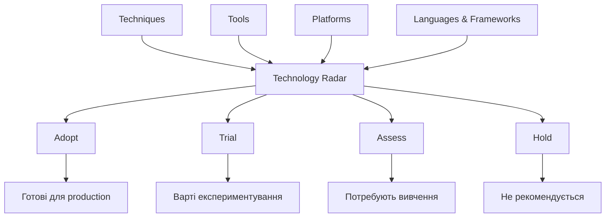
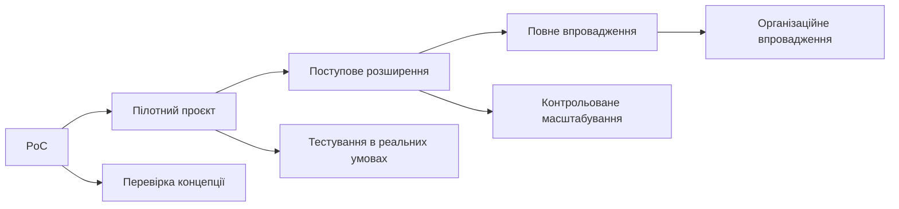

# Лекція 2. Сучасні технології та інструменти розробки

## Вступ

Сучасна програмна інженерія неможлива без розуміння та використання відповідних технологій та інструментів. У цій лекції ми розглянемо ключові технології, які формують основу для створення різноманітних програмних продуктів, від простих мобільних додатків до складних розподілених систем. Розуміння цих технологій є критично важливим для кожного інженера програмного забезпечення.

## Огляд сучасного технологічного ландшафту

### Класифікація програмних технологій



Сучасні програмні технології можна умовно розділити на кілька категорій за областю застосування. Вебтехнології призначені для створення вебсайтів та вебдодатків, мобільні технології — для розробки додатків під iOS, Android та інші платформи. Десктопні технології використовуються для створення настільних програм, серверні — для розробки backend-систем та API. Окремо виділяють хмарні технології для створення масштабованих розподілених систем, технології баз даних для зберігання та обробки даних, а також DevOps технології для автоматизації розгортання та супроводу.

За рівнем абстракції технології поділяються на низькорівневі, такі як програмування на C/C++, Rust або асемблер, та високорівневі — JavaScript, Python, Java, C#. Окремою категорією є фреймворки та бібліотеки, наприклад React, Django або Spring Boot, а також платформи та середовища виконання — Docker, Kubernetes, AWS.

### Основні тенденції розвитку

Сучасна розробка орієнтується на хмарні технології. Додатки проєктуються з урахуванням можливостей хмарних платформ, включаючи мікросервісну архітектуру, контейнеризацію, автоматичне масштабування та використання керованих сервісів. Все більшої популярності набуває API-First підхід, коли розробка починається з проєктування API, що дозволяє створювати гнучкі системи, які легко інтегруються з іншими сервісами.

Помітною тенденцією є розвиток Low-Code та No-Code інструментів, які дозволяють створювати додатки з мінімальним написанням коду або взагалі без нього. Такі інструменти стають популярними для швидкого прототипування та бізнес-автоматизації. Водночас інтеграція штучного інтелекту та машинного навчання стає стандартною практикою для покращення користувацького досвіду та автоматизації бізнес-процесів.

## Мови програмування та їх екосистеми

### Класифікація за парадигмами та застосуванням



Сучасні мови програмування підтримують різні парадигми розробки. Об'єктно-орієнтовані мови, такі як Java, C#, C++ та Python, організують код навколо об'єктів та класів. Функціональні мови, включаючи Haskell, F#, Clojure та частково JavaScript, базуються на математичних функціях. Багато сучасних мов є мультипарадигмальними, дозволяючи розробникам поєднувати різні підходи в одному проєкті.

За областю застосування мови також суттєво відрізняються. Для системного програмування традиційно використовуються C та C++ для операційних систем, драйверів та вбудованих систем. Rust набуває популярності як безпечна альтернатива для системного програмування без garbage collector. Go від Google спеціально розроблений для мережевих сервісів та розподілених систем.

У веброзробці JavaScript та TypeScript є універсальними мовами для frontend та backend розробки. Python широко використовується через Django, Flask та FastAPI фреймворки. PHP залишається спеціалізованою мовою для веброзробки, особливо в контексті CMS систем. Java домінує в корпоративних вебдодатках завдяки Spring екосистемі.

### Детальний огляд ключових мов

JavaScript та TypeScript стали основою сучасної веброзробки завдяки своїй універсальності. JavaScript дозволяє використовувати одну мову як на frontend, так і на backend, що спрощує розробку та підтримку. Екосистема npm налічує понад два мільйони пакетів, що робить її найбільшою в світі. TypeScript додає статичну типізацію, що значно покращує надійність коду та зручність розробки. Однак динамічна природа JavaScript може призводити до помилок у runtime, а швидкі зміни в екосистемі іноді створюють плутанину для розробників.

Python відзначається простотою синтаксису та потужною стандартною бібліотекою. Мова особливо популярна в галузях Data Science, машинного навчання та автоматизації завдяки бібліотекам як NumPy, Pandas, TensorFlow та Scikit-learn. Python універсальний — від веброзробки до наукових обчислень. Проте продуктивність Python поступається компільованим мовам, а Global Interpreter Lock обмежує ефективність багатопоточних програм.

Java залишається однією з найпопулярніших мов для корпоративної розробки. Принцип "write once, run anywhere" забезпечує кросплатформенність, а сильна типізація та автоматичне управління пам'яттю роблять розробку безпечнішою. Величезна екосистема корпоративних фреймворків та відмінна продуктивність для довготривалих процесів роблять Java привабливою для великих систем. Водночас багатослівний синтаксис та повільний запуск JVM можуть бути недоліками для деяких типів додатків.

## Фреймворки та бібліотеки

### Концепція та призначення фреймворків

Фреймворк — це набір інструментів, бібліотек та конвенцій, який надає структуру для розробки програмного забезпечення. Фреймворки визначають архітектуру додатка та спосіб організації коду, реалізуючи принцип інверсії контролю. На відміну від бібліотек, які ви викликаєте у своєму коді, фреймворк контролює виконання та викликає ваш код у потрібні моменти.



Використання фреймворків значно прискорює розробку, забезпечуючи готові рішення для типових задач. Вони нав'язують певні архітектурні паттерни та найкращі практики, що покращує якість коду та полегшує командну роботу. Фреймворки також надають інструменти для тестування, налагодження та розгортання додатків.

### Frontend фреймворки

React від Facebook став найпопулярнішою бібліотекою для створення користувацьких інтерфейсів. Основна ідея React полягає в компонентній архітектурі, де інтерфейс складається з незалежних, повторно використовуваних компонентів. Віртуальний DOM забезпечує ефективне оновлення інтерфейсу, порівнюючи поточний стан з попереднім та оновлюючи лише змінені елементи. Однонаправлений потік даних спрощує відстеження змін стану та налагодження додатків.

Vue.js позиціонується як прогресивний фреймворк, який можна поступово впроваджувати в існуючі проєкти. Vue відзначається інтуїтивним синтаксисом шаблонів, який нагадує звичайний HTML з додатковими директивами. Вбудована система реактивності автоматично відстежує зміни даних та оновлює інтерфейс. Vue має офіційні бібліотеки для маршрутизації (Vue Router) та управління станом (Vuex/Pinia).

Angular від Google — це повноцінний фреймворк для створення масштабних вебдодатків. Angular використовує TypeScript за замовчуванням, що забезпечує кращу типізацію та інструментарій. Фреймворк включає потужну систему впровадження залежностей, яка покращує модульність та тестованість коду. Angular CLI автоматизує багато рутинних завдань, від створення компонентів до збірки та тестування.

### Backend фреймворки

Express.js є мінімалістичним веб-фреймворком для Node.js, який надає основні засоби для створення вебсерверів та API. Простота та гнучкість Express роблять його популярним вибором для швидкого прототипування та створення RESTful API. Велика екосистема middleware дозволяє легко додавати функціональність для автентифікації, логування, обробки помилок тощо.

Django — це високорівневий Python веб-фреймворк, який дотримується принципу "батарейки включені". Django надає багато функцій з коробки, включаючи ORM для роботи з базами даних, систему автентифікації, адміністративну панель та засоби безпеки. Фреймворк сприяє швидкій розробці завдяки генераторам коду та конвенціям над конфігурацією.

Spring Boot революціонізував Java розробку, спростивши створення автономних додатків з мінімальною конфігурацією. Автоматична конфігурація Spring Boot аналізує classpath та автоматично налаштовує компоненти. Вбудований сервер додатків дозволяє запускати програми як звичайні JAR файли. Spring екосистема надає рішення для будь-яких потреб, від безпеки до мікросервісів.

### Мобільні фреймворки

React Native дозволяє створювати нативні мобільні додатки, використовуючи JavaScript та React концепції. Головна перевага — можливість використовувати спільну кодову базу для iOS та Android платформ, що значно зменшує час розробки. React Native компілює JavaScript код у нативні компоненти, забезпечуючи продуктивність, близьку до нативних додатків.

Flutter від Google використовує мову Dart для створення нативних додатків з єдиної кодової бази. Flutter має власний графічний рушій, що забезпечує консистентний вигляд на різних платформах. Hot reload дозволяє миттєво бачити зміни під час розробки. Flutter підтримує не лише мобільні платформи, а й веб та десктоп.

## Бази даних та системи зберігання

### Типи баз даних



Реляційні бази даних організують інформацію у вигляді таблиць з чітко визначеними зв'язками між ними. Використання SQL як стандартизованої мови запитів робить реляційні бази зрозумілими для більшості розробників. ACID властивості (Atomicity, Consistency, Isolation, Durability) забезпечують надійність та цілісність даних, що критично важливо для фінансових та інших відповідальних систем.

PostgreSQL вважається однією з найпотужніших open-source реляційних баз даних. Вона підтримує розширені типи даних, включаючи JSON, масиви та геопросторові дані. PostgreSQL має потужну систему розширень та підтримує як SQL, так і NoSQL функціональність. MySQL залишається популярним вибором для вебдодатків завдяки простоті використання та хорошій продуктивності для read-heavy навантажень.

Microsoft SQL Server та Oracle Database представляють корпоративний сегмент ринку, надаючи розширені можливості для аналітики, високої доступності та масштабування. Ці системи включають вбудовані засоби для бізнес-інтелекту, машинного навчання та advanced analytics.

### NoSQL бази даних

NoSQL бази даних з'явилися для вирішення обмежень реляційних баз при роботі з великими обсягами неструктурованих даних. Основні переваги NoSQL включають гнучкість схеми даних, горизонтальне масштабування та високу продуктивність для специфічних типів запитів.

Документо-орієнтовані бази даних, такі як MongoDB, зберігають дані у форматі, подібному до JSON. Це природним чином відображає об'єкти з програмного коду, спрощуючи розробку. MongoDB особливо популярний у веброзробці завдяки простоті інтеграції з JavaScript додатками.

Key-value сховища, включаючи Redis та Amazon DynamoDB, оптимізовані для максимальної швидкості доступу до даних за ключем. Redis часто використовується для кешування, зберігання сесій та real-time аналітики завдяки своїй швидкості та багатим структурам даних у пам'яті.

Графові бази даних, такі як Neo4j, спеціалізуються на зберіганні та обробці складних зв'язків між даними. Вони ідеально підходять для соціальних мереж, рекомендаційних систем та fraud detection, де важливі не стільки самі дані, скільки зв'язки між ними.

### Критерії вибору бази даних

Вибір типу бази даних залежить від специфіки проєкту та вимог до системи. Для додатків з чітко структурованими даними та складними зв'язками краще підходять реляційні бази. Якщо схема даних може змінюватися або дані мають варіативну структуру, варто розглянути NoSQL рішення.

Обсяги даних також впливають на вибір. Відносно невеликі обсяги до сотень гігабайт можуть ефективно оброблятися як SQL, так і NoSQL базами. Для big data сценаріїв зазвичай обирають NoSQL рішення або спеціалізовані аналітичні платформи.

Вимоги до консистентності даних є критичним фактором. Фінансові системи потребують сильної консистентності, яку краще забезпечують реляційні бази. Для систем, де eventual consistency є прийнятною, NoSQL бази можуть надати кращу продуктивність та масштабованість.

## Хмарні платформи та DevOps

### Революція хмарних обчислень



Хмарні платформи кардинально змінили підхід до розгортання та управління програмними системами. Замість купівлі та підтримки власного обладнання, організації можуть орендувати обчислювальні ресурси за потребою. Це дозволяє зосередитися на розробці бізнес-логіки замість управління інфраструктурою.

Amazon Web Services залишається лідером ринку хмарних сервісів з найширшим набором послуг. AWS надає все необхідне для створення масштабованих додатків — від віртуальних серверів EC2 до serverless функцій Lambda. Сервіси як RDS для баз даних, S3 для зберігання файлів та EKS для Kubernetes суттєво спрощують розгортання складних систем.

Microsoft Azure сильний у корпоративному сегменті завдяки інтеграції з продуктами Microsoft. Azure надає потужні засоби для hybrid cloud рішень, коли частина інфраструктури залишається on-premises. Azure DevOps інтегрує інструменти для планування, розробки, тестування та розгортання в єдину платформу.

Google Cloud Platform виділяється передовими рішеннями для машинного навчання та аналітики великих даних. BigQuery дозволяє аналізувати петабайти даних за секунди, а AI Platform надає готові моделі машинного навчання. GKE вважається одним з найкращих керованих Kubernetes сервісів.

### DevOps культура та інструменти

DevOps об'єднує розробку (Development) та операційну діяльність (Operations) для прискорення доставки програмного забезпечення. Основна ідея полягає в автоматизації процесів збірки, тестування та розгортання, що дозволяє частіше випускати релізи з меншою кількістю помилок.



Контейнеризація через Docker стала стандартом пакування додатків. Контейнери забезпечують консистентність середовища між розробкою, тестуванням та production. Dockerfile описує всі залежності додатка, гарантуючи, що він працюватиме однаково в будь-якому середовищі. Це розв'язує класичну проблему "works on my machine".

Kubernetes революціонізував управління контейнеризованими додатками в production. Платформа автоматично масштабує додатки залежно від навантаження, перезапускає контейнери при збоях та розподіляє трафік між репліками. Декларативний підхід Kubernetes дозволяє описати бажаний стан системи, а платформа сама підтримує його.

CI/CD (Continuous Integration/Continuous Deployment) автоматизує процес доставки коду від розробника до production. При кожному коміті автоматично запускаються тести, збирається додаток та розгортається в staging середовищі. Після успішного тестування код автоматично потрапляє в production. Це дозволяє розгортати зміни кілька разів на день замість раз на місяць.

Infrastructure as Code дозволяє описувати інфраструктуру у вигляді коду. Terraform, AWS CloudFormation та подібні інструменти дозволяють створювати та модифікувати інфраструктуру через версійовані файли конфігурації. Це забезпечує відтворюваність середовищ та дозволяє застосовувати до інфраструктури ті ж практики, що й до коду.

## Інструменти розробки

### Середовища розробки та редактори

Visual Studio Code став фактичним стандартом для багатьох розробників завдяки своїй універсальності та розширюваності. Хоча VSCode позиціонується як редактор коду, величезна кількість розширень робить його потужним IDE для більшості мов програмування. Вбудована підтримка Git, інтегрований термінал та debugger покривають основні потреби розробника. Функція remote development дозволяє працювати з кодом на віддалених серверах або в контейнерах.

JetBrains продукти представляють професійні IDE з глибоким аналізом коду та потужними інструментами рефакторингу. IntelliJ IDEA для Java, PyCharm для Python, WebStorm для JavaScript надають інтелектуальне автодоповнення, яке розуміє контекст коду. Вбудовані інструменти для profiling та debugging допомагають оптимізувати продуктивність додатків.

### Системи контролю версій

Git стала незамінним інструментом сучасної розробки завдяки своїй розподіленій архітектурі. Кожен розробник має повну копію історії проєкту, що дозволяє працювати офлайн та швидко виконувати більшість операцій. Система гілок Git надзвичайно гнучка, дозволяючи експериментувати з новими функціями без ризику для основної кодової бази.

```mermaid
gitgraph
    commit id: "Initial commit"
    branch feature
    checkout feature
    commit id: "Add new feature"
    commit id: "Fix bug"
    checkout main
    commit id: "Update documentation"
    merge feature
    commit id: "Release v1.0"
```

Концепція Pull Request або Merge Request стала стандартом для code review. Розробники створюють окремі гілки для нових функцій, а потім пропонують зміни для включення в основну гілку. Це дозволяє команді переглядати код, обговорювати рішення та забезпечувати якість перед інтеграцією змін.

GitHub, GitLab та Bitbucket надають не лише хостинг для Git репозиторіїв, а й цілу екосистему інструментів для collaborative development. Issue tracking, project boards, CI/CD pipelines та package registries інтегровані в єдину платформу, спрощуючи управління проєктами.

### Інструменти тестування та якості коду

Автоматизоване тестування стало невід'ємною частиною сучасної розробки. Unit тести перевіряють окремі функції та методи в ізоляції. Jest для JavaScript, pytest для Python, JUnit для Java надають зручні API для написання та запуску тестів. Хороше покриття unit тестами дозволяє впевнено рефакторити код та додавати нові функції.

Integration тести перевіряють взаємодію між компонентами системи. Вони можуть тестувати API endpoints, взаємодію з базою даних або інтеграцію з зовнішніми сервісами. Такі тести виконуються повільніше за unit тести, але дають більшу впевненість у правильності роботи системи.

End-to-end тести автоматизують дії користувача в браузері, перевіряючи всю систему від інтерфейсу до бази даних. Cypress, Playwright та Selenium дозволяють описувати користувацькі сценарії у вигляді коду. Хоча такі тести найповільніші та найскладніші в підтримці, вони найкраще моделюють реальне використання додатка.

## Тенденції та майбутнє технологій

### Штучний інтелект у розробці

Штучний інтелект перестає бути окремою галуззю і стає частиною повсякденної розробки. GitHub Copilot та подібні інструменти використовують великі мовні моделі для автогенерації коду на основі коментарів або контексту. Це не замінює програмістів, але значно прискорює написання boilerplate коду та допомагає з незнайомими API.

MLOps — набір практик для інтеграції машинного навчання в production системи розвивається паралельно з DevOps. Версійність моделей, автоматизовані pipelines для навчання, моніторинг якості моделей у production стають стандартними практиками. Платформи як MLflow, Kubeflow та SageMaker спрощують життєвий цикл ML проєктів.

Автоматизація тестування через AI дозволяє генерувати тест-кейси на основі аналізу коду. Visual testing з використанням computer vision може автоматично виявляти регресії в інтерфейсі. Code review боти аналізують зміни в коді та пропонують покращення або виявляють потенційні проблеми.

### Edge Computing та IoT

Edge Computing переносить обчислення ближче до джерел даних замість централізованих хмарних дата-центрів. Це критично важливо для додатків, що потребують мінімальної латентності, таких як автономні автомобілі або промислова автоматизація. Обробка даних на краю мережі також зменшує використання пропускної здатності та покращує приватність.

Internet of Things створює нові можливості для розробників, але й нові виклики. Мільярди підключених пристроїв генерують величезні обсяги даних, які потрібно ефективно збирати, обробляти та аналізувати. Протоколи як MQTT та CoAP оптимізовані для IoT сценаріїв з обмеженою пропускною здатністю та батареєю.

### Low-Code та демократизація розробки

Low-Code та No-Code платформи дозволяють створювати додатки людям без глибоких технічних знань. Microsoft Power Platform, Salesforce Platform, OutSystems та подібні рішення надають візуальні інструменти для проєктування бізнес-процесів та інтерфейсів.

Хоча такі платформи не замінять traditional development для складних систем, вони дозволяють швидко створювати прототипи та автоматизувати прості бізнес-процеси. Це звільняє розробників від рутинних завдань, дозволяючи зосередитися на більш складних та творчих аспектах.

## Вибір та оцінювання технологій

### Методологія Technology Radar



Technology Radar від ThoughtWorks є ефективним інструментом для систематичного відстеження технологічних трендів. Радар поділяється на чотири квадранти — Techniques (методології та процеси), Tools (конкретні інструменти), Platforms (операційні системи та фреймворки) та Languages & Frameworks.

Кожна технологія розміщується в одному з кілець залежно від рівня зрілості. Adopt містить технології, готові для production використання. Trial включає перспективні технології, варті експериментування в пілотних проєктах. Assess позначає технології, які потребують вивчення та оцінки. Hold містить технології, використання яких не рекомендується.

Регулярний перегляд Technology Radar допомагає командам та організаціям залишатися в курсі технологічних трендів та приймати обґрунтовані рішення щодо впровадження нових інструментів.

### Критерії оцінювання

При виборі нових технологій важливо враховувати множину факторів. Технічні критерії включають зрілість технології, продуктивність, масштабованість та безпеку. Молоді технології можуть мати cutting-edge функції, але нестабільність та відсутність best practices можуть створити ризики для production систем.

Екосистемні фактори не менш важливі за технічні характеристики. Розмір та активність спільноти впливають на доступність навчальних матеріалів, кількість готових рішень та швидкість виправлення помилок. Якість документації критично важлива для продуктивності команди. Learning curve визначає, скільки часу потрібно для ефективного використання технології.

Бізнес-критерії включають загальну вартість володіння, швидкість виходу на ринок та довгострокові перспективи. Дешеві рішення можуть виявитися дорогими в підтримці. Vendor lock-in може обмежити гнучкість у майбутньому. Важливо оцінювати не лише поточні потреби, а й перспективи розвитку проєкту.

### Стратегії впровадження



Впровадження нових технологій варто здійснювати поетапно, починаючи з Proof of Concept для перевірки основних гіпотез. Пілотний проєкт дозволяє детально протестувати технологію в реальних умовах з контрольованими ризиками. Успішний пілот можна поступово розширювати до повного впровадження в організації.

Управління ризиками включає підготовку планів відкату та підтримку legacy систем під час переходу. Навчання команди новим технологіям потребує часу та ресурсів, які варто закладати в планування проєкту. Continuous monitoring після впровадження допомагає виявити проблеми на ранніх стадіях.

## Практичні рекомендації

### Для студентів та початківців

Студентам та початківцям розробникам важливо спочатку засвоїти фундаментальні концепції computer science — алгоритми, структури даних, принципи програмування. Ці знання залишаються актуальними незалежно від конкретних технологій. Обов'язковим є володіння системами контролю версій, передусім Git, та базовими навичками роботи з командним рядком.

Краще обрати одну технологію та вивчити її глибоко, ніж поверхнево знайомитися з багатьма. Python підходить для загальної розробки та знайомства з Data Science. JavaScript дає універсальність для веброзробки. Java надає міцні основи для розуміння корпоративної розробки та об'єктно-орієнтованого програмування.

Найкращими ресурсами для навчання залишаються офіційна документація технологій та project-based learning через створення реальних додатків. Інтерактивні платформи як freeCodeCamp, Codecademy надають структуроване навчання з практичними завданнями. Участь у open source проєктах дозволяє набути досвіду командної роботи та познайомитися з професійними практиками.

### Для команд та організацій

Організації потребують структурованого підходу до technology governance. Architecture Review Board може колегіально приймати рішення щодо впровадження нових технологій, враховуючи технічні та бізнес-фактори. Встановлення корпоративних технологічних стандартів допомагає уникнути фрагментації та спрощує підтримку систем.

Культура continuous learning критично важлива в швидко змінюваному технологічному середовищі. Внутрішні tech talks дозволяють співробітникам ділитися знаннями про нові технології. Communities of practice об'єднують фахівців навколо спільних інтересів. Виділення часу для експериментів та інновацій допомагає командам залишатися в курсі трендів.

Регулярна участь у професійних конференціях та навчальних програмах підтримує кваліфікацію команди на актуальному рівні. Важливо балансувати між стабільністю поточних рішень та впровадженням інновацій.

## Висновки

Сучасний технологічний ландшафт характеризується величезною різноманітністю інструментів та постійними змінами. Успішний інженер програмного забезпечення повинен розуміти фундаментальні принципи, які залишаються стабільними попри зміни технологій. Адаптивність та здатність швидко освоювати нові інструменти стають ключовими навичками.

Системне мислення допомагає розуміти, як різні технології взаємодіють у цілісній системі. Технологічні рішення завжди повинні відповідати бізнес-цілям та враховувати довгострокові перспективи. Важливо підтримувати баланс між інноваціями та стабільністю, між швидкістю розробки та якістю продукту.

Головне завдання сучасного інженера полягає не в знанні всіх існуючих технологій, а в умінні швидко оцінювати, вивчати та застосовувати ті інструменти, які найкраще підходять для конкретних завдань. Технології є засобами для досягнення цілей, а не самоціллю. Розуміння цього принципу допомагає приймати обґрунтовані рішення в умовах технологічного різноманіття.

У наступних лекціях ми детальніше розглянемо, як ці технології застосовуються в рамках життєвого циклу розробки програмного забезпечення та як вони інтегруються в сучасні методології розробки. Особливу увагу приділимо практичним аспектам вибору та використання технологій у реальних проєктах.

## Питання для самоперевірки

1. Які основні критерії слід враховувати при виборі мови програмування для нового проєкту?
2. У чому полягають основні відмінності між SQL та NoSQL базами даних? Коли краще використовувати кожен тип?
3. Які переваги надає використання хмарних платформ порівняно з власною інфраструктурою?
4. Що таке DevOps та які основні інструменти використовуються в DevOps практиках?
5. Як Technology Radar допомагає в прийнятті рішень щодо впровадження нових технологій?
6. Чому важливо розуміти різні типи технологічних стеків та їх застосування?
7. Які фактори впливають на успішність впровадження нових технологій в організації?
