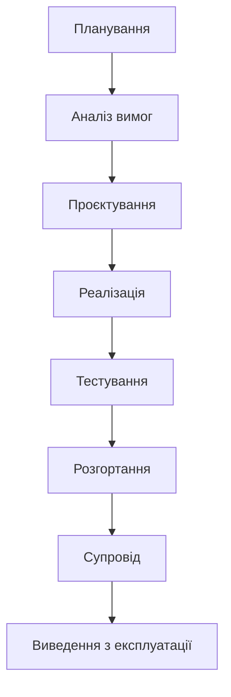
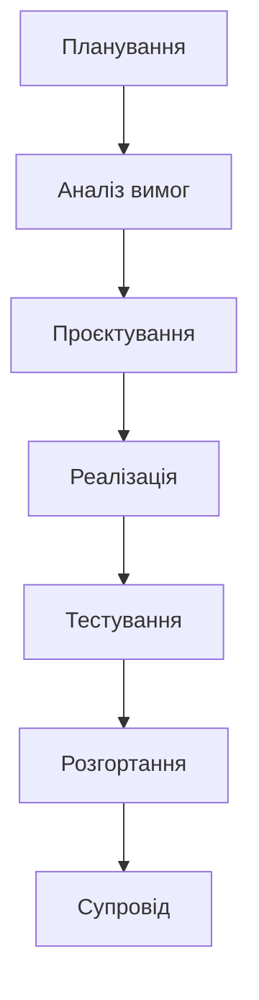
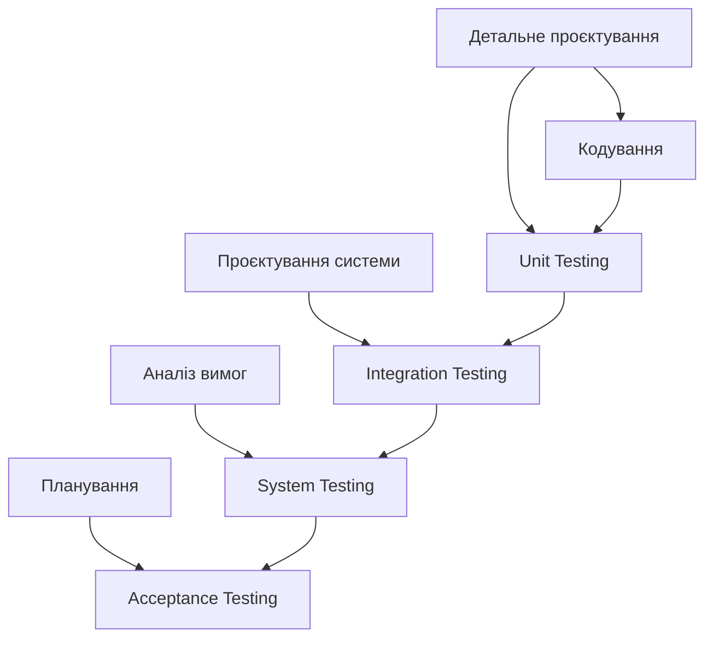
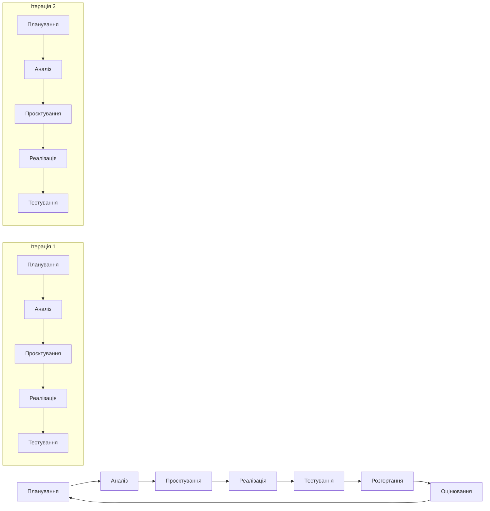
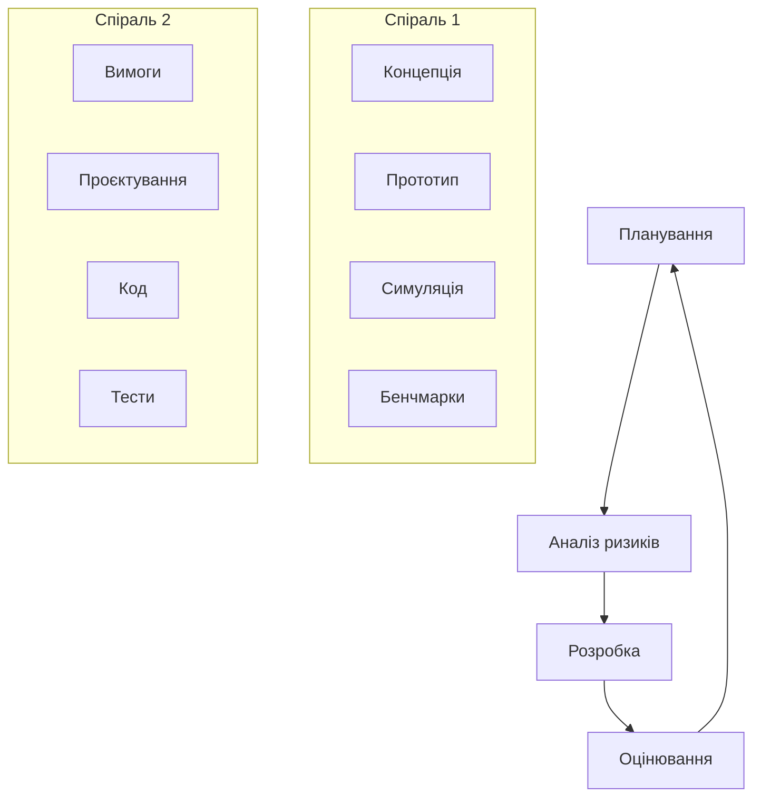
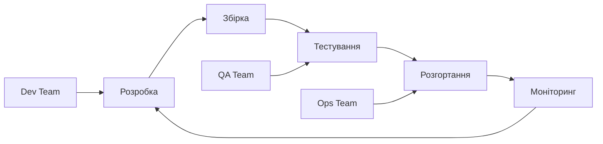

# Лекція 3. Життєвий цикл розробки програмного забезпечення (SDLC)

## Вступ

Розробка програмного забезпечення є складним процесом, який потребує структурованого підходу для забезпечення успішного створення якісних програмних продуктів. Життєвий цикл розробки програмного забезпечення (Software Development Life Cycle - SDLC) визначає систематичний процес планування, створення, тестування та розгортання програмних систем. Розуміння SDLC є фундаментальним для кожного інженера програмного забезпечення, оскільки воно забезпечує основу для організації роботи команди та управління проєктами.

## Визначення та основні поняття

Життєвий цикл розробки програмного забезпечення — це систематичний процес розробки програмного забезпечення, який включає всі етапи від початкового планування до кінцевого виведення з експлуатації. SDLC визначає послідовність дій, методології та інструменти, необхідні для створення якісного програмного продукту, який відповідає вимогам користувачів та бізнесу.

Основною метою SDLC є забезпечення структурованого підходу до розробки, який дозволяє:

- мінімізувати ризики проєкту та передбачити потенційні проблеми;
- забезпечити високу якість кінцевого продукту через систематичне тестування;
- ефективно управляти ресурсами та дотримуватися бюджету;
- встановити чіткі терміни та контрольні точки для відстеження прогресу;
- покращити комунікацію між учасниками проєкту та зацікавленими сторонами.

SDLC не є статичною концепцією. Він еволюціонував від традиційних підходів до сучасних гнучких методологій, адаптуючись до змінних потреб індустрії програмного забезпечення. Кожна організація може адаптувати SDLC відповідно до своїх специфічних потреб, розміру команди та характеру проєктів.

## Основні етапи SDLC

### Етап 1. Планування проєкту

Планування є фундаментальним етапом, який визначає успіх всього проєкту. На цій стадії команда визначає цілі проєкту, його обсяг, ресурси та часові рамки. Планування включає кілька ключових аспектів.

Визначення цілей та обсягу проєкту відбувається через детальний аналіз бізнес-потреб. Команда встановлює, що саме потрібно створити, які проблеми має вирішити майбутнє програмне забезпечення та яких результатів очікують зацікавлені сторони. Важливо чітко визначити межі проєкту — що входить у обсяг робіт, а що залишається поза ним.

Оцінка ресурсів включає визначення необхідної кількості розробників, їхніх навичок, технічного обладнання та фінансових витрат. Команда аналізує доступні ресурси та планує їх ефективне використання протягом проєктного циклу.

Планування часових рамок передбачає створення детального графіку робіт з урахуванням взаємозалежностей між різними задачами. Використовуються техніки як діаграми Ганта або методи критичного шляху для оптимізації розподілу завдань у часі.

Аналіз ризиків дозволяє ідентифікувати потенційні загрози успішному завершенню проєкту. Команда розробляє стратегії мітигації ризиків та плани дій у випадку виникнення непередбачених ситуацій.

### Етап 2. Аналіз та збір вимог

Етап аналізу вимог є критично важливим, оскільки помилки на цій стадії можуть призвести до значних витрат та перероблення на пізніших етапах. Процес включає систематичний збір, аналіз та документування всіх вимог до майбутньої системи.

Функціональні вимоги описують, що саме має робити система. Вони визначають конкретні функції, які користувач може виконувати, та поведінку системи в різних сценаріях використання. Приклади функціональних вимог включають можливість авторизації користувачів, обробку платежів або генерацію звітів.

Нефункціональні вимоги встановлюють критерії якості системи. Вони включають вимоги до продуктивності, надійності, безпеки, масштабованості та зручності використання. Наприклад, система повинна обробляти 1000 одночасних користувачів або відповідати на запити протягом 2 секунд.

Бізнес-вимоги визначають високорівневі цілі організації, які має досягти система. Вони пов'язують технічну реалізацію з бізнес-стратегією та допомагають приймати рішення щодо пріоритетів функціональності.

Процес збору вимог включає різні техніки: інтерв'ю із зацікавленими сторонами, майстер-класи, аналіз існуючої документації, спостереження за робочими процесами та прототипування. Важливо залучити всіх ключових учасників для забезпечення повноти та точності вимог.

Документування вимог має бути структурованим та зрозумілим. Використовуються техніки як Use Cases, User Stories або формальні специфікації залежно від характеру проєкту та методології розробки.

### Етап 3. Проєктування системи

Проєктування трансформує вимоги у детальний план реалізації системи. Цей етап включає архітектурне проєктування високого рівня та детальне проєктування компонентів.

Архітектурне проєктування визначає загальну структуру системи, основні компоненти та їх взаємодію. Архітектори приймають рішення щодо технологічного стеку, патернів архітектури, інтеграційних підходів та принципів організації коду. Результатом є архітектурна діаграма, яка показує основні модулі системи та потоки даних між ними.

Проєктування бази даних включає створення логічної та фізичної моделі даних. Визначаються сутності, їх атрибути, зв'язки та обмеження цілісності. Оптимізується структура для забезпечення ефективного зберігання та доступу до даних.

Проєктування інтерфейсу користувача фокусується на створенні інтуїтивного та зручного досвіду взаємодії. Розробляються wireframes, mockups та прототипи, які демонструють розміщення елементів інтерфейсу та навігацію між екранами.

Проєктування API визначає інтерфейси взаємодії між різними компонентами системи або зовнішніми сервісами. Специфікуються ендпоінти, формати даних, методи аутентифікації та обробки помилок.

Проєктування безпеки інтегрується в усі аспекти системи. Визначаються механізми аутентифікації та авторизації, шифрування даних, захисту від поширених вразливостей та відповідності стандартам безпеки.

### Етап 4. Реалізація та кодування

Етап реалізації перетворює проєктні рішення у функціонуючий код. Цей етап часто займає найбільшу частину проєктного часу та потребує ефективної координації між розробниками.

Організація роботи команди включає розподіл завдань між розробниками, встановлення стандартів кодування та налаштування середовища розробки. Важливо забезпечити консистентність у стилі коду та підходах до реалізації.

Вибір технологій та інструментів базується на проєктних рішеннях та вимогах проєкту. Команда налаштовує середовища розробки, системи контролю версій, інструменти збірки та автоматизації.

Процес кодування має дотримуватися принципів чистого коду та найкращих практик. Розробники створюють модульний, читабельний та підтримуваний код з адекватним рівнем коментування та документації.

Контроль якості коду здійснюється через code reviews, статичний аналіз коду та дотримання встановлених стандартів. Використовуються інструменти для автоматичної перевірки стилю коду та виявлення потенційних проблем.

Управління конфігурацією забезпечує відстеження змін у коді, координацію роботи команди та можливість відкату до попередніх версій у разі проблем.

### Етап 5. Тестування

Тестування є критично важливим етапом, який забезпечує якість та надійність програмного продукту. Воно включає різні типи та рівні тестування для виявлення та усунення дефектів.

Unit тестування перевіряє окремі компоненти або функції в ізоляції. Розробники створюють автоматизовані тести, які перевіряють правильність роботи кожної одиниці коду. Це дозволяє швидко виявляти регресії при внесенні змін.

Integration тестування перевіряє взаємодію між різними компонентами системи. Воно може бути поступовим, коли компоненти інтегруються та тестуються поетапно, або системним, коли тестується вся система як єдине ціле.

System тестування перевіряє повну функціональність системи в умовах, максимально наближених до продуктивного середовища. Перевіряються всі функціональні та нефункціональні вимоги.

Acceptance тестування виконується кінцевими користувачами або їх представниками для підтвердження того, що система відповідає бізнес-вимогам та готова для впровадження.

Performance тестування оцінює продуктивність системи під різними навантаженнями. Воно включає тестування навантаження, стресс-тестування та тестування об'єму для забезпечення відповідності вимогам продуктивності.

Security тестування виявляє вразливості та забезпечує захист системи від потенційних загроз. Перевіряються механізми аутентифікації, авторизації, шифрування та захисту від поширених атак.

### Етап 6. Розгортання

Розгортання переносить протестовану систему з середовища розробки у продуктивне середовище, де вона стане доступною для кінцевих користувачів.

Підготовка продуктивного середовища включає налаштування серверів, мереж, баз даних та інших інфраструктурних компонентів. Забезпечується відповідність конфігурації вимогам безпеки та продуктивності.

Міграція даних переносить існуючі дані з старих систем у нову. Цей процес потребує ретельного планування, валідації та резервного копіювання для запобігання втрати даних.

Навчання користувачів готує кінцевих користувачів до роботи з новою системою. Розробляється документація, проводяться тренінги та забезпечується підтримка під час переходу.

Поступове розгортання дозволяє мінімізувати ризики через поетапне впровадження. Може використовуватися blue-green deployment, canary releases або rolling updates залежно від характеристик системи.

Моніторинг та підтримка забезпечують стабільну роботу системи після розгортання. Налаштовуються системи моніторингу, логування та алертів для швидкого виявлення та вирішення проблем.

### Етап 7. Супровід та підтримка

Супровід є найтривалішим етапом життєвого циклу, який триває протягом всього періоду експлуатації системи.

Корекційний супровід включає виправлення виявлених дефектів та помилок. Команда підтримки аналізує звіти про помилки, відтворює проблеми та розробляє виправлення.

Адаптивний супровід модифікує систему для адаптації до змін у середовищі, таких як нові версії операційних систем, баз даних або інших залежностей.

Удосконалюючий супровід додає нову функціональність або покращує існуючу на основі зворотного зв'язку користувачів та змінних бізнес-потреб.

Превентивний супровід покращує внутрішню структуру системи без зміни її зовнішньої поведінки. Включає рефакторинг коду, оптимізацію продуктивності та покращення документації.

Управління змінами забезпечує контрольований процес внесення модифікацій. Всі зміни проходять через процедури аналізу впливу, тестування та затвердження.

### Етап 8. Виведення з експлуатації

Заключний етап життєвого циклу настає, коли система більше не відповідає потребам організації або замінюється новою.

Планування виведення включає аналіз впливу на користувачів, міграцію даних до нових систем та координацію з іншими системами, які можуть залежати від системи, що виводиться.

Архівування даних забезпечує збереження важливої інформації для майбутнього використання або відповідності регуляторним вимогам.

Знищення конфіденційних даних здійснюється відповідно до політик безпеки та законодавчих вимог для запобігання несанкціонованого доступу.

## Моделі SDLC

### Водоспадна модель (Waterfall)

Водоспадна модель є найтрадиційнішим підходом до SDLC, де кожен етап завершується повністю перед початком наступного. Ця модель характеризується лінійною послідовністю фаз та детальною документацією на кожному етапі.

Основні характеристики водоспадної моделі включають чітке визначення етапів з конкретними deliverables, ретельне планування та документування, мінімальну взаємодію з клієнтом після етапу збору вимог та формальні процедури контролю якості.

Переваги водоспадної моделі полягають у простоті розуміння та управління, чіткому плануванні та прогнозуванні, детальній документації та відповідності формальним стандартам. Ця модель добре підходить для проєктів з чітко визначеними та стабільними вимогами.

Недоліки включають негнучкість до змін, пізнє виявлення проблем, довгий час до отримання робочого продукту та високий ризик невідповідності кінцевого продукту реальним потребам користувачів.

Водоспадна модель найкраще підходить для проєктів з добре зрозумілими вимогами, стабільною технологією та мінімальною ймовірністю змін, таких як системи критичної безпеки або регульовані індустрії.

### V-подібна модель

V-подібна модель є розширенням водоспадної моделі, яка підкреслює важливість тестування та встановлює відповідність між етапами розробки та тестування.

Ліва сторона V представляє етапи специфікації та проєктування, де детально визначаються вимоги та архітектура системи. Права сторона відображає етапи перевірки та валідації, де кожен рівень тестування відповідає конкретному етапу розробки.

Кожен етап розробки має відповідний етап тестування. Планування acceptance тестування відбувається на етапі збору вимог, system тестування планується під час архітектурного проєктування, integration тестування — під час детального проєктування.

Переваги V-моделі включають акцент на якості та тестуванні з самого початку проєкту, чітку трасованість між вимогами та тестами, раннє планування тестування та структурований підхід до забезпечення якості.

Недоліки схожі на водоспадну модель: негнучкість до змін, тривалий час розробки та високі витрати на зміни на пізніх етапах.

### Ітеративна та інкрементальна модель

Ітеративна модель передбачає повторення циклів розробки, де кожна ітерація проходить через всі етапи SDLC, удосконалюючи продукт на основі зворотного зв'язку.

Інкрементальна модель додає нову функціональність на кожному інкременті, поступово нарощуючи можливості системи. Комбінація цих підходів дозволяє гнучко адаптуватися до змін та регулярно отримувати зворотний зв'язок.

Кожна ітерація включає планування, аналіз, проєктування, реалізацію та тестування конкретного набору функцій. Тривалість ітерацій зазвичай фіксована та становить від одного до чотирьох тижнів.

Переваги включають швидке отримання зворотного зв'язку, можливість адаптації до змін, раннє виявлення ризиків та регулярне постачання цінності клієнту.

Недоліки можуть включати складність планування, потребу в досвідченій команді та можливу архітектурну нестабільність при частих змінах.

### Спіральна модель

Спіральна модель поєднує елементи водоспадної моделі з ітеративним підходом, особливу увагу приділяючи аналізу та управлінню ризиками.

Кожен цикл спіралі включає чотири основні активності: планування наступної фази, аналіз ризиків та альтернативних рішень, розробку та тестування поточної фази, оцінювання результатів та планування наступного циклу.

Модель особливо ефективна для великих, складних проєктів з високим рівнем невизначеності та ризиків. Регулярний аналіз ризиків дозволяє приймати обґрунтовані рішення щодо продовження або модифікації проєкту.

Переваги включають систематичне управління ризиками, гнучкість у виборі процесів для кожної фази, раннє прототипування та можливість зупинити проєкт на будь-якому етапі.

Недоліки включають складність управління, високі вимоги до експертизи в управлінні ризиками та можливо надмірні витрати на аналіз для простих проєктів.

## Критерії вибору моделі SDLC

Вибір відповідної моделі SDLC є критичним рішенням, яке впливає на успіх проєкту. Рішення базується на аналізі кількох ключових факторів.

### Характеристики проєкту

Розмір та складність проєкту безпосередньо впливають на вибір моделі. Невеликі проєкти з простою функціональністю можуть ефективно використовувати водоспадну модель, тоді як великі, складні системи потребують більш гнучких підходів.

Тривалість проєкту також є важливим фактором. Короткострокові проєкти можуть використовувати лінійні моделі, тоді як довгострокові проєкти потребують ітеративних підходів для адаптації до змін.

Критичність системи визначає рівень формальності процесів. Системи критичної безпеки потребують ретельного документування та формальних процедур, притаманних водоспадній моделі.

### Вимоги та їх стабільність

Чіткість та стабільність вимог є ключовим фактором. Якщо вимоги добре зрозумілі та малоймовірно змінюваться, водоспадна модель може бути ефективним вибором. Для проєктів з нечіткими або мінливими вимогами кращі ітеративні підходи.

Можливість отримання зворотного зв'язку від користувачів впливає на вибір моделі. Якщо регулярний фідбек доступний, ітеративні моделі дозволяють його ефективно використовувати.

### Команда та організація

Досвід та навички команди визначають здатність ефективно застосовувати конкретну модель. Досвідчені команди можуть успішно використовувати гнучкі підходи, тоді як менш досвідчені можуть потребувати більш структурованих моделей.

Розмір команди впливає на координацію та комунікацію. Великі команди можуть потребувати більш формальних процесів, тоді як малі команди можуть ефективно працювати з гнучкими підходами.

Географічне розподілення команди може ускладнювати комунікацію та вимагати більш структурованих процесів.

### Технічні фактори

Новизна технології визначає рівень технічних ризиків. Нові, недоведені технології потребують ітеративного підходу для раннього виявлення технічних проблем.

Доступність інструментів автоматизації впливає на ефективність різних моделей. Сучасні інструменти CI/CD роблять ітеративні підходи більш практичними.

### Бізнес-контекст

Терміновість виходу на ринок може вимагати швидкого постачання мінімально життєздатного продукту, що сприяє ітеративним підходам.

Бюджетні обмеження впливають на можливість внесення змін та рівень ризиків, які може прийняти організація.

Регуляторні вимоги можуть нав'язувати конкретні процеси документування та валідації, що сприяє більш формальним моделям.

## Сучасні тенденції в SDLC

### DevOps та Continuous Delivery

DevOps культура руйнує традиційні бар'єри між командами розробки та операцій, створюючи інтегрований підхід до постачання програмного забезпечення.

Continuous Integration передбачає регулярну інтеграцію змін коду з автоматичною збіркою та тестуванням. Розробники інтегрують код кілька разів на день, що дозволяє швидко виявляти конфлікти та проблеми.

Continuous Delivery розширює CI, забезпечуючи автоматизоване розгортання у production-подібні середовища. Кожна збірка потенційно готова для релізу.

Continuous Deployment йде далі, автоматично розгортаючи всі зміни, які пройшли автоматизовані тести, безпосередньо у production.

Infrastructure as Code дозволяє управляти інфраструктурою через версійовані файли конфігурації, забезпечуючи консистентність та відтворюваність середовищ.

### Хмарні технології та мікросервіси

Хмарні платформи трансформують традиційні підходи до SDLC, надаючи нові можливості для розробки, тестування та розгортання програмного забезпечення.

Мікросервісна архітектура розділяє великі додатки на невеликі, незалежні сервіси, кожен з яких може мати власний життєвий цикл розробки. Це дозволяє різним командам працювати незалежно та розгортати зміни без впливу на всю систему.

Контейнеризація через технології Docker забезпечує консистентність середовищ розробки, тестування та production. Контейнери інкапсулюють додатки з усіма залежностями, усуваючи проблеми "works on my machine".

Serverless обчислення дозволяє розробникам зосередитися на бізнес-логіці, делегуючи управління інфраструктурою хмарному провайдеру. Це спрощує SDLC, усуваючи необхідність управління серверами.

### Штучний інтелект в SDLC

AI та машинне навчання все більше інтегруються в процеси розробки програмного забезпечення, автоматизуючи різні аспекти SDLC.

Автоматизоване тестування з використанням AI може генерувати тест-кейси, виявляти аномалії в поведінці системи та оптимізувати покриття тестами. Machine learning алгоритми аналізують історичні дані про дефекти для прогнозування проблемних областей коду.

Code review та статичний аналіз можуть використовувати AI для виявлення потенційних помилок, security вразливостей та порушень стандартів кодування. Інструменти можуть пропонувати автоматичні виправлення для поширених проблем.

Predictive analytics допомагає в плануванні проєктів, прогнозуючи терміни завершення, ймовірність дефектів та ресурсні потреби на основі історичних даних.

Automated code generation через інструменти як GitHub Copilot прискорює розробку, генеруючи код на основі коментарів або контексту.

### Низькокодові та безкодові платформи

Low-code та no-code платформи змінюють традиційний SDLC, дозволяючи створювати додатки з мінімальним програмуванням або без нього.

Візуальне програмування замінює написання коду графічними інтерфейсами, де користувачі можуть створювати логіку через drag-and-drop компоненти.

Швидке прототипування стає значно простішим, дозволяючи бізнес-аналітикам та іншим нетехнічним ролям створювати робочі прототипи для валідації ідей.

Citizen development розширює можливості створення додатків за межі традиційних IT команд, дозволяючи бізнес-користувачам створювати рішення для своїх потреб.

## Метрики та вимірювання ефективності SDLC

### Ключові показники ефективності

Вимірювання ефективності SDLC є критичним для постійного покращення процесів розробки та досягнення бізнес-цілей.

Lead Time вимірює час від ідеї до доставки функціональності користувачам. Цей показник включає весь час, проведений в SDLC, включаючи очікування та затримки.

Cycle Time фокусується на активний час розробки, вимірюючи період від початку активної роботи над завданням до його завершення.

Deployment Frequency показує, як часто команда розгортає зміни у production. Високочастотні розгортання зазвичай корелюють з більшою гнучкістю та меншими ризиками.

Mean Time to Recovery (MTTR) вимірює швидкість відновлення після інцидентів у production. Низький MTTR свідчить про ефективні процеси моніторингу та реагування.

Change Failure Rate показує відсоток розгортань, які призводять до деградації сервісу або потребують негайного виправлення.

### Метрики якості

Defect Density вимірює кількість дефектів на одиницю коду, надаючи уявлення про якість розробки та ефективність тестування.

Test Coverage показує відсоток коду, покритий автоматизованими тестами. Хоча високе покриття не гарантує якості, воно є важливим індикатором.

Customer Satisfaction вимірює задоволеність кінцевих користувачів через опитування, відгуки та показники використання.

Technical Debt індекс оцінює накопичений технічний борг через аналіз складності коду, дублювання та відхилень від стандартів.

### Процесні метрики

Velocity в Agile методологіях вимірює кількість роботи, виконаної командою за ітерацію, допомагаючи в плануванні та прогнозуванні.

Burndown charts візуалізують прогрес виконання завдань протягом спринту або релізу, допомагаючи виявляти відхилення від планів.

Work in Progress (WIP) limits контролюють кількість одночасно виконуваних завдань, оптимізуючи потік роботи та зменшуючи час циклу.

## Управління ризиками в SDLC

### Ідентифікація та класифікація ризиків

Технічні ризики включають використання нових технологій, складність інтеграції, проблеми продуктивності та архітектурні рішення. Раннє прототипування та proof-of-concept допомагають мітигувати такі ризики.

Проєктні ризики пов'язані з управлінням проєктом: недооцінка обсягу робіт, нереалістичні терміни, недостатні ресурси або зміни в команді. Ефективне планування та моніторинг допомагають контролювати ці ризики.

Бізнес-ризики включають зміни в ринкових умовах, вимогах замовника або стратегічних пріоритетах організації. Гнучкі методології краще адаптуються до таких змін.

Зовнішні ризики можуть включати зміни в регуляторному середовищі, проблеми з постачальниками або технологічні зміни в галузі.

### Стратегії мітигації ризиків

Avoidance передбачає уникнення ризикованих рішень або підходів. Наприклад, використання перевірених технологій замість експериментальних.

Mitigation зменшує ймовірність або вплив ризиків через превентивні заходи. Регулярне тестування, code reviews та backup стратегії є прикладами мітигації.

Transfer перекладає ризики на треті сторони через страхування, аутсорсинг або використання хмарних сервісів.

Acceptance визнає ризики та планує реагування у випадку їх реалізації. Включає створення планів на випадок надзвичайних ситуацій.

### Моніторинг та контроль ризиків

Регулярні risk assessments допомагають відстежувати зміни в ризиковому профілі проєкту та ефективність мітигаційних заходів.

Early warning systems використовують метрики та індикатори для раннього виявлення потенційних проблем.

Contingency planning готує альтернативні плани дій для критичних ризиків, забезпечуючи швидке реагування.

## Інструменти та технології для підтримки SDLC

### Системи управління проєктами

Jira є одним з найпопулярніших інструментів для tracking задач, планування спринтів та управління backlog. Інтегрується з багатьма іншими інструментами розробки.

Azure DevOps надає комплексну платформу для управління проєктами, включаючи планування, tracking, code repositories та CI/CD pipelines.

Trello пропонує простий kanban-based підхід до управління завданнями, підходящий для малих команд та простих проєктів.

Linear фокусується на швидкості та простоті для software teams, надаючи streamlined interface для issue tracking.

### Системи контролю версій

Git є стандартом індустрії для distributed version control, надаючи гнучкість та потужні можливості для співпраці.

GitHub, GitLab та Bitbucket надають хостинг для Git repositories разом з додатковими функціями як issue tracking, CI/CD та code review.

Субversion (SVN) залишається популярним для централізованого version control в деяких організаціях.

### CI/CD інструменти

Jenkins є open-source automation server з величезною екосистемою plugins для різноманітних завдань автоматизації.

GitHub Actions інтегрує CI/CD безпосередньо в GitHub workflow, надаючи простоту налаштування та використання.

GitLab CI/CD забезпечує вбудовані можливості автоматизації в GitLab платформі.

CircleCI та TravisCI надають cloud-based CI/CD сервіси з простою конфігурацією.

### Інструменти тестування

Selenium автоматизує web browser testing, дозволяючи створювати comprehensive end-to-end тести.

Jest, pytest, JUnit надають frameworks для unit testing в різних мовах програмування.

Postman спрощує API testing та документування, надаючи user-friendly interface для HTTP requests.

SonarQube аналізує якість коду, виявляючи потенційні проблеми, security vulnerabilities та code smells.

## Майбутнє SDLC

### Emerging Technologies

Quantum computing може революціонізувати деякі аспекти software development, особливо в галузях як криптографія та оптимізація.

Blockchain технології впливають на розробку decentralized applications та можуть змінити підходи до identity management та data integrity.

Edge computing створює нові виклики та можливості для distributed systems development.

### Еволюція методологій

Continuous Everything розширює концепції CI/CD на всі аспекти software development lifecycle.

Value Stream Management фокусується на оптимізації end-to-end flow від ідеї до value delivery.

Site Reliability Engineering (SRE) інтегрує operational concerns безпосередньо в development процеси.

### Зміни в ролях та навичках

T-shaped professionals з глибокою експертизою в одній області та широкими знаннями в суміжних стають більш цінними.

Cross-functional teams стають нормою, вимагаючи від розробників розуміння різних аспектів product development.

Soft skills як комунікація, collaboration та empathy стають критично важливими в agile environments.

## Висновки

Життєвий цикл розробки програмного забезпечення є фундаментальною концепцією, яка структурує процес створення програмних продуктів від ідеї до виведення з експлуатації. Розуміння різних моделей SDLC та їх застосування є критично важливим для успішної реалізації програмних проєктів.

Вибір відповідної моделі SDLC залежить від множини факторів, включаючи характеристики проєкту, стабільність вимог, досвід команди та бізнес-контекст. Не існує універсальної моделі, яка підходила б для всіх ситуацій, тому важливо розуміти переваги та недоліки кожного підходу.

Сучасні тенденції в SDLC включають інтеграцію DevOps практик, використання хмарних технологій, впровадження штучного інтелекту та розвиток low-code платформ. Ці тенденції змінюють традиційні підходи до розробки програмного забезпечення, роблячи їх більш гнучкими, ефективними та орієнтованими на швидке постачання цінності.

Ефективне вимірювання та моніторинг SDLC процесів дозволяє організаціям постійно покращувати свої практики розробки. Використання відповідних метрик та KPI забезпечує об'єктивну оцінку ефективності та допомагає ідентифікувати області для покращення.

Управління ризиками є невід'ємною частиною успішного SDLC. Систематичний підхід до ідентифікації, аналізу та мітигації ризиків допомагає мінімізувати ймовірність проблем та забезпечує стабільне виконання проєктів.

Інструменти та технології постійно еволюціонують, надаючи нові можливості для автоматизації та оптимізації SDLC процесів. Важливо залишатися в курсі нових розробок та адаптувати їх відповідно до потреб організації.

Майбутнє SDLC буде характеризуватися ще більшою автоматизацією, інтеграцією emerging technologies та фокусом на continuous value delivery. Професіонали в галузі програмної інженерії повинні бути готові до постійного навчання та адаптації до нових методологій та інструментів.

Успішне застосування SDLC вимагає не лише технічних знань, але й розуміння бізнес-контексту, здатності до співпраці та постійного прагнення до покращення. Це робить програмну інженерію не тільки технічною дисципліною, але й мистецтвом балансування між технічними можливостями та бізнес-потребами.
