# Лекція 4. Вимоги до ПЗ: збір, аналіз, документування

## Вступ

Успішність будь-якого програмного проєкту значною мірою залежить від того, наскільки точно та повно визначені вимоги до системи. Процес роботи з вимогами є фундаментальним етапом розробки програмного забезпечення, який визначає напрямок усіх подальших дій команди розробників. Недооцінка важливості цього етапу часто призводить до створення систем, які не відповідають очікуванням замовників, перевищують бюджет або потребують кардинального переробляння.

Інженерія вимог є дисципліною, яка займається систематичним підходом до визначення, документування та супроводу вимог протягом усього життєвого циклу програмного продукту. Цей процес включає не лише технічні аспекти, а й роботу з людьми, розуміння бізнес-контексту та управління змінами.

## Основні поняття та класифікація вимог

### Визначення вимоги

Вимога до програмного забезпечення — це умова або можливість, яка потрібна користувачу для вирішення проблеми або досягнення мети. Вимога також може бути умовою або можливістю, яку повинна мати система або системний компонент для задоволення контракту, стандарту, специфікації або іншого формально нав'язаного документа.

Кожна вимога повинна описувати щось, що є необхідним, корисним або бажаним для системи. Вимоги служать основою для проєктування архітектури, планування розробки, тестування та приймання системи. Вони також є основним засобом комунікації між зацікавленими сторонами проєкту.

### Функціональні вимоги

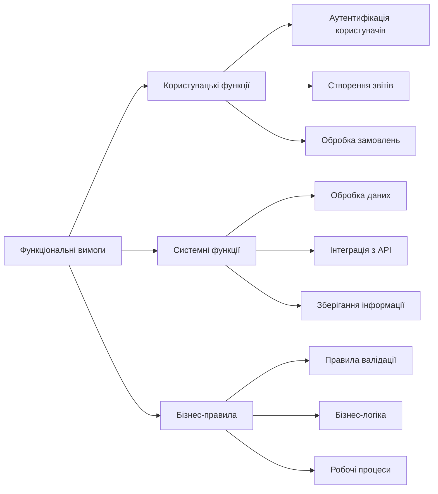

Функціональні вимоги описують, що система повинна робити. Вони визначають функції, які система має виконувати, послуги, які вона надає, та реакції на конкретні вхідні дані. Функціональні вимоги безпосередньо пов'язані з основним призначенням системи.

Функціональні вимоги можуть стосуватися обчислювальної функціональності, можливостей введення та виведення даних, перевірки даних або будь-яких інших специфічних функцій системи. Наприклад, для системи інтернет-магазину функціональними вимогами будуть можливість додавання товарів до кошика, оформлення замовлення, обробки платежів та відстеження статусу доставки.

Приклади функціональних вимог:

- Система повинна дозволяти користувачам реєструватися, вказуючи електронну пошту та пароль.
- Система повинна відправляти електронне повідомлення для підтвердження реєстрації.
- Система повинна дозволяти адміністраторам переглядати список усіх зареєстрованих користувачів.
- Система повинна автоматично блокувати обліковий запис після п'яти невдалих спроб входу.

### Нефункціональні вимоги

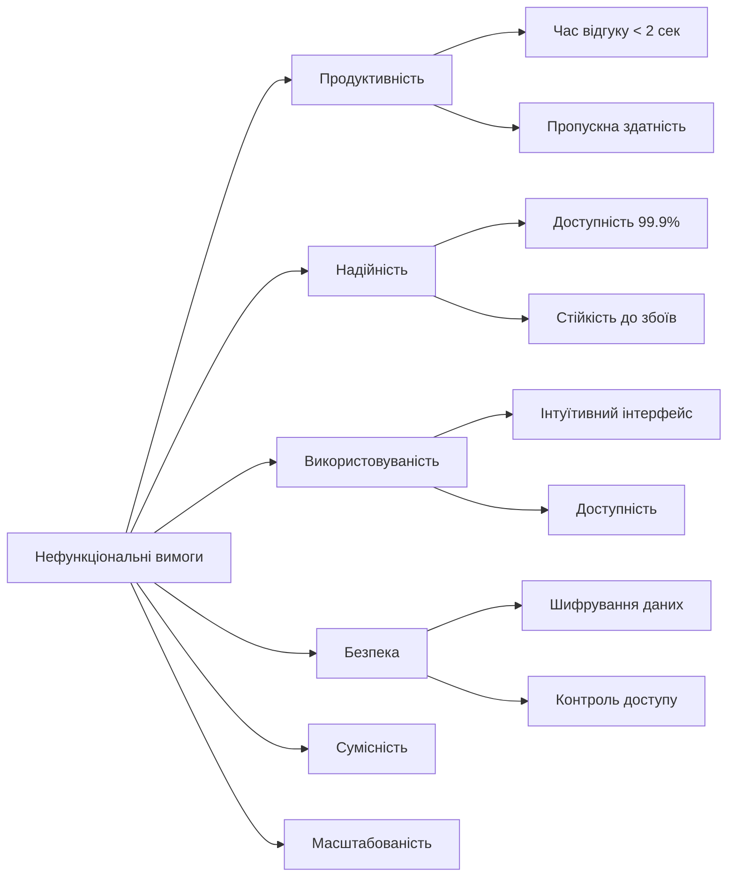

Нефункціональні вимоги описують не стільки що система робить, скільки як вона це робить. Вони визначають якісні характеристики системи та обмеження на її функціонування. Нефункціональні вимоги часто є критично важливими для успіху системи, оскільки вони визначають користувацький досвід та придатність системи для практичного використання.

**Продуктивність** включає вимоги до швидкості відгуку системи, пропускної здатності та ефективності використання ресурсів. Наприклад, вебдодаток може мати вимогу до того, що сторінка повинна завантажуватися менше ніж за 3 секунди.

**Надійність** охоплює вимоги до доступності системи, її здатності відновлюватися після збоїв та стабільності роботи. Критичні системи можуть мати вимоги до доступності 99.99% часу.

**Використовуваність** стосується зручності використання системи кінцевими користувачами. Це включає інтуїтивність інтерфейсу, простоту навчання роботі з системою та доступність для користувачів з особливими потребами.

**Безпека** включає вимоги до захисту даних, аутентифікації, авторизації та загального забезпечення конфіденційності та цілісності інформації.

Приклади нефункціональних вимог:

- Система повинна обробляти до 1000 одночасних користувачів без зниження продуктивності.
- Час відгуку на запити користувачів не повинен перевищувати 2 секунди в 95% випадків.
- Система повинна бути доступною 24/7 з максимальним часом простою 4 години на місяць.
- Усі паролі повинні зберігатися у зашифрованому вигляді.

### Користувацькі сценарії використання

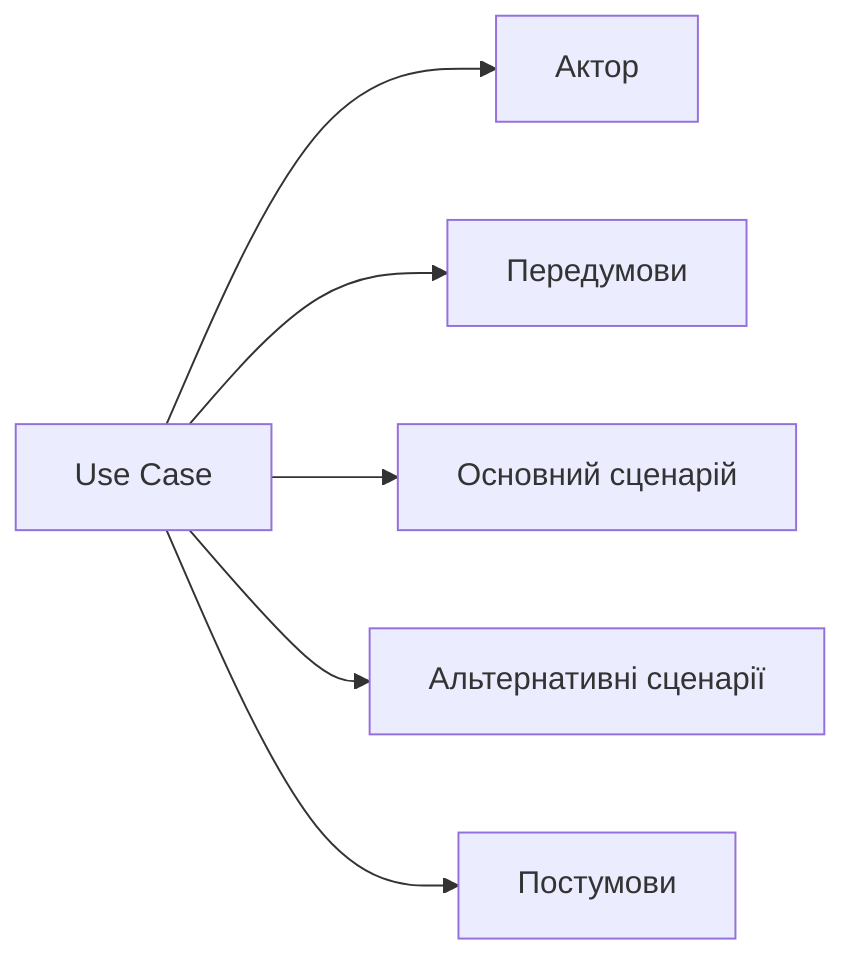

Сценарії використання (Use Cases) надають більш детальний опис взаємодії між користувачем та системою. Вони включають передумови, основний потік подій, альтернативні потоки та постумови. Сценарії використання особливо корисні для складних бізнес-процесів.

Приклад сценарію використання "Оформлення замовлення":

**Передумови:** Користувач аутентифікований, у кошику є товари.

**Основний сценарій:**

1. Користувач натискає "Оформити замовлення".
2. Система відображає форму з даними доставки.
3. Користувач заповнює або підтверджує адресу доставки.
4. Система відображає способи оплати.
5. Користувач обирає спосіб оплати.
6. Система обробляє платіж.
7. Система створює замовлення та відправляє підтвердження.

**Альтернативні сценарії:**

- Якщо платіж не проходить, система повідомляє про помилку.
- Якщо товару немає в наявності, система пропонує альтернативи.

## Процес збору вимог

### Підготовчий етап

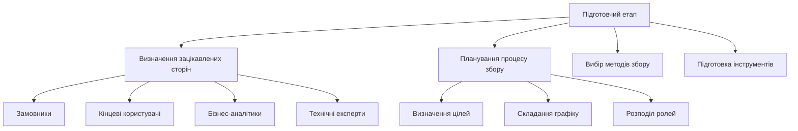

Успішний збір вимог починається з ретельної підготовки. Перш за все, необхідно ідентифікувати всіх зацікавлених сторін проєкту. До них належать не лише безпосередні замовники та кінцеві користувачі, а й адміністратори системи, служби підтримки, служби безпеки та інші групи, які можуть впливати на вимоги або на яких може вплинути майбутня система.

Кожна група зацікавлених сторін має свої унікальні потреби та точки зору на систему. Замовники зосереджуються на бізнес-цілях та повернені інвестицій, кінцеві користувачі турбуються про зручність використання, адміністратори думають про супровід та безпеку. Важливо зібрати представників усіх ключових груп для отримання повної картини вимог.

Планування процесу збору вимог включає визначення цілей, методів збору, графіку роботи та розподіл відповідальності між учасниками команди. Необхідно також підготувати інструменти для фіксації та організації зібраної інформації.

### Методи збору вимог

**Інтерв'ю** є одним з найефективніших методів збору детальної інформації про вимоги. Структуровані інтерв'ю проводяться за заздалегідь підготовленим планом з конкретними питаннями. Неструктуровані інтерв'ю дозволяють більш вільно досліджувати тему та виявляти неочікувані аспекти.

Підготовка до інтерв'ю включає:
- Визначення цілей та ключових питань.
- Ознайомлення з предметною областю.
- Планування тривалості та формату зустрічі.
- Підготовку засобів фіксації інформації.

Під час інтерв'ю важливо:
- Створити довірчу атмосферу.
- Задавати відкриті питання.
- Активно слухати та уточнювати незрозумілі моменти.
- Фіксувати не лише відповіді, а й контекст.

**Опитування** дозволяють зібрати інформацію від великої кількості респондентів за короткий час. Вони особливо ефективні для збору статистичних даних та виявлення загальних тенденцій. Анкети можуть містити закриті питання з варіантами відповідей для кількісного аналізу та відкриті питання для якісної інформації.

**Мозковий штурм** є груповим методом генерації ідей та виявлення вимог. Учасники вільно висловлюють свої ідеї без критики та оцінки. Це дозволяє виявити творчі рішення та неочевидні вимоги. Важливо забезпечити участь представників різних груп зацікавлених сторін.

**Спостереження** за роботою користувачів дає цінну інформацію про реальні процеси та потреби. Цей метод особливо корисний для виявлення неявних вимог та проблем, які користувачі можуть не усвідомлювати або не згадувати під час інтерв'ю.

**Аналіз документації** включає вивчення існуючих регламентів, інструкцій, звітів та іншої документації організації. Це допомагає зрозуміти поточні процеси та формальні вимоги.

### Робота з зацікавленими сторонами

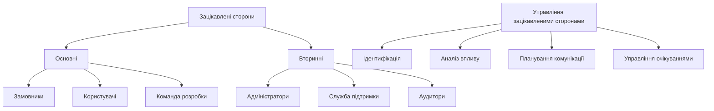

Ефективна робота з зацікавленими сторонами є ключовим фактором успіху проєкту. Різні групи можуть мати конфліктуючі інтереси та пріоритети, тому важливо вміти управляти цими відносинами.

Основні зацікавлені сторони мають безпосередній вплив на проєкт та високий інтерес до його результатів. Вторинні зацікавлені сторони можуть мати менший вплив, але їхні потреби також важливо враховувати.

Для кожної групи зацікавлених сторін необхідно:
- Визначити їхні основні інтереси та цілі.
- Зрозуміти їхню роль у проєкті.
- Обрати найефективніші методи комунікації.
- Регулярно інформувати про прогрес проєкту.

Управління очікуваннями включає чітке пояснення можливостей проєкту, обмежень та ризиків. Важливо встановити реалістичні очікування та регулярно їх корегувати відповідно до змін у проєкті.

## Аналіз та моделювання вимог

### Методи аналізу вимог

Після збору первинної інформації необхідно її проаналізувати, структурувати та перетворити на чіткі, зрозумілі вимоги. Аналіз вимог включає кілька ключових активностей.

**Класифікація вимог** допомагає організувати зібрану інформацію. Вимоги групуються за типом, пріоритетом, джерелом або функціональною областю. Це полегшує подальшу роботу з вимогами та їх відстеження.

**Пріоритизація вимог** визначає, які вимоги є найважливішими для успіху проєкту.

**Виявлення конфліктів** включає пошук суперечливих або взаємовиключних вимог. Конфлікти можуть виникати між вимогами різних груп зацікавлених сторін або між функціональними та нефункціональними вимогами.

**Аналіз залежностей** визначає зв'язки між вимогами. Деякі вимоги можуть залежати від інших або конфліктувати з ними. Розуміння цих залежностей важливе для планування розробки.

### Моделювання бізнес-процесів

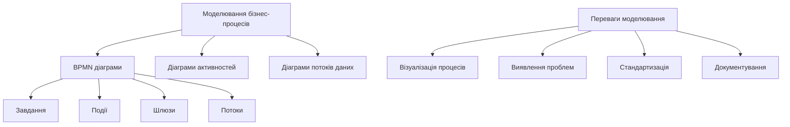

Моделювання бізнес-процесів допомагає зрозуміти, як працює організація, та визначити, як програмна система може покращити ці процеси. Візуальне представлення процесів робить їх зрозумілими для всіх зацікавлених сторін.

**BPMN (Business Process Model and Notation)** є стандартом для моделювання бізнес-процесів. BPMN використовує стандартизовані символи для представлення різних елементів процесу:

- Завдання — конкретні дії, які виконують учасники процесу.
- Події — моменти, які впливають на хід процесу.
- Шлюзи — точки прийняття рішень у процесі.
- Потоки — з'єднання між елементами процесу.

Приклад моделювання процесу обробки замовлення:

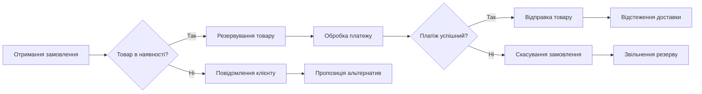

**Діаграми потоків даних** показують, як інформація рухається через систему. Вони допомагають зрозуміти, які дані потрібні для кожного процесу та як ці дані трансформуються.

**Діаграми активностей** зосереджуються на послідовності дій та логіці прийняття рішень. Вони корисні для моделювання алгоритмів та робочих процесів.

### Прототипування

Прототипування є потужним інструментом для валідації вимог та покращення розуміння між командою розробки та зацікавленими сторонами. Прототипи дозволяють "побачити" майбутню систему ще до початку повноцінної розробки.

**Типи прототипів:**

*Паперові прототипи* — найпростіший та найшвидший спосіб візуалізації ідей. Ескізи інтерфейсів на папері дозволяють швидко досліджувати різні варіанти дизайну.

*Цифрові mockup'и* створюються за допомогою спеціалізованих інструментів як Figma, Sketch або Adobe XD. Вони надають більш реалістичне уявлення про майбутній інтерфейс.

*Інтерактивні прототипи* дозволяють користувачам взаємодіяти з системою та тестувати основні сценарії використання. Такі прототипи можна створювати за допомогою інструментів як InVision, Marvel або навіть простих HTML/CSS макетів.

*Функціональні прототипи* реалізують частину функціональності системи. Вони корисні для перевірки технічної можливості реалізації складних вимог.

**Переваги прототипування:**

- Раннє виявлення проблем у вимогах.
- Покращення комунікації з зацікавленими сторонами.
- Зменшення ризиків неправильного розуміння.
- Можливість тестування ідей з користувачами.
- Зменшення вартості змін на пізніх етапах.

## Документування вимог

### Структура документа вимог

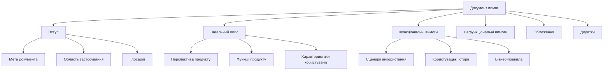

Документ вимог до програмного забезпечення (Software Requirements Specification, SRS) є основним артефактом процесу інженерії вимог. Він служить контрактом між замовником та командою розробки, основою для проєктування та планування, а також критерієм для приймання системи.

**Вступ** містить загальну інформацію про документ та проєкт:

- Мету створення документа та його аудиторію.
- Область застосування системи та її основні цілі.
- Глосарій термінів та скорочень.
- Посилання на пов'язані документи та стандарти.

**Загальний опис** надає високорівневий огляд системи:

- Перспективу продукту — як система вписується в більший контекст.
- Основні функції та можливості системи.
- Характеристики різних груп користувачів.
- Загальні обмеження та припущення.

**Функціональні вимоги** описують конкретні функції системи:

- Детальні сценарії використання з описом акторів, передумов, основних та альтернативних потоків.
- Користувацькі історії з критеріями приймання.
- Бізнес-правила та логіку обробки даних.
- Вимоги до інтерфейсів з іншими системами.

**Нефункціональні вимоги** визначають якісні характеристики:

- Вимоги до продуктивності з конкретними метриками.
- Вимоги до надійності та доступності.
- Вимоги до безпеки та конфіденційності.
- Вимоги до використовуваності та доступності.

### Атрибути якісних вимог

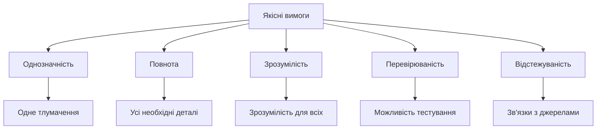

Якість вимог безпосередньо впливає на успіх проєкту. Погано написані вимоги призводять до неправильного розуміння, додаткових витрат та затримок у розробці.

**Однозначність** означає, що вимога має єдине можливе тлумачення. Двозначні формулювання призводять до різного розуміння вимоги різними учасниками проєкту. Слід уникати слів як "приблизно", "відповідно", "зручно", які можуть трактуватися по-різному.

Замість: "Система повинна швидко обробляти запити користувачів."
Краще: "Система повинна обробляти запити користувачів за час, що не перевищує 2 секунди в 95% випадків."

**Повнота** передбачає, що вимога містить всю необхідну інформацію для її реалізації. Неповні вимоги змушують розробників робити припущення, які можуть не відповідати очікуванням замовника.

**Зрозумілість** означає, що вимога написана простою, ясною мовою, зрозумілою для всіх зацікавлених сторін. Складні технічні терміни слід пояснювати або виносити в глосарій.

**Перевірюваність** передбачає можливість об'єктивно перевірити, чи виконана вимога. Для цього вимога повинна містити конкретні критерії або метрики.

**Відстежуваність** означає можливість простежити зв'язки вимоги з її джерелами, пов'язаними вимогами та елементами дизайну. Це допомагає управляти змінами та оцінювати вплив модифікацій.

### Управління змінами вимог

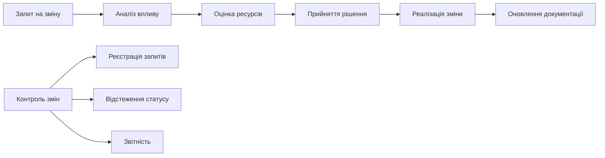

Вимоги неминуче змінюються протягом життєвого циклу проєкту. Ефективне управління цими змінами критично важливе для успіху проєкту. Неконтрольовані зміни можуть призвести до збільшення бюджету, затримок та зниження якості.

**Процес управління змінами** включає:

1. **Ідентифікація потреби у зміні** — виявлення нових вимог або необхідності модифікації існуючих.
2. **Формалізація запиту** — документування запропонованої зміни з описом причин та очікуваних результатів.
3. **Аналіз впливу** — оцінка того, як зміна вплине на інші вимоги, архітектуру, графік та бюджет проєкту.
4. **Оцінка ресурсів** — визначення часу, зусиль та коштів, необхідних для реалізації зміни.
5. **Прийняття рішення** — колегіальне рішення про схвалення, відхилення або відкладення зміни.
6. **Реалізація зміни** — внесення змін у вимоги, дизайн та код системи.
7. **Оновлення документації** — актуалізація всіх пов'язаних документів та моделей.

**Комітет з контролю змін** складається з представників ключових зацікавлених сторін та приймає рішення про затвердження змін. Це забезпечує балансування інтересів різних груп та запобігає прийняттю поспішних рішень.

**Базовий план вимог** встановлюється після завершення початкового аналізу вимог. Усі подальші зміни порівнюються з цим базовим планом, що дозволяє контролювати scope creep — неконтрольоване розширення проєкту.

## Інструменти для роботи з вимогами

### Програмні засоби управління вимогами

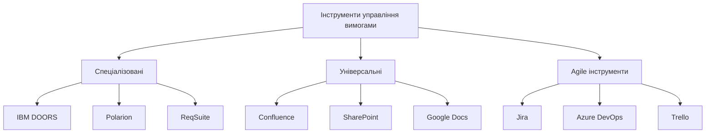

Вибір підходящих інструментів суттєво впливає на ефективність процесу управління вимогами. Різні інструменти підходять для різних типів проєктів та організацій.

**Спеціалізовані інструменти** призначені спеціально для управління вимогами та надають розширені можливості:

*IBM DOORS (Dynamic Object Oriented Requirements System)* є потужним enterprise-рішенням для управління вимогами у великих організаціях. Підтримує складну ієрархію вимог, відстеження змін, аналіз впливу та інтеграцію з іншими інструментами розробки.

*Polarion* поєднує управління вимогами з можливостями управління проєктами та тестування. Особливо популярний у галузях з високими вимогами до якості та регулювання.

*ReqSuite* надає інтуїтивний веб-інтерфейс для управління вимогами та підтримує collaborative роботу команди над вимогами.

**Універсальні інструменти** не призначені спеціально для вимог, але можуть ефективно використовуватися для їх документування:

*Confluence* дозволяє створювати структуровану документацію з можливостями коментування, версійності та інтеграції з Jira.

*Microsoft SharePoint* надає можливості документообігу та collaborative роботи в корпоративному середовищі.

*Google Docs* підходить для невеликих команд, які потребують простого інструменту для спільної роботи над документами.

**Agile інструменти** орієнтовані на роботу з користувацькими історіями та підтримку гнучких методологій:

*Jira* є стандартом для Agile команд, дозволяє управляти користувацькими історіями, епіками та спринтами.

*Azure DevOps* інтегрує управління вимогами з плануванням спринтів, контролем версій та CI/CD.

*Trello* надає простий канбан-інтерфейс для візуального управління вимогами та завданнями.

### Критерії вибору інструментів

Вибір інструменту залежить від кількох факторів:

**Розмір проєкту та команди:** Великі корпоративні проєкти потребують потужних інструментів з розширеними можливостями відстеження та звітності. Невеликі команди можуть обійтися простішими рішеннями.

**Складність вимог:** Проєкти з складними залежностями між вимогами та високими вимогами до трасабельності потребують спеціалізованих інструментів.

**Методологія розробки:** Agile команди віддають перевагу інструментам, що підтримують користувацькі історії та спринти. Waterfall проєкти можуть використовувати традиційні документо-орієнтовані інструменти.

**Інтеграція з іншими системами:** Важливо, щоб інструмент інтегрувався з існуючими системами управління проєктами, контролю версій та тестування.

**Бюджет:** Спеціалізовані інструменти можуть бути дорогими, особливо для великих команд. Необхідно оцінити співвідношення вартості та користі.

## Валідація та верифікація вимог

### Методи валідації вимог

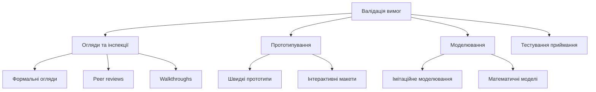

Валідація вимог перевіряє, чи відповідають вимоги реальним потребам зацікавлених сторін і чи можна на їх основі створити систему, яка вирішить поставлені проблеми. Верифікація перевіряє, чи відповідають вимоги встановленим стандартам якості.

**Огляди та інспекції** є систематичним процесом перевірки документів вимог:

*Формальні огляди* проводяться за чітко визначеною процедурою з участю експертів. Учасники попередньо ознайомлюються з документами та готують свої зауваження.

*Peer reviews* включають колегіальну перевірку вимог іншими аналітиками або членами команди.

*Walkthroughs* є менш формальними зустрічами, де автор вимог проводить команду через документ, пояснюючи логіку та отримуючи зворотний зв'язок.

**Прототипування** дозволяє зацікавленим сторонам "побачити" майбутню систему та оцінити, чи відповідають вимоги їхнім очікуванням. Особливо ефективно для валідації вимог до користувацького інтерфейсу.

**Моделювання** використовується для складних систем, де необхідно перевірити правильність алгоритмів або оцінити продуктивність. Імітаційне моделювання може показати, як система поводитиметься за різних умов навантаження.

### Критерії якості специфікації

Якісна специфікація вимог повинна відповідати наступним критеріям:

**Правильність:** Кожна вимога точно відображає потрібну функціональність або характеристику системи.

**Недвозначність:** Кожна вимога має лише одне можливе тлумачення.

**Повнота:** Специфікація включає всі необхідні вимоги для створення системи, яка задовольнить потреби користувачів.

**Консистентність:** Вимоги не суперечать одна одній та не містять внутрішніх конфліктів.

**Ранжування за важливістю:** Кожна вимога має визначений пріоритет або рівень важливості.

**Перевірюваність:** Для кожної вимоги існує скінченно-вартісний процес, за допомогою якого можна перевірити, чи задовольняє система цю вимогу.

**Модифікованість:** Структура специфікації дозволяє легко вносити зміни без впливу на інші вимоги.

**Відстежуваність:** Можна простежити походження кожної вимоги та її зв'язки з іншими вимогами та елементами дизайну.

## Agile підхід до управління вимогами

### Користувацькі історії в Agile

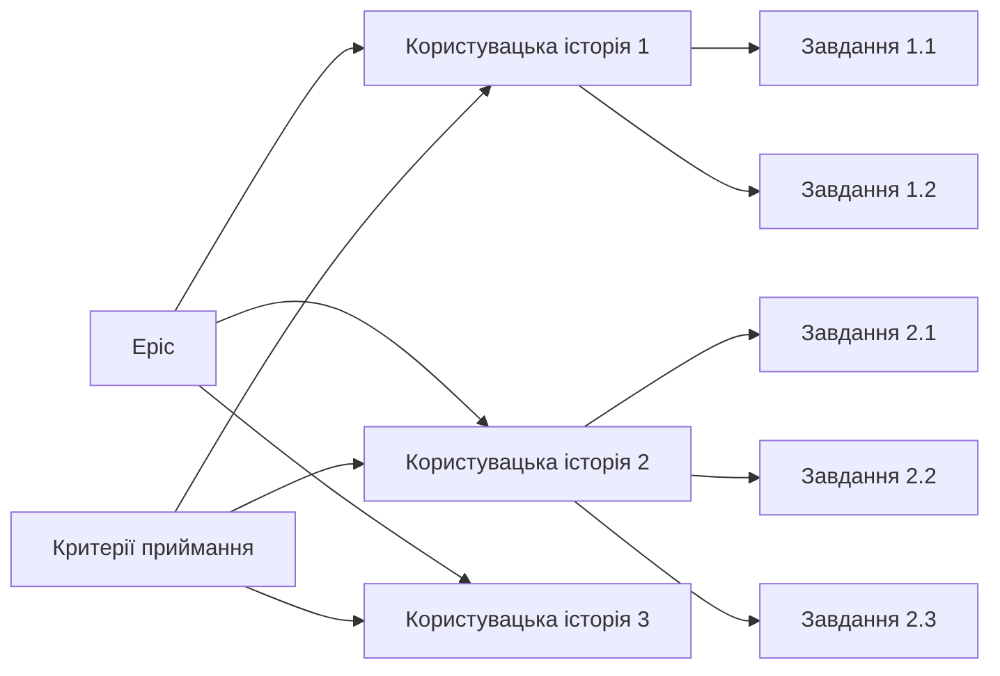

У гнучких методологіях розробки підхід до роботи з вимогами кардинально відрізняється від традиційного waterfall. Замість детальної специфікації на початку проєкту, Agile використовує концепцію "just enough" — достатньо деталей для початку роботи з можливістю уточнення в процесі розробки.

**Ієрархія вимог в Agile:**

*Epic* — великі функціональності, які можуть охоплювати кілька спринтів або релізів. Епіки описують високорівневі бізнес-цілі.

*Користувацькі історії* — конкретні функції, описані з точки зору користувача. Зазвичай реалізуються протягом одного спринту.

*Завдання* — технічні роботи, необхідні для реалізації користувацької історії.

**Формат користувацької історії:**
"Як [роль], я хочу [функціональність], щоб [бізнес-цінність]."

Приклад:
"Як користувач мобільного додатка банку, я хочу переглядати баланс рахунку, щоб контролювати свої фінанси."

**Критерії приймання** (Acceptance Criteria) визначають умови, за яких користувацька історія вважається виконаною. Вони написані у форматі Given-When-Then:

Given [початкові умови]
When [дія користувача]
Then [очікуваний результат]

Приклад критеріїв приймання:
```
Given користувач аутентифікований у додатку
When користувач натискає "Мій баланс"
Then система відображає поточний баланс усіх рахунків
And система показує дату останнього оновлення
```

### Product Backlog та його управління

Product Backlog є централізованим списком усіх відомих вимог до продукту, впорядкованих за пріоритетом. Він постійно еволюціонує протягом життя продукту.

**Характеристики якісного Product Backlog (DEEP):**

*Detailed appropriately* — елементи з високим пріоритетом детально проробленні, елементи з низьким пріоритетом описані загально.

*Emergent* — backlog постійно змінюється відповідно до нових знань та зворотного зв'язку.

*Estimated* — для елементів backlog є оцінки складності або трудозатрат.

*Prioritized* — елементи впорядковані за бізнес-цінністю та пріоритетом.

**Процес управління backlog включає:**

*Backlog Refinement* — регулярні зустрічі команди для деталізації, оцінки та пріоритизації елементів backlog.

*Story Mapping* — візуальна техніка організації користувацьких історій у вигляді карти користувацького шляху.

*Release Planning* — планування того, які функції будуть включені в наступні релізи.

### Definition of Ready та Definition of Done

**Definition of Ready (DoR)** визначає критерії готовності користувацької історії до включення в спринт:

- Історія написана у правильному форматі.
- Критерії приймання чітко визначені.
- Залежності ідентифіковані та вирішені.
- Історія оцінена командою.
- Є mockup'и інтерфейсу, якщо необхідно.

**Definition of Done (DoD)** визначає критерії завершеності роботи:

- Код написаний та відповідає стандартам.
- Unit тести написані та проходять.
- Код пройшов code review.
- Функціональність протестована.
- Документація оновлена.
- Історія задемонстрована Product Owner.

## Практичні поради та найкращі практики

### Поширені помилки при роботі з вимогами

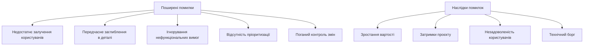

**Недостатнє залучення кінцевих користувачів** є однією з найпоширеніших причин невдач проєктів. Розробники та аналітики можуть робити припущення про потреби користувачів, які виявляються неправильними. Регулярна взаємодія з реальними користувачами протягом усього проєкту допомагає уникнути цієї проблеми.

**Передчасне заглиблення в технічні деталі** відволікає від розуміння бізнес-потреб. На ранніх етапах важливо зосередитися на "що" потрібно зробити, а не на "як" це реалізувати.

**Ігнорування нефункціональних вимог** може призвести до створення функціонально повної, але непридатної для використання системи. Продуктивність, безпека та зручність використання часто є критично важливими для успіху продукту.

**Відсутність чіткої пріоритизації** призводить до розподілення ресурсів між багатьма завданнями замість зосередження на найважливіших. Це знижує швидкість доставки цінності користувачам.

**Поганий контроль змін** дозволяє scope creep руйнувати плани проєкту. Кожна зміна повинна проходити через формальний процес оцінки та затвердження.

### Рекомендації для успішної роботи з вимогами

**Залучайте користувачів на всіх етапах:** Організуйте регулярні демонстрації, збирайте зворотний зв'язок та тестуйте прототипи з реальними користувачами.

**Використовуйте ітеративний підхід:** Не намагайтеся зібрати всі вимоги одразу. Починайте з найважливіших та поступово деталізуйте інші.

**Документуйте обґрунтування:** Записуйте не лише що потрібно зробити, а й чому. Це допомагає приймати правильні рішення при виникненні альтернатив.

**Інвестуйте в якість вимог:** Час, витрачений на написання якісних вимог, окупається багаторазово завдяки зменшенню переробок та помилок.

**Підтримуйте відстежуваність:** Забезпечте можливість простежити кожну вимогу від її джерела до реалізації в коді.

**Будьте готові до змін:** Створюйте процеси та інструменти, які дозволяють ефективно управляти змінами вимог.

### Метрики та показники

Для оцінки ефективності процесу роботи з вимогами можна використовувати наступні метрики:

**Стабільність вимог:** Відсоток вимог, які змінилися після базового плану. Висока нестабільність може вказувати на проблеми в процесі збору вимог.

**Покриття вимог тестами:** Відсоток вимог, для яких написані тести. Показує готовність до верифікації виконання вимог.

**Час на аналіз вимог:** Середній час від ідентифікації потреби до готової для розробки вимоги.

**Кількість дефектів, пов'язаних з вимогами:** Дефекти, причиною яких є неточні, неповні або відсутні вимоги.

**Задоволеність зацікавлених сторін:** Регулярні опитування про якість процесу збору та документування вимог.

## Висновки

Робота з вимогами є критично важливим процесом у розробці програмного забезпечення, який визначає успіх або невдачу всього проєкту. Якісні вимоги служать фундаментом для всіх подальших етапів розробки — від архітектурного проєктування до тестування та впровадження.

Ефективний процес роботи з вимогами включає систематичний збір інформації від усіх зацікавлених сторін, ретельний аналіз та моделювання бізнес-процесів, чітке документування вимог та управління змінами протягом життєвого циклу проєкту.

Сучасні гнучкі методології розробки не применшують важливості вимог, а пропонують більш адаптивний підхід до роботи з ними. Користувацькі історії, backlog management та continuous refinement дозволяють ефективно реагувати на зміни та доставляти цінність користувачам.

Використання відповідних інструментів та дотримання найкращих практик допомагає командам створювати якісні вимоги, які служать надійною основою для розробки успішних програмних продуктів.

## Питання для самоперевірки

1. У чому полягає різниця між функціональними та нефункціональними вимогами? Наведіть приклади кожного типу.
2. Які методи збору вимог найбільш ефективні для різних типів проєктів та зацікавлених сторін?
3. Як забезпечити якість вимог? Які атрибути характеризують добре написану вимогу?
4. Чому важливо управляти змінами вимог? Опишіть процес контролю змін.
5. Як відрізняється підхід до роботи з вимогами в Agile методологіях від традиційного waterfall?
6. Що таке користувацька історія? Як написати ефективні критерії приймання?
7. Які інструменти можна використовувати для управління вимогами? Як обрати підходящий інструмент?
8. Як валідувати та верифікувати вимоги? Які методи найбільш ефективні?
9. Які найпоширеніші помилки при роботі з вимогами? Як їх уникнути?
10. Як оцінити ефективність процесу роботи з вимогами? Які метрики можна використовувати?
