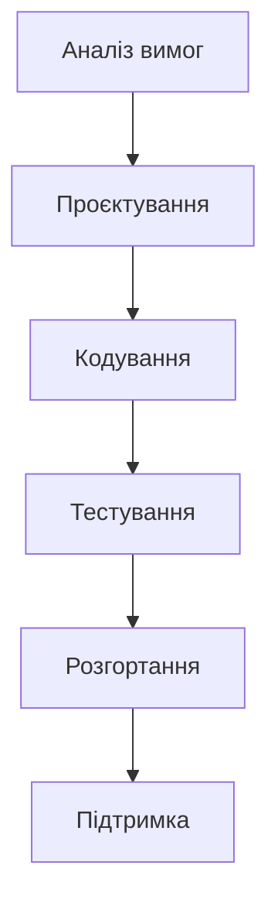
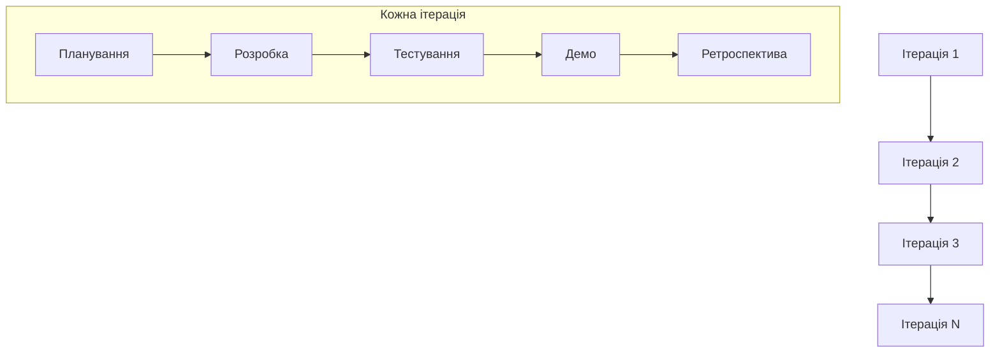
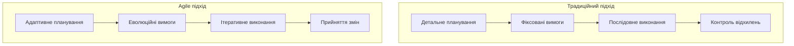
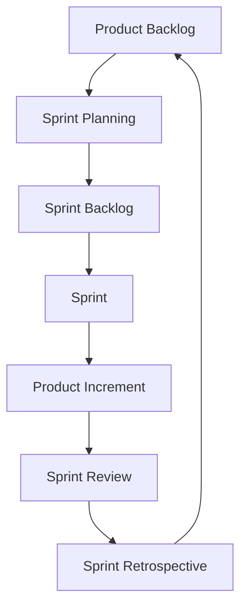
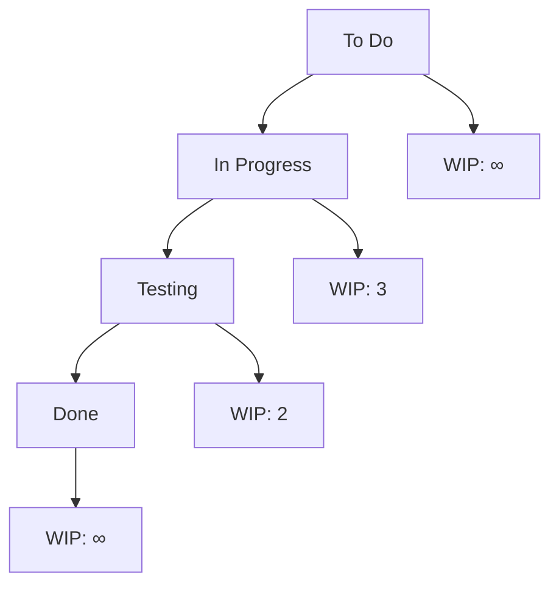
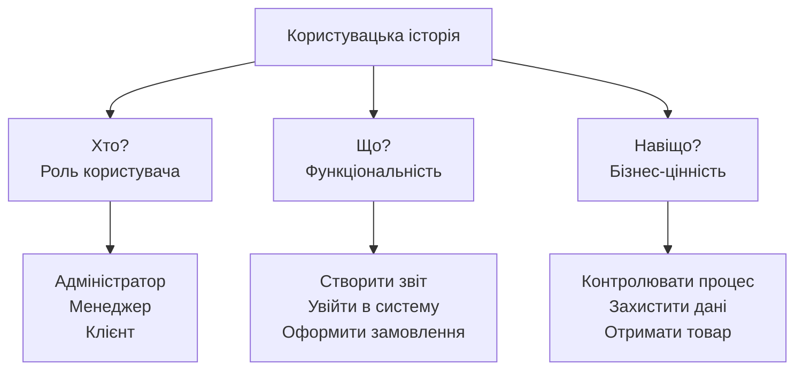
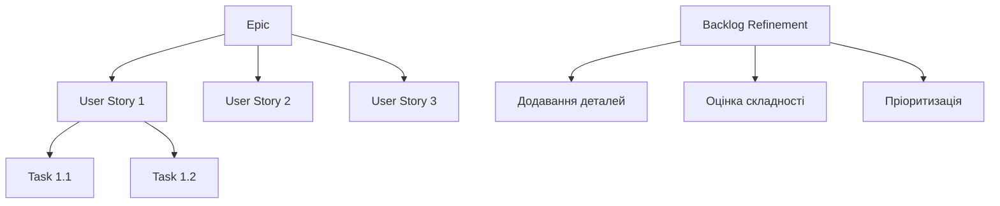
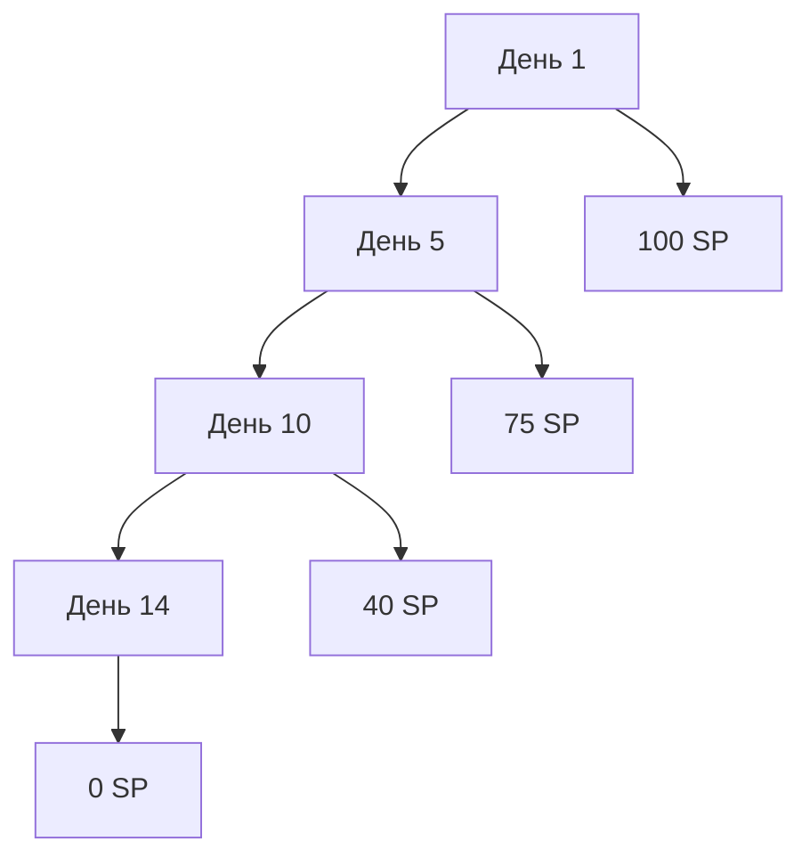

# Лекція 5. Гнучкі методології: Agile Manifesto та принципи

## Вступ

Гнучкі методології розробки програмного забезпечення виникли як відповідь на обмеження традиційних каскадних підходів до управління проєктами. У сучасному швидкозмінному технологічному середовищі здатність адаптуватися до змін та забезпечувати постійну цінність для замовника стала критично важливою для успіху програмних проєктів. Agile підходи фундаментально змінили спосіб думання про розробку програмного забезпечення, переносячи акцент з детального планування та документації на співпрацю, гнучкість та швидке реагування на зміни.

Розуміння принципів Agile є необхідним для сучасного інженера програмного забезпечення, оскільки ці методології застосовуються в більшості IT-компаній по всьому світу. Вони впливають не тільки на процеси розробки, а й на організаційну культуру, структуру команд та підходи до взаємодії з замовниками.

## Історичний контекст та передумови виникнення Agile

### Проблеми традиційних методологій

Традиційні каскадні методології розробки програмного забезпечення, що домінували в індустрії протягом десятиліть, базувалися на лінійному підході до планування та виконання проєктів. Ці методології успадкували принципи з інженерних та будівельних галузей, де зміни в процесі реалізації є дорогими та небажаними.

Каскадна модель передбачала, що всі вимоги можуть бути повністю визначені на початку проєкту, після чого проєктна команда послідовно проходить через етапи аналізу, проєктування, реалізації, тестування та розгортання. Кожен етап повинен бути повністю завершений перед переходом до наступного, а повернення до попередніх етапів розглядалося як ознака поганого планування.

Однак реальність програмної розробки виявилася значно складнішою за ці припущення. Програмне забезпечення є нематеріальним продуктом, що ускладнює точне передбачення всіх вимог на початку проєкту. Бізнес-потреби постійно змінюються під впливом ринкових умов, технологічних інновацій та зворотного зв'язку користувачів.

Основні проблеми каскадних методологій включали високий ризик невідповідності кінцевого продукту реальним потребам користувачів через довгий час між визначенням вимог та отриманням робочого програмного забезпечення. Зміни вимог на пізніх етапах проєкту коштували надзвичайно дорого та часто призводили до провалу всього проєкту. Відсутність регулярного зворотного зв'язку від замовників та кінцевих користувачів означала, що проблеми виявлялися тільки на етапі тестування або після розгортання.

Жорстка структура каскадних процесів погано пристосовувалася до інноваційної природи програмної розробки, де експериментування та ітеративне вдосконалення часто є ключовими для створення успішного продукту. Довгі цикли розробки означали, що конкуренти могли випередити проєкт, виводячи подібні рішення на ринок значно раніше.

### Еволюція підходів до розробки

Протягом 1990-х років різні команди розробників почали експериментувати з альтернативними підходами, що підкреслювали ітеративність, гнучкість та тісну співпрацю з замовниками. Ці підходи включали Rapid Application Development, Dynamic Systems Development Method, Scrum, Extreme Programming та інші методології, що пізніше стали відомими як гнучкі або Agile методології.

Спільними рисами цих підходів були коротші цикли розробки з регулярним постачанням робочого програмного забезпечення, активне залучення замовників протягом всього процесу розробки, адаптивність до змін замість жорсткого дотримання початкового плану, та акцент на людях та взаємодії як ключових факторах успіху проєкту.

Ці методології почали демонструвати кращі результати порівняно з традиційними підходами, особливо в проєктах з високим рівнем невизначеності та мінливими вимогами. Проте відсутність єдиного теоретичного фундаменту та спільних принципів ускладнювала їх систематичне застосування та поширення в індустрії.

## Agile Manifesto: народження руху

### Історія створення маніфесту

У лютому 2001 року сімнадцять видатних практиків програмної розробки зібралися на гірськолижному курорті Snowbird в штаті Юта, щоб обговорити альтернативи традиційним методологіям розробки програмного забезпечення. Серед учасників були автори та прихильники різних гнучких методологій, включаючи Кента Бека (Extreme Programming), Джеффа Сазерленда та Кена Швабера (Scrum), Алістера Кокберна (Crystal), Мартіна Фаулера та інших впливових фігур індустрії.

Метою зустрічі було знайти спільні принципи, які об'єднують різні гнучкі підходи, та створити альтернативу домінуючим на той час процесо-орієнтованим методологіям. Результатом цієї зустрічі став Agile Manifesto - короткий документ, що визначив фундаментальні цінності та принципи гнучкої розробки програмного забезпечення.

### Основні цінності Agile Manifesto

Agile Manifesto проголошує чотири основні цінності, що визначають пріоритети гнучкої розробки:

**Люди та взаємодія понад процеси та інструменти.** Ця цінність підкреслює, що успіх програмного проєкту залежить передусім від талановитих людей та їх здатності ефективно співпрацювати. Хоча процеси та інструменти важливі для підтримки роботи команди, вони не повинні замінювати людську творчість, експертизу та комунікацію. Гнучкі команди цінують прямий діалог, колаборацію та взаємну підтримку як основу для досягнення високих результатів.

**Робоче програмне забезпечення понад вичерпну документацію.** Першочерговою метою будь-якого програмного проєкту є створення функціонального програмного забезпечення, що вирішує реальні проблеми користувачів. Хоча документація залишається важливою, особливо для складних систем, вона не повинна ставати самоціллю або перешкодою для швидкого постачання цінності. Agile команди зосереджуються на створенні мінімально необхідної документації, що підтримує розробку та використання продукту.

**Співпраця з замовником понад переговори щодо контракту.** Традиційний підхід до управління проєктами часто створює антагоністичні відносини між розробниками та замовниками, де кожна сторона намагається захистити свої інтереси через детальні контракти. Agile підкреслює важливість партнерських відносин, де замовник розглядається як член розширеної команди проєкту. Регулярна взаємодія, спільне планування та взаємна довіра створюють основу для успішного досягнення бізнес-цілей.

**Реагування на зміни понад дотримання плану.** У швидко мінливому бізнес-середовищі здатність адаптуватися до нових обставин часто є важливішою за точне виконання початкового плану. Agile команди розглядають зміни не як перешкоди, а як можливості для покращення продукту та краще задоволення потреб користувачів. Ітеративний підхід до планування дозволяє регулярно переоцінювати пріоритети та корегувати напрямок розвитку проєкту.

Важливо розуміти, що ці цінності не заперечують важливості елементів у правій частині кожного твердження. Процеси, документація, контракти та планування залишаються необхідними компонентами успішної розробки. Маніфест лише встановлює пріоритети, вказуючи, що елементи в лівій частині повинні цінуватися більше за умов конфлікту або необхідності вибору.

### Дванадцять принципів Agile

Поряд з основними цінностями, Agile Manifesto включає дванадцять принципів, що деталізують практичне застосування гнучкого підходу:

**Найвищий пріоритет - задоволення замовника через раннє та постійне постачання цінного програмного забезпечення.** Цей принцип встановлює створення цінності для замовника як головну мету всіх зусиль команди. Раннє постачання означає, що користувачі отримують доступ до корисної функціональності якомога швидше, а не чекають завершення всього проєкту.

**Приймайте зміни вимог, навіть на пізніх стадіях розробки. Agile процеси використовують зміни для конкурентної переваги замовника.** Замість того щоб розглядати зміни як проблему, Agile команди вбачають у них можливість створити кращий продукт, що більше відповідає ринковим потребам.

**Постачайте робоче програмне забезпечення часто, з періодичністю від кількох тижнів до кількох місяців, надаючи перевагу коротшим термінам.** Регулярні релізи дозволяють отримувати зворотний зв'язок від користувачів, виявляти проблеми на ранніх стадіях та демонструвати прогрес стейкхолдерам.

**Представники бізнесу та розробники повинні працювати разом щодня протягом всього проєкту.** Постійна комунікація між технічною командою та бізнес-стороною забезпечує правильне розуміння вимог та швидке вирішення виникаючих питань.

**Будуйте проєкти навколо мотивованих людей. Надайте їм середовище та підтримку, яких вони потребують, і довіряйте їм виконати роботу.** Цей принцип підкреслює важливість створення умов для самоорганізації та професійного розвитку членів команди.

**Найефективніший та найкращий метод передачі інформації команді розробників - це розмова віч-на-віч.** Незважаючи на розвиток цифрових технологій комунікації, особиста взаємодія залишається найбагатшим каналом для передачі складної інформації та налагодження довіри.

**Робоче програмне забезпечення - основний показник прогресу.** На відміну від традиційних метрик, таких як відсоток завершених завдань або кількість написаних рядків коду, Agile оцінює прогрес через функціональність, що реально працює та приносить цінність.

**Agile процеси сприяють сталому розвитку. Спонсори, розробники та користувачі повинні мати можливість підтримувати постійний темп роботи.** Довгострокова продуктивність команди важливіша за короткочасні спринти, що можуть призвести до професійного вигорання.

**Постійна увага до технічної досконалості та гарного дизайну покращує гнучкість.** Інвестування в якість коду та архітектури створює основу для майбутньої адаптивності та розширюваності системи.

**Простота - мистецтво максимізації обсягу невиконаної роботи - є суттєвою.** Цей принцип закликає до фокусування на найважливіших функціях та уникнення надмірної складності.

**Найкращі архітектури, вимоги та дизайни виникають із самоорганізованих команд.** Команди, що мають свободу приймати технічні рішення, часто створюють більш інноваційні та ефективні рішення.

**Через регулярні інтервали команда міркує про те, як стати більш ефективною, після чого налаштовує та коригує свою поведінку відповідно.** Принцип постійного вдосконалення забезпечує еволюцію процесів та практик команди відповідно до накопиченого досвіду.

## Основні концепції та практики Agile

### Ітеративна та інкрементальна розробка

Серцем Agile підходу є ітеративна та інкрементальна розробка - процес, що розбиває великий проєкт на серію коротких циклів розробки, званих ітераціями або спринтами. Кожна ітерація представляє повний мінізований цикл розробки програмного забезпечення, що включає планування, аналіз, проєктування, кодування, тестування та демонстрацію результатів.

Ітеративний характер означає, що команда повторює одні й ті ж процеси протягом кожного циклу, постійно вдосконалюючи свій підхід на основі отриманого досвіду. Інкрементальний аспект гарантує, що кожна ітерація додає нову функціональність до продукту, створюючи робоче програмне забезпечення, що може бути продемонстровано та навіть використано кінцевими користувачами.

Переваги цього підходу включають раннє виявлення ризиків та проблем через регулярне тестування та демонстрацію результатів. Замовники отримують можливість побачити прогрес проєкту та надати зворотний зв'язок значно раніше, ніж у традиційних методологіях. Команда може адаптувати свій підхід та пріоритети на основі вивченого досвіду та змін у бізнес-потребах.

Типова тривалість ітерації складає від одного до чотирьох тижнів, причому багато команд надають перевагу двотижневим спринтам як оптимальному балансу між достатнім часом для досягнення значимих результатів та достатньою частотою для швидкого реагування на зміни.

### Командна співпраця та самоорганізація

Agile команди характеризуються високим рівнем співпраці та здатністю до самоорганізації. На відміну від традиційних ієрархічних структур, де рішення приймаються менеджментом та передаються вниз по ланцюгу команд, Agile команди наділяються правом та відповідальністю за прийняття рішень щодо того, як виконувати свою роботу.

Самоорганізована команда включає всі необхідні навички та експертизу для виконання поставлених завдань без постійного зовнішнього керівництва. Члени команди спільно планують роботу, розподіляють завдання між собою та несуть колективну відповідальність за досягнення цілей спринту.

Ключовими характеристиками ефективної Agile команди є кроссфункціональність, що означає наявність у команді всіх необхідних ролей та навичок для створення готового продукту. Це може включати розробників, тестувальників, дизайнерів, аналітиків та інших спеціалістів. Невеликий розмір команди, зазвичай від 5 до 9 людей, забезпечує ефективну комунікацію та координацію без надмірних накладних витрат на управління.

Спільне розташування команди або, у випадку віддалених команд, регулярна синхронна взаємодія створює умови для швидкого обміну інформацією та колективного вирішення проблем. Культура довіри та відкритості дозволяє членам команди вільно ділитися ідеями, визнавати помилки та запитувати допомогу при необхідності.

### Фокус на цінності для замовника

Центральним елементом Agile філософії є постійний фокус на створенні цінності для замовника. Це означає, що всі рішення та дії команди оцінюються через призму їх впливу на задоволення потреб кінцевих користувачів та досягнення бізнес-цілей замовника.

Концепція цінності в Agile контексті виходить за рамки простого додавання нових функцій. Цінність може створюватися через покращення користувацького досвіду, підвищення продуктивності системи, зменшення ризиків безпеки або спрощення складних процесів. Важливо, що визначення того, що є цінним, здійснюється у тісній співпраці з замовником та на основі реального зворотного зв'язку від користувачів.

Для забезпечення фокусу на цінності Agile команди використовують техніки пріоритизації, такі як MoSCoW (Must have, Should have, Could have, Won't have) або техніки оцінки бізнес-цінності. Product Owner відіграє ключову роль у визначенні та комунікації пріоритетів, забезпечуючи, що команда працює над найважливішими функціями.

Регулярні демонстрації та збір зворотного зв'язку дозволяють валідувати припущення про цінність та корегувати напрямок розвитку продукту. Метрики, що фокусуються на користувацькому досвіді та бізнес-результатах, використовуються для оцінки успіху замість традиційних технічних метрик.

## Порівняння Agile з традиційними методологіями

### Фундаментальні відмінності у підходах

Основні відмінності між Agile та традиційними методологіями простягаються через усі аспекти управління проєктами та розробки програмного забезпечення. Ці відмінності відображають різні філософські підходи до управління невизначеністю, ризиками та змінами.

У традиційних методологіях планування розглядається як основа успіху проєкту. Детальні плани створюються на початку проєкту та служать основою для контролю прогресу та управління ресурсами. Зміни в планах розглядаються як відхилення, що потребують формального процесу управління змінами та часто призводять до збільшення бюджету та термінів.

Agile підхід розглядає планування як постійний процес адаптації до нових знань та обставин. Плани створюються на різних рівнях деталізації - від високорівневого бачення продукту до детальних планів поточного спринту. Зміни розглядаються як природна частина процесу розробки, що відображає кращий розуміння потреб користувачів та технічних можливостей.

### Управління ризиками

Традиційні методології намагаються мінімізувати ризики через ретельне попереднє планування та створення детальної документації. Припущення полягає в тому, що більшість ризиків можна передбачити та запобігти їм через правильне планування. Коли ризики все ж реалізуються, це часто призводить до значних затримок та перевитрат бюджету.

Agile підхід визнає невід'ємну невизначеність програмної розробки та використовує ітеративний процес для раннього виявлення та мітигації ризиків. Короткі цикли розробки дозволяють швидко виявляти проблеми, а регулярний зворотний зв'язок від користувачів зменшує ризик створення непотрібної функціональності.

Технічні ризики мітигуються через практики, такі як безперервна інтеграція, автоматизоване тестування та рефакторинг. Бізнес-ризики зменшуються через тісну співпрацю з замовником та раннє постачання робочого програмного забезпечення.

### Якість та тестування

У традиційних методологіях тестування часто розглядається як окремий етап, що виконується після завершення розробки. Це може призводити до виявлення критичних дефектів на пізніх стадіях проєкту, коли їх виправлення є дорогим та часозатратним.

Agile інтегрує забезпечення якості в повсякденні практики розробки. Техніки, такі як Test-Driven Development, постійна інтеграція та автоматизоване тестування, забезпечують виявлення дефектів на ранніх стадіях, коли їх виправлення є швидким та недорогим.

Парне програмування та регулярні огляди коду сприяють підвищенню якості коду та розповсюдженню знань у команді. Акцент на робочому програмному забезпеченні означає, що функціональність тестується та валідується на кожній ітерації.

## Популярні Agile фреймворки

### Scrum

Scrum є найпоширенішим Agile фреймворком, що надає структуровану основу для впровадження гнучких принципів. Розроблений Кеном Швабером та Джеффом Сазерлендом у 1990-х роках, Scrum визначає ролі, події та артефакти для ефективної командної роботи.

Основні ролі в Scrum включають Product Owner, що відповідає за визначення та пріоритизацію вимог, Scrum Master, що фасилітує процес та допомагає команді дотримуватися Scrum принципів, та Development Team, що відповідає за створення продукту.

Scrum використовує часові блоки, звані спринтами, зазвичай тривалістю від одного до чотирьох тижнів. Кожен спринт починається з Sprint Planning, де команда вибирає завдання з Product Backlog та створює Sprint Backlog. Щоденні Scrum зустрічі забезпечують синхронізацію команди та виявлення перешкод.

Sprint Review дозволяє продемонструвати створену функціональність стейкхолдерам та отримати зворотний зв'язок. Sprint Retrospective надає команді можливість проаналізувати свою роботу та визначити покращення для наступного спринту.

### Kanban

Kanban походить з виробничої системи Toyota та був адаптований для розробки програмного забезпечення як альтернатива часовим спринтам Scrum. Основна ідея Kanban полягає в візуалізації робочого процесу та обмеженні кількості завдань у кожному стані одночасно.

Kanban дошка візуалізує поток роботи через різні стадії, від початкових ідей до завершених завдань. Work in Progress (WIP) ліміти запобігають перевантаженню команди та допомагають виявляти вузькі місця в процесі.

На відміну від Scrum, Kanban не використовує фіксовані часові рамки, дозволяючи команді працювати в безперервному потоці. Це робить Kanban особливо придатним для підтримки існуючих систем або проєктів з непередбачуваним потоком вимог.

Ключові принципи Kanban включають візуалізацію роботи, обмеження WIP, управління потоком та постійне вдосконалення. Метрики, такі як час циклу та пропускна здатність, використовуються для оптимізації процесу.

### Extreme Programming (XP)

Extreme Programming, розроблене Кентом Беком, фокусується на технічних практиках для забезпечення високої якості коду та здатності до швидких змін. XP отримало свою назву через те, що воно доводить до крайності добре відомі практики програмування.

Основні практики XP включають парне програмування, де два розробники працюють разом над одним завданням, Test-Driven Development, де тести пишуться перед кодом, безперервну інтеграцію для раннього виявлення конфліктів, та рефакторинг для постійного покращення дизайну коду.

Планування в XP базується на користувацьких історіях, що описують функціональність з перспективи кінцевого користувача. Короткі релізи забезпечують регулярне постачання цінності замовнику. Простий дизайн підкреслює важливість мінімалізму та уникнення передчасної оптимізації.

XP також включає практики, орієнтовані на замовника, такі як планувальна гра для спільного визначення пріоритетів та обсягу роботи, присутність замовника в команді для швидкого отримання зворотного зв'язку, та прийняттєві тести для валідації функціональності з бізнес-перспективи.

## Користувацькі історії та управління вимогами

### Концепція користувацьких історій

Користувацькі історії є фундаментальним інструментом Agile для опису функціональних вимог з перспективи кінцевого користувача. На відміну від традиційних детальних специфікацій вимог, користувацькі історії є короткими, зрозумілими описами функціональності, що фокусуються на цінності для користувача, а не на технічних деталях реалізації.

Стандартний формат користувацької історії включає три ключові елементи: як [роль користувача], я хочу [функціональність], щоб [бізнес-цінність]. Цей формат забезпечує фокус на користувачі, чіткий опис потрібної функціональності та обґрунтування необхідності цієї функції.

Переваги користувацьких історій включають простоту розуміння для всіх стейкхолдерів, включаючи нетехнічних користувачів, гнучкість у деталізації залежно від етапу розробки, та природний фокус на цінності для кінцевого користувача. Історії служать основою для планування, оцінки та обговорення вимог між командою та замовником.

### Критерії прийняття та Definition of Done

Кожна користувацька історія повинна включати критерії прийняття - конкретні, тестовані умови, що визначають, коли історія вважається завершеною. Критерії прийняття служать основою для розробки тестів та забезпечують спільне розуміння очікуваної функціональності між усіма членами команди.

Ефективні критерії прийняття характеризуються специфічністю та тестованістю, покриттям як позитивних, так і негативних сценаріїв, та фокусом на поведінці системи, а не на технічній реалізації. Вони часто формулюються у форматі Given-When-Then, що підкреслює контекст, дію та очікуваний результат.

Definition of Done є командним стандартом якості, що визначає загальні критерії для завершення будь-якої роботи. На відміну від специфічних критеріїв прийняття окремої історії, Definition of Done включає загальні вимоги, такі як покриття тестами, оглядів коду, документування та готовність до розгортання.

### Управління Product Backlog

Product Backlog є впорядкованим списком всіх відомих вимог до продукту, включаючи функціональні можливості, покращення, виправлення дефектів та технічні завдання. Backlog служить єдиним джерелом правди для всіх робіт, що мають бути виконані в продукті.

Управління backlog включає постійну діяльність з додавання нових елементів, уточнення існуючих історій, оцінки складності та пріоритизації відповідно до бізнес-цінності. Product Owner несе відповідальність за backlog, але вся команда бере участь у процесі уточнення деталей.

Ефективний backlog характеризується детальністю для найближчих елементів та загальністю для віддалених елементів, оцінками розміру для планування, та регулярним оновленням відповідно до зворотного зв'язку та зміни пріоритетів.

## Планування в Agile

### Рівні планування

Agile використовує багаторівневий підхід до планування, що дозволяє балансувати між довгостроковим баченням та гнучкістю у короткострокових рішеннях. Кожен рівень планування має свій часовий горизонт та рівень деталізації.

Стратегічне планування фокусується на довгостроковому баченні продукту та може охоплювати період від 6 місяців до кількох років. На цьому рівні визначаються основні цілі продукту, цільова аудиторія та ключові функціональні блоки. Планування є високорівневим та може включати епіки та тематичні блоки функціональності.

Планування релізу охоплює період від 2 до 6 місяців та фокусується на визначенні того, які функції будуть включені в наступний великий реліз продукту. Цей рівень планування включає координацію між командами, управління залежностями та планування ресурсів.

Планування ітерації або спринту є найдетальнішим рівнем та охоплює 1-4 тижні. На цьому рівні команда вибирає конкретні користувацькі історії для реалізації та розбиває їх на технічні завдання. Планування включає оцінку зусиль та визначення того, як буде виконана робота.

### Оцінка в Agile

Agile команди використовують відносні методи оцінки, що фокусуються на порівнянні складності завдань між собою, а не на абсолютних часових оцінках. Цей підхід визнає складність точного передбачення часу виконання знаннєвої роботи.

Planning Poker є популярною технікою оцінки, де кожен член команди незалежно оцінює складність користувацької історії, використовуючи модифіковану послідовність Фібоначчі. Після розкриття оцінок команда обговорює розбіжності та приходить до консенсусу.

Story Points є відносною одиницею виміру, що враховує складність, обсяг роботи та невизначеність завдання. Команди використовують власну шкалу та калібрують її через досвід виконання попередніх завдань.

Velocity - швидкість команди - вимірюється як кількість story points, що команда завершує за спринт. Ця метрика використовується для планування майбутніх спринтів та прогнозування термінів доставки функціональності.

### Адаптивне планування

Одним з ключових принципів Agile є визнання того, що плани повинні адаптуватися до нових знань та змін в обставинах. Адаптивне планування передбачає регулярний перегляд та корекцію планів на всіх рівнях.

Кожен спринт надає нову інформацію про продуктивність команди, складність завдань та потреби користувачів. Ця інформація використовується для корекції майбутніх планів та покращення точності прогнозів.

Rolling wave planning є технікою, де детальні плани створюються тільки для найближчого періоду, а довгострокові плани залишаються на високому рівні. По мірі наближення до майбутніх періодів плани деталізуються на основі накопиченого досвіду.

## Метрики та вимірювання в Agile

### Основні Agile метрики

Agile команди використовують метрики для вимірювання продуктивності, якості та прогресу, але з акцентом на покращення процесу, а не на контролі. Ефективні метрики надають actionable insights та підтримують культуру постійного вдосконалення.

Velocity вимірює кількість роботи, яку команда завершує за спринт, зазвичай в story points. Ця метрика допомагає в плануванні майбутніх спринтів та прогнозуванні термінів доставки. Важливо розуміти, що velocity є специфічною для кожної команди та не повинна використовуватися для порівняння між командами.

Burndown charts візуалізують прогрес команди протягом спринту, показуючи, скільки роботи залишається виконати. Sprint burndown chart допомагає команді відстежувати, чи встигне вона завершити заплановану роботу до кінця спринту.

Cycle Time вимірює час від початку роботи над завданням до його завершення. Цю метрику часто використовують Kanban команди для оптимізації процесу та виявлення вузьких місць.

Lead Time вимірює час від моменту, коли вимога була висунута, до моменту доставки функціональності користувачу. Ця метрика важлива для розуміння повного циклу створення цінності.

### Метрики якості

Code Coverage показує відсоток коду, що покритий автоматизованими тестами. Хоча висока покриття не гарантує відсутність дефектів, воно є індикатором того, що команда інвестує в якість коду.

Defect Density вимірює кількість дефектів на одиницю коду або функціональності. Тренд цієї метрики допомагає оцінити, чи покращується якість продукту з часом.

Customer Satisfaction може вимірюватися через опитування користувачів, Net Promoter Score або аналіз використання функцій. Ця метрика безпосередньо пов'язана з основною метою Agile - створенням цінності для замовника.

### Використання метрик для покращення

Важливим принципом використання метрик в Agile є їх спрямованість на покращення процесу, а не на оцінку або контроль індивідуальної продуктивності. Метрики повинні стимулювати співпрацю та експериментування, а не конкуренцію між членами команди.

Ретроспективні зустрічі надають контекст для аналізу метрик та визначення дій для покращення. Команди аналізують тренди, виявляють аномалії та експериментують з новими підходами для досягнення кращих результатів.

Важливо уникати ігрових механізмів, коли команди оптимізують метрики за рахунок реальних цілей. Наприклад, фокус тільки на velocity може призвести до завищення оцінок або зниження якості коду.

## Культурні аспекти та трансформація

### Зміна організаційної культури

Впровадження Agile методологій потребує глибокої зміни організаційної культури, що виходить далеко за рамки простого впровадження нових процесів та інструментів. Культурна трансформація часто є найскладнішим аспектом Agile впровадження, оскільки вона вимагає зміни ментальності, цінностей та поведінкових паттернів.

Традиційні організації часто характеризуються ієрархічними структурами прийняття рішень, де інформація та повноваження концентруються на вищих рівнях управління. Agile підхід вимагає розподілу повноважень та створення автономних команд, що можуть швидко приймати рішення в межах своїх компетенцій.

Культура довіри є фундаментальною для успішного Agile впровадження. Менеджмент повинен довіряти командам у прийнятті технічних рішень та виборі способів виконання роботи. Водночас команди повинні довіряти одна одній та бути готовими ділитися знаннями і підтримувати колег.

Відкритість до експериментування та прийняття невдач як частини процесу навчання також є критично важливою. Agile команди повинні мати можливість пробувати нові підходи, навіть якщо вони не завжди призводять до успіху.

### Управління змінами

Успішна Agile трансформація вимагає системного підходу до управління змінами, що враховує як технічні, так і людські аспекти. Зміни повинні бути поступовими та підтримуватися на всіх рівнях організації.

Leadership commitment є необхідною умовою для успішної трансформації. Керівництво повинно не тільки підтримувати зміни на словах, а й демонструвати нову поведінку та інвестувати ресурси в навчання та розвиток команд.

Навчання та коучинг допомагають співробітникам розвивати нові навички та адаптуватися до нових способів роботи. Agile коучі можуть надавати підтримку командам у засвоєнні нових практик та вирішенні виникаючих проблем.

Change agents - співробітники, що активно підтримують та просувають зміни - відіграють ключову роль у поширенні нової культури та практик по всій організації.

### Виклики впровадження

Опір змінам є природною реакцією людей на порушення звичних способів роботи. Цей опір може проявлятися на різних рівнях - від індивідуального скептицизму до організаційної інерції. Розуміння причин опору та його активна адресація є важливою частиною процесу трансформації.

Масштабування Agile за межі окремих команд створює додаткові виклики, пов'язані з координацією між командами, управлінням залежностями та підтриманням узгодженості архітектури. Frameworks такі як SAFe, LeSS або Spotify Model надають структури для масштабування Agile.

Інтеграція з існуючими системами та процесами може створювати конфлікти між Agile принципами та встановленими організаційними практиками. Важливо знаходити баланс між адаптацією до існуючих обмежень та проведенням необхідних змін.

## Майбутнє Agile

### Еволюція методологій

Agile методології продовжують еволюціонувати відповідно до змін у технологічному ландшафті та бізнес-потребах. Нові підходи інтегрують принципи Agile з іншими дисциплінами та адаптують їх до специфічних контекстів.

DevOps представляє природне розширення Agile принципів на операційну діяльність, інтегруючи розробку та управління інфраструктурою в єдиний процес. Continuous Delivery та Infrastructure as Code дозволяють командам швидко та надійно доставляти зміни в production.

Design Thinking та User Experience дизайн все більше інтегруються з Agile процесами, забезпечуючи фокус на потребах користувачів та створенні інтуїтивних інтерфейсів.

Lean Startup підхід поєднує Agile розробку з експериментальним підходом до валідації бізнес-гіпотез, дозволяючи командам швидко тестувати ідеї та адаптувати продукт відповідно до ринкових потреб.

### Agile в нових контекстах

Принципи Agile знаходять застосування далеко за межами розробки програмного забезпечення. Маркетингові команди використовують Agile для швидкого тестування кампаній та адаптації стратегій. HR департаменти впроваджують гнучкі підходи до управління талантами та організаційного розвитку.

Освітні заклади експериментують з Agile підходами до навчання, створюючи більш інтерактивні та адаптивні навчальні програми. Навіть в традиційних галузях, таких як виробництво та будівництво, принципи гнучкості та постійного вдосконалення знаходять своє застосування.

Віддалена робота та розподілені команди створюють нові виклики та можливості для Agile практик. Цифрові інструменти для співпраці дозволяють командам підтримувати Agile принципи навіть при роботі в різних часових зонах та локаціях.

## Висновки

Agile Manifesto та гнучкі методології представляють фундаментальний зсув у підході до розробки програмного забезпечення, що відображає зміну від індустріальної до інформаційної епохи. Основні цінності Agile - фокус на людях, робочому програмному забезпеченні, співпраці з замовником та реагуванні на зміни - залишаються актуальними та важливими в сучасному технологічному середовищі.

Успішне впровадження Agile вимагає більше, ніж просте застосування нових процесів та інструментів. Воно потребує глибокої культурної трансформації, що включає зміну ментальності, цінностей та способів взаємодії. Організації, що успішно впроваджують Agile, часто демонструють кращу адаптивність, вищу задоволеність співробітників та кращі бізнес-результати.

Розуміння принципів Agile є критично важливим для сучасних інженерів програмного забезпечення, незалежно від конкретних методологій або інструментів, що використовуються в їх роботі. Ці принципи надають основу для ефективної співпраці, постійного навчання та створення цінності для користувачів.

Майбутнє Agile лежить не в догматичному дотриманні конкретних практик, а в адаптації основних принципів до нових контекстів та викликів. По мірі того, як технології та бізнес-середовище продовжують швидко змінюватися, гнучкість мислення та здатність до адаптації стануть ще більш важливими навичками для професіоналів у галузі програмного забезпечення.

## Питання для самоперевірки

1. Які чотири основні цінності проголошує Agile Manifesto та як вони відрізняються від традиційних підходів до управління проєктами?
2. Поясніть різницю між ітеративною та інкрементальною розробкою. Чому ця комбінація є ефективною для програмних проєктів?
3. Які основні ролі, події та артефакти визначає Scrum фреймворк? Як вони співпрацюють для досягнення цілей проєкту?
4. Що таке користувацькі історії та як вони відрізняються від традиційних документів вимог? Які переваги надає їх використання?
5. Як Agile команди підходять до планування та оцінки? Чому відносні оцінки часто є більш ефективними за абсолютні часові оцінки?
6. Які основні метрики використовуються в Agile проєктах та як вони допомагають у покращенні процесу розробки?
7. Які культурні зміни необхідні для успішного впровадження Agile в організації? Які основні виклики можуть виникнути в процесі трансформації?
8. Як принципи Agile адаптуються до сучасних трендів, таких як DevOps, віддалена робота та міждисциплінарна співпраця?
