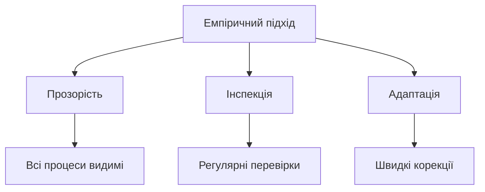
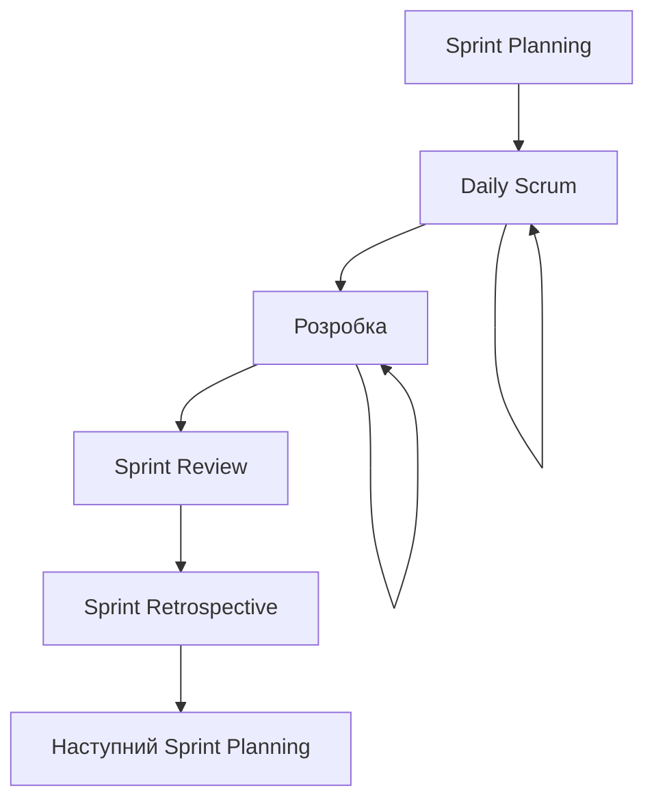
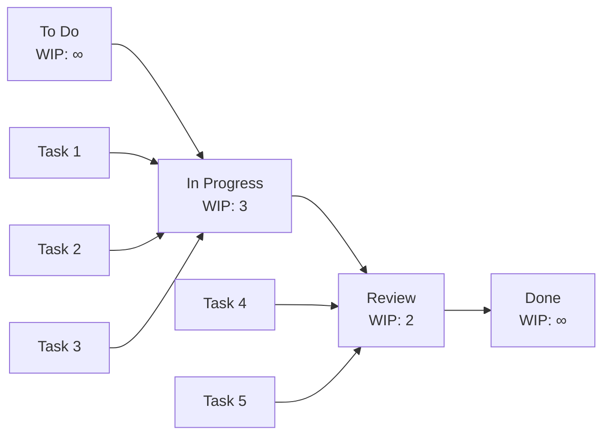
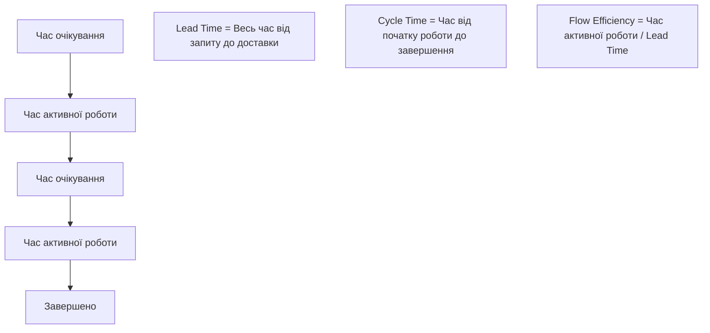
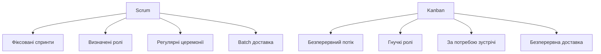
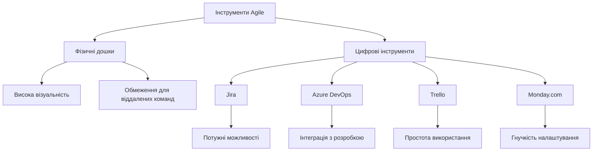
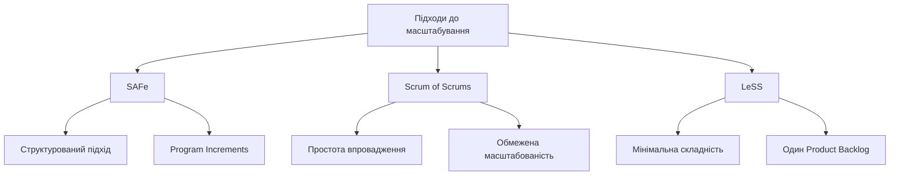

# Лекція 6. Scrum та Kanban

## Вступ

Після ознайомлення з принципами Agile Manifesto настає час детально розглянути конкретні методології, які втілюють ці принципи в практичну роботу команд розробки. Scrum та Kanban є найпопулярнішими фреймворками Agile, кожен з яких має свої особливості, переваги та області застосування. Розуміння цих методологій є критично важливим для сучасного інженера програмного забезпечення, оскільки більшість IT-компаній використовують один з цих підходів або їх комбінацію.

Scrum надає чітку структуру ролей, подій та артефактів для організації роботи команди в коротких ітераціях. Kanban фокусується на візуалізації робочого процесу та постійному покращенні потоку роботи. Обидва підходи спрямовані на підвищення продуктивності команди, покращення якості продукту та швидку адаптацію до змін вимог.

У цій лекції ми детально розглянемо структуру та принципи роботи Scrum, основи Kanban методології, порівняємо їх переваги та недоліки, а також вивчимо практичні аспекти впровадження цих підходів у реальних проєктах розробки програмного забезпечення.

## Методологія Scrum

### Фундаментальні принципи Scrum

Scrum базується на емпіричному підході до управління проєктами, який використовує три стовпи: прозорість, інспекція та адаптація. Прозорість означає, що всі аспекти процесу, які впливають на результат, повинні бути видимими для відповідальних за результат. Інспекція передбачає регулярну перевірку артефактів Scrum та прогресу для виявлення небажаних відхилень. Адаптація дозволяє швидко коригувати процес або продукт, якщо результати інспекції виходять за межі прийнятного.

Scrum працює в ітераціях фіксованої тривалості, які називаються спринтами. Кожен спринт має чітко визначену мету та створює потенційно готовий до випуску продукт. Такий підхід дозволяє команді регулярно отримувати зворотний зв'язок від замовників та користувачів, що є критично важливим для розробки якісного програмного забезпечення.

Команда Scrum самоорганізована та крос-функціональна. Самоорганізація означає, що команда сама вирішує, як виконувати роботу, без зовнішнього мікроменеджменту. Крос-функціональність передбачає, що команда має всі навички, необхідні для створення продукту, не покладаючись на людей поза командою.

### Ролі в Scrum

**Product Owner** відповідає за максимізацію цінності продукту та роботи команди розробки. Це включає управління Product Backlog, чітке вираження елементів Product Backlog, упорядкування елементів у Product Backlog для найкращого досягнення цілей та місій, оптимізацію цінності роботи, яку виконує команда розробки, забезпечення видимості, прозорості та ясності Product Backlog для всіх, та розуміння елементів Product Backlog на необхідному рівні.

Product Owner є однією людиною, а не комітетом. Product Owner може представляти бажання комітету в Product Backlog, але ті, хто хочуть змінити пріоритет елемента Product Backlog, повинні звертатися до Product Owner. Щоб Product Owner був успішним, вся організація повинна поважати його рішення, які видимі у змісті та порядку елементів Product Backlog.

**Scrum Master** відповідає за просування та підтримку Scrum, допомагаючи всім розуміти теорію, практики, правила та цінності Scrum. Scrum Master є слугою-лідером для команди Scrum, допомагає тим, хто знаходиться поза командою Scrum, розуміти, які з їхніх взаємодій з командою Scrum корисні, а які ні. Scrum Master допомагає всім змінювати ці взаємодії для максимізації цінності, створюваної командою Scrum.

Scrum Master служить Product Owner в кількох способах: забезпечення того, щоб цілі, обсяг та домен продукту були зрозумілі всім у команді Scrum настільки добре, наскільки це можливо; пошук технік для ефективного управління Product Backlog; допомога команді Scrum зрозуміти потребу в ясних та стислих елементах Product Backlog; розуміння планування продукту в емпіричному середовищі; забезпечення того, щоб Product Owner знав, як упорядкувати Product Backlog для максимізації цінності; розуміння та практика Agility; та полегшення Scrum подій за потреби або запитом.

**Команда розробки** складається з професіоналів, які виконують роботу з доставки потенційно готового до випуску приросту продукту в кінці кожного спринту. Тільки члени команди розробки створюють приріст. Команди розробки структуровані та уповноважені організацією для організації та управління власною роботою. Отримана синергія оптимізує загальну ефективність та продуктивність команди розробки.

Команди розробки мають наступні характеристики: вони самоорганізовані, ніхто не говорить команді розробки, як перетворити Product Backlog на прирости потенційно готової функціональності; команди розробки є крос-функціональними, вони мають всі навички, необхідні для створення приросту продукту; Scrum не визнає титулів для членів команди розробки, незалежно від роботи, яку виконує людина; Scrum не визнає підкоманд у команді розробки, незалежно від конкретних доменів, які потрібно адресувати, таких як тестування, архітектура, операції або бізнес-аналіз; індивідуальні члени команди розробки можуть мати спеціалізовані навички та області фокусу, але відповідальність належить команді розробки як цілому.

### Scrum події

**Sprint** є серцем Scrum, це контейнер фіксованої тривалості для всіх інших подій. Спринти мають постійну тривалість протягом усього процесу розробки. Новий спринт починається відразу після завершення попереднього спринту. Спринти містять і складаються зі Sprint Planning, Daily Scrums, роботи з розробки, Sprint Review та Sprint Retrospective.

Під час спринту не вносяться зміни, які б загрожували цілі спринту; цілі якості не знижуються; обсяг може бути уточнений та перепереговорений між Product Owner та командою розробки, коли дізнаються більше. Кожен спринт може розглядатися як проєкт з горизонтом не більше одного місяця. Як і проєкти, спринти використовуються для досягнення чогось.

**Sprint Planning** ініціює спринт, визначаючи роботу, яка буде виконана в спринті. Цей план створюється спільною роботою всієї команди Scrum. Sprint Planning обмежується максимум вісьмома годинами для місячного спринту. Для коротших спринтів подія зазвичай коротша. Scrum Master забезпечує, щоб подія відбулася і щоб учасники розуміли її мету.

Sprint Planning адресує наступні теми: що може бути доставлено в прирості, що є результатом майбутнього спринту; як буде виконана робота, необхідна для доставки приросту. Product Owner обговорює мету, яку спринт повинен досягти, та елементи Product Backlog, які, якщо будуть завершені в спринті, досягнуть цілі спринту.

**Daily Scrum** є 15-хвилинною подією для команди розробки. Daily Scrum проводиться кожного дня спринту. На ньому команда розробки планує роботу на наступні 24 години. Це оптимізує командну співпрацю та продуктивність, інспектуючи роботу з часу останнього Daily Scrum та прогнозуючи майбутню роботу спринту.

Daily Scrum проводиться в один і той же час та в одному і тому ж місці кожного дня для зменшення складності. Під час зустрічі члени команди розробки пояснюють: що я зробив вчора, що допомогло команді розробки досягти цілі спринту; що я буду робити сьогодні, щоб допомогти команді розробки досягти цілі спринту; чи бачу я будь-які перешкоди, які заважають мені або команді розробки досягти цілі спринту.

**Sprint Review** проводиться в кінці спринту для інспекції приросту та адаптації Product Backlog, якщо необхідно. Під час Sprint Review команда Scrum та зацікавлені сторони співпрацюють над тим, що було зроблено в спринті. Базуючись на цьому та будь-яких змінах у Product Backlog під час спринту, учасники співпрацюють над наступними речами, які можуть бути зроблені для оптимізації цінності.

Це неформальна зустріч, а не статусна зустріч, і презентація приросту призначена для отримання зворотного зв'язку та сприяння співпраці. Це максимум чотиригодинна зустріч для місячного спринту. Для коротших спринтів подія зазвичай коротша.

**Sprint Retrospective** є можливістю для команди Scrum інспектувати себе та створити план покращень, які будуть впроваджені під час наступного спринту. Sprint Retrospective відбувається після Sprint Review та перед наступним Sprint Planning. Це максимум тригодинна зустріч для місячного спринту. Для коротших спринтів подія зазвичай коротша.

Мета Sprint Retrospective полягає в тому, щоб: інспектувати, як пройшов останній спринт щодо людей, відносин, процесу та інструментів; ідентифікувати та упорядкувати основні елементи, які пішли добре, та потенційні покращення; створити план для впровадження покращень у тому, як команда Scrum виконує свою роботу.

### Артефакти Scrum

**Product Backlog** є впорядкованим списком всього, що, як відомо, потрібно в продукті. Це єдине джерело вимог для будь-яких змін, які будуть внесені в продукт. Product Owner відповідає за Product Backlog, включаючи його зміст, доступність та упорядкування. Product Backlog ніколи не завершений. Найраніша розробка його лише закладає початкові та найбільш зрозумілі вимоги.

Product Backlog розвивається в міру того, як продукт і середовище, в якому він буде використовуватися, розвиваються. Product Backlog є динамічним; він постійно змінюється, щоб ідентифікувати, що продукту потрібно, щоб бути відповідним, конкурентоспроможним та корисним. Доки продукт існує, його Product Backlog також існує.

Елементи Product Backlog вищого порядку зазвичай більш ясні та детальні, ніж нижчі. Більш точні оцінки робляться на основі більшої ясності та збільшених деталей; нижчі елементи менш детальні. Елементи Product Backlog, які будуть займати команду розробки для майбутнього спринту, уточнюються так, що будь-який з них може бути розумно завершений протягом спринту.

**Sprint Backlog** є набором елементів Product Backlog, відібраних для спринту, плюс план для доставки приросту продукту та реалізації цілі спринту. Sprint Backlog є прогнозом команди розробки щодо того, яка функціональність буде в наступному прирості та робота, необхідна для доставки цієї функціональності в готовий приріст.

Sprint Backlog робить видимою всю роботу, яку команда розробки ідентифікує як необхідну для досягнення цілі спринту. Щоб забезпечити постійне покращення, він включає принаймні одне високопріоритетне покращення процесу, ідентифіковане в попередній ретроспективі.

**Increment** є сумою всіх елементів Product Backlog, завершених під час спринту, та цінністю приростів усіх попередніх спринтів. В кінці спринту новий приріст повинен бути готовим, що означає, що він повинен бути в такому стані, що може бути випущений. Приріст повинен бути в робочому стані незалежно від того, чи вирішує Product Owner його фактично випустити.

## Методологія Kanban

### Принципи Kanban

Kanban є методом для поступового та еволюційного покращення процесів доставки або розробки. Він базується на шести основних практиках: візуалізація робочого процесу, обмеження роботи в процесі, керування потоком, створення явних політик процесу, впровадження циклів зворотного зв'язку та покращення співпрацею.

Візуалізація робочого процесу є основою Kanban. Команда створює візуальну модель своєї роботи та робочого процесу. Робочі елементи представлені візуально на дошці Kanban, що дозволяє учасникам команди бачити стан кожного елемента роботи в будь-який момент часу. Це створює спільне розуміння робочого процесу та того, як робота протікає через нього.

Обмеження роботи в процесі означає, що команда обмежує кількість робочих елементів в активному стані. Ці обмеження допомагають виявити вузькі місця в робочому процесі та заохочують команду співпрацювати для підтримки плавного потоку роботи. Коли команда досягає ліміту для певного стану робочого процесу, це сигналізує про необхідність вирішити проблему перед прийняттям нової роботи.

Керування потоком фокусується на плавному та передбачуваному потоці робочих елементів через систему. Команда відстежує, вимірює та звітує про потік роботи. Шляхом розуміння того, як робота протікає через їхню систему, команда може зробити покращення, які позитивно вплинуть на результати бізнесу.

### Дошка Kanban

Дошка Kanban є центральним інструментом методології, який візуалізує весь робочий процес команди. Найпростіша дошка Kanban має три колонки: "To Do", "In Progress" та "Done". Кожна колонка представляє стан робочого елемента в процесі розробки. Робочі елементи представлені картками, які переміщуються зліва направо через колонки в міру їх прогресу.

Більш складні дошки можуть мати додаткові колонки, які відображають специфічні етапи робочого процесу команди. Наприклад, команда розробки програмного забезпечення може мати колонки: "Backlog", "Analysis", "Development", "Testing", "Code Review", "Deployment", "Done". Кожна колонка може мати свій ліміт WIP (Work In Progress), який обмежує кількість робочих елементів, які можуть знаходитися в цьому стані одночасно.

Картки на дошці Kanban містять інформацію про робочий елемент: назву, опис, виконавця, пріоритет, оцінку складності та інші релевантні деталі. Картки можуть бути кольорово закодовані для представлення різних типів роботи, пріоритетів або команд.

Swimlanes або доріжки можуть використовуватися для категоризації роботи по різних критеріях. Наприклад, можна мати окремі доріжки для функцій, виправлень помилок та технічного боргу. Це допомагає команді краще організувати роботу та відстежувати різні типи завдань.

### WIP ліміти та управління потоком

Work In Progress ліміти є ключовим елементом Kanban, який обмежує кількість робочих елементів у кожному стані робочого процесу. Ці ліміти допомагають команді зосередитися на завершенні поточної роботи перед початком нової, що покращує загальну продуктивність та якість.

Встановлення правильних WIP лімітів вимагає експериментування та адаптації. Початкові ліміти можуть базуватися на кількості людей у команді або емпіричних спостереженнях. Якщо ліміти занадто високі, команда може взяти на себе занадто багато роботи, що призведе до затримок та зниження якості. Якщо ліміти занадто низькі, команда може не повністю використовувати свою пропускну здатність.

Коли команда досягає WIP ліміту в певній колонці, це створює "pull signal" або сигнал витягування. Замість того, щоб почати нову роботу, команда повинна зосередитися на переміщенні існуючої роботи до наступного етапу або вирішенні проблем, які заважають прогресу.

Метрики потоку допомагають командам вимірювати та покращувати свою продуктивність. Ключові метрики включають час циклу (cycle time) - час, необхідний для завершення робочого елемента від початку роботи до завершення; час виконання (lead time) - загальний час від запиту до доставки; пропускну здатність (throughput) - кількість робочих елементів, завершених за певний період; та коефіцієнт потоку (flow efficiency) - відсоток часу, коли робочий елемент активно обробляється.

### Класи обслуговування

Класи обслуговування в Kanban допомагають командам управляти різними типами роботи з різними очікуваннями щодо доставки та ризику. Кожен клас має свої характеристики щодо пріоритету, часу доставки та витрат на затримку.

Expedite клас використовується для критичних проблем, які потребують негайного вирішення. Такі елементи мають найвищий пріоритет і можуть порушувати WIP ліміти. Зазвичай їх кількість повинна бути мінімальною, оскільки вони порушують нормальний потік роботи.

Fixed Date клас включає елементи з жорсткими дедлайнами, які не можуть бути перенесені. Ці елементи плануються завчасно та мають високий пріоритет відповідно до їх дедлайнів.

Standard клас містить звичайні робочі елементи, які складають основну частину роботи команди. Вони обслуговуються в порядку пріоритету, встановленому Product Owner або бізнесом.

Intangible клас включає роботу, яка не приносить прямої бізнес-цінності, але є необхідною для підтримки системи. Це може включати технічний борг, рефакторинг, оновлення безпеки та інфраструктурні покращення.

## Порівняння Scrum та Kanban

### Структурні відмінності

Scrum має жорстку структуру з визначеними ролями, подіями та артефактами. Всі спринти мають фіксовану тривалість, зазвичай від одного до чотирьох тижнів. Команда працює в ітераціях, кожна з яких завершується потенційно готовим до випуску продуктом. Зміни в Sprint Backlog не заохочуються під час спринту.

Kanban є більш гнучким та адаптивним. Він не має фіксованих ітерацій або ролей. Робота протікає безперервно, а зміни можуть бути внесені в будь-який момент, коли з'являється нова інформація або змінюються пріоритети. Kanban фокусується на покращенні існуючого процесу, а не на впровадженні нової структури.

У Scrum команда береже зобов'язання доставити певний обсяг роботи до кінця спринту. Product Owner може змінити пріоритети між спринтами, але не під час спринту. Це створює стабільність для команди розробки, але може бути менш адаптивним до швидких змін бізнес-вимог.

Kanban дозволяє постійну зміну пріоритетів. Нові високопріоритетні елементи можуть бути додані в будь-який момент, а менш важливі можуть бути відкладені або видалені. Це робить Kanban більш адаптивним до змін, але може створювати нестабільність та переключення контексту.

### Метрики та вимірювання

Scrum використовує метрики, пов'язані зі спринтами. Velocity вимірює кількість story points, завершених командою за спринт. Burndown charts показують прогрес команди протягом спринту. Sprint burnup charts відображають накопичений прогрес. Ці метрики допомагають команді планувати майбутні спринти та відстежувати свою продуктивність.

Kanban фокусується на метриках потоку. Cycle time вимірює час, необхідний для завершення робочого елемента. Lead time включає час очікування в черзі. Throughput показує кількість елементів, завершених за певний період. Cumulative flow diagrams візуалізують потік роботи через систему та допомагають виявити вузькі місця.

Вибір між цими підходами часто залежить від природи роботи та організаційного контексту. Scrum краще підходить для проєктів з чітко визначеними цілями та стабільними командами. Kanban більш ефективний для підтримуючої роботи, операційних завдань або ситуацій з часто змінюваними пріоритетами.

### Комбінування підходів: Scrumban

Багато команд знаходять користь у поєднанні елементів Scrum та Kanban, створюючи гібридний підхід, відомий як Scrumban. Цей підхід використовує структуру ролей Scrum з гнучкістю потоку Kanban.

У Scrumban команди можуть використовувати спринти, але з більшою гнучкістю щодо змін під час спринту. Вони можуть використовувати дошку Kanban для візуалізації роботи та WIP ліміти для керування потоком. Sprint planning може бути замінено на pull-based планування, де нова робота вибирається, коли команда має пропускну здатність.

Scrumban особливо ефективний для команд, які переходять від Scrum до Kanban, або для команд, які потребують як структури Scrum, так і гнучкості Kanban. Цей підхід дозволяє командам зберегти корисні елементи Scrum, одночасно адаптуючи процеси для кращого керування потоком роботи.

## Практичне впровадження

### Впровадження Scrum

Початок роботи зі Scrum вимагає ретельної підготовки та навчання команди. Перший крок полягає у визначенні Product Owner, який має глибоке розуміння продукту та може приймати рішення щодо пріоритетів. Product Owner повинен бути доступним для команди та мати повноваження приймати рішення щодо продукту.

Команда розробки повинна бути крос-функціональною та мати всі навички, необхідні для створення продукту. Оптимальний розмір команди становить 3-9 осіб. Більші команди потребують більше координації та можуть бути менш ефективними. Менші команди можуть не мати достатньо навичок для завершення роботи.

Scrum Master повинен бути досвідченим у Scrum та мати навички фасилітації. Початково Scrum Master може потребувати більше часу для допомоги команді освоїти нові практики. З часом роль стає менш інтенсивною, оскільки команда стає більш самоорганізованою.

Перші спринти часто є найскладнішими, оскільки команда вчиться працювати разом та освоює нові процеси. Важливо встановити реалістичні очікування та фокусуватися на навчанні, а не на максимальній продуктивності. Sprint Retrospectives є критично важливими для ідентифікації проблем та покращень.

Створення якісного Product Backlog є ключовим для успішного впровадження Scrum. Елементи backlog повинні бути написані у форматі User Stories та мати чіткі критерії прийняття. Оцінка складності за допомогою story points або інших методів допомагає команді планувати спринти.

### Впровадження Kanban

Впровадження Kanban починається з мапування поточного робочого процесу команди. Важливо зрозуміти, як робота зараз протікає через систему, перш ніж намагатися її покращити. Команда повинна ідентифікувати всі етапи, через які проходить робочий елемент від початку до завершення.

Створення початкової дошки Kanban повинно відображати поточний процес, а не ідеальний процес. Це дозволяє команді побачити, де насправді виникають проблеми, та зосередитися на покращенні існуючого процесу. Початкові WIP ліміти можуть бути встановлені емпірично на основі спостережень за поточною роботою.

Початкове встановлення WIP лімітів повинно бути консервативним. Краще почати з вищих лімітів та поступово їх зменшувати, ніж встановити занадто низькі ліміти, які паралізують роботу команди. Команда повинна експериментувати з різними лімітами та спостерігати за впливом на потік роботи.

Регулярні зустрічі для перегляду дошки та обговорення потоку роботи допомагають команді виявляти проблеми та можливості для покращення. Ці зустрічі можуть бути щоденними, подібно до Daily Scrum, або менш частими, залежно від потреб команди.

### Поширені помилки та виклики

Одна з найпоширеніших помилок при впровадженні Scrum полягає в тому, що організації намагаються адаптувати Scrum до своїх існуючих процесів, замість того щоб адаптувати процеси до Scrum. Це призводить до "ScrumBut" - ситуації, коли команда каже "ми використовуємо Scrum, але..." та вносить зміни, які підривають ефективність фреймворку.

Недостатня підтримка з боку менеджменту може серйозно вплинути на успіх впровадження Agile методологій. Менеджмент повинен розуміти принципи Agile та підтримувати необхідні зміни в організаційній культурі. Без цієї підтримки команди можуть зіткнутися з опором та конфліктами з традиційними процесами.

Неправильне розуміння ролей часто призводить до проблем. Product Owner може не мати достатньо часу або повноважень для ефективного виконання своїх обов'язків. Scrum Master може бути перевантажений іншими обов'язками або не мати достатнього досвіду для ефективного фасилітування процесу.

При впровадженні Kanban поширеною помилкою є відсутність справжніх WIP лімітів. Команди можуть створити дошку Kanban, але не встановити реальні обмеження на кількість роботи в процесі. Без цих обмежень Kanban втрачає більшість своїх переваг для покращення потоку.

Фокус на інструментах замість принципів може також створити проблеми. Команди можуть витрачати занадто багато часу на налаштування програмного забезпечення або створення ідеальних дошок, замість того щоб зосередитися на покращенні співпраці та доставки цінності.

## Інструменти та технології

### Фізичні дошки

Фізичні дошки залишаються потужним інструментом для Agile команд, особливо тих, що працюють в одному офісі. Вони забезпечують високу візуальність та тактильний досвід переміщення карток, що може підвищити залученість команди. Фізичні дошки легко налаштовувати та модифікувати без технічних обмежень.

Проте фізичні дошки мають значні обмеження для розподілених команд та можуть ускладнити відстеження історичних даних. Вони також можуть бути менш ефективними для звітності та аналітики порівняно з цифровими рішеннями.

### Цифрові інструменти

Jira від Atlassian є одним з найпопулярніших інструментів для управління Agile проєктами. Він підтримує як Scrum, так і Kanban методології та надає потужні можливості для відстеження проблем, планування спринтів та генерації звітів. Jira інтегрується з багатьма іншими інструментами розробки та надає гнучкі можливості налаштування.

Azure DevOps від Microsoft інтегрує управління проєктами з інструментами розробки, включаючи контроль версій, збірку та тестування. Це робить його привабливим для команд, які вже використовують екосистему Microsoft або потребують тісної інтеграції між управлінням проєктом та розробкою.

Trello надає простий та інтуїтивний інтерфейс для Kanban дошок. Хоча він менш потужний за спеціалізовані інструменти, його простота робить його привабливим для невеликих команд або проєктів, які не потребують складних функцій.

Monday.com та подібні платформи надають гнучкі можливості для налаштування робочих процесів та можуть бути адаптовані для різних методологій. Вони часто мають кращий користувацький інтерфейс та більш інтуїтивні для нетехнічних користувачів.

### Інтеграція з інструментами розробки

Сучасні Agile інструменти повинні інтегруватися з іншими інструментами, які використовує команда розробки. Інтеграція з системами контролю версій, такими як Git, дозволяє автоматично пов'язувати коміти коду з робочими елементами. Це забезпечує повну простежуваність від вимог до коду.

Інтеграція з CI/CD pipelines дозволяє автоматично оновлювати статус робочих елементів на основі результатів збірки та розгортання. Наприклад, коли код успішно розгорнутий у production, відповідна задача може автоматично переміститися до статусу "Done".

Інтеграція з інструментами тестування може автоматично створювати дефекти або оновлювати статус тестових випадків. Це допомагає підтримувати синхронізацію між різними аспектами процесу розробки та забезпечує єдине джерело правди для статусу проєкту.

## Масштабування Agile

### Frameworks для масштабування

Коли організації зростають та мають кілька команд, що працюють над одним продуктом або пов'язаними продуктами, виникає потреба в масштабуванні Agile підходів. Scaled Agile Framework (SAFe) є одним з найпопулярніших підходів до масштабування. Він надає структуру для координації роботи кількох команд через програмні інкременти та Release Trains.

Scrum of Scrums є простішим підходом, який використовує представників від кожної команди для координації роботи. Ці представники зустрічаються регулярно для обговорення залежностей, конфліктів та спільних викликів. Хоча цей підхід простіший за SAFe, він може бути менш ефективним для великих організацій.

Large Scale Scrum (LeSS) намагається мінімізувати складність масштабування, зберігаючи принципи Scrum на організаційному рівні. LeSS використовує один Product Backlog для всіх команд та координує роботу через спільні Sprint Planning та Review події.

### Виклики масштабування

Координація між командами стає одним з найбільших викликів при масштабуванні Agile. Команди повинні управляти залежностями, синхронізувати релізи та забезпечувати узгодженість архітектури. Це вимагає додаткових процесів та ролей, які можуть сповільнити гнучкість, яка є основною перевагою Agile.

Управління спільним кодом та архітектурою потребує координації між командами. Команди повинні погоджувати стандарти кодування, архітектурні рішення та технологічні вибори. Це може вимагати створення архітектурних команд або Communities of Practice.

Культурні зміни стають більш складними в великих організаціях. Різні частини організації можуть мати різні рівні готовності до Agile трансформації. Управління цими різними швидкостями змін вимагає ретельного планування та підтримки з боку керівництва.

## Практичні поради та рекомендації

### Для команд-початківців

Новим командам рекомендується почати з простих практик та поступово додавати складність. Краще повністю освоїти базові елементи Scrum або Kanban, ніж намагатися впровадити всі практики одразу. Фокус на навчанні та покращенні процесу є більш важливим за досягнення високої продуктивності на початкових етапах.

Регулярні ретроспективи є критично важливими для навчання та адаптації. Команди повинні чесно обговорювати, що працює добре, а що потребує покращення. Важливо створити безпечне середовище, де члени команди можуть відкрито ділитися своїми думками без страху критики.

Інвестиції в навчання та коучинг можуть значно прискорити процес адаптації. Зовнішні тренери або досвідчені Agile практики можуть допомогти команді уникнути поширених помилок та швидше освоїти нові практики.

### Для досвідчених команд

Досвідчені команди можуть експериментувати з комбінуванням різних практик з різних методологій. Наприклад, команда може використовувати Scrum події з Kanban метриками або додавати практики з Extreme Programming до свого Scrum процесу.

Фокус на метриках та безперервному покращенні стає більш важливим для зрілих команд. Вони можуть використовувати більш складні метрики, такі як flow efficiency або predictability, для оптимізації своїх процесів.

Досвідчені команди також можуть брати на себе роль менторів для нових команд в організації, допомагаючи поширювати Agile практики та культуру.

### Адаптація до контексту

Важливо пам'ятати, що не існує універсального рішення для всіх команд та організацій. Scrum може бути кращим для команд, що працюють над новими продуктами з невизначеними вимогами. Kanban може бути більш підходящим для підтримуючих команд або команд з частими змінами пріоритетів.

Розмір команди, досвід членів команди, організаційна культура та тип продукту - всі ці фактори повинні враховуватися при виборі та адаптації методології. Гнучкість та готовність до експериментування є ключовими для знаходження найкращого підходу для конкретного контексту.

## Висновки

Scrum та Kanban представляють два різні, але взаємодоповнюючі підходи до Agile розробки програмного забезпечення. Scrum надає структуру та ритм через фіксовані спринти та регулярні церемонії, що може бути особливо корисним для команд, які потребують чіткого фокусу та регулярних точок синхронізації. Kanban фокусується на покращенні потоку роботи та візуалізації процесу, що робить його ідеальним для команд з мінливими пріоритетами та постійним потоком завдань.

Обидва підходи ділять основні принципи Agile: фокус на людях та взаємодії, співпрацю з клієнтами, реагування на зміни та доставку робочого програмного забезпечення. Вибір між ними або комбінування їх елементів залежить від специфічного контексту команди, організації та проєкту.

Успішне впровадження будь-якої з цих методологій вимагає не лише розуміння їх механізмів, але й культурних змін в організації. Команди повинні бути готові до експериментування, навчання та постійного покращення своїх процесів. Інвестиції в навчання та підтримку команд є критично важливими для довгострокового успіху.

Важливо розуміти, що Scrum та Kanban є інструментами, а не самоціллю. Головна мета полягає в покращенні здатності команди доставляти цінність клієнтам швидко та ефективно. Методології повинні служити цій цілі, а не створювати додаткову бюрократію або обмеження.

У наступних лекціях ми розглянемо, як ці методології інтегруються з технічними практиками розробки програмного забезпечення, включаючи архітектуру, проєктування та управління якістю коду. Розуміння як процесних, так і технічних аспектів є необхідним для створення високоякісного програмного забезпечення в сучасному швидко змінюваному технологічному середовищі.
