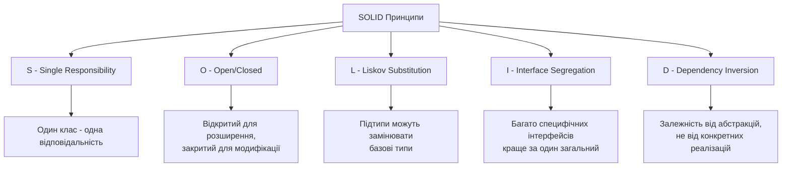

# Принципи проєктування програмного забезпечення: SOLID, DRY, KISS

## Вступ

Розробка якісного програмного забезпечення вимагає не лише знання синтаксису мови програмування та вміння писати код, що працює. Критично важливо розуміти та застосовувати фундаментальні принципи проєктування, які роблять код підтримуваним, масштабованим та зрозумілим. Ці принципи формувалися протягом десятиліть практичного досвіду розробників та представляють узагальнення найкращих практик індустрії програмного забезпечення.

Принципи проєктування допомагають уникнути типових помилок, які призводять до створення заплутаного, важкого в підтримці коду. Вони надають керівництво для прийняття рішень під час розробки та служать критеріями для оцінки якості коду. Дотримання цих принципів не гарантує ідеальний код, але значно підвищує шанси створити програмне забезпечення, яке легко розуміти, модифікувати та розширювати.

У цій лекції ми розглянемо три групи фундаментальних принципів проєктування. SOLID представляє п'ять принципів об'єктно-орієнтованого проєктування, сформульованих Робертом Мартіном. Принцип DRY закликає уникати дублювання коду. Принцип KISS наголошує на важливості простоти в проєктуванні. Разом ці принципи формують міцний фундамент для розробки якісного програмного забезпечення.

## Принципи SOLID

SOLID це акронім, що об'єднує п'ять фундаментальних принципів об'єктно-орієнтованого проєктування та програмування. Ці принципи були сформульовані Робертом Мартіном на початку 2000-х років та стали основою сучасної розробки програмного забезпечення. Дотримання принципів SOLID допомагає створювати системи, які легко розуміти, підтримувати та розширювати.



### Single Responsibility Principle

Принцип єдиної відповідальності стверджує, що клас повинен мати лише одну причину для зміни. Це означає, що клас повинен виконувати одну чітко визначену функцію або нести одну відповідальність. Коли клас має декілька відповідальностей, зміни в одній частині функціональності можуть непередбачувано вплинути на іншу частину.

Розглянемо приклад порушення цього принципу. Клас `User` об'єднує занадто багато відповідальностей: управління даними користувача, валідацію, збереження в базу даних та відправку email повідомлень.

```python
# Погане рішення: порушення SRP
class User:
    def __init__(self, name, email, password):
        self.name = name
        self.email = email
        self.password = password

    def validate_email(self):
        # Валідація email
        return '@' in self.email and '.' in self.email

    def validate_password(self):
        # Перевірка надійності паролю
        return len(self.password) >= 8

    def save_to_database(self):
        # Код для збереження в базу даних
        print(f"Збереження користувача {self.name} в базу даних")
        # SQL запити тощо

    def send_welcome_email(self):
        # Відправка email
        print(f"Відправка вітального email на {self.email}")
        # Код для відправки email

    def hash_password(self):
        # Хешування паролю
        return f"hashed_{self.password}"
```

У цьому класі є щонайменше чотири різні відповідальності: управління даними користувача, валідація, робота з базою даних та відправка email. Зміни в логіці валідації email потребують модифікації класу `User`, так само як зміни в способі зберігання даних або відправки email. Це робить клас крихким та важким у підтримці.

Правильний підхід полягає в розділенні відповідальностей між різними класами. Кожен клас виконує одну чітко визначену функцію та може змінюватися незалежно від інших.

```python
# Хороше рішення: дотримання SRP
class User:
    def __init__(self, name, email, password):
        self.name = name
        self.email = email
        self.password = password

class UserValidator:
    @staticmethod
    def validate_email(email):
        return '@' in email and '.' in email

    @staticmethod
    def validate_password(password):
        return len(password) >= 8

    @staticmethod
    def validate_user(user):
        if not UserValidator.validate_email(user.email):
            raise ValueError("Некоректний email")
        if not UserValidator.validate_password(user.password):
            raise ValueError("Пароль має містити мінімум 8 символів")
        return True

class UserRepository:
    def save(self, user):
        # Логіка збереження в базу даних
        print(f"Збереження користувача {user.name} в базу даних")
        return True

class EmailService:
    def send_welcome_email(self, user):
        print(f"Відправка вітального email на {user.email}")
        return True

class PasswordHasher:
    @staticmethod
    def hash(password):
        return f"hashed_{password}"

# Використання
user = User("Іван Петренко", "ivan@example.com", "securepass123")

validator = UserValidator()
validator.validate_user(user)

user.password = PasswordHasher.hash(user.password)

repository = UserRepository()
repository.save(user)

email_service = EmailService()
email_service.send_welcome_email(user)
```

Тепер кожен клас має одну чітку відповідальність. Клас `User` лише зберігає дані користувача. `UserValidator` відповідає за валідацію. `UserRepository` керує збереженням у базу даних. `EmailService` відправляє email повідомлення. `PasswordHasher` хешує паролі. Зміни в логіці валідації не вплинуть на код відправки email або збереження в базу даних.

Переваги дотримання принципу єдиної відповідальності очевидні. Код стає більш модульним та легшим для розуміння, оскільки кожен клас має чітко визначену мету. Тестування спрощується, адже кожен клас можна тестувати незалежно. Повторне використання коду покращується, оскільки класи з чіткими відповідальностями легше використовувати в різних контекстах. Підтримка стає простішою, адже зміни локалізуються в окремих класах.

### Open/Closed Principle

Принцип відкритості та закритості стверджує, що програмні сутності класи, модулі, функції мають бути відкритими для розширення, але закритими для модифікації. Це означає, що ми повинні мати можливість додавати нову функціональність без зміни існуючого коду. Дотримання цього принципу мінімізує ризик внесення помилок у вже працюючий код.

Розглянемо приклад системи розрахунку знижок для інтернет-магазину. Погане рішення вимагає модифікації існуючого класу для додавання нових типів знижок.

```python
# Погане рішення: порушення OCP
class DiscountCalculator:
    def calculate_discount(self, customer, amount, discount_type):
        if discount_type == 'regular':
            return amount * 0.05
        elif discount_type == 'premium':
            return amount * 0.10
        elif discount_type == 'vip':
            return amount * 0.20
        elif discount_type == 'seasonal':
            return amount * 0.15
        return 0
```

Кожного разу, коли потрібно додати новий тип знижки, доводиться модифікувати метод `calculate_discount`, додаючи нову умову в ланцюжок if-elif. Це порушує принцип відкритості та закритості, оскільки існуючий код змінюється для додавання нової функціональності. Крім того, зростає ризик помилок та ускладнюється тестування.

Правильний підхід використовує абстракцію та поліморфізм для дозволу розширення без модифікації існуючого коду.

```python
# Хороше рішення: дотримання OCP
from abc import ABC, abstractmethod

class DiscountStrategy(ABC):
    @abstractmethod
    def calculate(self, amount):
        pass

class RegularDiscount(DiscountStrategy):
    def calculate(self, amount):
        return amount * 0.05

class PremiumDiscount(DiscountStrategy):
    def calculate(self, amount):
        return amount * 0.10

class VIPDiscount(DiscountStrategy):
    def calculate(self, amount):
        return amount * 0.20

class SeasonalDiscount(DiscountStrategy):
    def calculate(self, amount):
        return amount * 0.15

class FirstPurchaseDiscount(DiscountStrategy):
    def calculate(self, amount):
        return amount * 0.25

class DiscountCalculator:
    def __init__(self, discount_strategy):
        self.discount_strategy = discount_strategy

    def calculate_discount(self, amount):
        return self.discount_strategy.calculate(amount)

# Використання
amount = 1000

regular_calculator = DiscountCalculator(RegularDiscount())
print(f"Звичайна знижка: {regular_calculator.calculate_discount(amount)}")

vip_calculator = DiscountCalculator(VIPDiscount())
print(f"VIP знижка: {vip_calculator.calculate_discount(amount)}")

# Додавання нової знижки не вимагає зміни існуючого коду
first_purchase_calculator = DiscountCalculator(FirstPurchaseDiscount())
print(f"Знижка першої покупки: {first_purchase_calculator.calculate_discount(amount)}")
```

Тепер додавання нового типу знижки вимагає лише створення нового класу, що реалізує інтерфейс `DiscountStrategy`. Існуючий код калькулятора та інші стратегії знижок залишаються незмінними. Це робить систему гнучкою та розширюваною без ризику порушити існуючу функціональність.

Ключові механізми для дотримання принципу відкритості та закритості включають абстракцію через інтерфейси та абстрактні класи, поліморфізм для роботи з різними реалізаціями через єдиний інтерфейс, та шаблони проєктування, які інкапсулюють те, що змінюється. Результатом є код, що легко розширюється новою функціональністю без модифікації перевіреного коду.

### Liskov Substitution Principle

Принцип підстановки Лісков стверджує, що об'єкти підкласів повинні мати можливість замінювати об'єкти базових класів без порушення коректності програми. Якщо клас B успадковує клас A, то об'єкти типу A в програмі мають можливість бути заміненими об'єктами типу B без зміни властивостей програми.

Класичним прикладом порушення цього принципу є проблема квадрата та прямокутника. З математичної точки зору квадрат є окремим випадком прямокутника, але в програмуванні успадкування квадрата від прямокутника призводить до проблем.

```python
# Погане рішення: порушення LSP
class Rectangle:
    def __init__(self, width, height):
        self.width = width
        self.height = height

    def set_width(self, width):
        self.width = width

    def set_height(self, height):
        self.height = height

    def area(self):
        return self.width * self.height

class Square(Rectangle):
    def set_width(self, width):
        self.width = width
        self.height = width

    def set_height(self, height):
        self.width = height
        self.height = height

# Проблема виявляється при використанні
def process_rectangle(rectangle):
    rectangle.set_width(5)
    rectangle.set_height(4)
    expected_area = 5 * 4
    actual_area = rectangle.area()
    print(f"Очікувана площа: {expected_area}, Фактична площа: {actual_area}")
    assert actual_area == expected_area, "Площа не відповідає очікуваній!"

# Працює для Rectangle
rect = Rectangle(3, 3)
process_rectangle(rect)

# Не працює для Square
square = Square(3, 3)
process_rectangle(square)  # Викличе помилку!
```

Функція `process_rectangle` очікує, що встановлення ширини та висоти працюватиме незалежно, як у звичайному прямокутнику. Для квадрата це припущення не виконується, оскільки зміна однієї сторони автоматично змінює іншу. Заміна `Rectangle` на `Square` порушує коректність програми, що є порушенням принципу підстановки Лісков.

Правильне рішення полягає в створенні окремих класів без успадкування або використанні спільного інтерфейсу, який коректно моделює обидві фігури.

```python
# Хороше рішення: дотримання LSP
from abc import ABC, abstractmethod

class Shape(ABC):
    @abstractmethod
    def area(self):
        pass

class Rectangle(Shape):
    def __init__(self, width, height):
        self._width = width
        self._height = height

    def area(self):
        return self._width * self._height

    def set_dimensions(self, width, height):
        self._width = width
        self._height = height

class Square(Shape):
    def __init__(self, side):
        self._side = side

    def area(self):
        return self._side ** 2

    def set_side(self, side):
        self._side = side

# Коректне використання
shapes = [Rectangle(5, 4), Square(5)]

for shape in shapes:
    print(f"Площа фігури: {shape.area()}")
```

Тепер `Rectangle` та `Square` є незалежними класами, які реалізують спільний інтерфейс `Shape`. Вони не мають проблемної відносини успадкування, яка порушувала б принцип підстановки. Кожен клас має методи, що відповідають його природі: прямокутник може встановлювати ширину та висоту незалежно, квадрат встановлює лише одну сторону.

Дотримання принципу підстановки Лісков вимагає уважного проєктування ієрархій успадкування. Підклас повинен розширювати функціональність базового класу, а не змінювати його фундаментальну поведінку. Передумови методів у підкласі не можуть бути строгішими за базовий клас, а післяумови не можуть бути слабшими. Інваріанти базового класу мають зберігатися в підкласах.

### Interface Segregation Principle

Принцип розділення інтерфейсів стверджує, що клієнти не повинні залежати від інтерфейсів, які вони не використовують. Замість одного великого інтерфейсу краще створювати кілька спеціалізованих інтерфейсів. Це робить систему більш гнучкою та знижує зв'язаність між компонентами.

Розглянемо приклад системи для різних типів працівників. Поганий дизайн змушує всі класи реалізовувати методи, які їм не потрібні.

```python
# Погане рішення: порушення ISP
from abc import ABC, abstractmethod

class Worker(ABC):
    @abstractmethod
    def work(self):
        pass

    @abstractmethod
    def eat(self):
        pass

    @abstractmethod
    def sleep(self):
        pass

class Human(Worker):
    def work(self):
        return "Людина працює"

    def eat(self):
        return "Людина їсть"

    def sleep(self):
        return "Людина спить"

class Robot(Worker):
    def work(self):
        return "Робот працює"

    def eat(self):
        # Роботу не потрібно їсти, але доводиться реалізовувати метод
        raise NotImplementedError("Робот не їсть")

    def sleep(self):
        # Роботу не потрібно спати
        raise NotImplementedError("Робот не спить")
```

Клас `Robot` змушений реалізовувати методи `eat` та `sleep`, які йому не потрібні та не мають сенсу. Це порушує принцип розділення інтерфейсів та створює заплутаний код з методами, що генерують винятки при виклику.

Правильний підхід полягає в створенні кількох спеціалізованих інтерфейсів, кожен з яких описує окремий аспект поведінки.

```python
# Хороше рішення: дотримання ISP
from abc import ABC, abstractmethod

class Workable(ABC):
    @abstractmethod
    def work(self):
        pass

class Eatable(ABC):
    @abstractmethod
    def eat(self):
        pass

class Sleepable(ABC):
    @abstractmethod
    def sleep(self):
        pass

class Human(Workable, Eatable, Sleepable):
    def work(self):
        return "Людина працює"

    def eat(self):
        return "Людина їсть"

    def sleep(self):
        return "Людина спить"

class Robot(Workable):
    def work(self):
        return "Робот працює"

class AnimalWorker(Workable, Eatable, Sleepable):
    def work(self):
        return "Тварина виконує роботу"

    def eat(self):
        return "Тварина їсть"

    def sleep(self):
        return "Тварина спить"

# Використання
def make_work(worker: Workable):
    print(worker.work())

def feed(eater: Eatable):
    print(eater.eat())

human = Human()
robot = Robot()

make_work(human)
make_work(robot)
feed(human)
# feed(robot)  # Помилка компіляції - Robot не реалізує Eatable
```

Тепер кожен клас реалізує лише ті інтерфейси, які йому потрібні. `Robot` реалізує тільки `Workable`, оскільки роботу потрібно лише працювати. `Human` реалізує всі три інтерфейси, оскільки людині потрібні всі ці функції. Це робить код більш чітким та запобігає помилкам під час використання.

Переваги дотримання принципу розділення інтерфейсів включають зниження зв'язаності між компонентами, оскільки класи залежать лише від методів, які вони фактично використовують. Збільшується гнучкість системи, адже легше змінювати окремі інтерфейси без впливу на інші. Покращується зрозумілість коду, оскільки маленькі, сфокусовані інтерфейси легше розуміти та використовувати.

### Dependency Inversion Principle

Принцип інверсії залежностей стверджує, що модулі високого рівня не повинні залежати від модулів низького рівня. Обидва типи модулів повинні залежати від абстракцій. Абстракції не повинні залежати від деталей, деталі повинні залежати від абстракцій. Цей принцип допомагає знизити зв'язаність між різними частинами системи.

Розглянемо приклад системи повідомлень. Погане рішення створює жорстку залежність між класами високого та низького рівнів.

```python
# Погане рішення: порушення DIP
class EmailSender:
    def send(self, message, recipient):
        print(f"Відправка email: {message} до {recipient}")

class SMSSender:
    def send(self, message, phone):
        print(f"Відправка SMS: {message} на {phone}")

class NotificationService:
    def __init__(self):
        self.email_sender = EmailSender()  # Жорстка залежність

    def notify(self, message, recipient):
        self.email_sender.send(message, recipient)
```

Клас `NotificationService` безпосередньо залежить від конкретної реалізації `EmailSender`. Якщо потрібно використовувати інший спосіб відправки повідомлень, доведеться модифікувати `NotificationService`. Неможливо легко тестувати `NotificationService` ізольовано, оскільки він завжди використовує реальний `EmailSender`.

Правильний підхід використовує абстракції для зниження зв'язаності між компонентами.

```python
# Хороше рішення: дотримання DIP
from abc import ABC, abstractmethod

class MessageSender(ABC):
    @abstractmethod
    def send(self, message, recipient):
        pass

class EmailSender(MessageSender):
    def send(self, message, recipient):
        print(f"Відправка email: {message} до {recipient}")
        return True

class SMSSender(MessageSender):
    def send(self, message, recipient):
        print(f"Відправка SMS: {message} на {recipient}")
        return True

class PushNotificationSender(MessageSender):
    def send(self, message, recipient):
        print(f"Відправка push повідомлення: {message} до {recipient}")
        return True

class NotificationService:
    def __init__(self, sender: MessageSender):
        self.sender = sender  # Залежність від абстракції

    def notify(self, message, recipient):
        return self.sender.send(message, recipient)

# Використання
email_service = NotificationService(EmailSender())
email_service.notify("Привіт", "user@example.com")

sms_service = NotificationService(SMSSender())
sms_service.notify("Код підтвердження", "+380123456789")

push_service = NotificationService(PushNotificationSender())
push_service.notify("Нове повідомлення", "device_token_123")
```

Тепер `NotificationService` залежить від абстракції `MessageSender`, а не від конкретних реалізацій. Це дозволяє легко змінювати спосіб відправки повідомлень без модифікації `NotificationService`. Можна створювати нові типи відправників, реалізуючи інтерфейс `MessageSender`. Тестування спрощується, оскільки можна створити mock реалізацію `MessageSender` для тестів.

Впровадження залежностей є ключовим механізмом для дотримання принципу інверсії залежностей. Замість створення залежностей всередині класу, вони передаються ззовні через конструктор, методи або властивості. Це робить залежності явними та дозволяє легко їх замінювати або налаштовувати.

```python
# Приклад з впровадженням залежностей
class UserService:
    def __init__(self, repository, logger, email_service):
        self.repository = repository
        self.logger = logger
        self.email_service = email_service

    def register_user(self, user_data):
        self.logger.log("Початок реєстрації користувача")
        user = self.repository.save(user_data)
        self.email_service.notify("Ласкаво просимо!", user.email)
        self.logger.log("Користувач зареєстрований успішно")
        return user
```

## Принцип DRY

### Не повторюйся

DRY означає "Don't Repeat Yourself" або "Не повторюйся". Цей принцип стверджує, що кожна частина знань має мати єдине, недвозначне, авторитетне представлення в системі. Дублювання коду є однією з найпоширеніших проблем у програмному забезпеченні та призводить до численних ускладнень.

Коли один і той самий код повторюється в різних місцях програми, будь-яка зміна логіки вимагає модифікації всіх копій. Це створює ризик пропустити якусь копію, що призведе до непослідовної поведінки програми. Дублювання ускладнює підтримку та збільшує розмір кодової бази.

```python
# Погане рішення: порушення DRY
class OrderService:
    def process_online_order(self, order):
        # Валідація замовлення
        if not order.items:
            raise ValueError("Замовлення порожнє")
        if order.total < 0:
            raise ValueError("Загальна сума не може бути від'ємною")

        # Обчислення знижки
        discount = 0
        if order.total > 1000:
            discount = order.total * 0.1

        final_total = order.total - discount
        print(f"Обробка онлайн замовлення. Сума: {final_total}")
        return True

    def process_store_order(self, order):
        # Та сама валідація повторюється
        if not order.items:
            raise ValueError("Замовлення порожнє")
        if order.total < 0:
            raise ValueError("Загальна сума не може бути від'ємною")

        # Та сама логіка знижки повторюється
        discount = 0
        if order.total > 1000:
            discount = order.total * 0.1

        final_total = order.total - discount
        print(f"Обробка замовлення в магазині. Сума: {final_total}")
        return True
```

У цьому прикладі логіка валідації та обчислення знижки повторюється в обох методах. Якщо потрібно змінити правила валідації або розрахунку знижки, доведеться робити зміни в обох місцях. Це збільшує ймовірність помилок та ускладнює підтримку.

Правильний підхід виносить повторювану логіку в окремі методи, які можна повторно використовувати.

```python
# Хороше рішення: дотримання DRY
class Order:
    def __init__(self, items, total):
        self.items = items
        self.total = total

class OrderValidator:
    @staticmethod
    def validate(order):
        if not order.items:
            raise ValueError("Замовлення порожнє")
        if order.total < 0:
            raise ValueError("Загальна сума не може бути від'ємною")
        return True

class DiscountCalculator:
    @staticmethod
    def calculate(total):
        if total > 1000:
            return total * 0.1
        return 0

class OrderService:
    def __init__(self):
        self.validator = OrderValidator()
        self.discount_calculator = DiscountCalculator()

    def process_order(self, order, order_type):
        self.validator.validate(order)
        discount = self.discount_calculator.calculate(order.total)
        final_total = order.total - discount
        print(f"Обробка {order_type} замовлення. Сума: {final_total}")
        return True

    def process_online_order(self, order):
        return self.process_order(order, "онлайн")

    def process_store_order(self, order):
        return self.process_order(order, "в магазині")
```

Тепер логіка валідації та розрахунку знижки знаходиться в одному місці. Будь-які зміни в цій логіці автоматично застосуються до всіх типів замовлень. Код стає коротшим, зрозумілішим та легшим у підтримці.

### Рівні застосування DRY

Принцип DRY застосовується на різних рівнях розробки програмного забезпечення. На рівні коду слід уникати копіювання та вставляння однакових фрагментів. Повторювана логіка виноситься в функції або методи. Схожі класи можуть успадковувати спільну функціональність від базового класу.

На рівні даних інформація повинна зберігатися в одному місці. База даних має бути правильно нормалізована, щоб уникнути дублювання даних. Конфігураційні параметри зберігаються в централізованих файлах конфігурації, а не розкидані по коду.

На рівні документації документація має бути синхронізована з кодом. Замість дублювання інформації про те, як працює код, в коментарях та окремих документах, краще використовувати самодокументовані назви та структуру коду. Коментарі повинні пояснювати "чому", а не "що" робить код.

### Баланс між DRY та читабельністю

Хоча принцип DRY є важливим, не варто доводити його до крайнощів. Іноді невелика кількість дублювання може бути прийнятною, якщо повне усунення дублювання призведе до надмірно складного або важкого для розуміння коду. Важливо знаходити баланс між уникненням дублювання та збереженням читабельності коду.

Передчасна абстракція може бути так само шкідливою, як і дублювання коду. Якщо два фрагменти коду здаються схожими, але насправді виконують різні функції або можуть еволюціонувати незалежно, не варто їх об'єднувати лише заради уникнення дублювання. Іноді краще почекати, поки патерн дублювання стане більш очевидним, перш ніж вводити абстракцію.

## Принцип KISS

### Тримай це простим

KISS означає "Keep It Simple, Stupid" або "Тримай це простим". Цей принцип наголошує на важливості простоти в проєктуванні програмного забезпечення. Прості рішення легше розуміти, підтримувати, тестувати та модифікувати. Складність є ворогом надійності та підтримуваності програмного забезпечення.

Надмірна складність часто виникає через спроби передбачити всі можливі майбутні потреби. Розробники створюють гнучкі архітектури з численними рівнями абстракції для функціональності, яка можливо ніколи не знадобиться. Це призводить до надмірно складного коду, який важко зрозуміти та підтримувати.

```python
# Погане рішення: надмірна складність
class AbstractDataProcessorFactory:
    @staticmethod
    def create_processor(processor_type):
        if processor_type == 'basic':
            return BasicDataProcessorBuilder().build()
        elif processor_type == 'advanced':
            return AdvancedDataProcessorBuilder().build()

class DataProcessorBuilder:
    def __init__(self):
        self.validators = []
        self.transformers = []
        self.outputters = []

    def add_validator(self, validator):
        self.validators.append(validator)
        return self

    def add_transformer(self, transformer):
        self.transformers.append(transformer)
        return self

    def add_outputter(self, outputter):
        self.outputters.append(outputter)
        return self

    def build(self):
        return DataProcessor(self.validators, self.transformers, self.outputters)

# ... багато додаткових класів та рівнів абстракції
```

Для простої задачі обробки даних створена складна ієрархія класів з фабриками, будівельниками та численними абстракціями. Це може бути виправдано для великої складної системи, але часто є надмірним для простих завдань.

Простіше рішення виконує ту саму функцію з мінімальною кількістю коду та абстракцій.

```python
# Хороше рішення: простота
class DataProcessor:
    def process(self, data):
        # Валідація
        if not data:
            raise ValueError("Дані порожні")

        # Обробка
        processed_data = [item.upper() for item in data if len(item) > 0]

        # Вивід
        return processed_data

# Використання
processor = DataProcessor()
result = processor.process(['hello', 'world', ''])
print(result)
```

Просте рішення легко зрозуміти з першого погляду. Немає необхідності розбиратися в складних абстракціях або відстежувати виклики через багато рівнів класів. Якщо в майбутньому знадобиться більша гнучкість, код можна поступово рефакторити, додаючи складність лише тоді, коли вона дійсно потрібна.

### Ознаки порушення KISS

Надто довгі методи або функції є ознакою порушення принципу простоти. Якщо метод займає більше одного екрана або має багато рівнів вкладеності, його варто розділити на менші, більш сфокусовані функції. Кожна функція повинна робити одну річ та робити її добре.

Складні умовні конструкції з багатьма вкладеними if-else блоками ускладнюють читання та розуміння коду. Часто такі конструкції можна спростити через поліморфізм, словники функцій або патерн стратегії. Надмірна кількість параметрів у функції також свідчить про надмірну складність та порушення принципу єдиної відповідальності.

Передчасна оптимізація часто призводить до надмірно складного коду. Замість того, щоб спочатку створити просте працююче рішення, розробники намагаються оптимізувати продуктивність до того, як з'ясується, чи це взагалі потрібно. Як сказав Дональд Кнут: "Передчасна оптимізація є коренем усього зла". Краще спочатку зробити код правильним та зрозумілим, а потім оптимізувати лише ті частини, де це дійсно необхідно.

### Застосування KISS на практиці

Починайте з найпростішого рішення, яке може працювати. Не намагайтеся одразу створити універсальну архітектуру для всіх можливих випадків використання. Додавайте складність поступово, лише коли вона стає необхідною. Принцип YAGNI "You Aren't Gonna Need It" добре доповнює KISS, закликаючи не реалізовувати функціональність, яка може знадобитися в майбутньому.

Використовуйте стандартні бібліотеки та перевірені рішення замість створення власних велосипедів. Стандартні бібліотеки зазвичай добре протестовані, оптимізовані та зрозумілі іншим розробникам. Створення власних реалізацій має сенс лише коли існуючі рішення не підходять або мають значні обмеження.

Пишіть код для людей, а не для комп'ютерів. Вибирайте описові назви змінних та функцій. Розбивайте складну логіку на менші, зрозумілі частини. Додавайте коментарі для пояснення складних або неочевидних рішень. Код читається набагато частіше, ніж пишеться, тому інвестиції в читабельність окупляються багаторазово.

## Взаємодія принципів

Принципи SOLID, DRY та KISS не є ізольованими правилами, а доповнюють один одного, створюючи цілісний підхід до проєктування програмного забезпечення. Дотримання одного принципу часто сприяє дотриманню інших. Наприклад, принцип єдиної відповідальності природним чином веде до простіших класів, що відповідає принципу KISS.

Принцип DRY підтримує принцип відкритості та закритості, оскільки уникнення дублювання коду полегшує внесення змін без модифікації багатьох місць. Принцип розділення інтерфейсів узгоджується з принципом простоти, оскільки маленькі, сфокусовані інтерфейси легше розуміти та використовувати. Принцип інверсії залежностей сприяє уникненню дублювання, дозволяючи повторно використовувати абстракції в різних контекстах.

Проте важливо розуміти, що принципи є керівництвом, а не догмою. Іноді дотримання всіх принципів одночасно може бути складним або навіть неможливим. У реальній розробці доводиться знаходити баланс та приймати прагматичні рішення. Ключ полягає в розумінні цих принципів та усвідомленому виборі, коли їх застосовувати, а коли можна зробити виняток.

## Практичне застосування принципів

### Рефакторинг існуючого коду

Застосування принципів проєктування часто вимагає рефакторингу існуючого коду. Рефакторинг це процес зміни внутрішньої структури коду без зміни його зовнішньої поведінки. Мета рефакторингу зробити код більш зрозумілим, легшим у підтримці та розширенні.

Починати рефакторинг варто з написання тестів для існуючого коду, якщо їх ще немає. Тести служать страховкою, гарантуючи, що зміни в структурі коду не порушують його функціональність. Після створення тестів можна поступово вносити зміни, переконуючись після кожного кроку, що тести продовжують проходити.

Типові кроки рефакторингу включають виділення дублікованого коду в окремі методи або класи, розділення великих класів з багатьма відповідальностями на менші, більш сфокусовані класи, та введення абстракцій для зниження зв'язаності між компонентами. Важливо проводити рефакторинг невеликими кроками, кожен з яких можна легко відмінити, якщо щось піде не так.

### Code review та оцінка якості

Code review є ефективним інструментом для забезпечення дотримання принципів проєктування. Під час перегляду коду варто звертати увагу на порушення принципів SOLID, DRY та KISS. Питання, які можна ставити під час code review: чи має клас єдину чітку відповідальність, чи є дублювання коду, чи можна спростити складні конструкції, чи правильно застосовано абстракції.

Автоматизовані інструменти статичного аналізу коду можуть допомогти виявити деякі порушення принципів. Лінтери перевіряють стиль коду та виявляють типові помилки. Інструменти аналізу складності вимірюють циклічну складність методів та визначають надто складні функції. Інструменти виявлення дублювання знаходять повторювані фрагменти коду.

### Навчання та розвиток команди

Знання принципів проєктування є критично важливим для всієї команди розробників. Регулярні технічні дискусії та workshops допомагають поглибити розуміння принципів та обмінятися досвідом їх застосування. Аналіз реальних прикладів з кодової бази проєкту дозволяє навчатися на конкретних ситуаціях.

Створення coding guidelines для проєкту допомагає встановити єдині стандарти та очікування. Ці керівництва повинні включати приклади правильного застосування принципів проєктування в контексті конкретного проєкту. Регулярне оновлення guidelines на основі досвіду команди забезпечує їх актуальність та корисність.

## Висновки

Принципи проєктування SOLID, DRY та KISS формують фундамент якісної розробки програмного забезпечення. Вони не є абсолютними правилами, які слід сліпо дотримуватися в будь-якій ситуації, а радше керівництвом для прийняття обґрунтованих рішень під час проєктування та розробки.

Принципи SOLID надають конкретні рекомендації для проєктування класів та взаємодії між ними в об'єктно-орієнтованих системах. Принцип єдиної відповідальності забезпечує модульність коду. Принцип відкритості та закритості дозволяє розширювати функціональність без зміни існуючого коду. Принцип підстановки Лісков гарантує коректність успадкування. Принцип розділення інтерфейсів знижує зв'язаність між компонентами. Принцип інверсії залежностей сприяє гнучкості архітектури.

Принцип DRY закликає уникати дублювання коду, знань та логіки в системі. Дотримання цього принципу полегшує підтримку та розширення програмного забезпечення, зменшуючи кількість місць, які потрібно змінювати при модифікації функціональності. Принцип KISS наголошує на важливості простоти в проєктуванні. Прості рішення легше розуміти, тестувати та підтримувати.

Застосування цих принципів вимагає досвіду та практики. Початківці можуть знаходити баланс між різними принципами складним, але з часом розуміння приходить через практичний досвід. Важливо пам'ятати, що мета принципів створення якісного програмного забезпечення, яке легко розуміти, підтримувати та розширювати. Якщо застосування принципу ускладнює код без очевидних переваг, варто переглянути підхід.

У наступній лекції ми розглянемо архітектурні патерни, які представляють перевірені рішення для типових проблем проєктування програмного забезпечення. Ці патерни базуються на принципах, розглянутих у цій лекції, та показують, як застосовувати ці принципи для вирішення конкретних завдань.

## Питання для самоперевірки

1. Поясніть принцип єдиної відповідальності. Чому клас з багатьма відповідальностями є проблематичним?
2. Що означає принцип відкритості та закритості? Як досягти того, щоб код був відкритий для розширення, але закритий для модифікації?
3. Наведіть приклад порушення принципу підстановки Лісков. Як правильно вирішити таку проблему?
4. У чому полягає різниця між великим загальним інтерфейсом та кількома маленькими спеціалізованими інтерфейсами?
5. Поясніть принцип інверсії залежностей. Як впровадження залежностей допомагає його дотримуватися?
6. Чому дублювання коду є проблемою? Які підходи можна використовувати для уникнення дублювання?
7. Коли застосування принципу DRY може призвести до надмірної складності?
8. Що означає принцип KISS? Наведіть приклади надмірної складності в коді.
9. Як принципи SOLID, DRY та KISS взаємодіють та доповнюють один одного?
10. Які інструменти та практики можна використовувати для забезпечення дотримання принципів проєктування в команді?
