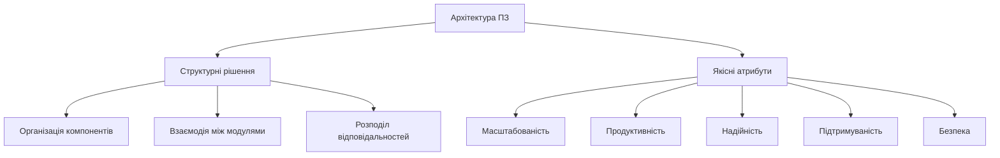
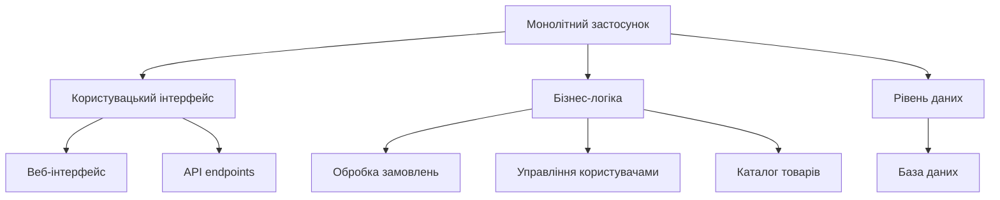
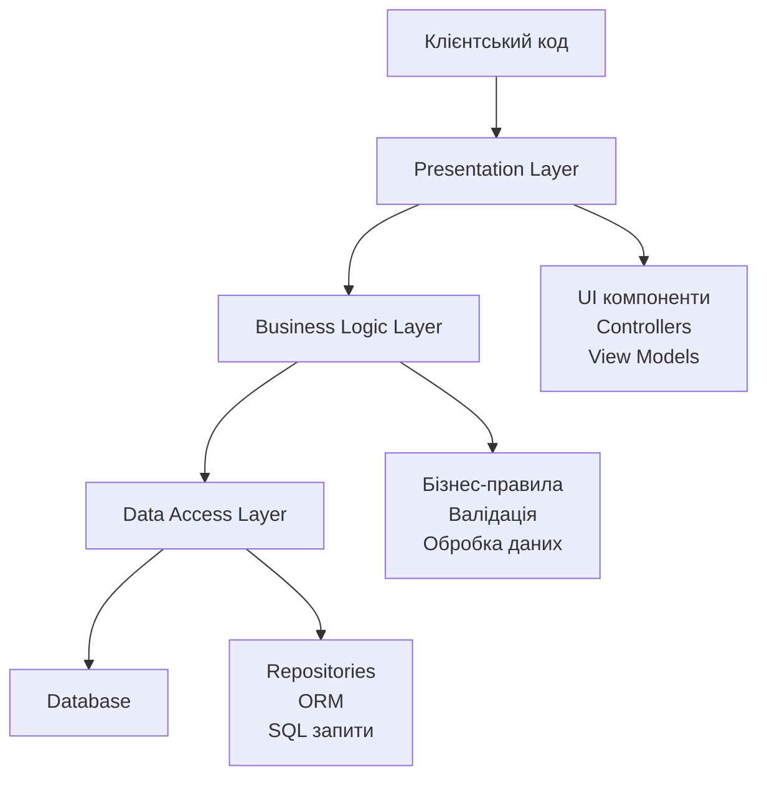
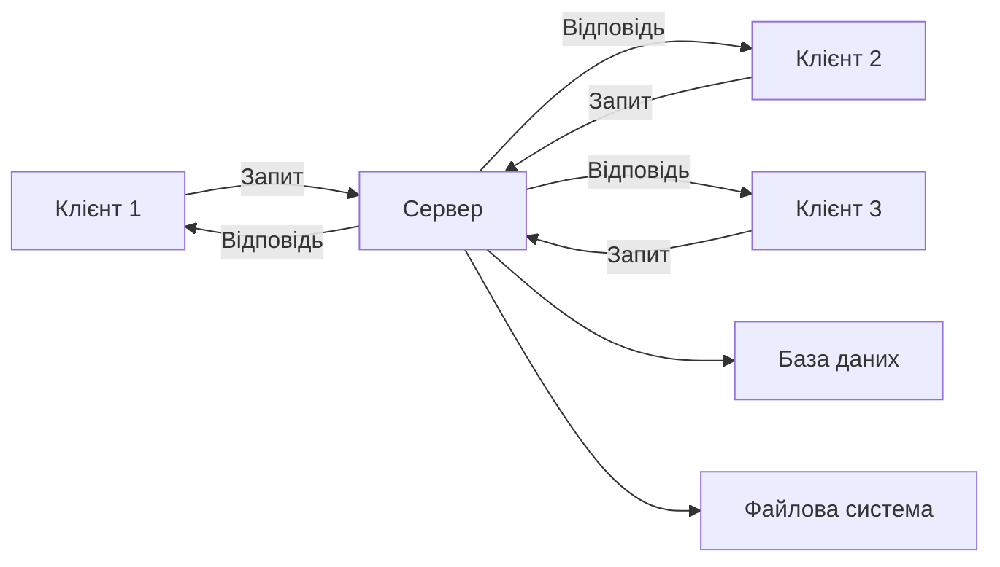
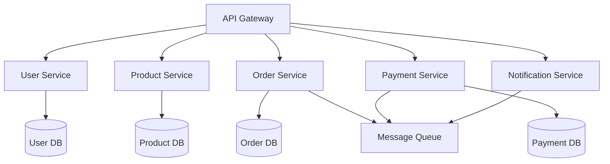
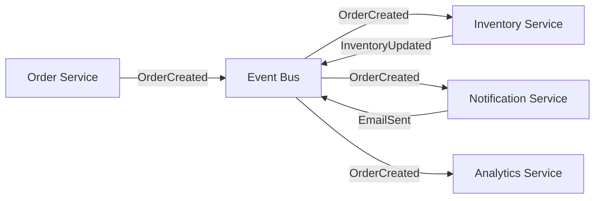

# Типи архітектур програмного забезпечення

## Вступ

Архітектура програмного забезпечення визначає фундаментальну структуру системи, організацію її компонентів, їх взаємодію та принципи проєктування. Вибір правильної архітектури є одним з найважливіших рішень при розробці програмного продукту, оскільки він впливає на масштабованість, продуктивність, підтримуваність та загальну якість системи.

Архітектура програмного забезпечення формує технічний фундамент проєкту та визначає, наскільки легко буде додавати нові функції, виправляти помилки та адаптувати систему до змінних вимог. Неправильний вибір архітектури на початковому етапі може призвести до серйозних проблем у майбутньому, коли система почне зростати та ускладнюватися. Зміна архітектури в процесі розробки або після випуску продукту зазвичай вимагає значних ресурсів та часу.

Не існує універсальної архітектури, яка підходить для всіх типів застосунків. Кожна архітектура має свої переваги та недоліки, і вибір залежить від конкретних вимог проєкту, технічних обмежень, очікуваного навантаження та багатьох інших факторів. У цій лекції ми розглянемо основні типи архітектур програмного забезпечення, їх характеристики, переваги та недоліки, а також сценарії їх застосування.

## Основні концепції архітектури програмного забезпечення

### Що таке архітектура ПЗ

Архітектура програмного забезпечення описує високорівневу структуру системи та визначає, як різні компоненти взаємодіють між собою. Вона включає набір рішень щодо організації коду, розподілу відповідальностей, способів комунікації між модулями та принципів побудови системи.

Архітектурні рішення впливають на ключові якості системи. Масштабованість визначає здатність системи обробляти зростаюче навантаження. Продуктивність характеризує швидкість відгуку системи та ефективність використання ресурсів. Надійність означає здатність системи функціонувати без збоїв. Підтримуваність відображає легкість внесення змін та виправлення помилок. Безпека забезпечує захист даних та функціональності від несанкціонованого доступу.



Архітектура визначається на різних рівнях абстракції. Системна архітектура описує розподіл функціональності між різними системами або підсистемами. Архітектура застосунку визначає структуру окремого програмного продукту. Архітектура модуля або компонента деталізує внутрішню організацію окремих частин системи.

### Архітектурні стилі та шаблони

Архітектурний стиль це загальний підхід до організації системи, який визначає набір компонентів, їх типи та правила взаємодії. Архітектурні стилі є більш абстрактними та загальними, ніж конкретні патерни проєктування. Вони задають філософію побудови системи та основні принципи її організації.

Найпоширеніші архітектурні стилі включають монолітну архітектуру, де весь застосунок є єдиним цілим, багатошарову архітектуру з розділенням на логічні рівні, клієнт-серверну архітектуру з розподілом між клієнтською та серверною частинами, мікросервісну архітектуру з розбиттям на невеликі незалежні сервіси, та event-driven архітектуру, де компоненти взаємодіють через події.

Кожен архітектурний стиль має свої характеристики, переваги та обмеження. Вибір стилю залежить від вимог проєкту, очікуваного масштабу системи, навичок команди розробників та технологічних обмежень. Часто в одному проєкті поєднуються елементи різних архітектурних стилів для досягнення оптимального балансу між різними якісними атрибутами.

## Монолітна архітектура

### Характеристики монолітної архітектури

Монолітна архітектура представляє традиційний підхід до побудови програмного забезпечення, де весь застосунок розробляється як єдина нероздільна одиниця. Всі компоненти системи інтерфейс користувача, бізнес-логіка, робота з даними об'єднані в один виконуваний файл або пакет розгортання.



У монолітній архітектурі всі модулі працюють в одному процесі та спільно використовують пам'ять. Взаємодія між компонентами відбувається через виклики методів та функцій, без необхідності мережевої комунікації. Розгортання монолітного застосунку означає розгортання всієї системи цілком, навіть якщо змінено лише невелику частину коду.

Прикладом монолітної архітектури може бути веб-застосунок електронної комерції, де frontend, backend логіка обробки замовлень, управління каталогом товарів, система користувачів та інтеграція з платіжними системами знаходяться в одному проєкті.

```python
# Приклад структури монолітного застосунку
class MonolithicEcommerceApp:
    def __init__(self):
        self.user_service = UserService()
        self.product_service = ProductService()
        self.order_service = OrderService()
        self.payment_service = PaymentService()
        self.notification_service = NotificationService()

    def process_order(self, user_id, products):
        # Перевірка користувача
        user = self.user_service.get_user(user_id)
        if not user:
            return {"error": "Користувач не знайдений"}

        # Перевірка наявності товарів
        for product_id in products:
            product = self.product_service.get_product(product_id)
            if not product or product.stock < 1:
                return {"error": f"Товар {product_id} недоступний"}

        # Створення замовлення
        order = self.order_service.create_order(user_id, products)

        # Обробка платежу
        payment_result = self.payment_service.process_payment(
            order.total_amount,
            user.payment_method
        )

        if not payment_result.success:
            self.order_service.cancel_order(order.id)
            return {"error": "Помилка оплати"}

        # Відправка повідомлення
        self.notification_service.send_order_confirmation(user.email, order)

        # Оновлення запасів
        for product_id in products:
            self.product_service.decrease_stock(product_id, 1)

        return {"success": True, "order_id": order.id}
```

### Переваги монолітної архітектури

Простота розробки є однією з головних переваг монолітної архітектури. Розробники працюють з єдиною кодовою базою, використовуючи один стек технологій та одну мову програмування. Не потрібно налаштовувати складну взаємодію між різними сервісами або турбуватися про узгодженість даних між розподіленими компонентами.

Легкість тестування також є перевагою монолітів. Можна запустити всю систему локально та протестувати взаємодію всіх компонентів без необхідності піднімати кілька окремих сервісів. End-to-end тести виконуються в одному процесі, що спрощує налагодження та відтворення помилок.

Розгортання монолітного застосунку є простішим порівняно з розподіленими системами. Достатньо зібрати один артефакт та розгорнути його на сервері. Немає необхідності координувати розгортання множини сервісів або керувати складними залежностями між версіями різних компонентів.

Продуктивність для невеликих та середніх навантажень може бути вищою в монолітній архітектурі, оскільки взаємодія між компонентами відбувається в пам'яті без накладних витрат на мережеву комунікацію. Транзакції можуть охоплювати всю систему без необхідності розподілених транзакцій.

### Недоліки монолітної архітектури

Складність підтримки зростає разом з розміром кодової бази. Коли застосунок досягає десятків або сотень тисяч рядків коду, стає важко розуміти всі взаємозв'язки між компонентами. Зміни в одній частині системи можуть непередбачувано вплинути на інші частини.

Обмежена масштабованість є серйозним недоліком монолітів. Неможливо масштабувати окремі компоненти системи горизонтально можна лише збільшити потужність сервера або запустити кілька повних копій всього застосунку. Якщо лише один модуль потребує більше ресурсів, доводиться масштабувати всю систему.

Технологічна прив'язка означає, що всі компоненти монолітного застосунку використовують один стек технологій. Складно або неможливо використати різні мови програмування для різних модулів. Перехід на нову технологію вимагає переписування всього застосунку або його великих частин.

Тривалий цикл розгортання виникає через те, що навіть невелика зміна вимагає пересборки та розгортання всього застосунку. У великих командах це може створювати конфлікти, коли різні розробники одночасно намагаються випустити свої зміни.

### Коли використовувати монолітну архітектуру

Монолітна архітектура добре підходить для невеликих та середніх проєктів, де складність системи є керованою та не очікується значного масштабування. Для стартапів та MVP монолітний підхід дозволяє швидко розробити та випустити продукт без витрат на налаштування складної інфраструктури.

Проєкти з невеликою командою розробників можуть ефективно використовувати монолітну архітектуру, оскільки координація між розробниками простіша, коли всі працюють з однією кодовою базою. Для застосунків з чітко визначеною функціональністю, яка не змінюється часто, монолітний підхід може бути оптимальним.

Внутрішні корпоративні системи з обмеженою кількістю користувачів та передбачуваним навантаженням часто реалізуються як монолітні застосунки. Для навчальних проєктів монолітна архітектура дозволяє зосередитися на бізнес-логіці без відволікання на питання розподілених систем.

## Багатошарова архітектура

### Концепція шарів у архітектурі

Багатошарова або n-tier архітектура організовує застосунок у логічні горизонтальні шари, де кожен шар має специфічну відповідальність та взаємодіє лише з сусідніми шарами. Така організація забезпечує чітке розділення відповідальностей та полегшує розуміння структури системи.



Типова багатошарова архітектура включає рівень представлення для взаємодії з користувачем, рівень бізнес-логіки для реалізації правил та процесів, рівень доступу до даних для роботи з базою даних, та саму базу даних для зберігання інформації. Кожен шар залежить лише від шару безпосередньо під ним, що створює односпрямований потік залежностей.

Принцип організації шарів полягає в тому, що вищі шари використовують сервіси нижчих шарів, але не навпаки. Рівень представлення може викликати методи бізнес-логіки, але бізнес-логіка не повинна безпосередньо взаємодіяти з UI компонентами. Це забезпечує слабку зв'язаність та можливість заміни реалізації окремих шарів.

```python
# Приклад багатошарової архітектури

# Data Access Layer
class UserRepository:
    def __init__(self, database):
        self.db = database

    def find_by_id(self, user_id):
        query = "SELECT * FROM users WHERE id = ?"
        result = self.db.execute(query, (user_id,))
        return self._map_to_user(result) if result else None

    def find_by_email(self, email):
        query = "SELECT * FROM users WHERE email = ?"
        result = self.db.execute(query, (email,))
        return self._map_to_user(result) if result else None

    def save(self, user):
        if user.id:
            query = "UPDATE users SET name=?, email=? WHERE id=?"
            self.db.execute(query, (user.name, user.email, user.id))
        else:
            query = "INSERT INTO users (name, email) VALUES (?, ?)"
            user.id = self.db.execute(query, (user.name, user.email))
        return user

    def _map_to_user(self, data):
        return User(data['id'], data['name'], data['email'])

# Business Logic Layer
class UserService:
    def __init__(self, user_repository, email_service):
        self.repository = user_repository
        self.email_service = email_service

    def register_user(self, name, email, password):
        # Валідація
        if not self._validate_email(email):
            raise ValueError("Некоректний email")

        if len(password) < 8:
            raise ValueError("Пароль занадто короткий")

        # Перевірка унікальності
        existing_user = self.repository.find_by_email(email)
        if existing_user:
            raise ValueError("Користувач вже існує")

        # Створення користувача
        user = User(None, name, email)
        user.password_hash = self._hash_password(password)

        # Збереження
        saved_user = self.repository.save(user)

        # Відправка вітального email
        self.email_service.send_welcome_email(saved_user.email)

        return saved_user

    def _validate_email(self, email):
        return '@' in email and '.' in email

    def _hash_password(self, password):
        return f"hashed_{password}"

# Presentation Layer
class UserController:
    def __init__(self, user_service):
        self.service = user_service

    def register(self, request_data):
        try:
            user = self.service.register_user(
                request_data['name'],
                request_data['email'],
                request_data['password']
            )
            return {
                'status': 'success',
                'data': {
                    'id': user.id,
                    'name': user.name,
                    'email': user.email
                }
            }
        except ValueError as e:
            return {
                'status': 'error',
                'message': str(e)
            }
```

### Переваги багатошарової архітектури

Чітке розділення відповідальностей є основною перевагою багатошарової архітектури. Кожен шар має чітко визначену роль та не втручається в роботу інших шарів. UI логіка відокремлена від бізнес-правил, а бізнес-логіка не залежить від конкретної технології зберігання даних.

Легкість тестування досягається через можливість тестувати кожен шар незалежно. Бізнес-логіку можна тестувати без реальної бази даних, використовуючи mock об'єкти для рівня доступу до даних. UI можна тестувати окремо від складної бізнес-логіки.

Повторне використання коду стає простішим, оскільки бізнес-логіка не прив'язана до конкретного інтерфейсу користувача. Один і той же сервісний шар може використовуватися веб-застосунком, мобільним додатком та API для партнерів.

Можливість заміни реалізації окремих шарів без впливу на інші частини системи робить архітектуру гнучкою. Можна змінити базу даних або ORM без модифікації бізнес-логіки. Можна переробити UI без торкання до сервісного шару.

### Варіації багатошарової архітектури

Трьохшарова архітектура є найпоширенішою реалізацією, яка включає рівень представлення, бізнес-логіки та доступу до даних. Ця структура добре підходить для більшості веб-застосунків та бізнес-систем.

Чотиришарова архітектура додає окремий шар для доменної моделі між бізнес-логікою та доступом до даних. Це дозволяє чіткіше відокремити об'єкти предметної області від деталей персистентності та забезпечує кращу організацію складних доменних моделей.

Розширена багатошарова архітектура може включати додаткові шари для кросфункціональних аспектів, таких як безпека, логування, кешування. Ці шари можуть бути реалізовані як вертикальні або горизонтальні залежно від потреб системи.

## Клієнт-серверна архітектура

### Основи клієнт-серверної моделі

Клієнт-серверна архітектура розподіляє функціональність між двома типами компонентів: клієнтами, які ініціюють запити, та серверами, які обробляють ці запити та повертають відповіді. Така архітектура є основою більшості сучасних розподілених систем та мережевих застосунків.



Сервер централізує бізнес-логіку, управління даними та забезпечення безпеки. Клієнти зосереджуються на представленні інформації користувачеві та збиранні його введення. Така організація дозволяє мати множину клієнтів різних типів, які взаємодіють з одним сервером.

Взаємодія між клієнтом та сервером зазвичай відбувається через мережу за допомогою стандартизованих протоколів. HTTP є найпоширенішим протоколом для веб-застосунків. WebSocket використовується для двостороннього реал-тайм зв'язку. gRPC застосовується для високопродуктивної комунікації між сервісами.

```python
# Приклад простого клієнт-серверного застосунку

# Серверна частина (Flask)
from flask import Flask, request, jsonify

app = Flask(__name__)

class TaskService:
    def __init__(self):
        self.tasks = []
        self.next_id = 1

    def create_task(self, title, description):
        task = {
            'id': self.next_id,
            'title': title,
            'description': description,
            'completed': False
        }
        self.tasks.append(task)
        self.next_id += 1
        return task

    def get_all_tasks(self):
        return self.tasks

    def get_task(self, task_id):
        for task in self.tasks:
            if task['id'] == task_id:
                return task
        return None

    def update_task(self, task_id, completed):
        task = self.get_task(task_id)
        if task:
            task['completed'] = completed
            return task
        return None

task_service = TaskService()

@app.route('/api/tasks', methods=['GET'])
def get_tasks():
    tasks = task_service.get_all_tasks()
    return jsonify(tasks)

@app.route('/api/tasks', methods=['POST'])
def create_task():
    data = request.json
    task = task_service.create_task(data['title'], data['description'])
    return jsonify(task), 201

@app.route('/api/tasks/<int:task_id>', methods=['PUT'])
def update_task(task_id):
    data = request.json
    task = task_service.update_task(task_id, data['completed'])
    if task:
        return jsonify(task)
    return jsonify({'error': 'Task not found'}), 404

# Клієнтська частина (Python requests)
import requests

class TaskClient:
    def __init__(self, base_url):
        self.base_url = base_url

    def get_tasks(self):
        response = requests.get(f"{self.base_url}/api/tasks")
        return response.json()

    def create_task(self, title, description):
        data = {'title': title, 'description': description}
        response = requests.post(f"{self.base_url}/api/tasks", json=data)
        return response.json()

    def complete_task(self, task_id):
        data = {'completed': True}
        response = requests.put(f"{self.base_url}/api/tasks/{task_id}", json=data)
        return response.json()

# Використання клієнта
client = TaskClient('http://localhost:5000')
new_task = client.create_task('Вивчити архітектури', 'Прочитати лекцію про типи архітектур')
print(f"Створено завдання: {new_task}")

tasks = client.get_tasks()
print(f"Всього завдань: {len(tasks)}")
```

### Типи клієнт-серверних архітектур

Тонкий клієнт містить мінімум логіки та в основному відповідає за відображення даних. Вся обробка відбувається на сервері. Приклади включають веб-застосунки, де браузер лише відображає HTML від сервера, та термінальні клієнти для mainframe систем.

Товстий клієнт містить значну частину бізнес-логіки та може працювати частково або повністю офлайн. Десктопні застосунки часто є товстими клієнтами, які виконують складну обробку локально та звертаються до сервера лише для синхронізації даних або виконання специфічних операцій.

Гібридний підхід поєднує переваги обох моделей. Сучасні Single Page Applications є прикладом, де клієнт містить логіку представлення та частину бізнес-логіки для валідації, але звертається до сервера для всіх операцій з даними та складної обробки.

### Переваги та недоліки клієнт-серверної архітектури

Централізоване управління є головною перевагою. Бізнес-логіка та дані знаходяться на сервері, що спрощує їх оновлення та забезпечення консистентності. Не потрібно розгортати зміни на всіх клієнтських машинах для оновлення логіки.

Масштабованість досягається через можливість додавати серверні ресурси незалежно від кількості клієнтів. Кілька серверів можуть обслуговувати тисячі клієнтів, розподіляючи навантаження між собою.

Безпека покращується, оскільки чутливі дані та критична логіка зберігаються на сервері під контролем організації. Клієнти не мають прямого доступу до бази даних, а лише через контрольований API сервера.

Недоліком є залежність від мережі. Клієнти не можуть працювати без з'єднання з сервером, що може бути проблемою в умовах нестабільного інтернету. Навантаження на сервер може бути значним при великій кількості одночасних клієнтів, що вимагає потужної інфраструктури.

## Мікросервісна архітектура

### Концепція мікросервісів

Мікросервісна архітектура організовує застосунок як набір невеликих, незалежних сервісів, кожен з яких виконує специфічну бізнес-функцію. Кожен мікросервіс може бути розроблений, розгорнутий та масштабований незалежно від інших.



Кожен мікросервіс має власну базу даних та управляє своїми даними незалежно. Це забезпечує слабку зв'язаність та дозволяє сервісам еволюціонувати незалежно. Взаємодія між сервісами відбувається через добре визначені API, зазвичай REST або gRPC.

Мікросервіси можуть використовувати різні технології та мови програмування залежно від конкретних потреб. Один сервіс може бути написаний на Python, інший на Java, третій на Go. Це дає свободу вибирати найкращий інструмент для кожної задачі.

```python
# Приклад мікросервісної архітектури

# User Service (Flask)
from flask import Flask, jsonify, request

user_app = Flask(__name__)

class UserDatabase:
    def __init__(self):
        self.users = {}

    def create_user(self, user_data):
        user_id = len(self.users) + 1
        user = {'id': user_id, **user_data}
        self.users[user_id] = user
        return user

    def get_user(self, user_id):
        return self.users.get(user_id)

user_db = UserDatabase()

@user_app.route('/users', methods=['POST'])
def create_user():
    user = user_db.create_user(request.json)
    return jsonify(user), 201

@user_app.route('/users/<int:user_id>', methods=['GET'])
def get_user(user_id):
    user = user_db.get_user(user_id)
    if user:
        return jsonify(user)
    return jsonify({'error': 'User not found'}), 404

# Product Service (Flask)
product_app = Flask(__name__)

class ProductDatabase:
    def __init__(self):
        self.products = {}

    def create_product(self, product_data):
        product_id = len(self.products) + 1
        product = {'id': product_id, **product_data}
        self.products[product_id] = product
        return product

    def get_product(self, product_id):
        return self.products.get(product_id)

    def update_stock(self, product_id, quantity):
        product = self.products.get(product_id)
        if product:
            product['stock'] = product.get('stock', 0) + quantity
            return product
        return None

product_db = ProductDatabase()

@product_app.route('/products', methods=['POST'])
def create_product():
    product = product_db.create_product(request.json)
    return jsonify(product), 201

@product_app.route('/products/<int:product_id>', methods=['GET'])
def get_product(product_id):
    product = product_db.get_product(product_id)
    if product:
        return jsonify(product)
    return jsonify({'error': 'Product not found'}), 404

# Order Service (Flask)
import requests

order_app = Flask(__name__)

class OrderService:
    def __init__(self):
        self.orders = {}
        self.user_service_url = 'http://localhost:5001'
        self.product_service_url = 'http://localhost:5002'

    def create_order(self, user_id, product_ids):
        # Перевірка користувача
        user_response = requests.get(f'{self.user_service_url}/users/{user_id}')
        if user_response.status_code != 200:
            return None

        # Перевірка товарів
        products = []
        for product_id in product_ids:
            product_response = requests.get(
                f'{self.product_service_url}/products/{product_id}'
            )
            if product_response.status_code == 200:
                products.append(product_response.json())

        # Створення замовлення
        order_id = len(self.orders) + 1
        order = {
            'id': order_id,
            'user_id': user_id,
            'products': products,
            'status': 'created'
        }
        self.orders[order_id] = order
        return order

order_service = OrderService()

@order_app.route('/orders', methods=['POST'])
def create_order():
    data = request.json
    order = order_service.create_order(data['user_id'], data['product_ids'])
    if order:
        return jsonify(order), 201
    return jsonify({'error': 'Failed to create order'}), 400
```

### Переваги мікросервісної архітектури

Незалежне розгортання сервісів дозволяє оновлювати окремі частини системи без необхідності зупиняти та перезапускати весь застосунок. Команда може випускати нові версії свого сервісу кілька разів на день без координації з іншими командами.

Технологічна гнучкість дає можливість обирати найкращі інструменти для кожної задачі. Сервіс обробки зображень може бути написаний на Python з використанням спеціалізованих бібліотек, тоді як сервіс платежів може використовувати Java для надійності та продуктивності.

Масштабованість окремих сервісів означає, що можна збільшувати потужність лише тих компонентів, які відчувають високе навантаження. Якщо сервіс каталогу товарів отримує багато запитів, можна запустити додаткові його екземпляри без масштабування всієї системи.

Відмовостійкість покращується через ізоляцію сервісів. Якщо один мікросервіс падає, інші можуть продовжувати працювати. Правильно спроєктована система може деградувати частково, зберігаючи основну функціональність навіть при відмові деяких компонентів.

### Виклики мікросервісної архітектури

Складність розподіленої системи є основним викликом. Замість одного застосунку потрібно керувати десятками або сотнями сервісів. Налагодження проблем стає складнішим, оскільки запит може проходити через кілька сервісів, і потрібно відстежувати його шлях через всю систему.

Консистентність даних важко забезпечити, коли кожен сервіс має власну базу даних. Транзакції, що охоплюють кілька сервісів, вимагають використання складних патернів, таких як Saga або event sourcing. Eventual consistency стає нормою замість immediate consistency.

Мережева комунікація між сервісами додає латентність та є додатковою точкою відмови. Кожен виклик API через мережу може зазнати невдачі, і система повинна бути готова до цього. Потрібно реалізовувати retry логіку, circuit breakers та інші механізми підвищення надійності.

Операційна складність зростає через необхідність моніторингу, логування та трейсингу запитів через множину сервісів. Потрібна складна інфраструктура для service discovery, load balancing, API gateway. Deployment pipeline стає складнішим з необхідністю координувати версії різних сервісів.

### Коли використовувати мікросервіси

Великі команди розробників можуть ефективно працювати з мікросервісами, де кожна команда володіє одним або кількома сервісами. Це дозволяє командам працювати незалежно та приймати технічні рішення без необхідності узгоджувати з усією організацією.

Застосунки з різними вимогами до масштабування виграють від мікросервісної архітектури. Якщо одна частина системи потребує горизонтального масштабування, а інша ні, мікросервіси дозволяють масштабувати лише необхідні компоненти.

Довгострокові проєкти з очікуванням еволюції можуть використовувати мікросервіси для забезпечення гнучкості. Можливість поступово переписувати або замінювати окремі сервіси без впливу на всю систему є цінною для систем, що розвиваються роками.

Не варто використовувати мікросервіси для невеликих проєктів або стартапів на ранніх стадіях. Складність мікросервісної архітектури може уповільнити розробку та відволікти ресурси від створення бізнес-функціональності. Краще почати з монолітної архітектури та поступово переходити до мікросервісів, коли це стане необхідним.

## Event-Driven архітектура

### Концепція подієвої архітектури

Event-Driven архітектура організовує взаємодію компонентів системи через генерацію, виявлення та обробку подій. Подія представляє зміну стану або важливу подію в системі. Компоненти можуть генерувати події та підписуватися на події інших компонентів без прямої залежності між ними.



Події є асинхронними повідомленнями, які містять інформацію про те, що сталося в системі. На відміну від синхронних викликів, де відправник чекає на відповідь, у подієвій архітектурі відправник просто публікує подію та продовжує роботу. Підписники отримують події та обробляють їх незалежно.

Event Bus або Message Broker є центральним компонентом подієвої архітектури. Він приймає події від publishers та доставляє їх до subscribers. Популярні реалізації включають RabbitMQ, Apache Kafka, AWS EventBridge. Брокер забезпечує надійну доставку подій навіть якщо підписники тимчасово недоступні.

```python
# Приклад Event-Driven архітектури

# Простий in-memory Event Bus
class EventBus:
    def __init__(self):
        self.subscribers = {}

    def subscribe(self, event_type, handler):
        if event_type not in self.subscribers:
            self.subscribers[event_type] = []
        self.subscribers[event_type].append(handler)

    def publish(self, event_type, event_data):
        print(f"[EventBus] Публікація події: {event_type}")
        if event_type in self.subscribers:
            for handler in self.subscribers[event_type]:
                try:
                    handler(event_data)
                except Exception as e:
                    print(f"[EventBus] Помилка обробки події: {e}")

# Order Service - генератор подій
class OrderService:
    def __init__(self, event_bus):
        self.event_bus = event_bus
        self.orders = {}

    def create_order(self, user_id, items):
        order_id = len(self.orders) + 1
        order = {
            'id': order_id,
            'user_id': user_id,
            'items': items,
            'status': 'created',
            'total': sum(item['price'] for item in items)
        }
        self.orders[order_id] = order

        # Публікація події
        self.event_bus.publish('OrderCreated', order)

        return order

    def handle_payment_processed(self, event_data):
        order_id = event_data['order_id']
        if order_id in self.orders:
            self.orders[order_id]['status'] = 'paid'
            print(f"[OrderService] Замовлення {order_id} оплачено")

            # Публікація наступної події
            self.event_bus.publish('OrderPaid', self.orders[order_id])

# Inventory Service - підписник на події
class InventoryService:
    def __init__(self, event_bus):
        self.event_bus = event_bus
        self.inventory = {}
        event_bus.subscribe('OrderCreated', self.handle_order_created)

    def handle_order_created(self, order_data):
        print(f"[InventoryService] Обробка замовлення {order_data['id']}")

        # Резервування товарів
        for item in order_data['items']:
            if item['product_id'] in self.inventory:
                self.inventory[item['product_id']] -= item['quantity']

        # Публікація події про резервування
        self.event_bus.publish('InventoryReserved', {
            'order_id': order_data['id'],
            'items': order_data['items']
        })

# Payment Service - підписник на події
class PaymentService:
    def __init__(self, event_bus):
        self.event_bus = event_bus
        event_bus.subscribe('InventoryReserved', self.handle_inventory_reserved)

    def handle_inventory_reserved(self, event_data):
        order_id = event_data['order_id']
        print(f"[PaymentService] Обробка оплати для замовлення {order_id}")

        # Симуляція обробки платежу
        payment_success = True

        if payment_success:
            self.event_bus.publish('PaymentProcessed', {
                'order_id': order_id,
                'status': 'success'
            })

# Notification Service - підписник на події
class NotificationService:
    def __init__(self, event_bus):
        self.event_bus = event_bus
        event_bus.subscribe('OrderCreated', self.handle_order_created)
        event_bus.subscribe('OrderPaid', self.handle_order_paid)

    def handle_order_created(self, order_data):
        print(f"[NotificationService] Відправка підтвердження замовлення користувачу {order_data['user_id']}")

    def handle_order_paid(self, order_data):
        print(f"[NotificationService] Відправка повідомлення про оплату користувачу {order_data['user_id']}")

# Analytics Service - підписник на події
class AnalyticsService:
    def __init__(self, event_bus):
        self.event_bus = event_bus
        self.stats = {'orders': 0, 'revenue': 0}
        event_bus.subscribe('OrderPaid', self.handle_order_paid)

    def handle_order_paid(self, order_data):
        self.stats['orders'] += 1
        self.stats['revenue'] += order_data['total']
        print(f"[AnalyticsService] Оновлення статистики: {self.stats}")

# Використання
event_bus = EventBus()

order_service = OrderService(event_bus)
inventory_service = InventoryService(event_bus)
payment_service = PaymentService(event_bus)
notification_service = NotificationService(event_bus)
analytics_service = AnalyticsService(event_bus)

# Підписка Order Service на подію оплати
event_bus.subscribe('PaymentProcessed', order_service.handle_payment_processed)

# Створення замовлення запускає ланцюжок подій
print("\n=== Створення замовлення ===\n")
order = order_service.create_order(
    user_id=1,
    items=[
        {'product_id': 101, 'quantity': 2, 'price': 500},
        {'product_id': 102, 'quantity': 1, 'price': 1000}
    ]
)
```

### Переваги подієвої архітектури

Слабка зв'язаність між компонентами є основною перевагою. Генератор події не знає, хто буде її обробляти. Підписники не знають, хто генерує події. Це дозволяє легко додавати нові обробники подій без зміни існуючого коду.

Асинхронна обробка дозволяє системі залишатися responsive навіть при виконанні довготривалих операцій. Користувач отримує швидку відповідь, а складна обробка відбувається у фоновому режимі. Це покращує користувацький досвід та дозволяє ефективно використовувати ресурси.

Масштабованість досягається через можливість додавати множину обробників для одного типу події. Якщо обробка певної події стає вузьким місцем, можна запустити додаткові екземпляри обробника для розподілу навантаження.

Розширюваність системи спрощується, оскільки нову функціональність можна додати шляхом створення нового підписника на існуючі події. Не потрібно модифікувати код, що генерує події, для інтеграції нових функцій.

### Виклики подієвої архітектури

Складність відстеження потоку виконання виникає через асинхронну природу системи. Запит користувача може запустити ланцюжок подій через множину сервісів, і важко відстежити весь шлях виконання. Потрібні спеціалізовані інструменти для трейсингу розподілених транзакцій.

Eventual consistency означає, що система не завжди знаходиться в консистентному стані в певний момент часу. Після публікації події потрібен час, поки всі підписники її обробять. Це може створювати проблеми для операцій, що вимагають негайної консистентності.

Обробка помилок ускладнюється в асинхронних системах. Якщо обробка події завершилася невдачею, потрібна стратегія для повторної обробки або компенсуючих дій. Dead letter queues та retry механізми є необхідними компонентами надійної подієвої системи.

Дублювання подій може відбуватися через мережеві проблеми або збої в системі. Обробники подій повинні бути ідемпотентними, тобто повторна обробка тієї самої події не повинна призводити до небажаних побічних ефектів.

### Коли використовувати подієву архітектуру

Системи з асинхронними процесами природним чином підходять для подієвої архітектури. Обробка замовлень, генерація звітів, відправка повідомлень це приклади завдань, які можуть виконуватися асинхронно після ініціюючої дії користувача.

Інтеграція між незалежними системами спрощується через події. Різні системи можуть обмінюватися інформацією через події без створення прямих залежностей між ними. Це особливо корисно в корпоративному середовищі з множиною legacy систем.

Системи реального часу, такі як чат-додатки, ігри або фінансові платформи, можуть використовувати подієву архітектуру для швидкої реакції на зміни стану. Події дозволяють миттєво поширювати інформацію між компонентами системи.

Аудит та логування природним чином вписуються в подієву архітектуру. Всі важливі дії в системі можуть генерувати події, які зберігаються для подальшого аналізу, аудиту або відтворення стану системи.

## Порівняння архітектур та вибір

### Критерії вибору архітектури

Вибір архітектури залежить від множини факторів, які потрібно ретельно оцінити перед прийняттям рішення. Розмір та складність проєкту є першим фактором. Невеликі проєкти з простою функціональністю можуть ефективно використовувати монолітну архітектуру. Великі корпоративні системи можуть потребувати мікросервісної або подієвої архітектури.

Розмір та досвід команди розробників впливають на вибір архітектури. Невелика команда може не мати ресурсів для підтримки складної мікросервісної системи. Велика організація з множиною команд може виграти від розподілу відповідальності через мікросервіси.

Очікуване навантаження та вимоги до масштабування визначають, наскільки гнучкою має бути архітектура. Якщо очікується значне зростання користувачів або нерівномірне навантаження на різні частини системи, варто розглянути архітектури, що підтримують горизонтальне масштабування окремих компонентів.

Вимоги до продуктивності та відгуку системи також важливі. Деякі застосунки потребують мінімальної латентності, інші можуть толерувати асинхронну обробку. Критичні для бізнесу транзакції можуть вимагати сильної консистентності, тоді як аналітичні системи можуть працювати з eventual consistency.

Технологічні обмеження та існуюча інфраструктура впливають на можливі варіанти. Якщо організація вже має expertise в певних технологіях або інфраструктурі, варто враховувати це при виборі архітектури. Перехід на принципово нову архітектуру може вимагати значних інвестицій у навчання та інструменти.

### Еволюція архітектури

Архітектура системи не є статичною та може еволюціонувати разом з ростом проєкту. Типовий шлях еволюції починається з монолітної архітектури для швидкого створення MVP та валідації бізнес-ідеї. Після досягнення product-market fit та зростання користувацької бази може виникнути потреба в кращій масштабованості.

Перехід до багатошарової архітектури часто є першим кроком рефакторингу монолітного застосунку. Чітке розділення на шари полегшує подальшу модуляризацію та виділення окремих сервісів. Поступове виділення мікросервісів дозволяє отримувати переваги розподіленої архітектури без необхідності переписувати всю систему одразу.

Strangler Fig Pattern є ефективною стратегією для поступової міграції від монолітної до мікросервісної архітектури. Нова функціональність додається як окремі мікросервіси, а існуюча функціональність поступово виноситься з монолітного ядра. Поки продовжує існувати монолітне ядро, але воно поступово зменшується, поки не зникне повністю.

Гібридні підходи часто є найпрактичнішим рішенням. Не обов'язково вибирати одну архітектуру для всього застосунку. Критичні модулі можуть бути реалізовані як мікросервіси, тоді як менш важливі частини залишаються в монолітному ядрі. Подієва архітектура може використовуватися для певних підсистем, де це доречно.

## Висновки

Архітектура програмного забезпечення є фундаментальним аспектом розробки, який визначає якість, підтримуваність та успіх системи. Не існує універсальної архітектури, яка підходить для всіх проєктів. Кожен тип архітектури має свої переваги та недоліки, які потрібно враховувати в контексті конкретних вимог та обмежень.

Монолітна архітектура залишається актуальною для невеликих та середніх проєктів завдяки своїй простоті та швидкості розробки. Багатошарова архітектура забезпечує чітку організацію коду та полегшує підтримку середніх за розміром систем. Клієнт-серверна архітектура є основою більшості сучасних мережевих застосунків.

Мікросервісна архітектура надає максимальну гнучкість та масштабованість для великих корпоративних систем, але вимагає значних ресурсів та expertise для ефективної реалізації. Event-Driven архітектура дозволяє створювати високореактивні системи зі слабкою зв'язаністю між компонентами.

Успішний вибір архітектури вимагає глибокого розуміння вимог проєкту, можливостей команди та довгострокових цілей системи. Важливо пам'ятати, що архітектура може еволюціонувати разом з проєктом. Розпочати з простої архітектури та поступово переходити до більш складної у міру необхідності часто є розумнішою стратегією, ніж відразу створювати складну систему для невизначених майбутніх потреб.

Розуміння різних типів архітектур та вміння обирати відповідну для конкретної ситуації є ключовою навичкою інженера програмного забезпечення. Практичний досвід роботи з різними архітектурами допомагає розвивати інтуїцію щодо архітектурних рішень та усвідомлювати компроміси, пов'язані з кожним вибором.

## Питання для самоперевірки

1. Що таке архітектура програмного забезпечення та чому вона важлива?
2. Які основні характеристики монолітної архітектури? Коли вона є доречним вибором?
3. Поясніть принцип організації багатошарової архітектури. Які переваги вона надає?
4. У чому полягає різниця між тонким та товстим клієнтом у клієнт-серверній архітектурі?
5. Які основні принципи мікросервісної архітектури? Які виклики вона створює?
6. Як працює Event-Driven архітектура? Які її переваги над синхронною взаємодією?
7. Які фактори потрібно враховувати при виборі архітектури для нового проєкту?
8. Опишіть можливий шлях еволюції архітектури від монолітної до мікросервісної.
9. Чому гібридні підходи до архітектури часто є практичним рішенням?
10. Які якісні атрибути системи визначаються архітектурними рішеннями?
