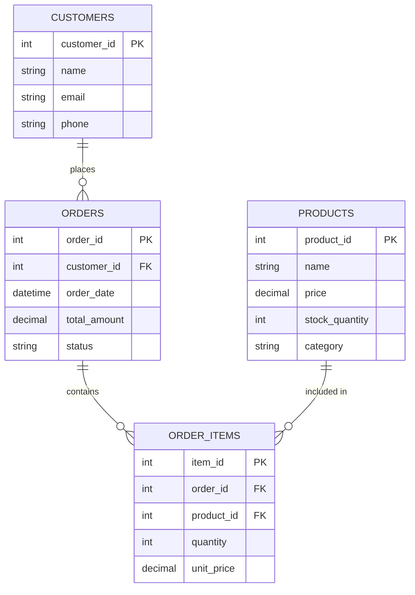
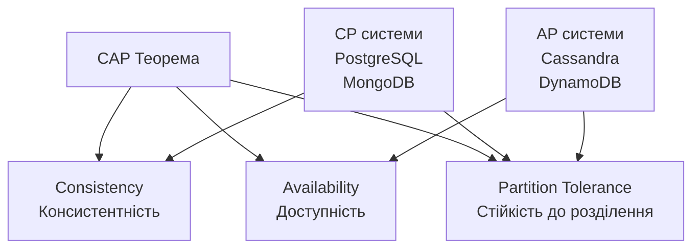
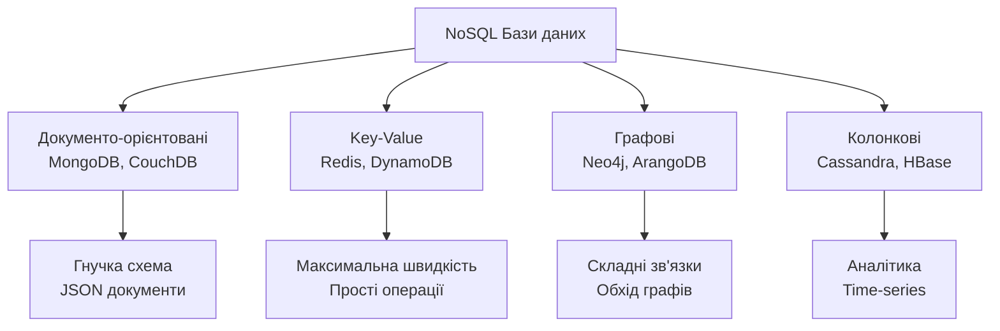
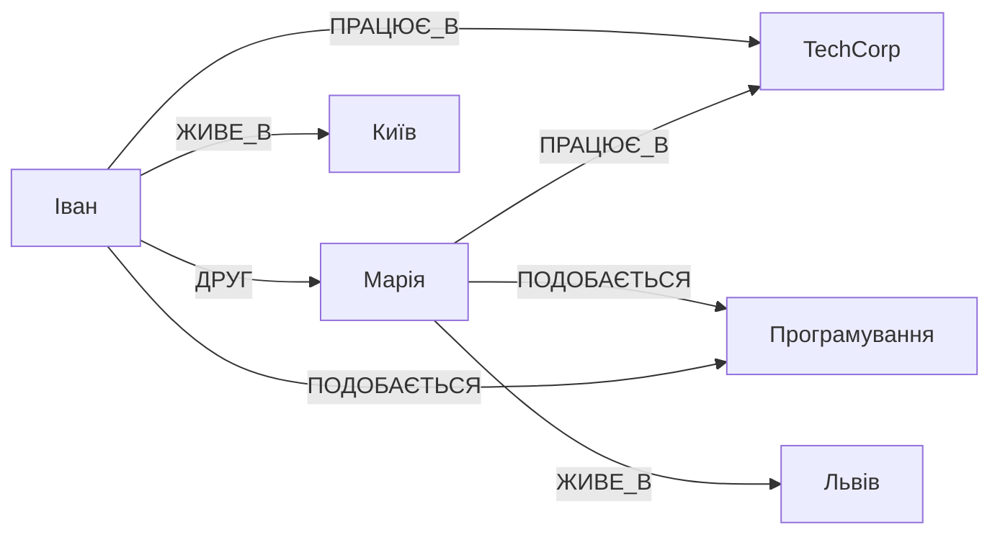
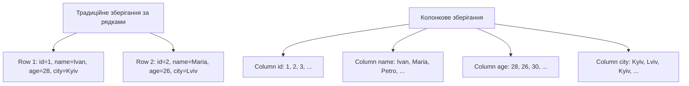
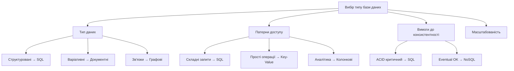
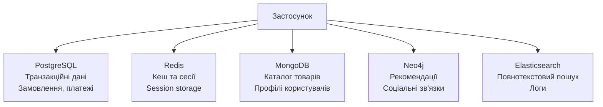

# Лекція 10. Робота з базами даних: реляційні та NoSQL

## Вступ

Бази даних є фундаментальним компонентом практично всіх сучасних програмних систем. Від простих мобільних додатків до складних корпоративних платформ - усі вони потребують надійного зберігання, організації та обробки даних. Вибір правильного типу бази даних та розуміння принципів роботи з нею безпосередньо впливають на продуктивність, масштабованість та надійність застосунку.

Протягом останніх десятиліть ландшафт баз даних суттєво змінився. Традиційні реляційні бази даних, які домінували з 1970-х років, отримали альтернативу у вигляді NoSQL систем. Сучасний інженер програмного забезпечення повинен розуміти сильні та слабкі сторони обох підходів, вміти обирати оптимальне рішення для конкретної задачі та ефективно працювати з різними типами баз даних.

У цій лекції ми розглянемо фундаментальні концепції реляційних та NoSQL баз даних, їхні відмінності, сценарії використання та практичні аспекти роботи з ними. Особлива увага буде приділена порівнянню підходів та методології вибору правильного рішення для конкретного проєкту.

## Реляційні бази даних

### Фундаментальні концепції

Реляційна модель даних, запропонована Едгаром Коддом у 1970 році, базується на математичній теорії множин та відношень. В основі моделі лежить концепція таблиці, яка представляє певну сутність предметної області. Таблиця складається з рядків та стовпців, де кожен рядок представляє окремий екземпляр сутності, а стовпці визначають її атрибути.

Первинний ключ є критично важливим елементом реляційної моделі. Це стовпець або комбінація стовпців, значення яких унікально ідентифікують кожен рядок у таблиці. Первинний ключ не може містити NULL значення та повинен бути незмінним протягом життя запису. Правильний вибір первинного ключа забезпечує ефективний доступ до даних та підтримку цілісності бази даних.

Зв'язки між таблицями реалізуються через зовнішні ключі. Зовнішній ключ це стовпець в одній таблиці, який посилається на первинний ключ іншої таблиці. Це дозволяє встановлювати логічні зв'язки між різними сутностями без фізичного дублювання даних.



### ACID властивості

ACID властивості визначають гарантії надійності транзакцій у реляційних базах даних. Атомарність означає, що транзакція виконується повністю або не виконується взагалі. Якщо під час виконання транзакції виникає помилка, всі зміни відкочуються, і база даних повертається до стану перед початком транзакції.

Консистентність гарантує, що транзакція переводить базу даних з одного валідного стану в інший валідний стан. Всі обмеження цілісності, визначені в схемі бази даних, повинні виконуватися до і після транзакції. База даних не дозволить завершити транзакцію, яка порушує встановлені правила.

Ізольованість забезпечує незалежність паралельних транзакцій. Результат виконання кількох одночасних транзакцій має бути таким самим, як при їх послідовному виконанні. Існують різні рівні ізоляції, які балансують між консистентністю та продуктивністю.

Довговічність гарантує, що після успішного завершення транзакції її результати будуть збережені навіть у разі збою системи. Зміни записуються на постійний носій інформації і можуть бути відновлені після перезавантаження.

### Structured Query Language

SQL є декларативною мовою програмування для роботи з реляційними базами даних. На відміну від імперативних мов, де програміст описує послідовність дій, в SQL описується бажаний результат, а система сама визначає найефективніший спосіб його отримання.

Вибірка даних виконується командою SELECT, яка дозволяє отримувати дані з однієї або кількох таблиць на основі заданих критеріїв.

```sql
SELECT
    c.name as customer_name,
    o.order_date,
    o.total_amount,
    COUNT(oi.item_id) as items_count
FROM customers c
INNER JOIN orders o ON c.customer_id = o.customer_id
INNER JOIN order_items oi ON o.order_id = oi.order_id
WHERE o.order_date >= '2024-01-01'
    AND o.status = 'completed'
GROUP BY c.customer_id, c.name, o.order_id, o.order_date, o.total_amount
HAVING COUNT(oi.item_id) > 2
ORDER BY o.order_date DESC
LIMIT 10;
```

JOIN операції дозволяють комбінувати дані з кількох пов'язаних таблиць в одному запиті. INNER JOIN повертає лише ті записи, для яких знайдено відповідність в обох таблицях. LEFT JOIN повертає всі записи з лівої таблиці та відповідні записи з правої, використовуючи NULL для відсутніх значень.

Модифікація даних виконується командами INSERT для додавання нових записів, UPDATE для зміни існуючих та DELETE для видалення. Критично важливо завжди використовувати WHERE для обмеження записів при UPDATE та DELETE.

```sql
-- Транзакція для переказу грошей
START TRANSACTION;

UPDATE accounts
SET balance = balance - 1000
WHERE account_id = 1 AND balance >= 1000;

UPDATE accounts
SET balance = balance + 1000
WHERE account_id = 2;

INSERT INTO transactions (from_account, to_account, amount, transaction_date)
VALUES (1, 2, 1000, CURRENT_TIMESTAMP);

COMMIT;
```

### Нормалізація даних

Нормалізація є процесом організації даних у базі для зменшення надмірності та підвищення цілісності. Перша нормальна форма вимагає, щоб кожен атрибут таблиці містив лише атомарні значення. Не допускається зберігання списків або наборів значень в одному полі.

Друга нормальна форма застосовується до таблиць з складеним первинним ключем. Вона вимагає, щоб усі неключові атрибути функціонально залежали від всього первинного ключа, а не тільки від його частини.

Третя нормальна форма усуває транзитивні залежності. Неключові атрибути не повинні залежати від інших неключових атрібутів. Кожен факт має зберігатися лише один раз у базі даних.

Хоча нормалізація усуває надмірність даних, іноді доцільна часткова денормалізація для покращення продуктивності. Додавання розрахункових полів або дублювання деяких даних може значно прискорити виконання складних запитів.

### Популярні реляційні СУБД

PostgreSQL є однією з найпотужніших open-source реляційних баз даних. Система відома своєю надійністю, дотриманням стандартів SQL та розширеними можливостями. PostgreSQL підтримує складні типи даних, включаючи JSON, масиви, геопросторові дані, що робить її універсальним рішенням для різноманітних застосунків.

MySQL залишається найпопулярнішою open-source базою даних завдяки простоті використання та хорошій продуктивності для типових вебзастосунків. Особливо популярна у веброзробці як частина стеку LAMP або LEMP. Система підтримує різні механізми зберігання даних, що дозволяє обирати оптимальний варіант для конкретних таблиць.

SQLite відрізняється від інших систем відсутністю окремого серверного процесу. База даних зберігається в одному файлі, а бібліотека SQLite вбудовується безпосередньо в застосунок. Це робить SQLite ідеальним вибором для мобільних додатків, настільних програм та вбудованих систем.

## NoSQL бази даних

### Передумови виникнення

Реляційні бази даних проектувалися в епоху, коли дані були структурованими, обсяги відносно невеликими, а масштабування досягалося через більш потужне обладнання. Однак інтернет-компанії зіткнулися з новими викликами, які важко вирішити в рамках традиційного підходу.

Експоненціальне зростання даних вимагало здатності зберігати та обробляти петабайти інформації. Вертикальне масштабування через більш потужні сервери досягло фізичних та економічних меж. Горизонтальне масштабування, коли навантаження розподіляється між багатьма серверами, виявилося складним для реляційних баз через необхідність підтримувати консистентність та транзакції.

Гнучкість схеми даних стала критичною вимогою для швидкої розробки. В реляційних базах зміна структури таблиць у production системах може вимагати тривалих простоїв. Різні записи можуть мати різні набори атрибутів, що природно моделюється в NoSQL, але вимагає складних рішень в реляційних системах.

### CAP теорема

CAP теорема формулює фундаментальне обмеження розподілених систем. Теорема стверджує, що розподілена система не може одночасно гарантувати консистентність, доступність та стійкість до розділення мережі. Система може забезпечити лише дві з трьох властивостей.



Консистентність означає, що всі вузли бачать однакові дані в один момент часу. Доступність гарантує, що кожен запит отримує відповідь, навіть якщо вона може не містити найсвіжіші дані. Стійкість до розділення означає, що система продовжує працювати навіть коли мережа між вузлами розділяється.

На противагу ACID властивостям реляційних баз, багато NoSQL систем дотримуються BASE моделі. Basically Available означає, що система гарантує доступність даних більшу частину часу. Soft State вказує, що стан системи може змінюватися навіть без нових запитів через eventual consistency. Eventually Consistent гарантує, що якщо не надходять нові оновлення, врешті-решт всі вузли досягнуть консистентного стану.

### Типи NoSQL баз даних



## Документо-орієнтовані бази даних

### Концепція та MongoDB

Документо-орієнтовані бази зберігають дані у вигляді документів, зазвичай в форматі JSON або BSON. Документ є самодостатнім об'єктом, який містить всю пов'язану інформацію. Це природний спосіб представлення даних, який відповідає об'єктам в програмному коді.

```json
{
  "_id": "507f1f77bcf86cd799439011",
  "name": "Ноутбук Dell XPS 15",
  "category": "Electronics",
  "price": 45999,
  "specifications": {
    "processor": "Intel Core i7",
    "ram": "16GB",
    "storage": "512GB SSD",
    "display": "15.6 inch 4K"
  },
  "reviews": [
    {
      "user": "user123",
      "rating": 5,
      "comment": "Чудовий ноутбук для розробки",
      "date": "2024-09-15"
    }
  ],
  "tags": ["laptop", "premium", "developer"],
  "in_stock": true,
  "last_updated": "2024-10-01T10:30:00Z"
}
```

Гнучка схема дозволяє різним документам у колекції мати різну структуру. Можна додавати нові поля без модифікації існуючих документів. Це надзвичайно корисно для швидкої розробки та еволюції структури даних.

MongoDB надає потужні можливості для запитів та агрегації даних.

```javascript
// Знайти всі електронні товари дорожче 20000
db.products.find({
  category: "Electronics",
  price: { $gt: 20000 }
}).sort({ price: -1 }).limit(10)

// Агрегація для обчислення середнього рейтингу
db.products.aggregate([
  { $unwind: "$reviews" },
  { $group: {
    _id: "$_id",
    name: { $first: "$name" },
    avgRating: { $avg: "$reviews.rating" },
    reviewCount: { $sum: 1 }
  }},
  { $sort: { avgRating: -1 }}
])
```

Реплікація через replica sets забезпечує високу доступність та резервування даних. Кілька серверів зберігають копії даних, і при відмові primary автоматично відбувається failover на secondary. Шардування дозволяє горизонтально масштабувати MongoDB для обробки великих обсягів даних.

### Коли використовувати документні бази

Каталоги товарів ідеально підходять для документних баз через варіативність атрибутів різних категорій товарів. Електроніка має специфікації, одяг має розміри та кольори, книги мають авторів та видавництва. Вкладені структури природно представляють такі різноманітні дані.

Системи управління контентом часто працюють з документами різної структури. Статті, відео, зображення мають різні метадані. Гнучкість схеми дозволяє зберігати різні типи контенту в одній колекції без складних спадкових ієрархій.

Real-time аналітика та логування виграють від продуктивності документних баз при записі та простоти зберігання структурованих подій. Кожна подія може містити довільний набір атрибутів залежно від типу події.

## Key-Value сховища

### Redis та принципи роботи

Key-value сховища є найпростішим типом NoSQL баз. Дані зберігаються як пари ключ-значення, де ключ унікально ідентифікує значення. Значення може бути будь-якими даними від простих рядків до складних об'єктів.

Redis позиціонується як структура даних сервер, оскільки підтримує не лише прості рядки, але й складні структури даних в пам'яті. Списки, множини, відсортовані множини, хеш-таблиці доступні з атомарними операціями.

```python
import redis

r = redis.Redis(host='localhost', port=6379, decode_responses=True)

# Кешування результатів запитів
r.setex('cache:products:electronics', 3600, json.dumps(products))

# Черги задач
r.lpush('queue:emails', json.dumps({'to': 'user@example.com', 'subject': 'Welcome'}))
task = r.rpop('queue:emails')

# Хеші для структурованих даних
r.hset('user:1000', mapping={
    'name': 'Іван Петренко',
    'email': 'ivan@example.com',
    'points': 150
})
r.hincrby('user:1000', 'points', 10)

# Leaderboard через sorted sets
r.zadd('leaderboard', {'player1': 1500, 'player2': 1200})
top_players = r.zrevrange('leaderboard', 0, 9, withscores=True)
```

Кешування є найпоширенішим використанням Redis. Результати складних запитів до бази даних або обчислень зберігаються в пам'яті для швидкого доступу. Механізм експірації автоматично видаляє застарілі дані.

Черги повідомлень реалізуються через списки Redis з блокуючими операціями. Session storage в Redis дозволяє масштабувати вебзастосунки горизонтально. Pub/Sub механізм дозволяє реалізувати real-time повідомлення.

## Графові бази даних

### Neo4j та модель графа

Графові бази даних спеціалізуються на зберіганні та обробці графів. Граф складається з вершин і ребер, які представляють сутності та зв'язки між ними. Ця модель природно відображає багато реальних систем від соціальних мереж до логістичних маршрутів.



Neo4j використовує мову запитів Cypher, яка має виразний синтаксис, що візуально нагадує структуру графа.

```cypher
// Створення вершин та зв'язків
CREATE (ivan:Person {name: 'Іван Петренко', age: 28})
CREATE (maria:Person {name: 'Марія Коваль', age: 26})
CREATE (tech:Company {name: 'TechCorp', industry: 'IT'})

CREATE (ivan)-[:FRIEND_OF {since: '2020-01-15'}]->(maria)
CREATE (ivan)-[:WORKS_AT {position: 'Developer'}]->(tech)

// Пошук друзів друзів
MATCH (person:Person {name: 'Іван Петренко'})-[:FRIEND_OF]-(friend)-[:FRIEND_OF]-(foaf)
WHERE NOT (person)-[:FRIEND_OF]-(foaf)
RETURN DISTINCT foaf.name

// Рекомендації людей зі спільними інтересами
MATCH (person:Person {name: 'Іван Петренко'})-[:HAS_SKILL]->(skill)<-[:HAS_SKILL]-(other)
WHERE NOT (person)-[:FRIEND_OF]-(other)
RETURN other.name, COUNT(skill) as common_skills
ORDER BY common_skills DESC
```

Соціальні мережі природно моделюються як графи. Запити типу "друзі друзів", "люди, яких ви можете знати", "найкоротший шлях між користувачами" виконуються ефективно в графовій моделі. Рекомендаційні системи використовують графи для знаходження схожих користувачів або товарів.

## Колонкові бази даних

### Apache Cassandra

Колонкові бази зберігають дані по стовпцях замість рядків. В традиційних реляційних базах рядок зберігається цілком, навіть якщо потрібні лише деякі поля. Колонкове зберігання дозволяє читати лише необхідні стовпці, що критично важливо для аналітичних запитів.



Cassandra є високомасштабованою колонковою базою даних, розробленою для обробки величезних обсягів даних на багатьох серверах. Система забезпечує високу доступність без єдиної точки відмови.

```cql
-- Створення keyspace
CREATE KEYSPACE ecommerce
WITH replication = {
  'class': 'NetworkTopologyStrategy',
  'datacenter1': 3
};

-- Створення таблиці
CREATE TABLE ecommerce.orders (
  user_id UUID,
  order_date TIMESTAMP,
  order_id UUID,
  total_amount DECIMAL,
  items LIST<TEXT>,
  PRIMARY KEY (user_id, order_date, order_id)
) WITH CLUSTERING ORDER BY (order_date DESC);
```

Data warehousing використовує колонкові бази для зберігання історичних даних. Time series data природно зберігаються в колонкових базах. IoT датчики генерують регулярні вимірювання з мітками часу.

## Порівняння та вибір рішення

### Критерії вибору



Тип даних та структура є першим фактором при виборі бази даних. Документи з варіативною структурою підходять для документних баз. Прості пари ключ-значення ефективно зберігаються в key-value сховищах. Складні зв'язки природно моделюються графами. Аналітичні дані оптимально зберігати в колонкових базах.

Патерни доступу до даних визначають оптимальну модель зберігання. Якщо більшість запитів отримують повний об'єкт за ключем, підходять key-value або документні бази. Якщо потрібні складні обходи графа, графова база буде ефективнішою. Для аналітичних запитів з агрегаціями краща колонкова база.

Вимоги до консистентності впливають на вибір між CP та AP системами. Фінансові системи вимагають сильної консистентності, тому краще обрати CP рішення або залишитися на реляційній базі. Для соціальних мереж eventual consistency часто прийнятна заради кращої доступності.

### Порівняльна таблиця

| Характеристика | Реляційні (SQL) | Документні | Key-Value | Графові | Колонкові |
|----------------|-----------------|------------|-----------|---------|-----------|
| **Схема даних** | Фіксована | Гнучка | Немає | Гнучка | Фіксована |
| **Масштабування** | Вертикальне | Горизонтальне | Горизонтальне | Вертикальне/Горизонтальне | Горизонтальне |
| **Консистентність** | ACID | Eventual/ACID | Eventual | ACID | Eventual |
| **Складні запити** | Відмінно | Добре | Обмежено | Відмінно для графів | Добре для аналітики |
| **Продуктивність** | Висока | Дуже висока | Максимальна | Висока для зв'язків | Висока для аналітики |
| **Use Cases** | Транзакції, ERP | Каталоги, CMS | Кеш, сесії | Соціальні мережі | IoT, логи |

### Polyglot Persistence

Сучасні застосунки часто використовують кілька різних баз даних, кожна для своїх цілей. Цей підхід називається polyglot persistence і визнає, що не існує універсального рішення для всіх типів даних та запитів.



Основна реляційна база зберігає критичні транзакційні дані, де важлива консистентність. Redis кешує часто запитувані дані та зберігає сесії користувачів. MongoDB містить каталог товарів з варіативною структурою. Neo4j обробляє графи зв'язків для рекомендаційної системи. Elasticsearch забезпечує повнотекстовий пошук.

Такий підхід дозволяє використовувати сильні сторони кожної технології. Однак він додає складності в архітектурі, розгортанні та підтримці системи. Потрібно підтримувати консистентність між різними сховищами, що вимагає додаткової логіки в застосунку.

## Практичні аспекти роботи

### Індексація

Індекси є критично важливими для забезпечення продуктивності як реляційних, так і NoSQL баз. Індекс створює додаткову структуру даних, яка дозволяє швидко знаходити записи без сканування всієї таблиці або колекції.

```sql
-- SQL індекси
CREATE INDEX idx_products_category ON products(category);
CREATE INDEX idx_orders_customer_date ON orders(customer_id, order_date);
```

```javascript
// MongoDB індекси
db.products.createIndex({ category: 1 })
db.products.createIndex({ category: 1, price: -1 })
db.products.createIndex({ name: "text", description: "text" })
```

Однак індекси мають свою ціну. Кожен індекс займає місце на диску та уповільнює операції вставки, оновлення та видалення. Тому важливо знаходити баланс між кількістю індексів та їх впливом на продуктивність.

### Оптимізація запитів

Продуктивність запитів безпосередньо впливає на швидкість роботи застосунку. План виконання запиту показує, як система обробляє запит, які індекси використовує та скільки записів аналізує на кожному етапі.

```sql
-- SQL
EXPLAIN ANALYZE
SELECT
    c.name,
    COUNT(o.order_id) as order_count
FROM customers c
LEFT JOIN orders o ON c.customer_id = o.customer_id
WHERE c.registration_date >= '2024-01-01'
GROUP BY c.customer_id, c.name;
```

```javascript
// MongoDB
db.products.find({ category: "Electronics" }).explain("executionStats")
```

Типові проблеми продуктивності включають відсутність індексів на стовпцях у WHERE та JOIN, надмірне використання підзапитів замість JOIN, вибірка непотрібних стовпців.

### Безпека

SQL ін'єкції залишаються одним з найпоширеніших типів атак. Запобігання вимагає використання параметризованих запитів або підготовлених виразів.

```python
# Небезпечний підхід - схильний до SQL ін'єкції
query = f"SELECT * FROM users WHERE email = '{user_input}'"

# Безпечний підхід - параметризований запит
query = "SELECT * FROM users WHERE email = %s"
cursor.execute(query, (user_input,))
```

Управління правами доступу здійснюється через систему користувачів та ролей. Принцип найменших привілеїв означає, що кожен користувач або застосунок повинен мати лише ті права, які необхідні для виконання їхніх завдань.

### Резервне копіювання

Стратегія резервного копіювання повинна забезпечувати можливість відновлення даних у разі збою обладнання, помилок користувачів або кібератак.

```bash
# PostgreSQL backup
pg_dump mydb > backup.sql
pg_dump mydb | gzip > backup.sql.gz

# MongoDB backup
mongodump --db mydb --out /backup/

# Redis backup
redis-cli SAVE
redis-cli BGSAVE
```

Повне резервне копіювання створює копію всієї бази даних. Інкрементне копіювання зберігає лише зміни з моменту останнього копіювання. Тестування відновлення з резервних копій є критично важливим.

## Міграція та інтеграція

### Міграція між типами баз даних

Перехід від реляційної до NoSQL бази або між різними NoSQL системами вимагає ретельного планування. Структура даних може кардинально змінитися, особливо при переході на документну або графову модель.

Етапи міграції включають аналіз існуючих даних та патернів доступу, проєктування нової схеми, розробку скриптів міграції, тестування на підмножині даних, поступовий перехід з можливістю повернення назад.

Dual writing дозволяє підтримувати обидві бази синхронізованими під час міграції. Застосунок записує в обидві системи одночасно. Після перевірки коректності даних в новій базі, читання поступово переключаються на неї.

### Синхронізація даних

При використанні polyglot persistence критично важливою стає синхронізація даних між різними базами. Event sourcing може використовуватися для забезпечення консистентності. Кожна зміна даних публікується як подія, яку обробляють різні сервіси.

```python
# Приклад event-driven синхронізації
def create_order(order_data):
    # Запис в реляційну БД
    order_id = postgres_db.create_order(order_data)

    # Публікація події
    event_bus.publish('order.created', {
        'order_id': order_id,
        'customer_id': order_data['customer_id'],
        'timestamp': datetime.now()
    })

    # Інші сервіси слухають події та оновлюють свої БД
    # MongoDB оновлює профіль користувача
    # Redis інвалідує кеш
    # Elasticsearch індексує для пошуку
```

## Висновки

Вибір між реляційними та NoSQL базами даних не є бінарним рішенням. Обидва підходи мають свої сильні та слабкі сторони, і розуміння цих відмінностей дозволяє приймати обґрунтовані рішення для конкретних проєктів.

Реляційні бази даних залишаються оптимальним вибором для застосунків з чітко структурованими даними, складними транзакціями та вимогами до сильної консистентності. ACID властивості, потужні можливості SQL та зрілість технології роблять їх надійним фундаментом для корпоративних систем.

NoSQL бази даних надають гнучкість для роботи з неструктурованими даними, можливості горизонтального масштабування та оптимізацію під специфічні патерни доступу. Документо-орієнтовані бази ідеальні для каталогів та CMS, key-value сховища забезпечують максимальну швидкість для кешування, графові бази оптимізовані для складних зв'язків, колонкові бази найкращі для аналітики.

Polyglot persistence стає стандартною практикою в сучасних архітектурах, дозволяючи використовувати сильні сторони різних технологій. Розуміння CAP теореми, принципів індексації, методів оптимізації та практик безпеки є фундаментальними навичками для роботи з будь-яким типом баз даних.

Успішний інженер програмного забезпечення повинен не лише володіти технічними навичками роботи з різними базами даних, але й розуміти бізнес-контекст та вміти обирати оптимальне рішення, яке балансує між продуктивністю, надійністю, складністю підтримки та вартістю володіння.
