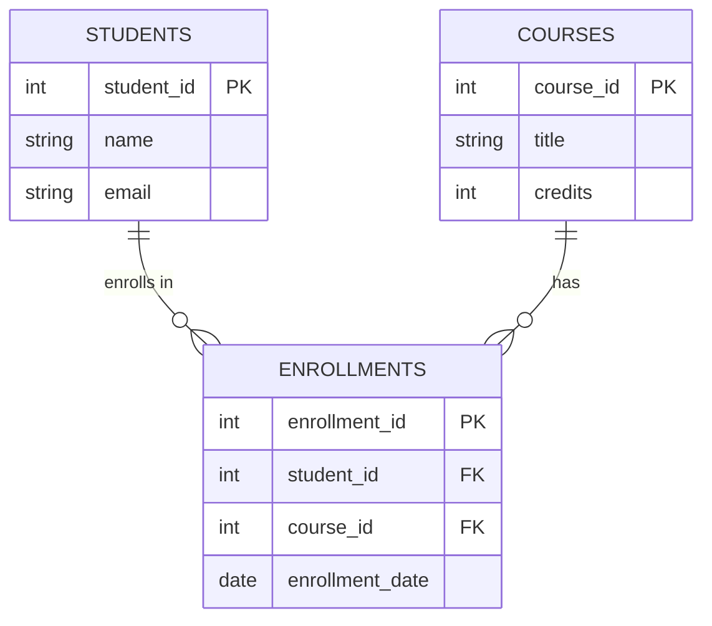
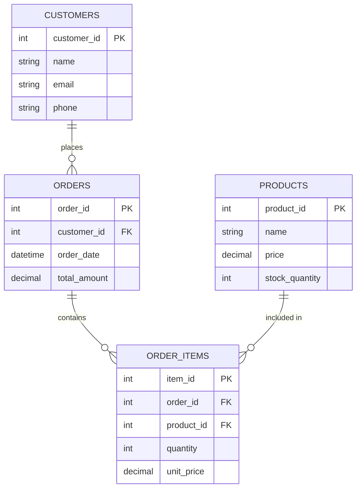

# Лекція 10. Реляційні бази даних: основи проектування та SQL

## Вступ

Реляційні бази даних залишаються фундаментом сучасних інформаційних систем понад п'ятдесят років. Незважаючи на появу альтернативних підходів до зберігання даних, реляційна модель продовжує домінувати у корпоративних додатках, фінансових системах та більшості вебзастосунків завдяки своїй надійності, структурованості та потужним можливостям обробки даних.

Розуміння принципів проектування реляційних баз даних та володіння мовою SQL є критично важливими навичками для будь-якого інженера програмного забезпечення. Ці знання дозволяють ефективно моделювати предметні області, забезпечувати цілісність даних та створювати продуктивні застосунки, здатні працювати з великими обсягами інформації.

## Реляційна модель даних

### Фундаментальні концепції

Реляційна модель даних, запропонована Едгаром Коддом у 1970 році, базується на математичній теорії множин та відношень. В основі моделі лежить концепція відношення або таблиці, яка представляє певну сутність предметної області.

Таблиця складається з рядків та стовпців. Кожен рядок представляє окремий екземпляр сутності та називається кортежем або записом. Стовпці визначають атрибути сутності і містять однотипні дані. Кожен стовпець має унікальне ім'я та визначений тип даних.

Критично важливим елементом реляційної моделі є первинний ключ. Це стовпець або комбінація стовпців, значення яких унікально ідентифікують кожен рядок у таблиці. Первинний ключ не може містити NULL значення та повинен бути незмінним протягом життя запису. Правильний вибір первинного ключа забезпечує ефективний доступ до даних та підтримку цілісності бази даних.

Зв'язки між таблицями реалізуються через зовнішні ключі. Зовнішній ключ це стовпець в одній таблиці, який посилається на первинний ключ іншої таблиці. Це дозволяє встановлювати логічні зв'язки між різними сутностями без фізичного дублювання даних.

### Типи зв'язків між таблицями

Один-до-багатьох є найпоширенішим типом зв'язку в реляційних базах даних. В цьому випадку один запис у першій таблиці може бути пов'язаний з декількома записами у другій таблиці. Наприклад, один автор може написати багато книг, але кожна книга має лише одного автора. Технічно зв'язок реалізується розміщенням зовнішнього ключа в таблиці на стороні багатьох, який посилається на первинний ключ таблиці на стороні одного.

Зв'язок багато-до-багатьох виникає, коли один запис у першій таблиці може бути пов'язаний з багатьма записами у другій таблиці і навпаки. Класичний приклад - студенти та курси. Один студент може відвідувати багато курсів, і на одному курсі можуть навчатися багато студентів. Такий зв'язок безпосередньо неможливо реалізувати в реляційній моделі, тому використовується проміжна таблиця, яка містить зовнішні ключі обох таблиць.



Зв'язок один-до-одного трапляється рідше і означає, що один запис у першій таблиці відповідає рівно одному запису у другій таблиці. Такий зв'язок часто використовується для розділення таблиці на дві частини з різними вимогами до безпеки або продуктивності. Наприклад, основна інформація користувача може зберігатися в одній таблиці, а конфіденційні деталі в іншій.

### ACID властивості

Реляційні бази даних забезпечують надійність та цілісність даних через дотримання ACID властивостей транзакцій. Ці властивості визначають, як система поводиться при виконанні операцій над даними.

Атомарність означає, що транзакція виконується повністю або не виконується взагалі. Якщо під час виконання транзакції виникає помилка, всі зміни відкочуються, і база даних повертається до стану перед початком транзакції. Це критично важливо для операцій, які включають кілька пов'язаних змін. Наприклад, при переказі грошей між рахунками, якщо списання з одного рахунку відбулося успішно, але зарахування на інший не вдалося, транзакція повністю відміняється.

Консистентність гарантує, що транзакція переводить базу даних з одного валідного стану в інший валідний стан. Всі обмеження цілісності, визначені в схемі бази даних, повинні виконуватися до і після транзакції. База даних не дозволить завершити транзакцію, яка порушує встановлені правила.

Ізольованість забезпечує незалежність паралельних транзакцій. Результат виконання кількох одночасних транзакцій має бути таким самим, як при їх послідовному виконанні. Існують різні рівні ізоляції, які балансують між консистентністю та продуктивністю.

Довговічність гарантує, що після успішного завершення транзакції її результати будуть збережені навіть у разі збою системи. Зміни записуються на постійний носій інформації і можуть бути відновлені після перезавантаження.

## Проектування баз даних

### Етапи проектування

Проектування бази даних є багатоетапним процесом, який починається з аналізу предметної області та закінчується фізичною реалізацією структури даних. Якість проектування безпосередньо впливає на продуктивність, масштабованість та зручність підтримки системи.

Концептуальне проектування фокусується на розумінні та моделюванні предметної області незалежно від конкретної системи управління базами даних. На цьому етапі визначаються основні сутності, їх атрибути та зв'язки між ними. Результатом є концептуальна модель, зазвичай представлена у вигляді діаграми сутність-зв'язок.

Логічне проектування перетворює концептуальну модель у логічну схему, яка вже враховує особливості реляційної моделі даних. На цьому етапі визначаються таблиці, стовпці, первинні та зовнішні ключі, індекси. Критичним завданням є нормалізація даних для усунення надмірності та забезпечення цілісності.

Фізичне проектування адаптує логічну схему до конкретної системи управління базами даних. Визначаються типи даних для кожного стовпця, стратегії індексування, параметри зберігання. На цьому етапі враховуються питання продуктивності та вибираються оптимальні рішення для конкретної системи.

### Нормалізація даних

Нормалізація є процесом організації даних у базі для зменшення надмірності та підвищення цілісності. Процес складається з послідовного застосування нормальних форм, кожна з яких накладає певні обмеження на структуру таблиць.

Перша нормальна форма вимагає, щоб кожен атрибут таблиці містив лише атомарні значення. Не допускається зберігання списків або наборів значень в одному полі. Наприклад, замість зберігання всіх телефонних номерів клієнта в одному полі через кому, потрібно створити окрему таблицю для телефонів.

Друга нормальна форма застосовується до таблиць з складеним первинним ключем. Вона вимагає, щоб усі неключові атрибути функціонально залежали від всього первинного ключа, а не тільки від його частини. Якщо атрибут залежить лише від частини ключа, його потрібно винести в окрему таблицю.

Третя нормальна форма усуває транзитивні залежності. Неключові атрибути не повинні залежати від інших неключових атрибутів. Кожен факт має зберігатися лише один раз у базі даних. Наприклад, якщо таблиця містить місто та країну клієнта, і країна може бути визначена з міста, таку інформацію варто винести в окрему довідкову таблицю міст.



Хоча нормалізація усуває надмірність даних, іноді доцільна часткова денормалізація для покращення продуктивності. Додавання розрахункових полів або дублювання деяких даних може значно прискорити виконання складних запитів. Рішення про денормалізацію приймається на основі аналізу типових запитів до системи та вимог до продуктивності.

### Індексація та оптимізація

Індекси є критично важливими для забезпечення продуктивності баз даних. Індекс створює додаткову структуру даних, яка дозволяє швидко знаходити записи без сканування всієї таблиці. Первинний ключ автоматично індексується, але для інших стовпців, які часто використовуються в умовах пошуку, варто створювати індекси вручну.

Однак індекси мають свою ціну. Кожен індекс займає місце на диску та уповільнює операції вставки, оновлення та видалення, оскільки система повинна підтримувати індекс в актуальному стані. Тому важливо знаходити баланс між кількістю індексів та їх впливом на продуктивність.

Складені індекси створюються на кількох стовпцях одночасно і особливо корисні для запитів, які фільтрують або сортують за декількома критеріями. Порядок стовпців у складеному індексі важливий і повинен відповідати типовим шаблонам використання.

## Structured Query Language

### Основи SQL

SQL є декларативною мовою програмування, призначеною для управління даними в реляційних базах. На відміну від імперативних мов, де програміст описує послідовність дій, в SQL описується бажаний результат, а система сама визначає найефективніший спосіб його отримання.

Мова складається з кількох підмножин команд. Data Definition Language визначає структуру бази даних та включає команди для створення, зміни та видалення таблиць і інших об'єктів. Data Manipulation Language працює з самими даними і дозволяє вибирати, додавати, оновлювати та видаляти записи. Data Control Language керує правами доступу користувачів до об'єктів бази даних.

### Вибірка даних

Команда SELECT є найважливішою та найчастіше використовуваною командою SQL. Вона дозволяє отримувати дані з однієї або кількох таблиць на основі заданих критеріїв.

Базовий синтаксис SELECT включає вказівку стовпців, які потрібно отримати, назву таблиці та необов'язкові умови фільтрації. Замість переліку конкретних стовпців можна використовувати зірочку для вибору всіх стовпців таблиці, хоча це не рекомендується для production коду через вплив на продуктивність та проблеми з підтримкою.

```sql
SELECT
    product_id,
    product_name,
    price,
    stock_quantity
FROM products
WHERE category = 'Electronics'
    AND price > 100
ORDER BY price DESC
LIMIT 10;
```

Умова WHERE дозволяє фільтрувати записи на основі різних критеріїв. Можна використовувати логічні оператори AND, OR, NOT для комбінування умов. Оператори порівняння включають рівність, нерівність, більше, менше. Оператор LIKE дозволяє шукати за шаблоном з використанням символів підстановки.

Сортування результатів виконується за допомогою ORDER BY. Можна сортувати за одним або кількома стовпцями в порядку зростання або спадання. За замовчуванням використовується сортування за зростанням. Обмеження кількості результатів через LIMIT корисне для пагінації або коли потрібні лише перші записи.

### Об'єднання таблиць

JOIN операції дозволяють комбінувати дані з кількох пов'язаних таблиць в одному запиті. Це одна з найпотужніших можливостей SQL, яка реалізує реляційну природу бази даних.

INNER JOIN повертає лише ті записи, для яких знайдено відповідність в обох таблицях. Це найпоширеніший тип об'єднання, який використовується для отримання пов'язаних даних.

```sql
SELECT
    orders.order_id,
    customers.name,
    orders.order_date,
    orders.total_amount
FROM orders
INNER JOIN customers ON orders.customer_id = customers.customer_id
WHERE orders.order_date >= '2024-01-01'
ORDER BY orders.order_date DESC;
```

LEFT JOIN повертає всі записи з лівої таблиці та відповідні записи з правої. Якщо відповідності немає, стовпці з правої таблиці матимуть NULL значення. Це корисно, коли потрібно отримати всі записи незалежно від наявності зв'язків.

RIGHT JOIN працює аналогічно LEFT JOIN, але повертає всі записи з правої таблиці. На практиці RIGHT JOIN використовується рідше, оскільки той самий результат можна отримати, змінивши порядок таблиць в LEFT JOIN.

FULL OUTER JOIN повертає всі записи з обох таблиць, незалежно від наявності відповідностей. Це найменш використовуваний тип об'єднання, підтримується не всіма системами управління базами даних.

### Агрегатні функції та групування

Агрегатні функції виконують обчислення над набором значень та повертають одне результуюче значення. COUNT підраховує кількість записів, SUM обчислює суму значень, AVG знаходить середнє значення, MIN та MAX визначають мінімальне та максимальне значення відповідно.

```sql
SELECT
    category,
    COUNT(*) as product_count,
    AVG(price) as average_price,
    MIN(price) as min_price,
    MAX(price) as max_price,
    SUM(stock_quantity) as total_stock
FROM products
GROUP BY category
HAVING AVG(price) > 50
ORDER BY average_price DESC;
```

GROUP BY дозволяє групувати записи за значеннями одного або кількох стовпців. Агрегатні функції обчислюються окремо для кожної групи. Важливо розуміти, що в SELECT можна використовувати лише стовпці з GROUP BY або агрегатні функції.

HAVING працює як WHERE, але застосовується до груп після їх формування. Це дозволяє фільтрувати результати на основі агрегованих значень. WHERE фільтрує записи до групування, HAVING фільтрує групи після агрегації.

### Підзапити

Підзапити або вкладені запити дозволяють використовувати результат одного запиту в умовах іншого. Підзапит може повертати одне значення, один рядок або набір рядків залежно від контексту використання.

```sql
SELECT
    product_name,
    price
FROM products
WHERE price > (
    SELECT AVG(price)
    FROM products
)
ORDER BY price;
```

Підзапити в WHERE дозволяють порівнювати значення з результатами іншого запиту. Оператор IN перевіряє, чи значення міститься в наборі, повернутому підзапитом. EXISTS перевіряє, чи повертає підзапит хоча б один рядок.

Корельовані підзапити посилаються на стовпці з зовнішнього запиту. Вони виконуються для кожного рядка зовнішнього запиту, що може впливати на продуктивність. Часто корельовані підзапити можна переписати з використанням JOIN для кращої продуктивності.

### Модифікація даних

INSERT додає нові записи в таблицю. Можна вставити один запис, вказавши значення для кожного стовпця, або кілька записів одночасно. Якщо значення не вказано для стовпця з DEFAULT, використовується значення за замовчуванням.

```sql
INSERT INTO customers (name, email, phone, registration_date)
VALUES
    ('Іван Петренко', 'ivan@example.com', '+380501234567', CURRENT_DATE),
    ('Марія Коваль', 'maria@example.com', '+380672345678', CURRENT_DATE);
```

UPDATE змінює існуючі записи в таблиці. Критично важливо завжди використовувати WHERE для обмеження записів, які будуть оновлені. Без WHERE оновляться всі записи в таблиці, що зазвичай є помилкою.

```sql
UPDATE products
SET
    price = price * 1.1,
    last_updated = CURRENT_TIMESTAMP
WHERE category = 'Electronics'
    AND stock_quantity > 0;
```

DELETE видаляє записи з таблиці. Як і з UPDATE, обов'язково використовувати WHERE для уникнення випадкового видалення всіх даних. Видалені записи не можна відновити без резервної копії.

### Транзакції

Транзакції дозволяють групувати кілька операцій в одну атомарну одиницю роботи. Всі операції в транзакції або виконуються успішно, або відміняються повністю.

```sql
START TRANSACTION;

UPDATE accounts
SET balance = balance - 1000
WHERE account_id = 1;

UPDATE accounts
SET balance = balance + 1000
WHERE account_id = 2;

INSERT INTO transactions (from_account, to_account, amount, transaction_date)
VALUES (1, 2, 1000, CURRENT_TIMESTAMP);

COMMIT;
```

START TRANSACTION або BEGIN починає нову транзакцію. COMMIT фіксує всі зміни, зроблені в транзакції, роблячи їх постійними. ROLLBACK відміняє всі зміни та повертає базу даних до стану перед початком транзакції.

У випадку помилки під час виконання будь-якої операції в транзакції, рекомендується виконати ROLLBACK, щоб гарантувати консистентність даних. Більшість систем автоматично виконують ROLLBACK при розриві з'єднання з базою даних.

## Системи управління реляційними базами даних

### PostgreSQL

PostgreSQL є однією з найпотужніших open-source реляційних баз даних. Система відома своєю надійністю, дотриманням стандартів SQL та розширеними можливостями. PostgreSQL підтримує складні типи даних, включаючи JSON, масиви, геопросторові дані, що робить її універсальним рішенням для різноманітних застосунків.

Розширюваність PostgreSQL дозволяє додавати власні функції, оператори та типи даних. Система підтримує різні мови програмування для написання процедур та тригерів, включаючи PL/pgSQL, Python, Perl. Можливість створювати розширення дозволяє додавати специфічну функціональність без модифікації ядра системи.

Продуктивність PostgreSQL досягається через ефективний планувальник запитів, який аналізує різні стратегії виконання та обирає оптимальну. Система підтримує різні типи індексів, включаючи B-tree, Hash, GiST, GIN, що дозволяє оптимізувати різні типи запитів.

### MySQL

MySQL залишається найпопулярнішою open-source базою даних завдяки простоті використання та хорошій продуктивності для типових вебзастосунків. Особливо популярна у веброзробці як частина стеку LAMP або LEMP.

Система підтримує різні механізми зберігання даних, що дозволяє обирати оптимальний варіант для конкретних таблиць. InnoDB є стандартним механізмом, що підтримує транзакції та зовнішні ключі. MyISAM оптимізований для швидкого читання, але не підтримує транзакції.

Реплікація та кластеризація в MySQL дозволяють створювати високодоступні системи. Master-slave реплікація забезпечує резервування даних та розподіл навантаження між серверами. MySQL Cluster надає можливість горизонтального масштабування для обробки великих навантажень.

### SQLite

SQLite відрізняється від інших систем відсутністю окремого серверного процесу. База даних зберігається в одному файлі, а бібліотека SQLite вбудовується безпосередньо в застосунок. Це робить SQLite ідеальним вибором для мобільних додатків, настільних програм та вбудованих систем.

Простота розгортання SQLite не вимагає конфігурації або адміністрування. База даних створюється автоматично при першому доступі. Відсутність мережевого протоколу усуває накладні витрати на передачу даних, забезпечуючи високу швидкість для локального доступу.

Обмеження SQLite включають відсутність підтримки паралельного запису від кількох процесів та обмежені можливості масштабування. Однак для більшості застосунків, де база даних використовується одним процесом, SQLite забезпечує чудову продуктивність та надійність.

## Практичні аспекти роботи з базами даних

### Робота з датами та часом

Коректна робота з датами та часом критично важлива для більшості застосунків. SQL надає спеціальні типи даних та функції для роботи з часовими значеннями.

Типи DATE зберігають лише дату без часу, TIME зберігає час без дати, DATETIME та TIMESTAMP зберігають і дату, і час. TIMESTAMP автоматично конвертується між часовими поясами, що корисно для глобальних застосунків.

```sql
SELECT
    order_id,
    order_date,
    EXTRACT(YEAR FROM order_date) as order_year,
    EXTRACT(MONTH FROM order_date) as order_month,
    DATE_TRUNC('month', order_date) as month_start,
    AGE(CURRENT_DATE, order_date) as order_age
FROM orders
WHERE order_date >= CURRENT_DATE - INTERVAL '30 days';
```

Функції для роботи з датами дозволяють виконувати різноманітні операції. Можна додавати або віднімати інтервали часу, обчислювати різницю між датами, витягувати окремі компоненти дати. Важливо враховувати часові пояси при роботі з глобальними системами.

### Оптимізація запитів

Продуктивність запитів безпосередньо впливає на швидкість роботи застосунку. План виконання запиту показує, як система обробляє запит, які індекси використовує та скільки записів аналізує на кожному етапі.

```sql
EXPLAIN ANALYZE
SELECT
    c.name,
    COUNT(o.order_id) as order_count,
    SUM(o.total_amount) as total_spent
FROM customers c
LEFT JOIN orders o ON c.customer_id = o.customer_id
WHERE c.registration_date >= '2024-01-01'
GROUP BY c.customer_id, c.name
HAVING COUNT(o.order_id) > 5
ORDER BY total_spent DESC;
```

EXPLAIN показує план виконання без фактичного виконання запиту. EXPLAIN ANALYZE виконує запит та показує реальний час виконання кожного етапу. Аналіз плану допомагає виявити вузькі місця та визначити, які індекси варто додати.

Типові проблеми продуктивності включають відсутність індексів на стовпцях у WHERE та JOIN, надмірне використання підзапитів замість JOIN, вибірка непотрібних стовпців. Іноді денормалізація або додавання розрахункових полів може значно покращити продуктивність складних запитів.

### Забезпечення безпеки

SQL ін'єкції залишаються одним з найпоширеніших типів атак на вебзастосунки. Атака виникає, коли зловмисник вставляє власний SQL код через вхідні дані застосунку. Запобігання SQL ін'єкціям вимагає використання параметризованих запитів або підготовлених виразів.

```python
# Небезпечний підхід - схильний до SQL ін'єкції
query = f"SELECT * FROM users WHERE email = '{user_input}'"

# Безпечний підхід - параметризований запит
query = "SELECT * FROM users WHERE email = %s"
cursor.execute(query, (user_input,))
```

Управління правами доступу здійснюється через систему користувачів та ролей. Принцип найменших привілеїв означає, що кожен користувач або застосунок повинен мати лише ті права, які необхідні для виконання їхніх завдань. Не варто використовувати облікові записи з правами адміністратора для звичайних операцій застосунку.

Аудит та логування допомагають відстежувати підозрілу активність та розслідувати інциденти безпеки. Критично важливі операції, особливо зміни даних, повинні логуватися з інформацією про користувача та час виконання.

### Резервне копіювання та відновлення

Стратегія резервного копіювання повинна забезпечувати можливість відновлення даних у разі збою обладнання, помилок користувачів або кібератак. Частота створення резервних копій залежить від критичності даних та допустимого часу їх втрати.

Повне резервне копіювання створює копію всієї бази даних. Це найпростіший та найнадійніший метод, але вимагає багато часу та місця для великих баз. Інкрементне копіювання зберігає лише зміни з моменту останнього копіювання, що економить ресурси.

Тестування відновлення з резервних копій є критично важливим. Резервна копія, з якої неможливо відновити дані, марна. Регулярно потрібно перевіряти процес відновлення та вимірювати час, необхідний для повного відновлення системи.

## Висновки

Реляційні бази даних залишаються фундаментальною технологією для зберігання та обробки структурованих даних. Розуміння принципів реляційної моделі, методів проектування та володіння SQL є обов'язковими навичками для інженера програмного забезпечення.

Правильне проектування схеми бази даних через нормалізацію забезпечує цілісність та усуває надмірність даних. Ефективне використання індексів та оптимізація запитів критично важливі для продуктивності застосунку. ACID властивості гарантують надійність та консистентність даних навіть у разі збоїв.

SQL надає потужні засоби для роботи з даними через декларативний підхід. Розуміння різних типів JOIN, агрегатних функцій та підзапитів дозволяє ефективно отримувати необхідну інформацію. Знання особливостей різних систем управління базами даних допомагає обрати оптимальне рішення для конкретного проєкту.

Безпека бази даних вимагає постійної уваги. Запобігання SQL ін'єкціям, правильне управління доступом та регулярне резервне копіювання є невід'ємними елементами надійної системи. Розуміння цих принципів дозволяє створювати застосунки, які ефективно та безпечно працюють з даними.
