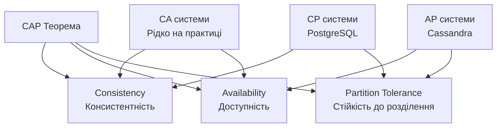
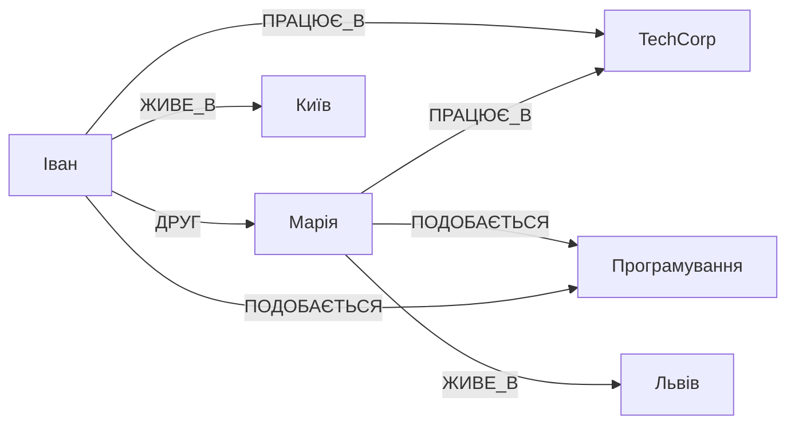
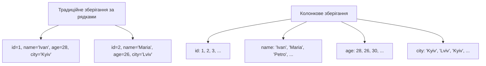
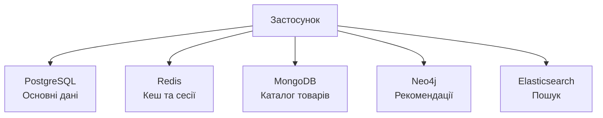

# Лекція 11. NoSQL бази даних: типи та особливості

## Вступ

Термін NoSQL, який спочатку означав "non-SQL", еволюціонував до значення "not only SQL", відображаючи сучасний підхід до вибору оптимальних технологій зберігання даних. NoSQL бази даних з'явилися як відповідь на обмеження реляційних систем при роботі з величезними обсягами неструктурованих даних, потребі в горизонтальному масштабуванні та необхідності гнучких схем даних.

Сучасні застосунки часто працюють з різноманітними типами даних, які важко або неефективно моделювати в реляційних таблицях. Соціальні мережі генерують мільярди постів, коментарів та зв'язків між користувачами. Інтернет речей створює потоки сенсорних даних. Рекомендаційні системи аналізують складні графи взаємозв'язків. Для таких сценаріїв NoSQL рішення часто забезпечують кращу продуктивність, масштабованість та зручність розробки.

## Фундаментальні концепції NoSQL

### Передумови виникнення

Реляційні бази даних проектувалися в епоху, коли дані були структурованими, обсяги відносно невеликими, а масштабування досягалося через більш потужне обладнання. Однак інтернет-компанії зіткнулися з новими викликами, які важко вирішити в рамках традиційного підходу.

Експоненціальне зростання даних вимагало здатності зберігати та обробляти петабайти інформації. Вертикальне масштабування через більш потужні сервери досягло фізичних та економічних меж. Горизонтальне масштабування, коли навантаження розподіляється між багатьма серверами, виявилося складним для реляційних баз через необхідність підтримувати консистентність та транзакції.

Гнучкість схеми даних стала критичною вимогою для швидкої розробки. В реляційних базах зміна структури таблиць у production системах може вимагати тривалих простоїв. Різні записи можуть мати різні набори атрибутів, що природно моделюється в NoSQL, але вимагає складних рішень в реляційних системах.

Географічне розподілення даних набуло важливості для глобальних сервісів. Користувачі очікують швидкого доступу до даних незалежно від їхнього місцезнаходження. Це вимагає реплікації даних між дата-центрами в різних регіонах, що складно реалізувати з сильною консистентністю.

### CAP теорема

CAP теорема формулює фундаментальне обмеження розподілених систем. Теорема стверджує, що розподілена система не може одночасно гарантувати консистентність, доступність та стійкість до розділення мережі. Система може забезпечити лише дві з трьох властивостей.



Консистентність означає, що всі вузли бачать однакові дані в один момент часу. Після успішного запису всі наступні читання повертають нове значення. Це гарантує, що не існує суперечливих версій даних в різних частинах системи.

Доступність гарантує, що кожен запит отримує відповідь, навіть якщо вона може не містити найсвіжіші дані. Система продовжує обслуговувати запити навіть при відмові частини вузлів. Це критично важливо для сервісів, які не можуть дозволити собі простій.

Стійкість до розділення означає, що система продовжує працювати навіть коли мережа між вузлами розділяється. В реальних розподілених системах мережеві розриви неминучі, тому практично всі системи повинні бути partition-tolerant. Це означає вибір між консистентністю та доступністю.

### BASE модель

На противагу ACID властивостям реляційних баз, багато NoSQL систем дотримуються BASE моделі. Це компроміс, який жертвує сильною консистентністю заради кращої доступності та продуктивності.

Basically Available означає, що система гарантує доступність даних більшу частину часу. Запити можуть виконуватися навіть при часткових збоях системи, хоча результати можуть бути неповними або застарілими.

Soft State вказує, що стан системи може змінюватися навіть без нових запитів через eventual consistency. Система активно працює над синхронізацією даних між вузлами, але в проміжку часу можуть існувати розбіжності.

Eventually Consistent гарантує, що якщо не надходять нові оновлення, врешті-решт всі вузли досягнуть консистентного стану. Це означає, що розбіжності тимчасові, і система сходиться до єдиного стану.

## Документо-орієнтовані бази даних

### Концепція та структура

Документо-орієнтовані бази зберігають дані у вигляді документів, зазвичай в форматі JSON або BSON. Документ є самодостатнім об'єктом, який містить всю пов'язану інформацію. Це природний спосіб представлення даних, який відповідає об'єктам в програмному коді.

```json
{
  "_id": "507f1f77bcf86cd799439011",
  "name": "Ноутбук Dell XPS 15",
  "category": "Electronics",
  "price": 45999,
  "specifications": {
    "processor": "Intel Core i7",
    "ram": "16GB",
    "storage": "512GB SSD",
    "display": "15.6 inch 4K"
  },
  "reviews": [
    {
      "user": "user123",
      "rating": 5,
      "comment": "Чудовий ноутбук для розробки",
      "date": "2024-09-15"
    }
  ],
  "tags": ["laptop", "premium", "developer"],
  "in_stock": true,
  "created_at": "2024-08-01T10:30:00Z"
}
```

Гнучка схема дозволяє різним документам у колекції мати різну структуру. Можна додавати нові поля без модифікації існуючих документів. Це надзвичайно корисно для швидкої розробки та еволюції структури даних.

Вкладені документи та масиви дозволяють моделювати складні взаємозв'язки без JOIN операцій. Пов'язані дані зберігаються разом, що забезпечує швидкий доступ. Однак це створює дублювання даних, яке потрібно керувати.

### MongoDB

MongoDB є найпопулярнішою документо-орієнтованою базою даних. Система поєднує гнучкість NoSQL з потужними можливостями запитів, що робить її універсальним рішенням для різноманітних застосунків.

Мова запитів MongoDB виражається через JavaScript об'єкти та підтримує складні умови, проекції, сортування та агрегації. Запити виконуються безпосередньо над JSON структурами без необхідності мапінгу на реляційну модель.

```javascript
// Знайти всі електронні товари дорожче 20000
db.products.find({
  category: "Electronics",
  price: { $gt: 20000 }
}).sort({ price: -1 }).limit(10)

// Агрегація для обчислення середнього рейтингу
db.products.aggregate([
  { $unwind: "$reviews" },
  { $group: {
    _id: "$_id",
    name: { $first: "$name" },
    avgRating: { $avg: "$reviews.rating" },
    reviewCount: { $sum: 1 }
  }},
  { $sort: { avgRating: -1 }}
])
```

Індексування в MongoDB працює подібно до реляційних баз, але з додатковими можливостями. Можна індексувати вкладені поля, елементи масивів, геопросторові дані. Складені індекси покращують продуктивність складних запитів. Text індекси дозволяють виконувати повнотекстовий пошук.

Реплікація через replica sets забезпечує високу доступність та резервування даних. Кілька серверів зберігають копії даних, і при відмові primary автоматично відбувається failover на secondary. Це гарантує, що застосунок продовжує працювати навіть при збоях обладнання.

Шардування дозволяє горизонтально масштабувати MongoDB для обробки великих обсягів даних. Дані розподіляються між кількома серверами на основі shard key. Правильний вибір ключа шардування критично важливий для рівномірного розподілу навантаження.

### Коли використовувати документні бази

Каталоги товарів ідеально підходять для документних баз через варіативність атрибутів різних категорій товарів. Електроніка має специфікації, одяг має розміри та кольори, книги мають авторів та видавництва. Вкладені структури природно представляють такі різноманітні дані.

Системи управління контентом часто працюють з документами різної структури. Статті, відео, зображення мають різні метадані. Гнучкість схеми дозволяє зберігати різні типи контенту в одній колекції без складних спадкових ієрархій.

Профілі користувачів у соціальних мережах містять різноманітну інформацію, яка природно моделюється як документи. Деякі користувачі мають детальну інформацію про освіту та роботу, інші мінімальну. Документна модель дозволяє легко додавати нові поля без міграцій.

Real-time аналітика та логування виграють від продуктивності документних баз при записі та простоти зберігання структурованих подій. Кожна подія може містити довільний набір атрибутів залежно від типу події.

## Key-Value сховища

### Принципи роботи

Key-value сховища є найпростішим типом NoSQL баз. Дані зберігаються як пари ключ-значення, де ключ унікально ідентифікує значення. Значення може бути будь-якими даними від простих рядків до складних об'єктів.

Операції обмежуються простими командами: встановити значення за ключем, отримати значення за ключем, видалити ключ. Ця простота забезпечує максимальну продуктивність та масштабованість. Система не аналізує та не індексує вміст значень, що дозволяє досягти мікросекундної латентності.

### Redis

Redis позиціонується як структура даних сервер, оскільки підтримує не лише прості рядки, але й складні структури даних в пам'яті. Списки, множини, відсортовані множини, хеш-таблиці доступні з атомарними операціями.

```python
import redis

# Підключення до Redis
r = redis.Redis(host='localhost', port=6379, decode_responses=True)

# Прості операції з рядками
r.set('user:1000:name', 'Іван Петренко')
r.setex('session:abc123', 3600, 'user_data')  # з експірацією

# Робота зі списками
r.lpush('queue:tasks', 'task1', 'task2')
task = r.rpop('queue:tasks')

# Хеші для структурованих даних
r.hset('user:1000', mapping={
    'name': 'Іван Петренко',
    'email': 'ivan@example.com',
    'points': 150
})
r.hincrby('user:1000', 'points', 10)

# Множини для унікальних колекцій
r.sadd('online:users', 'user:1000', 'user:1001')
online_count = r.scard('online:users')
```

Кешування є найпоширенішим використанням Redis. Результати складних запитів до бази даних або обчислень зберігаються в пам'яті для швидкого доступу. Механізм експірації автоматично видаляє застарілі дані. Різні стратегії eviction дозволяють керувати пам'яттю при досягненні лімітів.

Черги повідомлень реалізуються через списки Redis з блокуючими операціями. Продюсери додають завдання в кінець списку, консьюмери забирають з початку. Це забезпечує простий та ефективний механізм для асинхронної обробки задач.

Session storage в Redis дозволяє масштабувати вебзастосунки горизонтально. Дані сесій зберігаються централізовано, і будь-який сервер може обробити запит користувача. Автоматична експірація видаляє неактивні сесії.

Leaderboards та лічильники ефективно реалізуються через відсортовані множини Redis. Атомарні операції інкременту гарантують точність при конкурентному доступі. Операції отримання топ елементів виконуються за логарифмічний час.

Pub/Sub механізм дозволяє реалізувати real-time повідомлення. Клієнти підписуються на канали та отримують повідомлення миттєво при їх публікації. Це корисно для чатів, оновлень в реальному часі, нотифікацій.

### Amazon DynamoDB

DynamoDB є керованою key-value базою даних від AWS, яка забезпечує передбачувану продуктивність при будь-якому масштабі. Система автоматично розподіляє дані між серверами та масштабується прозоро для застосунку.

Модель даних підтримує прості key-value операції та документну структуру. Кожен елемент має обов'язковий partition key та опціональний sort key. Partition key визначає розподіл даних, sort key дозволяє виконувати запити в межах партиції.

Throughput provisioning дозволяє резервувати необхідну продуктивність для читання та запису. On-demand режим автоматично масштабується залежно від навантаження без попереднього планування. Це спрощує управління, але може коштувати дорожче при постійному високому навантаженні.

Global Tables забезпечують мультирегіональну реплікацію з можливістю запису в будь-якому регіоні. Це критично важливо для глобальних застосунків, які потребують низької латентності в різних частинах світу.

## Графові бази даних

### Модель графа

Графові бази даних спеціалізуються на зберіганні та обробці графів. Граф складається з вершин і ребер, які представляють сутності та зв'язки між ними. Ця модель природно відображає багато реальних систем від соціальних мереж до логістичних маршрутів.



Вершини представляють сутності з властивостями. Кожна вершина має тип та набір атрібутів, подібно до рядка в таблиці. Однак вершини можуть мати різні типи властивостей без фіксованої схеми.

Ребра описують відношення між вершинами та також можуть мати властивості. Тип ребра визначає природу зв'язку. Властивості ребер зберігають додаткову інформацію про відношення, наприклад, дату створення дружби або вагу зв'язку.

### Neo4j

Neo4j є найпопулярнішою графовою базою даних з власною мовою запитів Cypher. Мова має виразний синтаксис, який візуально нагадує структуру графа.

```cypher
// Створення вершин та зв'язків
CREATE (ivan:Person {name: 'Іван Петренко', age: 28})
CREATE (maria:Person {name: 'Марія Коваль', age: 26})
CREATE (tech:Company {name: 'TechCorp', industry: 'IT'})
CREATE (programming:Skill {name: 'Програмування'})

CREATE (ivan)-[:FRIEND_OF {since: '2020-01-15'}]->(maria)
CREATE (ivan)-[:WORKS_AT {position: 'Developer'}]->(tech)
CREATE (maria)-[:WORKS_AT {position: 'Designer'}]->(tech)
CREATE (ivan)-[:HAS_SKILL {level: 'Expert'}]->(programming)

// Пошук друзів друзів
MATCH (person:Person {name: 'Іван Петренко'})-[:FRIEND_OF]-(friend)-[:FRIEND_OF]-(foaf)
WHERE NOT (person)-[:FRIEND_OF]-(foaf)
RETURN DISTINCT foaf.name

// Рекомендація людей зі спільними інтересами
MATCH (person:Person {name: 'Іван Петренко'})-[:HAS_SKILL]->(skill)<-[:HAS_SKILL]-(other)
WHERE NOT (person)-[:FRIEND_OF]-(other)
RETURN other.name, COUNT(skill) as common_skills
ORDER BY common_skills DESC
```

Traversal алгоритми ефективно обходять граф для знаходження шляхів між вершинами. Shortest path знаходить найкоротший шлях між двома вершинами. All paths повертає всі можливі шляхи. Ці операції виконуються швидко навіть на великих графах завдяки спеціалізованій індексації.

### Використання графових баз

Соціальні мережі природно моделюються як графи. Користувачі є вершинами, дружби та підписки є ребрами. Запити типу "друзі друзів", "люди, яких ви можете знати", "найкоротший шлях між користувачами" виконуються ефективно в графовій моделі.

Рекомендаційні системи використовують графи для знаходження схожих користувачів або товарів. Граф "користувач-товар-категорія-бренд" дозволяє знаходити складні патерни для персоналізованих рекомендацій. Collaborative filtering природно виражається через графові запити.

Виявлення шахрайства аналізує графи транзакцій для знаходження підозрілих патернів. Раптові зміни в структурі зв'язків, незвичні шляхи транзакцій, кільця платежів можуть вказувати на шахрайські схеми. Графові алгоритми швидко виявляють такі аномалії.

Управління знаннями та онтології природно представляються графами. Knowledge graphs зберігають взаємозв'язки між концепціями, фактами, сутностями. Семантичні запити дозволяють отримувати складну інформацію через транзитивні відношення.

## Колонкові бази даних

### Принцип організації

Колонкові бази зберігають дані по стовпцях замість рядків. В традиційних реляційних базах рядок зберігається цілком, навіть якщо потрібні лише деякі поля. Колонкове зберігання дозволяє читати лише необхідні стовпці, що критично важливо для аналітичних запитів.



Компресія даних набагато ефективніша при колонковому зберіганні. Стовпець містить однотипні дані, які часто мають повторювані значення. Алгоритми компресії досягають кращих результатів на таких даних. Це зменшує потребу в дисковому просторі та прискорює читання.

Агрегатні запити виконуються швидше, оскільки система читає лише необхідні стовпці. Обчислення SUM, AVG, COUNT вимагають доступу до одного стовпця замість сканування всіх рядків. Це дає значне прискорення для аналітичних workloads.

### Apache Cassandra

Cassandra є високомасштабованою колонковою базою даних, розробленою для обробки величезних обсягів даних на багатьох серверах. Система забезпечує високу доступність без єдиної точки відмови.

Модель даних організована ієрархічно. Keyspace є аналогом бази даних в реляційних системах. Column family відповідає таблиці. Row key унікально ідентифікує рядок, column key ідентифікує стовпець. Значення зберігається разом з timestamp для розв'язання конфліктів.

Розподілена архітектура не має master вузлів. Всі вузли рівноправні та можуть обслуговувати запити. Дані автоматично реплікуються між вузлами на основі replication factor. Consistent hashing визначає, які вузли зберігають копії даних.

Tunable consistency дозволяє обирати рівень консистентності для кожного запиту. ONE вимагає відповіді від одного вузла для максимальної швидкості. QUORUM потребує відповіді від більшості вузлів для балансу між консистентністю та продуктивністю. ALL забезпечує сильну консистентність за рахунок доступності.

```cql
-- Створення keyspace
CREATE KEYSPACE ecommerce
WITH replication = {
  'class': 'NetworkTopologyStrategy',
  'datacenter1': 3
};

-- Створення таблиці
CREATE TABLE ecommerce.orders (
  user_id UUID,
  order_date TIMESTAMP,
  order_id UUID,
  total_amount DECIMAL,
  items LIST<TEXT>,
  PRIMARY KEY (user_id, order_date, order_id)
) WITH CLUSTERING ORDER BY (order_date DESC);

-- Запит
SELECT * FROM ecommerce.orders
WHERE user_id = ? AND order_date >= '2024-01-01'
LIMIT 10;
```

### Аналітичні workloads

Data warehousing використовує колонкові бази для зберігання історичних даних. Аналітики виконують складні запити з агрегаціями по мільйонах записів. Колонкове зберігання прискорює такі запити на порядки величини порівняно з традиційними базами.

Time series data природно зберігаються в колонкових базах. IoT датчики генерують регулярні вимірювання з мітками часу. Запити зазвичай аналізують один або кілька параметрів за період часу. Колонкова організація оптимальна для таких патернів доступу.

Log aggregation та аналітика виграють від продуктивності колонкових баз. Мільйони записів логів щодня містять структуровану інформацію. Аналіз патернів, пошук аномалій, побудова метрик вимагають ефективного сканування великих обсягів даних.

## Порівняння та вибір NoSQL рішення

### Критерії вибору

Тип даних та структура є першим фактором при виборі NoSQL бази. Документи з варіативною структурою підходять для документних баз. Прості пари ключ-значення ефективно зберігаються в key-value сховищах. Складні зв'язки природно моделюються графами. Аналітичні дані оптимально зберігати в колонкових базах.

Патерни доступу до даних визначають оптимальну модель зберігання. Якщо більшість запитів отримують повний об'єкт за ключем, підходять key-value або документні бази. Якщо потрібні складні обходи графа, графова база буде ефективнішою. Для аналітичних запитів з агрегаціями краща колонкова база.

Вимоги до консистентності впливають на вибір між CP та AP системами. Фінансові системи вимагають сильної консистентності, тому краще обрати CP рішення або залишитися на реляційній базі. Для соціальних мереж eventual consistency часто прийнятна заради кращої доступності.

Масштабованість та продуктивність різняться між типами NoSQL баз. Key-value сховища забезпечують найкращу продуктивність для простих операцій. Документні бази балансують між гнучкістю та швидкістю. Графові бази оптимізовані для обходу зв'язків. Колонкові бази найкращі для аналітики.

### Polyglot Persistence

Сучасні застосунки часто використовують кілька різних баз даних, кожна для своїх цілей. Цей підхід називається polyglot persistence і визнає, що не існує універсального рішення для всіх типів даних та запитів.



Основна реляційна база зберігає критичні транзакційні дані, де важлива консистентність. Redis кешує часто запитувані дані та зберігає сесії користувачів. MongoDB містить каталог товарів з варіативною структурою. Neo4j обробляє графи зв'язків для рекомендаційної системи. Elasticsearch забезпечує повнотекстовий пошук.

Такий підхід дозволяє використовувати сильні сторони кожної технології. Однак він додає складності в архітектурі, розгортанні та підтримці системи. Потрібно підтримувати консистентність між різними сховищами, що вимагає додаткової логіки в застосунку.

## Практичні аспекти використання NoSQL

### Міграція даних

Перехід від реляційної до NoSQL бази або між різними NoSQL системами вимагає ретельного планування. Структура даних може кардинально змінитися, особливо при переході на документну або графову модель.

Етапи міграції включають аналіз існуючих даних та патернів доступу, проєктування нової схеми, розробку скриптів міграції, тестування на підмножині даних, поступовий перехід з можливістю повернення назад. Критично важливо мати план rollback на випадок проблем.

Dual writing дозволяє підтримувати обидві бази синхронізованими під час міграції. Застосунок записує в обидві системи одночасно. Після перевірки коректності даних в новій базі, читання поступово переключаються на неї. Це дозволяє повернутися до старої системи при виявленні проблем.

### Забезпечення консистентності

Eventual consistency вимагає змін в дизайні застосунку. Код повинен враховувати можливість отримання застарілих даних. Важливо визначити, які частини системи можуть працювати з eventual consistency, а які потребують сильних гарантій.

Conflict resolution стратегії визначають, як система поводиться при конфліктних оновленнях. Last write wins є найпростішим підходом, але може призвести до втрати даних. Version vectors дозволяють виявляти та вирішувати конфлікти на рівні застосунку. Custom merge logic може поєднувати конфліктні зміни інтелектуально.

Distributed transactions в NoSQL системах складніші за реляційні. Двофазний commit створює проблеми продуктивності та доступності. Saga pattern реалізує розподілені транзакції через серію компенсуючих операцій. Event sourcing зберігає історію змін, дозволяючи відновити стан системи.

### Моніторинг та обслуговування

Моніторинг NoSQL баз вимагає відстеження специфічних метрик. Throughput показує кількість операцій на секунду. Latency вимірює час відгуку. Memory usage критична для in-memory баз як Redis. Disk usage та I/O важливі для персистентних баз. Replication lag показує затримку синхронізації між вузлами.

Backup стратегії різняться залежно від типу бази. Snapshot backup створює миттєвий знімок даних. Continuous backup реплікує зміни в реальному часі. Distributed backups важливі для розподілених систем. Тестування відновлення з backup обов'язкове для гарантії працездатності.

Performance tuning включає оптимізацію схеми даних, додавання індексів, налаштування параметрів реплікації та консистентності. Важливо розуміти внутрішню роботу конкретної NoSQL системи для ефективного налаштування.

## Висновки

NoSQL бази даних розширюють можливості розробників, надаючи альтернативи реляційній моделі для різних сценаріїв. Документо-орієнтовані бази забезпечують гнучкість схеми та природне відображення об'єктів. Key-value сховища пропонують максимальну простоту та продуктивність. Графові бази оптимізовані для роботи зі складними зв'язками. Колонкові бази найкращі для аналітичних workloads.

Вибір між NoSQL та реляційними базами не є бінарним. Сучасні системи часто використовують polyglot persistence, поєднуючи переваги різних технологій. Розуміння сильних та слабких сторін кожного типу баз дозволяє приймати обґрунтовані рішення.

CAP теорема та BASE модель визначають фундаментальні компроміси розподілених систем. Eventual consistency дозволяє досягти кращої доступності та продуктивності за рахунок сильних гарантій консистентності. Важливо розуміти ці компроміси при проєктуванні системи.

Міграція між різними типами баз вимагає ретельного планування та тестування. Підтримка консистентності в розподілених системах складніша за традиційні транзакції. Моніторинг та обслуговування NoSQL баз потребує розуміння їхніх специфічних характеристик.
