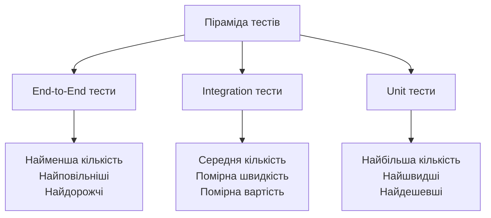
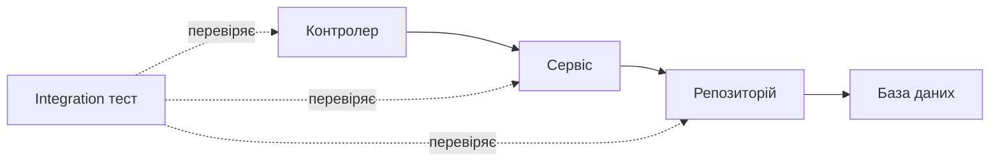
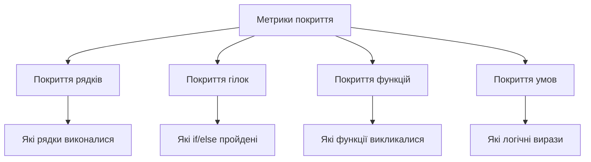

# Лекція 12. Стратегії тестування: піраміда тестів

## Вступ

Тестування програмного забезпечення є критично важливим етапом життєвого циклу розробки, який визначає якість кінцевого продукту та впевненість у його надійності. У сучасній програмній інженерії існує безліч підходів до тестування, і розуміння того, коли і як застосовувати кожен з них, є ключовою компетенцією професійного розробника. Концепція піраміди тестів надає структурований підхід до організації тестування, допомагаючи командам створювати ефективну та збалансовану стратегію забезпечення якості.

У цій лекції ми детально розглянемо різні рівні тестування, їхнє призначення та взаємодію, а також практичні аспекти створення комплексної стратегії тестування для сучасних програмних систем.

## Фундаментальні концепції тестування

### Що таке тестування програмного забезпечення

Тестування програмного забезпечення є систематичним процесом виконання програми з метою виявлення помилок та перевірки відповідності фактичних результатів очікуваним. Це не просто пошук дефектів, а комплексна діяльність, спрямована на забезпечення якості продукту на всіх етапах його створення.

Основна мета тестування полягає у верифікації того, що програма працює правильно, та валідації того, що вона вирішує потрібні проблеми користувачів. Верифікація відповідає на питання "чи створюємо ми продукт правильно", тоді як валідація з'ясовує "чи створюємо ми правильний продукт".

Ефективне тестування допомагає виявити проблеми на ранніх етапах розробки, коли їх виправлення коштує значно дешевше. Дослідження показують, що вартість виправлення помилки зростає експоненційно залежно від етапу життєвого циклу, на якому її виявлено. Помилка, знайдена на етапі проєктування, може коштувати в сотні разів дешевше за ту саму помилку, виявлену вже після релізу продукту.

### Принципи ефективного тестування

Перший принцип полягає в тому, що тестування демонструє наявність дефектів, але не може довести їх відсутність. Навіть найретельніше тестування не гарантує, що програма повністю вільна від помилок. Однак воно значно підвищує впевненість у якості продукту та зменшує ймовірність критичних проблем у продакшені.

Вичерпне тестування неможливе для більшості реальних систем через величезну кількість можливих комбінацій вхідних даних та станів програми. Замість спроб протестувати все, ефективна стратегія фокусується на найбільш ризикових областях та критичних сценаріях використання.

Раннє тестування є критично важливим для успіху проєкту. Діяльність з тестування має розпочинатися якомога раніше в життєвому циклі розробки, ідеально ще на етапі аналізу вимог. Це дозволяє виявити неузгодженості та неясності в специфікаціях до того, як вони перетворяться на дорогі в усуненні дефекти коду.

Концентрація дефектів означає, що більшість помилок зазвичай зосереджена в невеликій кількості модулів. Це явище, відоме як принцип Парето, говорить про те, що приблизно 80 відсотків проблем знаходяться в 20 відсотках коду. Розуміння цього допомагає ефективніше розподіляти зусилля з тестування.

### Типи тестування за знанням системи

Тестування за методом білого ящика передбачає повне знання внутрішньої структури системи. Тестувальник має доступ до вихідного коду та розуміє логіку роботи програми. Цей підхід дозволяє перевірити внутрішні структури даних, логічні шляхи виконання та інші аспекти реалізації. Такий тип тестування особливо ефективний для unit тестів, де перевіряються окремі функції та методи.

Тестування за методом чорного ящика не потребує знання внутрішньої реалізації системи. Тестувальник взаємодіє з програмою виключно через її зовнішній інтерфейс, як це робив би звичайний користувач. Такий підхід дозволяє зосередитися на функціональності системи та перевірці відповідності вимогам, не заглиблюючись у деталі реалізації.

Тестування за методом сірого ящика поєднує обидва підходи, коли тестувальник має часткове знання внутрішньої структури. Це дозволяє створювати більш ефективні тестові сценарії, враховуючи як функціональні вимоги, так і особливості реалізації.

## Концепція піраміди тестів

### Походження та еволюція концепції

Концепція піраміди тестів була вперше представлена Майком Коном у його книзі про Agile розробку. Ця модель візуалізує ідеальний розподіл різних типів тестів у програмному проєкті, де форма піраміди відображає як кількість тестів кожного типу, так і швидкість їх виконання.



Основна ідея полягає в тому, що більшість тестів має бути на нижньому рівні піраміди, де тести швидкі, дешеві у створенні та підтримці, та надають швидкий фідбек. По мірі руху вгору піраміди кількість тестів зменшується, оскільки вони стають повільнішими та дорожчими у створенні та виконанні.

З часом концепція піраміди тестів еволюціонувала та адаптувалася під різні контексти розробки. З'явилися варіації, такі як трофей тестування або сотовий підхід, але базові принципи залишаються актуальними. Ключова ідея полягає в балансі між різними типами тестів для досягнення оптимального співвідношення покриття, швидкості та вартості.

### Антипатерни в тестуванні

Перевернута піраміда тестів або "крижаний ріжок" є поширеним антипатерном, коли команда покладається переважно на end-to-end тести, маючи мало unit тестів. Такий підхід призводить до повільного виконання тестів, складності в підтримці та ускладнює діагностику проблем, оскільки інтеграційні тести не дають чіткого розуміння того, де саме виникла помилка.

Годинникове скло тестування виникає, коли є багато unit тестів і багато end-to-end тестів, але мало інтеграційних тестів посередині. Це створює розрив у покритті, де взаємодія між компонентами залишається недостатньо перевіреною.

Повна відсутність структурованого підходу до тестування, коли тести пишуться хаотично без чіткої стратегії, призводить до неефективного використання ресурсів та неповного покриття критичних сценаріїв.

## Unit тести: основа піраміди

### Призначення та характеристики

Unit тести перевіряють найменші ізольовані частини програми, зазвичай окремі функції або методи класів. Кожен unit тест фокусується на одному аспекті поведінки тестованого коду, що дозволяє швидко ідентифікувати джерело проблеми при падінні тесту.

Основні характеристики якісних unit тестів включають швидкість виконання, ізольованість, детермінованість та незалежність від зовнішніх ресурсів. Unit тести мають виконуватися за мілісекунди, дозволяючи запускати їх часто під час розробки. Вони не повинні залежати від баз даних, файлової системи, мережі або інших зовнішніх ресурсів, використовуючи замість них моки та стаби.

Ізоляція досягається через тестування одиниці коду окремо від її залежностей. Якщо функція використовує інші модулі чи сервіси, ці залежності замінюються тестовими дублерами, що дозволяє сфокусуватися виключно на логіці тестованого коду.

### Структура unit тесту

Широко визнаним підходом до структурування unit тестів є патерн Arrange-Act-Assert, також відомий як Given-When-Then. Цей патерн чітко розділяє тест на три секції, роблячи його зрозумілішим та легшим у підтримці.

У секції Arrange підготовлюються всі необхідні передумови для тесту. Це включає створення тестових об'єктів, налаштування моків, підготовку вхідних даних та встановлення початкового стану системи.

Секція Act виконує дію, яку тестує цей тест. Зазвичай це один виклик методу або функції, яка є предметом тестування. Важливо, щоб ця секція була мінімальною та фокусувалася на одній конкретній дії.

Секція Assert перевіряє результати виконаної дії. Тут використовуються твердження для порівняння фактичних результатів з очікуваними. Якісний unit тест має мінімальну кількість тверджень, в ідеалі одне, що перевіряє один конкретний аспект поведінки.

### Практичні приклади unit тестів

Розглянемо простий приклад функції, яка обчислює знижку на товар залежно від кількості:

```python
def calculate_discount(price, quantity):
    if quantity >= 100:
        return price * 0.2
    elif quantity >= 50:
        return price * 0.1
    elif quantity >= 10:
        return price * 0.05
    return 0
```

Unit тести для цієї функції перевірять різні граничні випадки:

```python
def test_no_discount_for_small_quantity():
    # Arrange
    price = 100
    quantity = 5

    # Act
    discount = calculate_discount(price, quantity)

    # Assert
    assert discount == 0

def test_five_percent_discount():
    # Arrange
    price = 100
    quantity = 15

    # Act
    discount = calculate_discount(price, quantity)

    # Assert
    assert discount == 5

def test_boundary_condition_at_fifty():
    # Arrange
    price = 100
    quantity = 50

    # Act
    discount = calculate_discount(price, quantity)

    # Assert
    assert discount == 10
```

Такі тести покривають різні шляхи виконання коду, включаючи граничні умови, що є критично важливим для виявлення потенційних помилок.

### Тестові дублери: моки, стаби та фейки

Тестові дублери є замінниками реальних об'єктів, які використовуються для ізоляції тестованого коду від його залежностей. Існує кілька типів дублерів, кожен з яких має своє призначення.

Стаби надають заздалегідь визначені відповіді на виклики методів під час тестування. Вони використовуються, коли тестованому коду потрібні дані від залежності, але сама логіка цієї залежності не є предметом тестування.

Моки є більш складними дублерами, які не лише надають відповіді, але й перевіряють, чи були викликані певні методи з очікуваними параметрами. Моки дозволяють верифікувати взаємодію між об'єктами, а не лише перевіряти стан.

Фейки є робочими реалізаціями залежностей, але спрощеними порівняно з продакшн версією. Наприклад, замість реальної бази даних можна використовувати in-memory реалізацію, яка працює швидше та не потребує зовнішніх ресурсів.

## Integration тести: середній рівень

### Роль інтеграційного тестування

Integration тести перевіряють взаємодію між різними модулями або компонентами системи. На відміну від unit тестів, які ізолюють кожну одиницю коду, інтеграційні тести перевіряють, як компоненти працюють разом як єдине ціле.

Ці тести виявляють проблеми, які не можна знайти unit тестами, такі як неправильна передача даних між модулями, несумісність інтерфейсів, проблеми з конфігурацією або неочікувана поведінка при взаємодії компонентів.



Інтеграційне тестування може здійснюватися на різних рівнях деталізації. Вузьке інтеграційне тестування перевіряє взаємодію невеликої групи тісно пов'язаних компонентів, тоді як широке інтеграційне тестування може охоплювати цілі підсистеми.

### Стратегії інтеграційного тестування

Підхід "знизу вгору" починає з тестування найнижчих рівнів системи та поступово рухається до вищих. Спочатку тестуються базові модулі, потім модулі, які на них покладаються, і так далі до верхніх рівнів архітектури.

Підхід "зверху вниз" працює в протилежному напрямку, починаючи з верхнього рівня та поступово рухаючись до нижніх шарів. При цьому підході нижні рівні можуть бути замінені стабами на початкових етапах тестування.

Сендвіч-підхід або гібридна стратегія поєднує обидва методи, дозволяючи тестувати критичні модулі на різних рівнях паралельно. Це може прискорити процес тестування та раніше виявити критичні проблеми інтеграції.

### Тестування API та баз даних

Тестування RESTful API є важливим аспектом інтеграційного тестування для вебзастосунків. Такі тести перевіряють правильність роботи ендпоінтів, коректність обробки HTTP запитів, валідацію вхідних даних, формування відповідей та обробку помилок.

Приклад інтеграційного тесту для API ендпоінта:

```python
def test_create_user_endpoint():
    # Arrange
    user_data = {
        "username": "testuser",
        "email": "test@example.com",
        "password": "securepassword"
    }

    # Act
    response = client.post("/api/users", json=user_data)

    # Assert
    assert response.status_code == 201
    assert "id" in response.json()

    # Verify database state
    user = database.get_user_by_email("test@example.com")
    assert user is not None
    assert user.username == "testuser"
```

Тестування роботи з базами даних потребує особливої уваги до управління тестовими даними. Кожен тест повинен працювати з чистим, передбачуваним станом бази даних. Це досягається через використання транзакцій, які відкочуються після тесту, або через повне очищення та повторну ініціалізацію тестової бази даних.

### Управління тестовими даними

Фікстури є наборами даних, які використовуються для ініціалізації стану системи перед виконанням тестів. Вони забезпечують передбачуваність та повторюваність тестів, створюючи однакові початкові умови для кожного запуску.

Фабрики тестових даних генерують об'єкти з реалістичними, але контрольованими даними. Замість жорстко закодованих значень, фабрики можуть створювати дані динамічно, що робить тести більш гнучкими та зручними в підтримці.

Важливо забезпечити ізоляцію тестів один від одного. Кожен тест повинен мати можливість виконуватися незалежно в будь-якому порядку без впливу на результати інших тестів. Це досягається через належне очищення стану після кожного тесту або використання окремих екземплярів бази даних.

## End-to-End тести: вершина піраміди

### Призначення та характеристики

End-to-End тести перевіряють систему повністю, від інтерфейсу користувача до бази даних, імітуючи реальні сценарії використання. Ці тести забезпечують найвищий рівень впевненості в тому, що система працює правильно з точки зору користувача.

На відміну від unit та integration тестів, E2E тести не ізолюють компоненти, а натомість перевіряють їх роботу разом у реальному або максимально наближеному до реального середовищі. Це включає справжню базу даних, реальні мережеві запити та повну ініціалізацію всіх компонентів системи.

Основні характеристики E2E тестів включають повільність виконання, складність у налаштуванні та підтримці, крихкість через залежність від багатьох компонентів, але водночас високу цінність через перевірку реальних користувацьких сценаріїв.

### Інструменти для E2E тестування

Selenium залишається одним з найпопулярніших інструментів для автоматизації браузера. Він підтримує всі основні браузери та дозволяє писати тести різними мовами програмування, що робить його універсальним рішенням для веб-тестування.

Cypress є сучасною альтернативою Selenium, створеною спеціально для тестування веб-застосунків. Cypress виконується безпосередньо в браузері разом з застосунком, що надає йому більше контролю та робить тести швидшими та надійнішими.

Playwright від Microsoft підтримує автоматизацію Chromium, Firefox та WebKit з єдиним API. Він надає потужні можливості для тестування, включаючи автоматичне очікування елементів, перехоплення мережевих запитів та тестування в різних контекстах браузера.

### Проєктування E2E тестів

Патерн Page Object Model є найкращою практикою для організації E2E тестів. Ідея полягає в тому, щоб створити окремий клас для кожної сторінки застосунку, який інкапсулює всі елементи та дії, можливі на цій сторінці.

```python
class LoginPage:
    def __init__(self, driver):
        self.driver = driver
        self.username_input = driver.find_element(By.ID, "username")
        self.password_input = driver.find_element(By.ID, "password")
        self.login_button = driver.find_element(By.ID, "login")

    def login(self, username, password):
        self.username_input.send_keys(username)
        self.password_input.send_keys(password)
        self.login_button.click()

class DashboardPage:
    def __init__(self, driver):
        self.driver = driver
        self.welcome_message = driver.find_element(By.CLASS_NAME, "welcome")

    def get_welcome_text(self):
        return self.welcome_message.text

def test_successful_login():
    # Arrange
    login_page = LoginPage(driver)

    # Act
    login_page.login("testuser", "password123")
    dashboard = DashboardPage(driver)

    # Assert
    assert "Welcome" in dashboard.get_welcome_text()
```

Цей підхід робить тести більш читабельними та зручними в підтримці. Коли інтерфейс змінюється, потрібно оновити лише відповідний Page Object, а не кожен тест, який використовує цю сторінку.

### Виклики E2E тестування

Нестабільність або "flakiness" є однією з найбільших проблем E2E тестів. Тести можуть падати через тимчасові проблеми з мережею, затримки в завантаженні елементів або проблеми синхронізації, навіть коли застосунок працює правильно.

Боротьба з нестабільністю вимагає продуманих стратегій очікування. Замість жорстко закодованих затримок, сучасні інструменти надають "розумне очікування", яке автоматично чекає, поки елементи стануть доступними або виконається певна умова.

Час виконання E2E тестів може стати проблемою при зростанні їх кількості. Тести, які виконуються годинами, уповільнюють цикл розробки та зменшують продуктивність команди. Паралелізація виконання тестів та вибіркове запускання можуть допомогти управляти цим викликом.

## Додаткові рівні та типи тестів

### Компонентні тести

Компонентні тести займають проміжне положення між unit та integration тестами, фокусуючись на тестуванні окремих компонентів інтерфейсу в ізоляції від решти системи. Для фронтенд фреймворків це означає тестування React, Vue або Angular компонентів з їхньою логікою та рендерингом.

Такі тести перевіряють, як компонент реагує на різні пропси та стани, чи правильно відображається інтерфейс, чи коректно обробляються користувацькі події. Компонентні тести швидші за E2E тести, але надають більшу впевненість порівняно з простими unit тестами.

### Тести продуктивності

Тести продуктивності перевіряють, як система поводиться під навантаженням та чи відповідає вона вимогам до швидкодії. Навантажувальне тестування імітує очікуване навантаження на систему, перевіряючи час відповіді та використання ресурсів за типових умов використання.

Стрес-тестування виводить систему за межі нормального навантаження, щоб визначити точку відмови та поведінку в екстремальних умовах. Spike testing перевіряє реакцію системи на раптові сплески навантаження.

### Тести безпеки

Тестування безпеки спрямоване на виявлення вразливостей, які могли б бути використані зловмисниками. Це включає перевірку на поширені вразливості, такі як SQL ін'єкції, cross-site scripting, небезпечна десеріалізація та інші загрози з OWASP Top 10.

Автоматизовані сканери безпеки можуть виявляти багато відомих вразливостей, але повноцінне тестування безпеки часто вимагає ручного проникнення та аналізу з боку експертів з кібербезпеки.

## Покриття коду тестами

### Що таке покриття коду

Покриття коду є метрикою, яка показує, яка частина коду виконується під час запуску тестів. Існують різні типи покриття, кожен з яких вимірює різні аспекти виконання коду.

Покриття рядків показує відсоток рядків коду, які були виконані. Покриття гілок перевіряє, чи були виконані всі можливі гілки умовних операторів. Покриття функцій визначає, які функції були викликані під час тестів.



### Інтерпретація показників покриття

Високе покриття коду не гарантує відсутність помилок або високу якість тестів. Можна досягти стовідсоткового покриття, але при цьому не перевіряти жодних корисних сценаріїв або граничних випадків. Тести можуть виконувати код, але не робити жодних перевірок результатів.

Покриття коду краще використовувати як інструмент для виявлення неперевіреного коду, а не як самоціль. Якщо критична частина системи має низьке покриття, це сигнал про потенційний ризик та необхідність додаткових тестів.

Різні частини системи можуть потребувати різного рівня покриття. Критична бізнес-логіка має прагнути до максимального покриття, тоді як деякі утилітні функції або генерований код можуть мати нижчий пріоритет.

### Досягнення балансу

Замість фокусування виключно на показниках покриття, команди мають зосередитися на якості тестів. Кожен тест повинен перевіряти щось значуще та надавати цінність. Тести, написані лише для підвищення покриття без реальної перевірки функціональності, є марною тратою часу.

Важливо тестувати критичні шляхи виконання та граничні випадки, а не просто прагнути виконати кожен рядок коду. Добре продумані тести для найважливіших сценаріїв надають більшу цінність, ніж поверхневі тести для досягнення високих показників покриття.

## Створення ефективної стратегії тестування

### Визначення пріоритетів

Не весь код потребує однакового рівня тестування. Критична бізнес-логіка, функції обробки платежів, системи автентифікації та інші компоненти з високим ризиком мають найвищий пріоритет для ретельного тестування.

Аналіз ризиків допомагає визначити, які частини системи потребують найбільшої уваги. Фактори ризику включають складність коду, частоту змін, критичність для бізнесу та історію дефектів.

### Баланс між швидкістю та покриттям

Ефективна стратегія тестування знаходить баланс між швидкістю отримання фідбеку та повнотою перевірки. Швидкі unit тести надають негайний фідбек під час розробки, тоді як повільніші E2E тести запускаються рідше, наприклад перед релізом.

Організація тестів у групи або тест-сюїти дозволяє запускати різні набори тестів у різних ситуаціях. Smoke тести перевіряють базову функціональність і виконуються дуже швидко. Regression тести більш повні і запускаються перед кожним релізом.

### Інтеграція в процес розробки

Тестування має бути інтегроване в щоденний процес розробки, а не залишатися окремою активністю в кінці циклу. Практика Test-Driven Development передбачає написання тестів перед написанням коду, що змушує розробників думати про дизайн та вимоги заздалегідь.

Автоматизація запуску тестів через CI/CD пайплайни забезпечує, що тести виконуються послідовно при кожній зміні коду. Це виявляє проблеми рано та запобігає регресіям.

## Висновки

Піраміда тестів надає структурований підхід до створення комплексної стратегії тестування, де більшість тестів знаходяться на нижньому рівні unit тестів, меншість на рівні інтеграційних тестів, та найменша кількість на рівні end-to-end тестів. Цей баланс забезпечує швидкий фідбек, хороше покриття та прийнятні витрати на підтримку.

Якість тестів важливіша за їх кількість або показники покриття коду. Ефективні тести перевіряють значущу функціональність, легко читаються та підтримуються, виконуються швидко та надають чіткі повідомлення при падінні.

Тестування має бути інтегроване в культуру команди та процес розробки з самого початку. Команди, які розглядають тестування як невід'ємну частину розробки, а не як додаткову активність, створюють більш якісне програмне забезпечення та мають вищу продуктивність.

Сучасні інструменти та фреймворки значно спрощують написання та підтримку тестів. Інвестиції в налаштування хорошої тестової інфраструктури окупаються через підвищення впевненості в якості коду та зменшення часу на виправлення помилок.
