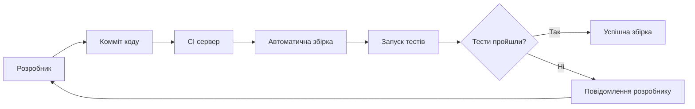
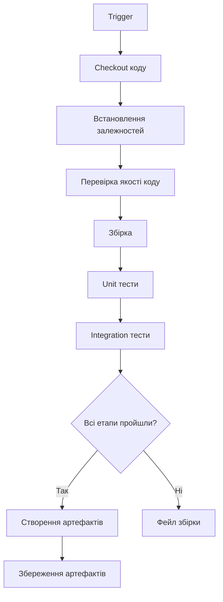
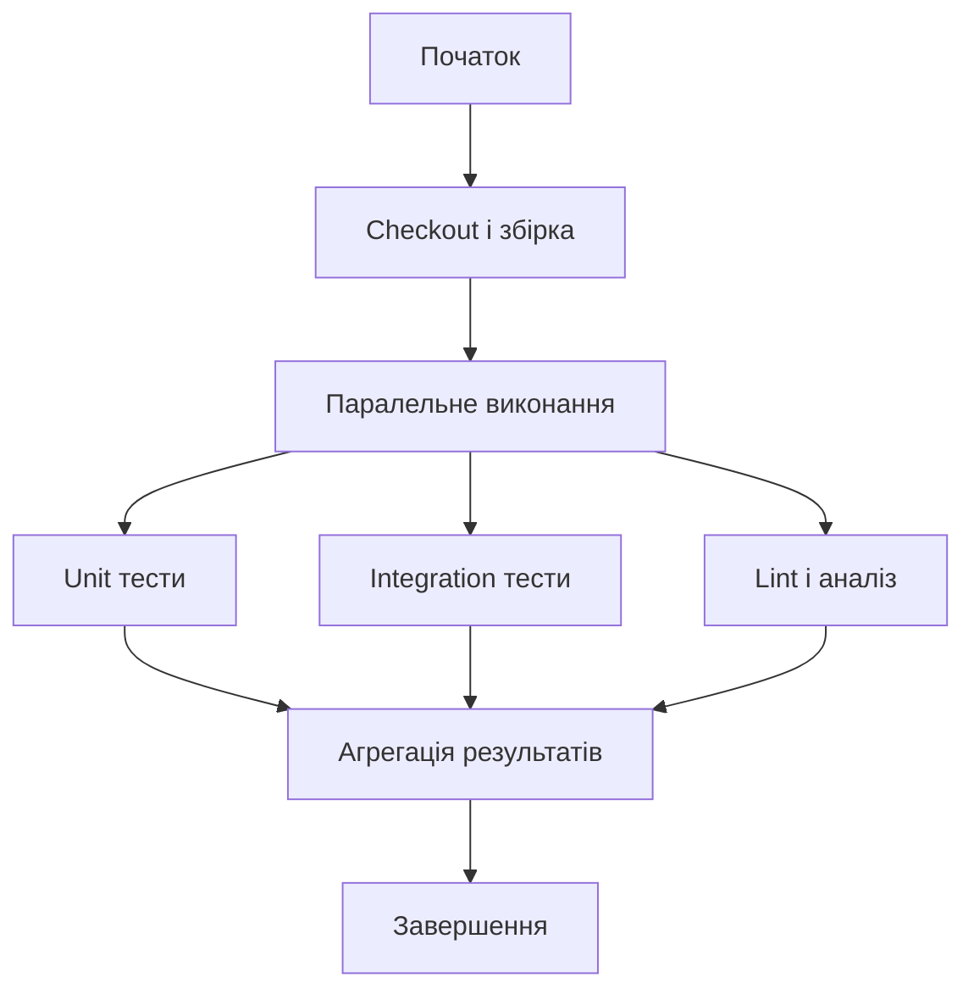
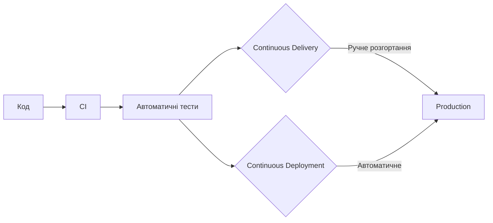
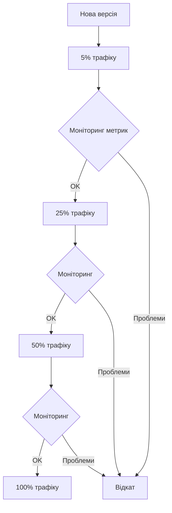
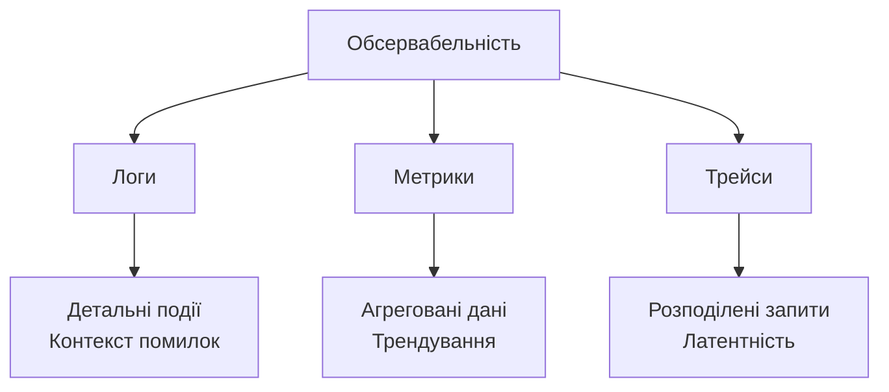
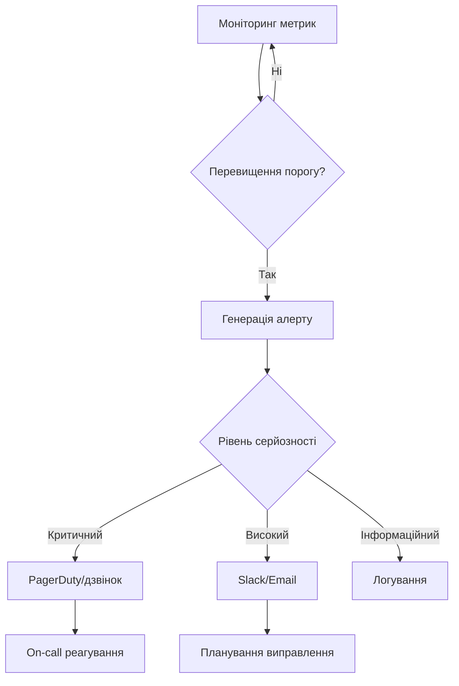
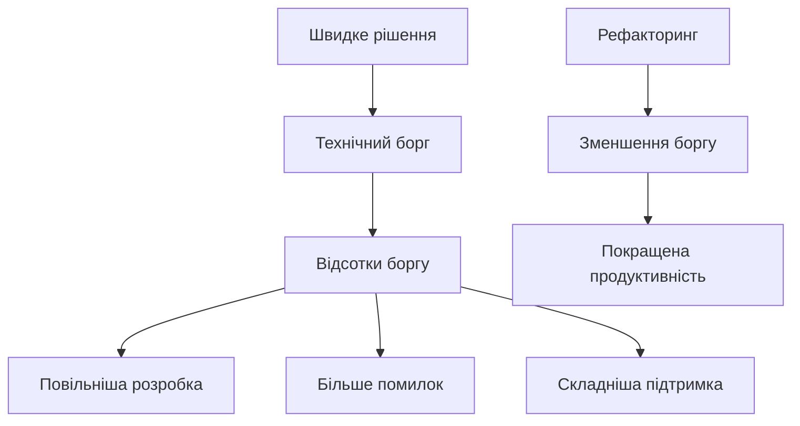

# Лекція 13. CI/CD, моніторинг та підтримка якості коду

## Вступ

Сучасна програмна інженерія немислима без автоматизації процесів доставки коду від розробника до кінцевого користувача. Continuous Integration та Continuous Deployment разом з постійним моніторингом та контролем якості коду формують основу ефективної DevOps культури. Ці практики дозволяють командам швидко випускати нові функції, зберігаючи при цьому високу якість та стабільність продукту.

У цій лекції ми детально розглянемо, як побудувати ефективний CI/CD пайплайн, які інструменти та практики допомагають підтримувати якість коду на високому рівні, та як моніторинг допомагає виявляти проблеми до того, як вони вплинуть на користувачів.

## Основи Continuous Integration

### Концепція та принципи

Continuous Integration є практикою розробки, коли розробники регулярно інтегрують свої зміни в спільну кодову базу, зазвичай кілька разів на день. Кожна інтеграція автоматично перевіряється збіркою та тестами, що дозволяє виявити проблеми якомога раніше.

Головна мета CI полягає в тому, щоб знайти та виправити помилки швидко, покращити якість програмного забезпечення та скоротити час валідації та випуску нових оновлень. Замість довгих циклів інтеграції наприкінці проєкту, команда постійно інтегрує невеликі порції коду, що значно знижує ризики.



Основні принципи CI включають підтримку єдиного репозиторію коду, автоматизацію збірки, самотестування збірки, щоденні комміти, збірку кожного комміту, швидку збірку, тестування в клоні продакшн середовища, легкий доступ до останньої збірки та прозорість процесу для всієї команди.

### Переваги впровадження CI

Впровадження Continuous Integration надає численні переваги для команди розробки та якості продукту. Раннє виявлення помилок дозволяє виправляти їх тоді, коли контекст ще свіжий у пам'яті розробника, що робить процес виправлення швидшим та дешевшим.

Зменшення інтеграційних проблем відбувається через часту інтеграцію невеликих змін. Замість "інтеграційного пекла" наприкінці спринту, коли потрібно зливати великі гілки з конфліктами, команда працює з постійно інтегрованим кодом.

Підвищення впевненості в коді досягається через автоматичне тестування кожної зміни. Команда знає, що якщо збірка проходить, код відповідає базовим вимогам якості. Прозорість стану проєкту дозволяє кожному члену команди бачити, чи працює поточна версія коду та які тести падають.

### Виклики при впровадженні CI

Перехід до CI може зустріти опір від команди, особливо якщо розробники звикли до довгих циклів роботи в ізольованих гілках. Культурна зміна вимагає часу та освіти, щоб команда зрозуміла переваги частих інтеграцій.

Підтримка швидких тестів є критично важливою для ефективного CI. Якщо виконання всіх тестів займає години, розробники не отримають швидкого фідбеку, і процес стане неефективним. Необхідна стратегія організації тестів у швидкі та повільні набори.

Управління залежностями може ускладнюватися при частих інтеграціях. Важливо мати надійний спосіб керування зовнішніми бібліотеками та забезпечити відтворюваність збірки у будь-якому середовищі.

## Побудова CI пайплайну

### Компоненти CI пайплайну

Типовий CI пайплайн складається з послідовності етапів, кожен з яких виконує певні перевірки та підготовку коду. Початковий етап включає клонування репозиторію та підготовку робочого середовища.

Етап збірки компілює код, завантажує залежності та створює артефакти, готові до розгортання. Для інтерпретованих мов, таких як Python або JavaScript, цей етап може включати перевірку синтаксису та підготовку пакетів.

Етап тестування запускає різні типи тестів у певному порядку. Зазвичай спочатку виконуються швидкі unit тести, потім integration тести, і нарешті більш повільні тести, якщо попередні етапи пройшли успішно.



Етапи аналізу коду перевіряють дотримання стандартів кодування, виявляють потенційні помилки через статичний аналіз та вимірюють покриття коду тестами. Ці перевірки допомагають підтримувати високу якість кодової бази.

### Популярні CI системи

GitHub Actions інтегрований безпосередньо в GitHub та надає зручний спосіб автоматизації workflows. Конфігурація описується у YAML файлах, розміщених у репозиторії, що робить налаштування прозорим та версійованим.

```yaml
name: CI Pipeline

on:
  push:
    branches: [ main, develop ]
  pull_request:
    branches: [ main ]

jobs:
  test:
    runs-on: ubuntu-latest

    steps:
    - uses: actions/checkout@v2

    - name: Set up Python
      uses: actions/setup-python@v2
      with:
        python-version: 3.9

    - name: Install dependencies
      run: |
        python -m pip install --upgrade pip
        pip install -r requirements.txt

    - name: Run tests
      run: |
        pytest tests/ --cov=app

    - name: Code quality check
      run: |
        flake8 app/
        black --check app/
```

GitLab CI/CD також використовує конфігураційні файли у репозиторії та надає потужні можливості для організації складних пайплайнів з паралельним виконанням та умовною логікою.

Jenkins є більш традиційним та гнучким рішенням з величезною екосистемою плагінів. Хоча налаштування може бути складнішим, Jenkins надає максимальну гнучкість для складних сценаріїв.

CircleCI та Travis CI є хмарними рішеннями, які популярні для open source проєктів завдяки безкоштовним тарифам для публічних репозиторіїв.

### Оптимізація швидкості пайплайну

Швидкість виконання CI пайплайну критично важлива для продуктивності команди. Довгі пайплайни уповільнюють цикл розробки та зменшують ефективність зворотного зв'язку.

Паралелізація є ключовою технікою для прискорення пайплайну. Незалежні завдання, такі як різні групи тестів або аналіз коду, можуть виконуватися одночасно на різних серверах.



Кешування залежностей значно економить час, уникаючи повторного завантаження бібліотек, які не змінилися. Сучасні CI системи надають вбудовані механізми кешування для популярних пакетних менеджерів.

Інкрементальна збірка будує лише ті частини проєкту, які змінилися з попереднього разу. Це особливо ефективно для великих монорепозиторіїв з багатьма незалежними модулями.

Вибіркове запускання тестів на основі змінених файлів може значно прискорити пайплайн. Якщо зміни стосувалися лише певного модуля, немає необхідності запускати всі тести для всієї системи.

## Continuous Deployment та Delivery

### Відмінності між CD та CD

Continuous Delivery означає, що код завжди знаходиться в стані, готовому до розгортання у продакшн. Кожна успішна збірка проходить через всі етапи тестування та підготовки, але фінальне розгортання у продакшн відбувається вручну за рішенням команди.

Continuous Deployment іде далі, автоматизуючи також і розгортання у продакшн. Кожна зміна, яка проходить всі етапи пайплайну, автоматично розгортається користувачам без ручного втручання.



Вибір між Continuous Delivery та Continuous Deployment залежить від контексту проєкту, вимог до компліансу, зрілості процесів та ризик-толерантності організації. Багато команд починають з Continuous Delivery та поступово переходять до Continuous Deployment по мірі зростання впевненості.

### Стратегії розгортання

Blue-Green deployment передбачає наявність двох ідентичних продакшн середовищ. Нова версія розгортається в неактивне середовище, де може бути протестована. Після успішної перевірки трафік переключається на нове середовище миттєво.

Canary deployment поступово розгортає нову версію невеликій частині користувачів, поступово збільшуючи відсоток. Це дозволяє виявити проблеми на невеликій аудиторії перед повним розгортанням.



Rolling deployment поступово замінює екземпляри старої версії новою, підтримуючи доступність сервісу протягом усього процесу. Це природна стратегія для систем з балансуванням навантаження.

Feature flags дозволяють розгортати код з новими функціями, які спочатку вимкнені. Функції можна активувати вибірково для певних користувачів або поступово для всіх, незалежно від циклу розгортання коду.

### Управління конфігурацією

Конфігурація застосунку не повинна бути захардкоджена в коді. Принцип "конфігурація як код" передбачає зберігання параметрів середовища окремо та можливість їх зміни без перезбірки застосунку.

Змінні середовища є найпростішим способом управління конфігурацією для різних середовищ. Застосунок отримує параметри підключення до бази даних, API ключі та інші налаштування через environment variables.

Секрети, такі як паролі та API ключі, потребують особливої уваги. Їх не можна зберігати в репозиторії коду або конфігураційних файлах. Сучасні рішення, як HashiCorp Vault, AWS Secrets Manager або Azure Key Vault, надають безпечні способи зберігання та доступу до секретів.

## Моніторинг та обсервабельність

### Концепція обсервабельності

Обсервабельність є властивістю системи, яка дозволяє розуміти її внутрішній стан на основі зовнішніх виходів. У контексті програмних систем це означає можливість відповісти на будь-яке питання про поведінку системи через аналіз телеметричних даних.

Три стовпи обсервабельності включають логи, метрики та трейси. Логи надають детальну інформацію про окремі події в системі. Метрики показують агреговані числові показники, такі як кількість запитів за секунду або використання пам'яті. Трейси відстежують шлях окремих запитів через розподілену систему.



Моніторинг відрізняється від обсервабельності тим, що він зазвичай фокусується на відомих проблемах та заздалегідь визначених метриках. Обсервабельність дозволяє досліджувати невідомі проблеми та ставити нові питання без необхідності завчасно інструментувати систему для кожного можливого питання.

### Ключові метрики для моніторингу

Golden Signals від Google SRE надають чотири ключові категорії метрик, які мають відстежуватися для кожного сервісу. Латентність вимірює час, необхідний для обробки запиту. Трафік показує кількість запитів до системи. Помилки відстежують частоту невдалих запитів. Сатурація вказує на використання ресурсів системи.

USE метод фокусується на ресурсах системи. Для кожного ресурсу відстежується Utilization, наскільки зайнятий ресурс, Saturation, наскільки він перевантажений, та Errors, кількість помилок при роботі з ресурсом.

RED метод зосереджується на сервісах. Rate вимірює кількість запитів за одиницю часу, Errors відстежує частоту помилок, Duration показує час обробки запитів.

### Інструменти моніторингу

Prometheus є популярною open-source системою моніторингу та алертингу, спроектованою для збору та зберігання метрик часових рядів. Prometheus періодично опитує цілі для збору метрик, зберігає їх в ефективному форматі та надає потужну мову запитів PromQL для аналізу даних.

Grafana надає візуалізацію для метрик з різних джерел, включаючи Prometheus. Dashboards в Grafana дозволяють створювати інформативні панелі з графіками, таблицями та алертами для моніторингу стану системи в реальному часі.

ELK Stack, що складається з Elasticsearch, Logstash та Kibana, є популярним рішенням для централізованого збору та аналізу логів. Logstash збирає та обробляє логи з різних джерел, Elasticsearch зберігає та індексує їх, а Kibana надає інтерфейс для пошуку та візуалізації.

Jaeger та Zipkin є системами розподіленого трейсингу, які допомагають відстежувати запити через мікросервісну архітектуру, виявляючи вузькі місця продуктивності та проблеми з латентністю.

### Алертинг та реагування на інциденти

Ефективний алертинг інформує команду про проблеми, які потребують негайної уваги, не перевантажуючи зайвими сповіщеннями. Кожен алерт має бути actionable, тобто вказувати на проблему, яку можна та треба виправити.

Рівні серйозності алертів допомагають визначити пріоритет реагування. Критичні алерти вимагають негайної реакції та можуть будити команду вночі. Попередження інформують про потенційні проблеми, які слід розглянути в робочий час. Інформаційні повідомлення корисні для постморт аналізу, але не вимагають негайних дій.



On-call ротація забезпечує наявність відповідальної особи для реагування на критичні проблеми в будь-який час. Інструменти як PagerDuty або Opsgenie управляють розкладом on-call та ескалаціями, якщо перша особа не реагує.

Runbooks документують процедури реагування на типові проблеми, надаючи покрокові інструкції для їх вирішення. Це особливо корисно для нових членів команди або під час стресових ситуацій, коли потрібна чітка інструкція.

## Підтримка якості коду

### Статичний аналіз коду

Статичний аналіз перевіряє код без його виконання, виявляючи потенційні помилки, порушення стандартів кодування та проблеми безпеки. Це потужний інструмент для підтримки якості коду на високому рівні.

Linters перевіряють код на відповідність стандартам стилю та виявляють поширені помилки. Для Python популярні flake8, pylint та black. Для JavaScript використовуються ESLint та Prettier. Для Java SonarQube та Checkstyle.

```python
# Приклад конфігурації flake8
# файл .flake8
[flake8]
max-line-length = 88
exclude = .git,__pycache__,migrations
ignore = E203, W503
```

Статичні аналізатори типів, такі як mypy для Python або TypeScript для JavaScript, виявляють помилки типізації, які могли б призвести до runtime помилок. Вони особливо корисні для великих кодових баз, де важко відстежити всі можливі типи даних.

Інструменти аналізу безпеки виявляють вразливості у коді та залежностях. Bandit для Python, npm audit для Node.js та Dependabot для GitHub автоматично перевіряють наявність відомих вразливостей у використовуваних бібліотеках.

### Code Review практики

Code review є критично важливим процесом для підтримки якості коду та обміну знаннями в команді. Кожна зміна коду має бути переглянута принаймні одним іншим розробником перед злиттям у основну гілку.

Pull Request або Merge Request є стандартним механізмом для пропонування та перегляду змін. Автор створює запит, описує зроблені зміни та їхнє призначення. Рев'юери аналізують код, залишають коментарі та схвалюють або запитують зміни.

Ефективний code review фокусується на важливих аспектах, таких як правильність логіки, дотримання архітектурних принципів, читабельність та підтримуваність коду, потенційні проблеми продуктивності та безпеки. Дріб'язкові питання стилю краще делегувати автоматизованим інструментам.

Конструктивний фідбек у code review має бути конкретним, пояснювальним та доброзичливим. Замість "цей код поганий" краще написати "цей підхід може призвести до проблем з продуктивністю при великій кількості елементів, варто розглянути використання словника замість списку для пошуку".

### Технічний борг

Технічний борг є метафорою для опису наслідків швидких рішень у розробці, які полегшують життя зараз, але створюють додаткову роботу в майбутньому. Подібно до фінансового боргу, технічний борг накопичує "відсотки" у вигляді додаткових зусиль на підтримку та розвиток системи.

Джерелами технічного боргу можуть бути свідомі рішення пожертвувати якістю заради швидкості, недостатнє розуміння вимог на момент реалізації, зміна вимог після імплементації, накопичення застарілих технологій та бібліотек, відсутність документації та тестів.



Управління технічним боргом вимагає усвідомлення його наявності та планування часу на його погашення. Команди можуть виділяти певний відсоток часу кожного спринту на рефакторинг та покращення якості коду, не дозволяючи боргу накопичуватися до критичного рівня.

### Метрики якості коду

Code complexity metrics допомагають ідентифікувати складні ділянки коду, які важко підтримувати та тестувати. Cyclomatic complexity вимірює кількість незалежних шляхів через код. Високі значення вказують на необхідність рефакторингу для спрощення логіки.

Code duplication виявляє повторювані фрагменти коду, які варто виділити в окремі функції або модулі. Дублювання збільшує складність підтримки, оскільки зміни треба вносити в кількох місцях.

Test coverage показує, яка частина коду покрита тестами, але сама по собі не гарантує якість. Важливо аналізувати не лише загальне покриття, але й якість тестів та покриття критичних шляхів виконання.

Maintainability index об'єднує різні метрики для оцінки загальної підтримуваності коду. Низькі значення сигналізують про необхідність рефакторингу для покращення структури та читабельності коду.

## Інтеграція практик у процес розробки

### Shift Left Testing

Концепція Shift Left передбачає перенесення активностей з тестування та забезпечення якості на ранні етапи розробки. Замість тестування готового продукту в кінці циклу, якість вбудовується в процес з самого початку.

Тестування на етапі проєктування включає review архітектурних рішень на предмет тестованості та виявлення потенційних проблем до написання коду. Статичний аналіз та linting виконуються ще під час написання коду в IDE розробника.

Unit тести пишуться одночасно з кодом або навіть до нього за підходом Test-Driven Development. Це забезпечує, що код створюється з урахуванням тестованості та має чіткі інтерфейси.

### Культура якості в команді

Якість коду є відповідальністю всієї команди, а не окремих QA спеціалістів. Кожен розробник має відчувати власність за якість коду, який він створює, включаючи написання тестів, виправлення помилок та участь у code review.

Pair programming та mob programming є практиками, де кілька розробників працюють над одним завданням одночасно. Це природним чином включає code review в процес розробки та сприяє обміну знаннями.

Регулярні ретроспективи дозволяють команді обговорювати, що працює добре, а що потребує покращення в процесах розробки та забезпечення якості. Це створює культуру постійного вдосконалення.

### Баланс між швидкістю та якістю

Існує поширене переконання, що якість та швидкість є взаємовиключними, але насправді інвестиції в якість підвищують довгострокову швидкість розробки. Чистий, добре протестований код легше модифікувати та розширювати.

Мінімально життєздатний продукт не означає погану якість. MVP має фокусуватися на мінімальному наборі функцій, але ці функції мають бути реалізовані якісно. Технічний борг, накопичений заради швидкого випуску, уповільнює подальший розвиток.

Автоматизація рутинних перевірок через CI/CD дозволяє підтримувати високу якість без сповільнення розробки. Те, що колись вимагало годин ручного тестування, тепер відбувається автоматично за хвилини.

## Сучасні тренди та практики

### Infrastructure as Code

Управління інфраструктурою через код дозволяє застосовувати до неї ті ж практики, що й до програмного коду, включаючи version control, code review та автоматизоване тестування. Інструменти як Terraform, Ansible або AWS CloudFormation описують бажаний стан інфраструктури декларативно.

Переваги IaC включають відтворюваність середовищ, можливість швидко створювати ідентичні копії для різних цілей, документування інфраструктури у вигляді коду та можливість відкату змін через version control.

### GitOps

GitOps є підходом до управління інфраструктурою та додатками, де Git репозиторій є єдиним джерелом істини для бажаного стану системи. Зміни в інфраструктурі або конфігурації застосунку проходять через Pull Request, забезпечуючи трекування всіх змін та можливість їх перегляду.

Автоматичні агенти постійно звіряють фактичний стан системи з описаним у Git репозиторії та автоматично синхронізують їх. Це забезпечує, що продакшн середовище завжди відповідає конфігурації у репозиторії.

### Chaos Engineering

Chaos Engineering є дисципліною експериментування з розподіленими системами для побудови впевненості в їхній здатності витримувати турбулентні умови. Замість очікування збоїв у продакшні, команди свідомо вводять відмови в контрольованих умовах для перевірки стійкості системи.

Приклади chaos engineering включають симуляцію відмов серверів, мережевих проблем, високого навантаження або пошкодження даних. Інструменти як Chaos Monkey від Netflix або Gremlin надають можливості для організованого проведення таких експериментів.

## Висновки

CI/CD, моніторинг та підтримка якості коду є взаємопов'язаними практиками, які разом формують основу сучасної культури розробки програмного забезпечення. Автоматизація процесів доставки коду дозволяє командам швидко реагувати на зміни та регулярно випускати нові функції, зберігаючи при цьому високу якість.

Ефективний моніторинг надає необхідну видимість стану системи, дозволяючи виявляти та вирішувати проблеми до того, як вони вплинуть на користувачів. Обсервабельність виходить за рамки простого моніторингу, надаючи можливість розуміти поведінку складних систем.

Підтримка якості коду через автоматизовані перевірки, code review та управління технічним боргом є інвестицією в довгострокову продуктивність команди. Високоякісний код легше розуміти, модифікувати та розширювати, що прискорює розробку нових функцій.

Успішне впровадження цих практик вимагає не лише технічних інструментів, але й культурних змін у команді та організації. Створення культури якості, де кожен член команди відчуває відповідальність за якість продукту, є ключовим фактором успіху.
