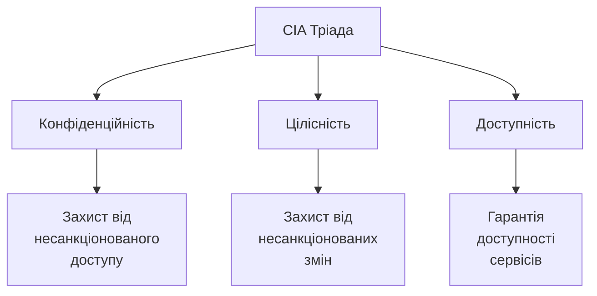
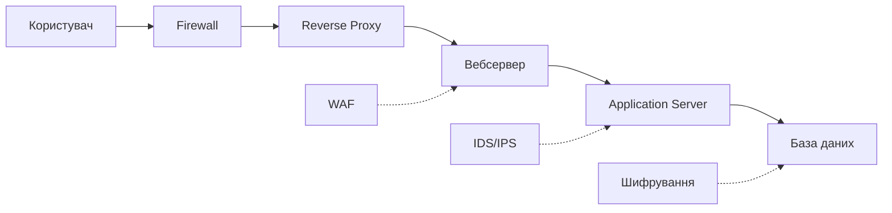
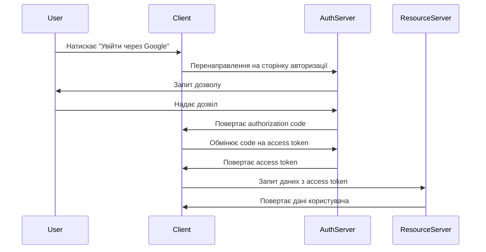

# Лекція 14. Інформаційна безпека в розробці ПЗ

## Вступ

Інформаційна безпека стала невід'ємною частиною процесу розробки програмного забезпечення. У сучасному цифровому світі, де дані є найціннішим активом організацій, а кіберзагрози стають дедалі складнішими та частішими, розробники повинні інтегрувати практики безпеки на всіх етапах життєвого циклу програмного забезпечення. Більше не достатньо додавати безпеку як окремий компонент наприкінці розробки. Сучасний підхід вимагає, щоб безпека була вбудована в архітектуру, код та процеси з самого початку.

Ця лекція розглядає фундаментальні принципи інформаційної безпеки в контексті розробки програмного забезпечення, найпоширеніші вразливості та загрози, методи їх виявлення та запобігання, а також сучасні практики та інструменти для створення безпечних додатків. Особливу увагу приділено практичному застосуванню знань з безпеки в повсякденній роботі розробника.

## Основи інформаційної безпеки

### Тріада CIA

Фундаментом інформаційної безпеки є три основні принципи, відомі як тріада CIA: конфіденційність (Confidentiality), цілісність (Integrity) та доступність (Availability). Ці три принципи формують основу для всіх рішень у галузі безпеки та повинні враховуватися при проєктуванні кожної системи.



Конфіденційність забезпечує, що інформація доступна лише тим особам, які мають відповідні права доступу. Це передбачає використання механізмів аутентифікації для ідентифікації користувачів, авторизації для визначення їхніх прав та шифрування для захисту даних під час передачі та зберігання. Порушення конфіденційності може призвести до витоку персональних даних, комерційної таємниці або іншої чутливої інформації.

Цілісність гарантує, що дані не були змінені несанкціонованим способом. Система повинна мати механізми для виявлення будь-яких несанкціонованих модифікацій даних та забезпечувати можливість їх відновлення. Це включає використання контрольних сум, цифрових підписів, журналювання змін та інших технік для перевірки автентичності даних.

Доступність означає, що авторизовані користувачі можуть отримати доступ до інформації та ресурсів тоді, коли це необхідно. Система повинна бути захищена від атак типу відмови в обслуговуванні, мати механізми резервного копіювання та відновлення, а також забезпечувати належну продуктивність навіть під навантаженням.

### Принцип найменших привілеїв

Принцип найменших привілеїв стверджує, що кожен компонент системи, користувач або процес повинен мати лише ті права доступу, які абсолютно необхідні для виконання його функцій. Це один з найважливіших принципів безпечного проєктування, який значно обмежує потенційні наслідки успішної атаки або помилки в коді.

Застосування цього принципу передбачає створення детальної моделі прав доступу, де кожна роль в системі має чітко визначені дозволи. Замість надання широких прав за замовчуванням, система повинна починати з мінімальних прав та надавати додаткові привілеї лише за явним запитом та обґрунтуванням. Наприклад, веббастосунок не повинен підключатися до бази даних з правами адміністратора, якщо йому потрібно лише читати та записувати дані в конкретні таблиці.

### Захист в глибину

Концепція захисту в глибину передбачає створення кількох рівнів безпеки, де кожен рівень є незалежним бар'єром для потенційного зловмисника. Якщо один рівень захисту буде скомпрометований, інші рівні все ще забезпечуватимуть захист системи. Це схоже на середньовічний замок з кількома стінами, рвами та воротами.



У вебдодатках захист в глибину може включати firewall на мережевому рівні, вебсервер з налаштованими правилами безпеки, вебфреймворк з вбудованими механізмами захисту, рівень бізнес-логіки з валідацією даних та базу даних з контролем доступу. Кожен рівень перевіряє та фільтрує запити, додаючи додатковий шар захисту.

### Безпека через дизайн

Безпека через дизайн означає інтеграцію вимог безпеки на етапі проєктування системи, а не додавання їх пізніше як латки. Цей підхід є набагато ефективнішим та економічнішим, оскільки виправлення вразливостей на пізніх етапах розробки або після випуску продукту коштує значно дорожче.

Проєктування з урахуванням безпеки включає аналіз загроз, моделювання можливих атак, визначення поверхні атаки та створення архітектури, яка мінімізує ризики. Розробники повинні задавати питання про безпеку на кожному етапі: Хто може отримати доступ до цих даних? Що станеться, якщо цей компонент буде скомпрометований? Як система поводитиметься в разі атаки?

## Поширені вразливості вебдодатків

### OWASP Top 10

OWASP Top 10 є стандартним документом, який описує десять найкритичніших ризиків безпеки вебдодатків. Цей список регулярно оновлюється на основі даних про реальні атаки та вразливості, виявлені в додатках по всьому світу. Розуміння цих ризиків є фундаментальною вимогою для кожного розробника.

Список OWASP Top 10 2021 року включає такі категорії ризиків: порушення контролю доступу, криптографічні збої, ін'єкції, небезпечний дизайн, неправильна конфігурація безпеки, вразливі та застарілі компоненти, помилки ідентифікації та аутентифікації, збої цілісності програмного забезпечення та даних, недостатнє журналювання та моніторинг, підробка запитів на стороні сервера.

### SQL ін'єкції

SQL ін'єкція залишається однією з найнебезпечніших вразливостей, хоча методи її запобігання добре відомі. Ця атака відбувається, коли зловмисник може вставити власний SQL код в запит до бази даних через невалідовані вхідні дані. Успішна SQL ін'єкція може дозволити читання, модифікацію або видалення даних, обхід аутентифікації або навіть виконання команд операційної системи.

Розглянемо небезпечний код, який вразливий до SQL ін'єкції:

```python
# Небезпечний код - НЕ ВИКОРИСТОВУЙТЕ
username = request.form['username']
password = request.form['password']

query = f"SELECT * FROM users WHERE username = '{username}' AND password = '{password}'"
cursor.execute(query)
```

Якщо зловмисник введе як username значення `admin' --`, результуючий SQL запит стане:

```sql
SELECT * FROM users WHERE username = 'admin' -- ' AND password = ''
```

Частина після `--` є коментарем у SQL, тому перевірка паролю ігнорується. Правильний спосіб запобігти SQL ін'єкціям полягає у використанні підготовлених виразів з параметризованими запитами:

```python
# Безпечний код
username = request.form['username']
password = request.form['password']

query = "SELECT * FROM users WHERE username = ? AND password = ?"
cursor.execute(query, (username, password))
```

Параметризовані запити гарантують, що вхідні дані завжди трактуються як дані, а не як частина SQL команди. Бібліотеки роботи з базами даних автоматично екранують спеціальні символи, роблячи ін'єкцію неможливою.

### Cross-Site Scripting

Cross-Site Scripting або XSS дозволяє зловмисникам виконувати JavaScript код в браузері жертви в контексті вразливого вебсайту. Існує три основні типи XSS атак: відбита XSS, де шкідливий код приходить з HTTP запиту, збережена XSS, де код зберігається на сервері, та DOM-based XSS, де вразливість знаходиться в клієнтському коді.

XSS атаки можуть призвести до крадіжки сесійних cookies, перенаправлення користувачів на фішингові сайти, модифікації вмісту сторінки або виконання дій від імені користувача. Навіть здавалося б нешкідливий вивід даних користувача може стати вектором атаки.

Приклад вразливого коду:

```html
<!-- Небезпечний код -->
<div>Привіт, <?php echo $_GET['name']; ?>!</div>
```

Якщо параметр name містить `<script>alert('XSS')</script>`, цей код буде виконаний в браузері. Правильний підхід вимагає екранування всіх даних перед виводом:

```html
<!-- Безпечний код -->
<div>Привіт, <?php echo htmlspecialchars($_GET['name'], ENT_QUOTES, 'UTF-8'); ?>!</div>
```

Сучасні фреймворки зазвичай мають вбудовані механізми автоматичного екранування. React, наприклад, автоматично екранує всі значення перед їх рендерингом. Однак розробники повинні бути обережними при використанні функцій, які обходять цей захист, таких як `dangerouslySetInnerHTML` у React.

### Cross-Site Request Forgery

CSRF атаки змушують автентифікованого користувача виконати небажану дію на вебсайті, де він автентифікований. Зловмисник створює шкідливу сторінку, яка відправляє запити до цільового сайту, використовуючи сесію жертви. Оскільки браузер автоматично відправляє cookies з кожним запитом до домену, атака виконується від імені користувача.

```html
<!-- Шкідлива сторінка зловмисника -->

```

Коли жертва відкриває цю сторінку, будучи автентифікованою на bank.com, браузер автоматично відправить запит разом з сесійними cookies, і переказ може бути виконаний без відома користувача.

Захист від CSRF вимагає використання токенів, які перевіряють, що запит дійсно походить від легітимної форми на вашому сайті:

```python
# Генерація CSRF токена
from secrets import token_urlsafe

csrf_token = token_urlsafe(32)
session['csrf_token'] = csrf_token

# Перевірка при обробці форми
if request.form['csrf_token'] != session['csrf_token']:
    abort(403)
```

Сучасні вебфреймворки зазвичай включають вбудовану підтримку CSRF захисту. Django, наприклад, автоматично перевіряє CSRF токени для всіх POST запитів, якщо захист не вимкнений явно.

## Аутентифікація та авторизація

### Безпечне зберігання паролів

Паролі ніколи не повинні зберігатися в відкритому вигляді або з використанням двонаправленого шифрування. Замість цього використовуються криптографічні хеш-функції, які перетворюють пароль на незворотний хеш. Навіть якщо база даних буде скомпрометована, зловмисник не зможе відновити паролі користувачів.

Проста хеш-функція недостатня для безпечного зберігання паролів, оскільки однакові паролі завжди дають однаковий хеш, що дозволяє використовувати rainbow tables для їх злому. Сучасний підхід вимагає використання salt, унікального випадкового значення для кожного паролю, та повільних хеш-функцій, розроблених спеціально для паролів.

```python
from werkzeug.security import generate_password_hash, check_password_hash

# Створення хешу паролю з salt
password = "user_password"
hashed = generate_password_hash(password, method='pbkdf2:sha256', salt_length=16)

# hashed виглядає приблизно так:
# pbkdf2:sha256:260000$salt$hash

# Перевірка паролю
is_valid = check_password_hash(hashed, password)
```

Функція `generate_password_hash` використовує PBKDF2, алгоритм деривації ключів, який застосовує хеш-функцію багато разів, роблячи підбір паролів методом грубої сили дуже повільним. Параметр iterations визначає кількість ітерацій і повинен бути достатньо великим для захисту від сучасних обчислювальних потужностей, але не настільки великим, щоб створювати проблеми з продуктивністю.

Альтернативними алгоритмами є bcrypt та Argon2, які спеціально розроблені для хешування паролів і мають додатковий захист від атак з використанням спеціалізованого обладнання. Argon2 вважається найсучаснішим вибором і виграв конкурс Password Hashing Competition у 2015 році.

### Багатофакторна аутентифікація

Багатофакторна аутентифікація додає додатковий рівень безпеки, вимагаючи від користувача надати два або більше факторів підтвердження особи. Фактори поділяються на три категорії: щось, що ви знаєте, такі як пароль або PIN, щось, що ви маєте, такі як смартфон або апаратний токен, та щось, що ви є, такі як відбиток пальця або розпізнавання обличчя.

Найпоширенішою формою MFA є Time-based One-Time Password або TOTP, де користувач має додаток на смартфоні, який генерує шестизначний код, що змінюється кожні 30 секунд. Цей підхід реалізується за допомогою бібліотек, які імплементують алгоритм TOTP згідно з RFC 6238.

```python
import pyotp
import qrcode

# Генерація секретного ключа для користувача
secret = pyotp.random_base32()
user.mfa_secret = secret

# Створення QR коду для налаштування додатку
totp_uri = pyotp.totp.TOTP(secret).provisioning_uri(
    name=user.email,
    issuer_name='YourApp'
)

# Генерація QR коду
img = qrcode.make(totp_uri)
img.save('qr_code.png')

# Перевірка TOTP коду при вході
totp = pyotp.TOTP(user.mfa_secret)
is_valid = totp.verify(user_provided_code, valid_window=1)
```

Параметр `valid_window` дозволяє прийняти коди з попереднього та наступного часових вікон, компенсуючи можливе розсинхронізування годинників між сервером та пристроєм користувача.

### OAuth 2.0 та OpenID Connect

OAuth 2.0 є стандартом авторизації, який дозволяє додаткам отримувати обмежений доступ до облікових записів користувачів на інших сервісах без розголошення паролів. Це той механізм, який дозволяє увійти на вебсайт через Google, Facebook або інші провайдери ідентичності.



OpenID Connect розширює OAuth 2.0, додаючи рівень ідентичності поверх авторизації. Замість лише отримання дозволу на доступ до ресурсів, OpenID Connect також надає інформацію про автентифікованого користувача у вигляді ID token, який є JSON Web Token.

Впровадження OAuth 2.0 у власному додатку вимагає розуміння різних типів flow. Authorization Code Flow є найбезпечнішим для вебдодатків, Implicit Flow використовувався для single-page додатків, хоча зараз рекомендується Authorization Code Flow з PKCE, а Client Credentials Flow призначений для machine-to-machine аутентифікації.

### JWT та безпека токенів

JSON Web Token є компактним самодостатнім способом безпечної передачі інформації між сторонами у вигляді JSON об'єкта. JWT складається з трьох частин, розділених крапками: заголовок, який містить тип токена та алгоритм підпису, payload з claims або твердженнями про користувача та інші дані, та підпис, який забезпечує цілісність токена.

```python
import jwt
from datetime import datetime, timedelta

# Створення JWT токена
payload = {
    'user_id': user.id,
    'email': user.email,
    'exp': datetime.utcnow() + timedelta(hours=1),
    'iat': datetime.utcnow()
}

secret_key = app.config['SECRET_KEY']
token = jwt.encode(payload, secret_key, algorithm='HS256')

# Верифікація та декодування токена
try:
    decoded = jwt.decode(token, secret_key, algorithms=['HS256'])
    user_id = decoded['user_id']
except jwt.ExpiredSignatureError:
    # Токен прострочений
    return None
except jwt.InvalidTokenError:
    # Токен невалідний
    return None
```

При роботі з JWT важливо дотримуватися кількох принципів безпеки. Токени повинні мати обмежений час життя, зазвичай від 15 хвилин до години для access tokens. Чутлива інформація не повинна зберігатися в payload, оскільки вміст JWT може бути легко декодований. Для додаткової безпеки можна використовувати refresh tokens з довшим терміном дії, які зберігаються безпечніше та використовуються лише для отримання нових access tokens.

## Безпека API

### Авторизація та контроль доступу

API повинні мати чітку модель контролю доступу, яка визначає, які ресурси доступні кожному користувачу або ролі. Role-Based Access Control або RBAC є найпоширенішим підходом, де користувачі призначаються до ролей, а ролі мають певні дозволи.

```python
from functools import wraps
from flask import request, jsonify

def require_role(*roles):
    def decorator(f):
        @wraps(f)
        def decorated_function(*args, **kwargs):
            token = request.headers.get('Authorization')
            if not token:
                return jsonify({'error': 'Missing token'}), 401
            
            user = verify_token(token)
            if not user or user.role not in roles:
                return jsonify({'error': 'Insufficient permissions'}), 403
            
            return f(*args, **kwargs)
        return decorated_function
    return decorator

@app.route('/admin/users')
@require_role('admin')
def get_all_users():
    # Тільки адміністратори можуть бачити всіх користувачів
    users = User.query.all()
    return jsonify([u.to_dict() for u in users])
```

Більш гнучкою альтернативою є Attribute-Based Access Control або ABAC, де рішення про доступ приймаються на основі атрибутів користувача, ресурсу та контексту. Це дозволяє створювати складні правила доступу, наприклад, користувач може редагувати документ, якщо він є його автором або якщо документ має статус чернетки.

### Rate Limiting

Rate limiting захищає API від зловживань, обмежуючи кількість запитів, які користувач може зробити за певний період часу. Це запобігає атакам типу відмови в обслуговуванні, захищає від автоматичного підбору паролів та забезпечує справедливий розподіл ресурсів між користувачами.

```python
from flask_limiter import Limiter
from flask_limiter.util import get_remote_address

limiter = Limiter(
    app,
    key_func=get_remote_address,
    default_limits=["200 per day", "50 per hour"]
)

@app.route('/api/login')
@limiter.limit("5 per minute")
def login():
    # Дозволяємо лише 5 спроб входу за хвилину
    username = request.json.get('username')
    password = request.json.get('password')
    # логіка аутентифікації
```

Стратегії rate limiting можуть варіюватися від простих фіксованих вікон до складніших алгоритмів, таких як sliding window або token bucket. Вибір стратегії залежить від специфіки додатка та очікуваних патернів використання.

### Валідація вхідних даних

Всі дані, що надходять до API, повинні бути ретельно валідовані на сервері, незалежно від наявності валідації на клієнті. Клієнтська валідація може бути легко обійдена, тому серверна валідація є критичною для безпеки.

```python
from marshmallow import Schema, fields, validate, ValidationError

class UserRegistrationSchema(Schema):
    username = fields.Str(
        required=True,
        validate=[
            validate.Length(min=3, max=50),
            validate.Regexp(r'^[a-zA-Z0-9_]+$')
        ]
    )
    email = fields.Email(required=True)
    password = fields.Str(
        required=True,
        validate=validate.Length(min=8)
    )
    age = fields.Int(
        validate=validate.Range(min=18, max=120)
    )

@app.route('/api/register', methods=['POST'])
def register():
    schema = UserRegistrationSchema()
    try:
        data = schema.load(request.json)
    except ValidationError as err:
        return jsonify({'errors': err.messages}), 400
    
    # Обробка валідних даних
    user = create_user(data)
    return jsonify(user.to_dict()), 201
```

Валідація повинна перевіряти не лише формат даних, але й їх бізнес-логіку. Наприклад, при оновленні даних користувача, система повинна перевірити, що користувач має право змінювати саме ці дані, а не дані іншого користувача.

## Шифрування та криптографія

### Транспортне шифрування

HTTPS є обов'язковим для всіх сучасних вебдодатків. Transport Layer Security або TLS шифрує всі дані між клієнтом та сервером, захищаючи від перехоплення та модифікації даних в процесі передачі. Навіть якщо трафік буде перехоплений, зловмисник не зможе його прочитати або змінити без виявлення.

Сучасні практики вимагають використання TLS 1.2 або вище, оскільки старіші версії мають відомі вразливості. Налаштування серверів повинні вимикати слабкі шифри та використовувати Forward Secrecy, що забезпечує, що навіть якщо приватний ключ сервера буде скомпрометований, попередні сесії залишаться захищеними.

```nginx
# Приклад конфігурації Nginx для безпечного HTTPS
server {
    listen 443 ssl http2;
    server_name example.com;

    ssl_certificate /path/to/cert.pem;
    ssl_certificate_key /path/to/key.pem;

    ssl_protocols TLSv1.2 TLSv1.3;
    ssl_ciphers HIGH:!aNULL:!MD5;
    ssl_prefer_server_ciphers on;

    add_header Strict-Transport-Security "max-age=31536000; includeSubDomains" always;
}
```

Заголовок Strict-Transport-Security або HSTS вказує браузерам завжди використовувати HTTPS при доступі до сайту, навіть якщо користувач вводить адресу без https. Це захищає від атак типу SSL stripping.

### Шифрування даних у спокої

Чутливі дані повинні бути зашифровані не лише під час передачі, але й під час зберігання в базі даних або файловій системі. Це захищає дані у випадку фізичного доступу до серверів або витоку резервних копій.

```python
from cryptography.fernet import Fernet

# Генерація ключа шифрування (зберігається окремо від даних)
key = Fernet.generate_key()
cipher = Fernet(key)

# Шифрування чутливих даних
sensitive_data = "Номер кредитної картки: 1234-5678-9012-3456"
encrypted = cipher.encrypt(sensitive_data.encode())

# Збереження в базі даних
user.encrypted_payment_info = encrypted

# Дешифрування при потребі
decrypted = cipher.decrypt(user.encrypted_payment_info)
original_data = decrypted.decode()
```

Ключі шифрування повинні зберігатися окремо від зашифрованих даних, ідеально в спеціалізованих системах управління ключами, таких як AWS KMS, Azure Key Vault або HashiCorp Vault. Жорстке кодування ключів в коді або зберігання їх у тій же базі даних, що й зашифровані дані, робить шифрування марним.

### Цифрові підписи

Цифрові підписи забезпечують автентичність та цілісність даних. Вони гарантують, що дані не були змінені після підписання та дійсно походять від заявленого відправника. Це особливо важливо для критичних операцій, таких як фінансові транзакції або обмін медичними даними.

```python
from cryptography.hazmat.primitives import hashes
from cryptography.hazmat.primitives.asymmetric import rsa, padding

# Генерація пари ключів
private_key = rsa.generate_private_key(
    public_exponent=65537,
    key_size=2048
)
public_key = private_key.public_key()

# Підписання даних приватним ключем
message = b"Important transaction data"
signature = private_key.sign(
    message,
    padding.PSS(
        mgf=padding.MGF1(hashes.SHA256()),
        salt_length=padding.PSS.MAX_LENGTH
    ),
    hashes.SHA256()
)

# Перевірка підпису публічним ключем
try:
    public_key.verify(
        signature,
        message,
        padding.PSS(
            mgf=padding.MGF1(hashes.SHA256()),
            salt_length=padding.PSS.MAX_LENGTH
        ),
        hashes.SHA256()
    )
    print("Підпис валідний")
except:
    print("Підпис невалідний або дані змінені")
```

## Безпека залежностей

### Управління вразливостями

Використання сторонніх бібліотек та фреймворків є невід'ємною частиною сучасної розробки, але це також створює ризики безпеки. Вразливості в залежностях можуть зробити весь додаток вразливим, навіть якщо власний код написаний бездоганно.

Регулярне сканування залежностей на предмет відомих вразливостей є критичним. Інструменти як npm audit для JavaScript, Safety для Python або OWASP Dependency-Check для Java автоматично перевіряють залежності проти баз даних вразливостей.

```bash
# Перевірка вразливостей у Python проєкті
pip install safety
safety check

# Перевірка вразливостей у Node.js проєкті
npm audit
npm audit fix
```

Автоматизація цих перевірок в CI/CD pipeline забезпечує, що вразливі залежності не потраплять в production. Також важливо підписатися на security advisories для використовуваних бібліотек та фреймворків, щоб оперативно дізнаватися про нові вразливості.

### Принцип мінімальних залежностей

Кожна додаткова залежність збільшує поверхню атаки додатка. Перед додаванням нової бібліотеки варто оцінити її необхідність та альтернативи. Невелика функціональність, яку можна легко реалізувати самостійно, не завжди виправдовує додавання цілої бібліотеки з усіма її транзитивними залежностями.

При виборі залежностей важливо враховувати кілька факторів: активність розробки та підтримки проєкту, розмір спільноти та кількість контрибуторів, історію безпеки та швидкість реагування на вразливості, якість коду та тестове покриття, ліцензію та юридичні аспекти використання.

## Логування та моніторинг безпеки

### Що логувати

Ефективне логування є критичним для виявлення та розслідування інцидентів безпеки. Логи повинні фіксувати всі події, пов'язані з безпекою: спроби аутентифікації, успішні та невдалі, зміни конфігурації та прав доступу, доступ до чутливих даних, помилки валідації та відхилені запити, незвичайні паттерни поведінки.

```python
import logging
from functools import wraps

# Налаштування логера безпеки
security_logger = logging.getLogger('security')
security_logger.setLevel(logging.INFO)

handler = logging.FileHandler('security.log')
formatter = logging.Formatter(
    '%(asctime)s - %(levelname)s - %(message)s'
)
handler.setFormatter(formatter)
security_logger.addHandler(handler)

def log_security_event(event_type):
    def decorator(f):
        @wraps(f)
        def decorated_function(*args, **kwargs):
            user_id = get_current_user_id()
            ip_address = request.remote_addr
            
            security_logger.info(
                f"Event: {event_type}, "
                f"User: {user_id}, "
                f"IP: {ip_address}, "
                f"Function: {f.__name__}"
            )
            
            return f(*args, **kwargs)
        return decorated_function
    return decorator

@app.route('/api/sensitive-data')
@log_security_event('SENSITIVE_DATA_ACCESS')
def get_sensitive_data():
    # Доступ до чутливих даних
    return jsonify(data)
```

Важливо не логувати чутливу інформацію, таку як паролі, токени або повні номери кредитних карток. Логи самі по собі можуть стати джерелом витоку даних, якщо не захищені належним чином.

### Моніторинг та реагування

Збір логів є лише першим кроком. Ефективний моніторинг вимагає автоматичного аналізу логів для виявлення підозрілих паттернів та аномалій. Системи SIEM або Security Information and Event Management агрегують логи з різних джерел, аналізують їх та генерують алерти при виявленні потенційних загроз.

```python
# Приклад детектора аномалій для спроб підбору паролів
from collections import defaultdict
from datetime import datetime, timedelta

failed_login_attempts = defaultdict(list)

def check_brute_force(username, ip_address):
    key = f"{username}:{ip_address}"
    current_time = datetime.now()
    
    # Видаляємо старі спроби
    failed_login_attempts[key] = [
        timestamp for timestamp in failed_login_attempts[key]
        if current_time - timestamp < timedelta(minutes=5)
    ]
    
    # Додаємо поточну спробу
    failed_login_attempts[key].append(current_time)
    
    # Якщо більше 5 спроб за 5 хвилин
    if len(failed_login_attempts[key]) > 5:
        security_logger.warning(
            f"Possible brute force attack: "
            f"User: {username}, IP: {ip_address}"
        )
        # Можна також заблокувати IP або аккаунт
        return True
    
    return False
```

## Безпечне розгортання

### Конфігурація середовища

Правильна конфігурація production середовища є критичною для безпеки. Режим debug повинен бути вимкнений в production, оскільки він може розкривати чутливу інформацію про структуру додатка та викликати stack traces з деталями коду.

```python
# Приклад безпечної конфігурації Flask додатка
import os

class Config:
    # Секрети завжди з змінних середовища
    SECRET_KEY = os.environ.get('SECRET_KEY') or os.urandom(32)
    
    # Безпечні cookies
    SESSION_COOKIE_SECURE = True  # Тільки через HTTPS
    SESSION_COOKIE_HTTPONLY = True  # Недоступні для JavaScript
    SESSION_COOKIE_SAMESITE = 'Lax'  # Захист від CSRF
    
    # База даних
    SQLALCHEMY_DATABASE_URI = os.environ.get('DATABASE_URL')
    SQLALCHEMY_TRACK_MODIFICATIONS = False
    
    # Безпека
    WTF_CSRF_ENABLED = True
    PERMANENT_SESSION_LIFETIME = timedelta(hours=1)

class ProductionConfig(Config):
    DEBUG = False
    TESTING = False
```

Змінні середовища повинні використовуватися для всіх конфігураційних параметрів, особливо секретів. Жорстке кодування паролів, API ключів або токенів в коді є серйозною вразливістю, оскільки вони можуть потрапити в систему контролю версій.

### Безпека контейнерів

При використанні Docker або інших контейнерних технологій важливо дотримуватися практик безпеки. Контейнери повинні запускатися від імені непривілейованих користувачів, базові образи повинні бути мінімальними та регулярно оновлюватися, секрети не повинні зберігатися в образах.

```dockerfile
FROM python:3.11-slim

# Створюємо непривілейованого користувача
RUN useradd -m -u 1000 appuser

WORKDIR /app

# Копіюємо та встановлюємо залежності
COPY requirements.txt .
RUN pip install --no-cache-dir -r requirements.txt

# Копіюємо код додатка
COPY . .

# Змінюємо власника файлів
RUN chown -R appuser:appuser /app

# Перемикаємося на непривілейованого користувача
USER appuser

# Відкриваємо порт
EXPOSE 8000

CMD ["gunicorn", "--bind", "0.0.0.0:8000", "app:app"]
```

## Практичні рекомендації

### Security Checklist для розробників

Перед випуском будь-якого додатка в production варто пройти через checklist безпеки. Всі вхідні дані валідуються та санітізуються на сервері. Використовується HTTPS для всього трафіку. Паролі зберігаються з використанням bcrypt, Argon2 або PBKDF2 з достатніми ітераціями. Реалізовано захист від CSRF для всіх форм. Всі SQL запити використовують параметризацію. Користувацький вміст екранується перед виводом.

Встановлено rate limiting для критичних endpoints. Логування налаштовано для безпекових подій. Сесії мають обмежений час життя. Cookies налаштовані з прапорами Secure, HttpOnly та SameSite. Залежності регулярно перевіряються на вразливості. Режим debug вимкнений в production. Секрети зберігаються в змінних середовища або vault системах.

### Навчання та культура безпеки

Безпека є відповідальністю всієї команди розробки, а не лише окремих security engineers. Регулярне навчання та підвищення обізнаності команди про безпекові практики є інвестицією, яка окупається запобіганням інцидентів.

Code review повинні включати перевірку безпекових аспектів коду. Варто створити checklist безпекових питань, які reviewer повинен перевірити. Automated security testing має бути частиною CI/CD pipeline, включаючи статичний аналіз коду, сканування залежностей та dynamic application security testing.

## Висновки

Інформаційна безпека є інтегральною частиною процесу розробки програмного забезпечення, а не додатковою функцією, яку можна додати пізніше. Сучасні загрози вимагають проактивного підходу, де безпека враховується на всіх етапах життєвого циклу розробки, від проєктування до розгортання та підтримки.

Розробники повинні розуміти основні принципи безпеки та поширені вразливості, знати методи їх запобігання та виявлення. Використання сучасних інструментів автоматизації та дотримання best practices значно знижує ризики безпеки, але не замінює фундаментального розуміння принципів захисту інформації.

Безпека є постійним процесом, а не одноразовою дією. Нові вразливості виявляються регулярно, методи атак постійно еволюціонують, тому важливо постійно навчатися, оновлювати знання та адаптувати практики до нових реалій. Інвестиції в безпеку на ранніх етапах розробки є набагато дешевшими та ефективнішими, ніж виправлення наслідків успішної атаки.

## Питання для самоперевірки

1. Що таке тріада CIA та як кожен компонент застосовується в розробці вебдодатків?
2. Які основні методи захисту від SQL ін'єкцій та чому параметризовані запити є ефективними?
3. У чому різниця між аутентифікацією та авторизацією? Наведіть приклади обох процесів.
4. Чому паролі не можна зберігати в відкритому вигляді або з використанням звичайного шифрування?
5. Як працює багатофакторна аутентифікація з використанням TOTP?
6. Які три основні типи XSS атак існують та як від них захиститися?
7. Що таке CSRF атака та які методи захисту від неї ви знаєте?
8. Навіщо потрібен rate limiting та які стратегії його реалізації існують?
9. Чому важливо регулярно перевіряти залежності на наявність вразливостей?
10. Які події повинні обов'язково логуватися з точки зору безпеки?
