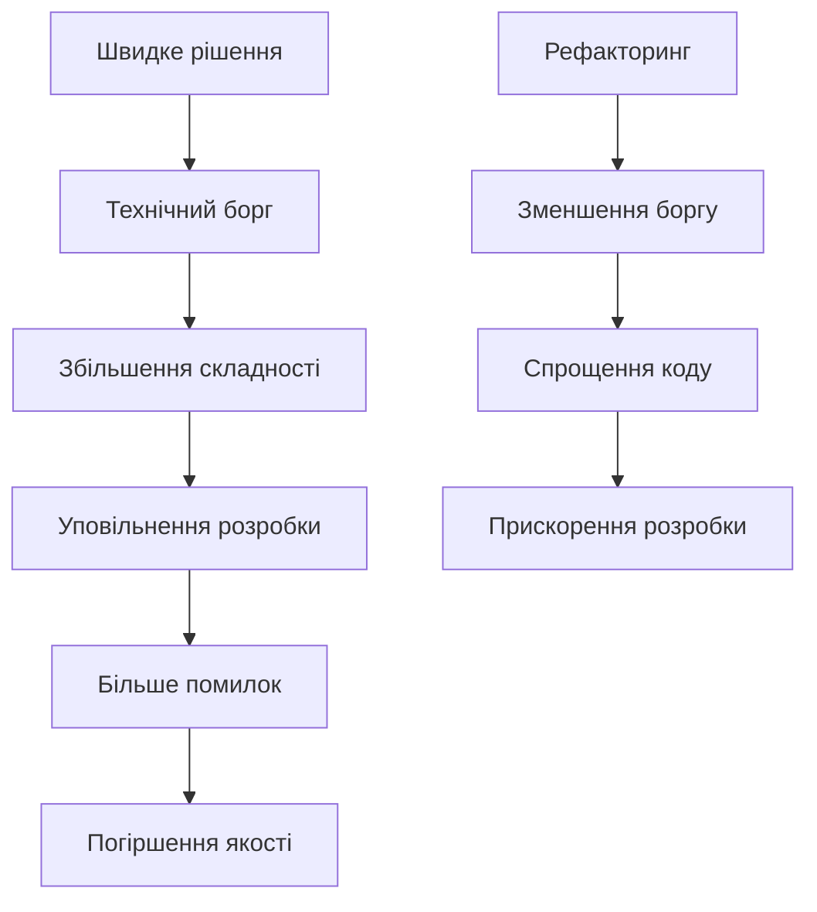
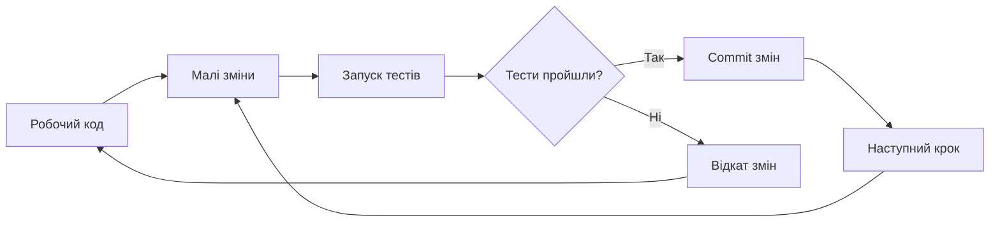

# Лекція 15. Рефакторинг та чистий код

## Вступ

Написання коду, який працює, є лише першим кроком у створенні якісного програмного забезпечення. Код, який легко читати, розуміти та підтримувати, часто є більш цінним за складний, але функціональний код. У професійній розробці програмісти витрачають значно більше часу на читання коду, ніж на його написання, тому якість коду безпосередньо впливає на продуктивність команди та довгострокову життєздатність проєкту.

Рефакторинг та практики чистого коду допомагають створювати програмне забезпечення, яке легко розвивається разом із зміною вимог бізнесу. Код, написаний з дотриманням принципів чистоти, зменшує кількість помилок, спрощує тестування та полегшує онбординг нових членів команди. Ця лекція розглядає філософію чистого коду, конкретні техніки рефакторингу та практичні підходи до покращення якості кодової бази.

## Філософія чистого коду

### Що таке чистий код

Чистий код є концепцією, яка виходить за межі просто працюючого коду. Роберт Мартін, один з провідних авторитетів у цій галузі, описує чистий код як код, який легко читається, як добре написана проза. Чистий код виражає наміри програміста ясно та недвозначно, мінімізуючи когнітивне навантаження на тих, хто його читає.

Характеристики чистого коду включають простоту та зрозумілість. Код повинен бути настільки простим, наскільки це можливо, але не простішим. Кожна частина коду виконує одну чітко визначену функцію. Код є виразним, використовуючи значущі імена та структуру, яка відображає бізнес-логіку. Чистий код легко тестується, оскільки має чіткі межі та мінімальні залежності.

Чистий код також передбачає відсутність дублювання. Принцип DRY або Don't Repeat Yourself стверджує, що кожен фрагмент знання повинен мати єдине, недвозначне, авторитетне представлення в системі. Дублювання коду створює проблеми при внесенні змін, оскільки кожне місце з дубльованим кодом потребує окремого оновлення.

### Технічний борг

Технічний борг є метафорою, яка описує довгострокові наслідки швидких, але не оптимальних рішень у розробці. Подібно до фінансового боргу, технічний борг дозволяє швидше досягти короткострокових цілей, але вимагає постійних платежів у вигляді додаткових зусиль на підтримку та розвиток системи.



Технічний борг може виникати з різних причин. Навмисний борг виникає, коли команда свідомо приймає рішення на користь швидкості замість якості, розуміючи майбутні наслідки. Ненавмисний борг виникає через недостатнє розуміння проблеми або відсутність досвіду. Борг через еволюцію виникає, коли зміна вимог робить попередні рішення застарілими.

Управління технічним боргом вимагає його постійного відстеження та планомірного погашення. Команди повинні виділяти час на рефакторинг та покращення якості коду поряд з розробкою нових функцій. Ігнорування технічного боргу призводить до накопичення проблем, які врешті-решт можуть зробити подальший розвиток системи практично неможливим.

### Читабельність коду

Код пишеться один раз, але читається багато разів. Інвестиція в читабельність окупається кожного разу, коли хтось відкриває файл для розуміння, налагодження або модифікації коду. Читабельний код зменшує час, необхідний для входження в контекст, та знижує ймовірність помилок при внесенні змін.

Читабельність досягається через послідовність у стилі коду. Команда повинна дотримуватися єдиного стилю форматування, іменування та організації коду. Сучасні інструменти, такі як Prettier для JavaScript або Black для Python, автоматизують форматування, усуваючи суб'єктивність та дискусії про стиль.

Коментарі повинні пояснювати чому, а не що. Код сам по собі повинен бути достатньо виразним, щоб пояснити, що він робить. Коментарі потрібні для пояснення причин прийняття певних рішень, обмежень або неочевидної бізнес-логіки.

```python
# Погано - коментар описує очевидне
# Збільшуємо лічильник на 1
counter += 1

# Добре - коментар пояснює чому
# Додаємо 1 до лічильника для компенсації zero-based індексації
# при відображенні номера сторінки користувачу
counter += 1
```

## Іменування

### Значущі імена

Імена змінних, функцій, класів та інших елементів коду є основним засобом комунікації між програмістами. Добре обрані імена роблять код самодокументованим, зменшуючи потребу в коментарях та полегшуючи розуміння логіки програми.

Імена повинні розкривати наміри. Читаючи назву змінної або функції, програміст повинен розуміти її призначення без необхідності вивчати реалізацію. Замість абревіатур та скорочень, які можуть бути незрозумілими, слід використовувати повні описові назви.

```python
# Погано - незрозумілі абревіатури
def calc(d):
    r = d * 0.1
    return r

# Добре - чіткі, описові імена
def calculate_discount(price):
    discount_rate = 0.1
    discount_amount = price * discount_rate
    return discount_amount
```

Імена повинні бути такими, щоб їх легко було вимовити та обговорювати. Код часто обговорюється в команді, і складні або незрозумілі назви ускладнюють комунікацію. Імена повинні бути шуканими, тобто їх легко знайти в кодовій базі за допомогою пошуку.

### Іменування функцій

Функції виконують дії, тому їх імена зазвичай повинні бути дієсловами або фразами, що починаються з дієслова. Це робить код більш схожим на природну мову та полегшує розуміння потоку виконання програми.

```python
# Погано - неясно, що робить функція
def user(id):
    return database.query(id)

# Добре - дієслово чітко показує дію
def get_user_by_id(user_id):
    return database.query(user_id)

# Добре - булева функція починається з is/has/can
def is_user_authenticated(user):
    return user.session_token is not None

def has_permission(user, resource):
    return resource in user.permissions
```

Імена функцій повинні відповідати рівню абстракції. Високорівневі функції можуть мати більш загальні назви, тоді як низькорівневі функції повинні бути більш конкретними. Довжина імені часто корелює з обсягом області видимості: короткі імена прийнятні для локальних змінних з малою областю видимості, тоді як публічні API повинні мати більш описові назви.

### Іменування класів та змінних

Класи представляють сутності або концепції, тому їх імена зазвичай є іменниками або іменними фразами. Добра назва класу описує, чим є об'єкт, а не що він робить.

```python
# Погано - назва описує дію, а не сутність
class DataProcessor:
    pass

# Добре - назва описує сутність
class CustomerOrder:
    pass

class PaymentGateway:
    pass
```

Змінні повинні мати імена, які описують їх вміст або призначення. Уникайте загальних назв як data, info, temp, крім випадків, коли контекст робить їх значення очевидним. Використовуйте конкретні, описові назви, які передають семантику змінної.

```python
# Погано - загальні, непоказові імена
def process(data):
    temp = data + 10
    result = temp * 2
    return result

# Добре - описові імена розкривають логіку
def calculate_discounted_price(base_price):
    price_with_tax = base_price + 10
    final_price = price_with_tax * 2
    return final_price
```

## Функції

### Принцип єдиної відповідальності

Кожна функція повинна робити одну річ і робити її добре. Це один з найважливіших принципів написання чистого коду. Функції з єдиною відповідальністю легше тестувати, розуміти та повторно використовувати. Вони також більш стійкі до змін, оскільки зміна однієї відповідальності не впливає на інші.

```python
# Погано - функція робить занадто багато
def process_user_registration(user_data):
    # Валідація
    if not user_data.get('email'):
        raise ValueError("Email required")
    
    # Хешування паролю
    password_hash = hash_password(user_data['password'])
    
    # Збереження в БД
    user = User(
        email=user_data['email'],
        password_hash=password_hash
    )
    database.save(user)
    
    # Відправка email
    send_welcome_email(user.email)
    
    # Логування
    logger.info(f"User {user.email} registered")
    
    return user

# Добре - розділення на окремі функції з одною відповідальністю
def validate_user_data(user_data):
    if not user_data.get('email'):
        raise ValueError("Email required")
    if not user_data.get('password'):
        raise ValueError("Password required")

def create_user_account(user_data):
    password_hash = hash_password(user_data['password'])
    user = User(
        email=user_data['email'],
        password_hash=password_hash
    )
    database.save(user)
    return user

def complete_user_registration(user):
    send_welcome_email(user.email)
    logger.info(f"User {user.email} registered")

def register_user(user_data):
    validate_user_data(user_data)
    user = create_user_account(user_data)
    complete_user_registration(user)
    return user
```

### Розмір функцій

Функції повинні бути короткими. Ідеальна функція займає всього кілька рядків коду. Якщо функція не вміщається на одному екрані без прокрутки, це сигнал, що вона робить занадто багато і повинна бути розділена на менші функції. Короткі функції легше розуміти, тестувати та повторно використовувати.

Короткі функції природним чином мають одну відповідальність. Коли ви намагаєтеся написати коротку функцію, ви автоматично виділяєте окремі блоки логіки в окремі функції. Це створює ієрархію абстракцій, де високорівневі функції викликають низькорівневі, створюючи зрозумілу структуру програми.

```python
# Погано - довга функція з багатьма рівнями абстракції
def generate_report(data):
    # Підготовка даних
    filtered_data = []
    for item in data:
        if item['status'] == 'active':
            filtered_data.append(item)
    
    # Обчислення статистики
    total = 0
    for item in filtered_data:
        total += item['value']
    average = total / len(filtered_data) if filtered_data else 0
    
    # Форматування виводу
    report = f"Report Generated: {datetime.now()}\n"
    report += f"Total Items: {len(filtered_data)}\n"
    report += f"Average Value: {average:.2f}\n"
    
    return report

# Добре - розділення на функції з чіткими відповідальностями
def filter_active_items(data):
    return [item for item in data if item['status'] == 'active']

def calculate_average_value(items):
    if not items:
        return 0
    total = sum(item['value'] for item in items)
    return total / len(items)

def format_report_header():
    return f"Report Generated: {datetime.now()}\n"

def format_report_statistics(items, average):
    return f"Total Items: {len(items)}\nAverage Value: {average:.2f}\n"

def generate_report(data):
    active_items = filter_active_items(data)
    average = calculate_average_value(active_items)
    
    report = format_report_header()
    report += format_report_statistics(active_items, average)
    
    return report
```

### Параметри функцій

Кількість параметрів функції повинна бути мінімальною. Ідеально, якщо функція має нуль параметрів, один або два параметри є прийнятними, три параметри потребують особливого обґрунтування, а чотири чи більше параметрів слід уникати. Велика кількість параметрів ускладнює розуміння функції та збільшує кількість можливих комбінацій вхідних даних, які потрібно тестувати.

Коли функція потребує багато параметрів, це часто сигнал, що вона робить занадто багато або що параметри природним чином групуються в об'єкт. Створення об'єкта або структури даних для групування пов'язаних параметрів робить код більш читабельним та гнучким.

```python
# Погано - забагато параметрів
def create_user(
    email, password, first_name, last_name, 
    phone, address, city, country, postal_code
):
    # Складно зрозуміти порядок параметрів
    pass

# Добре - групування пов'язаних параметрів
class UserData:
    def __init__(self, email, password, personal_info, address_info):
        self.email = email
        self.password = password
        self.personal_info = personal_info
        self.address_info = address_info

class PersonalInfo:
    def __init__(self, first_name, last_name, phone):
        self.first_name = first_name
        self.last_name = last_name
        self.phone = phone

class AddressInfo:
    def __init__(self, address, city, country, postal_code):
        self.address = address
        self.city = city
        self.country = country
        self.postal_code = postal_code

def create_user(user_data):
    # Чітка структура даних, легко розширювати
    pass
```

Булеві прапорці як параметри зазвичай є поганою практикою, оскільки вони вказують, що функція робить більше однієї речі. Замість передачі булевого прапорця, краще створити дві окремі функції з виразними назвами.

```python
# Погано - булевий прапорець змінює поведінку
def render_user(user, include_details=False):
    if include_details:
        return render_detailed_user(user)
    else:
        return render_basic_user(user)

# Добре - окремі функції з чіткими намірами
def render_basic_user(user):
    return f"{user.name}"

def render_detailed_user(user):
    return f"{user.name}\n{user.email}\n{user.phone}"
```

## Коментарі та документація

### Коли писати коментарі

Коментарі не завжди є ознакою доброго коду. Часто потреба в коментарях вказує на те, що код недостатньо виразний і потребує рефакторингу. Ідеальний код є самодокументованим через виразні назви та чітку структуру. Однак є ситуації, коли коментарі дійсно додають цінності.

Коментарі корисні для пояснення причин прийняття нестандартних рішень. Якщо код реалізує обхідний шлях для специфічної проблеми або використовує незвичайний підхід через певні обмеження, коментар повинен пояснити чому.

```python
# Добре - пояснює нестандартне рішення
def calculate_price(items):
    # Використовуємо Decimal замість float для грошових обчислень,
    # щоб уникнути проблем з округленням, які можуть виникнути
    # при роботі з дробовими числами
    from decimal import Decimal
    return sum(Decimal(str(item.price)) for item in items)
```

Коментарі важливі для документування складних алгоритмів або бізнес-правил, які не можуть бути виражені виключно через код. Якщо алгоритм базується на специфічній математичній формулі або бізнес-логіці, коментар з поясненням або посиланням на джерело інформації є цінним.

```python
# Добре - документація складного алгоритму
def calculate_shipping_cost(weight, distance, is_express):
    """
    Розрахунок вартості доставки на основі формули:
    base_cost = (weight * 0.5) + (distance * 0.1)
    
    Експрес доставка збільшує вартість на 50% згідно з
    бізнес-правилами від 15.03.2024 (див. SHIP-234)
    """
    base_cost = (weight * 0.5) + (distance * 0.1)
    if is_express:
        return base_cost * 1.5
    return base_cost
```

### Чого уникати в коментарях

Коментарі, які описують очевидні речі, створюють шум і зменшують читабельність коду. Якщо код говорить сам за себе, коментар не потрібен. Особливо шкідливі коментарі, які просто перефразовують код іншими словами без додавання нової інформації.

```python
# Погано - коментар не додає інформації
# Отримуємо користувача з бази даних
user = database.get_user(user_id)

# Перевіряємо чи користувач активний
if user.is_active:
    # Повертаємо true
    return True

# Добре - код говорить сам за себе, коментарі не потрібні
user = database.get_user(user_id)
if user.is_active:
    return True
```

Закоментований код ніколи не повинен залишатися в кодовій базі. Системи контролю версій зберігають історію всіх змін, тому немає потреби зберігати старий код в коментарях на всяк випадок. Закоментований код створює плутанину та змушує читачів гадати, чому він там і чи має він якесь значення.

Застарілі або неточні коментарі гірші за відсутність коментарів. Коли код змінюється, а коментарі не оновлюються, вони стають джерелом неправдивої інформації, яка може ввести в оману розробників. Якщо ви змінюєте код, обов'язково оновіть відповідні коментарі або видаліть їх, якщо вони більше не актуальні.

### Docstrings та документація API

Публічні API, бібліотеки та модулі повинні мати якісну документацію. Python docstrings, JavaDoc, JSDoc та подібні інструменти дозволяють документувати інтерфейси безпосередньо в коді. Ця документація повинна описувати, що робить функція, які параметри вона приймає, що повертає та які виключення може викинути.

```python
def calculate_discount(price, discount_percent, max_discount=None):
    """
    Розраховує суму знижки для товару.
    
    Args:
        price (float): Початкова ціна товару в гривнях
        discount_percent (int): Відсоток знижки (0-100)
        max_discount (float, optional): Максимальна сума знижки.
            Якщо None, обмеження не застосовується.
    
    Returns:
        float: Остаточна ціна після застосування знижки
    
    Raises:
        ValueError: Якщо discount_percent не в діапазоні 0-100
        ValueError: Якщо price від'ємна
    
    Examples:
        >>> calculate_discount(100, 10)
        90.0
        >>> calculate_discount(100, 50, max_discount=40)
        60.0
    """
    if not 0 <= discount_percent <= 100:
        raise ValueError("Discount must be between 0 and 100")
    if price < 0:
        raise ValueError("Price cannot be negative")
    
    discount = price * (discount_percent / 100)
    
    if max_discount is not None:
        discount = min(discount, max_discount)
    
    return price - discount
```

## Рефакторинг

### Що таке рефакторинг

Рефакторинг є процесом зміни внутрішньої структури коду без зміни його зовнішньої поведінки. Це дисциплінована техніка реструктуризації коду через серію малих змін, кожна з яких зберігає функціональність системи. Рефакторинг не додає нових функцій і не виправляє помилки, він покращує дизайн існуючого коду.

Ключова відмінність рефакторингу від переписування полягає в підході. Рефакторинг відбувається поступово, крок за кроком, з постійною перевіркою, що система продовжує працювати правильно після кожної зміни. Це дозволяє зберігати систему в робочому стані на всіх етапах покращення коду.



Рефакторинг повинен підтримуватися всебічним тестуванням. Тести гарантують, що зміни в структурі коду не порушують функціональності. Без тестів рефакторинг стає ризикованим, оскільки немає автоматизованого способу перевірити, що поведінка системи залишилася незмінною.

### Коли рефакторити

Рефакторинг не є окремою фазою розробки, а інтегрованою частиною щоденної роботи програміста. Правило бойскаутів стверджує: завжди залишай код чистішим, ніж ти його знайшов. Навіть невеликі покращення, зроблені регулярно, накопичуються з часом і значно покращують якість кодової бази.

Перед додаванням нової функціональності часто корисно відрефакторити існуючий код, щоб нова функція природно вписалася в архітектуру. Це може включати виділення спільного коду, перейменування методів для кращої виразності або реорганізацію класів для покращення структури.

Під час code review також є хорошим моментом для ідентифікації можливостей рефакторингу. Свіжий погляд часто помічає можливості для покращення, які автор коду міг пропустити. Однак важливо збалансувати між покращенням коду та своєчасною доставкою функціональності.

### Техніки рефакторингу

Виділення методу є однією з найпоширеніших та найкорисніших технік рефакторингу. Коли ви бачите фрагмент коду, який може бути згрупований разом, виділіть його в окремий метод з назвою, яка пояснює його призначення.

```python
# До рефакторингу
def print_invoice(invoice):
    print("*" * 50)
    print(f"Invoice #{invoice.number}")
    print(f"Date: {invoice.date}")
    print("*" * 50)
    
    for item in invoice.items:
        print(f"{item.name}: ${item.price}")
    
    total = sum(item.price for item in invoice.items)
    tax = total * 0.2
    
    print("-" * 50)
    print(f"Subtotal: ${total}")
    print(f"Tax: ${tax}")
    print(f"Total: ${total + tax}")

# Після рефакторингу - виділення методів
def print_invoice(invoice):
    print_header(invoice)
    print_items(invoice.items)
    print_totals(invoice)

def print_header(invoice):
    print("*" * 50)
    print(f"Invoice #{invoice.number}")
    print(f"Date: {invoice.date}")
    print("*" * 50)

def print_items(items):
    for item in items:
        print(f"{item.name}: ${item.price}")

def print_totals(invoice):
    total = calculate_subtotal(invoice.items)
    tax = calculate_tax(total)
    
    print("-" * 50)
    print(f"Subtotal: ${total}")
    print(f"Tax: ${tax}")
    print(f"Total: ${total + tax}")

def calculate_subtotal(items):
    return sum(item.price for item in items)

def calculate_tax(amount):
    return amount * 0.2
```

Заміна магічних чисел на іменовані константи покращує читабельність та полегшує внесення змін. Магічні числа є літералами, які мають специфічне значення, але це значення не є очевидним з контексту.

```python
# До рефакторингу
def calculate_employee_bonus(salary, years_of_service):
    if years_of_service >= 5:
        return salary * 0.1
    elif years_of_service >= 3:
        return salary * 0.05
    else:
        return salary * 0.02

# Після рефакторингу
SENIOR_EMPLOYEE_YEARS = 5
MID_LEVEL_EMPLOYEE_YEARS = 3
SENIOR_BONUS_RATE = 0.1
MID_LEVEL_BONUS_RATE = 0.05
JUNIOR_BONUS_RATE = 0.02

def calculate_employee_bonus(salary, years_of_service):
    if years_of_service >= SENIOR_EMPLOYEE_YEARS:
        return salary * SENIOR_BONUS_RATE
    elif years_of_service >= MID_LEVEL_EMPLOYEE_YEARS:
        return salary * MID_LEVEL_BONUS_RATE
    else:
        return salary * JUNIOR_BONUS_RATE
```

Спрощення умовних виразів робить логіку програми більш зрозумілою. Складні булеві вирази можна розбити на окремі змінні з виразними назвами або виділити в окремі функції.

```python
# До рефакторингу
def should_send_notification(user, message):
    if user.is_active and user.email_verified and \
       not user.notifications_disabled and \
       message.priority >= 3:
        return True
    return False

# Після рефакторингу
def should_send_notification(user, message):
    return (
        is_user_eligible_for_notifications(user) and
        is_message_important(message)
    )

def is_user_eligible_for_notifications(user):
    return (
        user.is_active and
        user.email_verified and
        not user.notifications_disabled
    )

def is_message_important(message):
    IMPORTANT_PRIORITY_THRESHOLD = 3
    return message.priority >= IMPORTANT_PRIORITY_THRESHOLD
```

## Принципи проєктування

### SOLID принципи в контексті чистого коду

SOLID є акронімом п'яти принципів об'єктно-орієнтованого проєктування, які допомагають створювати більш гнучкі та підтримувані системи. Ці принципи тісно пов'язані з концепцією чистого коду та є основою якісної архітектури програмного забезпечення.

Single Responsibility Principle або принцип єдиної відповідальності стверджує, що клас повинен мати лише одну причину для зміни. Це означає, що клас повинен мати лише одну відповідальність або роль в системі. Коли клас робить занадто багато, зміни в одній частині функціональності можуть непередбачувано вплинути на іншу частину.

```python
# Порушення SRP - клас робить занадто багато
class User:
    def __init__(self, name, email):
        self.name = name
        self.email = email
    
    def save_to_database(self):
        # Робота з базою даних
        pass
    
    def send_welcome_email(self):
        # Відправка email
        pass
    
    def generate_report(self):
        # Генерація звіту
        pass

# Дотримання SRP - розділення відповідальностей
class User:
    def __init__(self, name, email):
        self.name = name
        self.email = email

class UserRepository:
    def save(self, user):
        # Робота з базою даних
        pass

class EmailService:
    def send_welcome_email(self, user):
        # Відправка email
        pass

class ReportGenerator:
    def generate_user_report(self, user):
        # Генерація звіту
        pass
```

Open-Closed Principle стверджує, що програмні сутності повинні бути відкриті для розширення, але закриті для модифікації. Це означає, що ви повинні мати можливість додавати нову функціональність без зміни існуючого коду.

```python
# Порушення OCP - потрібно змінювати клас для додавання нової фігури
class AreaCalculator:
    def calculate_area(self, shape):
        if isinstance(shape, Rectangle):
            return shape.width * shape.height
        elif isinstance(shape, Circle):
            return 3.14 * shape.radius ** 2
        # Потрібно додавати нові умови для кожної фігури

# Дотримання OCP - використання поліморфізму
from abc import ABC, abstractmethod

class Shape(ABC):
    @abstractmethod
    def calculate_area(self):
        pass

class Rectangle(Shape):
    def __init__(self, width, height):
        self.width = width
        self.height = height
    
    def calculate_area(self):
        return self.width * self.height

class Circle(Shape):
    def __init__(self, radius):
        self.radius = radius
    
    def calculate_area(self):
        return 3.14 * self.radius ** 2

class AreaCalculator:
    def calculate_total_area(self, shapes):
        return sum(shape.calculate_area() for shape in shapes)
```

### KISS принцип

Keep It Simple, Stupid або KISS є принципом, який закликає зберігати рішення простими. Складність є ворогом чистого коду. Прості рішення легше зрозуміти, протестувати, підтримувати та модифікувати. Часто розробники створюють надмірно складні рішення, передбачаючи майбутні потреби, які можуть ніколи не виникнути.

Принцип YAGNI або You Aren't Gonna Need It тісно пов'язаний з KISS. Він стверджує, що ви не повинні додавати функціональність, поки вона не є справді необхідною. Передчасна оптимізація та проєктування для гіпотетичних майбутніх вимог часто призводять до непотрібної складності.

```python
# Погано - надмірно складне рішення для простої задачі
class ConfigurationManagerFactory:
    @staticmethod
    def create_configuration_manager(config_type):
        if config_type == 'json':
            return JSONConfigurationManager(
                FileSystemConfigurationLoader(),
                ConfigurationValidator(),
                ConfigurationCacheManager()
            )
        # Ще багато коду для інших типів...

# Добре - просте рішення для поточних потреб
import json

def load_config(filepath):
    with open(filepath) as f:
        return json.load(f)

# Якщо в майбутньому знадобиться більше функціональності,
# її можна додати поступово
```

### DRY vs DAMP в тестах

While DRY або Don't Repeat Yourself є фундаментальним принципом для production коду, в тестах іноді краще дотримуватися DAMP або Descriptive And Meaningful Phrases. Тести повинні бути самодостатніми та легко зрозумілими, навіть якщо це означає деяке дублювання коду.

```python
# DRY підхід в тестах - може бути незрозумілим
class TestUserService:
    def setup(self):
        self.user = create_test_user()
        self.service = UserService()
    
    def test_user_creation(self):
        result = self.service.create(self.user)
        assert_user_valid(result)
    
    def test_user_update(self):
        result = self.service.update(self.user)
        assert_user_valid(result)

# DAMP підхід - більш читабельний та явний
class TestUserService:
    def test_creates_user_with_valid_email(self):
        # Arrange
        user_data = {
            'email': 'test@example.com',
            'name': 'Test User'
        }
        service = UserService()
        
        # Act
        user = service.create(user_data)
        
        # Assert
        assert user.email == 'test@example.com'
        assert user.name == 'Test User'
        assert user.id is not None
    
    def test_updates_user_name(self):
        # Arrange
        user = User(id=1, email='test@example.com', name='Old Name')
        service = UserService()
        
        # Act
        updated_user = service.update_name(user, 'New Name')
        
        # Assert
        assert updated_user.name == 'New Name'
        assert updated_user.email == 'test@example.com'
```

## Організація коду

### Структура проєкту

Добре організована структура проєкту полегшує навігацію по кодовій базі та допомагає підтримувати чіткі межі між модулями. Структура повинна відображати архітектуру додатка та робити взаємозв'язки між компонентами очевидними.

```
project/
├── src/
│   ├── domain/          # Бізнес-логіка та моделі
│   │   ├── models/
│   │   ├── services/
│   │   └── repositories/
│   ├── api/             # HTTP endpoints
│   │   ├── controllers/
│   │   ├── middlewares/
│   │   └── validators/
│   ├── infrastructure/  # Технічні деталі
│   │   ├── database/
│   │   ├── cache/
│   │   └── email/
│   └── utils/           # Допоміжні функції
├── tests/               # Тести
│   ├── unit/
│   ├── integration/
│   └── e2e/
├── config/              # Конфігурація
└── docs/                # Документація
```

Модулі повинні мати чіткі інтерфейси та мінімальні залежності. Високорівневі модулі не повинні залежати від низькорівневих деталей реалізації. Використання принципів чистої архітектури допомагає зберігати бізнес-логіку незалежною від фреймворків, баз даних та інших технічних деталей.

### Управління залежностями

Явні залежності роблять код більш тестованим та гнучким. Замість створення залежностей всередині класу, вони повинні передаватися ззовні, зазвичай через конструктор. Це дозволяє легко замінювати реальні імплементації на mock об'єкти в тестах.

```python
# Погано - неявні залежності
class UserService:
    def __init__(self):
        self.database = Database()  # Жорстка залежність
        self.email_service = EmailService()  # Жорстка залежність
    
    def register_user(self, user_data):
        user = self.database.save(user_data)
        self.email_service.send_welcome(user)
        return user

# Добре - явні залежності через інжекцію
class UserService:
    def __init__(self, user_repository, email_service):
        self.user_repository = user_repository
        self.email_service = email_service
    
    def register_user(self, user_data):
        user = self.user_repository.save(user_data)
        self.email_service.send_welcome(user)
        return user

# Легко тестувати з mock об'єктами
def test_register_user():
    mock_repository = Mock()
    mock_email = Mock()
    service = UserService(mock_repository, mock_email)
    
    service.register_user({'email': 'test@example.com'})
    
    assert mock_repository.save.called
    assert mock_email.send_welcome.called
```

## Обробка помилок

### Використання виключень

Виключення є кращим способом обробки помилок, ніж коди помилок. Вони роблять код більш читабельним, відокремлюючи нормальний потік виконання від обробки помилок. Код, який може генерувати помилки, стає більш очевидним та легшим для розуміння.

```python
# Погано - використання кодів помилок
def divide(a, b):
    if b == 0:
        return None, "Division by zero"
    return a / b, None

result, error = divide(10, 0)
if error:
    print(error)
else:
    print(result)

# Добре - використання виключень
def divide(a, b):
    if b == 0:
        raise ValueError("Cannot divide by zero")
    return a / b

try:
    result = divide(10, 0)
    print(result)
except ValueError as e:
    print(f"Error: {e}")
```

Виключення повинні бути специфічними та інформативними. Замість загальних виключень створюйте власні класи виключень для різних типів помилок. Це дозволяє більш точно обробляти різні ситуації та надає краще розуміння причин помилок.

```python
class UserNotFoundError(Exception):
    def __init__(self, user_id):
        self.user_id = user_id
        super().__init__(f"User with ID {user_id} not found")

class InsufficientPermissionsError(Exception):
    def __init__(self, user, action):
        self.user = user
        self.action = action
        super().__init__(
            f"User {user.email} does not have permission to {action}"
        )

def get_user(user_id):
    user = database.find(user_id)
    if not user:
        raise UserNotFoundError(user_id)
    return user

try:
    user = get_user(123)
except UserNotFoundError as e:
    logger.warning(f"User lookup failed: {e}")
    return None
```

### Fail Fast принцип

Fail Fast принцип стверджує, що система повинна виявляти та повідомляти про помилки якомога раніше. Замість продовження роботи з невалідними даними, що може призвести до непередбачуваних наслідків, система повинна негайно зупинитися та повідомити про проблему.

```python
# Погано - тихий збій, проблема виявиться пізніше
def process_order(order):
    # Не перевіряємо валідність
    calculate_total(order.items)
    charge_customer(order.customer, order.total)
    # Може виникнути помилка набагато пізніше

# Добре - рання валідація з явними помилками
def process_order(order):
    if not order.items:
        raise ValueError("Order must contain at least one item")
    if not order.customer:
        raise ValueError("Order must have a customer")
    if not order.customer.payment_method:
        raise ValueError("Customer must have a payment method")
    
    total = calculate_total(order.items)
    charge_customer(order.customer, total)
```

## Висновки

Чистий код та рефакторинг є фундаментальними навичками професійного розробника програмного забезпечення. Вони не є додатковими опціями або розкішшю, а необхідною частиною створення довгострокових, підтримуваних систем. Інвестиції в якість коду окупаються через зменшення часу на розробку нових функцій, полегшення виявлення та виправлення помилок, покращення можливості тестування та підвищення задоволеності розробників від роботи з кодом.

Шлях до майстерності в написанні чистого коду вимагає постійної практики та свідомих зусиль. Кожен написаний рядок коду є можливістю застосувати принципи, описані в цій лекції. З часом ці практики стають другою натурою, і написання чистого коду стає природним способом роботи.

Важливо пам'ятати, що чистий код не означає досконалий код. Мета полягає в постійному покращенні, а не в досягненні ідеалу. Правило бойскаутів, залишати код трохи чистішим, ніж ви його знайшли, є практичним підходом до поступового підвищення якості кодової бази. Навіть невеликі покращення, зроблені регулярно, накопичуються з часом і призводять до значних результатів.

## Питання для самоперевірки

1. У чому різниця між технічним боргом та поганим кодом? Чи завжди технічний борг є негативним явищем?
2. Які характеристики має функція з єдиною відповідальністю? Наведіть приклад функції, яка порушує цей принцип.
3. Чому довгі списки параметрів вважаються проблемою? Які підходи можна використати для їх скорочення?
4. Коли коментарі справді додають цінності до коду, а коли вони є code smell?
5. Що таке рефакторинг і чим він відрізняється від переписування коду з нуля?
6. Чому принцип KISS є важливим? Наведіть приклад, коли складне рішення було замінено простим.
7. Яка різниця між принципами DRY та DAMP? Коли варто використовувати кожен з них?
8. Як явні залежності покращують тестованість коду?
9. Чому використання виключень краще за коди помилок?
10. Що означає принцип Fail Fast і як він допомагає у виявленні помилок?
