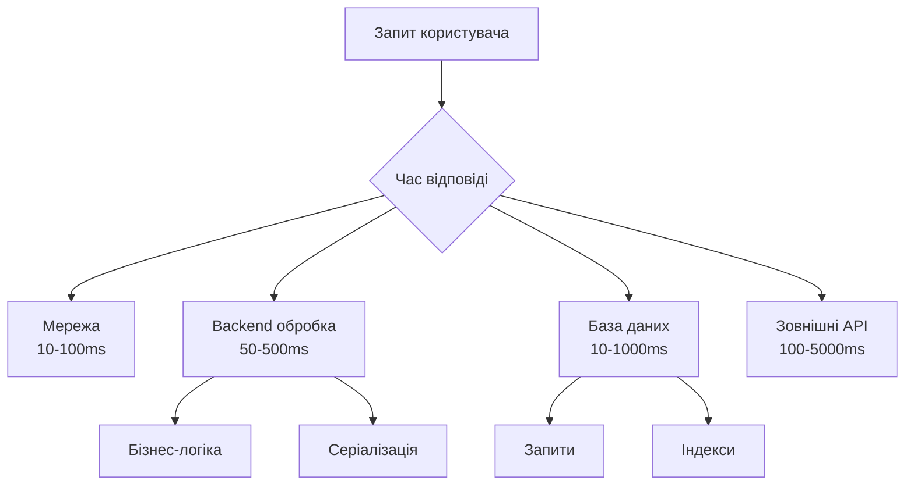
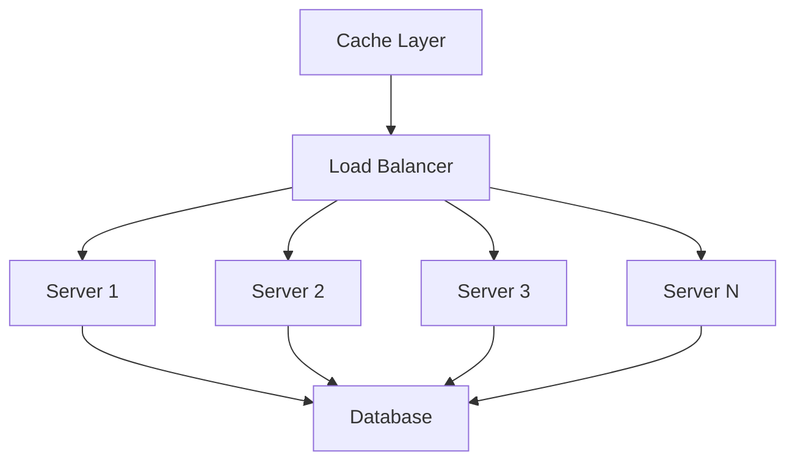
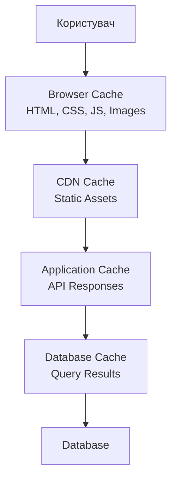

# Лекція 16. Масштабування та оптимізація продуктивності застосунків

## Вступ

У світі сучасних вебдодатків здатність обслуговувати мільйони користувачів одночасно є не розкішшю, а необхідністю. Додаток, який працює ідеально для десяти користувачів, може повністю відмовити при сотнях одночасних запитів. Масштабування та оптимізація продуктивності є критичними аспектами створення успішних програмних систем, які здатні рости разом з бізнесом.

Продуктивність застосунку впливає не лише на користувацький досвід, але й на бізнес-показники. Дослідження показують, що кожна додаткова секунда завантаження сторінки знижує конверсію на сім відсотків. Користувачі очікують миттєвої реакції на свої дії, і повільні додатки швидко втрачають аудиторію на користь конкурентів.

Ця лекція розглядає фундаментальні концепції масштабування, методи оптимізації продуктивності на різних рівнях архітектури та практичні підходи до моніторингу та покращення швидкодії застосунків. Особливу увагу приділено балансу між складністю рішення та реальними потребами бізнесу.

## Основи продуктивності

### Розуміння вузьких місць

Перед початком оптимізації критично важливо розуміти, де саме знаходяться вузькі місця в системі. Передчасна оптимізація, як казав Дональд Кнут, є коренем всього зла в програмуванні. Оптимізація без вимірювань часто призводить до марної витрати ресурсів на покращення частин системи, які не впливають на загальну продуктивність.



Вузькі місця можуть знаходитися на різних рівнях системи. Мережеві затримки впливають на час доставки даних між клієнтом та сервером. Продуктивність процесора визначає швидкість виконання обчислень. Пропускна здатність мережі обмежує кількість даних, які можна передати за одиницю часу. Швидкість дискових операцій впливає на читання та запис даних. Кількість доступної пам'яті визначає, скільки даних можна зберігати без звернення до диску.

Закон Амдала описує теоретичний ліміт прискорення від паралелізації. Якщо лише десять відсотків програми можна паралелізувати, максимальне прискорення обмежене приблизно в десять разів, незалежно від кількості процесорів. Це підкреслює важливість фокусування зусиль на найбільш значущих частинах системи.

### Вимірювання продуктивності

Точне вимірювання є основою будь-якої оптимізації. Без об'єктивних метрик неможливо визначити, чи покращення дійсно ефективне. Метрики повинні бути релевантними для бізнес-цілей та відображати реальний користувацький досвід.

Час відповіді вимірює, скільки часу потрібно для обробки запиту від моменту отримання до відправлення відповіді. Це безпосередньо впливає на сприйняття користувачем швидкості додатку. Пропускна здатність показує, скільки запитів система може обробити за одиницю часу. Висока пропускна здатність важлива для додатків з великою кількістю користувачів.

```python
import time
import functools

def measure_time(func):
    """Декоратор для вимірювання часу виконання функції"""
    @functools.wraps(func)
    def wrapper(*args, **kwargs):
        start_time = time.perf_counter()
        result = func(*args, **kwargs)
        end_time = time.perf_counter()
        
        execution_time = (end_time - start_time) * 1000  # в мілісекундах
        print(f"{func.__name__} виконано за {execution_time:.2f}ms")
        
        return result
    return wrapper

@measure_time
def process_data(data):
    # Обробка даних
    return [item * 2 for item in data]

# Використання
result = process_data(range(1000000))
```

Percentiles надають кращу картину продуктивності, ніж середні значення. Медіана або п'ятдесятий перцентиль показує типовий досвід користувача. Дев'яносто дев'ятий перцентиль виявляє проблеми, які впливають на невелику, але значущу частину користувачів. Вимірювання лише середніх значень може приховувати серйозні проблеми продуктивності для частини користувачів.

### Профілювання коду

Профілювання допомагає ідентифікувати функції та методи, які споживають найбільше ресурсів процесора або пам'яті. Python надає вбудований модуль cProfile для аналізу продуктивності.

```python
import cProfile
import pstats
from pstats import SortKey

def complex_function():
    # Складні обчислення
    result = []
    for i in range(10000):
        result.append(sum(range(i)))
    return result

# Профілювання функції
profiler = cProfile.Profile()
profiler.enable()

complex_function()

profiler.disable()

# Виведення статистики
stats = pstats.Stats(profiler)
stats.sort_stats(SortKey.CUMULATIVE)
stats.print_stats(10)  # Показати топ-10 функцій
```

Memory profilers допомагають виявляти витоки пам'яті та неефективне використання ресурсів. Інструменти як memory_profiler для Python або Chrome DevTools для JavaScript дозволяють відстежувати споживання пам'яті в реальному часі.

```python
from memory_profiler import profile

@profile
def memory_intensive_function():
    large_list = [i for i in range(1000000)]
    # Обробка великого списку
    return sum(large_list)

# Виведе детальну інформацію про споживання пам'яті
memory_intensive_function()
```

## Масштабування

### Вертикальне масштабування

Вертикальне масштабування або scaling up полягає в збільшенні потужності окремого сервера. Це означає додавання більше процесорних ядер, оперативної пам'яті, швидших дисків або покращення мережевого обладнання. Вертикальне масштабування є найпростішим підходом, оскільки не вимагає змін в архітектурі додатку.

Переваги вертикального масштабування включають простоту реалізації, оскільки не потрібно змінювати код або архітектуру. Відсутність необхідності в механізмах розподілу навантаження та координації між серверами спрощує систему. Менше складності в управлінні, оскільки є лише один сервер для моніторингу та підтримки.

Однак вертикальне масштабування має суттєві обмеження. Існує фізична межа потужності одного сервера. Вартість зростає експоненціально при наближенні до цієї межі. Один сервер є single point of failure, і його вихід з ладу означає повну недоступність системи. Під час оновлення обладнання потрібен downtime, що неприйнятно для критичних систем.

### Горизонтальне масштабування

Горизонтальне масштабування або scaling out передбачає додавання більше серверів для розподілу навантаження. Це є більш складним підходом, але він дозволяє досягти практично необмеженої масштабованості та відмовостійкості.



Переваги горизонтального масштабування включають практично необмежену масштабованість через додавання нових серверів. Відмовостійкість покращується, оскільки вихід з ладу одного сервера не впливає на доступність системи. Можливість додавати та видаляти сервери без downtime забезпечує гнучкість. Лінійна вартість масштабування робить його економічно ефективним для великих систем.

Виклики горизонтального масштабування включають необхідність розробки stateless додатків, де стан сесії не зберігається на окремому сервері. Потрібна координація між серверами для узгодженості даних. Складність інфраструктури зростає з кількістю серверів. Розподілені системи вимагають вирішення проблем, таких як синхронізація та консистентність даних.

### Балансування навантаження

Load balancing розподіляє вхідні запити між кількома серверами для оптимізації використання ресурсів та максимізації пропускної здатності. Балансувальник навантаження діє як reverse proxy, який приймає запити від клієнтів та направляє їх на доступні сервери.

Стратегії балансування включають Round Robin, де запити розподіляються послідовно між серверами. Least Connections направляє запити на сервер з найменшою кількістю активних з'єднань. IP Hash використовує хеш IP-адреси клієнта для визначення сервера, забезпечуючи, що запити від одного клієнта завжди йдуть на той самий сервер.

```nginx
# Приклад конфігурації Nginx як load balancer
upstream backend {
    least_conn;  # Використовуємо least connections стратегію
    
    server backend1.example.com:8000 weight=3;
    server backend2.example.com:8000 weight=2;
    server backend3.example.com:8000 weight=1;
    server backend4.example.com:8000 backup;
}

server {
    listen 80;
    
    location / {
        proxy_pass http://backend;
        proxy_set_header Host $host;
        proxy_set_header X-Real-IP $remote_addr;
        
        # Health checks
        proxy_next_upstream error timeout invalid_header http_500;
    }
}
```

Health checks регулярно перевіряють доступність серверів. Якщо сервер не відповідає або повертає помилки, балансувальник автоматично виключає його з пулу до відновлення. Session persistence або sticky sessions забезпечують, що запити від конкретного користувача завжди направляються на той самий сервер, що важливо для stateful додатків.

## Оптимізація бази даних

### Індексація

Індекси є одним з найпотужніших інструментів оптимізації запитів до бази даних. Індекс створює додаткову структуру даних, яка дозволяє швидко знаходити рядки на основі значень певних стовпців. Без індексів база даних повинна сканувати всю таблицю для знаходження потрібних рядків, що стає неприйнятно повільним для великих таблиць.

```sql
-- Таблиця без індексу
CREATE TABLE users (
    id SERIAL PRIMARY KEY,
    email VARCHAR(255),
    name VARCHAR(100),
    created_at TIMESTAMP
);

-- Пошук за email без індексу (повільно для великих таблиць)
SELECT * FROM users WHERE email = 'user@example.com';
-- Час виконання: 450ms на 1,000,000 записів

-- Створення індексу на email
CREATE INDEX idx_users_email ON users(email);

-- Той самий запит з індексом (швидко)
SELECT * FROM users WHERE email = 'user@example.com';
-- Час виконання: 2ms
```

Індекси значно прискорюють читання даних, але сповільнюють операції запису, оскільки при кожному INSERT, UPDATE або DELETE потрібно оновлювати індекси. Індекси також займають додатковий простір на диску. Тому важливо індексувати лише ті стовпці, які дійсно використовуються в WHERE умовах, JOIN операціях або ORDER BY виразах.

Composite indexes або складені індекси охоплюють кілька стовпців. Порядок стовпців в індексі важливий, оскільки індекс може використовуватися для запитів, які фільтрують по першому стовпцю, перших двох стовпцях і так далі, але не може ефективно використовуватися для запитів, які фільтрують лише по другому або третьому стовпцю.

```sql
-- Складений індекс
CREATE INDEX idx_orders_customer_date 
ON orders(customer_id, created_at);

-- Цей запит використає індекс ефективно
SELECT * FROM orders 
WHERE customer_id = 123 
AND created_at > '2024-01-01';

-- Цей запит також використає індекс
SELECT * FROM orders WHERE customer_id = 123;

-- Цей запит НЕ використає індекс ефективно
SELECT * FROM orders WHERE created_at > '2024-01-01';
```

### Оптимізація запитів

Повільні запити часто є результатом неоптимальної структури або відсутності індексів. Команда EXPLAIN в SQL показує план виконання запиту, допомагаючи ідентифікувати проблеми.

```sql
EXPLAIN ANALYZE
SELECT u.name, COUNT(o.id) as order_count
FROM users u
LEFT JOIN orders o ON u.id = o.user_id
WHERE u.created_at > '2024-01-01'
GROUP BY u.id, u.name
HAVING COUNT(o.id) > 5;

-- Результат показує:
-- 1. Чи використовуються індекси
-- 2. Скільки рядків сканується
-- 3. Час виконання кожного кроку
```

N+1 проблема є поширеною причиною повільних запитів в ORM системах. Вона виникає, коли код виконує один запит для отримання списку об'єктів, а потім по окремому запиту для кожного об'єкта для отримання пов'язаних даних.

```python
# Погано - N+1 запит
users = User.query.all()  # 1 запит
for user in users:
    # N запитів, по одному для кожного користувача
    orders = user.orders
    print(f"{user.name}: {len(orders)} orders")

# Добре - eager loading
users = User.query.options(
    joinedload(User.orders)
).all()  # 1 запит з JOIN

for user in users:
    # Дані вже завантажені, додаткові запити не потрібні
    print(f"{user.name}: {len(user.orders)} orders")
```

Denormalization або денормалізація іноді є необхідною для оптимізації читання даних. Замість виконання складних JOIN операцій, дані дублюються в різних таблицях. Це порушує принципи нормалізації, але може значно прискорити запити в системах з високим навантаженням на читання.

### Кешування запитів

Кешування результатів запитів до бази даних може радикально покращити продуктивність. Замість виконання того самого запиту кожного разу, результати зберігаються в швидкому сховищі, таких як Redis або Memcached.

```python
import redis
import json
from functools import wraps

redis_client = redis.Redis(host='localhost', port=6379, db=0)

def cache_query(expire_time=300):
    """Декоратор для кешування результатів запитів"""
    def decorator(func):
        @wraps(func)
        def wrapper(*args, **kwargs):
            # Створюємо ключ кешу на основі імені функції та аргументів
            cache_key = f"{func.__name__}:{str(args)}:{str(kwargs)}"
            
            # Перевіряємо, чи є результат в кеші
            cached_result = redis_client.get(cache_key)
            if cached_result:
                return json.loads(cached_result)
            
            # Виконуємо запит
            result = func(*args, **kwargs)
            
            # Зберігаємо результат в кеші
            redis_client.setex(
                cache_key,
                expire_time,
                json.dumps(result)
            )
            
            return result
        return wrapper
    return decorator

@cache_query(expire_time=600)
def get_popular_products():
    # Складний запит до бази даних
    query = """
        SELECT p.id, p.name, COUNT(o.id) as sales
        FROM products p
        JOIN order_items oi ON p.id = oi.product_id
        JOIN orders o ON oi.order_id = o.id
        WHERE o.created_at > NOW() - INTERVAL '30 days'
        GROUP BY p.id, p.name
        ORDER BY sales DESC
        LIMIT 10
    """
    return execute_query(query)

# Перший виклик виконує запит до БД
products = get_popular_products()  # 150ms

# Наступні виклики використовують кеш
products = get_popular_products()  # 2ms
```

Інвалідація кешу є критичною частиною кешування. Застарілі дані в кеші можуть призвести до неправильної поведінки додатку. Стратегії інвалідації включають time-based expiration, де дані автоматично видаляються після певного часу, event-based invalidation, де кеш очищається при зміні даних, та manual invalidation для критичних даних, які потребують точного контролю.

## Кешування

### Рівні кешування

Кешування може застосовуватися на різних рівнях архітектури додатку. Кожен рівень має свої переваги та особливості використання.



Browser caching використовує можливості браузера для зберігання статичних ресурсів локально. HTTP заголовки Cache-Control та ETag контролюють, як довго браузер може зберігати ресурси та коли потрібно перевіряти їх актуальність.

```python
from flask import Flask, make_response

app = Flask(__name__)

@app.route('/static/<path:filename>')
def serve_static(filename):
    response = make_response(send_file(filename))
    
    # Кешувати на рік (для версійованих файлів)
    response.headers['Cache-Control'] = 'public, max-age=31536000, immutable'
    
    return response

@app.route('/api/data')
def get_data():
    response = make_response(jsonify(data))
    
    # Не кешувати API відповіді (або кешувати на короткий час)
    response.headers['Cache-Control'] = 'no-cache, must-revalidate'
    
    return response
```

CDN або Content Delivery Network кешує контент на географічно розподілених серверах, зменшуючи латентність для користувачів по всьому світу. Статичні файли, такі як зображення, CSS та JavaScript, обслуговуються з найближчого до користувача сервера.

Application-level caching зберігає результати обчислень або запитів в пам'яті додатку. Redis та Memcached є популярними рішеннями для розподіленого кешування, які дозволяють кільком серверам ділитися одним кешем.

### Стратегії кешування

Cache-Aside або Lazy Loading є найпоширенішою стратегією. Додаток спочатку перевіряє кеш. Якщо дані є в кеші, вони повертаються. Якщо даних немає, вони завантажуються з бази даних, зберігаються в кеші і повертаються.

```python
def get_user(user_id):
    # Спробувати отримати з кешу
    cache_key = f"user:{user_id}"
    user_data = redis_client.get(cache_key)
    
    if user_data:
        return json.loads(user_data)
    
    # Якщо немає в кеші, завантажити з БД
    user = database.query(User).get(user_id)
    
    # Зберегти в кеші на 1 годину
    redis_client.setex(
        cache_key,
        3600,
        json.dumps(user.to_dict())
    )
    
    return user
```

Write-Through кешування записує дані одночасно в кеш та базу даних. Це гарантує консистентність між кешем та БД, але збільшує латентність операцій запису.

```python
def update_user(user_id, updates):
    # Оновити в базі даних
    user = database.query(User).get(user_id)
    for key, value in updates.items():
        setattr(user, key, value)
    database.commit()
    
    # Одночасно оновити кеш
    cache_key = f"user:{user_id}"
    redis_client.setex(
        cache_key,
        3600,
        json.dumps(user.to_dict())
    )
    
    return user
```

Write-Behind або Write-Back кешування записує дані спочатку в кеш, а потім асинхронно в базу даних. Це забезпечує низьку латентність запису, але створює ризик втрати даних при збої системи.

### Cache Warming

Cache warming або підігрів кешу передбачає попереднє завантаження найбільш затребуваних даних в кеш перед тим, як вони знадобляться користувачам. Це особливо корисно після перезапуску системи або під час періодів високого навантаження.

```python
def warm_cache():
    """Підігрів кешу популярними даними"""
    # Завантажити топ-100 продуктів
    popular_products = database.query(Product)\
        .order_by(Product.views.desc())\
        .limit(100)\
        .all()
    
    for product in popular_products:
        cache_key = f"product:{product.id}"
        redis_client.setex(
            cache_key,
            3600,
            json.dumps(product.to_dict())
        )
    
    # Завантажити категорії
    categories = database.query(Category).all()
    redis_client.setex(
        "categories:all",
        7200,
        json.dumps([c.to_dict() for c in categories])
    )

# Викликати при старті додатку або за розкладом
warm_cache()
```

## Оптимізація коду

### Алгоритмічна складність

Розуміння алгоритмічної складності є фундаментальним для написання ефективного коду. Big O notation описує, як час виконання алгоритму збільшується зі зростанням розміру вхідних даних.

O(1) або константна складність означає, що час виконання не залежить від розміру даних. O(log n) або логарифмічна складність характерна для бінарного пошуку. O(n) або лінійна складність означає, що час виконання пропорційний кількості елементів. O(n²) або квадратична складність зазвичай є неприйнятною для великих масивів даних.

```python
# O(n²) - погано для великих масивів
def find_duplicates_slow(items):
    duplicates = []
    for i in range(len(items)):
        for j in range(i + 1, len(items)):
            if items[i] == items[j]:
                duplicates.append(items[i])
    return duplicates

# O(n) - набагато ефективніше
def find_duplicates_fast(items):
    seen = set()
    duplicates = set()
    for item in items:
        if item in seen:
            duplicates.add(item)
        seen.add(item)
    return list(duplicates)

# Порівняння на 10000 елементах:
# Повільна версія: 2.5 секунди
# Швидка версія: 0.002 секунди
```

Вибір правильної структури даних критично важливий для продуктивності. Списки підходять для послідовного доступу, але пошук елемента має складність O(n). Множини та словники забезпечують O(1) пошук, але не зберігають порядок елементів. Черги ефективні для FIFO операцій, а стеки для LIFO.

### Паралелізм та конкурентність

Сучасні процесори мають кілька ядер, і ефективне їх використання може значно покращити продуктивність. Паралелізм означає виконання кількох задач одночасно на різних ядрах. Конкурентність означає управління кількома задачами, які можуть не виконуватися справді одночасно.

```python
import concurrent.futures
import requests

def fetch_url(url):
    """Завантажити контент з URL"""
    response = requests.get(url)
    return len(response.content)

urls = [f'https://example.com/page{i}' for i in range(100)]

# Послідовне виконання - повільно
def sequential_fetch():
    results = []
    for url in urls:
        results.append(fetch_url(url))
    return results
# Час виконання: 30 секунд

# Паралельне виконання - швидко
def parallel_fetch():
    with concurrent.futures.ThreadPoolExecutor(max_workers=10) as executor:
        results = list(executor.map(fetch_url, urls))
    return results
# Час виконання: 4 секунди
```

Асинхронне програмування дозволяє ефективно обробляти I/O операції, не блокуючи потік виконання. Це особливо корисно для мережевих запитів, де більшу частину часу програма чекає на відповідь від сервера.

```python
import asyncio
import aiohttp

async def fetch_async(session, url):
    async with session.get(url) as response:
        return len(await response.read())

async def fetch_all_async(urls):
    async with aiohttp.ClientSession() as session:
        tasks = [fetch_async(session, url) for url in urls]
        return await asyncio.gather(*tasks)

# Використання
results = asyncio.run(fetch_all_async(urls))
# Час виконання: 2 секунди
```

### Оптимізація пам'яті

Ефективне використання пам'яті важливе для продуктивності, особливо при роботі з великими обсягами даних. Генератори дозволяють обробляти дані по одному елементу замість завантаження всього набору в пам'ять.

```python
# Погано - завантажує весь файл в пам'ять
def read_large_file_bad(filename):
    with open(filename) as f:
        lines = f.readlines()  # Всі рядки в пам'яті
    return [process_line(line) for line in lines]

# Добре - обробляє по одному рядку
def read_large_file_good(filename):
    with open(filename) as f:
        for line in f:  # Генератор
            yield process_line(line)

# Використання
for result in read_large_file_good('huge_file.txt'):
    print(result)  # Обробляємо не завантажуючи весь файл
```

Об'єктні пули повторно використовують об'єкти замість створення нових. Це особливо корисно для об'єктів, створення яких є дорогим, таких як з'єднання з базою даних або мережеві сокети.

```python
from queue import Queue
import psycopg2

class ConnectionPool:
    def __init__(self, size=10):
        self.pool = Queue(maxsize=size)
        for _ in range(size):
            conn = psycopg2.connect(
                database="mydb",
                user="user",
                password="password"
            )
            self.pool.put(conn)
    
    def get_connection(self):
        return self.pool.get()
    
    def return_connection(self, conn):
        self.pool.put(conn)

# Використання
pool = ConnectionPool(size=10)

def execute_query(query):
    conn = pool.get_connection()
    try:
        cursor = conn.cursor()
        cursor.execute(query)
        result = cursor.fetchall()
        return result
    finally:
        pool.return_connection(conn)
```

## Frontend оптимізація

### Мінімізація та стиснення

Розмір файлів, які завантажує браузер, безпосередньо впливає на час завантаження сторінки. Мінімізація видаляє всі непотрібні символи з коду, такі як пробіли, коментарі та переноси рядків, зменшуючи розмір файлу на тридцять-сорок відсотків.

```javascript
// Оригінальний код (500 байт)
function calculateDiscount(price, discountPercent) {
    // Calculate the discount amount
    const discountAmount = price * (discountPercent / 100);
    
    // Return the final price
    return price - discountAmount;
}

// Мінімізований код (120 байт)
function calculateDiscount(n,t){return n-n*(t/100)}
```

Gzip та Brotli стиснення зменшують розмір файлів на сімдесят-вісімдесят відсотків. Вебсервери можуть автоматично стискати файли перед відправкою браузеру.

```nginx
# Конфігурація Nginx для Gzip стиснення
gzip on;
gzip_types text/plain text/css application/json application/javascript text/xml application/xml application/xml+rss text/javascript;
gzip_min_length 1000;
gzip_comp_level 6;
```

### Lazy Loading

Lazy loading або відкладене завантаження означає завантаження ресурсів лише тоді, коли вони дійсно потрібні. Зображення, які знаходяться нижче по сторінці, не завантажуються до того моменту, поки користувач не прокрутить до них.

```javascript
// Сучасний спосіб - нативний lazy loading


// JavaScript для браузерів без підтримки
const images = document.querySelectorAll('img[data-src]');

const imageObserver = new IntersectionObserver((entries, observer) => {
    entries.forEach(entry => {
        if (entry.isIntersecting) {
            const img = entry.target;
            img.src = img.dataset.src;
            img.removeAttribute('data-src');
            observer.unobserve(img);
        }
    });
});

images.forEach(img => imageObserver.observe(img));
```

Code splitting розділяє JavaScript код на кілька файлів, які завантажуються за потребою. Замість одного великого файлу, користувач завантажує лише код, необхідний для поточної сторінки.

```javascript
// React code splitting з динамічним імпортом
import React, { lazy, Suspense } from 'react';

// Компонент завантажується лише при необхідності
const HeavyComponent = lazy(() => import('./HeavyComponent'));

function App() {
    return (
        <Suspense fallback={<div>Завантаження...</div>}>
            <HeavyComponent />
        </Suspense>
    );
}
```

### Оптимізація рендерингу

Браузер витрачає значний час на рендеринг сторінки. Розуміння процесу рендерингу допомагає оптимізувати продуктивність. Critical Rendering Path включає парсинг HTML, побудову DOM дерева, парсинг CSS, побудову CSSOM, створення render tree та layout з paint операціями.

```html
<!-- Погано - CSS блокує рендеринг -->
<head>
    <link rel="stylesheet" href="styles.css">
    <link rel="stylesheet" href="heavy-styles.css">
</head>

<!-- Добре - критичні стилі inline, інші асинхронно -->
<head>
    <style>
        /* Критичні стилі для above-the-fold контенту */
        body { margin: 0; font-family: sans-serif; }
        .header { background: #333; color: white; }
    </style>
    
    <!-- Некритичні стилі завантажуються асинхронно -->
    <link rel="preload" href="styles.css" as="style" onload="this.onload=null;this.rel='stylesheet'">
    <noscript><link rel="stylesheet" href="styles.css"></noscript>
</head>
```

Debouncing та throttling обмежують частоту виклику функцій, запобігаючи надмірному навантаженню при швидких подіях, таких як прокрутка або зміна розміру вікна.

```javascript
// Debouncing - викликає функцію після паузи
function debounce(func, delay) {
    let timeoutId;
    return function(...args) {
        clearTimeout(timeoutId);
        timeoutId = setTimeout(() => func.apply(this, args), delay);
    };
}

// Використання для пошуку
const searchInput = document.getElementById('search');
const debouncedSearch = debounce((value) => {
    console.log('Пошук:', value);
    // Виконати пошук
}, 300);

searchInput.addEventListener('input', (e) => {
    debouncedSearch(e.target.value);
});

// Throttling - викликає функцію не частіше заданого інтервалу
function throttle(func, limit) {
    let inThrottle;
    return function(...args) {
        if (!inThrottle) {
            func.apply(this, args);
            inThrottle = true;
            setTimeout(() => inThrottle = false, limit);
        }
    };
}

// Використання для scroll події
const throttledScroll = throttle(() => {
    console.log('Scroll position:', window.scrollY);
    // Оновити UI
}, 100);

window.addEventListener('scroll', throttledScroll);
```

## Моніторинг та аналіз

### Метрики продуктивності

Application Performance Monitoring або APM системи збирають детальні метрики про продуктивність додатку в реальному часі. Ці дані допомагають ідентифікувати проблеми продуктивності та відстежувати вплив оптимізацій.

Ключові метрики включають час відповіді, який вимірює латентність від запиту до відповіді. Throughput показує кількість оброблених запитів за одиницю часу. Error rate відстежує відсоток запитів, що закінчилися помилкою. CPU та memory usage показують споживання ресурсів сервера.

```python
from prometheus_client import Counter, Histogram, start_http_server
import time

# Метрики для Prometheus
request_count = Counter('http_requests_total', 'Total HTTP requests')
request_duration = Histogram('http_request_duration_seconds', 'HTTP request duration')
error_count = Counter('http_errors_total', 'Total HTTP errors')

def monitor_request(func):
    def wrapper(*args, **kwargs):
        request_count.inc()
        start_time = time.time()
        
        try:
            result = func(*args, **kwargs)
            return result
        except Exception as e:
            error_count.inc()
            raise
        finally:
            duration = time.time() - start_time
            request_duration.observe(duration)
    
    return wrapper

@app.route('/api/data')
@monitor_request
def get_data():
    # Обробка запиту
    return jsonify(data)

# Запустити метрики сервер на порту 8000
start_http_server(8000)
```

### Логування та трейсинг

Distributed tracing допомагає відстежувати запити, які проходять через кілька сервісів в мікросервісній архітектурі. Кожен запит отримує унікальний trace ID, який передається між всіма сервісами.

```python
import opentelemetry
from opentelemetry import trace
from opentelemetry.exporter.jaeger import JaegerExporter
from opentelemetry.sdk.trace import TracerProvider
from opentelemetry.sdk.trace.export import BatchSpanProcessor

# Налаштування трейсингу
trace.set_tracer_provider(TracerProvider())
tracer = trace.get_tracer(__name__)

jaeger_exporter = JaegerExporter(
    agent_host_name="localhost",
    agent_port=6831,
)

trace.get_tracer_provider().add_span_processor(
    BatchSpanProcessor(jaeger_exporter)
)

# Використання трейсингу
@app.route('/api/user/<user_id>')
def get_user(user_id):
    with tracer.start_as_current_span("get_user") as span:
        span.set_attribute("user.id", user_id)
        
        # Запит до бази даних
        with tracer.start_as_current_span("database_query"):
            user = database.get_user(user_id)
        
        # Запит до зовнішнього API
        with tracer.start_as_current_span("external_api_call"):
            additional_data = external_api.get_data(user_id)
        
        return jsonify(user.to_dict())
```

## Висновки

Масштабування та оптимізація продуктивності є неперервним процесом, який супроводжує розвиток будь-якого успішного програмного продукту. Не існує універсального рішення, яке підійде для всіх ситуацій. Кожна система має свої унікальні характеристики навантаження, вимоги користувачів та обмеження ресурсів.

Ключем до успішної оптимізації є вимірювання перед дією. Інтуїтивні здогадки про вузькі місця часто виявляються помилковими, і витрачені на їх оптимізацію зусилля не дають очікуваного ефекту. Профілювання та моніторинг допомагають фокусувати увагу на справді важливих проблемах.

Передчасна оптимізація залишається коренем багатьох зол у програмуванні. Важливо знайти баланс між написанням чистого, підтримуваного коду та досягненням необхідної продуктивності. Починайте з простих рішень, вимірюйте їх ефективність і оптимізуйте лише там, де це дійсно необхідно.

Масштабування вимагає думання про архітектуру з самого початку. Stateless додатки, чітке розділення відповідальностей та мінімізація shared state полегшують горизонтальне масштабування в майбутньому. Однак не варто проєктувати для мільйонів користувачів, коли поточна база складає кілька сотень.

## Питання для самоперевірки

1. У чому різниця між вертикальним та горизонтальним масштабуванням? Які переваги та недоліки кожного підходу?
2. Чому передчасна оптимізація вважається шкідливою? Як визначити, коли оптимізація дійсно необхідна?
3. Що таке N+1 проблема в контексті баз даних і як її вирішити?
4. Поясніть різницю між паралелізмом та конкурентністю. Наведіть приклади ситуацій, де кожен підхід доцільний.
5. Які стратегії кешування ви знаєте? У яких ситуаціях кожна з них найефективніша?
6. Як індекси покращують продуктивність запитів до бази даних? Чому не варто індексувати всі стовпці?
7. Що таке lazy loading і як він допомагає покращити продуктивність frontend додатків?
8. Які метрики важливі для моніторингу продуктивності застосунку?
9. У чому різниця між debouncing та throttling? Коли використовувати кожну техніку?
10. Чому важливо використовувати percentiles замість середніх значень при аналізі продуктивності?
