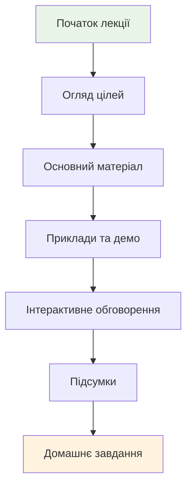

# Презентації

Колекція презентацій до лекцій курсу з програмної інженерії. Презентації створені для супроводу лекційного матеріалу та містять ключові поняття, схеми та приклади.

## Доступні презентації

| № | Тема | Слайдів | Формат |
|---|------|---------|--------|
| 1 | [Вступ до програмної інженерії](presentation-01.md) | ~25 | HTML/PDF |
| 2 | [Життєвий цикл розробки ПЗ](presentation-02.md) | ~30 | HTML/PDF |
| 3 | [Вимоги до ПЗ](presentation-03.md) | ~28 | HTML/PDF |
| 4 | [Архітектура програмних систем](presentation-04.md) | ~35 | HTML/PDF |
| 5 | [Проектування ПЗ](presentation-05.md) | ~32 | HTML/PDF |
| 6 | [Тестування ПЗ](presentation-06.md) | ~40 | HTML/PDF |
| 7 | [Управління версіями](presentation-07.md) | ~25 | HTML/PDF |
| 8 | [Agile методології](presentation-08.md) | ~30 | HTML/PDF |

## Структура презентацій

Кожна презентація включає:

- **Цілі лекції** - що студент дізнається
- **Основний контент** - теоретичний матеріал з прикладами
- **Практичні приклади** - реальні кейси з індустрії
- **Висновки** - підсумок ключових моментів
- **Питання для самоперевірки**

## Використання презентацій

!!! info "Формати презентацій"
    Презентації доступні у двох форматах:

    - **HTML** - для інтерактивного перегляду в браузері
    - **PDF** - для друку або офлайн перегляду

!!! tip "Для викладачів"
    - Презентації можна адаптувати під свої потреби
    - Додавайте власні приклади з практики
    - Використовуйте інтерактивні елементи для залучення студентів

## Технічні особливості

Презентації створені з використанням:

- **Reveal.js** - для HTML версії
- **Mermaid діаграми** - для схем та графіків
- **Адаптивний дизайн** - зручний перегляд на різних пристроях
- **Темна/світла теми** - для комфорту читання

## Зворотний зв'язок

Маєте пропозиції щодо покращення презентацій? Створіть issue в репозиторії або напишіть викладачу.
