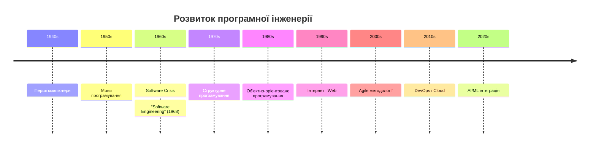
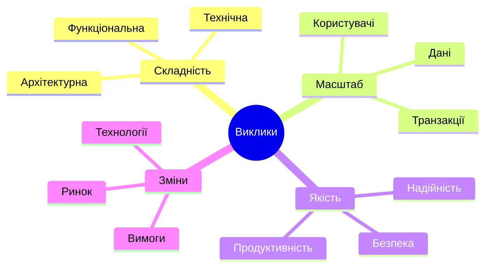
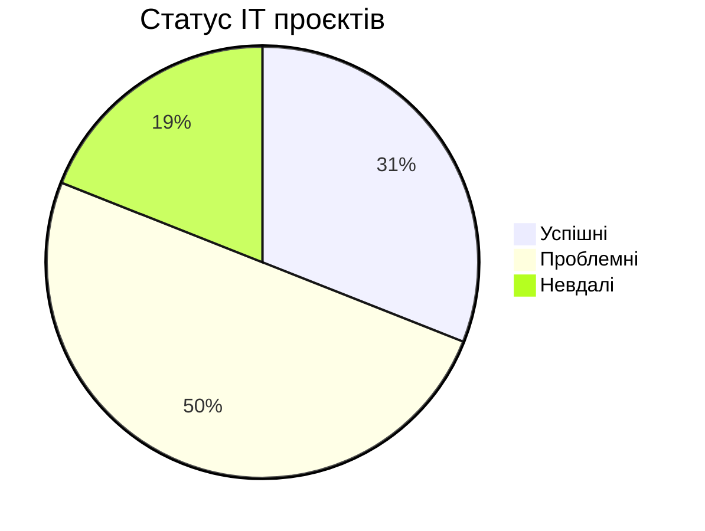
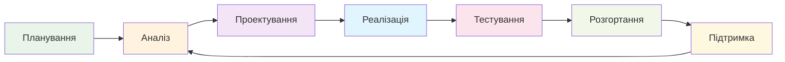
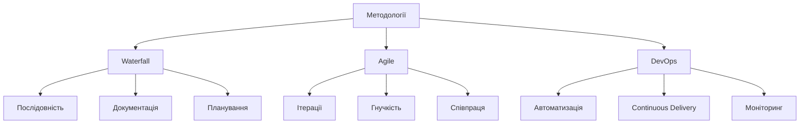

# Презентація 1: Вступ до програмної інженерії

!!! info "Інформація про презентацію"
    - **Тривалість:** 45 хвилин
    - **Аудиторія:** Студенти початківці
    - **Формат:** Лекція з інтерактивними елементами

## Слайд 4: Визначення

### Програмна інженерія - це...

> **Software Engineering** - застосування систематичного, дисциплінованого та кількісно вимірного підходу до розробки, експлуатації та підтримки програмного забезпечення.

*IEEE Standard 610.12*

---

## Слайд 5: Еволюція галузі

---

## Слайд 6: Software Crisis (1960s)

### Проблеми того часу 💥

- Проєкти перевищували бюджет на 200-300%
- Затримки в розробці на роки
- Програми не відповідали вимогам
- Високий рівень помилок

### Приклад: IBM OS/360
- Планувався на 2 роки → **4 роки**
- Бюджет $25M → **$500M**
- 1000 розробників → **5000 розробників**

---

## Слайд 7: Програмування vs Програмна інженерія

| Аспект | Програмування 👨‍💻 | Програмна інженерія 🏗️ |
|--------|----------------|-------------------|
| **Масштаб** | Малі програми | Великі системи |
| **Команда** | 1-3 особи | 10-100+ людей |
| **Час** | Тижні/місяці | Роки |
| **Бюджет** | $1K-10K | $100K-10M+ |
| **Користувачі** | Десятки | Мільйони |
| **Підтримка** | Мінімальна | 10-20 років |

---

## Слайд 8: Основні виклики

---

## Слайд 9: Статистика невдач проєктів

### Chaos Report 2020 📊

**Основні причини невдач:**
- Нечіткі вимоги (37%)
- Відсутність користувацької участі (16%)
- Нестача ресурсів (14%)
- Нереалістичні очікування (13%)

---

## Слайд 10: Приклади великих невдач

### Therac-25 (1985-1987) ☢️
- **Проблема**: Баги в медичному обладнанні
- **Наслідки**: 6 пацієнтів отримали смертельні дози радіації
- **Урок**: Критично важлива безпека ПЗ

### Ariane 5 (1996) 🚀
- **Проблема**: Переповнення 64-бітного числа
- **Наслідки**: Втрата ракети вартістю $500M
- **Урок**: Важливість тестування і повторного використання коду

---

## Слайд 11: Успішні приклади

### Google Search 🔍
- **2 млрд** рядків коду
- **25,000+** розробників
- **8 млрд** запитів/день
- **99.9%** uptime

### Facebook/Meta 📱
- **3.2 млрд** користувачів
- **100+ млрд** повідомлень/день
- **Continuous deployment** - сотні релізів/день

---

## Слайд 12: Основні принципи SE

### 🏗️ Фундаментальні принципи

1. **Модульність** - розбиття на керовані частини
2. **Абстракція** - приховування складності
3. **Інкапсуляція** - об'єднання даних і методів
4. **Ієрархія** - організація у структуру
5. **Поділ обов'язків** - кожен модуль має свою роль

---

## Слайд 13: Життєвий цикл ПЗ

---

## Слайд 14: Ролі в команді розробки

### Хто працює над ПЗ? 👥

- **Software Engineer** - написання коду
- **Software Architect** - архітектурні рішення
- **Business Analyst** - аналіз вимог
- **QA Engineer** - тестування
- **DevOps Engineer** - автоматизація
- **Product Manager** - управління продуктом
- **UI/UX Designer** - дизайн інтерфейсу
- **Project Manager** - управління проєктом

---

## Слайд 15: Сучасні технології

### Що актуально зараз? 🚀

**Cloud Computing** ☁️
- AWS, Azure, Google Cloud
- Serverless архітектури

**Контейнеризація** 📦
- Docker, Kubernetes
- Мікросервіси

**DevOps** 🔄
- CI/CD pipelines
- Infrastructure as Code

**AI/ML** 🤖
- Machine Learning інтеграція
- AI-assisted development

---

## Слайд 16: Методології розробки

---

## Слайд 17: Agile Manifesto

### 4 основні цінності 📜

1. **Люди та взаємодія** важливіше за процеси та інструменти
2. **Працюючий продукт** важливіше за повну документацію
3. **Співпраця з клієнтом** важливіше за узгодження контракту
4. **Реагування на зміни** важливіше за дотримання плану

---

## Слайд 18: Інтерактив - Квіз

!!! question "Питання 1"
    Яка основна відмінність між програмуванням та програмною інженерією?

    A) Програмна інженерія використовує інші мови програмування
    B) Програмна інженерія фокусується на великих системах і команді
    C) Програмна інженерія дорожча
    D) Немає відмінності

*Дайте студентам час на обдумування (30 секунд)*

**Відповідь: B** ✅

---

## Слайд 19: Квіз - питання 2

!!! question "Питання 2"
    Яка з причин НЕ є типовою для невдачі IT проєктів?

    A) Нечіткі вимоги
    B) Відсутність тестування
    C) Використання сучасних технологій
    D) Нереалістичні очікування

**Відповідь: C** ✅

---

## Слайд 20: Кар'єрні можливості

### Де працювати? 💼

**IT компанії** 🏢
- Google, Microsoft, Apple
- Стартапи і scale-ups

**Фінансовий сектор** 🏦
- Банки, фінтех компанії
- Трейдингові системи

**Е-commerce** 🛒
- Amazon, eBay, локальні майданчики

**Ігрова індустрія** 🎮
- Студії розробки ігор

**Консалтинг** 📊
- Технічне консультування

---

## Слайд 21: Зарплати в галузі

### Salary trends 2025 💰

| Позиція | Junior | Middle | Senior |
|---------|--------|--------|--------|
| **Software Engineer** | $40K-60K | $60K-100K | $100K-150K+ |
| **Software Architect** | - | $80K-120K | $120K-200K+ |
| **DevOps Engineer** | $45K-70K | $70K-110K | $110K-160K+ |
| **Product Manager** | $50K-80K | $80K-130K | $130K-200K+ |

*Зарплати в USD для українського ринку*

---

## Слайд 22: Навички для успіху

### Технічні навички 🔧
- Програмування (мінімум 2-3 мови)
- Системний дизайн
- Бази даних
- Тестування
- Git/Version Control

### Soft Skills 🧠
- Комунікація
- Командна робота
- Критичне мислення
- Проблемне мислення
- Адаптивність

---

## Слайд 23: Як навчатися далі?

### Ресурси для розвитку 📚

**Книги** 📖
- "Clean Code" - Robert Martin
- "Software Engineering" - Ian Sommerville
- "The Pragmatic Programmer" - Hunt & Thomas

**Онлайн курси** 💻
- Coursera, edX, Udemy
- GitHub Learning Lab
- FreeCodeCamp

**Практика** ⚡
- Open Source проєкти
- Hackathons
- Pet projects

---

## Слайд 24: Що далі в курсі?

### Наступні теми 🗓️

1. **Життєвий цикл розробки ПЗ** - детальний розгляд фаз
2. **Збір та аналіз вимог** - як зрозуміти, що потрібно
3. **Архітектура ПЗ** - як будувати великі системи
4. **Тестування** - як забезпечити якість
5. **Agile та Scrum** - сучасні методології
6. **DevOps** - автоматизація процесів

---

## Слайд 25: Домашнє завдання

### Завдання до наступної лекції 📝

1. **Читання**: Глава 1 з підручника Sommerville
2. **Дослідження**: Знайдіть 3 приклади великих невдач ПЗ проєктів
3. **Аналіз**: Опишіть, які принципи SE були порушені
4. **Підготовка**: Встановіть IDE для лабораторної роботи

**Термін здачі**: До наступної лекції
**Формат**: 1-2 сторінки в Markdown

---

## Слайд 26: Питання та відповіді

### Q&A сесія 🙋‍♀️

!!! info "Час для питань"
    - Що незрозуміло з сьогоднішньої лекції?
    - Які додаткові питання у вас є?
    - Що хочете дізнатися більше детально?

*Залиште 5-10 хвилин для відповідей на питання*

---

## Слайд 27: Підсумки

### Що ми дізналися сьогодні? ✅

- Програмна інженерія ≠ Програмування
- Важливість системного підходу
- Історичні уроки та сучасні виклики
- Принципи якісного ПЗ
- Кар'єрні можливості в галузі

### Ключова думка 💡
> "Програмна інженерія - це мистецтво створення складних систем, які працюють надійно та довго"

---

## Слайд 28: Контакти та ресурси

### Як зі мною зв'язатися 📞

- **Email**: your.email@university.edu
- **Office Hours**: П'ятниця 14:00-16:00
- **Slack/Discord**: @professor
- **GitHub**: github.com/professor

### Курсові ресурси 🔗
- **Сайт курсу**: coursewebsite.edu
- **Матеріали**: GitHub repository
- **Форум**: course-forum.edu

---

**Дякую за увагу! До зустрічі на наступній лекції! 👋**1: Заголовок

---

# Вступ до програмної інженерії

**Software Engineering Fundamentals**

*Курс з основ програмної інженерії*

📅 2025 рік
👨‍🏫 [Ваше ім'я]

---

## Слайд 2: Що ми дізнаємося сьогодні?

### Цілі лекції 🎯

- Що таке програмна інженерія?
- Чому вона важлива?
- Основні принципи та виклики
- Різниця між програмуванням та інженерією
- Сучасні тренди в галузі

---

## Слайд 3: Питання для роздумів

### Подумайте... 🤔

!!! question "Питання класу"
    - Скільки програм ви використали сьогодні?
    - Що буде, якщо вони перестануть працювати?
    - Хто і як створює це програмне забезпечення?

*Дайте студентам 2 хвилини на обдумування*

---

## Слайд
