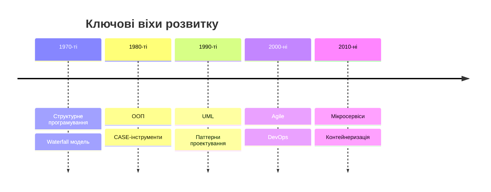
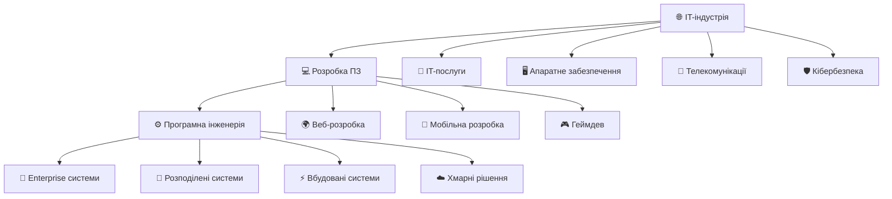
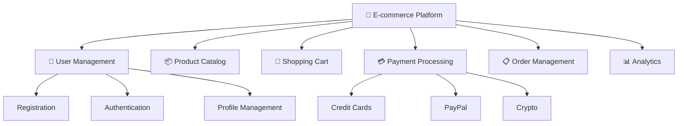
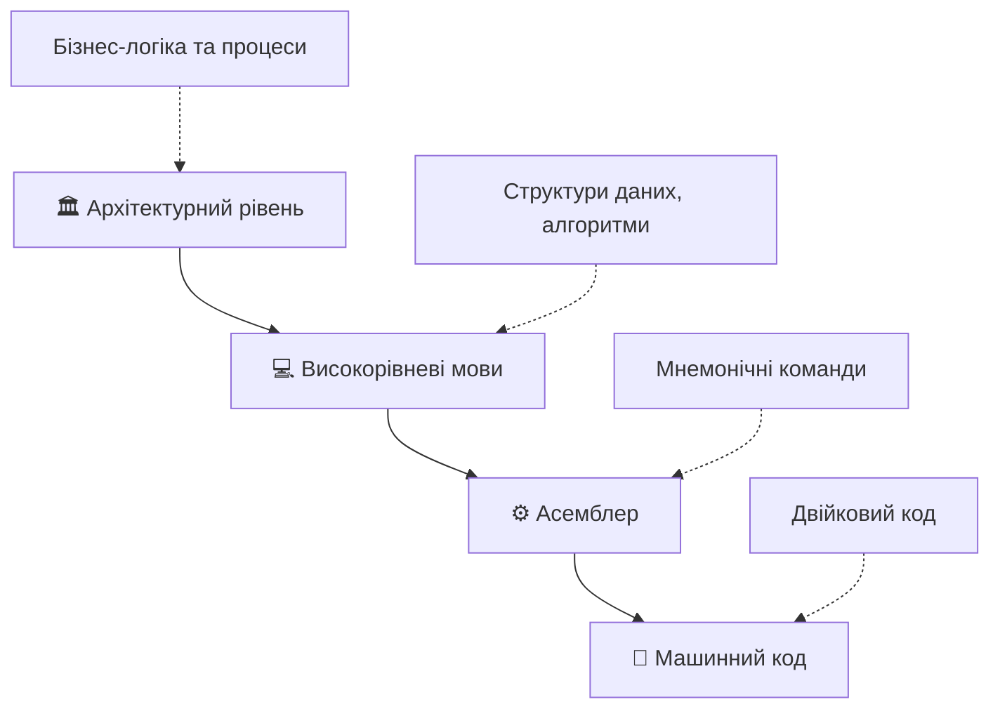
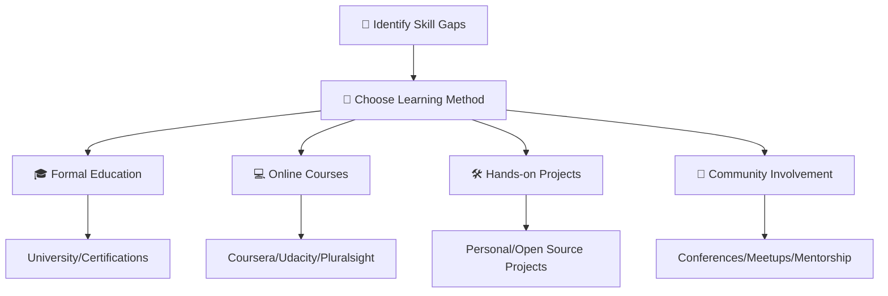
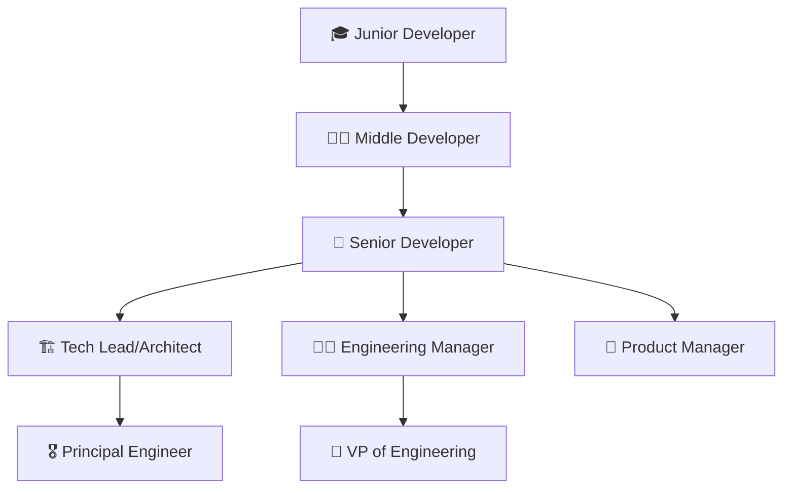

# Лекція 1. Вступ до програмної інженерії та її місце в IT

---

## План лекції

1. **Визначення програмної інженерії**
2. **Історичний розвиток**
3. **Місце в IT-індустрії**
4. **Основні принципи**
5. **Ролі в команді**
6. **Сучасні виклики**

---

## Що таке програмна інженерія?

> **Програмна інженерія** — це дисципліна, що займається застосуванням **інженерного підходу** до проектування, розробки, тестування, розгортання та супроводу програмного забезпечення.

### Ключові слова:
- ✅ **Систематичний підхід**
- ✅ **Весь життєвий цикл**
- ✅ **Якість та надійність**
- ✅ **Командна робота**

---

## Програмування ≠ Програмна інженерія

| 👨‍💻 Програмування | 🏗️ Програмна інженерія |
|:---:|:---:|
| Написання коду | Весь життєвий цикл |
| Індивідуальна робота | Командна робота |
| Короткий термін | Довгострокове рішення |
| Функціональність | Якість + Підтримуваність |

---

## Історія: Криза 1960-х років

### Проблеми того часу:
- 📈 **Бюджети** перевищувалися в 2-3 рази
- ⏰ **Затримки** на роки
- 🐛 **Низька якість** продуктів
- ❓ **Непередбачуваність** термінів

### Рішення:
**1968 рік** — конференція НАТО → термін **"Software Engineering"**

---

## Еволюція програмної інженерії



---

## Місце в IT-екосистемі



---

## Економічний вплив: Цифри

### 🌍 **Глобальні показники:**
- 💰 Світовий ринок ПЗ: **$659 млрд** (2023)
- 📈 Темпи зростання: **11.5%** щорічно
- 👥 Зайнятість: **25+ млн** спеціалістів
- 🎯 ROI: кожен $1 → **$3-5** економічного ефекту

### 🇺🇦 **Український контекст:**
- 💼 IT-експорт: **$7.3 млрд** (15% загального експорту)
- 👨‍💻 IT-спеціалісти: **285,000+** осіб
- 💵 Середня зарплата: **$2,500-4,000**
- 🏛️ Податки: **$1.2+ млрд** на рік

---

## Взаємодія з дисциплінами

### 🔬 **Computer Science надає:**
- Алгоритми та структури даних
- Теорія обчислень та складності
- Формальні методи верифікації
- Основи штучного інтелекту

### 🏢 **Information Systems:**
- Бізнес-процеси та requirements
- Управління даними організації
- Інтеграція з legacy системами

### 📊 **Project Management:**
- Agile/Scrum методології
- Планування ресурсів та ризиків
- Координація міжфункціональних команд

---

## 5 фундаментальних принципів

### 1. 🧩 **Модульність**
**Розбиття системи на керовані частини**

### 2. 🎭 **Абстракція**
**Приховування складності, простий інтерфейс**

### 3. 📦 **Інкапсуляція**
**Контрольований доступ до даних**

### 4. 🏗️ **Ієрархія**
**Багаторівнева організація**

### 5. ⚖️ **Розділення відповідальності**
**Кожен компонент має чітку роль**

---

## Принцип модульності: E-commerce



**💡 Переваги:** Паралельна розробка, легке тестування, повторне використання

---

## Рівні абстракції



**🎯 Мета:** Працювати на потрібному рівні деталізації

---

## Сучасна команда розробки

```mermaid
graph LR
    A[👑 Product Owner] --> B[👨‍💼 Scrum Master]
    B --> C[👨‍💻 Розробники]
    B --> D[🧪 QA Engineers]
    B --> E[🔧 DevOps]

    C --> F[🎨 Frontend]
    C --> G[⚙️ Backend]
    C --> H[🌐 Fullstack]

    I[🏗️ Architect] -.-> B
    J[🎨 UX/UI Designer] -.-> A
```---

## Ключові ролі детально

### 🏗️ **Архітектор ПЗ**
- 🎯 Стратегічне планування архітектури
- ⚙️ Вибір технологічного стеку
- 📋 Встановлення стандартів розробки
- ⚠️ Аналіз та мітигація ризиків
- 💰 **Досвід:** 7+ років, $4,000-8,000

### 👨‍💻 **Розробники**
**Frontend:** React, Vue.js, TypeScript, CSS frameworks
**Backend:** Python, Java, Node.js, Go, databases
**Fullstack:** End-to-end development
💰 **Junior:** $800-1,500, **Senior:** $2,500-4,500

### 🧪 **QA Engineer**
- 🧪 Unit, Integration, E2E testing
- 🤖 Test automation (Cypress, Playwright)
- 🔄 CI/CD integration
- 📊 Performance testing

---

## DevOps: Infrastructure as Code

```yaml
# Terraform приклад
resource "aws_instance" "web_server" {
  ami           = "ami-0c02fb55956c7d316"
  instance_type = "t3.medium"

  tags = {
    Name        = "WebServer"
    Environment = "Production"
  }
}
```

### 🔄 **CI/CD Pipeline:**
Git Push → Build → Test → Security Scan → Deploy → Monitor

---

## Сучасні виклики: Технічні

### 📈 **Експоненціальне зростання складності**
```
1970-ті: 1K-10K рядків коду
2020-ті: 10M+ рядків коду

Google Search: 100+ млн рядків
Facebook: 60+ млн рядків
```

### ⚡ **Вимоги до продуктивності**
- ⏱️ Завантаження: **< 3 секунди**
- 🔄 API відповідь: **< 200мс**
- 🟢 Uptime: **99.99%** (4.38 хв простою/рік)
- 🔧 Відновлення: **< 5 хвилин**

**40% користувачів залишають сайт, якщо він завантажується > 3 сек**

---

## Масштабування: Netflix приклад

### 📊 **Цифри:**
- 👥 **230+ млн** користувачів
- 🌐 **15%** всього інтернет-трафіку США
- ⚙️ **1000+** мікросервісів
- ☁️ **AWS-based** auto-scaling

### 🛠️ **Рішення:**
- Chaos Engineering (навмисні збої)
- Global CDN для контенту
- Personalization algorithms
- A/B testing на всіх рівнях

---

## Кібербезпека: Зростання загроз

### 📈 **Статистика 2023:**
- 💸 Збиток: **$8 трильйонів** глобально
- ⏰ Частота: атака **кожні 11 секунд**
- 💰 Вартість breach: **$4.45 млн** в середньому
- 🕵️ Час виявлення: **277 днів**

### 🛡️ **OWASP Top 10:**
1. **Broken Access Control** - неправильна авторизація
2. **Cryptographic Failures** - слабке шифрування
3. **Injection** - SQL/NoSQL/Command injection
4. **Insecure Design** - архітектурні вразливості

---

## DevSecOps: Security в CI/CD

```yaml
security_scan:
  script:
    - sonar-scanner # Code quality
    - dependency-check # Vulnerable libs
    - bandit # Security issues
    - semgrep # SAST scanning
  artifacts:
    reports:
      sast: security-report.json
```

### 🔒 **Security by Design:**
Requirements → Threat Modeling → Secure Code → Penetration Testing

---

## Організаційні виклики

### ⚡ **Прискорення Time-to-Market**
```
Традиційні цикли:
├── Waterfall: 12-24 місяці
└── Результат: застарілий продукт

Сучасні очікування:
├── MVP: 3-6 місяців
├── Features: 2-4 тижні
└── Hotfixes: години-дні
```

### 🌍 **Розподілені команди**
- ⏰ Часові зони: тільки 2-4 години overlap
- 🗣️ Культурні відмінності у комунікації
- 🔄 Асинхронна співпраця стає критичною

---

## Глобальна команда: Типова структура

```
🌍 Міжнародний проект:
├── 🇺🇸 Product Management (Кремнієва долина)
├── 🇬🇧 Design (Лондон)
├── 🇺🇦 Frontend (Київ, Харків)
├── 🇮🇳 Backend (Бангалор)
├── 🇵🇱 QA (Краків)
├── 🇩🇪 DevOps (Берлін)
└── 🇨🇦 Data Science (Торонто)
```

### 🛠️ **Рішення:**
- Documentation-first підхід
- Recorded meetings для async перегляду
- Written standups у Slack/Teams

---

## Технічний борг: Реальна проблема

### 📋 **Типи боргу:**
- 💻 **Code Debt:** дублювання, низька якість
- 🏗️ **Architecture Debt:** монолітні legacy системи
- 🖥️ **Infrastructure Debt:** manual deployment
- 📚 **Documentation Debt:** застаріла документація

### 🏦 **Приклад: Banking Systems**
- COBOL код з 1970-80х досі працює
- Mainframe системи processing мільярди транзакцій
- **Виклик:** modernization без downtime
- **Рішення:** strangler fig pattern, gradual migration

---

## Етичні виклики: AI Bias

### ⚖️ **Алгоритмічна справедливість:**
- 💼 **Hiring algorithms:** Amazon AI дискримінував жінок
- 👮 **Criminal justice:** COMPAS racial bias
- 📷 **Face recognition:** вищий error rate для темношкірих
- 💳 **Credit scoring:** дискримінація по zip code

### 🎯 **Етичні принципи AI:**
1. **Beneficence** - користь для людства
2. **Non-maleficence** - "не нашкодь"
3. **Justice** - справедливий розподіл переваг
4. **Explicability** - зрозумілість рішень

---

## Continuous Learning Challenge

### 📚 **Швидкість змін:**
```
Lifecycle технологій:
├── 1990s: 10-15 років стабільності
├── 2000s: 5-7 років major changes
├── 2010s: 2-3 роки significant updates
└── 2020s: 6-18 місяців до нових versions
```

### 🧠 **Challenges для розробників:**
- 📉 Skills obsolescence за 2-5 років
- 📊 Information overload
- 🔄 Framework fatigue
- ⚖️ Depth vs breadth dilemma

---

## Learning Strategies



### 🏢 **Company Support:**
- 20% time для особистих проектів (Google)
- Learning days та conference бюджети
- Internal tech talks та knowledge sharing

---

## Work-Life Balance в IT

### 😰 **IT-специфічні стресори:**
- 📞 On-call responsibilities (ночні виклики)
- 🚨 Production issues (критичний тиск)
- ⏰ Tight deadlines (crunch periods)
- 🧠 Complex problem solving (mental exhaustion)

### 📊 **Burnout статистика:**
**57%** developers відчувають burnout (Stack Overflow 2022)

### 🌱 **Company wellness programs:**
- 🧘 Mental health support та EAP
- 🏠 Remote work та flexible hours
- 📚 Learning budgets та sabbaticals
- 🛡️ Blameless post-mortems культура

---

## Успішні українські компанії

### 🇺🇦 **Global Success Stories:**
- **GitLab** 🦊 - DevOps платформа ($15B+ valuation)
- **JetBrains** 🧠 - інструменти розробки (IntelliJ, PyCharm)
- **Grammarly** ✍️ - AI для письма (200M+ users)
- **MacPaw** 🍎 - утиліти для Mac (CleanMyMac)
- **Preply** 🎓 - онлайн-освіта мов

### 🎯 **Спільні риси успіху:**
- Фокус на якості продукту
- Сильна технічна культура
- Міжнародна орієнтація з початку
- Інвестиції в R&D

---

## Тенденції 2024-2025

### 🔥 **Гарячі напрямки:**
- 🤖 **AI/ML Integration** - GitHub Copilot, ChatGPT API
- ☁️ **Edge Computing** - обробка даних ближче до користувача
- 🔒 **Zero Trust Security** - never trust, always verify
- 🌱 **Green Software** - енергоефективність коду
- 🥽 **Spatial Computing** - Apple Vision Pro, Meta Quest

### 💼 **Нові ролі:**
- AI/ML Engineer
- Platform Engineer
- Site Reliability Engineer (SRE)
- Developer Experience Engineer
- Security Engineer (DevSecOps)

---

## Чому це важливо?

### Програмна інженерія впливає на:
- 🏥 **Медицину** (електронні карти, діагностика)
- 🚗 **Транспорт** (автопілоти, логістика)
- 🏦 **Фінанси** (онлайн-банкінг, криптовалюти)
- 🎓 **Освіту** (дистанційне навчання)
- 🛍️ **Комерцію** (електронна торгівля)

**Якість ПЗ = Якість життя людей!**

---

## Економічне значення

### Статистика:
- 💰 **ІТ-ринок України**: $7+ млрд на рік
- 👥 **Зайнятість**: 300,000+ спеціалістів
- 📈 **Зростання**: 20%+ щорічно
- 🌍 **Експорт**: топ-3 галузь країни

**Програмна інженерія = драйвер економіки!**

---

## Навички інженера ПЗ

### 💻 **Технічні**
- Мови програмування
- Алгоритми та структури даних
- Бази даних
- Архітектура систем

### 🤝 **М'які навички**
- Командна робота
- Комунікація
- Вирішення проблем
- Критичне мислення

---

## Кар'єрний шлях



---

## Тенденції розвитку

### 🔥 **Актуальні напрямки:**
- 🤖 **Штучний інтелект** та машинне навчання
- ☁️ **Хмарні технології** та мікросервіси
- 📊 **Великі дані** та аналітика
- 🔒 **Кібербезпека** та приватність
- 🥽 **AR/VR** та метавсесвіт
- 🌱 **Green Software** та енергоефективність

---

## Приклади успіху

### 🇺🇦 **Українські компанії:**
- **GitLab** — платформа DevOps
- **JetBrains** — інструменти розробки
- **Grammarly** — ШІ для письма
- **Preply** — онлайн-освіта
- **MacPaw** — утиліти для Mac

**Зроблено в Україні, використовується у світі!**

---

## Підсумки лекції

### Програмна інженерія — це:
1. 🎯 **Дисципліна** з системним підходом
2. 📈 **Еволюція** від простого програмування
3. 🌐 **Основа** сучасної IT-індустрії
4. 👥 **Командна робота** та співпраця
5. 🔬 **Постійний розвиток** та адаптація
