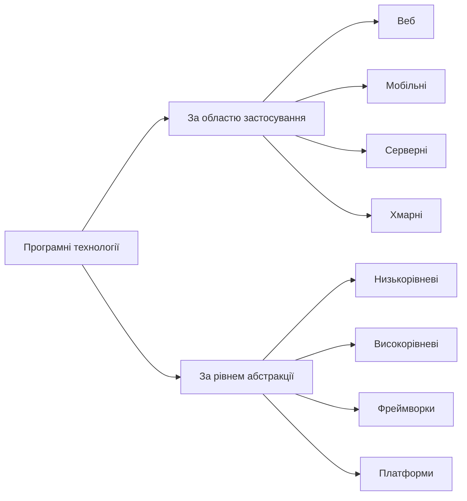
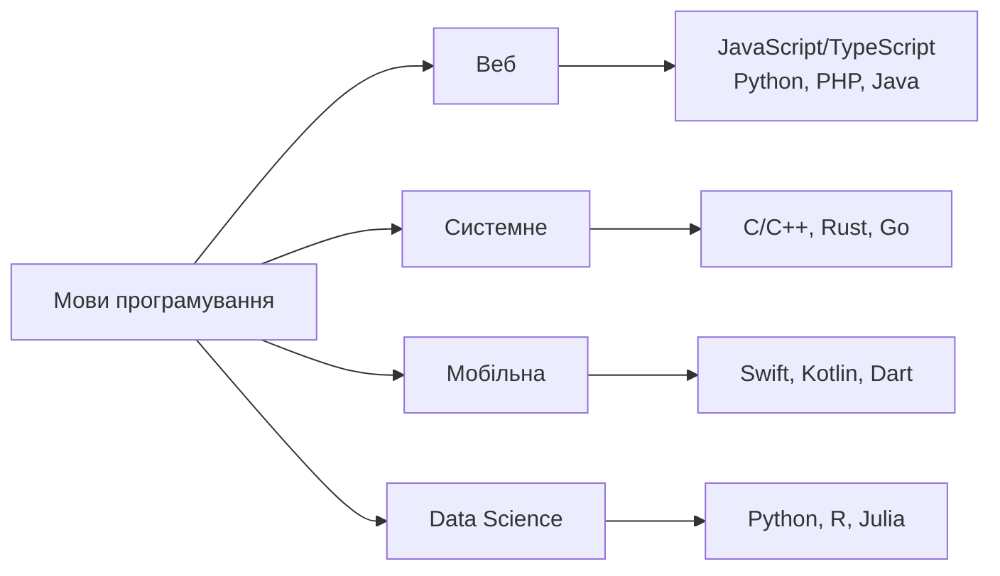
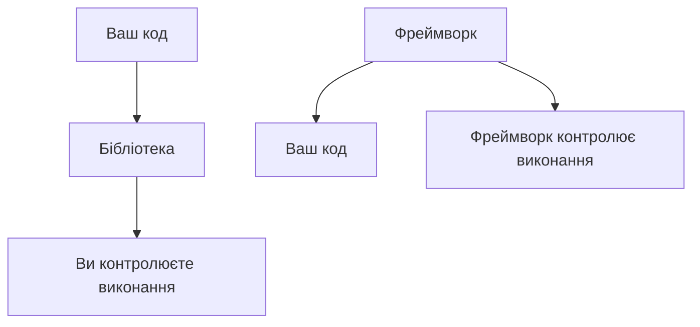
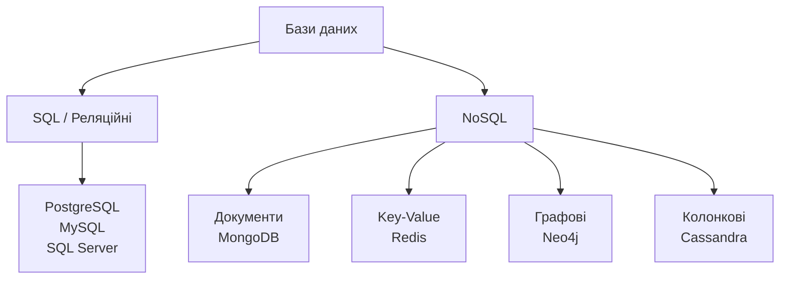
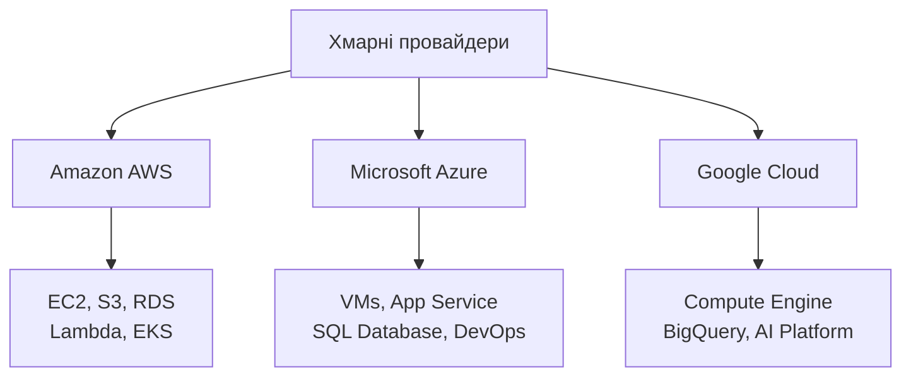
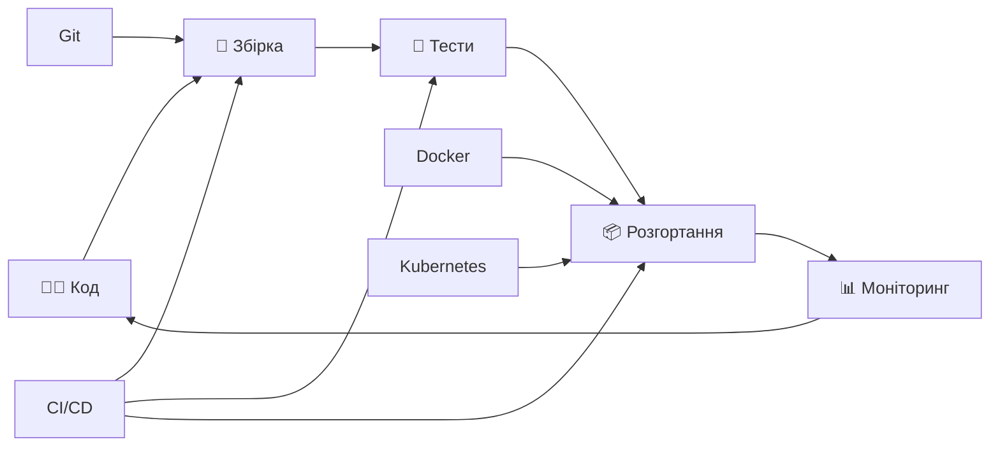
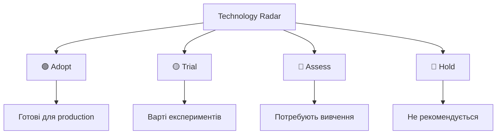

# Сучасні технології та інструменти розробки

## План лекції

1. Огляд технологічного ландшафту
2. Мови програмування та екосистеми
3. Фреймворки та бібліотеки
4. Бази даних та зберігання
5. Хмарні платформи та DevOps
6. Інструменти розробки
7. Майбутні тенденції

## 1. Технологічний ландшафт

## Класифікація технологій



## 2. Мови програмування

## Популярні мови за категоріями



## JavaScript/TypeScript екосистема

### ✅ Переваги:
- 🌍 Універсальність (frontend + backend)
- 📦 2M+ пакетів в npm
- 👥 Величезна спільнота
- ⚡ Швидка розробка

### ❌ Недоліки:
- 🐛 Runtime помилки
- 🔄 Швидкі зміни екосистеми
- 🐌 Продуктивність vs компільовані мови

## Python: простота + потужність

### 🎯 Основні застосування:
- 🌐 Веброзробка (Django, Flask, FastAPI)
- 📊 Data Science (Pandas, NumPy)
- 🤖 Machine Learning (TensorFlow, PyTorch)
- 🔧 Автоматизація та скрипти

### 💡 Чому популярний:
```python
# Читабельний синтаксис
def analyze_data(dataset):
    return dataset.groupby('category').mean()

# Потужні бібліотеки
import pandas as pd
df = pd.read_csv('data.csv')
```

## Java: корпоративний стандарт

### 🏢 Корпоративні переваги:
- ⚖️ "Write once, run anywhere"
- 🛡️ Сильна типізація + безпека
- 🏗️ Зріла екосистема (Spring, Hibernate)
- 📈 Відмінна продуктивність

### 📊 Використання:
- Банківські системи
- E-commerce платформи
- Мікросервіси
- Android розробка

## 3. Фреймворки та бібліотеки

## Фреймворк vs Бібліотека



- Бібліотека = інструменти, які ви викликаєте
- Фреймворк = структура, яка викликає ваш код

## Frontend фреймворки: трійка лідерів

### ⚛️ React
- 👑 Найпопулярніший
- 🧩 Компонентна архітектура
- 🚀 Віртуальний DOM
- 🏢 Facebook + спільнота

### 💚 Vue.js
- 🎯 Прогресивний фреймворк
- 📚 Легкий для вивчення
- 🔧 Вбудована реактивність
- 🇨🇳 Популярний в Азії

### 🅰️ Angular
- 🏗️ Повноцінний фреймворк
- 📘 TypeScript за замовчуванням
- 🏢 Корпоративні застосунки
- 🔧 Dependency Injection

## Backend фреймворки

### 🟢 Node.js + Express

```javascript
app.get('/api/users', (req, res) => {
  res.json(users);
});
```

- Мінімалістичний
- JavaScript скрізь
- Величезна екосистема middleware

### 🐍 Python + Django
```python
class UserView(APIView):
    def get(self, request):
        return Response(users)
```

- Швидка розробка
- Адмін-панель з коробки

### ☕ Java + Spring Boot
```java
@GetMapping("/api/users")
public List<User> getUsers() {
    return userService.findAll();
}
```

- Автоконфігурація
- Корпоративний стандарт
- Мікросервіси ready

## 4. Бази даних

## SQL vs NoSQL



## Коли використовувати SQL?

### ✅ SQL підходить для:
- 💰 Фінансові системи
- 📊 Складні зв'язки між даними
- 📈 Аналітичні запити
- 🏢 Корпоративні системи

### 🎯 Приклади:
- Банківські транзакції
- ERP системи
- Звітність та аналітика
- E-commerce (замовлення, товари)

## Коли обирати NoSQL?

### ✅ NoSQL підходить для:
- 📈 Великі обсяги даних
- 🔄 Змінна структура даних
- ⚡ Високе навантаження
- 🌐 Розподілені системи

### 🎯 Приклади застосування:
- MongoDB: Каталоги товарів, CMS
- Redis: Кешування, сесії
- Neo4j: Соціальні мережі, рекомендації
- Cassandra: IoT дані, логи

## 5. Хмарні платформи та DevOps

## Хмарні провайдери



## DevOps: від коду до production



## Ключові DevOps інструменти

### 📦 Контейнеризація (Docker)

```dockerfile
FROM node:16
COPY . /app
WORKDIR /app
RUN npm install
CMD ["npm", "start"]
```

### 🚀 CI/CD Pipeline

- GitHub Actions / GitLab CI
- Автоматичні тести при кожному commit
- Автодеплой в staging → production

### 🏗️ Infrastructure as Code

```yaml
# docker-compose.yml
services:
  web:
    build: .
    ports: ["3000:3000"]
  db:
    image: postgres:15
```

## 6. Інструменти розробки

## IDE та редактори

### 💻 Visual Studio Code
- 🆓 Безкоштовний
- 🔧 Розширюваний
- 🌐 Підтримка всіх мов

### 🧠 JetBrains продукти

- IntelliJ IDEA (Java)
- PyCharm (Python)
- WebStorm (JavaScript)
- 🔍 Глибокий аналіз коду і багата функціональність

## Git: основа командної роботи

### 🔄 Git workflow:
1. Створити гілку для функції
2. Зробити зміни + commits
3. Push + створити Pull Request
4. Code review
5. Merge в main гілку

## 7. Майбутні тенденції

## AI в розробці

### 🤖 GitHub Copilot та аналоги

```javascript
// Коментар: "функція для сортування масиву за датою"
// AI генерує:
function sortByDate(array) {
  return array.sort((a, b) => new Date(a.date) - new Date(b.date));
}
```

## Edge Computing + IoT

### 🌐 Edge Computing переваги:
- ⚡ Мінімальна затримка
- 💾 Економія трафіку
- 🔒 Краща приватність
- 🔌 Автономна робота

### 📱 IoT застосування:
- Розумні міста
- Промислова автоматизація
- Автономні автомобілі
- Медичні пристрої

## Low-Code революція

### 🎯 Переваги Low-Code:
- 🚀 Швидкість розробки
- 👥 Доступність для бізнесу
- 💰 Зниження витрат
- 🔄 Швидка адаптація

### ⚖️ Обмеження:
- Складні системи потребують коду
- Можливі проблеми з продуктивністю
- Vendor lock-in ризики

### 📊 Популярні платформи:
- Microsoft Power Platform
- Salesforce Platform
- OutSystems
- Bubble

## Technology Radar: як обирати?

Technology Radar від ThoughtWorks [www.thoughtworks.com/radar](https://www.thoughtworks.com/radar) є ефективним інструментом для систематичного відстеження технологічних трендів. Радар поділяється на чотири квадранти — Techniques (методології та процеси), Tools (конкретні інструменти), Platforms (операційні системи та фреймворки) та Languages & Frameworks.



### 🔍 Критерії оцінки:
- Технічні: зрілість, продуктивність, безпека
- Екосистемні: спільнота, документація, learning curve
- Бізнесові: вартість, vendor lock-in, перспективи

## Практичні поради 👨‍🎓 для студентів:

1. 🏗️ Фундамент: алгоритми, структури даних, Git
2. 🎯 Глибина: краще одну мову добре, ніж багато поверхнево
3. 🛠️ Практика: реальні проєкти > теоретичні курси
4. 🌐 Open Source: участь у проєктах для досвіду

## Висновки

### 🎯 Ключові принципи:

1. Фундамент важливіший за хайп — принципи залишаються, технології змінюються
2. Адаптивність — здатність швидко освоювати нові інструменти
3. Системне мислення — розуміння взаємодії технологій
4. Бізнес-контекст — технології служать цілям, не навпаки
5. Баланс — між швидкістю та якістю, новизною та стабільністю

### 💡 Головна думка:

Успішний інженер не знає всі технології,
а вміє швидко оцінювати, вивчати та застосовувати
найкращі інструменти для конкретних завдань
