# Життєвий цикл розробки програмного забезпечення (SDLC)

## План лекції

1. Що таке SDLC та навіщо він потрібен
2. 8 ключових етапів SDLC
3. Моделі SDLC: від Waterfall до Agile
4. Як обрати правильну модель
5. Сучасні тенденції та інновації
6. Метрики та вимірювання успіху
7. Управління ризиками
8. Інструменти та майбутнє SDLC

## 1. Що таке SDLC?

## Визначення SDLC

**Software Development Life Cycle (SDLC)** — це систематичний процес розробки програмного забезпечення, який включає всі етапи від початкового планування до кінцевого виведення з експлуатації.

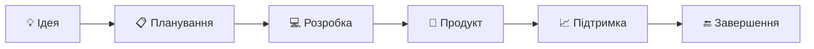

## Навіщо потрібен SDLC?

### 🎯 **Основні цілі:**
- **Структура** — чіткий план дій
- **Якість** — систематичне забезпечення якості
- **Контроль** — управління часом і ресурсами
- **Ризики** — мінімізація проблем
- **Комунікація** — зрозумілість для всіх учасників

## Без SDLC vs З SDLC

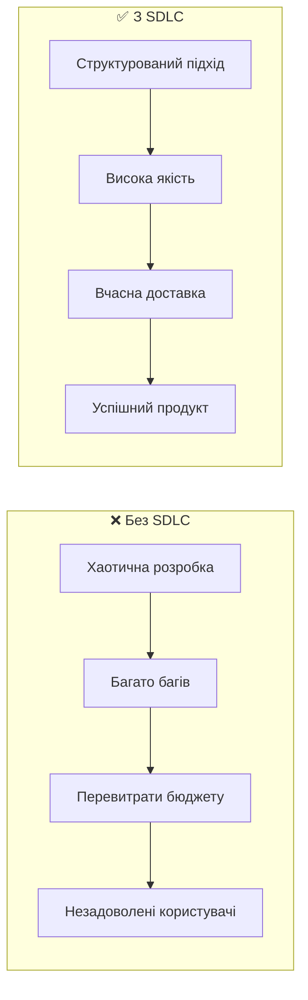

## 2. 8 етапів SDLC

## Огляд всіх етапів

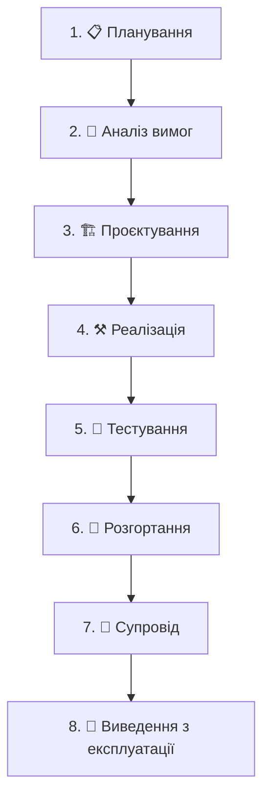

## Етап 1: Планування 📋

### 🎯 **Що робимо:**
- Визначаємо **цілі** та **обсяг** проєкту
- Оцінюємо **ресурси** та **час**
- Аналізуємо **ризики**
- Створюємо **план** проєкту

### 📊 **Результат:**
- Project Charter
- Календарний план
- Бюджет
- Команда проєкту

## Етап 2: Аналіз вимог 📝

### 🔍 **Типи вимог:**

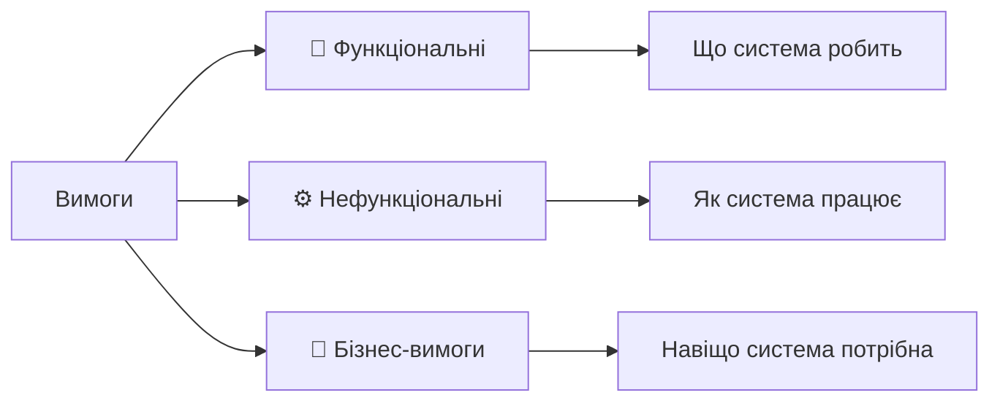

### 📋 **Техніки збору:**
- **Інтерв'ю** з користувачами
- **Майстер-класи** та мозкові штурми
- **Прототипування** для валідації
- **Аналіз** існуючих систем

## Етап 3: Проєктування 🏗️

### 🏛️ **Рівні проєктування:**

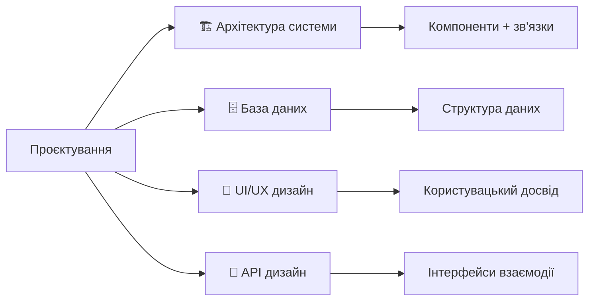

### 🎨 **Результати:**
- Архітектурні діаграми
- Схема бази даних
- Wireframes та mockups
- API специфікації

## Етап 4: Реалізація ⚒️

### 👨‍💻 **Процес розробки:**
- **Кодування** за стандартами команди
- **Code Review** для якості
- **Unit тестування** кожного компонента
- **Документування** коду

### 🛠️ **Інструменти:**
- **IDE**: VS Code, IntelliJ IDEA
- **Version Control**: Git + GitHub/GitLab
- **CI/CD**: Jenkins, GitHub Actions
- **Quality**: SonarQube, ESLint

## Етап 5: Тестування 🧪

### 🔬 **Піраміда тестування:**

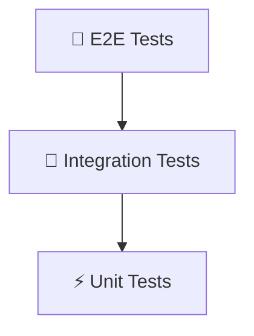

### 🎯 **Типи тестування:**
- **Unit** — окремі функції
- **Integration** — взаємодія компонентів
- **System** — вся система цілком
- **Acceptance** — відповідність вимогам
- **Performance** — швидкодія та навантаження

## Етап 6: Розгортання 🚀

### 🎯 **Стратегії розгортання:**

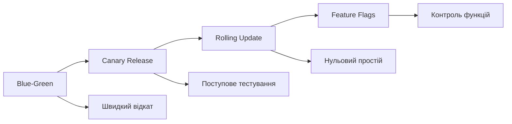

### 📦 **Процес:**
1. **Підготовка** production середовища
2. **Міграція** даних
3. **Навчання** користувачів
4. **Моніторинг** після запуску

## Етап 7: Супровід 🔧

### 🛠️ **Види супроводу:**

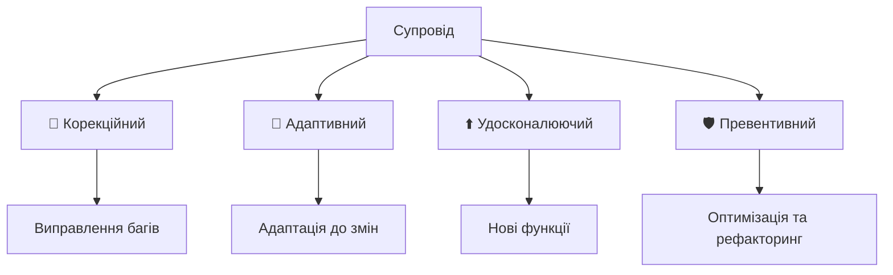

### 📊 **80/20 правило:**
- **80%** часу — підтримка
- **20%** часу — розробка

## 3. Моделі SDLC

## Водоспадна модель (Waterfall) 🌊

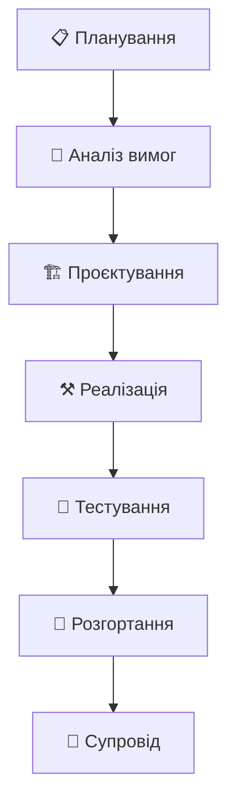

### ✅ **Переваги:**
- Простота розуміння
- Чітке планування
- Детальна документація

### ❌ **Недоліки:**
- Негнучкість до змін
- Пізнє виявлення проблем
- Довгий час до результату

## V-подібна модель 📐

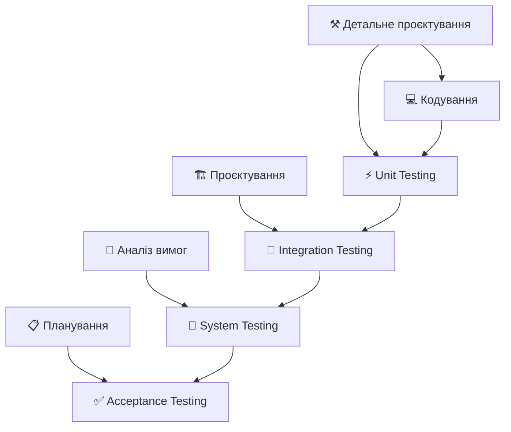

### 🎯 **Особливості:**
- Акцент на **тестуванні** з самого початку
- Планування **тестів** на етапі проєктування
- **Трасованість** вимог → тести

## Ітеративна модель 🔄

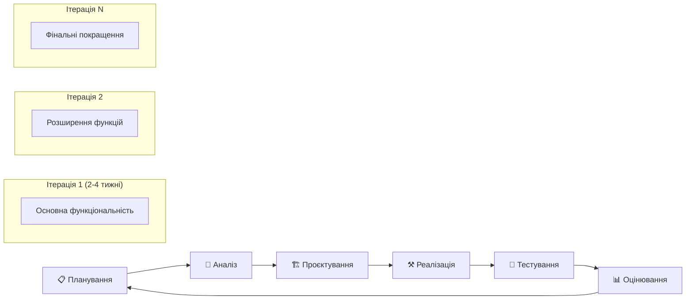

### ✅ **Переваги:**
- Швидкий **фідбек** від користувачів
- Можливість **адаптації** до змін
- Раннє виявлення **ризиків**

## Спіральна модель 🌀

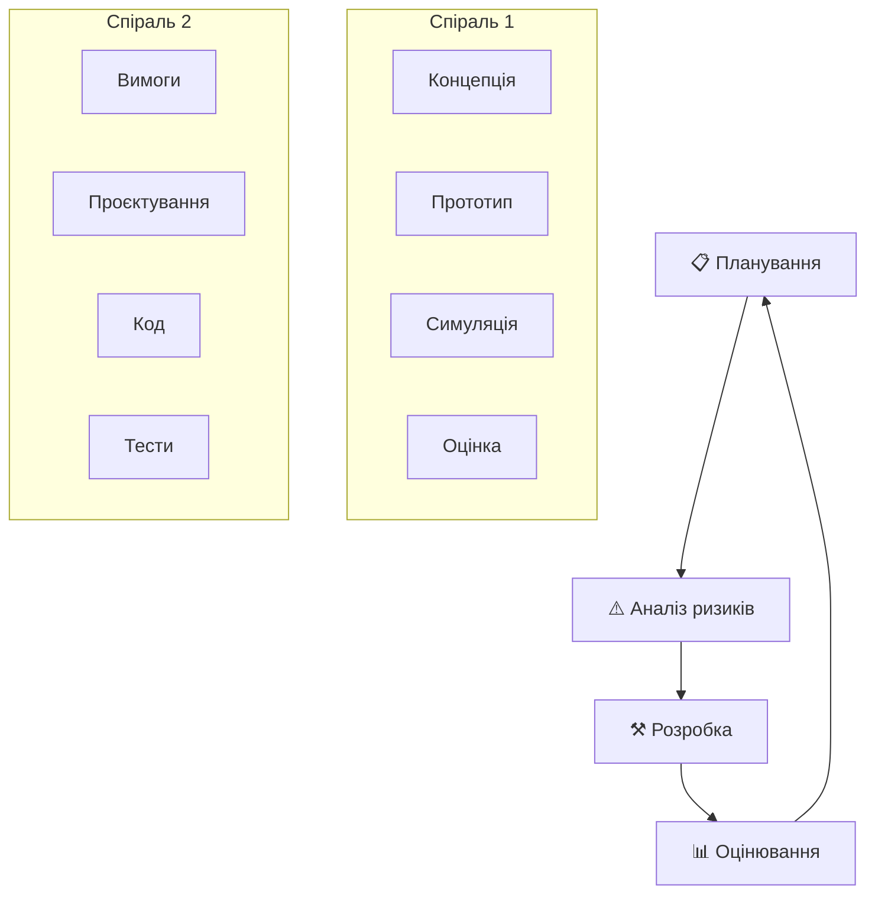

### 🎯 **Коли використовувати:**
- Великі, **складні** проєкти
- Високий рівень **ризиків**
- Нечіткі вимоги

## 4. Як обрати модель SDLC?

## Матриця вибору моделі

| Фактор | Waterfall | V-Model | Ітеративна | Спіральна |
|--------|-----------|---------|------------|-----------|
| **Розмір проєкту** | Малий-Середній | Середній | Будь-який | Великий |
| **Стабільність вимог** | Стабільні | Стабільні | Мінливі | Нечіткі |
| **Досвід команди** | Будь-який | Середній | Високий | Високий |
| **Критичність** | Низька | Висока | Середня | Висока |
| **Терміни** | Довгі | Довгі | Короткі | Довгі |

## Критерії вибору 🎯

### 📊 **Характеристики проєкту:**
- **Розмір** та складність
- **Критичність** системи
- **Тривалість** розробки

### 👥 **Команда:**
- **Досвід** та навички
- **Розмір** команди
- **Географічне** розподілення

### 💼 **Бізнес-фактори:**
- **Терміновість** виходу на ринок
- **Бюджетні** обмеження
- **Регуляторні** вимоги

## Сценарії використання 💡

### 🌊 **Waterfall підходить для:**
- Державних проєктів з чіткими вимогами
- Медичного ПЗ з суворими стандартами
- Встановлених технологій

### 🔄 **Ітеративна модель для:**
- Стартапів з MVP підходом
- Вебдодатків з частими оновленнями
- Проєктів з активним user feedback

### 🌀 **Спіральна модель для:**
- R&D проєктів
- Інноваційних продуктів
- Систем з високими ризиками

## 5. Сучасні тенденції

## DevOps революція 🚀

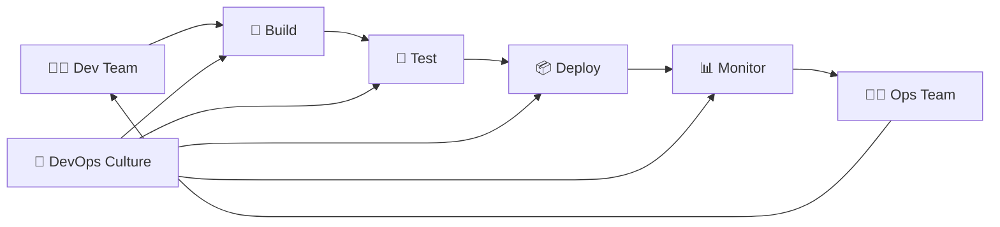

### 🎯 **Ключові принципи:**
- **Collaboration** між Dev і Ops
- **Automation** всіх процесів
- **Continuous** Integration/Delivery
- **Infrastructure** as Code

### 📈 **Результати:**
- **10x** частіше deployments
- **50%** менше багів у production
- **22%** швидше time-to-market

## Хмарні технології ☁️

### 🏗️ **Мікросервіси:**

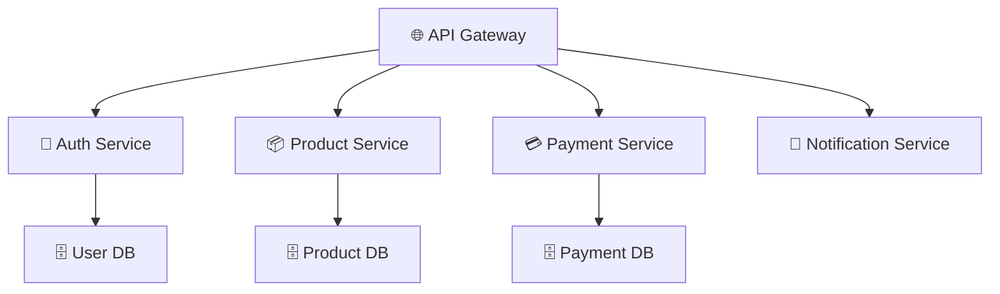

### ✅ **Переваги:**
- **Незалежне** розгортання сервісів
- **Масштабування** окремих компонентів
- **Технологічна** різноманітність

### 📦 **Контейнеризація:**
- Docker для **упаковки** додатків
- Kubernetes для **оркестрації**
- Консистентність між **середовищами**

## AI в SDLC 🤖

### 🧠 **Застосування AI:**

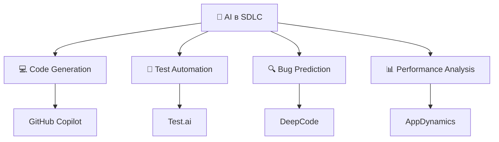

### 🚀 **Інновації:**
- **Автогенерація** коду з коментарів
- **Інтелектуальне** тестування
- **Предиктивна** аналітика якості
- **Автоматизований** code review

## Low-Code/No-Code 🎨

### 📈 **Зростання популярності:**
- **3x** швидша розробка
- **Демократизація** створення ПЗ
- Більше фокусу на **бізнес-логіці**

### 🛠️ **Популярні платформи:**
- **Microsoft** Power Platform
- **Salesforce** Platform
- **OutSystems**
- **Bubble**

### ⚖️ **Коли використовувати:**
- Прототипування та **MVP**
- Внутрішні бізнес-додатки
- Автоматизація **робочих процесів**
