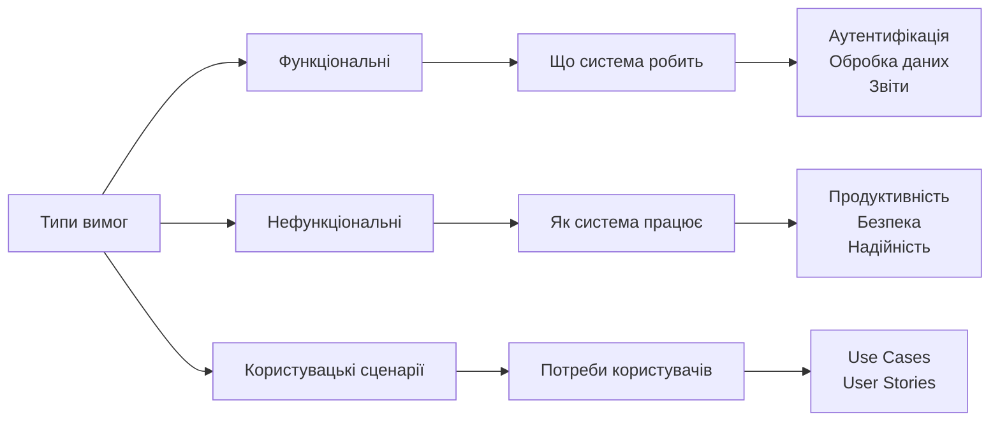
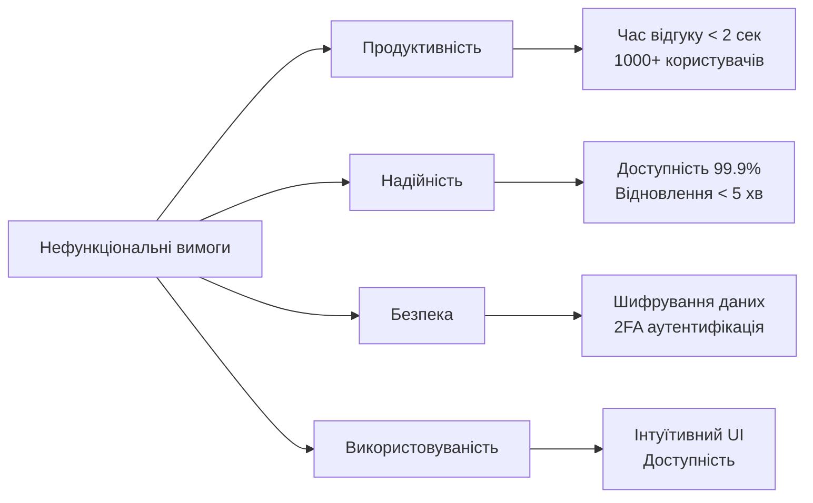
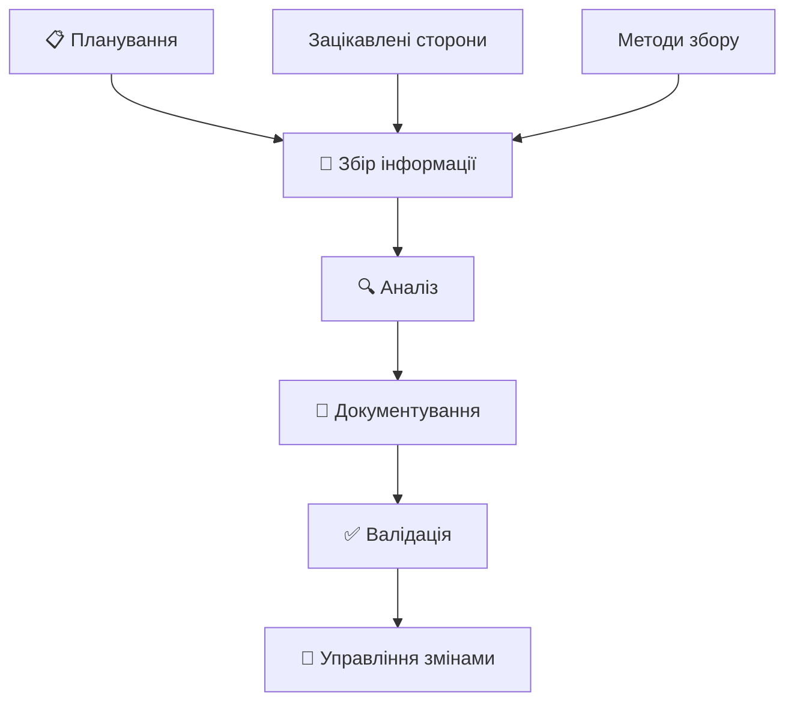
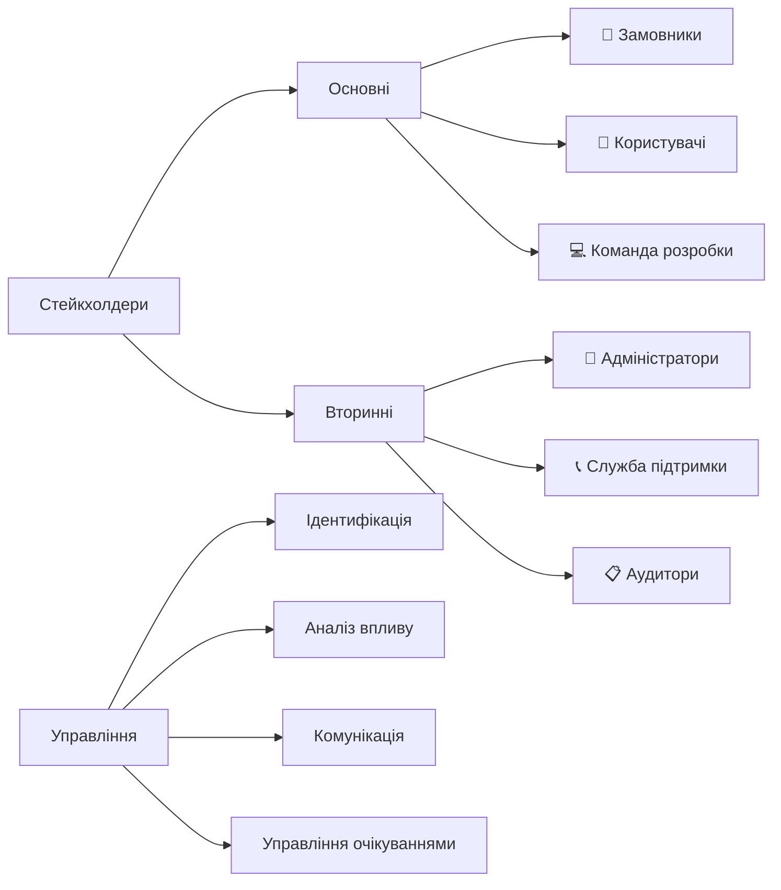
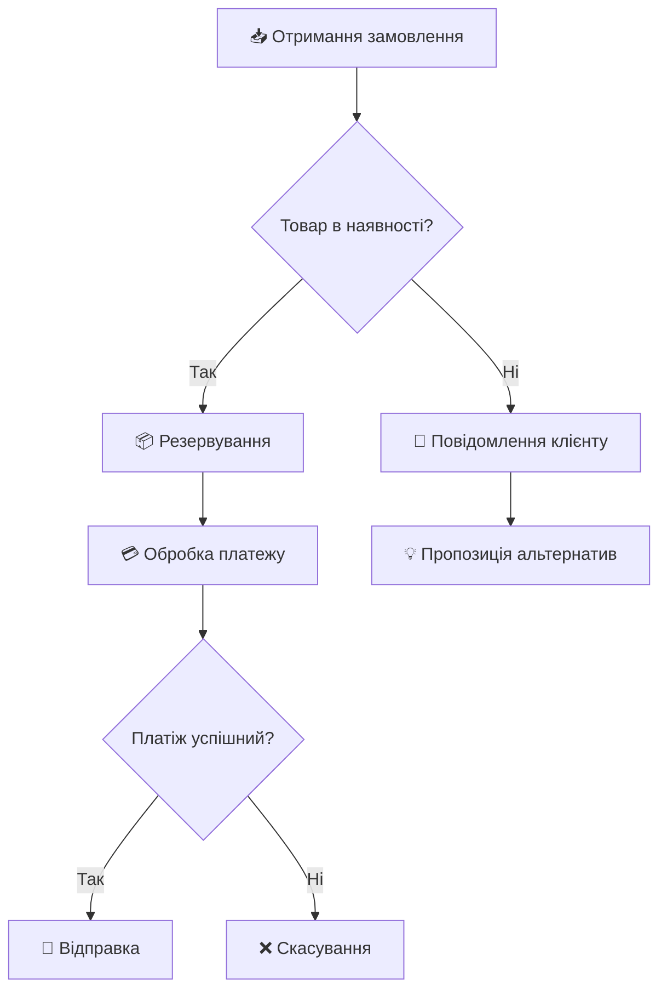
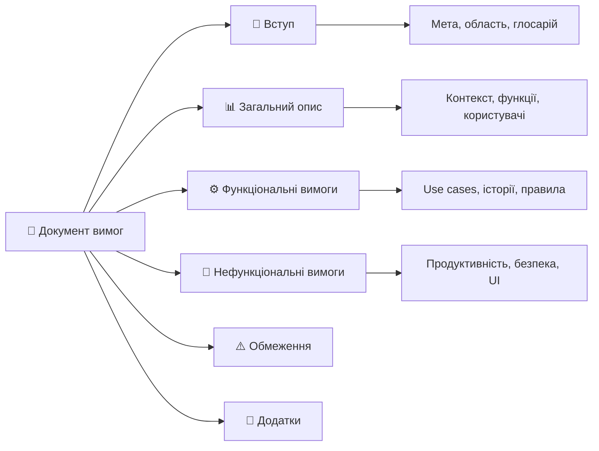
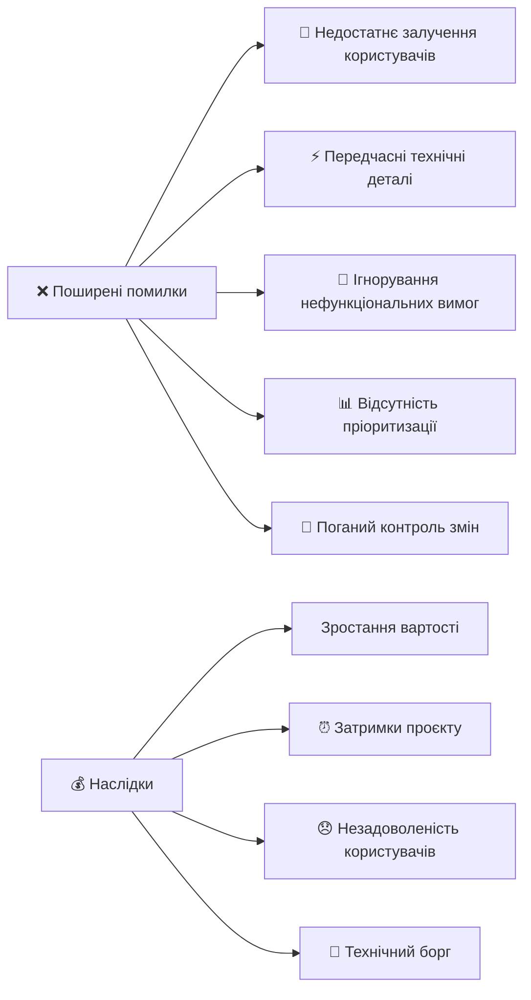

# Вимоги до ПЗ: збір, аналіз, документування

## Що таке вимоги до ПЗ?

### 🎯 **Визначення вимоги**

**Вимога** — це умова або можливість, яка потрібна користувачу для вирішення проблеми або досягнення мети.

### 💡 **Чому вимоги критично важливі?**

- Основа для проєктування та розробки
- Критерій приймання системи
- Засіб комунікації між командою та замовником

## Класифікація вимог

## Функціональні вимоги

### ⚙️ **Що описують:**

- **Основні функції** системи
- **Бізнес-правила** та логіку
- **Входи та виходи** системи
- **Поведінку** в різних ситуаціях

### 📝 **Приклади функціональних вимог:**

**✅ Добре написані:**

- Система повинна дозволяти користувачам реєструватися, вказуючи email та пароль
- Система повинна автоматично блокувати акаунт після 5 невдалих спроб входу

**❌ Погано написані:**

- Система повинна бути зручною
- Користувач може працювати з даними

## Нефункціональні вимоги

### 🎯 **Основні категорії:**

- **Продуктивність:** швидкість, пропускна здатність
- **Надійність:** доступність, стійкість до збоїв
- **Безпека:** захист даних, контроль доступу
- **Використовуваність:** зручність, доступність

## Користувацькі сценарії

### 📖 **Use Case (Сценарій використання):**

**Структура:**

- **Актор:** Хто виконує дію
- **Мета:** Чого хоче досягти
- **Передумови:** Що має бути виконано
- **Основний сценарій:** Послідовність дій
- **Альтернативні сценарії:** Що робити при помилках

### 💼 **Приклад Use Case "Оформлення замовлення":**

**Актор:** Зареєстрований покупець

**Мета:** Купити товари з кошика

**Передумови:** Користувач увійшов, є товари в кошику

**Основний сценарій:**

1. Користувач натискає "Оформити замовлення"
2. Система показує форму доставки
3. Користувач заповнює дані доставки
4. Система показує способи оплати
5. Користувач обирає спосіб оплати
6. Система обробляє платіж та створює замовлення

## Процес збору вимог

### 🎯 **Ключові етапи:**

1. **Підготовка:** визначення стейкхолдерів, планування
2. **Збір:** інтерв'ю, опитування, мозковий штурм
3. **Аналіз:** класифікація, пріоритизація
4. **Документування:** створення специфікації
5. **Валідація:** перевірка якості та повноти

## Методи збору вимог

### 🗣️ **Інтерв'ю**

**Переваги:**

- Детальна інформація
- Можливість уточнень
- Особистий контакт

**Недоліки:**

- Часозатратність
- Суб'єктивність
- Потребує навичок

### 📊 **Опитування**

**Переваги:**

- Багато респондентів
- Статистичні дані
- Швидкість

**Недоліки:**

- Поверхневість
- Низька участь
- Складно уточнити

### 🧠 **Мозковий штурм**

**Переваги:**

- Креативні ідеї
- Групова енергія
- Швидкість

**Недоліки:**

- Хаотичність
- Домінування окремих учасників

## Зацікавлені сторони

### 💡 **Поради для роботи:**

- **Ідентифікуйте всіх** учасників заздалегідь
- **Розумійте мотивацію** кожної групи
- **Балансуйте конфліктуючі** інтереси
- **Регулярно комунікуйте** з усіма групами

## Аналіз та моделювання

### 📈 **Методи аналізу:**

- **Класифікація** вимог за типами
- **Пріоритизація**
- **Виявлення конфліктів** між вимогами
- **Аналіз залежностей**

## Моделювання бізнес-процесів

## Прототипування

### 🎨 **Типи прототипів:**

**📄 Паперові:**

- Швидкі ескізи
- Дешеві
- Легко змінювати

**💻 Цифрові mockup'и:**

- Figma, Sketch, Adobe XD
- Реалістичний вигляд
- Можливість комментування

**🔗 Інтерактивні:**

- InVision, Marvel
- Тестування UX
- Демонстрація стейкхолдерам

**⚙️ Функціональні:**

- Реальний код
- Перевірка технічної можливості

## Документування вимог

### 📋 **Структура SRS документа:**

### ✅ **Атрибути якісних вимог:**

- **Однозначність** — одне тлумачення
- **Повнота** — всі необхідні деталі
- **Перевірюваність** — можна тестувати
- **Відстежуваність** — зв'язки з джерелами

## Поширені помилки

### ⚠️ **Топ-5 помилок:**

1. **Недостатнє залучення** кінцевих користувачів
2. **Фокус на технології** замість бізнес-потреб
3. **Ігнорування нефункціональних** вимог
4. **Відсутність чіткої** пріоритизації
5. **Поганий контроль** змін

## Найкращі практики

### 🎯 **Рекомендації для успіху:**

**👥 Робота з людьми:**

- Залучайте користувачів на всіх етапах
- Організуйте регулярні демонстрації
- Збирайте зворотний зв'язок постійно

**📋 Процес:**

- Використовуйте ітеративний підхід
- Документуйте обґрунтування рішень
- Інвестуйте в якість вимог

**🛠️ Інструменти:**

- Підтримуйте відстежуваність
- Будьте готові до змін
- Автоматизуйте де можливо

## Інструменти студента

### 🎓 **Рекомендовані для навчання:**

**🆓 Безкоштовні:**

- **Trello/Notion** — для управління backlog
- **Draw.io** — для діаграм та моделювання
- **Figma** — для прототипування UI
- **Google Docs** — для документування

**🏫 Освітні ліцензії:**

- **Jira** — Atlassian надає безкоштовно
- **Azure DevOps** — Microsoft for Students
- **Lucidchart** — діаграми та процеси

### 💡 **Поради для проєктів:**

- Починайте з простих інструментів
- Фокусуйтеся на процесі, не на інструментах
- Практикуйте на реальних кейсах
