# Гнучкі методології: Agile Manifesto та принципи
asdasdasd

## Історичний контекст

## Проблеми каскадної моделі

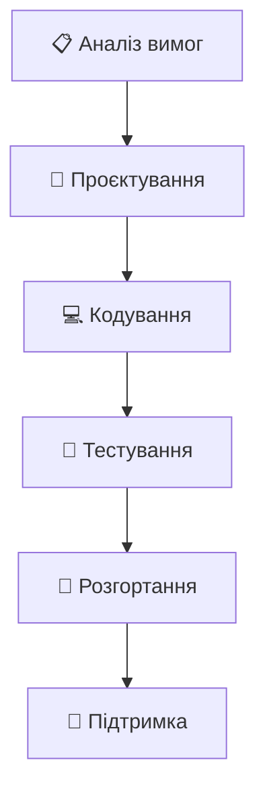

### ❌ Основні проблеми:

- **📅 Довгі цикли розробки** - результат через 6-12 місяців
- **🔒 Жорсткі вимоги** - складно внести зміни
- **📈 Високі ризики** - помилки виявляються пізно
- **👥 Відсутність зворотного зв'язку** - до самого кінця
- **💰 Перевитрати бюджету** - через непередбачені зміни

## Що змінилося у 90-х?

### 🌐 Бізнес-середовище:

- Швидкі зміни ринку
- Конкуренція інтернет-компаній
- Потреба в інноваціях
- Клієнто-орієнтованість

### 💡 Нові підходи:

- **RAD** (Rapid Application Development)
- **DSDM** (Dynamic Systems Development Method)
- **Scrum** та **Extreme Programming**
- Ітеративна розробка

## Agile Manifesto

## Snowbird 2001: народження руху

- 👥 **17 визнаних експертів** зібралися в Юті:
- 🎯 **Мета:** знайти спільні принципи гнучкої розробки

## Чотири основні цінності

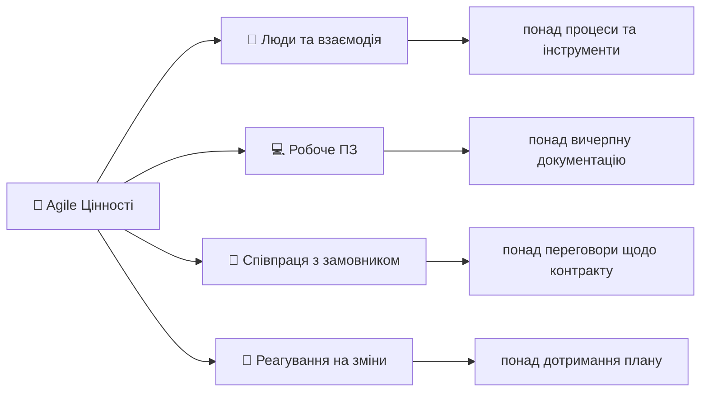

## Цінність 1: Люди та взаємодія

### 🎯 **Чому люди важливіші за процеси?**

- **🧠 Творчість та експертиза** не замінити процесами
- **💬 Пряма комунікація** ефективніша за формальні канали
- **🤝 Довіра та співпраця** - основа успіху
- **⚡ Швидке прийняття рішень** у невеликих командах

### 💡 **На практиці:**

- Команди до 9 людей
- Щоденні синхронізації
- Парне програмування
- Open space офіси

## Цінність 2: Робоче програмне забезпечення

### 🎯 **Функціональність понад документацію**

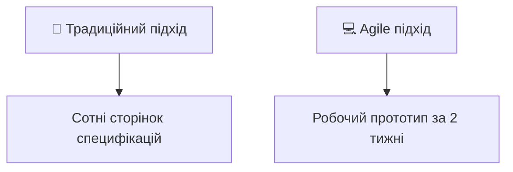

### ✅ **Переваги:**

- **👤 Користувачі бачать результат** одразу
- **🔍 Швидка валідація** ідей
- **🐛 Раннє виявлення** проблем
- **📊 Конкретний прогрес** проєкту

## Цінність 3: Співпраця з замовником

### 🤝 **Партнерство vs Протистояння**

#### ❌ Традиційний підхід:

- Детальний контракт = захист від змін
- "Ми vs Вони" ментальність
- Формальні зустрічі раз на місяць

#### ✅ Agile підхід:

- Замовник = член команди
- Щоденна або щотижнева взаємодія
- Спільне планування та пріоритизація
- Гнучкість в межах бюджету

## Цінність 4: Реагування на зміни

### 🔄 **Зміни = можливості, не перешкоди**

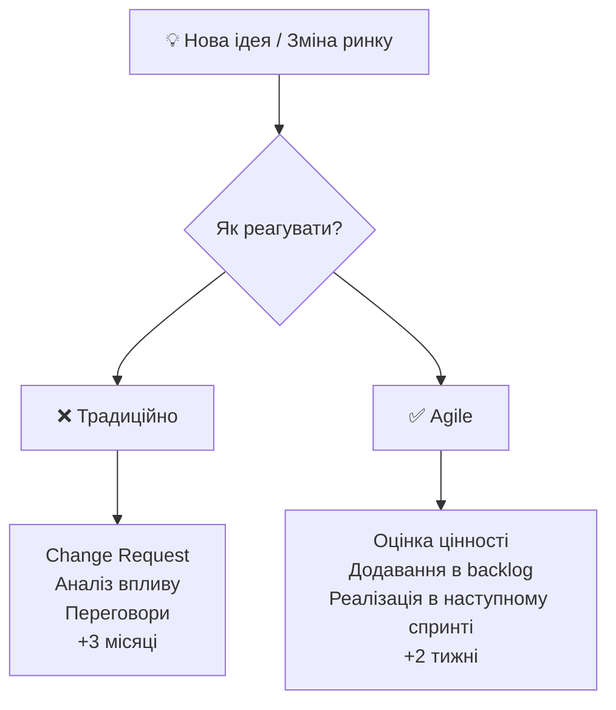

## Дванадцять принципів Agile

## Принципи 1-4: Фокус на замовнику

1. **🎯 Найвищий пріоритет** - задоволення замовника через раннє та постійне постачання цінного ПЗ
2. **🔄 Приймайте зміни** вимог, навіть на пізніх стадіях розробки
3. **🚀 Постачайте робоче ПЗ часто** - від кількох тижнів до кількох місяців
4. **👥 Бізнес та розробники** повинні працювати разом щодня

## Принципи 5-8: Команда та комунікація

5. **🌟 Будуйте проєкти навколо мотивованих людей** - довіряйте та підтримуйте
6. **💬 Найефективніший метод передачі інформації** - розмова віч-на-віч
7. **📊 Робоче ПЗ - основний показник прогресу**
8. **⚖️ Agile процеси сприяють сталому розвитку** - постійний темп роботи

## Принципи 9-12: Технічна досконалість

9. **🏗️ Постійна увага до технічної досконалості** та гарного дизайну
10. **⭐ Простота** - мистецтво максимізації обсягу невиконаної роботи
11. **🤝 Найкращі рішення виникають** із самоорганізованих команд
12. **🔍 Регулярно команда міркує** про ефективність та корегує поведінку

## Ключові концепції Agile

## Ітеративна та інкрементальна розробка

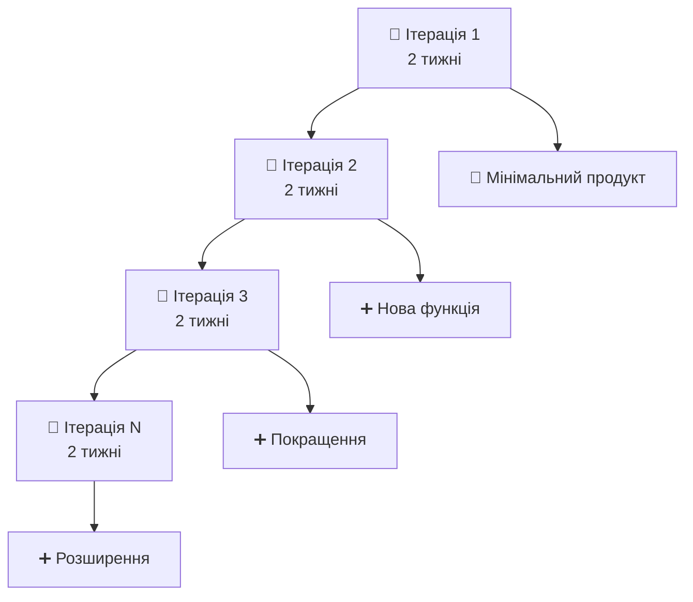

### ✅ **Переваги ітеративного підходу:**

- **⚡ Швидкий зворотний зв'язок** від користувачів
- **🐛 Раннє виявлення** проблем та ризиків
- **📈 Постійне покращення** продукту
- **💰 Можливість зупинити проєкт** з мінімальними втратами

## Самоорганізовані команди

### 🎯 **Характеристики ефективної команди:**

#### 👥 **Кроссфункціональність:**

- Всі необхідні навички в команді
- Розробники, тестувальники, аналітики
- Можливість створити готовий продукт

#### ⚡ **Автономність:**

- Команда сама вирішує, ЯК робити
- Мінімальне зовнішнє управління
- Колективна відповідальність за результат

#### 🤝 **Співпраця:**

- 5-9 людей (optimal team size)
- Щоденна синхронізація
- Спільне прийняття рішень

## Фокус на цінності для замовника

### 💎 **Що таке цінність?**

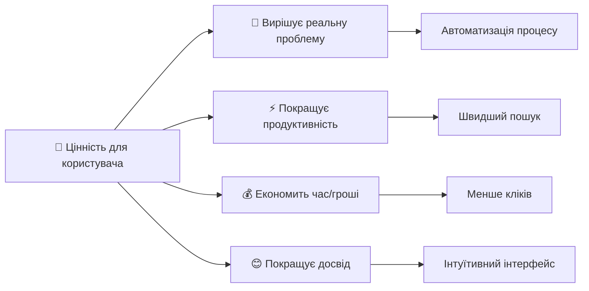

### 🎯 **Як забезпечити фокус на цінності:**

- **📋 Product Owner** визначає пріоритети
- **📊 Метрики користувацького досвіду**
- **🔄 Регулярні демо** стейкхолдерам
- **💬 Збір зворотного зв'язку** користувачів

## Agile vs Традиційні підходи

## Порівняльна таблиця

| Аспект | 🏗️ **Традиційний (Waterfall)** | 🚀 **Agile** |
|--------|---------------------------|------------|
| **📋 Планування** | Детальне на весь проєкт | Адаптивне по ітераціях |
| **📄 Документація** | Вичерпна перед кодуванням | Мінімально необхідна |
| **🔄 Зміни** | Дорогі та небажані | Вітаються та очікуються |
| **⏰ Цикл зворотного зв'язку** | В кінці проєкту | Кожні 1-4 тижні |
| **👥 Роль замовника** | Початок та кінець | Постійна участь |
| **🎯 Фокус** | Дотримання плану | Створення цінності |

## Управління ризиками

### 🏗️ **Традиційний підхід:**
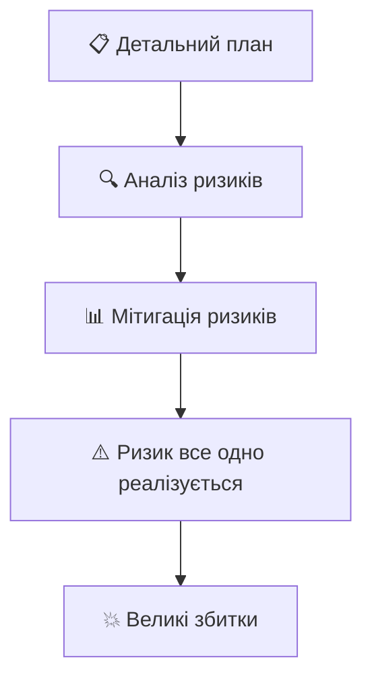

### 🚀 **Agile підхід:**
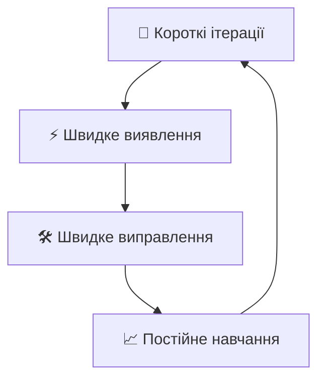

## Коли використовувати Agile?

### ✅ **Agile підходить для:**

- **🔬 Інноваційних проєктів** з невизначеністю
- **📱 Продуктів для кінцевих користувачів**
- **🌐 Вебдодатків та мобільних додатків**
- **🚀 Стартапів та MVP**
- **🔄 Проєктів зі змінними вимогами**

### ❌ **Agile може не підходити для:**

- **🏭 Критичних систем** з жорсткими вимогами
- **📋 Проєктів з чітко визначеним обсягом**
- **🏛️ Регульованих галузей** з обов'язковою документацією
- **⚖️ Контрактних робіт** з фіксованою ціною

## Популярні Agile фреймворки

## Scrum: найпопулярніший фреймворк

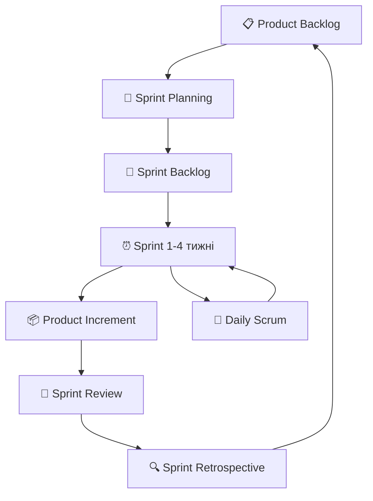

### 👥 **Ролі в Scrum:**

- **🎯 Product Owner** - визначає ЩО робити
- **🛠️ Scrum Master** - допомагає ЯК робити
- **👨‍💻 Development Team** - виконує роботу

### ⏰ **Події Scrum:**

- **📅 Daily Scrum** (15 хв щодня)
- **🎯 Sprint Planning** (8 годин на 4-тижневий спринт)
- **👥 Sprint Review** (4 години)
- **🔍 Sprint Retrospective** (3 години)

## Kanban: візуальне управління потоком

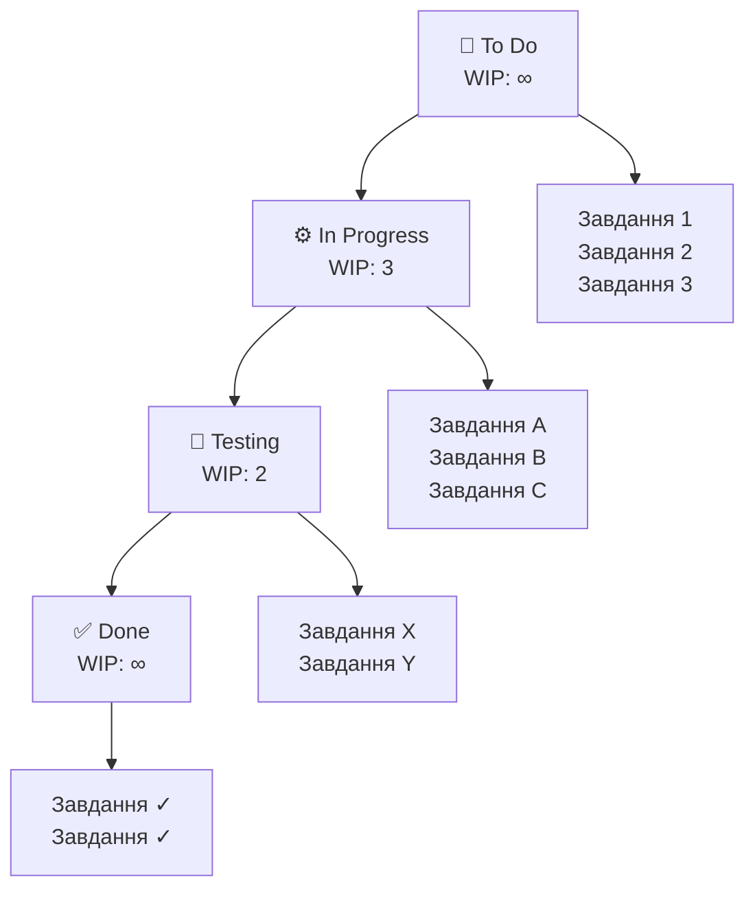

### 🎯 **Ключові принципи Kanban:**

- **👁️ Візуалізація роботи** - всі бачать статус
- **⚖️ Обмеження WIP** (Work In Progress)
- **📊 Управління потоком** робіт
- **📈 Постійне вдосконалення**

### 📊 **Метрики Kanban:**

- **⏱️ Cycle Time** - час виконання завдання
- **⏰ Lead Time** - час від запиту до доставки
- **🚀 Throughput** - кількість завдань за період

## Extreme Programming (XP)

### 🎯 **XP фокусується на технічних практиках:**

#### 👥 **Практики розробки:**

- **👨‍💻👩‍💻 Парне програмування** - два розробники, один комп'ютер
- **🧪 Test-Driven Development** - спочатку тести, потім код
- **🔄 Continuous Integration** - інтеграція кілька разів на день
- **🛠️ Refactoring** - постійне покращення коду

#### 📋 **Практики планування:**

- **📖 User Stories** - вимоги з перспективи користувача
- **🚀 Short Releases** - релізи кожні 1-3 місяці
- **🎯 Simple Design** - найпростіше рішення
- **🏗️ Metaphor** - спільне розуміння архітектури

## Користувацькі історії

## Формат користувацької історії

### 📖 **Стандартний шаблон:**

```
Як [роль користувача]
Я хочу [функціональність]
Щоб [бізнес-цінність]
```

### 🎯 **Приклади:**

**Історія 1:**

> Як **менеджер проєкту**
> Я хочу **бачити звіт про прогрес команди**
> Щоб **приймати обґрунтовані рішення про ресурси**

**Історія 2:**

> Як **користувач інтернет-магазину**
> Я хочу **зберігати товари в кошику між сесіями**
> Щоб **не втрачати вибрані товари при наступному відвідуванні**

## INVEST критерії якісних історій

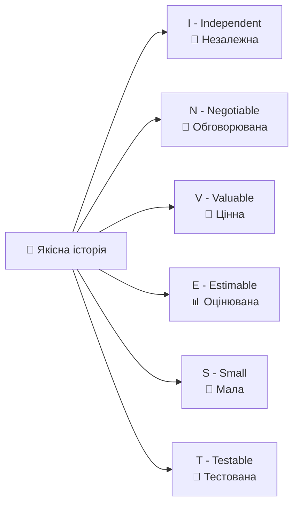

### ✅ **Критерії прийняття:**

**Формат Given-When-Then:**

```
Given [початкові умови]
When [дія користувача]
Then [очікуваний результат]
```

**Приклад:**

> **Given** користувач увійшов в систему
> **When** він натискає кнопку "Додати в кошик"
> **Then** товар з'являється в кошику з правильною кількістю

## Планування в Agile

## Рівні планування в Agile

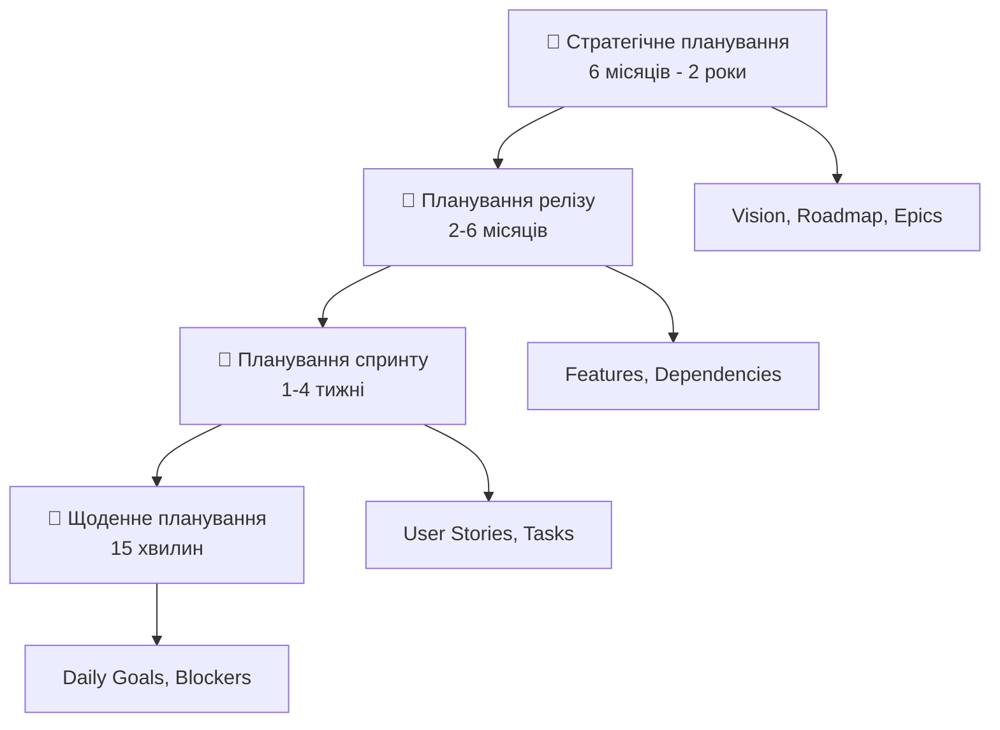

## Оцінка в Agile: Planning Poker

### 🎲 **Як працює Planning Poker:**

1. **📖 Product Owner** пояснює історію
2. **❓ Команда ставить** питання для уточнення
3. **🃏 Кожен вибирає картку** з оцінкою (1, 2, 3, 5, 8, 13...)
4. **🔄 Одночасно розкривають** картки
5. **💬 Обговорюють розбіжності** (найвища vs найнижча оцінка)
6. **🎯 Повторюють до консенсусу**

### 📊 **Story Points vs Години:**

| Story Points | Години | Опис |
|-------------|---------|------|
| **1** | 2-4 год | Тривіальне завдання |
| **3** | 1 день | Просте завдання |
| **5** | 2-3 дні | Середнє завдання |
| **8** | 1 тиждень | Складне завдання |
| **13** | >1 тижня | Потребує розбиття |

## Velocity та прогнозування

### 📈 **Velocity - швидкість команди:**

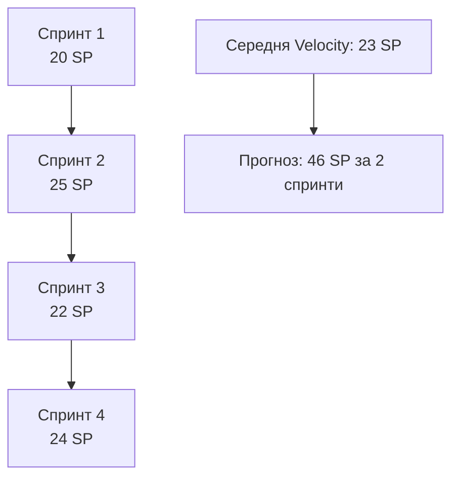

### 🎯 **Використання Velocity:**
- **📅 Планування майбутніх спринтів**
- **📊 Прогнозування термінів доставки**
- **📈 Відстеження покращення команди**
- **⚠️ НЕ для порівняння команд!**

## Метрики та вимірювання

## Основні Agile метрики

### 📊 **Burndown Chart - прогрес спринту:**

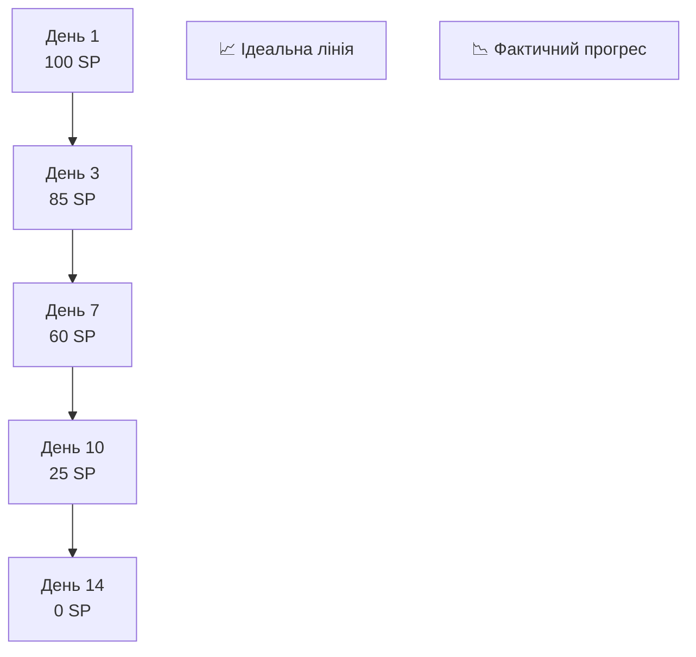

### ⏱️ **Метрики часу:**

- **🔄 Cycle Time** - час від початку до завершення
- **⏰ Lead Time** - час від запиту до доставки
- **🚀 Deployment Frequency** - частота релізів

### 🎯 **Метрики якості:**

- **📊 Code Coverage** - покриття тестами
- **🐛 Defect Density** - щільність дефектів
- **😊 Customer Satisfaction** - задоволення клієнтів

## Використання метрик для покращення

### ✅ **Правильне використання метрик:**

- **📈 Для покращення процесу**, не для контролю людей
- **🔍 Фокус на трендах**, а не на абсолютних значеннях
- **🎯 Actionable insights** - що можна покращити?
- **🤝 Обговорення на ретроспективах**

### ❌ **Уникайте пасток:**

- **🏃‍♂️ Гонки за velocity** без фокусу на якості
- **📊 Порівняння команд** за метриками
- **🎯 Оптимізації метрик** замість реальних цілей
- **📉 Покарання за "погані" метрики**

## Культурні аспекти

## Зміна організаційної культури

### 🔄 **Від контролю до довіри:**

#### 🏢 **Традиційна культура:**
- Ієрархічне прийняття рішень
- Контроль та звітність
- Боязнь помилок
- Індивідуальна відповідальність

#### 🚀 **Agile культура:**

- Розподілене лідерство
- Довіра та автономія
- Навчання на помилках
- Колективна відповідальність

### 💡 **Ключові культурні зміни:**

- **🤝 Від "я" до "ми"** - командна робота
- **🔄 Від "як завжди" до "як краще"** - експериментування
- **⚡ Від "правильно з першого разу" до "швидко навчайся"**
- **🎯 Від "виконання завдань" до "створення цінності"**

## Виклики впровадження Agile

### 🚧 **Основні перешкоди:**

#### 😰 **Опір змінам:**

- Страх втрати контролю (менеджмент)
- Комфорт звичних процесів
- Недовіра до нових підходів
- Брак навичок самоорганізації

#### 🏢 **Організаційні виклики:**

- Конфлікт з існуючими процесами
- KPI, орієнтовані на індивідуальну продуктивність
- Бюджетування по річних циклах
- Відокремлені відділи (silos)

### 🛠️ **Стратегії подолання:**

- **📚 Навчання та коучинг**
- **🎯 Пілотні проєкти** для демонстрації успіху
- **👥 Change champions** в організації
- **📊 Метрики покращення** бізнес-результатів

## Майбутнє Agile

## Еволюція та нові тренди

### 🔄 **Agile + DevOps:**

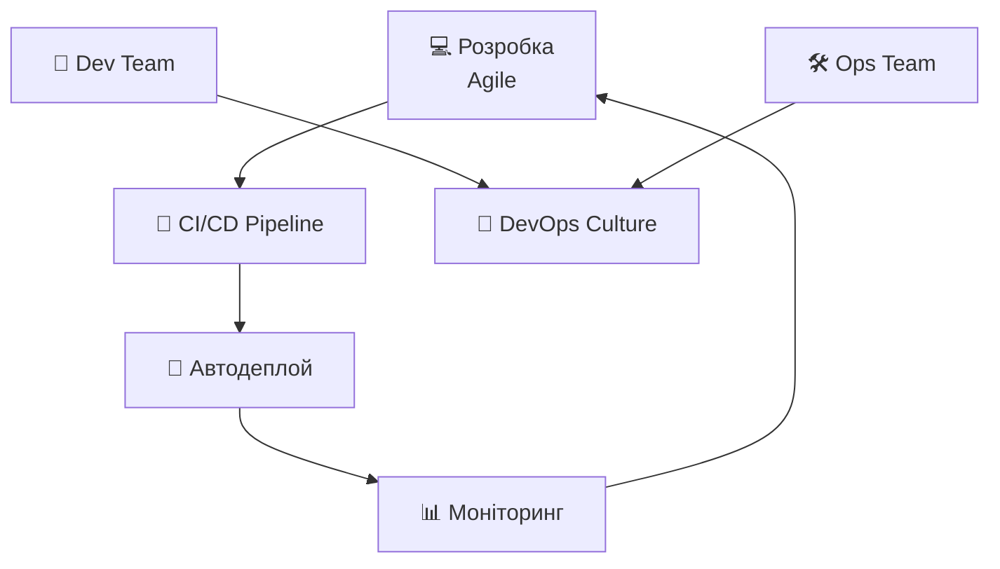

### 🎨 **Design Thinking + Agile:**

- **🔍 Empathize** - розуміння користувачів
- **🎯 Define** - визначення проблем
- **💡 Ideate** - генерація ідей
- **🛠️ Prototype** - швидке прототипування
- **🧪 Test** - тестування з користувачами

### 🚀 **Lean Startup + Agile:**

- **📊 Build-Measure-Learn** цикли
- **🧪 MVP (Minimum Viable Product)**
- **📈 Validated Learning**
- **🎯 Pivot or Persevere** рішення

## Agile за межами розробки ПЗ

### 🎯 **Agile Marketing:**

- Короткі кампанії
- A/B тестування
- Швидка адаптація до ринку
- Data-driven рішення

### 👥 **Agile HR:**

- Гнучкі команди
- Continuous feedback
- OKRs замість річних цілей
- Культура навчання

### 🏢 **Agile Organization:**

- **🕸️ Network of teams** замість ієрархії
- **🎯 Purpose-driven** команди
- **📚 Learning organization**
- **⚡ Rapid decision making**

## Віддалена робота та Agile

### 🌐 **Agile у distributed командах:**

#### ✅ **Що працює:**

- **💻 Digital-first** комунікація
- **🕐 Overlap hours** для синхронізації
- **📹 Virtual ceremonies** (Daily, Retro, Planning)
- **🛠️ Collaborative tools** (Miro, Figma, Slack)
- **📝 Асинхронна документація**

#### ⚠️ **Виклики:**

- Часові зони та культурні відмінності
- Втрата неформальної комунікації
- Складність у читанні body language
- Technology fatigue


## Практичні поради

## Для студентів: як почати з Agile

### 📚 **Вивчення основ:**

1. **📖 Прочитайте Agile Manifesto** - зрозумійте філософію
2. **🎯 Оберіть один фреймворк** (рекомендую Scrum)
3. **🛠️ Спробуйте інструменти** (Jira, Trello, Azure DevOps)
4. **👥 Приєднайтеся до спільнот** (Agile Alliance, local meetups)

### 🎯 **Практичне застосування:**

- **📱 Використовуйте Agile в навчальних проєктах**
- **📝 Пишіть користувацькі історії** замість технічних вимог
- **🔄 Робіть короткі ітерації** (1-2 тижні)
- **🤝 Практикуйте code review** та парне програмування

### 💼 **Підготовка до роботи:**

- **📜 Отримайте сертифікацію** (PSM I, CSM)
- **🎤 Розвивайте soft skills** - комунікація критично важлива
- **🔍 Вивчайте різні ролі** (PO, SM, Developer)
- **📊 Розумійте метрики** та як їх використовувати
