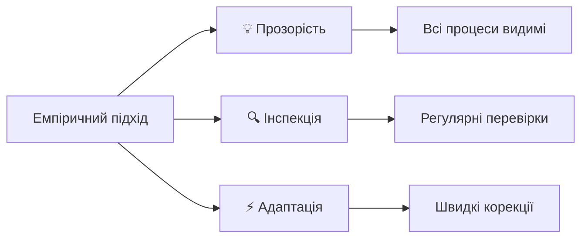
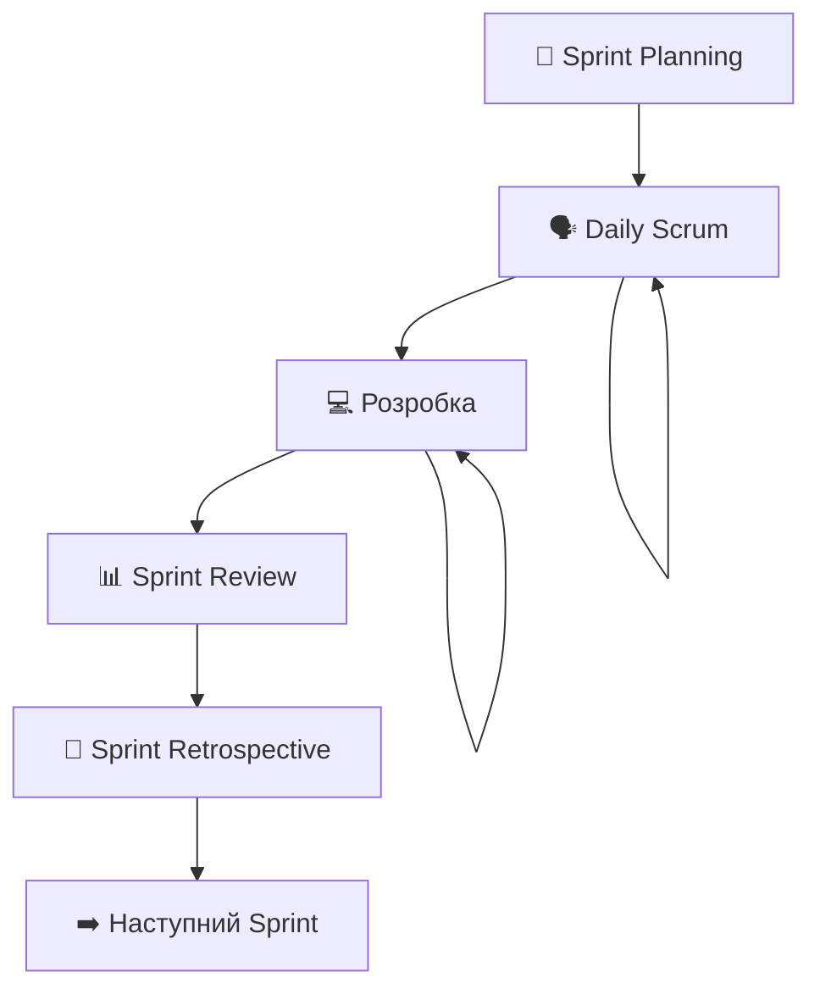
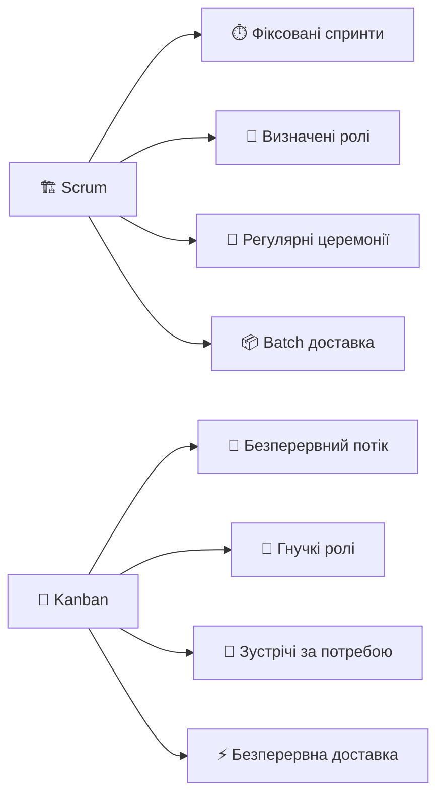

# Scrum та Kanban

## План презентації

1. Основи Scrum методології
2. Kanban: візуалізація потоку роботи
3. Порівняння підходів
4. Практичне впровадження
5. Інструменти та масштабування

## 1. Основи Scrum методології

## Емпіричний підхід Scrum

**🎯 Основна ідея:** Розробка через експеримент та навчання

## Ролі в Scrum команді

### 👨‍💼 **Product Owner**

- 📋 Управляє Product Backlog
- 🎯 Визначає пріоритети та цілі
- 💰 Максимізує цінність продукту

### 🤝 **Scrum Master**

- 🛡️ Захищає процес Scrum
- 🎪 Фасилітує церемонії
- 🚧 Усуває перешкоди

### 👩‍💻 **Команда розробки**

- 🔧 Самоорганізована та крос-функціональна
- 📦 Створює готовий продукт
- 3️⃣-9️⃣ Оптимальний розмір: 3-9 осіб

## Scrum події (церемонії)

**⏱️ Фіксована тривалість:** Зазвичай 1-4 тижні

## Daily Scrum: щоденна синхронізація

### 🕒 **15 хвилин, щодня**

**Три ключові питання:**

1. ✅ **Що я зробив вчора?**
2. 🎯 **Що я буду робити сьогодні?**
3. 🚧 **Які є перешкоди?**

**💡 Мета:** Синхронізація команди та планування на день

## Артефакти Scrum

### 📋 **Product Backlog**

- Впорядкований список всіх вимог
- Постійно розвивається
- Управляється Product Owner

### 📝 **Sprint Backlog**

- Вибрані елементи для поточного спринту
- План досягнення цілі спринту
- Належить команді розробки

### 📦 **Increment**

- Потенційно готовий до випуску продукт
- Сума всіх завершених елементів
- Створюється кожен спринт

## 2. Kanban: візуалізація потоку роботи

## Принципи Kanban

### 🎯 **Шість основних практик:**

1. **👁️ Візуалізація робочого процесу**
2. **⏸️ Обмеження роботи в процесі (WIP)**
3. **🌊 Керування потоком**
4. **📜 Явні політики процесу**
5. **🔄 Цикли зворотного зв'язку**
6. **📈 Покращення співпрацею**

## Kanban дошка

**🔑 Ключ:** WIP ліміти контролюють потік роботи

## WIP ліміти: магія обмежень

### ✅ **Переваги WIP лімітів:**

- 🎯 Фокус на завершенні, а не на початку
- 🚧 Виявлення вузьких місць
- ⚡ Швидший потік роботи
- 📊 Кращі метрики

### ⚠️ **Що робити при досягненні ліміту:**

- 🤝 Допомогти колегам
- 🔍 Знайти і усунути перешкоди
- ❌ **НЕ** починати нову роботу

## Класи обслуговування

### 🚨 **Expedite** - критичні проблеми
- Найвищий пріоритет
- Можуть порушувати WIP ліміти
- Мінімальна кількість

### 📅 **Fixed Date** - жорсткі дедлайни
- Планування завчасно
- Високий пріоритет за датою

### 📈 **Standard** - звичайна робота
- Основна частина роботи
- Обслуговування за пріоритетом

### 🔧 **Intangible** - технічна робота
- Технічний борг, рефакторинг
- Не пряма бізнес-цінність

## 3. Порівняння підходів

## Scrum vs Kanban: структура

## Коли використовувати Scrum?

### ✅ **Scrum ідеальний для:**

- 🆕 Нові продукти з невизначеними вимогами
- 🎯 Проєкти з чіткими цілями
- 👥 Стабільні команди
- 📈 Потреба в регулярних демо
- 🏢 Корпоративне середовище

### 📊 **Метрики Scrum:**

- Velocity (story points за спринт)
- Burndown charts
- Sprint burnup charts

## Коли використовувати Kanban?

### ✅ **Kanban ідеальний для:**

- 🔧 Підтримуючі команди
- 🔄 Часті зміни пріоритетів
- ⚡ Операційні завдання
- 🌊 Безперервний потік роботи
- 🎯 Фокус на оптимізації процесу

### 📊 **Метрики Kanban:**

- Cycle time і Lead time
- Throughput
- Cumulative flow diagrams

## Scrumban: краще з двох світів

### 🔀 **Гібридний підхід:**

**Від Scrum:** 👥 Ролі + 📅 Деякі церемонії
**Від Kanban:** 👁️ Візуалізація + ⏸️ WIP ліміти

### 🎯 **Коли використовувати:**

- Перехід від Scrum до Kanban
- Потреба в структурі + гнучкості
- Команди з мінливим навантаженням

## 4. Поширені помилки

### ❌ **ScrumBut синдром**

*"Ми використовуємо Scrum, але..."*

- Адаптація Scrum під старі процеси
- Пропуск важливих церемоній
- Неправильне розуміння ролей

### ❌ **Фальшивий Kanban**

- Відсутність справжніх WIP лімітів
- Фокус на інструментах, не принципах
- Ігнорування метрик потоку

### ❌ **Недостатня підтримка менеджменту**

- Опір організаційним змінам
- Змішування Agile з традиційними підходами

## 5. Інструменти для Agile команд

### 🖥️ **Цифрові рішення**

**Jira** 🏆

- Потужні можливості
- Підтримка Scrum + Kanban
- Інтеграція з розробкою
    

**Azure DevOps** 🔧

- Інтеграція з Microsoft екосистемою
- Від планування до розгортання

**Trello** 🎯

- Простота використання
- Ідеально для невеликих команд
    

## Головні висновки

### 🎯 **Ключові принципи**

**Scrum** = 🏗️ Структура + 🔄 Ритм + 🎯 Фокус

**Kanban** = 👁️ Візуалізація + 🌊 Потік + 📈 Покращення

**Вибір залежить від:**

- 🎯 Типу проєкту
- 👥 Команди та досвіду
- 🏢 Організаційного контексту
- 🔄 Частоти змін
