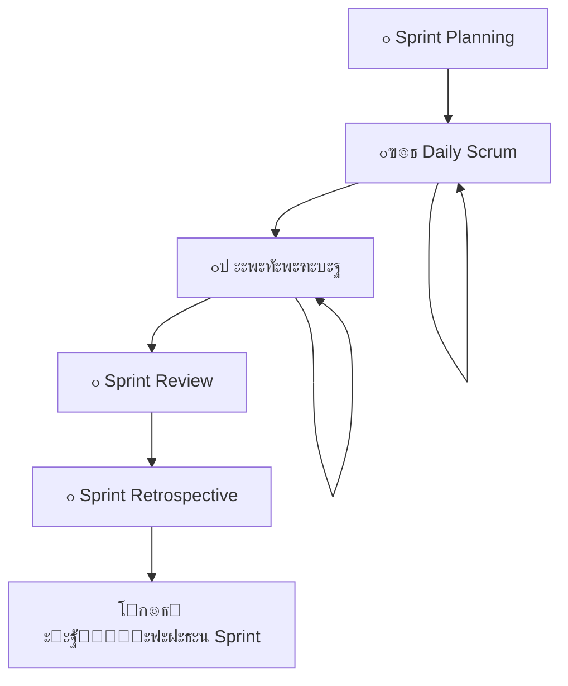

# Scrum та Kanban

## План презентації

1. Основи Scrum методології
2. Kanban: візуалізація потоку роботи
3. Порівняння підходів
4. Практичне впровадження
5. Інструменти та масштабування

## 1. Основи Scrum методології

## Емпіричний підхід Scrum

```mermaid
graph TB
    A[Емпіричний підхід] --> B[💡 Прозорість]
    A --> C[🔍 Інспекція]
    A --> D[⚡ Адаптація]

    B --> E[Всі процеси видимі]
    C --> F[Регулярні перевірки]
    D --> G[Швидкі корекції]
```

**🎯 Основна ідея:** Розробка через експеримент та навчання

## Ролі в Scrum команді

### 👨‍💼 **Product Owner**

- 📋 Управляє Product Backlog
- 🎯 Визначає пріоритети та цілі
- 💰 Максимізує цінність продукту

### 🤝 **Scrum Master**

- 🛡️ Захищає процес Scrum
- 🎪 Фасилітує церемонії
- 🚧 Усуває перешкоди

### 👩‍💻 **Команда розробки**

- 🔧 Самоорганізована та крос-функціональна
- 📦 Створює готовий продукт
- 3️⃣-9️⃣ Оптимальний розмір: 3-9 осіб

## Scrum події (церемонії)

**⏱️ Фіксована тривалість:** Зазвичай 1-4 тижні

## Daily Scrum: щоденна синхронізація

### 🕒 **15 хвилин, щодня**

**Три ключові питання:**
1. ✅ **Що я зробив вчора?**
2. 🎯 **Що я буду робити сьогодні?**
3. 🚧 **Які є перешкоди?**

**💡 Мета:** Синхронізація команди та планування на день

## Артефакти Scrum

### 📋 **Product Backlog**
- Впорядкований список всіх вимог
- Постійно розвивається
- Управляється Product Owner

### 📝 **Sprint Backlog**
- Вибрані елементи для поточного спринту
- План досягнення цілі спринту
- Належить команді розробки

### 📦 **Increment**
- Потенційно готовий до випуску продукт
- Сума всіх завершених елементів
- Створюється кожен спринт

## 2. Kanban: візуалізація потоку роботи

## Принципи Kanban

### 🎯 **Шість основних практик:**

1. **👁️ Візуалізація робочого процесу**
2. **⏸️ Обмеження роботи в процесі (WIP)**
3. **🌊 Керування потоком**
4. **📜 Явні політики процесу**
5. **🔄 Цикли зворотного зв'язку**
6. **📈 Покращення співпрацею**

## Kanban дошка

```mermaid
graph LR
    A[📥 To Do<br/>WIP: ∞] --> B[⚡ In Progress<br/>WIP: 3] --> C[👀 Review<br/>WIP: 2] --> D[✅ Done<br/>WIP: ∞]

    subgraph "In Progress"
    B1[Task 1]
    B2[Task 2]
    B3[Task 3]
    end

    subgraph "Review"
    C1[Task 4]
    C2[Task 5]
    end
```

**🔑 Ключ:** WIP ліміти контролюють потік роботи

## WIP ліміти: магія обмежень

### ✅ **Переваги WIP лімітів:**
- 🎯 Фокус на завершенні, а не на початку
- 🚧 Виявлення вузьких місць
- ⚡ Швидший потік роботи
- 📊 Кращі метрики

### ⚠️ **Що робити при досягненні ліміту:**
- 🤝 Допомогти колегам
- 🔍 Знайти і усунути перешкоди
- ❌ **НЕ** починати нову роботу

## Метрики Kanban

```mermaid
graph TD
    A[⏰ Час очікування] --> B[⚡ Час активної роботи]
    B --> C[⏰ Час очікування]
    C --> D[⚡ Час активної роботи]
    D --> E[✅ Завершено]

    F[📏 Lead Time = Весь час від запиту до доставки]
    G[🔄 Cycle Time = Час від початку роботи до завершення]
    H[📊 Flow Efficiency = Час активної роботи / Lead Time]
```

## Класи обслуговування

### 🚨 **Expedite** - критичні проблеми
- Найвищий пріоритет
- Можуть порушувати WIP ліміти
- Мінімальна кількість

### 📅 **Fixed Date** - жорсткі дедлайни
- Планування завчасно
- Високий пріоритет за датою

### 📈 **Standard** - звичайна робота
- Основна частина роботи
- Обслуговування за пріоритетом

### 🔧 **Intangible** - технічна робота
- Технічний борг, рефакторинг
- Не пряма бізнес-цінність

## 3. Порівняння підходів

## Scrum vs Kanban: структура

```mermaid
graph TD
    A[🏗️ Scrum] --> B[⏱️ Фіксовані спринти]
    A --> C[👥 Визначені ролі]
    A --> D[📅 Регулярні церемонії]
    A --> E[📦 Batch доставка]

    F[🌊 Kanban] --> G[🔄 Безперервний потік]
    F --> H[🤸 Гнучкі ролі]
    F --> I[🎯 Зустрічі за потребою]
    F --> J[⚡ Безперервна доставка]
```

## Коли використовувати Scrum?

### ✅ **Scrum ідеальний для:**
- 🆕 Нові продукти з невизначеними вимогами
- 🎯 Проєкти з чіткими цілями
- 👥 Стабільні команди
- 📈 Потреба в регулярних демо
- 🏢 Корпоративне середовище

### 📊 **Метрики Scrum:**
- Velocity (story points за спринт)
- Burndown charts
- Sprint burnup charts

## Коли використовувати Kanban?

### ✅ **Kanban ідеальний для:**
- 🔧 Підтримуючі команди
- 🔄 Часті зміни пріоритетів
- ⚡ Операційні завдання
- 🌊 Безперервний потік роботи
- 🎯 Фокус на оптимізації процесу

### 📊 **Метрики Kanban:**
- Cycle time і Lead time
- Throughput
- Cumulative flow diagrams

## Scrumban: кращее з двох світів

### 🔀 **Гібридний підхід:**

**Від Scrum:** 👥 Ролі + 📅 Деякі церемонії
**Від Kanban:** 👁️ Візуалізація + ⏸️ WIP ліміти

### 🎯 **Коли використовувати:**
- Перехід від Scrum до Kanban
- Потреба в структурі + гнучкості
- Команди з мінливим навантаженням

## 4. Практичне впровадження

## Впровадження Scrum: перші кроки

### 1️⃣ **Підготовка команди**
- 👨‍💼 Призначити досвідченого Product Owner
- 🤝 Знайти або навчити Scrum Master
- 👥 Сформувати крос-функціональну команду

### 2️⃣ **Перші спринти**
- 📏 Почати з коротших спринтів (1-2 тижні)
- 🎯 Фокус на навчанні, не продуктивності
- 🔄 Активні ретроспективи

### 3️⃣ **Створення Product Backlog**
- 📝 User Stories з чіткими критеріями
- 🔢 Оцінка складності (story points)

## Впровадження Kanban: крок за кроком

### 1️⃣ **Мапування поточного процесу**

```mermaid
graph LR
    A[📋 Поточний процес] --> B[👁️ Візуалізація]
    B --> C[⏸️ Встановлення WIP лімітів]
    C --> D[📊 Вимірювання потоку]
    D --> E[🔍 Ідентифікація проблем]
    E --> F[🧪 Експерименти з покращенням]
    F --> D
```

### 2️⃣ **Консервативні WIP ліміти**
- Краще почати з вищих лімітів
- Поступово зменшувати
- Спостерігати за впливом

## Поширені помилки

### ❌ **ScrumBut синдром**
*"Ми використовуємо Scrum, але..."*
- Адаптація Scrum під старі процеси
- Пропуск важливих церемоній
- Неправильне розуміння ролей

### ❌ **Фальшивий Kanban**
- Відсутність справжніх WIP лімітів
- Фокус на інструментах, не принципах
- Ігнорування метрик потоку

### ❌ **Недостатня підтримка менеджменту**
- Опір організаційним змінам
- Змішування Agile з традиційними підходами

## 5. Інструменти та масштабування

## Інструменти для Agile команд

### 🖥️ **Цифрові рішення**

**Jira** 🏆
- Потужні можливості
- Підтримка Scrum + Kanban
- Інтеграція з розробкою

**Azure DevOps** 🔧
- Інтеграція з Microsoft екосистемою
- Від планування до розгортання

**Trello** 🎯
- Простота використання
- Ідеально для невеликих команд

## Фізичні vs Цифрові дошки

### 📋 **Фізичні дошки**
✅ Висока візуальність
✅ Тактильний досвід
❌ Обмеження для віддалених команд
❌ Складність з метриками

### 💻 **Цифрові дошки**
✅ Підтримка розподілених команд
✅ Автоматичні метрики
✅ Інтеграція з інструментами
❌ Менша візуальна привабливість

## Інтеграція з розробкою

```mermaid
graph LR
    A[📋 Agile інструмент] --> B[🔗 Git інтеграція]
    A --> C[🚀 CI/CD pipeline]
    A --> D[🧪 Testing tools]

    B --> E[Коміти → задачі]
    C --> F[Автооновлення статусу]
    D --> G[Автостворення багів]
```

**🎯 Результат:** Повна простежуваність від вимог до коду

## Масштабування Agile

### 🏢 **Frameworks для великих організацій**

**SAFe (Scaled Agile Framework)**
- 🏗️ Структурований підхід
- 📅 Program Increments
- 🚄 Agile Release Trains

**Scrum of Scrums**
- 🤝 Координація через представників
- 🎯 Простота впровадження
- ⚠️ Обмежена масштабованість

**LeSS (Large Scale Scrum)**
- 📋 Один Product Backlog
- 🎯 Мінімальна складність
- 🔄 Збереження принципів Scrum

## Виклики масштабування

### 🤝 **Координація між командами**
- Управління залежностями
- Синхронізація релізів
- Узгодженість архітектури

### 🏗️ **Технічні виклики**
- Спільний код та архітектура
- Стандарти розробки
- Integration challenges

### 🎭 **Культурні зміни**
- Різні швидкості адаптації
- Опір змінам
- Навчання та коучинг

## Практичні поради

### 🌱 **Для команд-початківців**
1. 🎯 Почніть з простого
2. 🔄 Фокус на ретроспективах
3. 📚 Інвестуйте в навчання
4. 🤝 Знайдіть ментора або коуча

### 🚀 **Для досвідчених команд**
1. 🧪 Експериментуйте з гібридними підходами
2. 📊 Фокус на метриках та покращенні
3. 👨‍🏫 Станьте менторами для інших
4. 🎯 Адаптуйте під ваш контекст

## Головні висновки

### 🎯 **Ключові принципи**

**Scrum** = 🏗️ Структура + 🔄 Ритм + 🎯 Фокус

**Kanban** = 👁️ Візуалізація + 🌊 Потік + 📈 Покращення

**Вибір залежить від:**

- 🎯 Типу проєкту
- 👥 Команди та досвіду
- 🏢 Організаційного контексту
- 🔄 Частоти змін
