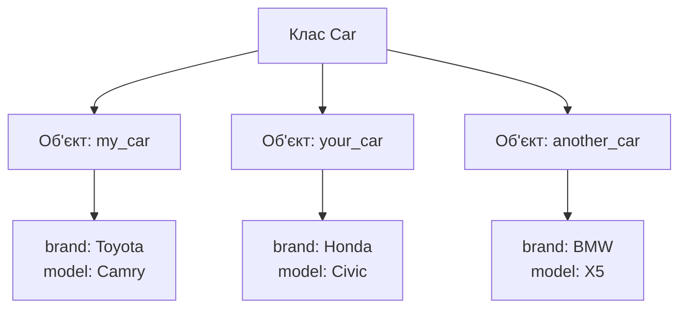
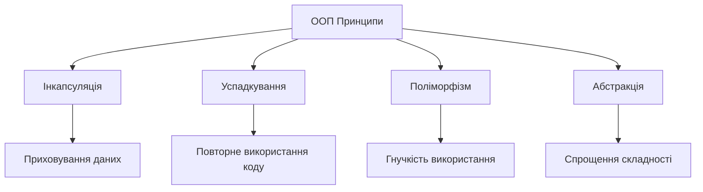
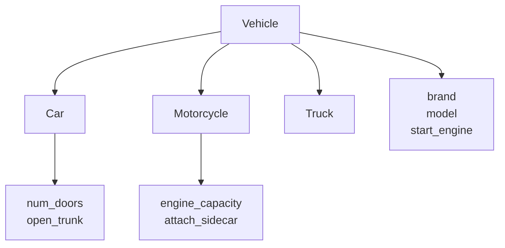

# Основи об'єктно-орієнтованого програмування

## План презентації

1. Вступ до ООП
2. Об'єкти та класи
3. Чотири принципи ООП
4. Практичні аспекти

## 1. Вступ до ООП

## Що таке ООП?

**Об'єктно-орієнтоване програмування** — парадигма програмування, яка організовує код навколо об'єктів, що поєднують дані та методи роботи з ними.

### 🎯 Основна ідея:
- Моделювання реального світу через програмні об'єкти
- Об'єднання даних та поведінки в єдину сутність
- Природне відображення структури багатьох завдань

### 📊 Історична довідка:
- **1960-ті**: Simula — перші класи та об'єкти
- **1970-ті**: Smalltalk — повністю ООП мова
- **Сьогодні**: Java, Python, C++, C#, JavaScript

## Чому ООП важливе?

### ✅ Переваги ООП:
- **Модульність** — код розділений на незалежні частини
- **Повторне використання** — код можна використовувати багаторазово
- **Гнучкість** — легко розширювати функціональність
- **Підтримуваність** — простіше вносити зміни

### 🔧 Застосування:
- GUI застосунки
- Ігрова розробка
- Веб-застосунки
- Корпоративні системи

## 2. Об'єкти та класи

## Об'єкт — програмна модель

**Об'єкт** поєднує дані (атрибути) та методи (поведінку)

### 🚗 Приклад: Автомобіль

**Характеристики (стан):**
- Марка: Toyota
- Модель: Camry
- Рік: 2020
- Пробіг: 15000 км

**Поведінка (методи):**
- Запустити двигун
- Їхати
- Гальмувати
- Фарбувати

## Клас — шаблон для об'єктів

**Клас** визначає структуру та поведінку об'єктів



**Клас** = Креслення будинку
**Об'єкт** = Побудований будинок

## Приклад класу та об'єктів

```python
class Car:
    def __init__(self, brand, model, year):
        self.brand = brand
        self.model = model
        self.year = year
        self.mileage = 0

    def drive(self, distance):
        self.mileage += distance
        return f"Проїхано {distance} км"

    def get_info(self):
        return f"{self.year} {self.brand} {self.model}"

# Створення об'єктів
my_car = Car('Toyota', 'Camry', 2020)
your_car = Car('Honda', 'Civic', 2021)

print(my_car.get_info())
print(my_car.drive(50))
```

**Результат:**
```
2020 Toyota Camry
Проїхано 50 км
```

## 3. Чотири принципи ООП

## Чотири стовпи ООП



Кожен принцип вирішує конкретні проблеми розробки

## Інкапсуляція

**Об'єднання даних та методів + приховування реалізації**

### 🔒 Рівні доступу:
- **Публічні** — доступні звідусіль
- **Захищені** (`_attribute`) — для класу та нащадків
- **Приватні** (`__attribute`) — тільки всередині класу

### ✅ Переваги:
- Захист даних від неконтрольованих змін
- Можливість змінювати реалізацію без впливу на зовнішній код
- Спрощення використання класу

## Приклад інкапсуляції

```python
class BankAccount:
    def __init__(self, owner, initial_balance=0):
        self.owner = owner
        self.__balance = initial_balance  # Приватний атрибут

    def deposit(self, amount):
        if amount > 0:
            self.__balance += amount
            return f"Поповнено на {amount}"
        return "Сума має бути додатною"

    def withdraw(self, amount):
        if 0 < amount <= self.__balance:
            self.__balance -= amount
            return f"Знято {amount}"
        return "Недостатньо коштів"

    def get_balance(self):
        return self.__balance

account = BankAccount("Іван", 1000)
account.deposit(500)
# account.__balance = 999999  ❌ Помилка!
print(account.get_balance())  # ✅ Правильно
```

## Успадкування

**Створення нових класів на основі існуючих**



### ✅ Переваги:
- Повторне використання коду
- Створення ієрархій класів
- Логічна організація коду

## Приклад успадкування

```python
# Базовий клас
class Vehicle:
    def __init__(self, brand, model):
        self.brand = brand
        self.model = model

    def start_engine(self):
        return f"{self.brand} {self.model}: двигун запущено"

# Дочірній клас
class Car(Vehicle):
    def __init__(self, brand, model, num_doors):
        super().__init__(brand, model)
        self.num_doors = num_doors

    def open_trunk(self):
        return "Багажник відкрито"

# Використання
sedan = Car('Toyota', 'Camry', 4)
print(sedan.start_engine())  # Успадкований метод
print(sedan.open_trunk())    # Власний метод
```

## Поліморфізм

**Можливість об'єктів різних класів реагувати на однакові виклики по-різному**

### 🎭 Типи поліморфізму:
- **Перевизначення методів** — у нащадків
- **Перевантаження методів** — різні параметри

### ✅ Переваги:
- Гнучкість коду
- Можливість працювати з різними типами через єдиний інтерфейс
- Розширюваність системи

## Приклад поліморфізму

```python
class Shape:
    def area(self):
        raise NotImplementedError

class Rectangle(Shape):
    def __init__(self, width, height):
        self.width = width
        self.height = height

    def area(self):
        return self.width * self.height

class Circle(Shape):
    def __init__(self, radius):
        self.radius = radius

    def area(self):
        return 3.14159 * self.radius ** 2

# Поліморфне використання
shapes = [Rectangle(5, 3), Circle(4)]

for shape in shapes:
    print(f"Площа: {shape.area():.2f}")
```

**Результат:**
```
Площа: 15.00
Площа: 50.27
```

## Абстракція

**Виділення суттєвих характеристик та приховування деталей**

### 🎯 Абстрактні класи:
- Визначають загальний інтерфейс
- Не можуть бути інстанційовані
- Змушують нащадків реалізувати методи

### ✅ Переваги:
- Чіткі контракти між компонентами
- Полегшення розробки модульних систем
- Зменшення складності

## Приклад абстракції

```python
from abc import ABC, abstractmethod

class Database(ABC):
    @abstractmethod
    def connect(self):
        pass

    @abstractmethod
    def execute_query(self, query):
        pass

class MySQLDatabase(Database):
    def connect(self):
        return "Підключено до MySQL"

    def execute_query(self, query):
        return f"Виконано MySQL запит: {query}"

class MongoDatabase(Database):
    def connect(self):
        return "Підключено до MongoDB"

    def execute_query(self, query):
        return f"Виконано MongoDB запит: {query}"

# db = Database()  ❌ Помилка!
mysql = MySQLDatabase()  # ✅ OK
```


## 4. Практичні аспекти

## Коли використовувати ООП?

### ✅ Підходить для:
- **Складних застосунків** з багатьма компонентами
- **GUI додатків** — кнопки, вікна як об'єкти
- **Ігрова розробка** — персонажі, предмети
- **Симуляції** реального світу
- **Довгострокових проєктів** з потребою підтримки

### ❌ Може бути надмірним для:
- Простих скриптів та утилітарних програм
- Невеликих завдань без складної логіки
- Прототипів та експериментів

## Найкращі практики ООП

### 🎯 Принципи проєктування:
- **Єдина відповідальність** — один клас, одна задача
- **Інкапсуляція** — приховуйте внутрішні деталі
- **Композиція над успадкуванням** — уникайте глибоких ієрархій

### 📝 Іменування:
- **Класи** — іменники в PascalCase (`UserAccount`)
- **Методи** — дієслова в snake_case (`get_balance()`)
- **Приватні члени** — префікс `__` або `_`

### 📚 Документування:
- Docstrings для класів та методів
- Опис призначення, параметрів та результатів
- Приклади використання

## Приклад якісного коду

```python
class ShoppingCart:
    """
    Клас для управління кошиком покупок.

    Attributes:
        customer_id (str): Ідентифікатор покупця
        items (list): Список товарів у кошику
    """

    def __init__(self, customer_id):
        """Ініціалізує кошик для покупця."""
        self.customer_id = customer_id
        self._items = []

    def add_item(self, name, price, quantity=1):
        """
        Додає товар до кошика.

        Args:
            name (str): Назва товару
            price (float): Ціна за одиницю
            quantity (int): Кількість

        Returns:
            dict: Доданий товар
        """
        item = {
            'name': name,
            'price': price,
            'quantity': quantity
        }
        self._items.append(item)
        return item
```

## Переваги та недоліки ООП

### ✅ Переваги:
- **Модульність** — легко організувати код
- **Повторне використання** — успадкування та композиція
- **Гнучкість** — поліморфізм та абстракція
- **Підтримуваність** — зміни локалізовані в класах

### ❌ Недоліки:
- **Складність** — може бути надмірною для простих задач
- **Продуктивність** — накладні витрати на об'єкти
- **Крива навчання** — потребує часу для освоєння
- **Надмірне проєктування** — ризик створення зайвої складності
