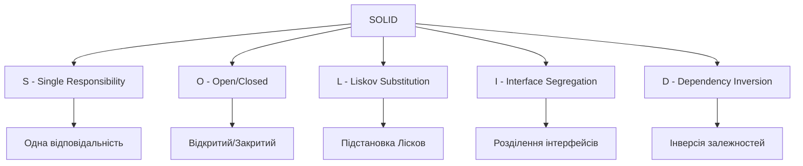
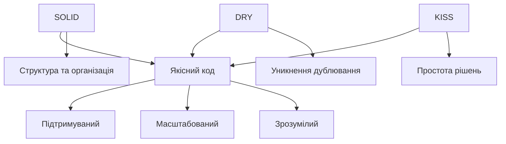

# Принципи проєктування: SOLID, DRY, KISS

## План презентації

1. Вступ до принципів проєктування
2. SOLID принципи
3. Принцип DRY
4. Принцип KISS
5. Взаємодія принципів
6. Практичне застосування

## 1. Вступ

## Чому важливі принципи проєктування?

### 🎯 Основна мета:
Створювати код, який легко:
- **Читати** та розуміти
- **Модифікувати** та розширювати
- **Тестувати** та налагоджувати
- **Підтримувати** протягом років

### 📊 Проблеми поганого коду:
- Заплутана логіка
- Дублювання коду
- Жорсткі залежності
- Складність змін
- Високі витрати на підтримку


## 2. SOLID принципи

## SOLID — п'ять правил ООП



Сформульовані **Робертом Мартіном** (Uncle Bob)

## S — Single Responsibility Principle

**Кожен клас має одну причину для зміни**

### ❌ Погано — багато відповідальностей:
```python
class User:
    def validate_email(self): pass
    def save_to_database(self): pass
    def send_email(self): pass
    def hash_password(self): pass
```

### ✅ Добре — кожен клас має одну роль:
```python
class User:
    # Тільки дані користувача
    pass

class UserValidator:
    # Тільки валідація
    pass

class UserRepository:
    # Тільки збереження
    pass

class EmailService:
    # Тільки email
    pass
```

## Переваги SRP

### ✅ Що отримуємо:
- **Модульність** — легко зрозуміти призначення класу
- **Тестування** — простіше тестувати окремі функції
- **Повторне використання** — класи з чіткими ролями
- **Підтримка** — зміни локалізовані в одному місці

### 🎯 Практичне правило:
Якщо можете описати клас словом "І" замість "АБО" —
порушено принцип єдиної відповідальності!

**Приклад:**
User validator **І** repository ❌
User validator **АБО** repository ✅

## O — Open/Closed Principle

**Відкритий для розширення, закритий для модифікації**

### ❌ Погано — модифікація існуючого коду:
```python
class DiscountCalculator:
    def calculate(self, type, amount):
        if type == 'regular':
            return amount * 0.05
        elif type == 'premium':
            return amount * 0.10
        elif type == 'vip':
            return amount * 0.20
        # Додавання нового типу = зміна класу!
```

### ✅ Добре — розширення через нові класи:
```python
class DiscountStrategy(ABC):
    @abstractmethod
    def calculate(self, amount): pass

class RegularDiscount(DiscountStrategy):
    def calculate(self, amount):
        return amount * 0.05

class VIPDiscount(DiscountStrategy):
    def calculate(self, amount):
        return amount * 0.20
# Додавання нового типу = новий клас!
```

## Переваги OCP

### ✅ Що отримуємо:
- **Стабільність** — старий код не змінюється
- **Безпека** — менше ризик внести помилки
- **Розширюваність** — легко додавати функції
- **Тестування** — існуючі тести залишаються валідними

### 🔧 Механізми реалізації:
- Абстракції та інтерфейси
- Поліморфізм
- Патерн Стратегія
- Впровадження залежностей

## L — Liskov Substitution Principle

**Підтипи можуть замінювати базові типи без порушення коректності**

### ❌ Класична проблема: Квадрат та Прямокутник

```python
class Rectangle:
    def set_width(self, w): self.width = w
    def set_height(self, h): self.height = h

class Square(Rectangle):
    def set_width(self, w):
        self.width = w
        self.height = w  # Порушує очікування!
    def set_height(self, h):
        self.width = h
        self.height = h

def process(rect):
    rect.set_width(5)
    rect.set_height(4)
    assert rect.area() == 20  # Не працює для Square!
```

**Проблема:** Square порушує поведінку Rectangle

## Правильне рішення LSP

### ✅ Добре — окремі незалежні класи:

```python
class Shape(ABC):
    @abstractmethod
    def area(self): pass

class Rectangle(Shape):
    def __init__(self, width, height):
        self.width = width
        self.height = height

    def area(self):
        return self.width * self.height

class Square(Shape):
    def __init__(self, side):
        self.side = side

    def area(self):
        return self.side ** 2
```

Тепер кожен клас має коректну поведінку!

## I — Interface Segregation Principle

**Багато специфічних інтерфейсів краще, ніж один загальний**

### ❌ Погано — один великий інтерфейс:
```python
class Worker(ABC):
    @abstractmethod
    def work(self): pass
    @abstractmethod
    def eat(self): pass
    @abstractmethod
    def sleep(self): pass

class Robot(Worker):
    def work(self): return "Працює"
    def eat(self): raise NotImplementedError  # ❌
    def sleep(self): raise NotImplementedError  # ❌
```

**Проблема:** Робот змушений реалізувати непотрібні методи

## Рішення ISP

### ✅ Добре — кілька маленьких інтерфейсів:

```python
class Workable(ABC):
    @abstractmethod
    def work(self): pass

class Eatable(ABC):
    @abstractmethod
    def eat(self): pass

class Sleepable(ABC):
    @abstractmethod
    def sleep(self): pass

class Human(Workable, Eatable, Sleepable):
    def work(self): return "Працює"
    def eat(self): return "Їсть"
    def sleep(self): return "Спить"

class Robot(Workable):
    def work(self): return "Працює"
    # Реалізує тільки те, що потрібно!
```

## D — Dependency Inversion Principle

**Залежність від абстракцій, а не від конкретних реалізацій**

### ❌ Погано — жорстка залежність:
```python
class EmailSender:
    def send(self, message): pass

class NotificationService:
    def __init__(self):
        self.sender = EmailSender()  # Жорстка залежність!

    def notify(self, message):
        self.sender.send(message)
```

**Проблема:** Неможливо використати інший спосіб відправки

## Рішення DIP

### ✅ Добре — залежність від абстракції:

```python
class MessageSender(ABC):
    @abstractmethod
    def send(self, message): pass

class EmailSender(MessageSender):
    def send(self, message):
        print(f"Email: {message}")

class SMSSender(MessageSender):
    def send(self, message):
        print(f"SMS: {message}")

class NotificationService:
    def __init__(self, sender: MessageSender):
        self.sender = sender  # Залежність від абстракції!

    def notify(self, message):
        self.sender.send(message)

# Легко змінювати реалізацію
service = NotificationService(EmailSender())
service = NotificationService(SMSSender())
```

## SOLID — Підсумок

### 🎯 П'ять принципів:

| Принцип | Суть | Результат |
|---------|------|-----------|
| **S** | Одна відповідальність | Модульність |
| **O** | Відкритий/Закритий | Розширюваність |
| **L** | Підстановка Лісков | Коректність |
| **I** | Розділення інтерфейсів | Гнучкість |
| **D** | Інверсія залежностей | Слабка зв'язаність |

### 💡 Головне:
SOLID — це не догма, а керівництво для прийняття рішень!

## 3. Принцип DRY

## Don't Repeat Yourself

**Кожна частина знань має єдине представлення в системі**

### ❌ Проблема дублювання:
```python
class OrderService:
    def process_online_order(self, order):
        # Валідація
        if not order.items:
            raise ValueError("Порожнє")
        # Знижка
        if order.total > 1000:
            discount = order.total * 0.1
        # ...

    def process_store_order(self, order):
        # ТА САМА валідація повторюється
        if not order.items:
            raise ValueError("Порожнє")
        # ТА САМА знижка повторюється
        if order.total > 1000:
            discount = order.total * 0.1
        # ...
```

## Рішення DRY

### ✅ Винесення в окремі компоненти:

```python
class OrderValidator:
    @staticmethod
    def validate(order):
        if not order.items:
            raise ValueError("Порожнє")

class DiscountCalculator:
    @staticmethod
    def calculate(total):
        if total > 1000:
            return total * 0.1
        return 0

class OrderService:
    def process_order(self, order, type):
        OrderValidator.validate(order)
        discount = DiscountCalculator.calculate(order.total)
        # Логіка використовується один раз!
```

**Зміна в одному місці = зміна скрізь!**

## Рівні застосування DRY

### 📝 На рівні коду:
- Винести повторювану логіку в функції
- Створити базові класи для спільної функціональності
- Використати утилітарні класи

### 💾 На рівні даних:
- Нормалізація бази даних
- Централізовані файли конфігурації
- Єдине джерело даних

### 📚 На рівні документації:
- Самодокументовані назви
- Коментарі пояснюють "чому", не "що"
- Синхронізація документації з кодом

## Баланс DRY та читабельності

### ⚠️ Коли DRY може зашкодити:

**Передчасна абстракція:**
- Два схожі фрагменти можуть еволюціонувати по-різному
- Надмірна абстракція ускладнює розуміння

**Правило трьох:**
1. Написати код
2. Повторити при необхідності
3. При третьому повторенні — рефакторити!

### 💡 Золоте правило:
**Уникайте дублювання логіки, не обов'язково дублювання коду!**

## 4. Принцип KISS

## Keep It Simple, Stupid

**Найпростіше рішення зазвичай найкраще**

### 🎯 Основна ідея:
- Складність — ворог надійності
- Прості рішення легше:
  - Розуміти
  - Тестувати
  - Підтримувати
  - Модифікувати

### 📊 Статистика:
- 70% помилок через надмірну складність
- Прості системи живуть довше

## Приклади порушення KISS

### ❌ Надмірна складність:
```python
class AbstractDataProcessorFactory:
    @staticmethod
    def create_processor(type):
        if type == 'basic':
            return BasicDataProcessorBuilder().build()
        # Багато рівнів абстракції для простої задачі

class DataProcessorBuilder:
    def __init__(self):
        self.validators = []
        self.transformers = []
        # Складна система для простої обробки
```

### ✅ Просте рішення:
```python
class DataProcessor:
    def process(self, data):
        # Валідація
        if not data:
            raise ValueError("Дані порожні")
        # Обробка
        return [item.upper() for item in data if len(item) > 0]
```

## Ознаки порушення KISS

### 🚨 Червоні прапорці:

**Довгі методи:**
- Більше одного екрана
- Багато рівнів вкладеності
- Десятки параметрів

**Складні умови:**
```python
# ❌ Погано
if (user.is_active and user.has_permission('admin')
    and not user.is_banned and user.email_verified
    and user.subscription_active):
    # Складно читати!
```

```python
# ✅ Добре
def can_access_admin(user):
    return (user.is_active and
            user.has_permission('admin') and
            not user.is_banned)

if can_access_admin(user):
    # Зрозуміло!
```

## Як застосовувати KISS?

### 📝 Практичні поради:

**1. Почніть просто:**
- Реалізуйте найпростіше рішення
- Додавайте складність лише коли потрібно

**2. Уникайте передчасної оптимізації:**
- Спочатку зробіть правильно
- Потім зробіть швидко (якщо потрібно)

**3. Використовуйте стандартні рішення:**
- Стандартні бібліотеки
- Перевірені патерни
- Не винаходьте велосипед

**4. Пишіть для людей:**
- Описові назви
- Зрозумілі коментарі
- Логічна структура

## 5. Взаємодія принципів

## Як принципи доповнюють один одного



Принципи працюють разом для досягнення якості

## Синергія принципів

### 🔄 Взаємопідтримка:

**SRP + DRY:**
- Класи з єдиною відповідальністю легше використовувати повторно
- Менше дублювання логіки

**OCP + KISS:**
- Просте розширення без складної модифікації
- Додавання функцій через нові класи

**DIP + DRY:**
- Абстракції дозволяють повторно використовувати код
- Зменшення дублювання через впровадження залежностей

**ISP + KISS:**
- Маленькі інтерфейси простіші для розуміння
- Менше складності у реалізації

## Баланс між принципами

### ⚖️ Коли виникають конфлікти:

**DRY vs KISS:**
- Надмірна абстракція (DRY) може ускладнити код (порушити KISS)
- **Рішення:** абстрагуйте лише очевидні паттерни

**SOLID vs KISS:**
- Дотримання всіх SOLID може створити багато класів
- **Рішення:** застосовуйте принципи прагматично

### 💡 Правило:
Принципи — це **керівництво**, не **догма**.
Завжди враховуйте контекст проєкту!

## 6. Практичне застосування

## Рефакторинг існуючого коду

### 🔧 Процес покращення:

**1. Додайте тести:**
```python
def test_order_processing():
    order = create_test_order()
    result = process_order(order)
    assert result.success == True
```

**2. Виявіть порушення:**
- Довгі методи → SRP
- Дублювання → DRY
- Складні умови → KISS
- Жорсткі залежності → DIP

**3. Рефакторте поступово:**
- Маленькі кроки
- Після кожного кроку — тести
- Один принцип за раз

## Code Review з принципами

### 📋 Чек-лист для перегляду:

**SOLID:**
- ☐ Кожен клас має одну відповідальність?
- ☐ Можна розширити без модифікації?
- ☐ Успадкування не порушує поведінку?
- ☐ Інтерфейси не надто великі?
- ☐ Залежності від абстракцій?

**DRY:**
- ☐ Немає дублювання логіки?
- ☐ Повторювані паттерни винесені?

**KISS:**
- ☐ Рішення не надто складне?
- ☐ Код легко зрозуміти?

## Інструменти для забезпечення якості

### 🛠️ Автоматизація:

**Лінтери:**
- **pylint**, **flake8** для Python
- **ESLint** для JavaScript
- Виявляють стильові та логічні проблеми

**Аналізатори складності:**
- **radon** — циклічна складність
- **sonarqube** — технічний борг
- Знаходять надто складні функції

**Детектори дублювання:**
- **pylint** з перевіркою дублювання
- **jscpd** для JavaScript
- Знаходять Copy-Paste код

## Розвиток команди

### 📚 Навчання та практика:

**Регулярні активності:**
- **Tech talks** — обмін досвідом
- **Code kata** — практика рефакторингу
- **Pair programming** — навчання в процесі
- **Аналіз кейсів** — розбір реальних прикладів

**Coding Guidelines:**
```markdown
# Наші стандарти коду

## SOLID
- Максимум 200 рядків на клас
- Один public метод = одна відповідальність

## DRY
- Максимум 2 повторення перед рефакторингом
- Спільна логіка в utils

## KISS
- Максимум 3 рівні вкладеності
- Максимум 5 параметрів на метод
```

## Антипатерни — чого уникати

### 🚫 Типові помилки:

**God Object (Божественний об'єкт):**
```python
class Application:
    def __init__(self):
        self.users = []
        self.products = []
        self.orders = []
    def create_user(self): pass
    def process_payment(self): pass
    def send_email(self): pass
    def generate_report(self): pass
    # Клас робить ВСЕ! ❌
```

**Spaghetti Code:**
- Заплутана логіка без структури
- Багато залежностей
- Важко зрозуміти потік виконання

**Copy-Paste Programming:**
- Дублювання коду замість абстракції
- Порушення DRY

## Висновки

### 🎓 Ключові принципи якісного коду:

**SOLID — структура:**
- S: Єдина відповідальність
- O: Відкритий/Закритий
- L: Підстановка Лісков
- I: Розділення інтерфейсів
- D: Інверсія залежностей

**DRY — ефективність:**
- Уникайте дублювання
- Централізуйте логіку
- Підтримуйте єдине джерело правди

**KISS — простота:**
- Найпростіше рішення найкраще
- Складність — ворог надійності
- Пишіть для людей
