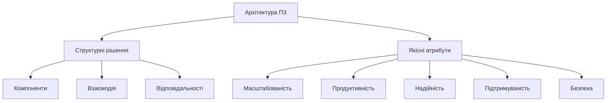
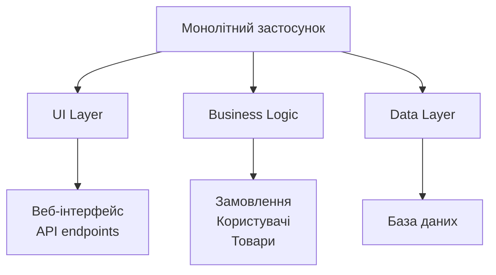
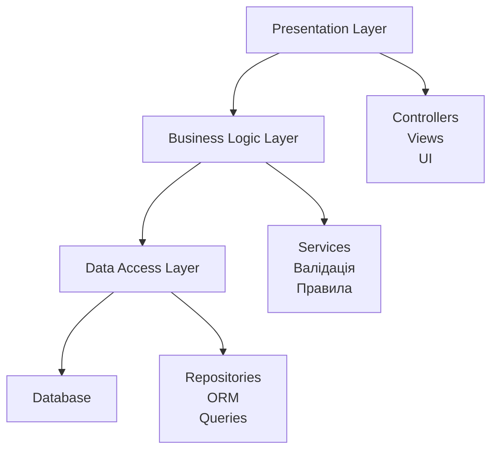
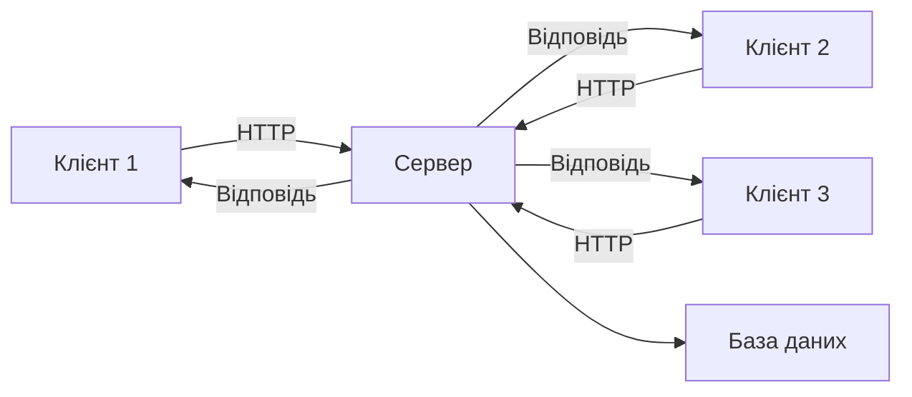
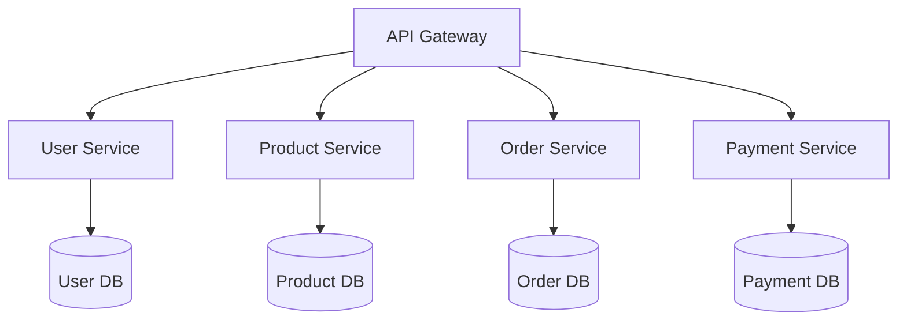
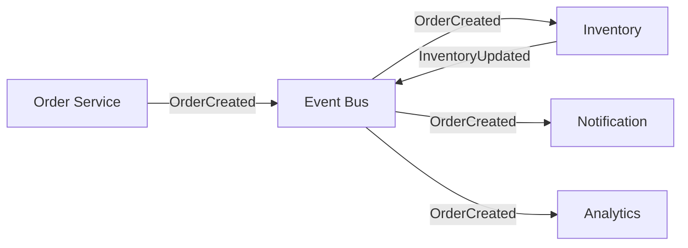
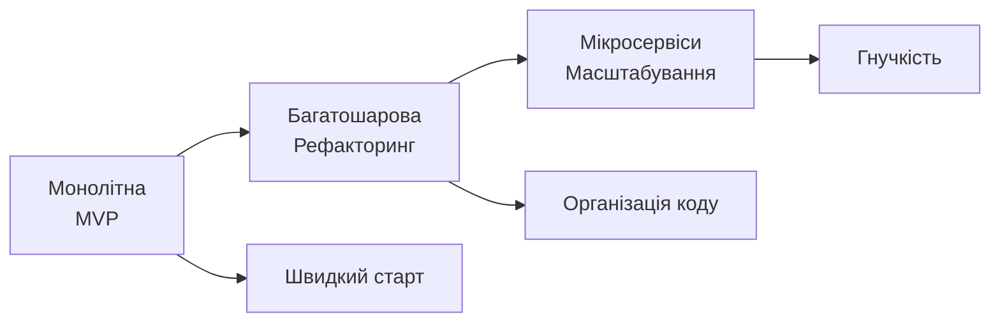

# Типи архітектур програмного забезпечення

## План презентації

1. Основи архітектури ПЗ
2. Монолітна архітектура
3. Багатошарова архітектура
4. Клієнт-серверна архітектура
5. Мікросервісна архітектура
6. Event-Driven архітектура
7. Порівняння та вибір

## 1. Основи архітектури ПЗ

## Що таке архітектура програмного забезпечення?

**Архітектура ПЗ** — це високорівнева структура системи, яка визначає:

- Організацію компонентів
- Взаємодію між модулями
- Розподіл відповідальностей
- Принципи побудови системи

### 🎯 Чому це важливо?

- Визначає **масштабованість** системи
- Впливає на **продуктивність**
- Забезпечує **підтримуваність**
- Гарантує **надійність**

**Неправильна архітектура = технічний борг!**

## Якісні атрибути архітектури



Архітектурні рішення впливають на все життя системи!

## Рівні архітектури

### 📊 Три рівні абстракції:

**Системна архітектура:**

- Розподіл між системами
- Взаємодія підсистем
- Інтеграційні точки

**Архітектура застосунку:**

- Структура програмного продукту
- Організація модулів
- Основні компоненти

**Архітектура компонента:**

- Внутрішня організація
- Деталі реалізації
- Локальні рішення

## 2. Монолітна архітектура

## Характеристики монолітної архітектури

**Весь застосунок = єдина нероздільна одиниця**



### 🔧 Особливості:
- Один виконуваний файл
- Спільна пам'ять
- Виклики методів (не мережа)
- Розгортання всієї системи

## Переваги монолітної архітектури

### ✅ Чому монолітна архітектура хороша:

**Простота розробки:**

- Єдина кодова база
- Один стек технологій
- Проста взаємодія між модулями

**Легкість тестування:**

- Запуск всієї системи локально
- E2E тести в одному процесі
- Просте відтворення помилок

**Швидке розгортання:**

- Один артефакт
- Немає координації сервісів
- Прості інструменти deployment

**Хороша продуктивність:**

- Взаємодія в пам'яті
- Без мережевих накладних витрат
- Прості транзакції

## Недоліки монолітної архітектури

### ❌ Проблеми монолітів:

**Складність підтримки:**

```python
# Монолітний код може рости до 100K+ рядків
# Важко зрозуміти всі зв'язки
# Зміни в одному місці впливають на інше
```

**Обмежена масштабованість:**

- Неможливо масштабувати окремі частини
- Треба копіювати весь застосунок
- Неефективне використання ресурсів

**Технологічна прив'язка:**

- Один стек для всього
- Складно міграти на нові технології
- Неможливо використати різні мови

**Тривалий цикл розгортання:**

- Пересборка всього застосунку
- Конфлікти між розробниками
- Ризикові релізи

## Коли використовувати монолітну архітектуру?

### ✅ Ідеально для:

**Невеликих проєктів:**

- Стартапи та MVP
- Прототипи
- Внутрішні інструменти

**Невеликих команд:**

- 1-5 розробників
- Проста координація
- Спільна кодова база

**Стабільних систем:**

- Рідкі зміни
- Передбачуване навантаження
- Чітка функціональність

**Навчальних проєктів:**

- Фокус на бізнес-логіці
- Без складної інфраструктури

## 3. Багатошарова архітектура

## Концепція шарів

**Організація у горизонтальні логічні шари**



### 🎯 Принципи:
- Кожен шар має свою роль
- Взаємодія тільки із сусідніми шарами
- Односпрямований потік залежностей

## Три основні шари

### 📊 Рівень Представлення (Presentation):
- Взаємодія з користувачем
- UI компоненти
- Controllers та Views
- **Що робить:** показує дані користувачу

### 💼 Рівень Бізнес-логіки (Business Logic):
- Правила обробки
- Валідація даних
- Бізнес-процеси
- **Що робить:** реалізує правила системи

### 💾 Рівень Доступу до Даних (Data Access):
- Робота з БД
- SQL запити
- ORM маппінг
- **Що робить:** зберігає та отримує дані

## Переваги багатошарової архітектури

### ✅ Що отримуємо:

**Чітке розділення відповідальностей:**

- UI відокремлений від бізнес-логіки
- Бізнес-логіка не залежить від БД
- Легко зрозуміти структуру

**Легкість тестування:**

```python
# Можна тестувати кожен шар окремо
def test_business_logic():
    service = UserService(mock_repository)
    # Тестуємо без реальної БД!
```

**Повторне використання:**

- Той самий Business Layer для web та mobile
- Repositories використовуються різними services

**Гнучкість заміни:**

- Змінити БД без зміни бізнес-логіки
- Переробити UI без торкання до сервісів

## Варіації шарів

### 🔢 Кількість шарів:

**3-шарова (найпопулярніша):**

- Presentation
- Business Logic
- Data Access

**4-шарова:**

- Presentation
- Application (координація)
- Domain (бізнес-об'єкти)
- Infrastructure (БД, файли)

**N-шарова:**

- Додаткові шари для безпеки
- Шари для кешування
- Шари для логування

**Правило:** більше шарів = більше складності

## 4. Клієнт-серверна архітектура

## Основи клієнт-сервер моделі

**Розподіл між клієнтами та сервером**



### 🎯 Ролі:

- **Клієнт:** ініціює запити, показує дані
- **Сервер:** обробляє запити, керує даними

## Типи клієнтів

### 🖥️ Тонкий клієнт:

**Мінімум логіки, всі обчислення на сервері**

```
Браузер → HTTP → Сервер
         ← HTML ←
```

**Приклади:**

- Традиційні веб-сайти
- Термінали
- Веб-інтерфейси

**Переваги:** легке оновлення, контроль на сервері
**Недоліки:** потрібне постійне з'єднання

### 💻 Товстий клієнт:

**Багато логіки на клієнті**

```
Desktop App ↔ API ↔ Сервер
(локальна обробка)
```

**Приклади:**

- Desktop додатки
- IDE (IntelliJ, VSCode)
- Ігри

**Переваги:** швидкість, робота offline
**Недоліки:** складне оновлення

## Переваги клієнт-серверної архітектури

### ✅ Основні переваги:

**Централізоване управління:**

- Дані на сервері
- Логіка контролюється централізовано
- Легке оновлення

**Масштабованість:**

- Додавати серверні ресурси
- Load balancing
- Тисячі клієнтів → кілька серверів

**Безпека:**

- Дані під контролем
- Авторизація на сервері
- Немає прямого доступу до БД

**Різноманітність клієнтів:**

- Web, mobile, desktop
- Один сервер для всіх

## 5. Мікросервісна архітектура

## Концепція мікросервісів

**Застосунок = набір невеликих незалежних сервісів**



### 🎯 Характеристики:

- Кожен сервіс — окрема програма
- Власна база даних
- Незалежне розгортання
- Комунікація через API

## Принципи мікросервісів

### 📋 Ключові правила:

**Незалежність:**

- Кожен сервіс може бути розгорнутий окремо
- Власний життєвий цикл
- Незалежні команди

**Слабка зв'язаність:**

- Взаємодія через API
- Немає спільних баз даних
- Асинхронна комунікація

**Бізнес-фокус:**

- Один сервіс = одна бізнес-можливість
- User Service, Order Service, Payment Service
- Відображає domain модель

**Технологічна свобода:**

- Python для ML сервісу
- Java для платежів
- Go для високонавантажених API

## Переваги мікросервісів

### ✅ Що отримуємо:

**Незалежне розгортання:**

```
User Service v2.3 ─┐
Product Service v1.5├─→ Production
Order Service v3.1 ─┘
```

Кожен сервіс випускається окремо!

**Технологічна гнучкість:**

- Найкращі інструменти для кожної задачі
- Легко експериментувати
- Поступова міграція технологій

**Масштабованість:**

```
Order Service x 10 екземплярів (високе навантаження)
User Service x 2 екземпляри (низьке навантаження)
```

**Відмовостійкість:**

- Падіння одного сервісу ≠ падіння всієї системи
- Ізоляція проблем
- Graceful degradation

## Виклики мікросервісів

### ❌ Складнощі:

**Розподілена складність:**

- Десятки/сотні сервісів
- Складне відстеження запитів
- Distributed tracing

**Консистентність даних:**

- Кожен сервіс має свою БД
- Немає глобальних транзакцій
- Eventual consistency

**Мережева комунікація:**

```python
# Кожен виклік може зазнати невдачі!
response = requests.get('http://user-service/users/1')
# Що робити якщо timeout? Retry? Circuit breaker?
```

**Операційна складність:**

- Service discovery
- Load balancing
- Моніторинг багатьох сервісів
- Deployment pipelines

## Коли використовувати мікросервіси?

### ✅ Ідеально для:

**Великих організацій:**

- Множина команд (10+)
- Кожна команда володіє сервісом
- Незалежна розробка

**Різних вимог до масштабування:**

```
Catalog Service: 10000 req/sec
Checkout Service: 100 req/sec
```

Масштабуємо тільки те, що потрібно!

**Довгострокових проєктів:**

- Еволюція системи роками
- Поступова заміна компонентів
- Технологічна гнучкість

### ❌ НЕ використовувати для:

- Стартапів та MVP
- Невеликих команд (<5 людей)
- Простих застосунків

## 6. Event-Driven архітектура

## Концепція подій

**Компоненти взаємодіють через події**



### 🎯 Основна ідея:

- **Подія** = щось важливе сталося
- **Publisher** генерує події
- **Subscribers** реагують на події
- **Event Bus** доставляє повідомлення

## Асинхронна природа

### ⚡ Синхронний виклик:
```python
# Відправник чекає на відповідь
result = payment_service.process_payment(order)
# Блокування!
```

### 🔄 Асинхронна подія:
```python
# Відправник НЕ чекає
event_bus.publish('OrderCreated', order)
# Продовжує роботу одразу!

# Інші сервіси обробляють пізніше
def handle_order_created(order):
    # Обробка у фоні
```

**Переваги:** responsive система, паралельна обробка

## Переваги Event-Driven

### ✅ Що отримуємо:

**Слабка зв'язаність:**

- Publisher не знає про subscribers
- Легко додавати нових обробників
- Незалежна еволюція

**Асинхронна обробка:**

```
Користувач → Швидка відповідь ✓
    ↓
Довга обробка у фоні...
```

**Масштабованість:**

```
OrderCreated Event
    ↓
10 екземплярів обробників
(розподіл навантаження)
```

**Розширюваність:**

- Новий функціонал = новий subscriber
- Не міняємо publisher
- Додаємо можливості без ризику

## Виклики Event-Driven

### ❌ Складнощі:

**Відстеження потоку:**

```
Request → Event1 → Event2 → Event3 → ?
Де помилка? Складно знайти!
```
**Рішення:** distributed tracing (Jaeger, Zipkin)

**Eventual Consistency:**

```
t=0: OrderCreated
t=1: Inventory зменшено
t=2: Email відправлено
t=3: Analytics оновлено

Короткий проміжок неконсистентності!
```

**Обробка помилок:**

- Що робити якщо subscriber упав?
- Dead letter queues
- Retry механізми
- Idempotency

## Коли використовувати події?

### ✅ Підходить для:

**Асинхронних процесів:**

- Обробка замовлень
- Відправка email
- Генерація звітів

**Інтеграції систем:**

- CRM ↔ ERP ↔ Warehouse
- Обмін даними без прямих залежностей

**Real-time систем:**

- Чати
- Live оновлення
- Фінансові платформи

**Аудит та логування:**

- Всі події зберігаються
- Event sourcing
- Повне відтворення стану

## 7. Порівняння та вибір

## Порівняння архітектур

| Критерій | Монолітна | Багатошарова | Мікросервіси | Event-Driven |
|----------|-----------|--------------|--------------|--------------|
| **Складність** | Низька | Середня | Висока | Висока |
| **Масштабованість** | Обмежена | Середня | Відмінна | Відмінна |
| **Розгортання** | Просте | Просте | Складне | Складне |
| **Розмір команди** | Мала | Середня | Велика | Середня-Велика |
| **Підтримка** | Складно при рості | Помірно | Розподілена | Потребує expertise |
| **Час до ринку** | Швидко | Середньо | Повільно | Середньо |

## Критерії вибору архітектури

### 🎯 На що звертати увагу:

**Розмір проєкту:**

- Невеликий → Монолітна
- Середній → Багатошарова
- Великий → Мікросервіси

**Розмір команди:**

- 1-5 людей → Монолітна
- 5-20 людей → Багатошарова
- 20+ людей → Мікросервіси

**Вимоги до масштабування:**

- Передбачуване → Монолітна
- Помірне → Багатошарова/Клієнт-сервер
- Нерівномірне → Мікросервіси

**Терміни:**

- Швидкий MVP → Монолітна
- Стабільний продукт → Багатошарова
- Довгостроковий проєкт → Мікросервіси

## Еволюція архітектури

### 🔄 Типовий шлях розвитку:



**Strangler Fig Pattern:**

1. Залишити монолітне ядро
2. Нові функції як мікросервіси
3. Поступово виносити зі старого
4. Монолітне ядро зменшується

**Не потрібно одразу мікросервіси!**

## Гібридні підходи

### 🔀 Комбінування архітектур:

**Приклад реальної системи:**

```
┌─────────────────────────┐
│   Монолітне ядро        │
│   (основний функціонал) │
└─────────────────────────┘
         │
    ┌────┼────┬────────┐
    │    │    │        │
  Image  ML  Payment  Analytics
Service  API Service  Service
(мікро) (мікро) (мікро) (подієвий)
```

**Переваги:**

- Стабільність ядра
- Гнучкість для нових функцій
- Поступова міграція

## Практичні рекомендації

### 💡 Поради для вибору:

**Для стартапів:**

1. Почніть з монолітної
2. Організуйте код в шари
3. Готуйтеся до виділення модулів
4. Міграйте коли дійсно потрібно

**Для корпорацій:**

1. Оцініть поточний стан
2. Визначте болючі точки
3. Виберіть пілотний сервіс
4. Поступово розширюйте

**Для всіх:**

- Не гонитися за хайпом
- Враховувати контекст
- Міряти та аналізувати
- Бути готовими до змін

## Антипатерни в архітектурі

### 🚫 Чого уникати:

**Premature Optimization:**

```
"Давайте одразу зробимо мікросервіси
на випадок якщо колись..."
❌ Надмірна складність без потреби
```

**Big Bang Rewrite:**

```
"Перепишемо все з нуля на новій архітектурі!"
❌ Ризикований підхід, довгий час без результату
```

**Distributed Monolith:**

```
Мікросервіси які тісно зв'язані між собою
❌ Всі недоліки мікросервісів + монолітна зв'язаність
```

**Architecture by Resume:**

```
"Хочу вивчити Kubernetes, давайте використаємо!"
❌ Вибір технологій не за потребою проєкту
```

## Інструменти та технології

### 🛠️ Що допомагає:

**Для монолітів:**

- Frameworks: Django, Spring Boot, Ruby on Rails
- Deployment: Heroku, простий Docker

**Для мікросервісів:**

- Orchestration: Kubernetes, Docker Swarm
- Service Mesh: Istio, Linkerd
- API Gateway: Kong, AWS API Gateway
- Messaging: RabbitMQ, Kafka

**Для Event-Driven:**

- Message Brokers: Kafka, RabbitMQ, AWS SQS
- Event Streaming: Apache Pulsar
- CQRS/Event Sourcing: Axon, EventStore

**Моніторинг:**

- Logs: ELK Stack, Splunk
- Metrics: Prometheus, Grafana
- Tracing: Jaeger, Zipkin

## Висновки

### 🎓 Ключові думки:

**Не існує ідеальної архітектури!**

Кожна має переваги та недоліки:

- **Монолітна** — простота для старту
- **Багатошарова** — організація коду
- **Клієнт-сервер** — розподіл обов'язків
- **Мікросервіси** — масштабованість та гнучкість
- **Event-Driven** — асинхронність та слабка зв'язаність

### 💡 Вибирайте за:
- Вимогами проєкту
- Розміром команди
- Терміном розробки
- Довгостроковими цілями

## Практичні поради

### 📝 Як приймати рішення:

**1. Оцініть поточний стан:**

- Які вимоги?
- Який розмір команди?
- Які ресурси?

**2. Починайте просто:**

- MVP з монолітної
- Додавайте складність поступово
- Не перепроєктовуйте

**3. Міряйте та аналізуйте:**

- Метрики продуктивності
- Час розробки
- Складність підтримки

**4. Будьте готові еволюціонувати:**

- Архітектура не вічна
- Рефакторинг — норма
- Технології змінюються

**Архітектура — це компроміси**

Немає правильної або неправильної,
є доречна чи недоречна для вашого проєкту!
