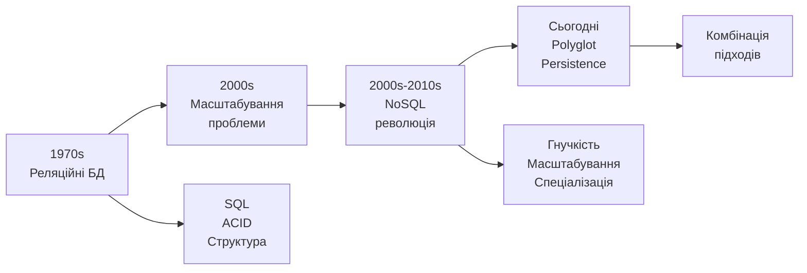
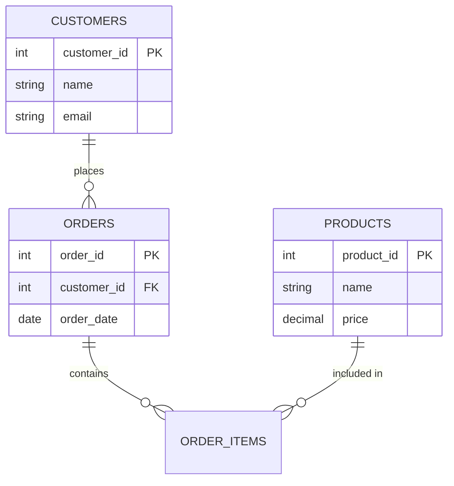
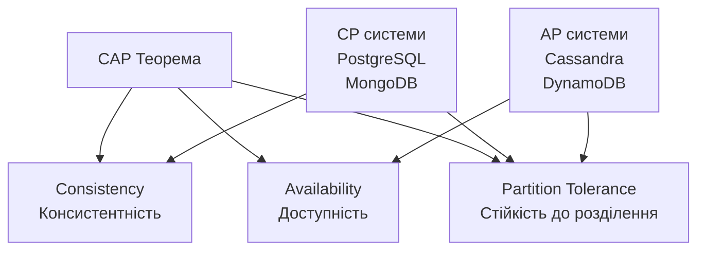
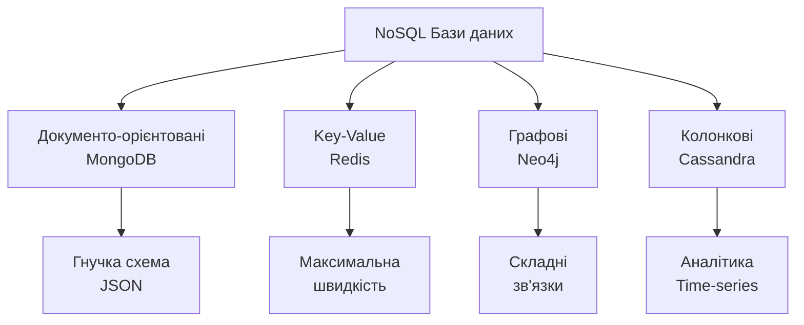
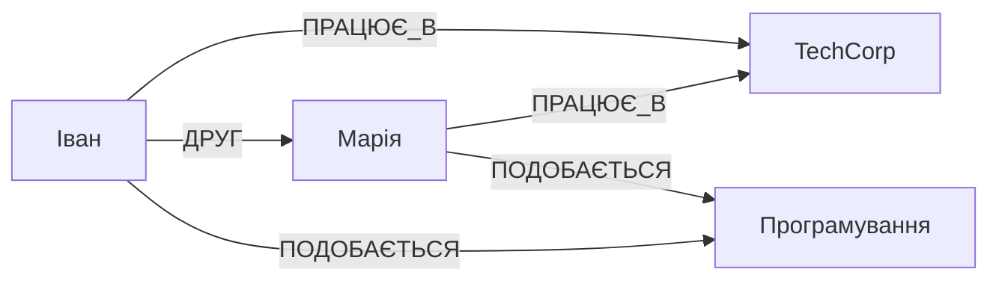
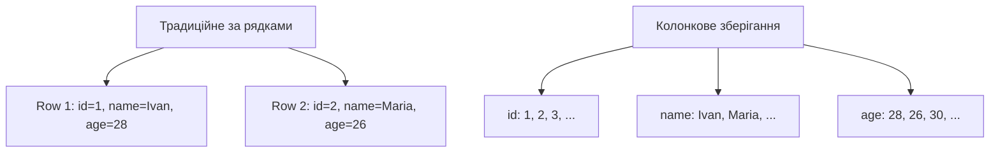
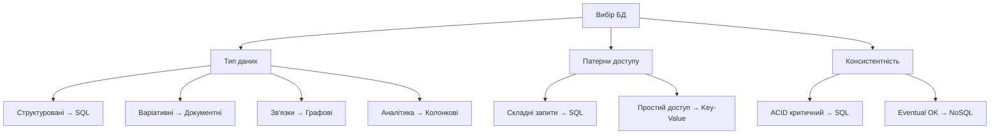
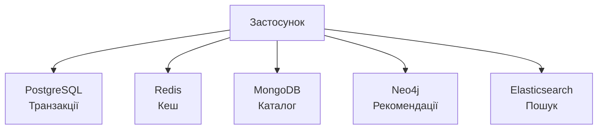
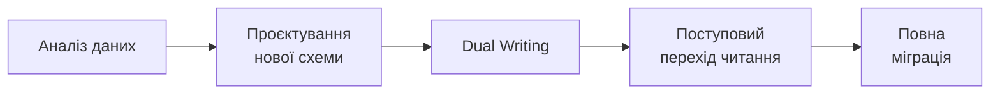

# Робота з базами даних: реляційні та NoSQL

## План лекції

1. Огляд баз даних та їх роль
2. Реляційні бази даних
3. SQL: мова запитів
4. NoSQL: альтернативний підхід
5. Типи NoSQL баз
6. Порівняння та вибір
7. Практичні аспекти

## 1. Огляд баз даних

## Навіщо потрібні бази даних?

### 💾 Кожен застосунок потребує:

- **Зберігання даних** - надійне та довготривале
- **Організація інформації** - структуроване зберігання
- **Швидкий доступ** - ефективний пошук та вибірка
- **Цілісність даних** - запобігання втратам та пошкодженню
- **Паралельний доступ** - багато користувачів одночасно

### 🎯 Типи застосунків:

- Вебсайти та мобільні додатки
- Корпоративні системи (ERP, CRM)
- Аналітичні платформи
- IoT та real-time системи

## Еволюція баз даних



## 2. Реляційні бази даних

## Реляційна модель даних

### 📊 Організація у вигляді таблиць:



**Таблиця** = набір рядків з однаковою структурою

**Рядок** = окремий запис (екземпляр сутності)

**Стовпець** = атрибут сутності

## Ключові концепції

### 🔑 Первинний ключ (Primary Key):

- Унікально ідентифікує кожен рядок
- Не може бути NULL
- Незмінний протягом життя запису

### 🔗 Зовнішній ключ (Foreign Key):

- Посилається на первинний ключ іншої таблиці
- Створює зв'язки між таблицями
- Забезпечує цілісність даних

### 🔄 Типи зв'язків:

- **Один-до-багатьох** - найпоширеніший
- **Багато-до-багатьох** - через проміжну таблицю
- **Один-до-одного** - рідше використовується

## ACID властивості

### 💎 Гарантії надійності транзакцій:

**A - Atomicity (Атомарність)**
- Все або нічого
- Приклад: переказ грошей

**C - Consistency (Консистентність)**
- З валідного стану в валідний
- Всі обмеження виконуються

**I - Isolation (Ізольованість)**
- Транзакції не впливають одна на одну
- Паралельність без конфліктів

**D - Durability (Довговічність)**
- Зміни збережені назавжди
- Навіть після збою системи

## Популярні реляційні СУБД

### 🐘 PostgreSQL

**Сильні сторони:**
- Потужна та надійна
- Підтримка JSON, масивів, геоданих
- Розширюваність
- Відмінна для складних запитів

**Використання:** корпоративні системи, аналітика

### 🐬 MySQL

**Сильні сторони:**
- Найпопулярніша open-source
- Проста у використанні
- Швидка для простих запитів
- LAMP/LEMP стек

**Використання:** вебзастосунки, CMS

## SQLite

### 📱 Вбудована база даних:

```python
import sqlite3

# Створення/підключення
conn = sqlite3.connect('myapp.db')
cursor = conn.cursor()

# Виконання запиту
cursor.execute('''
    CREATE TABLE users (
        id INTEGER PRIMARY KEY,
        name TEXT,
        email TEXT UNIQUE
    )
''')
```

**Особливості:**
- Один файл = вся база
- Без серверного процесу
- Ідеальна для мобільних додатків

## 3. SQL: мова запитів

## SELECT - вибірка даних

```sql
SELECT
    product_id,
    product_name,
    price,
    stock_quantity
FROM products
WHERE category = 'Electronics'
    AND price > 1000
ORDER BY price DESC
LIMIT 10;
```

### 🔍 Основні компоненти:

- **SELECT** - які стовпці
- **FROM** - з якої таблиці
- **WHERE** - умови фільтрації
- **ORDER BY** - сортування
- **LIMIT** - обмеження результатів

## JOIN - об'єднання таблиць

```sql
SELECT
    c.name as customer_name,
    o.order_date,
    o.total_amount
FROM customers c
INNER JOIN orders o
    ON c.customer_id = o.customer_id
WHERE o.order_date >= '2024-01-01'
ORDER BY o.order_date DESC;
```

### 🔗 Типи JOIN:

**INNER JOIN** - тільки збіги в обох таблицях

**LEFT JOIN** - всі записи зліва + збіги справа

**RIGHT JOIN** - всі записи справа + збіги зліва

## Агрегатні функції

```sql
SELECT
    category,
    COUNT(*) as product_count,
    AVG(price) as average_price,
    MIN(price) as min_price,
    MAX(price) as max_price,
    SUM(stock_quantity) as total_stock
FROM products
GROUP BY category
HAVING AVG(price) > 500
ORDER BY average_price DESC;
```

### 📊 Функції:

**COUNT** - кількість | **AVG** - середнє | **SUM** - сума | **MIN/MAX** - екстремуми

**GROUP BY** - групування | **HAVING** - фільтр груп

## Транзакції

```sql
START TRANSACTION;

-- Списання з рахунку
UPDATE accounts
SET balance = balance - 1000
WHERE account_id = 1;

-- Зарахування на рахунок
UPDATE accounts
SET balance = balance + 1000
WHERE account_id = 2;

-- Запис транзакції
INSERT INTO transactions (from_account, to_account, amount)
VALUES (1, 2, 1000);

COMMIT;
-- або ROLLBACK при помилці
```

### 💎 ACID в дії!

## 4. NoSQL: альтернативний підхід

## Чому виникли NoSQL?

### 📈 Виклики реляційних БД:

**Масштабування**
- Петабайти даних
- Горизонтальне масштабування складне
- Вертикальне досягло меж

**Гнучкість**
- Зміни схеми = складні міграції
- Різні атрибути для різних записів
- Швидка розробка

**Географія**
- Глобальні сервіси
- Низька латентність скрізь
- Складна реплікація з ACID

## NoSQL = Not Only SQL

### 🎯 Характеристики:

- Горизонтальне масштабування
- Гнучка або відсутня схема
- Eventual consistency (часто)
- Спеціалізація під use cases
- Спрощений інтерфейс

### ⚖️ Це не заміна!

Реляційні БД оптимальні для багатьох задач

NoSQL вирішує специфічні проблеми

## CAP теорема



### ⚠️ Можна обрати лише 2 з 3!

## CAP: що обирати?

**Consistency (C)** - всі бачать однакові дані одночасно

**Availability (A)** - кожен запит отримує відповідь

**Partition Tolerance (P)** - робота при мережевих розривах

### 🎯 На практиці:

**P неминуче** в розподілених системах

Вибір між **CP** та **AP**

**CP:** фінанси, критичні дані

**AP:** соціальні мережі, аналітика

## BASE vs ACID

### 🆚 Альтернативний підхід:

**BA - Basically Available**
- Система доступна більшість часу
- Можливі часткові збої

**S - Soft State**
- Стан може змінюватися без запитів
- Активна синхронізація

**E - Eventually Consistent**
- Врешті-решт всі вузли синхронізуються
- Тимчасові розбіжності OK

### 💡 Компроміс:

Жертвуємо сильною консистентністю заради доступності та продуктивності

## 5. Типи NoSQL баз

## Чотири основні типи



## Документо-орієнтовані БД

### 📄 MongoDB - найпопулярніша:

```json
{
  "_id": "507f1f77bcf86cd799439011",
  "name": "Ноутбук Dell XPS 15",
  "category": "Electronics",
  "price": 45999,
  "specifications": {
    "processor": "Intel Core i7",
    "ram": "16GB",
    "storage": "512GB SSD"
  },
  "reviews": [
    {"user": "user123", "rating": 5}
  ],
  "tags": ["laptop", "premium"],
  "in_stock": true
}
```

**Кожен документ самодостатній!**

## MongoDB: запити

```javascript
// Пошук
db.products.find({
  category: "Electronics",
  price: { $gt: 20000 }
}).sort({ price: -1 }).limit(10)

// Оновлення
db.products.updateOne(
  { _id: ObjectId("...") },
  {
    $set: { price: 42999 },
    $push: { tags: "sale" }
  }
)

// Агрегація
db.products.aggregate([
  { $unwind: "$reviews" },
  { $group: {
    _id: "$_id",
    avgRating: { $avg: "$reviews.rating" }
  }}
])
```

## MongoDB: коли використовувати?

### ✅ Ідеальна для:

**Каталоги товарів**
- Варіативні атрибути
- Електроніка ≠ Одяг ≠ Книги

**CMS системи**
- Різні типи контенту
- Статті, відео, зображення

**Профілі користувачів**
- Різна повнота інформації
- Легке додавання полів

**Real-time аналітика**
- Структуровані події
- Швидкий запис

## Key-Value сховища

### 🗝️ Найпростіша модель:

```
Key           →    Value
"user:1000"   →    {"name": "Іван", "email": "ivan@..."}
"session:abc" →    {"user_id": 1000, "expires": "..."}
"cache:query" →    [результати запиту]
```

### ⚡ Операції:

**SET** - встановити | **GET** - отримати | **DELETE** - видалити

**Мікросекундна латентність!**

## Redis - структура даних сервер

```python
import redis
r = redis.Redis()

# Рядки з експірацією
r.setex('session:abc', 3600, 'data')

# Списки (черги)
r.lpush('queue:tasks', 'task1')
task = r.rpop('queue:tasks')

# Хеші
r.hset('user:1000', mapping={
    'name': 'Іван',
    'points': 150
})
r.hincrby('user:1000', 'points', 10)

# Leaderboards
r.zadd('leaderboard', {'player1': 1500})
r.zrevrange('leaderboard', 0, 9)
```

## Redis: use cases

### 🚀 Типові застосування:

**Кешування**
- Результати запитів
- Сесії користувачів
- Автоматична експірація

**Черги повідомлень**
- Асинхронна обробка
- Background jobs

**Real-time аналітика**
- Лічильники
- Leaderboards

**Pub/Sub**
- Real-time повідомлення
- Чати, нотифікації

### ⚡ Чому швидкий?

Всі дані в RAM!

## Графові бази даних

### 🌐 Neo4j - модель графа:



**Вершини** - сутності (люди, компанії)

**Ребра** - зв'язки (дружба, робота)

**Властивості** - атрибути

## Cypher: мова запитів Neo4j

```cypher
// Створення
CREATE (ivan:Person {name: 'Іван', age: 28})
CREATE (maria:Person {name: 'Марія', age: 26})
CREATE (ivan)-[:FRIEND_OF {since: '2020'}]->(maria)

// Пошук друзів друзів (FOAF)
MATCH (me:Person {name: 'Іван'})-[:FRIEND_OF]-(friend)-[:FRIEND_OF]-(foaf)
WHERE NOT (me)-[:FRIEND_OF]-(foaf)
RETURN DISTINCT foaf.name

// Рекомендації: спільні інтереси
MATCH (me:Person {name: 'Іван'})-[:HAS_SKILL]->(skill)<-[:HAS_SKILL]-(other)
WHERE NOT (me)-[:FRIEND_OF]-(other)
RETURN other.name, COUNT(skill) as common
ORDER BY common DESC
```

## Графові БД: коли використовувати?

### ✅ Ідеальна для:

**Соціальні мережі**
- Друзі друзів
- Люди, яких ви можете знати
- Найкоротший шлях

**Рекомендаційні системи**
- Collaborative filtering
- Схожі користувачі/товари

**Fraud detection**
- Підозрілі патерни транзакцій
- Кільця платежів

**Knowledge graphs**
- Взаємозв'язки концепцій
- Семантичні запити

## Колонкові бази даних

### 📊 Зберігання по стовпцях:



### 💡 Переваги:

**Компресія** - однотипні дані стискаються краще

**Агрегації** - читаємо лише потрібні стовпці

**Аналітика** - швидкі SUM, AVG, COUNT

## Cassandra

### 📈 Високомасштабована NoSQL:

```cql
-- Keyspace
CREATE KEYSPACE ecommerce
WITH replication = {
  'class': 'NetworkTopologyStrategy',
  'datacenter1': 3
};

-- Таблиця
CREATE TABLE orders (
  user_id UUID,
  order_date TIMESTAMP,
  order_id UUID,
  total_amount DECIMAL,
  PRIMARY KEY (user_id, order_date, order_id)
) WITH CLUSTERING ORDER BY (order_date DESC);
```

**Без master вузлів** - всі рівноправні

**Лінійне масштабування**

**Tunable consistency**

## Cassandra: коли використовувати?

### ✅ Ідеальна для:

**IoT дані**
- Мільйони пристроїв
- Регулярні вимірювання

**Time-series data**
- Логи, метрики
- Історичні дані

**Write-heavy workloads**
- Великий throughput запису
- Розподілене зберігання

**Географічно розподілені системи**
- Дата-центри в різних регіонах
- Висока доступність

## 6. Порівняння та вибір

## Порівняльна таблиця

| Характеристика | SQL | Документні | Key-Value | Графові | Колонкові |
|----------------|-----|------------|-----------|---------|-----------|
| **Схема** | Фіксована | Гнучка | Немає | Гнучка | Фіксована |
| **Масштабування** | Вертикальне | Горизонтальне | Горизонтальне | Вертикальне | Горизонтальне |
| **Консистентність** | ACID | Eventual/ACID | Eventual | ACID | Eventual |
| **Складні запити** | ⭐⭐⭐ | ⭐⭐ | ⭐ | ⭐⭐⭐ | ⭐⭐ |
| **Продуктивність** | Висока | Дуже висока | Максимальна | Висока | Висока |

## Як обрати тип БД?



## Use Cases: SQL

### ✅ Використовуйте SQL коли:

**Транзакції критичні**
- Фінансові системи
- E-commerce замовлення
- Банківські операції

**Структуровані дані**
- Чітка схема
- Складні зв'язки
- JOIN часто потрібні

**ACID обов'язковий**
- Консистентність критична
- Жодних компромісів

**Складна аналітика**
- Багато JOIN
- Складні агрегації

## Use Cases: NoSQL

### ✅ Використовуйте NoSQL коли:

**Величезні обсяги**
- Петабайти даних
- Горизонтальне масштабування

**Гнучка схема**
- Часті зміни структури
- Різні атрибути для записів

**Спеціалізовані патерни**
- Графи зв'язків
- Time-series data
- Real-time обробка

**Eventual consistency OK**
- Соціальні мережі
- Аналітика
- Логування

## Polyglot Persistence

### 🎯 Сучасний підхід - використання кількох БД:



### ⚖️ Баланс:

**Переваги:** сильні сторони кожної технології

**Недоліки:** складність архітектури та підтримки

## Приклад Polyglot

### 🛒 Інтернет-магазин:

**PostgreSQL**
- Замовлення та платежі
- Користувацькі акаунти
- Фінансові транзакції

**Redis**
- Кеш сторінок
- Сесії користувачів
- Лічильники в реальному часі

**MongoDB**
- Каталог товарів
- Відгуки користувачів
- Блог та контент

**Neo4j**
- Рекомендації товарів
- "Люди також купували"

**Elasticsearch**
- Пошук по каталогу

## 7. Практичні аспекти

## Індексація

### 🚀 Критична для продуктивності:

```sql
-- SQL
CREATE INDEX idx_products_category
ON products(category);

-- Складений індекс
CREATE INDEX idx_orders_customer_date
ON orders(customer_id, order_date);
```

```javascript
// MongoDB
db.products.createIndex({ category: 1 })
db.products.createIndex({ category: 1, price: -1 })
```

### ⚖️ Компроміс:

**Плюси:** швидший пошук

**Мінуси:** повільніший запис, більше місця

## Оптимізація запитів

### 📊 Аналіз виконання:

```sql
-- SQL
EXPLAIN ANALYZE
SELECT c.name, COUNT(o.order_id)
FROM customers c
LEFT JOIN orders o ON c.customer_id = o.customer_id
GROUP BY c.customer_id;
```

```javascript
// MongoDB
db.products.find({ category: "Electronics" })
  .explain("executionStats")
```

### 🎯 На що дивитися:

- Sequential Scan → потрібен індекс
- Використання індексів
- Кількість оброблених рядків

## Безпека: SQL ін'єкції

### ❌ НІКОЛИ так не робіть:

```python
# Небезпечно!
email = request.get('email')
query = f"SELECT * FROM users WHERE email = '{email}'"
```

### ✅ ЗАВЖДИ параметризовані запити:

```python
# Безпечно
email = request.get('email')
query = "SELECT * FROM users WHERE email = %s"
cursor.execute(query, (email,))
```

### 🛡️ Додаткові заходи:

- Мінімальні привілеї для БД користувачів
- Валідація вхідних даних
- Використання ORM

## Резервне копіювання

### 💾 Стратегії:

**Повне копіювання**
- Вся база даних
- Просте відновлення
- Займає багато місця

**Інкрементне**
- Тільки зміни
- Економія простору
- Складніше відновлення

```bash
# PostgreSQL
pg_dump mydb > backup.sql

# MongoDB
mongodump --db mydb --out /backup/

# Redis
redis-cli BGSAVE
```

### ⚠️ Критично: **тестуйте відновлення!**

## Міграція даних

### 🔄 З SQL на NoSQL:



### 📋 Етапи:

1. Аналіз патернів доступу
2. Проєктування нової схеми
3. Розробка скриптів міграції
4. Тестування на підмножині
5. Dual writing (обидві БД)
6. Поступове переключення
7. Відключення старої БД

## Синхронізація в Polyglot

### 🔄 Event-Driven підхід:

```python
def create_order(order_data):
    # Запис в PostgreSQL
    order_id = postgres.create_order(order_data)

    # Публікація події
    event_bus.publish('order.created', {
        'order_id': order_id,
        'customer_id': order_data['customer_id']
    })

    # Інші сервіси слухають події:
    # - MongoDB оновлює профіль
    # - Redis інвалідує кеш
    # - Elasticsearch індексує
```

### 💡 Event Sourcing забезпечує консистентність

## Моніторинг та метрики

### 📊 Що відстежувати:

**Продуктивність**
- Response time (латентність)
- Throughput (запитів/сек)
- Query execution time

**Ресурси**
- CPU та RAM використання
- Disk I/O
- Network bandwidth

**Надійність**
- Error rate
- Connection pool usage
- Replication lag

### 🔍 Інструменти:

Prometheus, Grafana, DataDog, New Relic

## Найкращі практики

### ✅ Завжди робіть:

**Проєктування**
- Аналізуйте патерни доступу перед вибором БД
- Плануйте масштабування заздалегідь
- Документуйте схему даних

**Безпека**
- Параметризовані запити
- Мінімальні привілеї
- Регулярні backup

**Моніторинг**
- Відстежуйте метрики
- Налаштуйте алерти
- Плануйте capacity

**Оптимізація**
- Створюйте індекси розумно
- Аналізуйте повільні запити
- Кешуйте часті запити

## Коли НЕ потрібен NoSQL

### ⚠️ Уникайте NoSQL якщо:

**Невеликі проєкти**
- < 100GB даних
- < 1000 запитів/сек
- SQL цілком справляється

**ACID критичний**
- Фінансові транзакції
- Медичні записи
- Юридичні документи

**Команда не готова**
- Відсутній досвід
- Немає часу на навчання
- Складність не виправдана

### 💡 Правило:

Починайте з SQL, переходьте на NoSQL коли є чіткі причини

## Висновки

### 🎯 Ключові моменти:

1. **Не існує універсального рішення** - кожен тип БД для своїх задач
2. **SQL залишається актуальним** - для структурованих даних та транзакцій
3. **NoSQL вирішує специфічні проблеми** - масштабування, гнучкість, спеціалізація
4. **CAP теорема** - фундаментальні обмеження розподілених систем
5. **4 типи NoSQL** - документні, key-value, графові, колонкові
6. **Polyglot Persistence** - комбінація різних БД стає нормою
7. **Правильний вибір** залежить від даних, патернів доступу та вимог

## Практичні рекомендації

### 💡 Поради для студентів:

**Вивчайте SQL першим**
- Фундаментальні концепції
- Застосовні до всіх БД
- Найширше використання

**Експериментуйте з NoSQL**
- Спробуйте MongoDB для pet-проєктів
- Redis для кешування
- Зрозумійте відмінності на практиці

**Розумійте trade-offs**
- Кожен вибір має компроміси
- Консистентність vs Доступність
- Простота vs Продуктивність

**Стежте за трендами**
- Технології еволюціонують
- Нові гібридні рішення
- Best practices змінюються

## Ресурси для поглибленого вивчення

### 📚 Документація та навчання:

**SQL:**
- PostgreSQL Tutorial
- MySQL Documentation
- SQL Zoo (інтерактивне навчання)

**NoSQL:**
- MongoDB University (безкоштовні курси)
- Redis University
- Neo4j GraphAcademy

**Книги:**
- "Designing Data-Intensive Applications" - Martin Kleppmann
- "Seven Databases in Seven Weeks"

### 🎯 Практика:

Створюйте реальні проєкти з різними типами БД!

## Підсумок

### 🔑 Головна думка:

**Успішний інженер розуміє:**

✅ Сильні та слабкі сторони кожного типу БД

✅ Коли використовувати SQL, а коли NoSQL

✅ Як поєднувати різні технології

✅ Важливість ACID для деяких систем

✅ Переваги eventual consistency для інших

### 💡 Пам'ятайте:

**Інструмент має відповідати задачі, а не навпаки!**
