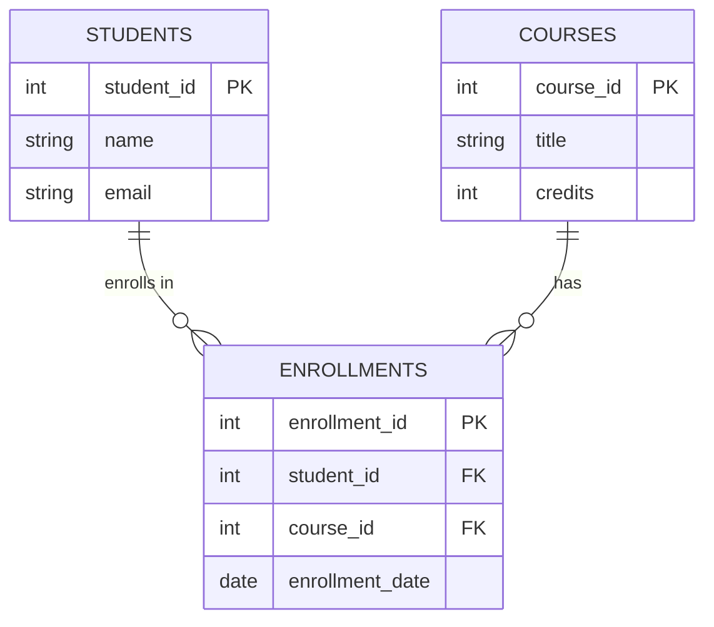
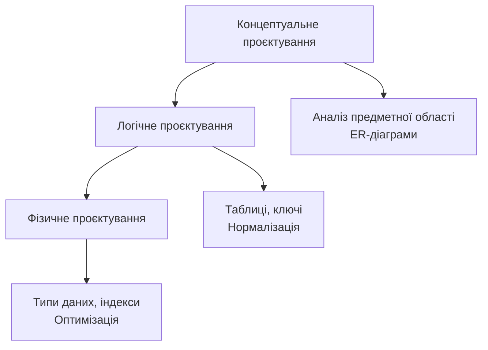
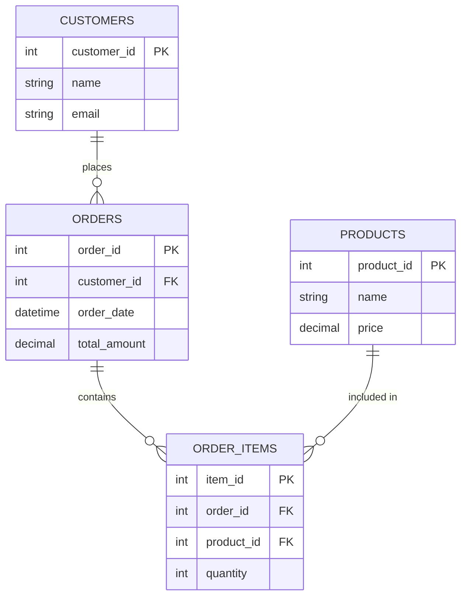
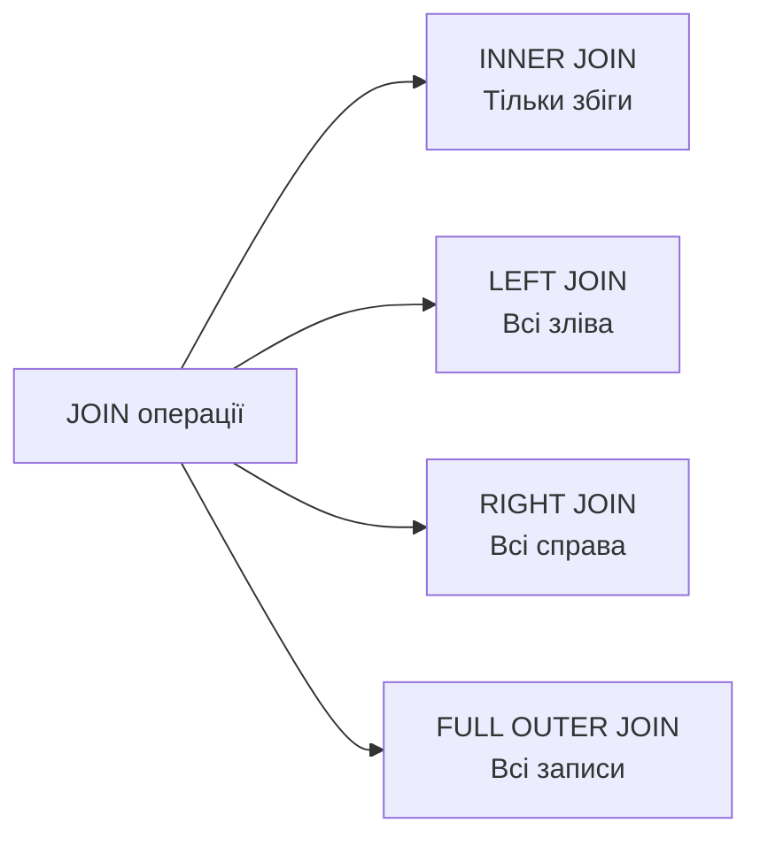
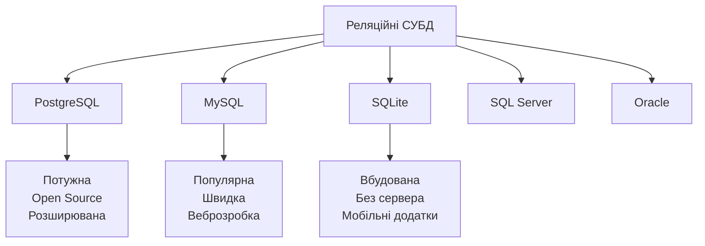

# Реляційні бази даних: основи проєктування та SQL

## План лекції

1. Реляційна модель даних
2. Проєктування баз даних
3. Мова SQL: основи
4. JOIN операції та складні запити
5. Системи управління базами даних
6. Практичні аспекти та безпека

## 1. Реляційна модель даних

## Що таке реляційна база даних?

**Реляційна модель** (Едгар Кодд, 1970) - дані організовані у вигляді таблиць з чіткими зв'язками між ними

### 🔑 Ключові концепції:

- **Таблиця (відношення)** - представляє сутність
- **Рядок (кортеж)** - окремий екземпляр сутності
- **Стовпець (атрибут)** - властивість сутності
- **Первинний ключ** - унікальний ідентифікатор запису
- **Зовнішній ключ** - посилання на іншу таблицю

## Типи зв'язків між таблицями



**Один-до-багатьох** - найпоширеніший тип зв'язку

**Багато-до-багатьох** - через проміжну таблицю

**Один-до-одного** - рідше використовується

## ACID властивості

### 💎 Гарантії надійності транзакцій:

**Atomicity (Атомарність)**
- Транзакція виконується повністю або не виконується взагалі
- Приклад: переказ грошей - або обидві операції успішні, або жодна

**Consistency (Консистентність)**
- База даних переходить з одного валідного стану в інший
- Всі обмеження цілісності виконуються

**Isolation (Ізольованість)**
- Паралельні транзакції не впливають одна на одну
- Результат як при послідовному виконанні

**Durability (Довговічність)**
- Після завершення транзакції зміни збережені назавжди
- Навіть у разі збою системи

## 2. Проєктування баз даних

## Етапи проєктування



### 🎯 Три рівні проєктування:

**Концептуальний** - що зберігати (незалежно від СУБД)

**Логічний** - як організувати (реляційна модель)

**Фізичний** - як реалізувати (конкретна СУБД)

## Нормалізація даних

### 📋 Процес усунення надмірності:

**1НФ (Перша нормальна форма)**
- Кожне поле містить атомарні значення
- Немає повторюваних груп

**2НФ (Друга нормальна форма)**
- Виконується 1НФ
- Усі неключові атрибути залежать від всього первинного ключа

**3НФ (Третя нормальна форма)**
- Виконується 2НФ
- Немає транзитивних залежностей
- Кожен факт зберігається один раз

### ⚖️ Баланс:
Іноді доцільна **денормалізація** для продуктивності

## Приклад нормалізації



## 3. Мова SQL: основи

## SELECT - вибірка даних

```sql
SELECT
    product_id,
    product_name,
    price,
    stock_quantity
FROM products
WHERE category = 'Electronics'
    AND price > 100
ORDER BY price DESC
LIMIT 10;
```

### 🔍 Основні елементи:

- **SELECT** - які стовпці отримати
- **FROM** - з якої таблиці
- **WHERE** - умови фільтрації
- **ORDER BY** - сортування результатів
- **LIMIT** - обмеження кількості

## Оператори та функції

### 📊 Агрегатні функції:

```sql
SELECT
    category,
    COUNT(*) as product_count,
    AVG(price) as average_price,
    MIN(price) as min_price,
    MAX(price) as max_price,
    SUM(stock_quantity) as total_stock
FROM products
GROUP BY category
HAVING AVG(price) > 50
ORDER BY average_price DESC;
```

**COUNT** - кількість записів

**AVG** - середнє значення

**SUM** - сума значень

**MIN / MAX** - мінімум / максимум

## Модифікація даних

### ➕ INSERT - додавання:

```sql
INSERT INTO customers (name, email, phone)
VALUES
    ('Іван Петренко', 'ivan@example.com', '+380501234567'),
    ('Марія Коваль', 'maria@example.com', '+380672345678');
```

### ✏️ UPDATE - оновлення:

```sql
UPDATE products
SET
    price = price * 1.1,
    last_updated = CURRENT_TIMESTAMP
WHERE category = 'Electronics';
```

### ❌ DELETE - видалення:

```sql
DELETE FROM orders
WHERE order_date < '2023-01-01'
    AND status = 'cancelled';
```

## 4. JOIN операції

## Типи JOIN



### 🔗 Найпоширеніший - INNER JOIN:

```sql
SELECT
    orders.order_id,
    customers.name,
    orders.order_date,
    orders.total_amount
FROM orders
INNER JOIN customers
    ON orders.customer_id = customers.customer_id
WHERE orders.order_date >= '2024-01-01'
ORDER BY orders.order_date DESC;
```

## LEFT JOIN приклад

```sql
-- Клієнти та їхні замовлення (включаючи тих, хто нічого не замовив)
SELECT
    c.customer_id,
    c.name,
    COUNT(o.order_id) as order_count,
    COALESCE(SUM(o.total_amount), 0) as total_spent
FROM customers c
LEFT JOIN orders o ON c.customer_id = o.customer_id
GROUP BY c.customer_id, c.name
ORDER BY total_spent DESC;
```

### 💡 Результат:
Всі клієнти, навіть якщо у них немає замовлень

NULL для клієнтів без замовлень

## Складні запити з підзапитами

```sql
-- Товари дорожчі за середню ціну
SELECT
    product_name,
    price,
    category
FROM products
WHERE price > (
    SELECT AVG(price)
    FROM products
)
ORDER BY price DESC;
```

### 🎯 Підзапити можуть бути:

- В WHERE для порівняння
- В SELECT для обчислень
- В FROM як віртуальна таблиця

## 5. Системи управління БД

## Популярні СУБД



## PostgreSQL

### ✅ Переваги:

- 🔧 Потужна та надійна open-source СУБД
- 📊 Підтримка JSON, масивів, геопросторових даних
- 🔌 Розширюваність через extensions
- 📈 Відмінна продуктивність для складних запитів
- 🛡️ Сильна система типів та обмежень

### 🎯 Використання:

- Корпоративні застосунки
- Складні аналітичні системи
- Геоінформаційні системи (PostGIS)

## MySQL

### ✅ Переваги:

- ⚡ Швидкість для простих запитів
- 👥 Найбільша спільнота
- 🌐 Стандарт для веброзробки (LAMP/LEMP)
- 🔄 Різні механізми зберігання (InnoDB, MyISAM)

### 🎯 Використання:

- Вебзастосунки
- CMS системи (WordPress, Drupal)
- Невеликі та середні проєкти

### ⚖️ Порівняно з PostgreSQL:

Простіше в налаштуванні, але менше можливостей

## SQLite

### ✅ Особливості:

- 📱 Вбудована база даних (один файл)
- 🚫 Без серверного процесу
- ⚡ Швидка для локального доступу
- 💾 Мінімальні вимоги до ресурсів

### 🎯 Ідеальна для:

```python
import sqlite3

# Створення/підключення до бази
conn = sqlite3.connect('myapp.db')
cursor = conn.cursor()

# Виконання запиту
cursor.execute('''
    CREATE TABLE IF NOT EXISTS users (
        id INTEGER PRIMARY KEY,
        name TEXT,
        email TEXT UNIQUE
    )
''')
```

- Мобільні додатки (iOS, Android)
- Настільні програми
- Прототипування та тестування

## 6. Практичні аспекти

## Індексація

### 🚀 Індекси прискорюють пошук:

```sql
-- Створення індексу
CREATE INDEX idx_products_category
ON products(category);

-- Складений індекс
CREATE INDEX idx_orders_customer_date
ON orders(customer_id, order_date);

-- Унікальний індекс
CREATE UNIQUE INDEX idx_users_email
ON users(email);
```

### ⚖️ Компроміс:

**Плюси:** Швидший пошук та сортування

**Мінуси:** Повільніший INSERT/UPDATE, більше місця

## Транзакції в SQL

```sql
START TRANSACTION;

-- Списання з рахунку
UPDATE accounts
SET balance = balance - 1000
WHERE account_id = 1;

-- Зарахування на рахунок
UPDATE accounts
SET balance = balance + 1000
WHERE account_id = 2;

-- Запис транзакції
INSERT INTO transactions (from_account, to_account, amount)
VALUES (1, 2, 1000);

COMMIT;
-- або ROLLBACK при помилці
```

### 💎 Гарантії ACID!

## Безпека: SQL ін'єкції

### ❌ НІКОЛИ так не робіть:

```python
# Небезпечний код - вразливий до SQL ін'єкції!
email = request.get('email')
query = f"SELECT * FROM users WHERE email = '{email}'"
cursor.execute(query)
```

### ✅ ЗАВЖДИ використовуйте параметризовані запити:

```python
# Безпечний код
email = request.get('email')
query = "SELECT * FROM users WHERE email = %s"
cursor.execute(query, (email,))
```

### 🛡️ Додаткові заходи:

- Мінімальні привілеї для користувачів БД
- Валідація вхідних даних
- Використання ORM фреймворків

## Оптимізація запитів

### 📊 EXPLAIN - аналіз виконання:

```sql
EXPLAIN ANALYZE
SELECT
    c.name,
    COUNT(o.order_id) as order_count
FROM customers c
LEFT JOIN orders o ON c.customer_id = o.customer_id
WHERE c.registration_date >= '2024-01-01'
GROUP BY c.customer_id, c.name;
```

### 🎯 На що звертати увагу:

- Sequential Scan → потрібен індекс
- Використання індексів
- Кількість оброблених рядків
- Час виконання

## Резервне копіювання

### 💾 Стратегії backup:

**Повне копіювання**
- Вся база даних
- Найпростіше відновлення
- Займає багато місця

**Інкрементне копіювання**
- Тільки зміни
- Економія простору
- Складніше відновлення

### ⚠️ Критично важливо:

```bash
# PostgreSQL backup
pg_dump mydb > backup.sql

# Відновлення
psql mydb < backup.sql
```

**Регулярність** - автоматизовані backup

**Тестування** - перевіряйте відновлення!

## Робота з датами та часом

```sql
-- Вибірка за останній місяць
SELECT * FROM orders
WHERE order_date >= CURRENT_DATE - INTERVAL '30 days';

-- Групування за місяцем
SELECT
    DATE_TRUNC('month', order_date) as month,
    COUNT(*) as order_count,
    SUM(total_amount) as revenue
FROM orders
GROUP BY DATE_TRUNC('month', order_date)
ORDER BY month DESC;

-- Різниця між датами
SELECT
    order_id,
    AGE(CURRENT_DATE, order_date) as order_age
FROM orders;
```

## Найкращі практики

### ✅ Завжди робіть:

- Визначайте первинні ключі для всіх таблиць
- Використовуйте зовнішні ключі для зв'язків
- Створюйте індекси на часто використовуваних стовпцях
- Використовуйте транзакції для пов'язаних операцій
- Регулярне резервне копіювання

### ❌ Уникайте:

- SELECT * в production коді
- Відсутності WHERE в UPDATE/DELETE
- Зберігання паролів у відкритому вигляді
- Надмірної кількості індексів
- SQL ін'єкцій через конкатенацію рядків

## Висновки

### 🎯 Ключові моменти:

1. **Реляційна модель** - потужна основа для структурованих даних
2. **ACID властивості** - гарантії надійності транзакцій
3. **Нормалізація** - усунення надмірності, забезпечення цілісності
4. **SQL** - універсальна мова для роботи з даними
5. **JOIN операції** - об'єднання даних з різних таблиць
6. **Індекси** - критично важливі для продуктивності
7. **Безпека** - захист від SQL ін'єкцій, правильні привілеї

### 💡 Пам'ятайте:

Реляційні БД залишаються фундаментом більшості сучасних систем завдяки надійності, структурованості та потужним можливостям
