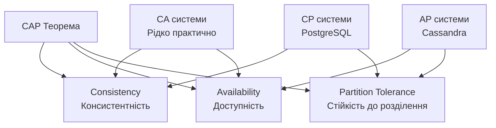
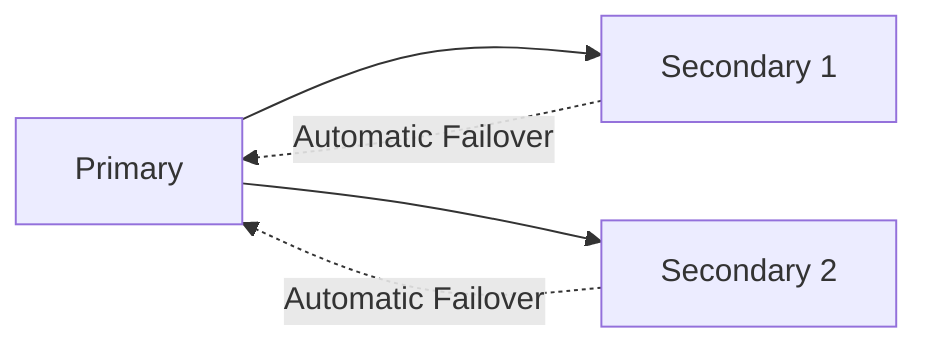
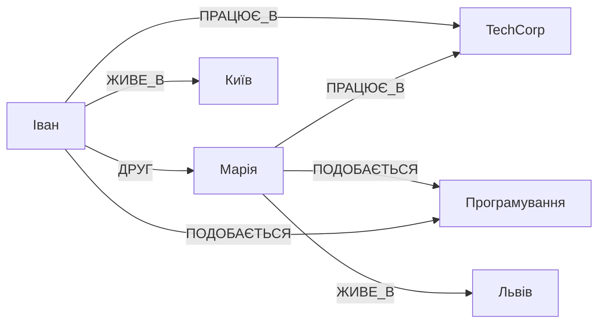
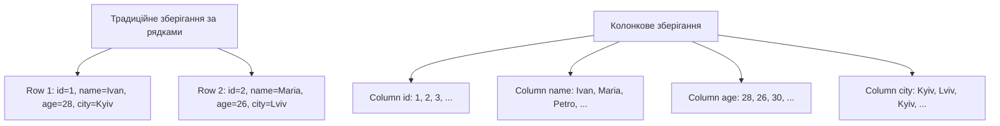
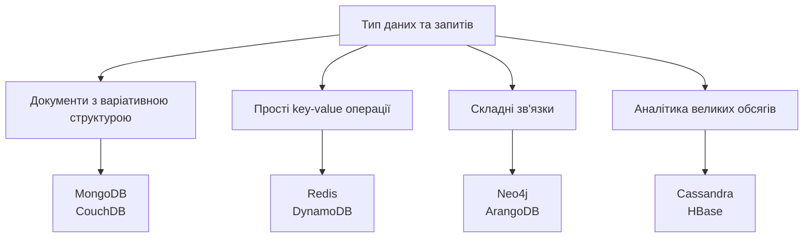
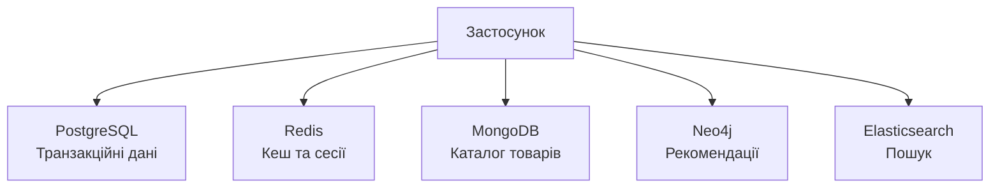

# NoSQL бази даних: типи та особливості

## План лекції

1. Передумови виникнення NoSQL
2. CAP теорема та BASE модель
3. Документо-орієнтовані бази (MongoDB)
4. Key-Value сховища (Redis)
5. Графові бази даних (Neo4j)
6. Колонкові бази (Cassandra)
7. Вибір та порівняння

## 1. Передумови NoSQL

## Чому виникли NoSQL бази?

### 📈 Виклики реляційних БД:

**Експоненціальне зростання даних**
- Петабайти інформації
- Вертикальне масштабування досягло меж
- Потреба в горизонтальному масштабуванні

**Гнучкість схеми**
- Швидка зміна структури даних
- Різні атрибути для різних записів
- Складність міграцій в production

**Географічне розподілення**
- Глобальні сервіси
- Низька латентність в різних регіонах
- Складність реплікації з ACID

## NoSQL = Not Only SQL

### 🎯 Характеристики NoSQL:

- Горизонтальне масштабування
- Гнучка або відсутня схема даних
- Eventual consistency (часто)
- Оптимізація під конкретні use cases
- Спрощений інтерфейс (не SQL)

### ⚖️ Це не заміна, а доповнення:

Реляційні БД залишаються оптимальними для багатьох сценаріїв

NoSQL вирішують специфічні проблеми

## 2. CAP теорема

## Фундаментальне обмеження



### ⚠️ Можна обрати лише 2 з 3 властивостей!

## CAP: детальніше

### 🔄 Consistency (Консистентність):

Всі вузли бачать однакові дані одночасно

Після запису всі читання повертають нове значення

### ✅ Availability (Доступність):

Кожен запит отримує відповідь

Система працює навіть при відмові частини вузлів

### 🌐 Partition Tolerance (Розділення):

Система працює при мережевих розривах

В реальності розриви неминучі

### 💡 Практика:

Реальні системи обирають між CP та AP

## BASE модель

### 🆚 Альтернатива ACID:

**BA - Basically Available**
- Система доступна більшу частину часу
- Можливі часткові збої

**S - Soft State**
- Стан може змінюватися без нових запитів
- Активна синхронізація між вузлами

**E - Eventually Consistent**
- Врешті-решт всі вузли досягнуть консистентності
- Тимчасові розбіжності допустимі

### 🎯 Компроміс:

Жертвуємо сильною консистентністю заради доступності та продуктивності

## 3. Документо-орієнтовані БД

## Концепція документів

### 📄 Документ = самодостатній об'єкт:

```json
{
  "_id": "507f1f77bcf86cd799439011",
  "name": "Ноутбук Dell XPS 15",
  "category": "Electronics",
  "price": 45999,
  "specifications": {
    "processor": "Intel Core i7",
    "ram": "16GB",
    "storage": "512GB SSD"
  },
  "reviews": [
    {
      "user": "user123",
      "rating": 5,
      "comment": "Чудовий ноутбук!"
    }
  ],
  "tags": ["laptop", "premium"],
  "in_stock": true
}
```

## MongoDB - найпопулярніша

### ✅ Переваги:

- 🔧 Гнучка схема даних (schema-less)
- 📊 JSON/BSON формат (природно для JavaScript)
- 🚀 Горизонтальне масштабування (sharding)
- 🔍 Потужні можливості запитів
- 📈 Агрегаційний фреймворк

### 🎯 Ідеальна для:

- Каталоги товарів з варіативними атрибутами
- CMS та системи управління контентом
- Профілі користувачів
- Real-time аналітика

## MongoDB: запити

```javascript
// Знайти електроніку дорожче 20000
db.products.find({
  category: "Electronics",
  price: { $gt: 20000 }
}).sort({ price: -1 }).limit(10)

// Оновлення документа
db.products.updateOne(
  { _id: ObjectId("...") },
  {
    $set: { price: 42999 },
    $push: { tags: "sale" }
  }
)

// Агрегація - середній рейтинг
db.products.aggregate([
  { $unwind: "$reviews" },
  { $group: {
    _id: "$_id",
    avgRating: { $avg: "$reviews.rating" }
  }}
])
```

## MongoDB: індексація та реплікація

### 🔍 Індекси:

```javascript
// Простий індекс
db.products.createIndex({ category: 1 })

// Складений індекс
db.products.createIndex({ category: 1, price: -1 })

// Текстовий пошук
db.products.createIndex({ name: "text", description: "text" })
```

### 🔄 Replica Sets:



**Висока доступність** - автоматичний failover

**Резервування** - кілька копій даних

## 4. Key-Value сховища

## Принцип роботи

### 🗝️ Найпростіша модель NoSQL:

```
Key         →    Value
"user:1000" →    {"name": "Іван", "email": "ivan@example.com"}
"session:abc" →  {"user_id": 1000, "expires": "..."}
"cache:query" →  [результати запиту]
```

### ⚡ Операції:

- **SET** - встановити значення
- **GET** - отримати значення
- **DELETE** - видалити ключ
- Мікросекундна латентність!

## Redis - структура даних сервер

### 🎯 Не лише key-value:

```python
# Рядки
r.set('user:1000:name', 'Іван Петренко')
r.setex('session:abc', 3600, 'data')  # з експірацією

# Списки (черги)
r.lpush('queue:tasks', 'task1')
task = r.rpop('queue:tasks')

# Хеші (структуровані дані)
r.hset('user:1000', mapping={
    'name': 'Іван',
    'email': 'ivan@example.com',
    'points': 150
})

# Множини
r.sadd('online:users', 'user:1000')
r.scard('online:users')  # кількість онлайн
```

## Redis: use cases

### 🚀 Типові застосування:

**Кешування**
- Результати складних запитів
- Сесії користувачів
- Автоматична експірація

**Черги повідомлень**
- Асинхронна обробка задач
- Job queues (Celery, Bull)

**Real-time аналітика**
- Лічильники
- Leaderboards (відсортовані множини)

**Pub/Sub**
- Real-time повідомлення
- Чати, нотифікації

## Redis: продуктивність

```python
# Атомарні операції
r.incr('page:views')  # інкремент лічильника
r.hincrby('user:1000', 'points', 10)  # +10 балів

# Leaderboard за допомогою sorted sets
r.zadd('leaderboard', {'player1': 1500, 'player2': 1200})
r.zrevrange('leaderboard', 0, 9)  # топ-10

# Pub/Sub
r.publish('notifications', 'New message!')
```

### ⚡ Чому такий швидкий:

- Всі дані в пам'яті (RAM)
- Оптимізовані структури даних
- Одно-потоковість (без блокувань)

## 5. Графові бази даних

## Модель графа



### 🌐 Елементи графа:

**Вершини (Nodes)** - сутності з властивостями

**Ребра (Edges)** - зв'язки між вершинами

**Властивості** - атрибути вершин та ребер

## Neo4j - лідер серед графових БД

### ✅ Переваги:

- 🔍 Cypher - виразна мова запитів
- ⚡ Швидкий обхід графа
- 🎯 Природне моделювання зв'язків
- 📊 Візуалізація даних

### 🎯 Ідеальна для:

- Соціальні мережі
- Рекомендаційні системи
- Виявлення шахрайства
- Knowledge graphs
- Мережеві топології

## Cypher: мова запитів Neo4j

```cypher
// Створення вершин та зв'язків
CREATE (ivan:Person {name: 'Іван', age: 28})
CREATE (maria:Person {name: 'Марія', age: 26})
CREATE (tech:Company {name: 'TechCorp'})

CREATE (ivan)-[:FRIEND_OF {since: '2020-01-15'}]->(maria)
CREATE (ivan)-[:WORKS_AT {position: 'Developer'}]->(tech)

// Пошук друзів друзів (FOAF)
MATCH (me:Person {name: 'Іван'})-[:FRIEND_OF]-(friend)-[:FRIEND_OF]-(foaf)
WHERE NOT (me)-[:FRIEND_OF]-(foaf)
RETURN DISTINCT foaf.name

// Рекомендації: люди зі спільними інтересами
MATCH (me:Person {name: 'Іван'})-[:HAS_SKILL]->(skill)<-[:HAS_SKILL]-(other)
WHERE NOT (me)-[:FRIEND_OF]-(other)
RETURN other.name, COUNT(skill) as common_skills
ORDER BY common_skills DESC
```

## Графові запити: shortest path

```cypher
// Найкоротший шлях між людьми
MATCH path = shortestPath(
  (person1:Person {name: 'Іван'})-[*]-(person2:Person {name: 'Петро'})
)
RETURN path

// Рекомендації товарів (collaborative filtering)
MATCH (me:User {id: 1})-[:PURCHASED]->(product)<-[:PURCHASED]-(other)
MATCH (other)-[:PURCHASED]->(recommendation)
WHERE NOT (me)-[:PURCHASED]->(recommendation)
RETURN recommendation.name, COUNT(*) as score
ORDER BY score DESC
LIMIT 10
```

### 🚀 Продуктивність:

Обхід графа швидкість не залежить від розміру бази

JOIN в SQL стає повільнішим з ростом даних

## 6. Колонкові бази даних

## Організація даних



### 💡 Читаємо лише потрібні стовпці!

## Переваги колонкового зберігання

### 📊 Для аналітики:

**Компресія**
- Однотипні дані стискаються ефективніше
- Економія місця та швидкість читання

**Агрегації**
```sql
SELECT category, AVG(price), COUNT(*)
FROM products
GROUP BY category
```
Читаємо лише стовпці category та price!

**Аналітичні запити**
- Data warehousing
- OLAP (Online Analytical Processing)
- Business Intelligence

## Apache Cassandra

### ✅ Характеристики:

- 🌐 Розподілена без master вузлів
- 📈 Лінійне масштабування
- 🔄 Висока доступність (AP в CAP)
- ⚖️ Tunable consistency
- ⏱️ Time-series data

### 🎯 Ідеальна для:

- IoT дані та логи
- Time-series дані
- Системи з великим write throughput
- Географічно розподілені системи

## Cassandra: модель даних

```cql
-- Створення keyspace (аналог БД)
CREATE KEYSPACE ecommerce
WITH replication = {
  'class': 'NetworkTopologyStrategy',
  'datacenter1': 3
};

-- Створення таблиці
CREATE TABLE orders (
  user_id UUID,
  order_date TIMESTAMP,
  order_id UUID,
  total_amount DECIMAL,
  PRIMARY KEY (user_id, order_date, order_id)
) WITH CLUSTERING ORDER BY (order_date DESC);

-- Запит
SELECT * FROM orders
WHERE user_id = ?
  AND order_date >= '2024-01-01'
LIMIT 10;
```

## 7. Порівняння та вибір

## Коли використовувати кожен тип?



## Порівняльна таблиця

| Тип | Приклади | Сильні сторони | Use Cases |
|-----|----------|----------------|-----------|
| **Документні** | MongoDB | Гнучкість схеми, природне моделювання об'єктів | Каталоги, CMS, профілі |
| **Key-Value** | Redis | Максимальна швидкість, простота | Кеш, сесії, черги |
| **Графові** | Neo4j | Обхід зв'язків, рекомендації | Соціальні мережі, fraud detection |
| **Колонкові** | Cassandra | Масштабування, write throughput | IoT, логи, time-series |

## Polyglot Persistence

### 🎯 Сучасний підхід - використання кількох БД:



### ⚖️ Баланс:

**Переваги:** використання сильних сторін кожної технології

**Недоліки:** складність архітектури та підтримки

## Критерії вибору NoSQL

### 🎯 Запитання для прийняття рішення:

**Структура даних:**
- Фіксована чи варіативна схема?
- Складні зв'язки чи незалежні документи?

**Патерни доступу:**
- Читання чи запис-інтенсивні?
- Прості чи складні запити?

**Масштабування:**
- Потреба в горизонтальному масштабуванні?
- Географічне розподілення?

**Консистентність:**
- Сильна консистентність критична?
- Eventual consistency прийнятна?

## SQL vs NoSQL: коли що?

### ✅ Залишайтесь на SQL коли:

- Складні транзакції критичні (фінанси)
- Чітко структуровані дані
- ACID властивості обов'язкові
- Складні JOIN та аналітика
- Невеликі обсяги (< 1TB)

### ✅ Переходьте на NoSQL коли:

- Величезні обсяги даних (petabytes)
- Гнучкість схеми важлива
- Горизонтальне масштабування потрібне
- Специфічні патерни (графи, time-series)
- Eventual consistency прийнятна

## Практичні поради

### 💡 Рекомендації:

**Починайте з SQL:**
- Якщо немає чітких причин для NoSQL
- Реляційна модель підходить для більшості задач

**Експериментуйте:**
- Proof of Concept перед повним переходом
- Порівнюйте продуктивність для ваших запитів

**Не бійтесь гібридних рішень:**
- PostgreSQL підтримує JSON
- Можна комбінувати різні бази

**Вивчайте документацію:**
- Кожна NoSQL БД має свої особливості
- Розуміння внутрішньої роботи критично

## Висновки

### 🎯 Ключові моменти:

1. **NoSQL ≠ заміна SQL** - це доповнення для специфічних сценаріїв
2. **CAP теорема** - фундаментальні обмеження розподілених систем
3. **4 основні типи** - документні, key-value, графові, колонкові
4. **Кожен тип** має свої сильні сторони та use cases
5. **Polyglot Persistence** - використання кількох БД стає нормою
6. **Eventual consistency** - компроміс заради масштабування
7. **Вибір залежить** від типу даних, запитів та вимог
