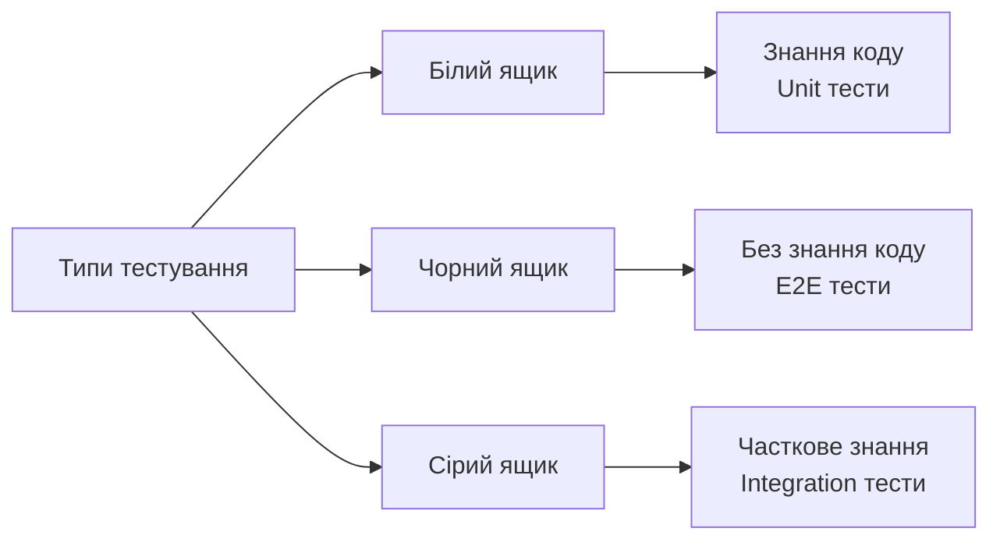
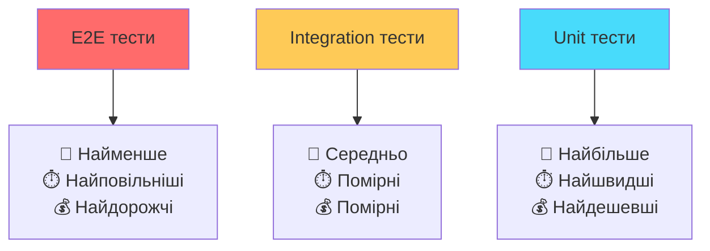
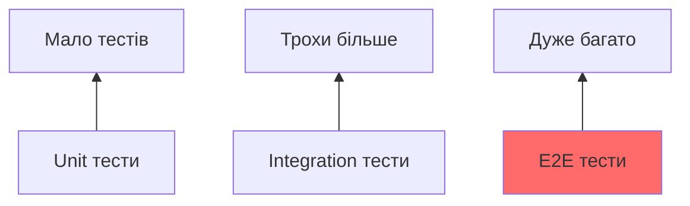
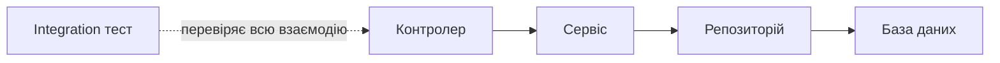
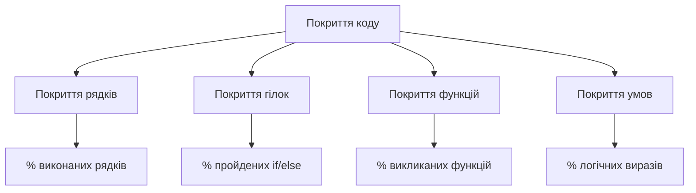
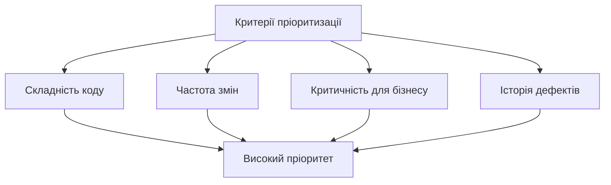
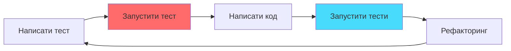

# Стратегії тестування: піраміда тестів

## План лекції

1. Основи тестування ПЗ
2. Концепція піраміди тестів
3. Unit тести: фундамент
4. Integration тести: середина
5. End-to-End тести: вершина
6. Покриття коду
7. Стратегія тестування

## 1. Основи тестування

## Що таке тестування?

**Тестування** — систематичний процес виконання програми для виявлення помилок та перевірки відповідності результатів очікуваним.

### 🎯 Основні цілі:

- Верифікація: чи створюємо продукт правильно?
- Валідація: чи створюємо правильний продукт?
- Раннє виявлення проблем
- Підвищення впевненості в якості

### 💡 Ключовий факт:

Вартість виправлення помилки зростає експоненційно залежно від етапу виявлення

## Принципи ефективного тестування

### ✅ Основні принципи:

1. **Тестування показує наявність дефектів**, але не може довести їх відсутність
2. **Вичерпне тестування неможливе** — фокус на критичних сценаріях
3. **Раннє тестування** економить час та гроші
4. **Концентрація дефектів** — 80% проблем у 20% коду
5. **Пестицидний парадокс** — тести застарівають, потрібне оновлення

## Типи тестування за знанням



## 2. Піраміда тестів

## Концепція піраміди



**Автор концепції:** Майк Кон (Mike Cohn)

## Чому піраміда?

### 📊 Ідеальний розподіл:

- **70%** — Unit тести
- **20%** — Integration тести
- **10%** — E2E тести

### 🎯 Логіка:

Більшість тестів на нижньому рівні забезпечує:

- Швидкий фідбек розробникам
- Легку ідентифікацію проблем
- Низьку вартість створення та підтримки
- Можливість частого запуску

## Антипатерни тестування

### 🍦 Крижаний ріжок (перевернута піраміда)



**Проблеми:**

- Повільне виконання
- Складна підтримка
- Важко знайти причину проблеми

### ⏳ Годинникове скло

Багато unit тестів + багато E2E тестів, але мало integration тестів посередині

## 3. Unit тести

## Характеристики unit тестів

### ✨ Ключові властивості:

- ⚡ **Швидкість** — мілісекунди на тест
- 🔒 **Ізольованість** — тестують одну функцію
- 🎲 **Детермінованість** — однаковий результат
- 🚫 **Незалежність** — не використовують БД, мережу, файли

### 🎯 Що тестуємо:

- Окремі функції та методи
- Логіку обчислень
- Граничні випадки
- Обробку помилок

## Структура unit тесту: AAA

### Arrange-Act-Assert (Given-When-Then)

```python
def test_calculate_discount():
    # Arrange (Given) - підготовка
    price = 100
    quantity = 15

    # Act (When) - дія
    discount = calculate_discount(price, quantity)

    # Assert (Then) - перевірка
    assert discount == 5
```

**Переваги:** чітка структура, легко читати та підтримувати

## Приклад unit тестів

```python
def calculate_discount(price, quantity):
    if quantity >= 100:
        return price * 0.2
    elif quantity >= 50:
        return price * 0.1
    elif quantity >= 10:
        return price * 0.05
    return 0
```

```python
def test_no_discount():
    assert calculate_discount(100, 5) == 0

def test_five_percent():
    assert calculate_discount(100, 15) == 5

def test_boundary_at_fifty():
    assert calculate_discount(100, 50) == 10
```

## Тестові дублери

```mermaid
graph TB
    A[Тестові дублери] --> B[Стаби]
    A --> C[Моки]
    A --> D[Фейки]

    B --> E[Повертають заздалегідь<br/>визначені дані]
    C --> F[Перевіряють виклики<br/>методів]
    D --> G[Спрощені робочі<br/>реалізації]
```



**Мета:** ізоляція тестованого коду від залежностей

## 4. Integration тести

## Роль інтеграційних тестів

### 🔗 Що перевіряють:

- Взаємодію між модулями
- Передачу даних між компонентами
- Роботу з базою даних
- API ендпоінти
- Інтеграцію з зовнішніми сервісами



## Стратегії інтеграції

### 📈 Знизу вгору

Починаємо з базових модулів → рухаємось до верхніх рівнів

### 📉 Зверху вниз

Починаємо з верхнього рівня → рухаємось до базових модулів

### 🥪 Сендвіч (гібридна)

Поєднуємо обидва підходи, тестуємо критичні модулі паралельно

## Приклад integration тесту

```python
def test_create_user_endpoint():
    # Arrange
    user_data = {
        "username": "testuser",
        "email": "test@example.com",
        "password": "securepass"
    }

    # Act
    response = client.post("/api/users", json=user_data)

    # Assert
    assert response.status_code == 201
    assert "id" in response.json()

    # Verify database
    user = db.get_user_by_email("test@example.com")
    assert user is not None
```

## Управління тестовими даними

### 🔧 Інструменти:

**Фікстури** — заздалегідь підготовлені набори даних

**Фабрики** — генерують тестові об'єкти динамічно

**Транзакції** — відкат змін після тесту

### ⚠️ Важливо:

- Кожен тест працює з чистим станом
- Тести незалежні один від одного
- Можливість виконання в будь-якому порядку

## 5. End-to-End тести

## Характеристики E2E тестів

### 🎭 Що перевіряють:

Систему повністю від UI до БД, імітуючи реальні користувацькі сценарії

### ⚙️ Особливості:

- ⏰ Повільне виконання (хвилини)
- 🏗️ Складне налаштування
- 💸 Дорога підтримка
- 🎯 Висока цінність для бізнесу
- 🔄 Використання реального середовища

## Інструменти E2E тестування

### 🛠️ Популярні рішення:

**Selenium** — класичний інструмент, підтримка всіх браузерів

**Cypress** — сучасний, швидкий, developer-friendly

**Playwright** — від Microsoft, Chromium + Firefox + WebKit

**Puppeteer** — для Chrome/Chromium

### 💡 Вибір залежить від:

Технологічного стеку, бюджету, вимог до браузерів

## Page Object Model

```python
class LoginPage:
    def __init__(self, driver):
        self.driver = driver
        self.username = driver.find_element(By.ID, "username")
        self.password = driver.find_element(By.ID, "password")
        self.button = driver.find_element(By.ID, "login")

    def login(self, user, pwd):
        self.username.send_keys(user)
        self.password.send_keys(pwd)
        self.button.click()

def test_login():
    page = LoginPage(driver)
    page.login("user", "pass")
    assert "Dashboard" in driver.title
```

## Виклики E2E тестування

### 🐛 Нестабільність (Flakiness)

**Причини:**

- Мережеві затримки
- Проблеми синхронізації
- Тимчасові збої інфраструктури

**Рішення:**

- Розумне очікування елементів
- Retry механізми
- Ізоляція тестів

### ⏱️ Час виконання

**Стратегії:**

- Паралелізація тестів
- Вибіркове запускання
- Запуск на потужних серверах

## 6. Покриття коду

## Метрики покриття



## Інтерпретація покриття

### ⚠️ Поширені помилки:

**100% покриття ≠ відсутність помилок**

Можна виконувати код, але не перевіряти результати

### ✅ Правильний підхід:

- Покриття як інструмент виявлення неперевіреного коду
- Фокус на критичній бізнес-логіці
- Якість тестів важливіша за показники

### 🎯 Реалістичні цілі:

- Критична логіка: 90-100%
- Загальний код: 70-80%
- Утилітні функції: 50-60%

## 7. Стратегія тестування

## Визначення пріоритетів

### 🎯 Аналіз ризиків:



**Принцип:** більше тестів для високоризикових областей

## Баланс швидкості та покриття

### ⚡ Організація тестів:

**Smoke тести** — базова функціональність, дуже швидко

**Regression тести** — повне покриття, перед релізом

**Nightly тести** — довгі E2E тести, запуск вночі

### 🔄 Стратегія запуску:

- Unit тести: при кожному commit
- Integration тести: при Pull Request
- E2E тести: перед релізом + scheduled

## Інтеграція в розробку

### 🎨 Test-Driven Development (TDD)



### 🚀 Continuous Integration:

Автоматичний запуск тестів при кожній зміні коду

## Додаткові типи тестів

### 🔒 Тести безпеки

Пошук вразливостей, SQL ін'єкції, XSS

### ⚡ Тести продуктивності

Навантажувальне, стрес-тестування, spike testing

### ♿ Тести доступності

Відповідність WCAG стандартам

### 📱 Тести сумісності

Різні браузери, пристрої, ОС

## Інструменти для тестування

### 🐍 Python:

**pytest** — unit та integration тести

**unittest** — вбудований фреймворк

**Robot Framework** — keyword-driven тести

### ☕ JavaScript:

**Jest** — React та Node.js

**Mocha + Chai** — гнучке рішення

**Cypress** — E2E тести

### ☕ Java:

**JUnit** — стандарт для unit тестів

**TestNG** — розширені можливості

**Selenium** — E2E автоматизація

## Найкращі практики

### ✅ Золоті правила:

1. **Швидкі тести** — негайний фідбек
2. **Ізольовані тести** — незалежність від інших
3. **Повторювані тести** — однакові результати
4. **Самоперевірка** — автоматична валідація
5. **Своєчасні тести** — писати разом з кодом

### 🎯 Фокус на якості:

Краще 10 якісних тестів, ніж 100 безглузді

## Висновки

### 🎯 Ключові висновки:

1. **Піраміда тестів** — перевірена стратегія балансу
2. **Unit тести** — основа впевненості в коді
3. **Integration тести** — перевірка взаємодії
4. **E2E тести** — валідація користувацьких сценаріїв
5. **Покриття** — інструмент, не самоціль
6. **Автоматизація** — ключ до ефективності

### 💡 Головна думка:

Якість тестів важливіша за їх кількість. Тестування — інвестиція в майбутнє проєкту!
