# CI/CD, моніторинг та підтримка якості коду

## План лекції

1. Основи Continuous Integration
2. Побудова CI пайплайну
3. Continuous Deployment
4. Моніторинг
5. Підтримка якості коду
6. Інтеграція практик
7. Сучасні тренди

## 1. Continuous Integration

## Що таке CI?

**Continuous Integration** — практика регулярної інтеграції коду в спільну базу з автоматичною перевіркою

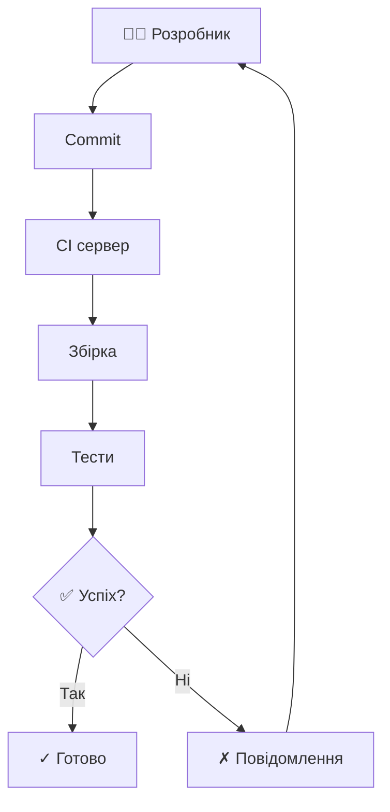

### 🎯 Головна мета:

Виявити та виправити помилки якомога раніше

## Принципи CI

### ✅ Основні принципи:

1. **Єдиний репозиторій** — одне джерело істини
2. **Автоматична збірка** — без ручних кроків
3. **Самотестування** — тести частина збірки
4. **Щоденні комміти** — часта інтеграція
5. **Збірка кожного комміту** — негайна перевірка
6. **Швидка збірка** — фідбек за хвилини
7. **Прозорість** — всі бачать стан

## Переваги CI

### 🚀 Для команди:

**Раннє виявлення помилок** — контекст ще свіжий

**Менше конфліктів** — часта інтеграція малих змін

**Впевненість у коді** — автоматична валідація

**Прозорість** — стан проєкту видимий усім

### 💰 Для бізнесу:

- Швидша доставка функцій
- Менше часу на виправлення помилок
- Вища якість продукту

## Виклики впровадження

### ⚠️ Типові проблеми:

**Культурний опір** — звичка до довгих циклів розробки

**Повільні тести** — години виконання = неефективність

**Складність налаштування** — початкові інвестиції

### ✅ Рішення:

- Навчання команди
- Оптимізація тестів
- Поетапне впровадження

## 2. Побудова CI пайплайну

## Компоненти пайплайну

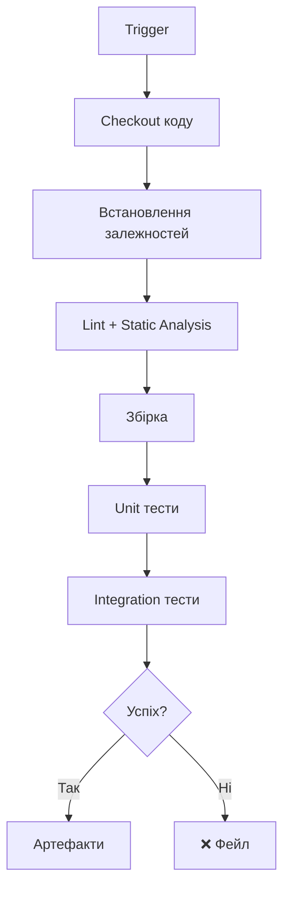

## Приклад: GitHub Actions

```yaml
name: CI Pipeline

on:
  push:
    branches: [ main, develop ]
  pull_request:
    branches: [ main ]

jobs:
  test:
    runs-on: ubuntu-latest

    steps:
    - uses: actions/checkout@v2

    - name: Set up Python
      uses: actions/setup-python@v2
      with:
        python-version: 3.9
```

## Продовження прикладу

```yaml
    - name: Install dependencies
      run: |
        python -m pip install --upgrade pip
        pip install -r requirements.txt
        pip install pytest flake8 black

    - name: Lint
      run: |
        flake8 app/
        black --check app/

    - name: Run tests
      run: |
        pytest tests/ --cov=app --cov-report=xml

    - name: Upload coverage
      uses: codecov/codecov-action@v2
```

## Популярні CI системи

### 🛠️ Основні платформи:

**GitHub Actions** — інтеграція з GitHub, безкоштовно для публічних

**GitLab CI/CD** — вбудована в GitLab, потужні можливості

**Jenkins** — гнучкий, self-hosted, багато плагінів

**CircleCI** — хмарний, швидкий, зручний для Docker

**Travis CI** — популярний для open source

### 💡 Вибір залежить від:

Stack, бюджет, існуюча інфраструктура, команда

## Оптимізація швидкості

### ⚡ Стратегії прискорення:

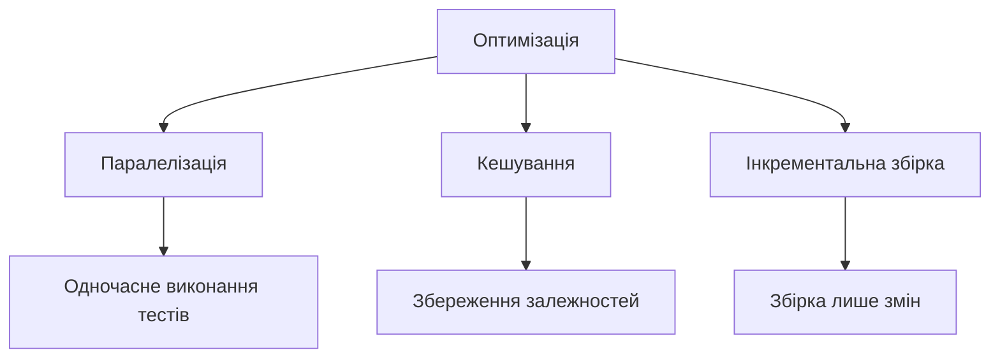

**Результат:** з 30 хвилин до 5 хвилин

## 3. Continuous Deployment

## CD vs CD

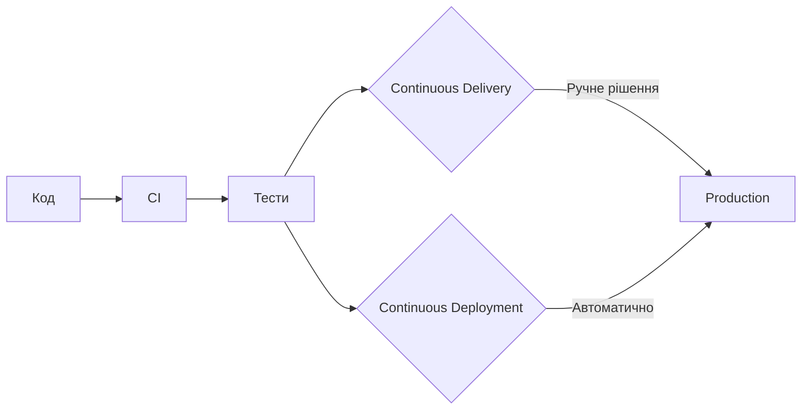

**Delivery** — готовність до релізу

**Deployment** — автоматичний реліз

## Стратегії розгортання

### 🔵🟢 Blue-Green Deployment

Два ідентичні середовища, миттєве переключення

### 🐤 Canary Deployment

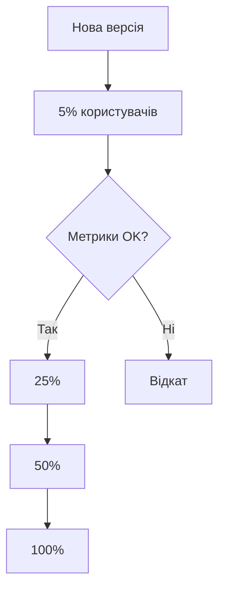

Поступове розгортання з моніторингом

## Продовження стратегій

### 🔄 Rolling Deployment

Поступова заміна екземплярів без downtime

### 🚩 Feature Flags

```python
if feature_flags.is_enabled("new_checkout"):
    return new_checkout_flow()
else:
    return old_checkout_flow()
```

Розгортання коду з вимкненими функціями

## Управління конфігурацією

### 🔧 Принципи:

**Конфігурація ≠ Код** — окреме зберігання

**12-Factor App** — конфігурація через environment variables

**Секрети окремо** — використання Vault, Secrets Manager

### ⚠️ Ніколи:

- Паролі в коді
- API ключі в репозиторії
- Хардкод конфігурації

## 4. Моніторинг

### 📊 Три стовпи:

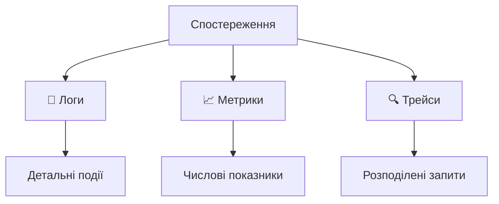

**Мета:** розуміти внутрішній стан системи через зовнішні виходи

## Golden Signals

### 🌟 Чотири ключові метрики (Google SRE):

**Latency** ⏱️ — час обробки запиту

**Traffic** 📊 — кількість запитів

**Errors** ❌ — частота помилок

**Saturation** 💾 — використання ресурсів

### 💡 Правило:

Якщо моніторите ці чотири метрики, розумієте стан системи

## Інструменти моніторингу

### 📈 Метрики: Prometheus + Grafana

```yaml
# prometheus.yml
scrape_configs:
  - job_name: 'webapp'
    static_configs:
      - targets: ['localhost:8080']
    metrics_path: '/metrics'
    scrape_interval: 15s
```

### 📝 Логи: ELK Stack

**Elasticsearch** — зберігання та пошук

**Logstash** — обробка логів

**Kibana** — візуалізація

## Приклад: Grafana Dashboard

### 📊 Типовий dashboard:

- Request Rate (запитів/сек)
- Response Time (p50, p95, p99)
- Error Rate (%)
- CPU/Memory Usage
- Database Connections

### 🎯 Мета:

Одним поглядом оцінити здоров'я системи

## Алертинг

### 🚨 Рівні серйозності:

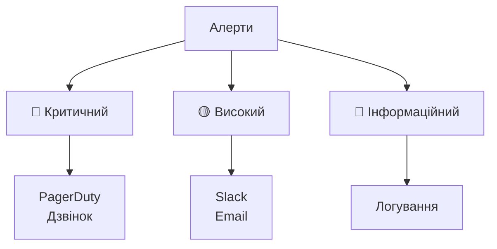

### ✅ Правило:

Кожен алерт має бути actionable — вказувати на дію

## 5. Якість коду

## Статичний аналіз

### 🔍 Інструменти:

**Python:** flake8, pylint, black, mypy

**JavaScript:** ESLint, Prettier, TypeScript

**Java:** SonarQube, Checkstyle, SpotBugs

### 🎯 Що перевіряють:

- Стиль коду
- Потенційні помилки
- Безпека
- Складність коду

## Приклад конфігурації

```yaml
# .eslintrc.yml
extends:
  - eslint:recommended
  - plugin:react/recommended

rules:
  no-console: warn
  no-unused-vars: error
  max-len: [error, 100]
  complexity: [warn, 10]

env:
  browser: true
  node: true
  es6: true
```

## Code Review

### 👥 Процес:

1. Створити Pull Request
2. Автоматичні перевірки (CI)
3. Ревю від колег
4. Обговорення та правки
5. Схвалення та merge

### ✅ На що дивитися:

- Правильність логіки
- Читабельність коду
- Дотримання архітектури
- Потенційні проблеми
- Тести покривають зміни

## Технічний борг

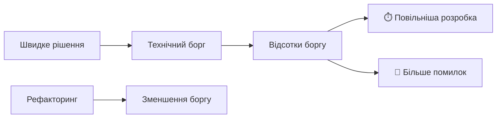

### 💡 Стратегія:

Виділяти 15-20% часу на погашення технічного боргу

## Метрики якості

### 📊 Ключові показники:

**Cyclomatic Complexity** — складність логіки

**Code Duplication** — повторювані фрагменти

**Test Coverage** — покриття тестами

**Maintainability Index** — загальна підтримуваність

### ⚠️ Пам'ятайте:

Метрики — індикатори, не абсолюти

## 6. Інтеграція практик

## Shift Left Testing

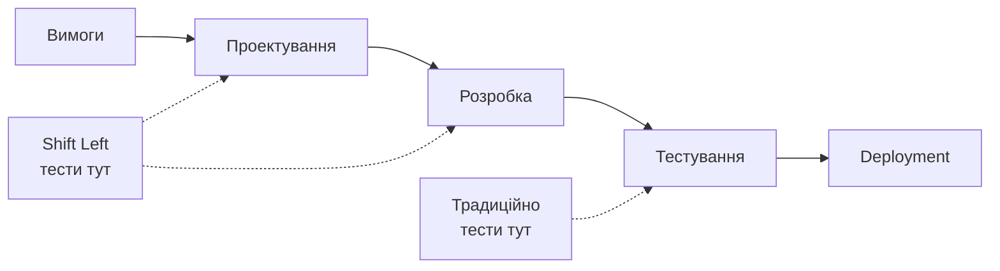

**Ідея:** тестування на ранніх етапах розробки

## Культура якості

### 🎯 Принципи:

**Власність** — кожен відповідає за якість свого коду

**Pair Programming** — code review під час розробки

**Ретроспективи** — постійне вдосконалення

**Автоматизація** — машина робить рутину

### 💡 Результат:

Якість вбудована в процес, не додана в кінці

## Баланс швидкості та якості

### ⚖️ Міф:

Швидкість та якість взаємовиключні

### ✅ Реальність:

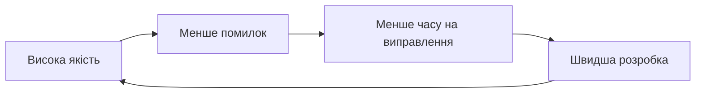

Інвестиції в якість підвищують швидкість!

## 7. Сучасні тренди

## Infrastructure as Code

```hcl
# Terraform приклад
resource "aws_instance" "web" {
  ami           = "ami-0c55b159cbfafe1f0"
  instance_type = "t2.micro"

  tags = {
    Name = "WebServer"
    Environment = "Production"
  }
}
```

**Переваги:** версійованість, відтворюваність, code review

## GitOps

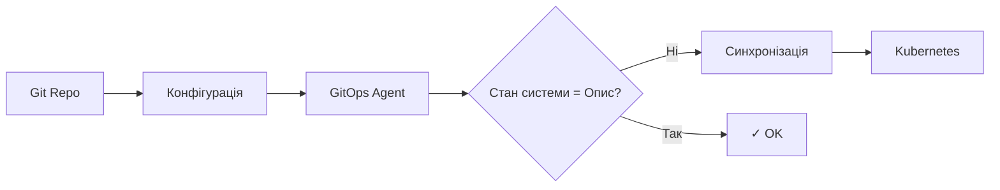

**Принцип:** Git як єдине джерело істини для інфраструктури

## Chaos Engineering

### 🌪️ Що це:

Свідоме введення відмов для перевірки стійкості системи

### 🔬 Експерименти:

- Вимкнення серверів
- Мережеві затримки
- Пошкодження даних
- Високе навантаження

**Інструменти:** Chaos Monkey, Gremlin, LitmusChaos

**Мета:** виявити слабкі місця до реального інциденту

## Практичний приклад: повний пайплайн

### 🔄 CI/CD для вебзастосунку:

1. **Commit** → GitHub
2. **GitHub Actions** запускає:
    - Lint код
    - Run unit тести
    - Run integration тести
    - Build Docker image
3. **Push image** → Docker Registry
4. **ArgoCD** синхронізує Kubernetes
5. **Prometheus** збирає метрики
6. **Grafana** відображає dashboards
7. **PagerDuty** алертує при проблемах

## Інструменти екосистеми

### 🛠️ DevOps toolchain:

**CI/CD:** GitHub Actions, GitLab CI, Jenkins

**Container:** Docker, Kubernetes, Helm

**IaC:** Terraform, Ansible, CloudFormation

**Monitoring:** Prometheus, Grafana, Datadog

**Logging:** ELK, Loki, Splunk

**Security:** Vault, Trivy, SonarQube

## Найкращі практики

### ✅ Що робити:

1. **Автоматизуйте все** що можна
2. **Моніторте все** що важливо
3. **Тестуйте рано** та часто
4. **Розгортайте часто** малими порціями
5. **Збирайте метрики** та аналізуйте
6. **Документуйте** процеси та рішення

### 🎯 Мета:

Швидка, безпечна та надійна доставка цінності користувачам

## Висновки

### 🎯 Ключові висновки:

1. **CI/CD** — основа сучасної розробки
2. **Автоматизація** — інвестиція в продуктивність
3. **Моніторинг** — критичний для надійності
4. **Якість коду** — довгострокова швидкість
5. **Культура** — важливіша за інструменти
6. **DevOps** — спільна відповідальність команди

### 💡 Головна думка:

Ефективні процеси CI/CD + моніторинг + якість = швидка доставка надійного ПЗ
