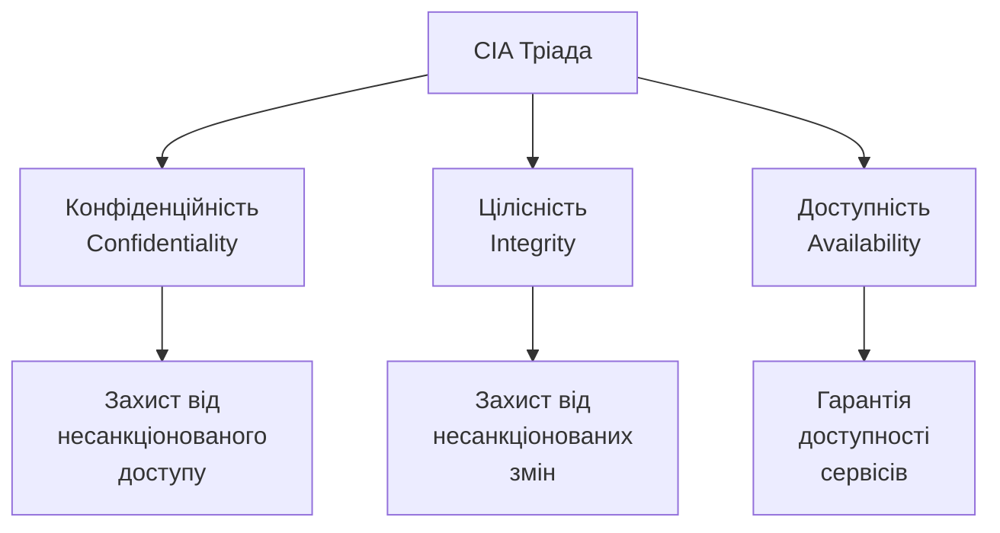
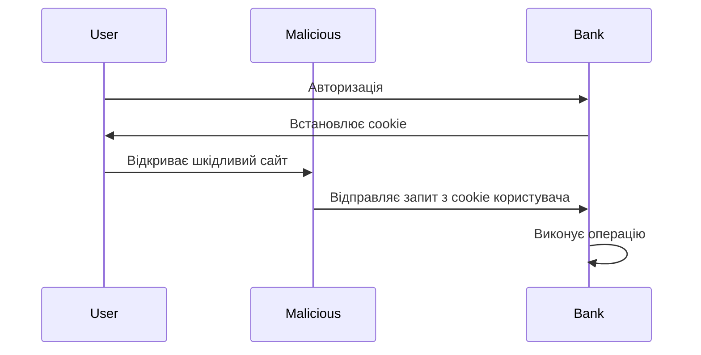
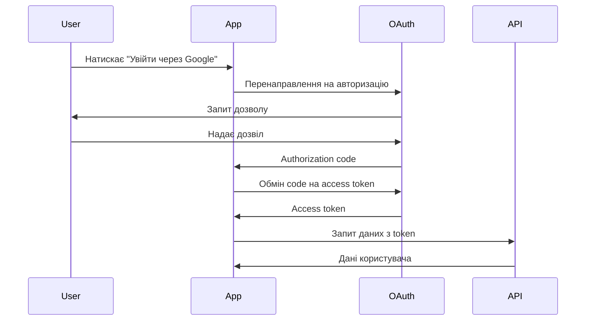

# Інформаційна безпека в розробці ПЗ

## План лекції

1. Основи інформаційної безпеки
2. Поширені вразливості вебдодатків
3. Аутентифікація та авторизація
4. Безпека API
5. Шифрування та криптографія
6. Безпека залежностей
7. Логування та моніторинг
8. Практичні рекомендації

## 1. Основи інформаційної безпеки

## Тріада CIA



## Конфіденційність (Confidentiality)

**Захист даних від несанкціонованого доступу**

- 🔐 Шифрування даних при передачі та зберіганні
- 👤 Аутентифікація користувачів
- 🔑 Контроль доступу до ресурсів
- 🚪 Авторизація на основі ролей

**Приклад:** Лише власник облікового запису може бачити свої особисті дані

## Цілісність (Integrity)

**Гарантія, що дані не були змінені**

- ✅ Контрольні суми та хеші
- 🖊️ Цифрові підписи
- 📝 Журналювання змін
- 🔄 Версіонування даних

**Приклад:** Банківська транзакція не може бути змінена після виконання

## Доступність (Availability)

**Забезпечення доступу до ресурсів**

- 🛡️ Захист від DDoS атак
- 💾 Резервне копіювання
- 🔄 Відмовостійкість системи
- ⚡ Балансування навантаження

**Приклад:** Вебсайт доступний 24/7 навіть при високому навантаженні

## Основні принципи безпеки

### 🔒 Принцип найменших привілеїв
Кожен компонент має лише необхідні права

### 🛡️ Захист в глибину
Кілька рівнів захисту замість одного

### 🏗️ Безпека через дизайн
Інтеграція безпеки з самого початку

### ❌ Fail-safe defaults
Відмова в доступі за замовчуванням

## 2. Поширені вразливості

## OWASP Top 10 (2021)

### Найкритичніші ризики безпеки:

1. **Порушення контролю доступу** - Broken Access Control
2. **Криптографічні збої** - Cryptographic Failures
3. **Ін'єкції** - Injection
4. **Небезпечний дизайн** - Insecure Design
5. **Неправильна конфігурація** - Security Misconfiguration

## OWASP Top 10 (продовження)

6. **Вразливі компоненти** - Vulnerable Components
7. **Помилки ідентифікації** - Identification Failures
8. **Збої цілісності ПЗ** - Software Integrity Failures
9. **Недостатнє логування** - Logging Failures
10. **SSRF** - Server-Side Request Forgery

## SQL Ін'єкції

### ❌ Небезпечний код:

```python
# НЕ ВИКОРИСТОВУЙТЕ!
username = request.form['username']
query = f"SELECT * FROM users WHERE username = '{username}'"
cursor.execute(query)
```

**Атака:** `admin' --` обходить перевірку паролю

### ✅ Безпечний код:

```python
# Параметризований запит
username = request.form['username']
query = "SELECT * FROM users WHERE username = ?"
cursor.execute(query, (username,))
```

## Cross-Site Scripting (XSS)

### Типи XSS:

- **Reflected XSS** - шкідливий код у HTTP запиті
- **Stored XSS** - шкідливий код зберігається на сервері
- **DOM-based XSS** - вразливість у клієнтському коді

### Захист:

```python
# Екранування виводу
from html import escape

user_input = request.form['comment']
safe_output = escape(user_input)
```

## Cross-Site Request Forgery (CSRF)



### Захист - CSRF токени:

```python
csrf_token = generate_token()
session['csrf_token'] = csrf_token

# Перевірка при обробці форми
if request.form['csrf_token'] != session['csrf_token']:
    abort(403)
```

## 3. Аутентифікація та авторизація

## Безпечне зберігання паролів

### ❌ НІКОЛИ не робіть так:

- Паролі у відкритому вигляді
- MD5 або SHA1 хеш
- Звичайне шифрування

### ✅ Правильний підхід:

```python
from werkzeug.security import generate_password_hash

# Хешування з salt
hashed = generate_password_hash(
    password,
    method='pbkdf2:sha256',
    salt_length=16
)
```

**Використовуйте:** bcrypt, Argon2, PBKDF2

## Багатофакторна аутентифікація (MFA)

### Три фактори:

1. **Щось, що ви знаєте** 🧠
   - Пароль, PIN

2. **Щось, що ви маєте** 📱
   - Смартфон, токен

3. **Щось, що ви є** 👤
   - Відбиток пальця, обличчя

## Time-based OTP (TOTP)

```python
import pyotp

# Генерація секрету для користувача
secret = pyotp.random_base32()

# Перевірка коду
totp = pyotp.TOTP(secret)
is_valid = totp.verify(user_code, valid_window=1)
```

**Популярні додатки:** Google Authenticator, Authy, 1Password

## OAuth 2.0 Flow



## JSON Web Token (JWT)

### Структура JWT:

```
header.payload.signature
```

**Header:** тип токена та алгоритм
**Payload:** дані (claims)
**Signature:** перевірка цілісності

### Приклад:

```python
import jwt

payload = {
    'user_id': 123,
    'exp': datetime.utcnow() + timedelta(hours=1)
}

token = jwt.encode(payload, secret_key, algorithm='HS256')
```

## 4. Безпека API

## Контроль доступу (RBAC)

**Role-Based Access Control**

```python
def require_role(*roles):
    def decorator(f):
        def wrapper(*args, **kwargs):
            user = get_current_user()
            if user.role not in roles:
                return {'error': 'Access denied'}, 403
            return f(*args, **kwargs)
        return wrapper
    return decorator

@app.route('/admin/users')
@require_role('admin')
def get_all_users():
    return jsonify(users)
```

## Rate Limiting

**Обмеження кількості запитів**

```python
from flask_limiter import Limiter

limiter = Limiter(
    app,
    default_limits=["200 per day", "50 per hour"]
)

@app.route('/api/login')
@limiter.limit("5 per minute")
def login():
    # Максимум 5 спроб входу за хвилину
    pass
```

**Захист від:**
- 🛡️ Brute force атак
- 📊 Зловживання API
- 💥 DDoS атак

## Валідація вхідних даних

### Ніколи не довіряйте клієнтським даним!

```python
from marshmallow import Schema, fields, validate

class UserSchema(Schema):
    username = fields.Str(
        required=True,
        validate=validate.Length(min=3, max=50)
    )
    email = fields.Email(required=True)
    age = fields.Int(
        validate=validate.Range(min=18, max=120)
    )

# Валідація
try:
    data = schema.load(request.json)
except ValidationError as err:
    return jsonify(err.messages), 400
```

## 5. Шифрування

## HTTPS обов'язково!

### Transport Layer Security (TLS)

```nginx
server {
    listen 443 ssl http2;

    ssl_certificate /path/cert.pem;
    ssl_certificate_key /path/key.pem;

    ssl_protocols TLSv1.2 TLSv1.3;
    ssl_ciphers HIGH:!aNULL:!MD5;

    add_header Strict-Transport-Security
        "max-age=31536000" always;
}
```

**Використовуйте:** Let's Encrypt для безкоштовних сертифікатів

## Шифрування даних у спокої

```python
from cryptography.fernet import Fernet

# Генерація ключа
key = Fernet.generate_key()
cipher = Fernet(key)

# Шифрування
sensitive_data = "Секретна інформація"
encrypted = cipher.encrypt(sensitive_data.encode())

# Дешифрування
decrypted = cipher.decrypt(encrypted)
original = decrypted.decode()
```

**Важливо:** Зберігайте ключі окремо від даних!

## Цифрові підписи

**Забезпечують автентичність та цілісність**

```python
from cryptography.hazmat.primitives.asymmetric import rsa

# Генерація ключів
private_key = rsa.generate_private_key(
    public_exponent=65537,
    key_size=2048
)
public_key = private_key.public_key()

# Підпис даних приватним ключем
signature = private_key.sign(message, padding, hash_algo)

# Перевірка підпису публічним ключем
public_key.verify(signature, message, padding, hash_algo)
```

## 6. Безпека залежностей

## Сканування вразливостей

### Python:
```bash
pip install safety
safety check
```

### Node.js:
```bash
npm audit
npm audit fix
```

### Автоматизація в CI/CD:

```yaml
# GitHub Actions
- name: Security scan
  run: |
    npm audit
    python -m safety check
```

## Принцип мінімальних залежностей

### Перед додаванням бібліотеки запитайте:

- ❓ Чи справді вона потрібна?
- 👥 Чи активно підтримується?
- 🔒 Яка історія безпеки?
- 📦 Скільки транзитивних залежностей?
- 📄 Чи підходить ліцензія?

**Кожна залежність = потенційна вразливість**

## 7. Логування та моніторинг

## Що логувати

### ✅ Важливі події безпеки:

- 🔐 Спроби аутентифікації (успішні та ні)
- 🔑 Зміни прав доступу
- 📊 Доступ до чутливих даних
- ⚠️ Помилки валідації
- 🚫 Відхилені запити
- 🔄 Зміни конфігурації

### ❌ Не логуйте:

- Паролі та токени
- Номери кредитних карток
- Особисті дані (без необхідності)

## Приклад безпекового логування

```python
import logging

security_logger = logging.getLogger('security')

def log_security_event(event_type):
    def decorator(f):
        def wrapper(*args, **kwargs):
            user = get_current_user()
            ip = request.remote_addr

            security_logger.info(
                f"Event: {event_type}, "
                f"User: {user.id}, "
                f"IP: {ip}"
            )

            return f(*args, **kwargs)
        return wrapper
    return decorator

@app.route('/admin/users')
@log_security_event('ADMIN_ACCESS')
def admin_panel():
    return render_template('admin.html')
```

## Моніторинг аномалій

### Детектор brute force атак:

```python
from collections import defaultdict
from datetime import datetime, timedelta

failed_attempts = defaultdict(list)

def check_brute_force(username, ip):
    key = f"{username}:{ip}"
    now = datetime.now()

    # Видаляємо старі спроби
    failed_attempts[key] = [
        t for t in failed_attempts[key]
        if now - t < timedelta(minutes=5)
    ]

    # Додаємо поточну спробу
    failed_attempts[key].append(now)

    # Перевірка порогу
    if len(failed_attempts[key]) > 5:
        logger.warning(f"Brute force: {username} from {ip}")
        return True

    return False
```

## 8. Практичні рекомендації

## Security Checklist для розробників

### Базові практики:

- ✅ Всі дані валідуються на сервері
- ✅ HTTPS для всього трафіку
- ✅ Паролі хешуються (bcrypt/Argon2)
- ✅ CSRF захист для форм
- ✅ Параметризовані SQL запити
- ✅ Екранування користувацького вмісту
- ✅ Rate limiting для API
- ✅ Логування безпекових подій

## Security Checklist (продовження)

### Розширені практики:

- ✅ MFA для адміністраторів
- ✅ Регулярне сканування залежностей
- ✅ Security headers (CSP, HSTS)
- ✅ Принцип найменших привілеїв
- ✅ Секрети у змінних середовища
- ✅ Debug вимкнений у production
- ✅ Регулярні security audits

## Типові помилки

### ❌ Що НЕ робити:

1. Зберігати паролі у відкритому вигляді
2. Довіряти клієнтським даним без валідації
3. Використовувати слабкі алгоритми шифрування
4. Ігнорувати оновлення залежностей
5. Жорстко кодувати секрети в коді
6. Відключати CSRF захист "тому що не працює"
7. Використовувати `eval()` з користувацьким вводом

## Культура безпеки

### 🎯 Безпека - відповідальність всієї команди

- 📚 Регулярне навчання
- 👀 Security-focused code review
- 🤖 Автоматизоване тестування безпеки
- 📊 Моніторинг та алерти
- 🔄 Постійне покращення

**Правило:** Якщо щось виглядає підозріло - воно підозріле!
