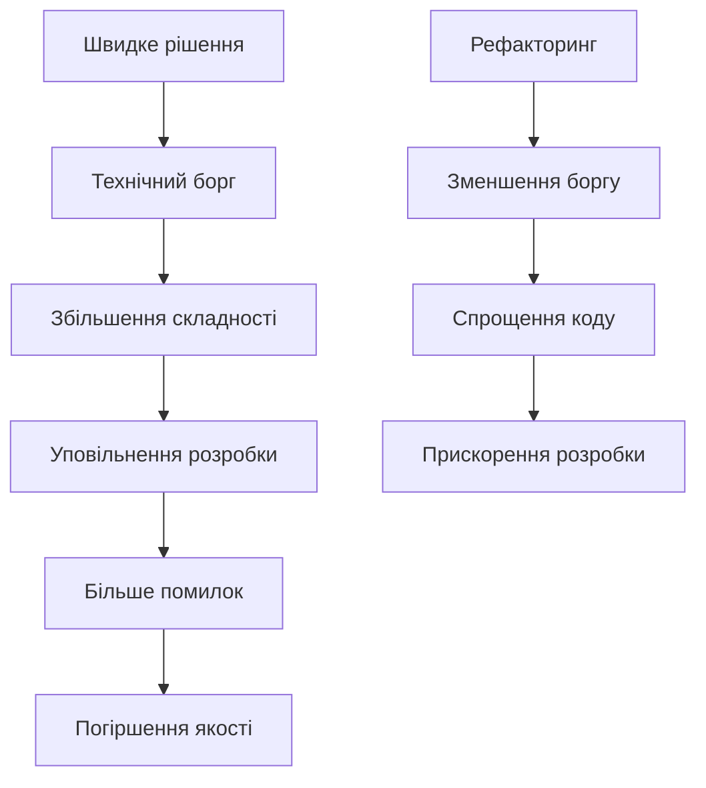
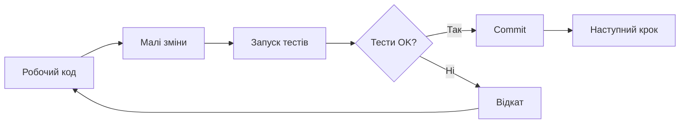

# Рефакторинг та чистий код

## План лекції

1. Філософія чистого коду
2. Іменування
3. Функції
4. Коментарі та документація
5. Рефакторинг
6. Принципи проєктування
7. Організація коду
8. Обробка помилок

## 1. Філософія чистого коду

## Що таке чистий код?

### 💡 Чистий код - це код, який:

- 📖 Легко читається як добре написана проза
- 🎯 Виражає наміри ясно та недвозначно
- 🧩 Має одну чітко визначену функцію
- ✅ Легко тестується
- 🚫 Не містить дублювання

**"Код пишеться один раз, але читається багато разів"**

## Характеристики чистого коду

### Роберт Мартін (Uncle Bob):

> "Чистий код завжди виглядає так, ніби його написав хтось, кому не все одно"

### Грейді Буч:

> "Чистий код простий та прямий. Він читається як добре написана проза"

### Майкл Фезерс:

> "Чистий код виглядає так, ніби його писав хтось, хто дбає про код"

## Технічний борг



### Типи технічного боргу:

- 🎯 **Навмисний** - свідоме рішення
- 😕 **Ненавмисний** - недостатнє розуміння
- 🔄 **Борг через еволюцію** - зміна вимог

## Читабельність = Продуктивність

### 📊 Факти:

- Програмісти витрачають **80%** часу на читання коду
- Тільки **20%** часу йде на написання нового коду
- Читабельний код = швидша розробка
- Читабельний код = менше помилок

### ⚡ Інвестиція в читабельність окупається!

## 2. Іменування

## Значущі імена

### ❌ Погано - незрозумілі імена:

```python
def calc(d):
    r = d * 0.1
    return r
```

### ✅ Добре - описові імена:

```python
def calculate_discount(price):
    discount_rate = 0.1
    discount_amount = price * discount_rate
    return discount_amount
```

**Правило:** Імена повинні розкривати наміри!

## Правила іменування змінних

### Основні принципи:

1. **Уникайте абревіатур**
   - ❌ `usr`, `pwd`, `tmp`
   - ✅ `user`, `password`, `temporary_data`

2. **Використовуйте вимовні назви**
   - ❌ `genymdhms` (generate year-month-day-hour-minute-second)
   - ✅ `generate_timestamp`

3. **Імена повинні бути шуканими**
   - ❌ `7` (магічне число)
   - ✅ `DAYS_IN_WEEK = 7`

## Іменування функцій

### Функції = дії, використовуйте дієслова!

```python
# ❌ Погано
def user(id):
    return database.query(id)

# ✅ Добре - дієслово показує дію
def get_user_by_id(user_id):
    return database.query(user_id)

# ✅ Булеві функції
def is_authenticated(user):
    return user.session_token is not None

def has_permission(user, resource):
    return resource in user.permissions
```

## Іменування класів

### Класи = сутності, використовуйте іменники!

```python
# ❌ Погано - назва описує дію
class DataProcessor:
    pass

# ✅ Добре - назва описує сутність
class CustomerOrder:
    def __init__(self, items):
        self.items = items

    def calculate_total(self):
        return sum(item.price for item in self.items)

class PaymentGateway:
    def process_payment(self, amount):
        pass
```

## 3. Функції

## Принцип єдиної відповідальності

### Кожна функція робить ОДНУ річ!

```python
# ❌ Погано - занадто багато відповідальностей
def process_user_registration(user_data):
    validate(user_data)
    hash_password(user_data['password'])
    save_to_database(user_data)
    send_email(user_data['email'])
    log_registration(user_data)
    return user

# ✅ Добре - розділення на окремі функції
def register_user(user_data):
    validate_user_data(user_data)
    user = create_user_account(user_data)
    complete_registration(user)
    return user
```

## Розмір функцій

### 📏 Функції повинні бути КОРОТКИМИ!

**Ідеальна функція:**
- ✅ Займає кілька рядків
- ✅ Вміщається на одному екрані
- ✅ Робить одну річ добре

```python
# ✅ Добре - коротка та зрозуміла
def filter_active_users(users):
    return [u for u in users if u.is_active]

def calculate_average(numbers):
    if not numbers:
        return 0
    return sum(numbers) / len(numbers)
```

## Кількість параметрів

### Чим менше параметрів - тим краще!

- 🟢 **0 параметрів** - ідеально
- 🟢 **1-2 параметри** - добре
- 🟡 **3 параметри** - прийнятно
- 🔴 **4+ параметри** - ЗАНАДТО БАГАТО!

```python
# ❌ Погано - забагато параметрів
def create_user(email, password, first_name,
                last_name, phone, address, city):
    pass

# ✅ Добре - групування в об'єкт
def create_user(user_data: UserData):
    pass
```

## Булеві прапорці - анти-патерн

### Прапорці вказують, що функція робить >1 речі!

```python
# ❌ Погано - булевий прапорець
def render_user(user, include_details=False):
    if include_details:
        return render_detailed_user(user)
    return render_basic_user(user)

# ✅ Добре - окремі функції
def render_basic_user(user):
    return f"{user.name}"

def render_detailed_user(user):
    return f"{user.name}\n{user.email}\n{user.phone}"
```

## 4. Коментарі та документація

## Коли писати коментарі

### ✅ Коментарі КОРИСНІ для:

- 🎯 Пояснення причин нестандартних рішень
- 📐 Документування складних алгоритмів
- ⚠️ Попередження про можливі проблеми
- 📚 API документації (docstrings)

### ❌ Коментарі ШКІДЛИВІ коли:

- Описують очевидні речі
- Перефразовують код
- Застарілі або неточні
- Закоментований код

## Приклади коментарів

```python
# ❌ Погано - коментар не додає інформації
# Отримуємо користувача з бази даних
user = database.get_user(user_id)
# Перевіряємо чи активний
if user.is_active:
    return True

# ✅ Добре - код зрозумілий без коментарів
user = database.get_user(user_id)
if user.is_active:
    return True

# ✅ Добре - коментар пояснює ЧОМУ
# Використовуємо Decimal для грошових обчислень,
# щоб уникнути проблем з округленням float
from decimal import Decimal
total = Decimal(str(price))
```

## Docstrings для API

```python
def calculate_discount(price, discount_percent, max_discount=None):
    """
    Розраховує суму знижки для товару.

    Args:
        price (float): Початкова ціна в гривнях
        discount_percent (int): Відсоток знижки (0-100)
        max_discount (float, optional): Максимальна сума знижки

    Returns:
        float: Остаточна ціна після знижки

    Raises:
        ValueError: Якщо discount_percent не в діапазоні 0-100

    Examples:
        >>> calculate_discount(100, 10)
        90.0
    """
```

## 5. Рефакторинг

## Що таке рефакторинг?

### 🔄 Рефакторинг - це:

- Зміна внутрішньої структури коду
- БЕЗ зміни зовнішньої поведінки
- Поступові малі кроки
- З постійною перевіркою тестами

### ⚠️ Рефакторинг ≠ Переписування!



## Коли рефакторити?

### 🕐 Правило бойскаутів:

> "Завжди залишай код чистішим, ніж ти його знайшов"

### Найкращий час:

- 🆕 Перед додаванням нової функції
- 🐛 При виправленні багів
- 👀 Під час code review
- 🔄 Регулярно, як частина процесу

**Не чекайте спеціального часу - рефакторте постійно!**

## Техніки рефакторингу

### 1️⃣ Виділення методу

```python
# До рефакторингу - довга функція
def print_invoice(invoice):
    print("*" * 50)
    print(f"Invoice #{invoice.number}")
    print("*" * 50)
    for item in invoice.items:
        print(f"{item.name}: ${item.price}")
    total = sum(item.price for item in invoice.items)
    print(f"Total: ${total}")

# Після рефакторингу
def print_invoice(invoice):
    print_header(invoice)
    print_items(invoice.items)
    print_total(invoice)
```

## Заміна магічних чисел

```python
# ❌ До - магічні числа
def calculate_bonus(salary, years):
    if years >= 5:
        return salary * 0.1
    elif years >= 3:
        return salary * 0.05
    return salary * 0.02

# ✅ Після - іменовані константи
SENIOR_YEARS = 5
MID_LEVEL_YEARS = 3
SENIOR_BONUS_RATE = 0.1
MID_BONUS_RATE = 0.05
JUNIOR_BONUS_RATE = 0.02

def calculate_bonus(salary, years):
    if years >= SENIOR_YEARS:
        return salary * SENIOR_BONUS_RATE
    elif years >= MID_LEVEL_YEARS:
        return salary * MID_BONUS_RATE
    return salary * JUNIOR_BONUS_RATE
```

## Спрощення умов

```python
# ❌ До - складна умова
def should_notify(user, msg):
    if user.is_active and user.email_verified and \
       not user.notifications_disabled and msg.priority >= 3:
        return True
    return False

# ✅ Після - виразні функції
def should_notify(user, msg):
    return (
        is_user_eligible(user) and
        is_message_important(msg)
    )

def is_user_eligible(user):
    return (user.is_active and
            user.email_verified and
            not user.notifications_disabled)

def is_message_important(msg):
    return msg.priority >= 3
```

## 6. Принципи проєктування

## SOLID: Single Responsibility

### Клас має лише одну причину для зміни

```python
# ❌ Порушення SRP
class User:
    def save_to_database(self):
        pass
    def send_email(self):
        pass
    def generate_report(self):
        pass

# ✅ Дотримання SRP
class User:
    pass

class UserRepository:
    def save(self, user):
        pass

class EmailService:
    def send(self, user):
        pass
```

## SOLID: Open-Closed Principle

### Відкритий для розширення, закритий для модифікації

```python
# ❌ Порушення OCP
class AreaCalculator:
    def calculate(self, shape):
        if isinstance(shape, Rectangle):
            return shape.w * shape.h
        elif isinstance(shape, Circle):
            return 3.14 * shape.r ** 2

# ✅ Дотримання OCP
class Shape(ABC):
    @abstractmethod
    def area(self):
        pass

class Rectangle(Shape):
    def area(self):
        return self.width * self.height

class Circle(Shape):
    def area(self):
        return 3.14 * self.radius ** 2
```

## KISS: Keep It Simple, Stupid

### Простота > Складність

```python
# ❌ Надмірно складно
class ConfigManagerFactory:
    @staticmethod
    def create(config_type):
        if config_type == 'json':
            return JSONConfigManager(
                FileSystemLoader(),
                Validator(),
                CacheManager()
            )

# ✅ Просто та зрозуміло
import json

def load_config(filepath):
    with open(filepath) as f:
        return json.load(f)
```

## DRY: Don't Repeat Yourself

### Кожен фрагмент знання має одне представлення

```python
# ❌ Дублювання коду
def get_active_users():
    return [u for u in users if u.status == 'active']

def get_active_admins():
    return [u for u in admins if u.status == 'active']

# ✅ Виділення спільної логіки
def filter_active(entities):
    return [e for e in entities if e.status == 'active']

active_users = filter_active(users)
active_admins = filter_active(admins)
```

## 7. Організація коду

## Структура проєкту

```
project/
├── src/
│   ├── domain/          # Бізнес-логіка
│   │   ├── models/
│   │   └── services/
│   ├── api/             # HTTP endpoints
│   │   ├── controllers/
│   │   └── validators/
│   ├── infrastructure/  # БД, кеш, email
│   └── utils/          # Допоміжні функції
├── tests/
│   ├── unit/
│   └── integration/
└── docs/
```

## Явні залежності

### Dependency Injection покращує тестованість

```python
# ❌ Неявні залежності
class UserService:
    def __init__(self):
        self.db = Database()  # Жорстка залежність
        self.email = EmailService()

# ✅ Явні залежності через інжекцію
class UserService:
    def __init__(self, repository, email_service):
        self.repository = repository
        self.email_service = email_service

# Легко тестувати з mock об'єктами
service = UserService(mock_repo, mock_email)
```

## 8. Обробка помилок

## Використання виключень

### Виключення > Коди помилок

```python
# ❌ Коди помилок
def divide(a, b):
    if b == 0:
        return None, "Division by zero"
    return a / b, None

result, error = divide(10, 0)
if error:
    print(error)

# ✅ Виключення
def divide(a, b):
    if b == 0:
        raise ValueError("Cannot divide by zero")
    return a / b

try:
    result = divide(10, 0)
except ValueError as e:
    print(f"Error: {e}")
```

## Специфічні виключення

```python
# ✅ Власні класи виключень
class UserNotFoundError(Exception):
    def __init__(self, user_id):
        self.user_id = user_id
        super().__init__(f"User {user_id} not found")

class InsufficientPermissionsError(Exception):
    def __init__(self, user, action):
        super().__init__(
            f"User {user.email} cannot {action}"
        )

# Використання
try:
    user = get_user(123)
except UserNotFoundError as e:
    logger.warning(f"User lookup failed: {e}")
```

## Fail Fast принцип

### Виявляйте помилки якомога раніше!

```python
# ❌ Тихий збій
def process_order(order):
    calculate_total(order.items)  # Може бути None
    charge_customer(order.customer, order.total)

# ✅ Fail Fast з валідацією
def process_order(order):
    if not order.items:
        raise ValueError("Order must have items")
    if not order.customer:
        raise ValueError("Order must have customer")

    total = calculate_total(order.items)
    charge_customer(order.customer, total)
```

## Практичні поради

## Code Review Checklist

### Перевіряйте під час review:

- ✅ Імена зрозумілі та виразні?
- ✅ Функції короткі та мають одну відповідальність?
- ✅ Немає дублювання коду?
- ✅ Коментарі пояснюють ЧОМУ, а не ЩО?
- ✅ Помилки обробляються правильно?
- ✅ Код легко тестується?
- ✅ Дотримуються принципи SOLID?
