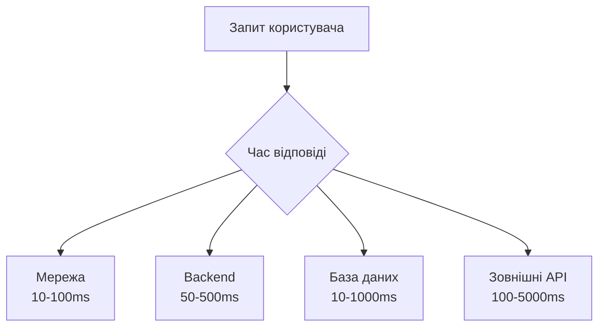
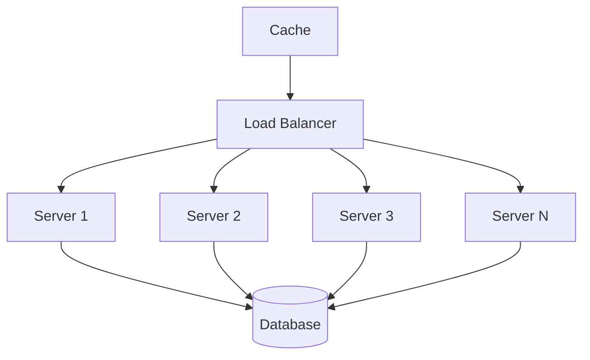
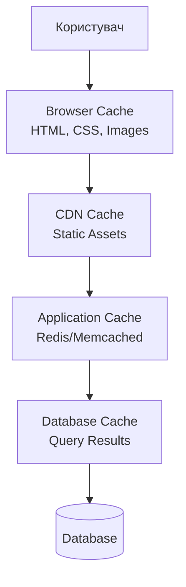
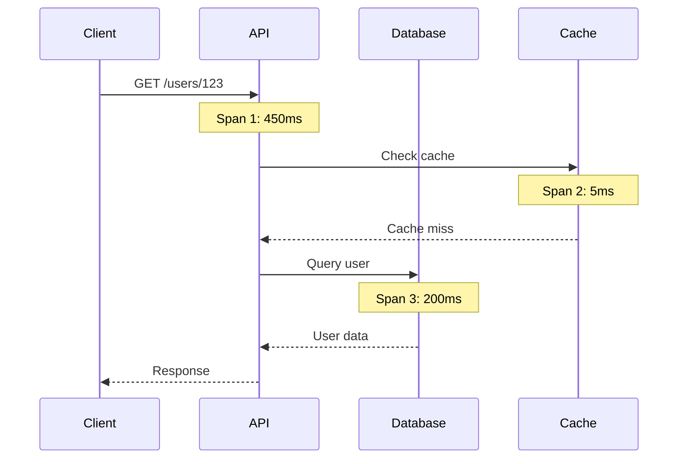

# Масштабування та оптимізація продуктивності застосунків

## План лекції

1. Основи продуктивності
2. Масштабування систем
3. Оптимізація бази даних
4. Кешування
5. Оптимізація коду
6. Frontend оптимізація
7. Моніторинг та аналіз
8. Практичні рекомендації

## 1. Основи продуктивності

## Чому продуктивність важлива?

### 📊 Статистика:

- **1 секунда** затримки = 7% втрата конверсії
- **53%** користувачів покидають сайт, що завантажується >3 секунди
- **100ms** затримки = 1% зниження продажів (Amazon)

### 💰 Продуктивність = Гроші

**Швидкі сайти:**
- ✅ Вища конверсія
- ✅ Кращий SEO
- ✅ Задоволені користувачі

## Розуміння вузьких місць



### ⚠️ Правило:

**Не здогадуйтесь - вимірюйте!**

## Закон Амдала

### Обмеження паралелізації:

```
Прискорення = 1 / ((1 - P) + P/S)
```

- **P** - частина коду, яку можна паралелізувати
- **S** - кількість процесорів

### Приклад:

Якщо 10% коду паралелізується:
- Максимальне прискорення ≈ **10x**
- Незалежно від кількості ядер!

## Вимірювання продуктивності

### Ключові метрики:

- ⏱️ **Час відповіді** - латентність запиту
- 🔄 **Throughput** - запитів за секунду
- 💾 **Використання ресурсів** - CPU, RAM, disk
- 📊 **Percentiles** - p50, p95, p99

### 🎯 Percentiles > Середні значення

```
p50 = 100ms  (медіана)
p95 = 500ms  (95% користувачів)
p99 = 2000ms (найгірший досвід)
```

## Профілювання коду

```python
import cProfile
import pstats

def complex_function():
    result = []
    for i in range(10000):
        result.append(sum(range(i)))
    return result

# Профілювання
profiler = cProfile.Profile()
profiler.enable()
complex_function()
profiler.disable()

# Аналіз результатів
stats = pstats.Stats(profiler)
stats.sort_stats('cumulative')
stats.print_stats(10)  # Топ-10 функцій
```

## 2. Масштабування систем

## Вертикальне vs Горизонтальне

### 📈 Вертикальне (Scale Up):

**Переваги:**
- ✅ Просто реалізувати
- ✅ Не потрібно змінювати код
- ✅ Менше складності

**Недоліки:**
- ❌ Фізична межа потужності
- ❌ Експоненційна вартість
- ❌ Single point of failure

## Горизонтальне масштабування

### 📊 Горизонтальне (Scale Out):

**Переваги:**
- ✅ Практично необмежене
- ✅ Відмовостійкість
- ✅ Лінійна вартість

**Недоліки:**
- ❌ Складніша архітектура
- ❌ Потрібні stateless додатки
- ❌ Розподілена система

## Архітектура масштабування



## Балансування навантаження

### Стратегії розподілу:

1. **Round Robin** - по черзі
2. **Least Connections** - найменше з'єднань
3. **IP Hash** - на основі IP клієнта
4. **Weighted** - з вагами серверів

### Приклад Nginx:

```nginx
upstream backend {
    least_conn;
    server backend1:8000 weight=3;
    server backend2:8000 weight=2;
    server backend3:8000 backup;
}
```

## Health Checks

### Моніторинг доступності серверів:

```nginx
server {
    location / {
        proxy_pass http://backend;

        # Автоматичне виключення збійних серверів
        proxy_next_upstream error timeout
                           invalid_header http_500;
    }
}
```

**Якщо сервер не відповідає → виключається з пулу**

## 3. Оптимізація бази даних

## Індексація

### Без індексу - повільно:

```sql
SELECT * FROM users WHERE email = 'user@example.com';
-- Час: 450ms на 1,000,000 записів
```

### З індексом - швидко:

```sql
CREATE INDEX idx_users_email ON users(email);

SELECT * FROM users WHERE email = 'user@example.com';
-- Час: 2ms
```

**Індекси = 225x прискорення!** 🚀

## Коли використовувати індекси

### ✅ Індексуйте:

- Стовпці в WHERE умовах
- Стовпці в JOIN операціях
- Стовпці в ORDER BY
- Foreign keys

### ❌ Не індексуйте:

- Рідко використовувані стовпці
- Малі таблиці (<1000 записів)
- Стовпці з частими UPDATE

**Індекси прискорюють читання, але сповільнюють запис!**

## Складені індекси

```sql
-- Індекс на кілька стовпців
CREATE INDEX idx_orders_customer_date
ON orders(customer_id, created_at);

-- ✅ Використає індекс
SELECT * FROM orders
WHERE customer_id = 123
  AND created_at > '2024-01-01';

-- ✅ Використає індекс
SELECT * FROM orders
WHERE customer_id = 123;

-- ❌ НЕ використає індекс
SELECT * FROM orders
WHERE created_at > '2024-01-01';
```

**Порядок стовпців важливий!**

## N+1 Проблема

### ❌ Погано - N+1 запит:

```python
# 1 запит для користувачів
users = User.query.all()

# N запитів для замовлень (по 1 для кожного)
for user in users:
    orders = user.orders  # Новий запит!
    print(f"{user.name}: {len(orders)} orders")
```

**100 користувачів = 101 запит до БД!** 😱

## Вирішення N+1

### ✅ Добре - Eager Loading:

```python
# 1 запит з JOIN
users = User.query.options(
    joinedload(User.orders)
).all()

for user in users:
    # Дані вже завантажені!
    print(f"{user.name}: {len(user.orders)} orders")
```

**100 користувачів = 1 запит до БД!** ✨

## EXPLAIN ANALYZE

### Аналіз плану виконання:

```sql
EXPLAIN ANALYZE
SELECT u.name, COUNT(o.id)
FROM users u
LEFT JOIN orders o ON u.id = o.user_id
WHERE u.created_at > '2024-01-01'
GROUP BY u.id;

-- Результат покаже:
-- ✅ Чи використовуються індекси
-- ✅ Скільки рядків сканується
-- ✅ Час виконання кожного кроку
```

## 4. Кешування

## Рівні кешування



## Browser Caching

### HTTP заголовки для кешування:

```python
@app.route('/static/<path:filename>')
def serve_static(filename):
    response = make_response(send_file(filename))

    # Кешувати на 1 рік
    response.headers['Cache-Control'] = \
        'public, max-age=31536000, immutable'

    return response
```

### Для версійованих файлів:

```html
<link rel="stylesheet" href="style.v2.css">
<script src="app.v2.js"></script>
```

## Application-Level Caching

```python
import redis

redis_client = redis.Redis()

def get_popular_products():
    # Перевірити кеш
    cached = redis_client.get('popular_products')
    if cached:
        return json.loads(cached)

    # Запит до БД
    products = db.query(
        "SELECT * FROM products ORDER BY views DESC LIMIT 10"
    )

    # Зберегти в кеші на 10 хвилин
    redis_client.setex(
        'popular_products',
        600,
        json.dumps(products)
    )

    return products
```

## Стратегії кешування

### 1️⃣ Cache-Aside (Lazy Loading):

1. Перевірити кеш
2. Якщо є → повернути
3. Якщо немає → завантажити з БД
4. Зберегти в кеші

### 2️⃣ Write-Through:

Записує в кеш та БД одночасно

### 3️⃣ Write-Behind:

Записує в кеш, потім асинхронно в БД

## Інвалідація кешу

### "Дві найскладніші речі в CS:"

1. Іменування змінних
2. **Інвалідація кешу**
3. Off-by-one помилки

### Стратегії інвалідації:

- ⏰ **Time-based** - через певний час
- 🔔 **Event-based** - при зміні даних
- 🖐️ **Manual** - явний виклик

## 5. Оптимізація коду

## Алгоритмічна складність

### Big O Notation:

- **O(1)** - константна - найкраще! 🟢
- **O(log n)** - логарифмічна - добре 🟢
- **O(n)** - лінійна - прийнятно 🟡
- **O(n²)** - квадратична - погано 🔴
- **O(2ⁿ)** - експоненційна - жахливо 💀

### Приклад:

Для **n = 10,000**:
- O(1) = 1 операція
- O(log n) = 14 операцій
- O(n) = 10,000 операцій
- O(n²) = 100,000,000 операцій

## Порівняння алгоритмів

```python
# ❌ O(n²) - повільно
def find_duplicates_slow(items):
    duplicates = []
    for i in range(len(items)):
        for j in range(i + 1, len(items)):
            if items[i] == items[j]:
                duplicates.append(items[i])
    return duplicates
# 10,000 елементів: 2.5 секунди

# ✅ O(n) - швидко
def find_duplicates_fast(items):
    seen = set()
    duplicates = set()
    for item in items:
        if item in seen:
            duplicates.add(item)
        seen.add(item)
    return list(duplicates)
# 10,000 елементів: 0.002 секунди
```

## Вибір структури даних

### Швидкість операцій:

| Структура | Доступ | Пошук | Вставка | Видалення |
|-----------|--------|-------|---------|-----------|
| List      | O(1)   | O(n)  | O(n)    | O(n)      |
| Set       | -      | O(1)  | O(1)    | O(1)      |
| Dict      | O(1)   | O(1)  | O(1)    | O(1)      |

**Правильна структура = швидкий код!**

## Паралелізм

```python
import concurrent.futures

urls = ['https://example.com/page{}'.format(i)
        for i in range(100)]

# ❌ Послідовно - повільно
def sequential():
    results = [fetch(url) for url in urls]
# Час: 30 секунд

# ✅ Паралельно - швидко
def parallel():
    with concurrent.futures.ThreadPoolExecutor(10) as executor:
        results = list(executor.map(fetch, urls))
# Час: 4 секунди
```

**7.5x прискорення!** 🚀

## Генератори для пам'яті

```python
# ❌ Завантажує весь файл у пам'ять
def read_large_file_bad(filename):
    with open(filename) as f:
        lines = f.readlines()  # Все в RAM!
    return [process(line) for line in lines]
# 1GB файл = 1GB RAM

# ✅ Обробляє по одному рядку
def read_large_file_good(filename):
    with open(filename) as f:
        for line in f:  # Генератор
            yield process(line)
# 1GB файл = ~100KB RAM
```

## 6. Frontend оптимізація

## Мінімізація та стиснення

### Розмір файлів:

```
Original JavaScript: 500 KB
├─ Minified:        300 KB (-40%)
└─ Gzip:            90 KB (-82%)
└─ Brotli:          75 KB (-85%)
```

### Nginx конфігурація:

```nginx
gzip on;
gzip_types text/plain text/css application/json
           application/javascript text/xml;
gzip_min_length 1000;
gzip_comp_level 6;
```

## Lazy Loading

### Відкладене завантаження зображень:

```html
<!-- Сучасний спосіб -->


<!-- JavaScript для старих браузерів -->

```

```javascript
const images = document.querySelectorAll('img[data-src]');

const imageObserver = new IntersectionObserver((entries) => {
    entries.forEach(entry => {
        if (entry.isIntersecting) {
            const img = entry.target;
            img.src = img.dataset.src;
            imageObserver.unobserve(img);
        }
    });
});

images.forEach(img => imageObserver.observe(img));
```

## Code Splitting

### Розділення JavaScript коду:

```javascript
// ❌ Один великий файл
import HeavyComponent from './HeavyComponent';
// Завантажується завжди, навіть якщо не потрібен

// ✅ Динамічний імпорт
import React, { lazy, Suspense } from 'react';

const HeavyComponent = lazy(() =>
    import('./HeavyComponent')
);

function App() {
    return (
        <Suspense fallback={<div>Завантаження...</div>}>
            <HeavyComponent />
        </Suspense>
    );
}
```

## Critical Rendering Path

```html
<!-- ❌ CSS блокує рендеринг -->
<head>
    <link rel="stylesheet" href="styles.css">
    <link rel="stylesheet" href="heavy.css">
</head>

<!-- ✅ Критичні стилі inline -->
<head>
    <style>
        /* Критичні стилі для above-the-fold */
        body { margin: 0; font-family: sans-serif; }
        .header { background: #333; color: white; }
    </style>

    <!-- Некритичні завантажуються асинхронно -->
    <link rel="preload" href="styles.css" as="style"
          onload="this.rel='stylesheet'">
</head>
```

## Debouncing та Throttling

```javascript
// Debouncing - викликає після паузи
function debounce(func, delay) {
    let timeoutId;
    return function(...args) {
        clearTimeout(timeoutId);
        timeoutId = setTimeout(() =>
            func.apply(this, args), delay
        );
    };
}

// Використання для пошуку
const search = debounce((query) => {
    console.log('Пошук:', query);
}, 300);

input.addEventListener('input', (e) =>
    search(e.target.value)
);
```

## Throttling приклад

```javascript
// Throttling - обмежує частоту викликів
function throttle(func, limit) {
    let inThrottle;
    return function(...args) {
        if (!inThrottle) {
            func.apply(this, args);
            inThrottle = true;
            setTimeout(() =>
                inThrottle = false, limit
            );
        }
    };
}

// Для scroll події
const handleScroll = throttle(() => {
    console.log('Scroll:', window.scrollY);
}, 100);

window.addEventListener('scroll', handleScroll);
```

## 7. Моніторинг та аналіз

## Application Performance Monitoring

### Ключові метрики:

- ⏱️ **Response Time** - час відповіді
- 🔄 **Throughput** - запитів/сек
- ❌ **Error Rate** - відсоток помилок
- 💻 **CPU/Memory** - використання ресурсів
- 📊 **Database Queries** - час запитів до БД

## Prometheus метрики

```python
from prometheus_client import Counter, Histogram

# Лічильники
request_count = Counter(
    'http_requests_total',
    'Total HTTP requests'
)

# Гістограма часу
request_duration = Histogram(
    'http_request_duration_seconds',
    'HTTP request duration'
)

@app.route('/api/data')
def get_data():
    request_count.inc()

    with request_duration.time():
        # Обробка запиту
        return jsonify(data)
```

## Distributed Tracing



**Trace ID об'єднує всі spans**

## Логування продуктивності

```python
import logging
import time

logger = logging.getLogger('performance')

def log_performance(func):
    def wrapper(*args, **kwargs):
        start = time.time()
        result = func(*args, **kwargs)
        duration = time.time() - start

        if duration > 1.0:  # Повільніше 1 секунди
            logger.warning(
                f"{func.__name__} took {duration:.2f}s"
            )

        return result
    return wrapper
```

## 8. Практичні рекомендації

## Правило оптимізації

### 🎯 Три кроки:

1. **Вимірюйте** - знайдіть вузьке місце
2. **Оптимізуйте** - покращте проблемне місце
3. **Вимірюйте знову** - перевірте результат

### ⚠️ Не оптимізуйте здогад!

> "Передчасна оптимізація - корінь усього зла"
>
> — **Дональд Кнут**

## Пріоритети оптимізації

### Сфокусуйтесь на:

1. **Найповільнішому** - 90% часу в 10% коду
2. **Найчастішому** - критичні шляхи
3. **Користувацькому досвіді** - те, що бачить юзер

### Ігноруйте:

- ❌ Мікрооптимізації без вимірювань
- ❌ Код, що виконується рідко
- ❌ Оптимізації з мінімальним ефектом

## Checklist продуктивності

### Backend:

- ✅ Індекси на важливих стовпцях
- ✅ N+1 запити виправлені
- ✅ Кешування частих запитів
- ✅ Connection pooling для БД
- ✅ Асинхронні операції де можливо

### Frontend:

- ✅ Мінімізація та стиснення
- ✅ Lazy loading зображень
- ✅ Code splitting
- ✅ CDN для статики
- ✅ Browser caching налаштований

## Інструменти

### Профілювання:

- **Python:** cProfile, memory_profiler
- **JavaScript:** Chrome DevTools
- **Java:** JProfiler, VisualVM

### Моніторинг:

- **Prometheus** + Grafana - метрики
- **Jaeger** - distributed tracing
- **ELK Stack** - логування

### Навантажувальне тестування:

- **Apache JMeter**
- **Locust**
- **K6**

## Масштабування: від 10 до 1M

### 📈 Етапи росту:

**10-100 користувачів:**
- Один сервер, все на ньому

**100-1K користувачів:**
- Окремий сервер БД
- Базове кешування

**1K-10K користувачів:**
- Load balancer + кілька серверів
- Redis/Memcached
- CDN

**10K-100K користувачів:**
- Мікросервіси
- Реплікація БД
- Sharding

## Ключові висновки

### 🎯 Основні принципи:

1. **Вимірюйте перед оптимізацією** - не здогадуйтесь
2. **Фокус на вузьких місцях** - 80/20 правило
3. **Індекси = швидкість** - для БД запитів
4. **Кешування = масштабованість** - на всіх рівнях
5. **Моніторинг = контроль** - постійно відстежуйте
